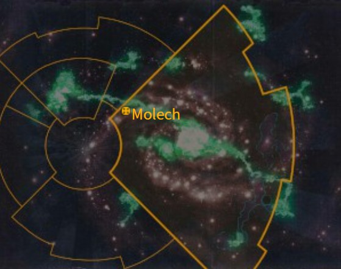

# 1018 摩洛 Molech

精校状态：中文行文已逐段精校，部分术语仍为暂定

分类：地理 / 小行星 / 极限星域 Ultima Segmentum

原文来源：https://www.bilibili.com/opus/1053723123177750545

原作者：帝国神选罐头

原文时间：2025年04月09日 13:43

[返回分类目录](目录.md) · [全书目录](../../目录.md)

<!-- A1018-B0001 图片 -->

<!-- A1018-B0002 -->

原译文

Map 地图

**校订译文**

Map 地图

<!-- /A1018-B0002 -->

<!-- A1018-B0003 -->
### Basic Data 基本资料

原题：Basic Data 基础数据

<!-- /A1018-B0003 -->

<!-- A1018-B0004 -->
**英文原文**

Name:Molech

<!-- /A1018-B0004 -->

<!-- A1018-B0005 -->

原译文

名称：摩洛

**校订译文**

名称：摩洛

<!-- /A1018-B0005 -->

<!-- A1018-B0006 -->
**英文原文**

Segmentum:Ultima Segmentum

<!-- /A1018-B0006 -->

<!-- A1018-B0007 -->

原译文

星域：极限星域

**校订译文**

星域：极限星域

<!-- /A1018-B0007 -->

<!-- A1018-B0008 -->
**英文原文**

Affiliation:Imperium

<!-- /A1018-B0008 -->

<!-- A1018-B0009 -->

原译文

附属：帝国

**校订译文**

附属：帝国

<!-- /A1018-B0009 -->

<!-- A1018-B0010 -->
**英文原文**

Class:Knight World,Fortress World

<!-- /A1018-B0010 -->

<!-- A1018-B0011 -->

原译文

类别：骑士世界，堡垒世界

**校订译文**

类别：骑士世界、要塞世界

<!-- /A1018-B0011 -->

<!-- A1018-B0012 -->
**英文原文**

Molech is a world of the Imperium. The planet was home to the ancient Knight House of Devine, who worshiped a snake-like god and became the site of a major battle during the Horus Heresy.

<!-- /A1018-B0012 -->

<!-- A1018-B0013 -->

原译文

摩洛是一个帝国的世界。这个星球是古老的迪瓦恩骑士家族的所在地，崇拜一个蛇形的神，并成为荷鲁斯叛乱期间一场重大战斗的地点。

**校订译文**

摩洛是帝国世界，也是古老的德维纳骑士家族的家园。该家族崇拜一位蛇形神祇；荷鲁斯之乱期间，这颗星球成为一场大战的战场。

<!-- /A1018-B0013 -->

<!-- A1018-B0014 -->
## Geography 地理

<!-- /A1018-B0014 -->

<!-- A1018-B0015 -->
**英文原文**

Molech is close in size and orbit to Terra and has a moon of similar size and scope. Four major continents exist: Estara, Neuropia, Arcanius, and Molechari. Much of Molech is home to thick jungles filled with savage beasts that its Knight Houses keep at bay or hunt for sport.

<!-- /A1018-B0015 -->

<!-- A1018-B0016 -->

原译文

摩洛在大小和轨道上与泰拉接近，并且有一个大小和范围相似的月球。存在四个主要大陆：埃斯塔拉、纽罗皮亚、阿卡尼乌斯和莫勒查里。摩洛的大部分地区都是茂密丛林的家园，丛林里到处都是野兽，骑士们会把它们拒之门外或狩猎作为消遣。

**校订译文**

摩洛的大小与公转轨道条件近似泰拉，还拥有一颗规模相仿的卫星。星球上有四块主要大陆：埃斯塔拉、纽罗皮亚、阿卡尼乌斯和莫勒查里。大部分地区丛林茂密、猛兽横行，当地骑士家族负责抵御它们，有时也以狩猎为乐。

**校注：** 英文未明确similar size and scope的卫星比较对象；保留相似的概括，不擅填具体半径或认作与行星本体同样大。

<!-- /A1018-B0016 -->

<!-- A1018-B0017 -->
### Notable Locations 著名地点

<!-- /A1018-B0017 -->

<!-- A1018-B0018 -->
**英文原文**

Western Marches - Stretch out along the western edges of the continent of Molechari.

<!-- /A1018-B0018 -->

<!-- A1018-B0019 -->

原译文

西部边界 - 沿着莫勒查里大陆的西部边缘延伸。

**校订译文**

西部边疆：沿莫勒查里大陆西缘延伸。

<!-- /A1018-B0019 -->

<!-- A1018-B0020 -->
**英文原文**

Lupercalia — Capital. Unknown to the inhabitants of Molech, an ancient portal to the Realm of Chaos exists underneath its surface. Who or what built this portal originally is unknown.

<!-- /A1018-B0020 -->

<!-- A1018-B0021 -->

原译文

牧狼神 — 首都。摩洛的居民不知道，在其表面之下存在着一个通往混沌领域的古老门户。最初是谁或什么建造了这个门户尚不清楚。

**校订译文**

卢佩卡利亚：首都。居民并不知道，这座城市地下藏着一道通往混沌领域的古老门户，其建造者身份不明。

**校注：** Lupercalia为纪念Horus Lupercal的城市名，暂译卢佩卡利亚，原牧狼神误当神祇。

<!-- /A1018-B0021 -->

<!-- A1018-B0022 -->
**英文原文**

Dawn Citadel — Massive fortress built around the spacecraft the Emperor used to originally arrive on Molech. Seat of House Devine

<!-- /A1018-B0022 -->

<!-- A1018-B0023 -->

原译文

黎明城堡 — 围绕帝皇最初抵达摩洛的宇宙飞船建造的大型堡垒。迪瓦恩家族所在地

**校订译文**

黎明城堡：以帝皇最初抵达摩洛时乘坐的飞船为中心建成的庞大要塞，也是德维纳家族的驻地。

<!-- /A1018-B0023 -->

<!-- A1018-B0024 -->
**英文原文**

Zanark Deeps — Seat of the Legio Fortidus

<!-- /A1018-B0024 -->

<!-- A1018-B0025 -->

原译文

扎纳克深渊 — 坚垒军团所在地

**校订译文**

扎纳克深渊 — 坚垒军团所在地

<!-- /A1018-B0025 -->

<!-- A1018-B0026 -->
**英文原文**

Damesek - Site of the Emperor's original arrival of Molech. Island with a now-mythical status said to be where the Lord of Storms began his pilgrimage to the land that would eventually become known as Lupercalia.

<!-- /A1018-B0026 -->

<!-- A1018-B0027 -->

原译文

达梅塞克 - 帝皇最初抵达摩洛的地点。这座岛屿现在具有神话般的地位，据说是风暴领主开始朝着最终被称为牧狼神的土地朝圣的地方。

**校订译文**

达梅塞克：帝皇最初抵达摩洛的地方。如今，这座岛屿已具有神话地位；据说风暴领主正是在这里开始朝圣，前往日后称为卢佩卡利亚的土地。

<!-- /A1018-B0027 -->

<!-- A1018-B0028 -->
**英文原文**

Avadon — City

<!-- /A1018-B0028 -->

<!-- A1018-B0029 -->

原译文

阿瓦登 — 城市

**校订译文**

阿瓦登 — 城市

<!-- /A1018-B0029 -->

<!-- A1018-B0030 -->
**英文原文**

Desqua — City

<!-- /A1018-B0030 -->

<!-- A1018-B0031 -->

原译文

德丝卡 — 城市

**校订译文**

德丝卡 — 城市

<!-- /A1018-B0031 -->

<!-- A1018-B0032 -->
**英文原文**

Larsa - City

<!-- /A1018-B0032 -->

<!-- A1018-B0033 -->

原译文

拉尔萨 — 城市

**校订译文**

拉尔萨 — 城市

<!-- /A1018-B0033 -->

<!-- A1018-B0034 -->
**英文原文**

Khanis — City

<!-- /A1018-B0034 -->

<!-- A1018-B0035 -->

原译文

卡尼斯 — 城市

**校订译文**

卡尼斯 — 城市

<!-- /A1018-B0035 -->

<!-- A1018-B0036 -->
**英文原文**

Goshen — City

<!-- /A1018-B0036 -->

<!-- A1018-B0037 -->

原译文

戈申 — 城市

**校订译文**

戈申 — 城市

<!-- /A1018-B0037 -->

<!-- A1018-B0038 -->
**英文原文**

Imperatum — City

<!-- /A1018-B0038 -->

<!-- A1018-B0039 -->

原译文

英佩拉图姆 — 城市

**校订译文**

英佩拉图姆 — 城市

<!-- /A1018-B0039 -->

<!-- A1018-B0040 -->
**英文原文**

Leosta — Fortress

<!-- /A1018-B0040 -->

<!-- A1018-B0041 -->

原译文

莱奥斯塔 — 堡垒

**校订译文**

莱奥斯塔 — 堡垒

<!-- /A1018-B0041 -->

<!-- A1018-B0042 -->
**英文原文**

Luthre — Fortress

<!-- /A1018-B0042 -->

<!-- A1018-B0043 -->

原译文

卢斯雷 — 堡垒

**校订译文**

卢斯雷 — 堡垒

<!-- /A1018-B0043 -->

<!-- A1018-B0044 -->
**英文原文**

Ambrosius Radial - Agricultural region and gateway to Untar Mesas.

<!-- /A1018-B0044 -->

<!-- A1018-B0045 -->

原译文

安布罗修斯辐射 - 通往农业区和昂塔尔台地的门户。

**校订译文**

安布罗修斯放射区：农业区，也是通往昂塔尔台地的门户。

**校注：** 原文为农业区本身兼通往台地的门户，不是通往农业区；Radial按地名暂译放射区，不推断核辐射。

<!-- /A1018-B0045 -->

<!-- A1018-B0046 -->
**英文原文**

Untar Mesas - Hinterland.

<!-- /A1018-B0046 -->

<!-- A1018-B0047 -->

原译文

昂塔尔台地 - 内陆

**校订译文**

昂塔尔台地 - 内陆

<!-- /A1018-B0047 -->

<!-- A1018-B0048 -->
**英文原文**

Iron Fist Mountain — Seat of the Legio Crucius

<!-- /A1018-B0048 -->

<!-- A1018-B0049 -->

原译文

铁拳山脉 — 好战者军团所在地

**校订译文**

铁拳山：十字军团的驻地。

**校注：** Legio Crucius沿828十字军团；Mountain为山而非山脉。

<!-- /A1018-B0049 -->

<!-- A1018-B0050 -->
**英文原文**

Torger Mountain — Seat of the Ordo Reductor

<!-- /A1018-B0050 -->

<!-- A1018-B0051 -->

原译文

托尔格山脉 — 源还修会所在地

**校订译文**

托尔格山：源还修会的驻地。

<!-- /A1018-B0051 -->

<!-- A1018-B0052 -->
**英文原文**

Southern Steppes - Also known as the Tazkhar Steppes on the far side of Untar Mesas.

<!-- /A1018-B0052 -->

<!-- A1018-B0053 -->

原译文

南部草原-也被称为昂塔尔台地远端的塔兹哈尔草原。

**校订译文**

南部草原：又称塔兹哈尔草原，位于昂塔尔台地远端。

<!-- /A1018-B0053 -->

<!-- A1018-B0054 -->
**英文原文**

Kalman Point — Seat of the Legio Gryphonicus

<!-- /A1018-B0054 -->

<!-- A1018-B0055 -->

原译文

卡尔曼点 — 狮鹫军团的所在地

**校订译文**

卡尔曼点：狮鹫军团的驻地。

<!-- /A1018-B0055 -->

<!-- A1018-B0056 -->
**英文原文**

Kush - Eastern Jungle region home to many dangerous wild beasts

<!-- /A1018-B0056 -->

<!-- A1018-B0057 -->

原译文

库什 - 东部丛林地区是许多危险野兽的家园

**校订译文**

库什：东部丛林地区，栖息着众多危险野兽。

<!-- /A1018-B0057 -->

<!-- A1018-B0058 -->
**英文原文**

Archmaga - City

<!-- /A1018-B0058 -->

<!-- A1018-B0059 -->

原译文

阿奇玛伽 - 城市

**校订译文**

阿奇玛伽 - 城市

<!-- /A1018-B0059 -->

<!-- A1018-B0060 -->
**英文原文**

Preceptory Line — Defensive line, seat of House Donar

<!-- /A1018-B0060 -->

<!-- A1018-B0061 -->

原译文

领地线 — 防御线，多纳尔家族所在地

**校订译文**

领地线 — 防御线，多纳尔家族所在地

<!-- /A1018-B0061 -->

<!-- A1018-B0062 -->
**英文原文**

Ophir - Known as the City Without Shadows

<!-- /A1018-B0062 -->

<!-- A1018-B0063 -->

原译文

欧菲尔 - 被称为没有阴影的城市

**校订译文**

欧菲尔：号称“无影之城”。

<!-- /A1018-B0063 -->

<!-- A1018-B0064 -->
**英文原文**

Northern Oceans - Many island chains that connect Molechari to the rest of the planet.

<!-- /A1018-B0064 -->

<!-- A1018-B0065 -->

原译文

北方大洋 - 许多岛链将莫勒查里与星球其他地区连接起来。

**校订译文**

北方大洋：其中的众多岛链将莫勒查里与星球其余地区连接起来。

<!-- /A1018-B0065 -->

<!-- A1018-B0066 -->
**英文原文**

Hvitha - Seat of House Mamaragon.

<!-- /A1018-B0066 -->

<!-- A1018-B0067 -->

原译文

赫维萨 - 玛玛拉贡家族所在地

**校订译文**

赫维萨 - 玛玛拉贡家族所在地

<!-- /A1018-B0067 -->

<!-- A1018-B0068 -->

原译文

Aenatep Peninsula 埃涅泰普半岛

**校订译文**

Aenatep Peninsula 埃涅泰普半岛

<!-- /A1018-B0068 -->

<!-- A1018-B0069 -->

原译文

Clockwork City 发条城

**校订译文**

Clockwork City 发条城

<!-- /A1018-B0069 -->

<!-- A1018-B0070 -->
**英文原文**

Novamatia — Spaceport

<!-- /A1018-B0070 -->

<!-- A1018-B0071 -->

原译文

诺瓦马蒂亚 — 太空港

**校订译文**

诺瓦马蒂亚 — 太空港

<!-- /A1018-B0071 -->

<!-- A1018-B0072 -->
**英文原文**

Loqash — Spaceport

<!-- /A1018-B0072 -->

<!-- A1018-B0073 -->

原译文

洛卡什 — 太空港

**校订译文**

洛卡什 — 太空港

<!-- /A1018-B0073 -->

<!-- A1018-B0074 -->
**英文原文**

Citadel of the Storm — Seat of the Blood Angels garrison on Molech,

<!-- /A1018-B0074 -->

<!-- A1018-B0075 -->

原译文

风暴城堡 — 摩洛的圣血天使守备部队所在地，

**校订译文**

风暴城堡：圣血天使驻摩洛守军的驻地。

<!-- /A1018-B0075 -->

<!-- A1018-B0076 -->
## History 历史

<!-- /A1018-B0076 -->

<!-- A1018-B0077 -->
**英文原文**

Being very similar to Terra, Molech was targeted early for colonization by Humanity. Due to the savage beasts that roam the world, Knight suits became necessary for the colonists survival and eventually Knight Houses formed and became the supreme authority. Sometime during the Dark Age of Technology, it is said that the Emperor along with several other Perpetuals such as Alivia Sureka traveled to Molech on a one-way spacecraft. There, they found a gateway into the Realm of Chaos which the Emperor entered, making a bargain with the Dark Gods and becoming imbued with new powers and the knowledge to create the Primarchs. The Emperor left Sureka behind to look after the Gate.

<!-- /A1018-B0077 -->

<!-- A1018-B0078 -->

原译文

由于与泰拉非常相似，摩洛很早就成为了人类殖民的目标。由于世界上游荡着野兽，骑士机甲成为殖民者生存的必要条件，最终骑士家族成立并成为最高权威。在黑暗科技时代的某个时候，据说帝皇和其他几个永生者，如阿利维亚·苏雷卡，乘坐单向宇宙飞船前往摩洛。在那里，他们找到了一个通往混沌领域的门户，帝皇进入了这个领域，与黑暗诸神达成了协议，并被赋予了制造原体的新力量和知识。帝皇留下苏雷卡照看门户。

**校订译文**

摩洛与泰拉十分相似，因此很早就成为人类殖民目标。当地猛兽横行，殖民者必须依靠骑士机甲才能生存，骑士家族由此形成，并逐渐掌握最高权力。据说，黑暗科技时代的某个时期，帝皇与阿利维亚·苏雷卡等几位永生者，乘坐只能单程航行的飞船来到摩洛。他们找到一扇通往混沌领域的门，帝皇进入其中，与黑暗诸神达成交易，获得新力量及创造原体的知识。离开时，他将苏雷卡留在当地守护门户。

**校注：** 帝皇与诸神交易的叙述由原文“it is said”限定，保留传闻属性。

<!-- /A1018-B0078 -->

<!-- A1018-B0079 -->
**英文原文**

During the Age of Strife, Molech's ancient Knight Houses protected the world from the horrors of Old Night. Later in 869.M30, Molech itself was brought into the fledgling Imperium during the Great Crusade by a combined force of Dark Angels, Luna Wolves, Emperor's Children, and White Scars each led by their respective Primarchs, who banned the worship of their serpent god in favor of the Imperial Truth. The Emperor accompanied them, and erased from each Primarch's minds the planet's significance, while leaving behind a substantial force to garrison the world to ensure none could use the same gateway to the Warp he had. The Knight House of Devine came to dominate the world, and the city of Lupercalia, built in honour of Horus Lupercal, was constructed over the cave network where the Warp Gate was located.

<!-- /A1018-B0079 -->

<!-- A1018-B0080 -->

原译文

在纷争时代，摩洛古老的骑士家族保护世界免受旧夜的恐怖。869.M30的晚些时候，在大远征期间，黑暗天使、影月苍狼、帝皇之子和白色疤痕的联合部队将摩洛引入了羽翼未丰的帝国，每个军团都由各自的原体领导，他们禁止崇拜他们的蛇神，支持帝国真理。帝皇陪伴着他们，从每个原体的脑海中抹去了这个星球的重要性，同时留下了一支庞大的部队来守卫世界，以确保没有人能使用他得到的通往亚空间的同一扇门。迪瓦恩骑士家族统治了世界，为纪念荷鲁斯·卢佩卡尔而建的牧狼神城建在亚空间门户所在的洞穴网络之上。

**校订译文**

纷争时代，摩洛古老的骑士家族保护着当地居民，使其免遭旧夜中的恐怖侵袭。后来在869.M30，黑暗天使、影月苍狼、帝皇之子与白疤由各自原体率领，在大远征中使摩洛归入初生帝国。他们禁止当地蛇神崇拜，推行帝国真理。帝皇也随行，并抹去各原体关于摩洛重要性的记忆，留下强大驻军，防止任何人利用自己曾穿越的亚空间门户。德维纳家族随后取得统治地位，为纪念荷鲁斯·卢佩卡尔而建的卢佩卡利亚城，则坐落于门户所在的地下洞穴网络之上。

**校注：** Later in 869.M30意为后来在该年，非869.M30晚些时候。House Devine依据较早同一家族成员雷文／阿尔巴德·德维纳统一姓氏词根。

<!-- /A1018-B0080 -->

<!-- A1018-B0081 -->
**英文原文**

During the Horus Heresy, the planet was the site of a major invasion by the Sons of Horus and the Death Guard, led by Horus Lupercal and Mortarion, as Horus had regained his memory of the gateway and sought to obtain the same powers the Emperor had attained. The planet was conquered by traitor forces after House Devine turned rogue, with only a hundred survivors from the planet escaping. Later after Horus' defeat, Molech was liberated during the Great Scouring.

<!-- /A1018-B0081 -->

<!-- A1018-B0082 -->

原译文

在荷鲁斯叛乱期间，这个星球是由荷鲁斯·卢佩卡尔和莫塔里安领导的荷鲁斯之子和死亡守卫大规模入侵的地点，因为荷鲁斯已经恢复了对门户的记忆，并试图获得与帝皇相同的力量。在迪瓦恩家族变得暴戾后，这个星球被叛徒势力征服，只有100名幸存者逃离了这个星球。荷鲁斯战败后，摩洛在大清洗中获得解放。

**校订译文**

荷鲁斯恢复了关于门户的记忆，企图取得帝皇曾获得的力量。因此，荷鲁斯之乱期间，他与莫塔里安分别率荷鲁斯之子和死亡守卫大举入侵摩洛。德维纳家族倒戈后，叛军征服了整颗星球，只有一百名幸存者成功逃离。荷鲁斯战败后，摩洛在大清洗中获得解放。

**校注：** turned rogue在此为倒戈叛变，非性格变得暴戾。

<!-- /A1018-B0082 -->

本篇核心术语与暂定项

以下列出本篇出现的英文原形及核心术语表用词。同形词可能指不同对象，具体词义以本篇正文和校注为准；单复数、别名和仅见于图注的名称可能尚未列入。完整候选见[术语表](../../术语表/双语术语候选.csv)。

| 英文 | 采用中文 | 状态 |
| --- | --- | --- |
| Blood Angels | 圣血天使 | 官方已核对 |
| Dark Angels | 黑暗天使 | 官方已核对 |
| Death Guard | 死亡守卫 | 官方已核对 |
| Horus Heresy | 荷鲁斯之乱 | 官方已核对 |
| Warp | 亚空间 | 官方已核对 |
| Imperium | 帝国 | 暂定·简称 |
| Dark Age of Technology | 黑暗科技时代 | 暂定 |
| Emperor | 帝皇 | 官方已核对 |
| Primarch | 原体 | 官方已核对 |
| Emperor's Children | 帝皇之子 | 官方已核对 |
| Great Crusade | 大远征 | 暂定·官方待核 |
| Mortarion | 莫塔里安 | 官方已核对 |
| Age of Strife | 纷争时代 | 暂定·官方待核 |
| Terra | 泰拉 | 暂定·官方待核 |
| Luna Wolves | 影月苍狼 | 暂定·官方待核 |
| Horus | 荷鲁斯 | 暂定·官方待核 |
| Sons of Horus | 荷鲁斯之子 | 暂定·官方待核 |
| Ordo Reductor | 源还修会 | 暂定·官方待核 |
| Ultima Segmentum | 极限星域 | 暂定·官方待核 |
| Segmentum | 星域 | 暂定·官方待核 |
| Alivia Sureka | 阿利维亚·苏雷卡 | 暂定·官方待核 |
| Realm of Chaos | 混沌领域 | 暂定·官方待核 |
| Old Night | 旧夜 | 暂定·官方待核 |
| Luna | 月球 | 暂定·官方待核 |
| Molech | 摩洛 | 暂定·官方待核 |
| Imperial Truth | 帝国真理 | 暂定·官方待核 |
| Ancient | 旗手 | 官方已核对 |
| Horus Lupercal | 荷鲁斯·卢佩卡尔 | 暂定·官方待核 |
| Lupercal | 卢佩卡尔 | 暂定·官方待核 |
| White Scars | 白疤 | 官方已核 |
| The Primarchs | 原体 | 暂定·官方待核 |
| Scars | 伤疤 | 暂定·官方待核 |
| Powers | 能天使 | 暂定·官方待核 |
| Reductor | 基因提取器 | 暂定·官方待核 |
| Legio Gryphonicus | 狮鹫军团 | 暂定·官方待核 |
| Great Scouring | 大清洗 | 暂定·官方待核 |
| Western Marches | 西部边境 | 暂定·官方待核 |
| The Dark | 《黑暗》 | 暂定·官方待核 |
| The Blood | 鲜血 | 暂定·官方待核 |
| Fortress World | 堡垒世界 | 暂定·官方待核 |
| Knight World | 骑士世界 | 暂定·官方待核 |
| Knight House | 骑士家族 | 暂定·官方待核 |
| Legio Crucius | 十字军团 | 暂定·官方待核 |
| Lupercalia | 卢佩卡利亚 | 暂定·官方待核 |
| House Devine | 德维纳家族 | 暂定·官方待核 |
| Ambrosius Radial | 安布罗修斯放射区 | 暂定·官方待核 |

