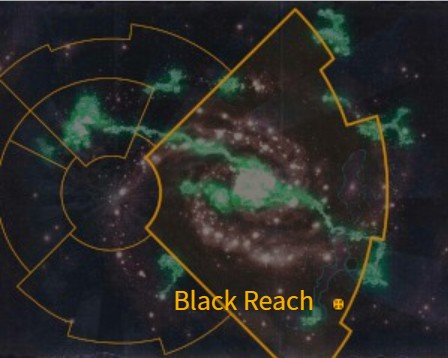

# 1019 黑域 Black Reach

精校状态：中文行文已逐段精校，部分术语仍为暂定

分类：地理 / 小行星 / 极限星域 Ultima Segmentum

原文来源：https://www.bilibili.com/opus/1153202837910454274

原作者：帝国神选罐头

原文时间：2026年01月02日 15:35

[返回分类目录](目录.md) · [全书目录](../../目录.md)

原篇名：黑峡 Black Reach

<!-- A1019-B0001 图片 -->

<!-- A1019-B0002 -->

原译文

Map 地图

**校订译文**

Map 地图

<!-- /A1019-B0002 -->

<!-- A1019-B0003 -->
### Basic Data 基本资料

原题：Basic Data 基础信息

<!-- /A1019-B0003 -->

<!-- A1019-B0004 -->
**英文原文**

Name:Black Reach

<!-- /A1019-B0004 -->

<!-- A1019-B0005 -->

原译文

名称：黑域星

**校订译文**

名称：黑域

<!-- /A1019-B0005 -->

<!-- A1019-B0006 -->
**英文原文**

Segmentum:Ultima Segmentum

<!-- /A1019-B0006 -->

<!-- A1019-B0007 -->

原译文

星域：极限星域

**校订译文**

星域：极限星域

<!-- /A1019-B0007 -->

<!-- A1019-B0008 -->
**英文原文**

Affiliation:Imperium

<!-- /A1019-B0008 -->

<!-- A1019-B0009 -->

原译文

隶属：帝国

**校订译文**

隶属：帝国

<!-- /A1019-B0009 -->

<!-- A1019-B0010 -->
**英文原文**

Class:Hive World

<!-- /A1019-B0010 -->

<!-- A1019-B0011 -->

原译文

类别：巢都世界

**校订译文**

类别：巢都世界

<!-- /A1019-B0011 -->

<!-- A1019-B0012 -->
**英文原文**

Black Reach (possibly Blackreach) is a large Hive World located in the south of the Ultima Segmentum, not far from the planetary realm of Ultramar and the Ultramarines homeworld of Macragge.

<!-- /A1019-B0012 -->

<!-- A1019-B0013 -->

原译文

黑域星（可能是黑峡）是一个位于极限星域南部的大型巢都世界，距离奥特拉玛的行星域和极限战士家园世界马库拉格不远。

**校订译文**

黑域是极限星域南部的大型巢都世界，距离奥特拉玛诸世界及极限战士家园马库拉格不远；其英文名称可能也拼作 Blackreach。

**校注：** 括号说明的是Black Reach／Blackreach的英文拼写变体，不是两个不同中文地名；统一已定黑域。

<!-- /A1019-B0013 -->

<!-- A1019-B0014 -->
**英文原文**

It is probably best known for the incident known as the Assault on Black Reach in 855.M41, in which Waaagh! Zanzag descended on the planet and was eventually defeated by the Ultramarines' 2nd Company, under Captain Cato Sicarius.

<!-- /A1019-B0014 -->

<!-- A1019-B0015 -->

原译文

它可能最为人所知的是855.M41的黑域突袭事件，其中赞扎格的Waaagh！降落在这个行星上，最终被卡托·西卡留斯连长率领的极限战士第二连队击败。

**校订译文**

它最著名的事件或许是855.M41的黑域突袭：赞扎格率领 Waaagh! 入侵这颗星球，最终被卡托·西卡留斯连长指挥的极限战士第二连击败。

<!-- /A1019-B0015 -->

本篇核心术语与暂定项

以下列出本篇出现的英文原形及核心术语表用词。同形词可能指不同对象，具体词义以本篇正文和校注为准；单复数、别名和仅见于图注的名称可能尚未列入。完整候选见[术语表](../../术语表/双语术语候选.csv)。

| 英文 | 采用中文 | 状态 |
| --- | --- | --- |
| Ultramar | 奥特拉玛 | 官方已核对 |
| Ultramarines | 极限战士 | 官方已核对 |
| Imperium | 帝国 | 暂定·简称 |
| Waaagh! | Waaagh! | 暂定·保留原文 |
| Hive World | 巢都世界 | 暂定·官方待核 |
| Ultima Segmentum | 极限星域 | 暂定·官方待核 |
| Segmentum | 星域 | 暂定·官方待核 |
| Black Reach | 黑域 | 暂定·官方待核 |
| Macragge | 马库拉格 | 暂定·官方待核 |
| Captain | 连长 | 暂定·官方待核 |
| Cato Sicarius | 卡托·西卡留斯 | 暂定·官方待核 |
| Realm of Ultramar | 奥特拉玛领地 | 暂定·官方待核 |

