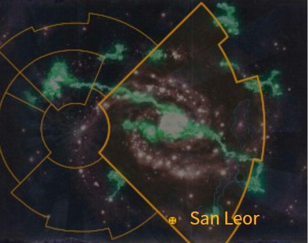

# 1021 桑洛尔 San Leor

精校状态：中文行文已逐段精校，部分术语仍为暂定

分类：地理 / 小行星 / 极限星域 Ultima Segmentum

原文来源：https://www.bilibili.com/opus/1156891050879483906

原作者：帝国神选罐头

原文时间：2026年01月12日 14:08

[返回分类目录](目录.md) · [全书目录](../../目录.md)

原篇名：圣莱奥尔 San Leor

<!-- A1021-B0001 图片 -->

<!-- A1021-B0002 -->

原译文

Map 地图

**校订译文**

Map 地图

<!-- /A1021-B0002 -->

<!-- A1021-B0003 -->
### Basic Data 基本资料

原题：Basic Data 基础数据

<!-- /A1021-B0003 -->

<!-- A1021-B0004 -->
**英文原文**

Name:San Leor

<!-- /A1021-B0004 -->

<!-- A1021-B0005 -->

原译文

名称：圣莱奥尔

**校订译文**

名称：桑洛尔

<!-- /A1021-B0005 -->

<!-- A1021-B0006 -->
**英文原文**

Segmentum:Ultima Segmentum

<!-- /A1021-B0006 -->

<!-- A1021-B0007 -->

原译文

星域：极限星域

**校订译文**

星域：极限星域

<!-- /A1021-B0007 -->

<!-- A1021-B0008 -->
**英文原文**

Affiliation:Imperium

<!-- /A1021-B0008 -->

<!-- A1021-B0009 -->

原译文

隶属：帝国

**校订译文**

隶属：帝国

<!-- /A1021-B0009 -->

<!-- A1021-B0010 -->
**英文原文**

Class:Agri World

<!-- /A1021-B0010 -->

<!-- A1021-B0011 -->

原译文

类别：农业世界

**校订译文**

类别：农业世界

<!-- /A1021-B0011 -->

<!-- A1021-B0012 -->
**英文原文**

San Leor is an Agri World of the Imperium that dates back at least to the Age of Apostasy.

<!-- /A1021-B0012 -->

<!-- A1021-B0013 -->

原译文

圣莱奥尔是帝国的农业世界，至少可以追溯到叛教时代。

**校订译文**

桑洛尔是帝国的农业世界，其历史至少可追溯至叛教时代。

<!-- /A1021-B0013 -->

<!-- A1021-B0014 -->
## History 历史

<!-- /A1021-B0014 -->

<!-- A1021-B0015 -->
**英文原文**

An Imperial Cult formed on San Leor prior to the Age of Apostasy; an all-female and militant Sisterhood devoted to worship of the Emperor of Mankind through inner purity called the Daughters of the Emperor. This cult was the subject of Ecclesiarch Goge Vandire's visit to the planet, where a hundred thousand servants and soldiers formed a procession miles long to reach the temple of the Daughters, the streets lined with citizens from start to finish to celebrate and show respect to the Ecclesiarch at the behest of a Lasgun at their backs, typical of the Reign of Blood.

<!-- /A1021-B0015 -->

<!-- A1021-B0016 -->

原译文

叛教时代之前在圣莱奥尔形成的帝国教派；一个全女性和好战的修女会，致力于通过内在的纯洁来崇拜人类帝皇，被称为帝皇之女。这个教派是教宗高戈·范迪尔到访这个行星的主题，在那里，十万仆人和士兵组成了长达数英里的游行队伍，到达了修女们的圣殿，街道上从头到尾都挤满了市民，在他们背后的激光枪的命令下庆祝和尊重教宗，这是典型的血腥统治。

**校订译文**

叛教时代以前，桑洛尔形成了一个帝皇信仰教团，称为“帝皇之女”。这是一支完全由女性组成、崇尚武力的姐妹会，通过保持内心纯洁来敬拜人类帝皇。国教教宗高戈·范迪尔为此亲临当地；十万仆从与士兵组成绵延数英里的队伍，向帝皇之女的圣殿行进。沿途街道挤满庆贺并向教宗致敬的居民，只不过，他们的背后都有激光枪逼迫——这正是血腥统治的典型景象。

**校注：** San Leor沿865已定桑洛尔。Imperial Cult按帝皇信仰理解，非一般帝国行政组织；居民庆贺是在枪口胁迫之下。

<!-- /A1021-B0016 -->

<!-- A1021-B0017 -->
**英文原文**

At this time, the Daughters numbered some five hundred members. The Ecclesiarch was initially barred from the temple, but the Sisterhood became convinced of the Ecclesiarch's divine favor upon the demonstration of a Rosarius, indicating that the world was not too familiar with rare and advanced forms of technology. The entire cult was promptly made High Lord Vandire's personal bodyguard and was renamed to the Brides of the Emperor and moved to Terra, where many years later the cult served as the foundation for the Adepta Sororitas, thus making San Leor the Sisterhood's home planet.

<!-- /A1021-B0017 -->

<!-- A1021-B0018 -->

原译文

此时，帝皇之女的成员约有五百人。教宗最初被禁止进入圣殿，但修女会在玫瑰念珠的证明下相信了教宗的神圣恩惠，这表明世界对稀有和先进的技术形式并不太熟悉。整个教派很快被任命为高领主范迪尔的个人护卫，并更名为“帝皇新娘”，搬到了泰拉，多年后，该教派成为了修女会的基础，从而使圣莱奥尔成为修女会的家园行星。

**校订译文**

当时，帝皇之女约有五百名成员。姐妹会起初拒绝让教宗进入圣殿，但范迪尔展示玫瑰念珠的防护效果后，她们便相信他蒙受神恩；这也说明当地人并不熟悉稀有的先进技术。整个教团随即成为至高领主范迪尔的私人卫队，更名为“帝皇新娘”，迁往泰拉。多年以后，她们成为修女会建立的基础，使桑洛尔被视为修女会的发源地。

**校注：** 原文以Rosarius展示说明误认技术为神恩；按该器具防护功能译，不作真正显圣认证。

<!-- /A1021-B0018 -->

<!-- A1021-B0019 -->
**英文原文**

The planet was invaded by the Red Corsairs in 799.M41, culminating in the San Leor Massacre when six Orders Militant of the Adepta Sororitas brought retribution with a counter-attack that annihilated the invading Chaos Space Marines.

<!-- /A1021-B0019 -->

<!-- A1021-B0020 -->

原译文

799.M41，红海盗入侵了这颗行星，最终导致了圣莱奥尔大屠杀，当时修女会的六个军事修会发动反击，消灭了入侵的混沌星际战士。

**校订译文**

799.M41，红海盗入侵桑洛尔。修女会六个战斗修会发动报复性反击，将来犯的混沌星际战士尽数消灭，这场战事最终以桑洛尔大屠杀告终。

<!-- /A1021-B0020 -->

<!-- A1021-B0021 -->
**英文原文**

A hundred years before the Great Rift appeared, San Leor was engulfed in a Warp Storm and remained within its clutches until then. The Abbess of the Adepta Sororitas traditionally makes a pilgrimage to San Leor before her inauguration to the post. Sister Sabrina, then having been recently elected Abbess, disappeared when she attempted to make the journey. In truth, she and her Sisters became embattled on San Leor against the forces of the Alpha Legion, Daemons, and Traitor Guard. They survived only thanks to a church bell which drove away the Chaos forces every time it rang. The powers of the Warp and the mysterious church bell kept the Sisters alive in this state of conflict for over a century. During the early stages of the Indomitus Crusade Saint Celestine, Inquisitor Greyfax, Longinus, and Black Templars Marshal Godshelm traveled to San Leor in their efforts to protect Ecclesiarch Decius XXIII. They discovered the state of affairs on San Leor but lacked the forces to fully liberate it, leaving Sabrina and her sisters behind to continue the defense although promised Sabrina that they would return to her aid, and that for now she would be proclaimed acting Abbess of the Convent Sanctorum.

<!-- /A1021-B0021 -->

<!-- A1021-B0022 -->

原译文

在大裂隙出现的一百年前，圣莱奥尔被一场亚空间风暴吞没，并一直处于其控制之下。修女会的修道院长传统上会在就职典礼前前往圣莱奥尔朝圣。萨布丽娜修女最近被选为修道院长，在她试图踏上这段旅程时失踪了。事实上，她和她的修女们在圣莱奥尔与阿尔法军团、恶魔和叛徒卫队的部队交战。她们幸存下来，这要归功于教堂的钟声，每次钟声响起，都能赶走混沌部队。亚空间的力量和神秘的教堂钟声使修女们在这种冲突状态下存活了一个多世纪。在不屈远征的早期阶段，圣塞勒斯汀、审判官格雷法克斯、朗基努斯和黑色圣堂元帅神盔前往圣莱奥尔，努力保护教宗德修斯二十三世。他们发现了圣莱奥尔的事态，但缺乏完全解放它的部队，留下萨布丽娜和她的修女们继续防御，尽管他们向萨布丽娜承诺会回来帮助她，现在她被宣布为圣地修道院的代理院长。

**校订译文**

大裂隙出现前约一百年，桑洛尔被亚空间风暴吞没，此后一直受困其中。按照传统，修女会总院长在正式就任前，要赴桑洛尔朝圣。刚获选的萨布丽娜修女也踏上旅程，却就此失踪。实际上，她与姐妹们被困在桑洛尔，持续对抗阿尔法军团、恶魔和叛变的帝国卫队。她们赖以生存的是一口教堂钟，每当钟声响起，混沌军队便会退去。亚空间的力量与这口神秘钟声，使修女们在这样的战斗中坚持了一个多世纪。不屈远征初期，为保护教宗德修斯二十三世，圣塞莱斯汀、审判官格雷法克斯、朗基努斯和黑色圣堂元帅神盔来到桑洛尔。他们发现当地局势，却无力彻底解放星球，只能留下萨布丽娜与姐妹们继续坚守，同时承诺日后回援，并暂时宣布由她担任圣地修道院代理院长。

**校注：** Abbess of the Adepta Sororitas为修女会总院长，与后文Convent Sanctorum代理院长区分。人物圣塞莱斯汀依官译统一。

<!-- /A1021-B0022 -->

本篇核心术语与暂定项

以下列出本篇出现的英文原形及核心术语表用词。同形词可能指不同对象，具体词义以本篇正文和校注为准；单复数、别名和仅见于图注的名称可能尚未列入。完整候选见[术语表](../../术语表/双语术语候选.csv)。

| 英文 | 采用中文 | 状态 |
| --- | --- | --- |
| Space Marines | 星际战士 | 官方已核对 |
| Black Templars | 黑色圣堂 | 官方已核对 |
| Adepta Sororitas | 修女会 | 官方已核对 |
| Chaos Space Marines | 混沌星际战士 | 官方已核对 |
| Warp | 亚空间 | 官方已核对 |
| Great Rift | 大裂隙 | 官方已核对 |
| Inquisitor | 审判官 | 官方已核对 |
| Imperium | 帝国 | 暂定·简称 |
| Indomitus | 不屈学派 | 暂定·学派语境 |
| Emperor of Mankind | 人类帝皇 | 暂定 |
| Emperor | 帝皇 | 官方已核对 |
| Age of Apostasy | 叛教时代 | 暂定·官方待核 |
| Goge Vandire | 高戈·范迪尔 | 暂定·官方待核 |
| Brides of the Emperor | 帝皇新娘 | 暂定·官方待核 |
| Terra | 泰拉 | 暂定·官方待核 |
| Imperial Cult | 帝皇信仰 | 暂定·官方待核 |
| Indomitus Crusade | 不屈远征 | 暂定·官方待核 |
| Ultima Segmentum | 极限星域 | 暂定·官方待核 |
| Segmentum | 星域 | 暂定·官方待核 |
| San Leor | 桑洛尔 | 暂定·官方待核 |
| Ecclesiarch | 教宗 | 暂定 |
| Abbess of the Adepta Sororitas | 修女会总院长 | 暂定 |
| Orders Militant | 战斗修会（战斗修女）／武装骑士团（黑暗天使） | 语境定译·官方待核 |
| Saint Celestine | 圣塞莱斯汀 | 官方已核对 |
| Rosarius | 玫瑰念珠 | 暂定·官方待核 |
| Alpha Legion | 阿尔法军团 | 暂定·官方待核 |
| Powers | 能天使 | 暂定·官方待核 |
| Marshal | 元帅 | 官方已核对 |
| Inquisitor Greyfax | 审判官格雷法克斯 | 官方已核对 |
| Warp Storm | 亚空间风暴 | 暂定·官方待核 |
| Reign of Blood | 血腥统治 | 暂定·官方待核 |
| Daughters of the Emperor | 帝皇之女 | 暂定·官方待核 |
| Longinus | 朗基努斯 | 暂定·官方待核 |
| Convent Sanctorum | 圣地修道院 | 暂定·官方待核 |

