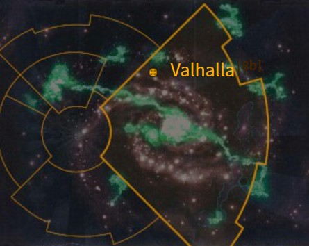
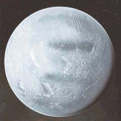

# 1022 瓦尔哈拉 Valhalla

精校状态：中文行文已逐段精校，部分术语仍为暂定

分类：地理 / 小行星 / 极限星域 Ultima Segmentum

原文来源：https://www.bilibili.com/opus/1163504222472241169

原作者：帝国神选罐头

原文时间：2026年01月30日 09:50

[返回分类目录](目录.md) · [全书目录](../../目录.md)

<!-- A1022-B0001 图片 -->

<!-- A1022-B0002 -->

原译文

Map 地图

**校订译文**

Map 地图

<!-- /A1022-B0002 -->

<!-- A1022-B0003 -->
### Basic Data 基本资料

原题：Basic Data 基础数据

<!-- /A1022-B0003 -->

<!-- A1022-B0004 -->
**英文原文**

Name:Valhalla

<!-- /A1022-B0004 -->

<!-- A1022-B0005 -->

原译文

名称：瓦尔哈拉

**校订译文**

名称：瓦尔哈拉

<!-- /A1022-B0005 -->

<!-- A1022-B0006 -->
**英文原文**

Segmentum:Ultima Segmentum

<!-- /A1022-B0006 -->

<!-- A1022-B0007 -->

原译文

星域：极限星域

**校订译文**

星域：极限星域

<!-- /A1022-B0007 -->

<!-- A1022-B0008 -->
**英文原文**

Affiliation:Imperium

<!-- /A1022-B0008 -->

<!-- A1022-B0009 -->

原译文

隶属：帝国

**校订译文**

隶属：帝国

<!-- /A1022-B0009 -->

<!-- A1022-B0010 -->
**英文原文**

Class:Civilised World, Ice World

<!-- /A1022-B0010 -->

<!-- A1022-B0011 -->

原译文

类别：文明世界，冰雪世界

**校订译文**

类别：文明世界，冰雪世界

<!-- /A1022-B0011 -->

<!-- A1022-B0012 图片 -->

<!-- A1022-B0013 -->

原译文

Planetary Image 行星图像

**校订译文**

Planetary Image 行星图像

<!-- /A1022-B0013 -->

<!-- A1022-B0014 -->
**英文原文**

Valhalla is an Imperial ice world classified as a Civilised World, famous as the home world of the Valhallan Ice Warriors regiments of the Imperial Guard.

<!-- /A1022-B0014 -->

<!-- A1022-B0015 -->

原译文

瓦尔哈拉是一个被列为文明世界的帝国冰雪世界，作为帝国卫队瓦尔哈拉冰雪战士兵团的家园世界而闻名。

**校订译文**

瓦尔哈拉是一个被列为文明世界的帝国冰雪世界，作为帝国卫队瓦尔哈拉冰雪战士兵团的家园世界而闻名。

<!-- /A1022-B0015 -->

<!-- A1022-B0016 -->
## History 历史

<!-- /A1022-B0016 -->

<!-- A1022-B0017 -->
**英文原文**

When it was first settled, Valhalla was a verdant world of forests and broad fertile plans, a paradise compared to the frozen ice world it would become. In legends - the only history of the early days of its colonization that survives - Valhalla was a world perfect for human settlement.

<!-- /A1022-B0017 -->

<!-- A1022-B0018 -->

原译文

瓦尔哈拉最初定居时，是一个郁郁葱葱的森林世界和广阔肥沃的行星，与它将成为的冻结冰雪世界相比，这是一个天堂。在传说中，瓦尔哈拉是人类定居的完美世界，这是其殖民早期唯一幸存的历史。

**校订译文**

瓦尔哈拉最初有人定居时，遍布苍翠森林与广袤肥沃的平原；与后来冰封的世界相比，宛如乐园。关于早期殖民史，如今只剩传说流传，而传说中的瓦尔哈拉极适合人类生活。

**校注：** 英文plans按语境为plains的误拼，指肥沃平原，原译行星不成立。

<!-- /A1022-B0018 -->

<!-- A1022-B0019 -->
**英文原文**

Ten thousand years ago, however, the planet was struck by an immense rogue comet which forever destroyed the paradise of the world. The defence lasers surrounding the planet blasted the comet with shot after shot, but only succeeded in breaking off fragments of the comet, which was found to consist of almost pure iron. A mile-wide fragment of the comet struck the northern continent, causing great earthquakes and destruction. The main comet hit the vast ocean which spanned most of the planet.

<!-- /A1022-B0019 -->

<!-- A1022-B0020 -->

原译文

然而，一万年前，这颗行星被一颗巨大的流浪彗星撞击，永远摧毁了世界的天堂。环绕行星的防御激光一次又一次地轰击彗星，但只成功地折断了彗星的碎片，发现彗星几乎由纯铁组成。一英里宽的彗星碎片撞击了北部大陆，造成了巨大的地震和破坏。彗星主体撞击了横跨行星大部分地区的广阔海洋。

**校订译文**

然而，一万年前，一颗巨大的流浪彗星撞击瓦尔哈拉，永久毁去了这片乐园。环绕行星的防御激光连续开火，却只能击落少量碎块；人们发现，这颗彗星几乎由纯铁构成。其中一块约一英里宽的碎片撞上北部大陆，引发剧烈地震与破坏，彗星主体则落入覆盖星球大部分面积的海洋。

<!-- /A1022-B0020 -->

<!-- A1022-B0021 -->
**英文原文**

The boiling seas and the pall of vapour and dust blocked off the sunlight. The temperature of the planet fell to freezing levels. Most significantly the comet had knocked the planet from its orbit, and over a period of ten years the planet spun eccentrically, drifting fifteen million miles away from its sun. By this point the planet had entirely changed. The vast majority of life had been destroyed, and the whole planet was covered in glaciers and a frozen ocean.

<!-- /A1022-B0021 -->

<!-- A1022-B0022 -->

原译文

沸腾的海水和水汽和尘土挡住了阳光。行星的温度降至冰点。最重要的是，这颗彗星将这颗行星从轨道上撞了下来，在十年的时间里，这颗行星偏心旋转，漂移了1500万英里远离太阳。到那时，行星已经完全改变了。绝大多数生命已被摧毁，整个行星被冰川和冰冻的海洋所覆盖。

**校订译文**

海水沸腾，蒸汽与尘埃遮天蔽日，使行星温度降至冰点。更严重的是，撞击使瓦尔哈拉偏离原有轨道。接下来的十年间，它运行失常，向远离恒星的方向漂移了一千五百万英里。此时，这颗星球已面目全非：绝大多数生命消失，地表遍布冰川与冻结的海洋。

**校注：** 原文的彗星成分及撞击改变轨道为所给设定叙述，按其数字保留；未以现实天体模型擅自更改。

<!-- /A1022-B0022 -->

<!-- A1022-B0023 -->
### War of Survival 生存战争

<!-- /A1022-B0023 -->

<!-- A1022-B0024 -->
**英文原文**

The War of Survival was a major event in Valhallan history, fought against the Orks at a time of severe food shortages. Ever since then, the Valhallans, particularly their sons and daughters enlisted in the Imperial Guard, have hated the Orks more than any other xenos race, and become especially adept at fighting them on other worlds throughout the Imperium.

<!-- /A1022-B0024 -->

<!-- A1022-B0025 -->

原译文

生存战争是瓦尔哈拉历史上的一个重大事件，在粮食严重短缺的时候与欧克作战。从那时起，瓦尔哈拉人，尤其是他们的儿子和女儿，在帝国卫队中服役，比任何其他异型种族都更憎恨欧克，并且特别擅长在整个帝国的其他世界上与它们作战。

**校订译文**

生存战争是瓦尔哈拉历史上的重大事件。当地人粮食极度短缺时，被迫与欧克交战。此后，瓦尔哈拉人尤其是投身帝国卫队的子女，对欧克的憎恨远胜其他异形，也因此格外善于在帝国各地与绿皮作战。

<!-- /A1022-B0025 -->

<!-- A1022-B0026 -->
### Later History 后期历史

<!-- /A1022-B0026 -->

<!-- A1022-B0027 -->
**英文原文**

During the War of the Beast in 544.M32, Valhalla was invaded by Orks. A Deathwatch Kill-Team was dispatched to the world in search of a Greenskin Psyker to capture as part of Lord Commander Koorland's plan to slay The Beast.

<!-- /A1022-B0027 -->

<!-- A1022-B0028 -->

原译文

在544.M32的野兽战争中，瓦尔哈拉被欧克入侵。作为指挥官库兰德杀死野兽计划的一部分，一支死亡守望杀戮小队被派往世界各地寻找一名绿皮灵能者进行抓捕。

**校订译文**

544.M32的野兽战争期间，欧克入侵瓦尔哈拉。为执行领主指挥官库兰德诛杀野兽的计划，一支死亡守望杀戮小队被派往当地，寻找并活捉一名绿皮灵能者。

<!-- /A1022-B0028 -->

<!-- A1022-B0029 -->
### Dark Imperium 帝国暗面

原题：Dark Imperium 黑暗帝国

<!-- /A1022-B0029 -->

<!-- A1022-B0030 -->
**英文原文**

Following the resurrection of Roboute Guilliman and the formation of the Great Rift, Valhalla was one of the worlds which became stranded in the Dark Imperium.

<!-- /A1022-B0030 -->

<!-- A1022-B0031 -->

原译文

随着罗伯特·基里曼的复活和大裂隙的形成，瓦尔哈拉是被困在黑暗帝国中的世界之一。

**校订译文**

罗保特·基里曼复生、大裂隙形成后，瓦尔哈拉成为被隔绝在帝国暗面的世界之一。

**校注：** 这里Dark Imperium指大裂隙后的帝国暗面，区别荷鲁斯北部领地Dark Empire黑暗帝国。

<!-- /A1022-B0031 -->

<!-- A1022-B0032 -->
## Geography 地理

<!-- /A1022-B0032 -->

<!-- A1022-B0033 -->
**英文原文**

After the impact of the comet, the planet's surviving population built vast subterranean cities that the Valhallans continue living in to this day, since the sub-freezing temperatures on the surface of the planet make it uninhabitable.

<!-- /A1022-B0033 -->

<!-- A1022-B0034 -->

原译文

彗星撞击后，行星上幸存的人口建造了巨大的地下城市，瓦尔哈拉人至今仍住在那里，因为行星表面的低温使其无法居住。

**校订译文**

彗星撞击后，幸存者建起庞大的地下城市，并一直生活至今，因为地表冰点以下的酷寒已不适宜居住。

<!-- /A1022-B0034 -->

<!-- A1022-B0035 -->
**英文原文**

Some of the cities on Valhalla are large enough to be classed as hives.

<!-- /A1022-B0035 -->

<!-- A1022-B0036 -->

原译文

瓦尔哈拉的一些城市足够大，可以归类为巢都。

**校订译文**

瓦尔哈拉的一些城市足够大，可以归类为巢都。

<!-- /A1022-B0036 -->

<!-- A1022-B0037 -->
### Flora and Fauna 动植物

<!-- /A1022-B0037 -->

<!-- A1022-B0038 -->
**英文原文**

Tanna - A leafy plant that grows in the ice caverns, used to brew a tea that is highly popular among the natives.

<!-- /A1022-B0038 -->

<!-- A1022-B0039 -->

原译文

塔纳 - 一种生长在冰洞中的多叶植物，用于冲泡一种在当地人中非常受欢迎的茶。

**校订译文**

塔纳 - 一种生长在冰洞中的多叶植物，用于冲泡一种在当地人中非常受欢迎的茶。

<!-- /A1022-B0039 -->

<!-- A1022-B0040 -->
**英文原文**

Traki - A large, slow-moving creature prized for its meat and its soft fur. "Traki shoot" is a common expression among Ice Warrior regiments to describe a combat situation that overwhelmingly favours one side and/or is minimally risky.

<!-- /A1022-B0040 -->

<!-- A1022-B0041 -->

原译文

特拉基 - 一种大型、行动迟缓的生物，因其肉和柔软的皮毛而备受珍视。“特拉基射击”是冰雪战士兵团中的一个常见表达，用来描述一种压倒性地有利于一方和/或风险最小的战斗情况。The settlements on Valhalla are significantly overcrowded. As a result, life is considered cheap on Valhalla and most crimes carry a death sentence.瓦尔哈拉的定居点严重拥挤。因此，在瓦尔哈拉，生命被认为是廉价的，大多数罪行都会被判处死刑。The primary foodstuff on Valhalla are nutrient slimes; those Valhallans who do not enlist in the military cultivate the slime in the planet's caverns.瓦尔哈拉的主要食物是营养史莱姆；那些不参军的瓦尔哈拉人在这个行星的洞穴里培养史莱姆。Valhallans are renowned for their stoic and determined natures.瓦尔哈拉人以坚忍和意志坚定而闻名。Valhallan Dialect of Low Gothic 低哥特语瓦尔哈拉方言

**校订译文**

特拉基：一种体型庞大、行动迟缓的动物，肉与柔软毛皮颇受珍视。冰雪战士常以“猎打特拉基”形容占据压倒性优势，或几乎没有风险的战斗。

The settlements on Valhalla are significantly overcrowded. As a result, life is considered cheap on Valhalla and most crimes carry a death sentence.
瓦尔哈拉的聚落极度拥挤，人命因此被视为廉价之物，大多数罪行都可招致死刑。

The primary foodstuff on Valhalla are nutrient slimes; those Valhallans who do not enlist in the military cultivate the slime in the planet's caverns.
瓦尔哈拉的主要食物是营养黏质；没有参军的人在地下洞穴中培育这种食物。

Valhallans are renowned for their stoic and determined natures.
瓦尔哈拉人以坚忍克制、意志坚定著称。

Valhallan Dialect of Low Gothic 低哥特语瓦尔哈拉方言

**校注：** 原块混杂三段英文与对应中文，英文逐字保留，仅加分段并校订中文。nutrient slimes是培育作食物的黏质，不据此认作奇幻史莱姆怪物。

<!-- /A1022-B0041 -->

<!-- A1022-B0042 -->
**英文原文**

Kloms - Common Valhallan colloquialism for kilometres

<!-- /A1022-B0042 -->

<!-- A1022-B0043 -->

原译文

克洛姆斯 - 千米的瓦尔哈拉口语

**校订译文**

克洛姆斯：瓦尔哈拉人对“千米”的常见口语说法。

<!-- /A1022-B0043 -->

<!-- A1022-B0044 -->

原译文

#战锤40k##地理##极限星域##文明世界##冰雪世界##瓦尔哈拉#

**校订译文**

编目标签：战锤40k、地理、极限星域、文明世界、冰雪世界、瓦尔哈拉。

<!-- /A1022-B0044 -->

本篇核心术语与暂定项

以下列出本篇出现的英文原形及核心术语表用词。同形词可能指不同对象，具体词义以本篇正文和校注为准；单复数、别名和仅见于图注的名称可能尚未列入。完整候选见[术语表](../../术语表/双语术语候选.csv)。

| 英文 | 采用中文 | 状态 |
| --- | --- | --- |
| Deathwatch | 死亡守望 | 官方已核对 |
| Imperial Guard | 帝国卫队 | 暂定·语境区分 |
| Orks | 欧克蛮人 | 官方已核对 |
| Psyker | 灵能者 | 官方已核对 |
| Roboute Guilliman | 罗保特·基里曼 | 官方已核对 |
| Great Rift | 大裂隙 | 官方已核对 |
| Imperium | 帝国 | 暂定·简称 |
| History | 历史 | 编辑用语已统一 |
| Dark Imperium | 黑暗帝国 | 暂定·官方待核 |
| Ultima Segmentum | 极限星域 | 暂定·官方待核 |
| Segmentum | 星域 | 暂定·官方待核 |
| Verdant | 青翠世界 | 暂定·官方待核 |
| Valhalla | 瓦尔哈拉 | 暂定·官方待核 |
| Adept | 帝国任职者（广义）／文吏（行政语境） | 语境定译·官方待核 |
| Lord Commander | 领主指挥官 | 暂定·官方待核 |
| Xenos | 异形 | 暂定·官方待核 |
| The Beast | 野兽 | 暂定·官方待核 |
| Koorland | 库兰德 | 暂定·官方待核 |
| The Comet | 彗星 | 暂定·官方待核 |
| The Dark | 《黑暗》 | 暂定·官方待核 |
| Civilised World | 文明世界 | 暂定·官方待核 |
| Valhallan Ice Warriors | 瓦尔哈拉冰雪战士 | 暂定·官方待核 |

