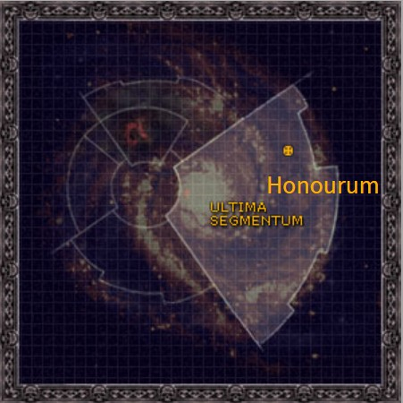

# 1023 荣誉星 Honourum

精校状态：中文行文已逐段精校，部分术语仍为暂定

分类：地理 / 小行星 / 极限星域 Ultima Segmentum

原文来源：https://www.bilibili.com/opus/1160225431524212737

原作者：帝国神选罐头

原文时间：2026年01月21日 13:47

[返回分类目录](目录.md) · [全书目录](../../目录.md)

<!-- A1023-B0001 图片 -->

<!-- A1023-B0002 -->

原译文

Map 地图

**校订译文**

Map 地图

<!-- /A1023-B0002 -->

<!-- A1023-B0003 -->
### Basic Data 基本资料

原题：Basic Data 基础数据

<!-- /A1023-B0003 -->

<!-- A1023-B0004 -->
**英文原文**

Name:Honourum

<!-- /A1023-B0004 -->

<!-- A1023-B0005 -->

原译文

名称：荣誉星

**校订译文**

名称：荣誉星

<!-- /A1023-B0005 -->

<!-- A1023-B0006 -->
**英文原文**

Segmentum:Ultima Segmentum

<!-- /A1023-B0006 -->

<!-- A1023-B0007 -->

原译文

星域：极限星域

**校订译文**

星域：极限星域

<!-- /A1023-B0007 -->

<!-- A1023-B0008 -->
**英文原文**

Affiliation:Imperium

<!-- /A1023-B0008 -->

<!-- A1023-B0009 -->

原译文

隶属：帝国

**校订译文**

隶属：帝国

<!-- /A1023-B0009 -->

<!-- A1023-B0010 -->
**英文原文**

Class:Adeptus Astartes Homeworld, Feral World

<!-- /A1023-B0010 -->

<!-- A1023-B0011 -->

原译文

类别：阿斯塔特修会家园世界，蛮荒世界

**校订译文**

类别：阿斯塔特修会家园世界，蛮荒世界

<!-- /A1023-B0011 -->

<!-- A1023-B0012 -->
**英文原文**

Tithe Grade:Aptus Non

<!-- /A1023-B0012 -->

<!-- A1023-B0013 -->

原译文

什一税等级：特级免税

**校订译文**

什一税等级：特级免税

<!-- /A1023-B0013 -->

<!-- A1023-B0014 -->
**英文原文**

Honourum is the homeworld of the Novamarines Chapter.

<!-- /A1023-B0014 -->

<!-- A1023-B0015 -->

原译文

荣誉星是新星战士战团的家园世界。

**校订译文**

荣誉星是新星战士战团的家园世界。

<!-- /A1023-B0015 -->

<!-- A1023-B0016 -->
## Overview 概述

<!-- /A1023-B0016 -->

<!-- A1023-B0017 -->
**英文原文**

Honourum is found in the galactic north of the Ultima Segmentum, far away from the Realm of Ultramar and near the Halo Stars. The region around Honourum is sparsely populated and filled with vast tracts of unexplored wilderness space that is host to all manner of ancient threats, nascent alien empires and as-yet undiscovered lost human worlds.

<!-- /A1023-B0017 -->

<!-- A1023-B0018 -->

原译文

荣誉星位于极限星域的银河北部，远离奥特拉玛领域，靠近光环群星。荣誉星周围的地区人口稀少，充满了大片未开发的无人空域，那里有各种各样的古代威胁、新生的异型帝国和尚未被发现的失落的人类世界。

**校订译文**

荣誉星位于极限星域的银河北部，远离奥特拉玛，靠近光环群星。周边人口稀少，大片荒僻空域尚未探索，潜藏着各种古老威胁、新兴异形帝国，以及尚未重新发现的失落人类世界。

<!-- /A1023-B0018 -->

<!-- A1023-B0019 -->
## History 历史

<!-- /A1023-B0019 -->

<!-- A1023-B0020 -->
**英文原文**

The world was originally claimed by the Ultramarines during the Horus Heresy, when a loyalist force led by Captain Arceas Odinathus assaulted a Word Bearers garrison. After 3 weeks of fighting that saw the traitors unleash Warp and Age of Strife-era horrors, the blasted ruin of Honourum was captured.

<!-- /A1023-B0020 -->

<!-- A1023-B0021 -->

原译文

这个世界最初是在荷鲁斯叛乱时期由极限战士宣称的，当时由阿西厄斯·奥狄纳图斯连长领导的一支忠诚部队袭击了一个怀言者驻军。经过3周的战斗，叛徒们释放了亚空间和纷争时代的恐怖，荣誉星被炸毁的废墟被占据了。

**校订译文**

荷鲁斯之乱期间，阿西厄斯·奥狄纳图斯连长率忠诚派进攻怀言者驻军，为极限战士夺取荣誉星。战斗持续三周，叛徒释放出亚空间及纷争时代遗留的恐怖存在，忠诚派最终攻占的已是一片焦土废墟。

<!-- /A1023-B0021 -->

<!-- A1023-B0022 -->
## Geography 地理

<!-- /A1023-B0022 -->

<!-- A1023-B0023 -->
**英文原文**

Honourum only possesses a single significant landmass. Its mountain peaks are surrounded by boiling seas and constant lightning storms. Each and every mountaintop has since been planed flat by the Novamarines' Techmarines, now playing host to rows of statues immortalizing the Chapter's greatest heroes.

<!-- /A1023-B0023 -->

<!-- A1023-B0024 -->

原译文

荣誉星只拥有一块重要的陆地。它的山峰被沸腾的海洋和不断的雷暴包围着。从那以后，每一个山顶都被新星战士的技术军士夷为平地，现在这里供奉着一排排雕像，纪念战团最伟大的英雄。

**校订译文**

荣誉星只有一块规模可观的陆地，群峰被沸腾的海洋和持续雷暴环绕。新星战士的科技战士将每一座山峰的顶部削平，在上面立起成排雕像，纪念战团最伟大的英雄。

**校注：** planed flat指削平山顶以安置雕像，不是将整座山夷平；Techmarines采用科技战士。

<!-- /A1023-B0024 -->

<!-- A1023-B0025 -->
## Society 社会

<!-- /A1023-B0025 -->

<!-- A1023-B0026 -->
**英文原文**

Honourum is home to primitive tribes that live a harsh existence on the bare world. The tribes tattoo their bodies after each victory in battle and that is one of the few customs the Novamarines have adopted from their homeworld.

<!-- /A1023-B0026 -->

<!-- A1023-B0027 -->

原译文

荣誉世界是原始部落的家园，他们在光秃秃的世界上过着艰苦的生活。这些部落在每次战斗胜利后都会在身上纹身，这是新星战士从他们的家园世界接受的为数不多的习俗之一。

**校订译文**

荣誉星上的原始部落在贫瘠环境中艰难求生。每逢战斗获胜，他们都会为自己增添纹身；这是新星战士从母星继承的少数习俗之一。

<!-- /A1023-B0027 -->

本篇核心术语与暂定项

以下列出本篇出现的英文原形及核心术语表用词。同形词可能指不同对象，具体词义以本篇正文和校注为准；单复数、别名和仅见于图注的名称可能尚未列入。完整候选见[术语表](../../术语表/双语术语候选.csv)。

| 英文 | 采用中文 | 状态 |
| --- | --- | --- |
| Adeptus Astartes | 阿斯塔特修会 | 官方已核对 |
| Ultramar | 奥特拉玛 | 官方已核对 |
| Ultramarines | 极限战士 | 官方已核对 |
| Horus Heresy | 荷鲁斯之乱 | 官方已核对 |
| Warp | 亚空间 | 官方已核对 |
| Imperium | 帝国 | 暂定·简称 |
| Word Bearers | 怀言者 | 暂定·官方待核 |
| Age of Strife | 纷争时代 | 暂定·官方待核 |
| Horus | 荷鲁斯 | 暂定·官方待核 |
| Ultima Segmentum | 极限星域 | 暂定·官方待核 |
| Segmentum | 星域 | 暂定·官方待核 |
| Halo Stars | 光环群星 | 暂定·官方待核 |
| Aptus Non | 特级免税 | 暂定·官方待核 |
| Ancient | 旗手 | 官方已核对 |
| Chapter | 战团 | 暂定·官方待核 |
| Captain | 连长 | 暂定·官方待核 |
| Novamarines | 新星战士 | 暂定·官方待核 |
| Honourum | 荣誉星 | 暂定·官方待核 |
| Host | 天军 | 暂定·官方待核 |
| Realm of Ultramar | 奥特拉玛领地 | 暂定·官方待核 |
| Wilderness Space | 荒野空域 | 暂定·官方待核 |
| Feral World | 蛮荒世界 | 暂定·官方待核 |
| Arceas Odinathus | 阿西厄斯·奥狄纳图斯 | 暂定·官方待核 |

