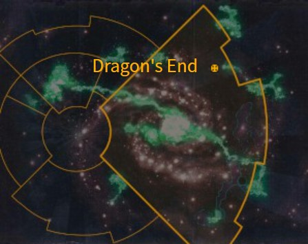

# 1027 龙之终 Dragon's End

精校状态：中文行文已逐段精校，部分术语仍为暂定

分类：地理 / 小行星 / 极限星域 Ultima Segmentum

原文来源：https://www.bilibili.com/opus/1168779146694754325

原作者：帝国神选罐头

原文时间：2026年02月13日 15:00

[返回分类目录](目录.md) · [全书目录](../../目录.md)

<!-- A1027-B0001 图片 -->

<!-- A1027-B0002 -->

原译文

Map 地图

**校订译文**

Map 地图

<!-- /A1027-B0002 -->

<!-- A1027-B0003 -->
### Basic Data 基本资料

原题：Basic Data 基础数据

<!-- /A1027-B0003 -->

<!-- A1027-B0004 -->
**英文原文**

Name:Dragon's End

<!-- /A1027-B0004 -->

<!-- A1027-B0005 -->

原译文

名称：龙之终

**校订译文**

名称：龙之终

<!-- /A1027-B0005 -->

<!-- A1027-B0006 -->
**英文原文**

Segmentum:Ultima Segmentum

<!-- /A1027-B0006 -->

<!-- A1027-B0007 -->

原译文

星域：极限星域

**校订译文**

星域：极限星域

<!-- /A1027-B0007 -->

<!-- A1027-B0008 -->
**英文原文**

Affiliation:Imperium

<!-- /A1027-B0008 -->

<!-- A1027-B0009 -->

原译文

隶属：帝国

**校订译文**

隶属：帝国

<!-- /A1027-B0009 -->

<!-- A1027-B0010 -->
**英文原文**

Class:Knight World

<!-- /A1027-B0010 -->

<!-- A1027-B0011 -->

原译文

类别：骑士世界

**校订译文**

类别：骑士世界

<!-- /A1027-B0011 -->

<!-- A1027-B0012 -->
**英文原文**

Dragon's End is a Knight World of the Imperium and home to House Griffith and its vassal houses, like House Grothelgaard, House Brugannis, House Onnelis, House Theyran, House Nostrus. It lies close to the Forge World Incaladion.

<!-- /A1027-B0012 -->

<!-- A1027-B0013 -->

原译文

龙之终是帝国的骑士世界，也是格里菲斯家族及其附属家族的所在地，如格罗瑟尔加德家族、布鲁甘尼斯家族、奥内利斯家族、塞兰家族、诺斯特鲁斯家族。它靠近铸造世界因卡拉迪翁。

**校订译文**

龙之终是帝国的骑士世界，也是格里菲斯家族及其附属家族的所在地，如格罗瑟尔加德家族、布鲁甘尼斯家族、奥内利斯家族、塞兰家族、诺斯特鲁斯家族。它靠近铸造世界因卡拉迪翁。

<!-- /A1027-B0013 -->

<!-- A1027-B0014 -->
## History 历史

<!-- /A1027-B0014 -->

<!-- A1027-B0015 -->
**英文原文**

Dragon's End is a volcanic planet, once occupied by flying drakes and huge megasaurs. However, the planet was later settled by human colonists, who also introduced Terran horses to the planet's valleys. These colonists formed the basis of the Knight House Griffith, soon becoming deft cavalry troopers, armoured in plate made of the planet's obsidian. These mounted nobles hunted the herds of megasaurs, drawing the attention of the dragons which preyed upon these creatures. The colonists raced to complete the construction of their Knight suits, battling dragons on horseback in the interim. During this time, one warrior named Nathaniel killed three of the creatures with a lance fashioned from dragon bone, his exploits leading to his inauguration as House Griffith's first ruler. Upon the completion of the Knight suits, the war turned decisively in the humans' favour, and even long after the extinction of Dragon's End's drakes, the Knights of House Griffith are renowned as fierce and capable warriors.

<!-- /A1027-B0015 -->

<!-- A1027-B0016 -->

原译文

龙之终是一个火山行星，曾经被飞龙和巨大的巨型恐龙占据。然而，这个行星后来被人类殖民者定居，他们还将泰拉马引入了这个行星的山谷。这些殖民者构成了格里菲斯骑士家族的基础，很快成为熟练的骑兵，身穿由行星的黑曜石制成的盔甲。这些骑马的贵族猎杀巨型恐龙，引起了捕食这些生物的龙的注意。殖民者们争先恐后地完成骑士机甲的制造，在此期间，他们骑马与龙作战。在此期间，一位名叫纳撒尼尔的战士用龙骨制成的长矛杀死了三只生物，他的功绩使他成为格里菲斯家族的第一位统治者。骑士机甲完成后，战争决定性地转向了对人类有利的方向，即使在龙之终的龙灭绝很久之后，格里菲斯家族的骑士也以凶猛能干的战士而闻名。

**校订译文**

龙之终是一颗火山星球，曾遍布飞龙与巨型蜥兽。人类殖民者到来后，还把泰拉马引入山谷。他们后来成为格里菲斯骑士家族的先民，很快练成娴熟骑术，身披用当地黑曜石制成的板甲。这些骑乘贵族猎捕成群巨蜥，也引来了以巨蜥为食的飞龙。殖民者争分夺秒制造骑士机甲，在完成前只能骑马与龙交战。其间，一位名叫纳撒尼尔的战士用龙骨骑枪杀死三头龙，因此获拥立为格里菲斯家族首任统治者。骑士机甲完工后，战局决定性地转向人类。即使当地飞龙灭绝已久，格里菲斯骑士仍以勇猛善战闻名。

**校注：** megasaurs按大型蜥类生物处理，原文未指定现实恐龙物种；three of the creatures回指交战飞龙。此前骑乘的是泰拉马，机甲完成前后分明。

<!-- /A1027-B0016 -->

<!-- A1027-B0017 -->
**英文原文**

Early in M42, it suffered an attack by the Necron Novokh Dynasty in the Wars of Steel.

<!-- /A1027-B0017 -->

<!-- A1027-B0018 -->

原译文

在M42早期，它在钢铁战争中遭到了死灵诺沃赫王朝的袭击。

**校订译文**

第四十二个千年初期，龙之终在钢铁战争中遭到太空死灵诺沃赫王朝进攻。

<!-- /A1027-B0018 -->

<!-- A1027-B0019 -->
## Notable Locations 著名地点

<!-- /A1027-B0019 -->

<!-- A1027-B0020 -->
**英文原文**

Bastion Armentes — Stronghold of House Griffith.

<!-- /A1027-B0020 -->

<!-- A1027-B0021 -->

原译文

阿尔门特斯堡垒 — 格里菲斯家族的要塞。

**校订译文**

阿尔门特斯堡垒 — 格里菲斯家族的要塞。

<!-- /A1027-B0021 -->

本篇核心术语与暂定项

以下列出本篇出现的英文原形及核心术语表用词。同形词可能指不同对象，具体词义以本篇正文和校注为准；单复数、别名和仅见于图注的名称可能尚未列入。完整候选见[术语表](../../术语表/双语术语候选.csv)。

| 英文 | 采用中文 | 状态 |
| --- | --- | --- |
| Imperium | 帝国 | 暂定·简称 |
| Forge World | 铸造世界 | 暂定·官方待核 |
| Ultima Segmentum | 极限星域 | 暂定·官方待核 |
| Segmentum | 星域 | 暂定·官方待核 |
| Dragon's End | 龙尽 | 暂定·官方待核 |
| Lance | 骑士矛阵 | 暂定·官方待核 |
| Incaladion | 因卡拉迪翁 | 暂定·官方待核 |
| Knight World | 骑士世界 | 暂定·官方待核 |
| Knight House | 骑士家族 | 暂定·官方待核 |
| House Griffith | 格里菲斯家族 | 暂定·官方待核 |
| Bastion Armentes | 阿尔门特斯堡垒 | 暂定·官方待核 |
| Novokh Dynasty | 诺沃赫王朝 | 暂定·官方待核 |

