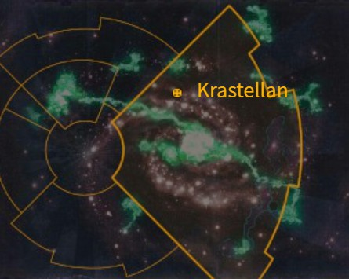

# 1028 克拉斯特兰 Krastellan

精校状态：中文行文已逐段精校，部分术语仍为暂定

分类：地理 / 小行星 / 极限星域 Ultima Segmentum

原文来源：https://www.bilibili.com/opus/1169150236122153113

原作者：帝国神选罐头

原文时间：2026年02月14日 15:00

[返回分类目录](目录.md) · [全书目录](../../目录.md)

<!-- A1028-B0001 图片 -->

<!-- A1028-B0002 -->

原译文

Map 地图

**校订译文**

Map 地图

<!-- /A1028-B0002 -->

<!-- A1028-B0003 -->
### Basic Data 基本资料

原题：Basic Data 基础数据

<!-- /A1028-B0003 -->

<!-- A1028-B0004 -->
**英文原文**

Name:Krastellan

<!-- /A1028-B0004 -->

<!-- A1028-B0005 -->

原译文

名称：克拉斯特兰

**校订译文**

名称：克拉斯特兰

<!-- /A1028-B0005 -->

<!-- A1028-B0006 -->
**英文原文**

Segmentum:Ultima Segmentum

<!-- /A1028-B0006 -->

<!-- A1028-B0007 -->

原译文

星域：极限星域

**校订译文**

星域：极限星域

<!-- /A1028-B0007 -->

<!-- A1028-B0008 -->
**英文原文**

Affiliation:Imperium

<!-- /A1028-B0008 -->

<!-- A1028-B0009 -->

原译文

隶属：帝国

**校订译文**

隶属：帝国

<!-- /A1028-B0009 -->

<!-- A1028-B0010 -->
**英文原文**

Class:Knight World, Feudal World

<!-- /A1028-B0010 -->

<!-- A1028-B0011 -->

原译文

类别：骑士世界，封建世界

**校订译文**

类别：骑士世界，封建世界

<!-- /A1028-B0011 -->

<!-- A1028-B0012 -->
**英文原文**

Krastellan is a Knight World of the Imperium and home to House Hawkshroud.

<!-- /A1028-B0012 -->

<!-- A1028-B0013 -->

原译文

克拉斯特兰是帝国的骑士世界，也是鹰覆家族的家园。

**校订译文**

克拉斯特兰是帝国骑士世界，也是覆隼家族的家园。

<!-- /A1028-B0013 -->

<!-- A1028-B0014 -->
**英文原文**

Krastellan enjoys relative safety thanks in part to its proximity to Baal, the Homeworld of the Blood Angels Chapter. It suffered a major invasion by the Necron Mephrit Dynasty, but was relieved by Skitarii and House Hawkshroud forces.

<!-- /A1028-B0014 -->

<!-- A1028-B0015 -->

原译文

克拉斯特兰享有相对的安全，部分原因是它靠近圣血天使的家园世界巴尔。它遭受了死灵墨菲利特王朝的大规模入侵，但被护教军和鹰覆家族的部队所解除。

**校订译文**

克拉斯特兰总体较为安全，部分原因是它靠近圣血天使家园巴尔。这里曾遭太空死灵墨菲利特王朝大举入侵，最终由护教军与覆隼家族部队解围。

**校注：** relieved指解围，原译“被部队所解除”缺宾语；House Hawkshroud沿既定覆隼家族。

<!-- /A1028-B0015 -->

本篇核心术语与暂定项

以下列出本篇出现的英文原形及核心术语表用词。同形词可能指不同对象，具体词义以本篇正文和校注为准；单复数、别名和仅见于图注的名称可能尚未列入。完整候选见[术语表](../../术语表/双语术语候选.csv)。

| 英文 | 采用中文 | 状态 |
| --- | --- | --- |
| Blood Angels | 圣血天使 | 官方已核对 |
| Imperium | 帝国 | 暂定·简称 |
| Skitarii | 护教军 | 暂定·官方待核 |
| Ultima Segmentum | 极限星域 | 暂定·官方待核 |
| Segmentum | 星域 | 暂定·官方待核 |
| Baal | 巴尔 | 暂定·官方待核 |
| Krastellan | 克拉斯特兰 | 暂定·官方待核 |
| House Hawkshroud | 覆隼家族 | 暂定·官方待核 |
| Chapter | 战团 | 暂定·官方待核 |
| The Blood | 鲜血 | 暂定·官方待核 |
| Feudal World | 封建世界 | 暂定·官方待核 |
| Knight World | 骑士世界 | 暂定·官方待核 |
| Mephrit Dynasty | 墨菲利特王朝 | 暂定·官方待核 |

