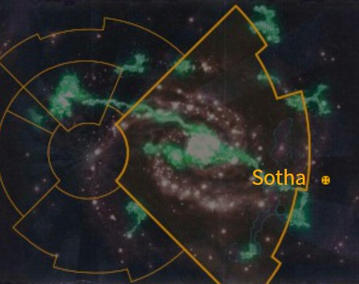

# 1029 索萨 Sotha

精校状态：中文行文已逐段精校，部分术语仍为暂定

分类：地理 / 小行星 / 极限星域 Ultima Segmentum

原文来源：https://www.bilibili.com/opus/1170232559276130306

原作者：帝国神选罐头

原文时间：2026年02月17日 13:00

[返回分类目录](目录.md) · [全书目录](../../目录.md)

<!-- A1029-B0001 图片 -->

<!-- A1029-B0002 -->

原译文

Map 地图

**校订译文**

Map 地图

<!-- /A1029-B0002 -->

<!-- A1029-B0003 -->
### Basic Data 基本资料

原题：Basic Data 基础数据

<!-- /A1029-B0003 -->

<!-- A1029-B0004 -->
**英文原文**

Name:Sotha

<!-- /A1029-B0004 -->

<!-- A1029-B0005 -->

原译文

名称：索萨

**校订译文**

名称：索萨

<!-- /A1029-B0005 -->

<!-- A1029-B0006 -->
**英文原文**

Segmentum:Ultima Segmentum

<!-- /A1029-B0006 -->

<!-- A1029-B0007 -->

原译文

星域：极限星域

**校订译文**

星域：极限星域

<!-- /A1029-B0007 -->

<!-- A1029-B0008 -->
**英文原文**

Affiliation:Imperium

<!-- /A1029-B0008 -->

<!-- A1029-B0009 -->

原译文

隶属：帝国

**校订译文**

隶属：帝国

<!-- /A1029-B0009 -->

<!-- A1029-B0010 -->
**英文原文**

Class:Previously Civilised World, Adeptus Astartes Homeworld, Tomb World. Now Dead World though being restored

<!-- /A1029-B0010 -->

<!-- A1029-B0011 -->

原译文

类别：前文明世界，阿斯塔特家园世界，坟墓世界。现在死亡世界正在恢复

**校订译文**

类别：原为文明世界、阿斯塔特修会家园世界及墓穴世界；现为死寂世界，正在恢复中。

**校注：** Dead World为死寂世界，区别危险生态的Death World死亡世界；原译把墓穴世界与死寂世界状态混在一起。

<!-- /A1029-B0011 -->

<!-- A1029-B0012 -->
**英文原文**

Tithe Grade:Previously Aptus Non, now n/a

<!-- /A1029-B0012 -->

<!-- A1029-B0013 -->

原译文

什一税等级：前特级免税，现无

**校订译文**

什一税等级：前特级免税，现无

<!-- /A1029-B0013 -->

<!-- A1029-B0014 -->
**英文原文**

Sotha, located in the Ultima Segmentum, is the home world of the Scythes of the Emperor Space Marine Chapter. The Chapter's Fortress-monastery, the Space Station Aegida, is located in its orbit.

<!-- /A1029-B0014 -->

<!-- A1029-B0015 -->

原译文

索萨位于极限星域，是帝皇之镰星际战士战团的家园世界。战团的堡垒修道院，艾吉达空间站，位于其轨道上。

**校订译文**

索萨位于极限星域，是帝皇之镰战团的家园世界。战团的要塞修道院设在环绕索萨运行的神盾空间站内。

<!-- /A1029-B0015 -->

<!-- A1029-B0016 -->
**英文原文**

Although once part of Ultramar, by M41 Sotha was the cardinal world of the Sotharan League which included many other planets in the local region.

<!-- /A1029-B0016 -->

<!-- A1029-B0017 -->

原译文

虽然曾经是奥特拉玛的一部分，但到M41时，索萨是索萨兰联盟的主要世界，其中包括当地许多其他行星。

**校订译文**

索萨曾属于奥特拉玛；到第四十一个千年，它已成为索萨兰联盟的核心世界，联盟还包含周边许多其他行星。

<!-- /A1029-B0017 -->

<!-- A1029-B0018 -->
## History 历史

<!-- /A1029-B0018 -->

<!-- A1029-B0019 -->
## The Great Crusade 大远征

<!-- /A1029-B0019 -->

<!-- A1029-B0020 -->
**英文原文**

Sotha was discovered by the Ultramarines Legion in 882.M30 and brought into the Five Hundred Worlds of Ultramar.

<!-- /A1029-B0020 -->

<!-- A1029-B0021 -->

原译文

索萨于M30.882被极限战士军团发现，带入奥特拉玛五百世界。

**校订译文**

882.M30，极限战士军团发现索萨，将其纳入奥特拉玛五百世界。

<!-- /A1029-B0021 -->

<!-- A1029-B0022 -->
**英文原文**

In spite of an ideal ecosphere, there were no initial signs of previous human or xenos occupation, but after initial exploration of Mount Pharos an ancient structure of alien origin was discovered. Access to the entire world was restricted by order of the primarch Roboute Guilliman, with only a small agricultural colony to support the ongoing archaeological survey mission. The 199th Company of the Ultramarines was established as an '‘Aegida’' (shield-company) and left to garrison the world.

<!-- /A1029-B0022 -->

<!-- A1029-B0023 -->

原译文

尽管有一个理想的生态圈，但最初没有人类或异型占领的迹象，但在对灯塔山进行初步探索后，发现了一个起源于异型的古老结构。进入整个世界受到原体罗伯特·基里曼的命令限制，只有一个小型农业殖民地来支持正在进行的考古调查任务。极限战士第199连队成立为“艾吉达”（盾牌连队），并驻扎在世界各地。

**校订译文**

索萨生态环境理想，最初却看不出曾有人类或异形居住的迹象。对法罗斯山展开初步勘探后，调查者发现一座古老的异形建筑。原体罗保特·基里曼下令限制外人进入索萨，只保留一处小型农业殖民地，为持续进行的考古调查提供支持。极限战士第199连被指定为“神盾连”，留驻守卫这颗星球。

**校注：** Aegida的神盾连及轨道站沿较早450现稿；不是灰骑士Aegis防护系统，英文实体保持区分。Mount Pharos沿585法罗斯山，装置Pharos仍灯塔。

<!-- /A1029-B0023 -->

<!-- A1029-B0024 -->
**英文原文**

The company took on a badge of a scythe to represent the assistance of the local agricultural workers in clearing the vegetation.

<!-- /A1029-B0024 -->

<!-- A1029-B0025 -->

原译文

该连队佩戴了镰刀徽章，以表示当地农业工人在清理植被方面的援助。

**校订译文**

该连队佩戴了镰刀徽章，以表示当地农业工人在清理植被方面的援助。

<!-- /A1029-B0025 -->

<!-- A1029-B0026 -->
## The Horus Heresy 荷鲁斯之乱

原题：The Horus Heresy 荷鲁斯叛乱

<!-- /A1029-B0026 -->

<!-- A1029-B0027 -->
**英文原文**

At the height of the Horus Heresy, at Guilliman’s command the renegade warsmith Barabas Dantioch of the Iron Warriors had been sent to Sotha to uncover the secrets of the Pharos, and succeeded in opening up instantaneous communication channels with distant Macragge. The Pharos was found to be an empathic device of ancient xenos construction, and provided a directional beacon for navigation in the absence of the Astronomican.

<!-- /A1029-B0027 -->

<!-- A1029-B0028 -->

原译文

在荷鲁斯叛乱的巅峰时期，在基里曼的指挥下，钢铁勇士的叛徒铁匠巴拉巴斯·丹提欧克被派往索萨，揭露灯塔的秘密，并成功地与遥远的马库拉格建立了即时通信渠道。灯塔被发现是古代异型建筑的移情装置，在没有星炬的情况下为导航提供了方向信标。

**校订译文**

荷鲁斯之乱最激烈时，脱离叛军的钢铁勇士战争铁匠巴拉巴斯·丹提欧克奉基里曼之命前往索萨，研究灯塔的秘密。他成功与遥远的马库拉格建立即时通信。调查表明，灯塔是古代异形制造的一种共感装置，在星炬无法发挥作用时，可为航行提供指向信标。

**校注：** renegade指丹提欧克脱离钢铁勇士叛军后转投忠诚派；原“叛徒铁匠”容易将其立场颠倒。Warsmith为战争铁匠，不套Warpsmith次元铁匠。

<!-- /A1029-B0028 -->

<!-- A1029-B0029 -->
**英文原文**

The planet was designated by Sevatar as a rendezvous point for the Night Lords fleet elements after the disastrous conclusion of the Thramas Crusade. It is unclear whether or not he knew of the significance that the planet had attained before giving this order. The Sothan rendezvous point was used by Gendor Skraivok, commanding the 45th Company aboard the strike cruiser Umber Prince. Two other Night Lords vessels, the Domninus Noctem and Shadow Blow, used this rendezvous point but left it after completing repairs. Some time later, a smaller Night Lords fleet under captain Krukesh the Pale, commander of 103rd Company and member of the Kyroptera, arrived and Krukesh inducted Skraivok and the Umber Prince into his order of battle. Night Lords forces under Krukesh's command launched an attack on the Sotha System that resulted in the Battle of Sotha.

<!-- /A1029-B0029 -->

<!-- A1029-B0030 -->

原译文

在色雷斯远征灾难性的结束后，塞维塔将这颗行星指定为午夜领主舰队成员的会合点。目前尚不清楚他在下达这一命令之前是否知道这颗行星已经达到的重要性。索萨会合点由詹多·斯卡莱沃克使用，他在打击巡洋舰红棕王子号上指挥第45连队。另外两艘午夜领主战舰，夜之主号和影吹号，使用了这个会和点，但在完成维修后离开了。一段时间后，第103连队指挥官、夜蝠议会成员、连长苍白者克鲁凯什率领的一支规模较小的午夜领主舰队抵达，克鲁凯什将斯卡莱沃克和红棕王子号纳入他的战斗序列。克鲁凯什指挥的午夜领主部队对索萨星系发动了攻击，导致了索萨之战。

**校订译文**

萨拉玛斯远征惨败后，塞维塔将索萨指定为午夜领主残余舰队的集结点；他下令时是否知道这颗星球的重要性，尚不清楚。詹多·斯卡莱沃克率第45连乘打击巡洋舰红棕王子号抵达此处。夜之主号与暗影之击号也曾利用这一集结点，但完成维修后便离开。一段时间后，第103连连长、夜蝠议会成员“苍白者”克鲁克什率一支小型舰队来到索萨，将斯卡莱沃克和红棕王子号纳入麾下。他随后下令进攻索萨星系，索萨之战由此爆发。

**校注：** Thramas为萨拉玛斯，不是现实Thrace色雷斯；Domninus Noctem英文拼法照录，未擅改。Shadow Blow沿796暗影之击号。

<!-- /A1029-B0030 -->

<!-- A1029-B0031 -->
**英文原文**

In the aftermath of the battle, the emblem of the 199th Company of the Ultramarines was awarded by Roboute Guilliman with two crossed scythes as a symbol of their victory.

<!-- /A1029-B0031 -->

<!-- A1029-B0032 -->

原译文

战斗结束后，罗伯特·基里曼将两把交叉的镰刀作为胜利的象征，授予了极限战士第199连队的徽章。

**校订译文**

战后，罗保特·基里曼授予极限战士第199连两把交叉镰刀的徽记，作为胜利的象征。

<!-- /A1029-B0032 -->

<!-- A1029-B0033 -->
## Post-Heresy 叛乱后

<!-- /A1029-B0033 -->

<!-- A1029-B0034 -->
**英文原文**

Following the events of the Horus Heresy, Guilliman decreed that the remaining Loyalist Space Marine Legions were to be broken up into Chapters; furthermore his Codex Astartes set an upper limit on the size of a Chapter. In spite of his own decrees, however, Guilliman secretly maintained the Aegida Company on Sotha as a phantom "11th Company" of the Ultramarines Chapter.

<!-- /A1029-B0034 -->

<!-- A1029-B0035 -->

原译文

荷鲁斯叛乱事件发生后，基里曼下令将剩余的忠诚派星际战士军团分为战团；此外，他的《阿斯塔特圣典》对战团的规模设定了上限。然而，尽管基里曼自己颁布了圣典，他还是秘密地在索萨维持着艾吉达连队，将其作为极限战士战团的幽灵“第11连队”。

**校订译文**

荷鲁斯之乱后，基里曼下令将剩余忠诚军团拆分为战团，并在《阿斯塔特圣典》中限定战团规模。然而，他自己却秘密保留了索萨的神盾连，使其成为极限战士战团未公开的“第十一连”。

<!-- /A1029-B0035 -->

<!-- A1029-B0036 -->
**英文原文**

Over the next millennium, the Aegida Company's numbers dwindled until, by the time of the Third Founding, only one Marine remained on Sotha: Oberdeii, now Captain of the Aegida and Warden of the Pharos.

<!-- /A1029-B0036 -->

<!-- A1029-B0037 -->

原译文

在接下来的千年里，艾吉达连队的人数逐渐减少，直到第三次建军时，索萨上只剩下一名战士：奥伯德伊，现在是艾吉达的连长和灯塔的守望者。

**校订译文**

此后一千年间，神盾连人数逐渐减少。到第三次建军时，索萨只剩一名星际战士：兼任神盾连连长与灯塔守望者的奥伯德伊。

<!-- /A1029-B0037 -->

<!-- A1029-B0038 -->
**英文原文**

When the Third Founding was initiated at the instruction of Rogal Dorn, the Ultramarines' Chapter Master at the time, Tigris Decon, saw an opportunity to erase the evidence of Guilliman's defiance of his own strictures. He sent Chaplain Segas and Veteran Brother Wenlocke to Sotha to present Oberdeii with a choice: he could either be reassigned to command the Ultramarines' Fifth Company and resume active duty, or he could become the first Master of a new "Aegida Chapter". Oberdeii refused to abandon his watch over the Pharos; despite being shocked at the idea of Dorn calling for another Founding, he eventually relented and agreed to lead a new Chapter, but instead of calling them the Aegida, he instead chose to name them the Scythes of the Emperor.

<!-- /A1029-B0038 -->

<!-- A1029-B0039 -->

原译文

当第三次建军是在罗格·多恩的指示下发起的时，当时的极限战士战团长，提格里斯·德肯看到了一个机会，可以抹去基里曼无视自己的限制的证据。他派遣牧师塞加斯和老兵兄弟温洛克前往索萨，向奥伯德伊提出一个选择：他要么被重新分配指挥极限战士第五连队并恢复现役，要么成为新的“艾吉达战团”的第一位战团长。奥伯德伊拒绝放弃对灯塔的监视；尽管对多恩呼吁另一次建军的想法感到震惊，但他最终还是让步了，同意领导一个新的战团，但他没有称他们为艾吉达，而是选择将他们命名为帝皇之镰。

**校订译文**

罗格·多恩发起第三次建军时，时任极限战士战团长提格里斯·德康看到了一个消除基里曼违背自身规定之证据的机会。他派塞加斯教士与老兵温洛克兄弟前往索萨，让奥伯德伊作出选择：调任第五连连长、恢复前线服役，或成为新建“神盾战团”的首任战团长。奥伯德伊拒绝放弃守护灯塔；尽管对多恩主张再次建军感到震惊，他最终还是同意统率新战团，却选择将之命名为“帝皇之镰”。

<!-- /A1029-B0039 -->

<!-- A1029-B0040 -->
## The Second Tyrannic War 第二次泰伦战争

<!-- /A1029-B0040 -->

<!-- A1029-B0041 -->
**英文原文**

In the last decade of M41, reports began to reach Sotha of unrest and rebellion spreading along the Eastern Fringe. Chapter Master Thorcyra sent Captain Cassios and the Scythes' Fifth Company to crush any uprising before it could begin before himself heading north into the Saphir Cluster. After a year, garbled communications reached Sotha from the Fifth of a widespread xenos incursion into the galaxy — this turned out to be the work of Genestealer Cultists on behalf of the Tyranids of Hive Fleet Kraken.

<!-- /A1029-B0041 -->

<!-- A1029-B0042 -->

原译文

在M41的最后十年，索萨开始收到关于东部边缘地区动荡和叛乱蔓延的报告。战团长托尔西拉派连长卡西奥斯和帝皇之镰的第五连队在他向北进入萨菲尔星群之前粉碎任何叛乱。一年后，从第五次广泛的异型入侵银河系开始，混乱的通信到达了索萨 — 事实证明，这是基因窃取者邪教徒代表虫巢舰队克拉肯的泰伦所做的工作。

**校订译文**

第四十一个千年的最后十年，索萨陆续收到东部边疆动乱蔓延的报告。战团长索西拉先派卡西奥斯连长率第五连前往，将可能发生的叛乱扼杀于萌芽，自己随后北上萨菲尔星群。一年后，索萨收到第五连杂乱不清的通讯，报告大规模异形入侵银河。后来证实，这是基因窃取者教徒在为克拉肯虫巢舰队的泰伦铺路。

**校注：** from the Fifth指来自第五连，而非“第五次入侵”。本段英文写M41最后十年，与第二次泰伦战争常见纪年条目可能不合，保留源文时点待核。

<!-- /A1029-B0042 -->

<!-- A1029-B0043 -->
**英文原文**

A general recall was issued, summoning every single battle-brother of the Chapter back to Sotha to aid in the defence of their home world. Secretly, the best and the brightest of the youth of Sotha were evacuated, as it was already suspected that it was too late to halt the alien menace and new recruits would soon be required to replace losses and rebuild the Chapter.

<!-- /A1029-B0043 -->

<!-- A1029-B0044 -->

原译文

发布了一项全面召回，召集战团的每一位战斗兄弟回到索萨，协助保卫他们的家园世界。秘密地，索萨最优秀、最聪明的年轻人被疏散了，因为人们已经怀疑，阻止异型的威胁已经太晚了，很快就需要新兵来弥补损失并重建战团。

**校订译文**

战团随即发出全面召回令，要求每一位战斗兄弟返回索萨，协防家园。与此同时，当地最出色、最有潜力的年轻人被秘密撤走：战团已怀疑阻止异形为时太晚，必须预留新兵，以补充损失并重建战团。

<!-- /A1029-B0044 -->

<!-- A1029-B0045 -->
**英文原文**

The invasion began with a single Hive Ship which appeared at the edge of the system. Sergeant Remas led a boarding mission to halt the ship but barely escaped with his life. Soon afterwards, a rain of Mycetic Spores brought billions of Tyranid creatures to the surface. They swarmed over the defensive barricades and the Scythes of the Emperor were decimated. The survivors were evacuated by the Chapter's remaining Thunderhawks, and fled to the death world of Miral to rendezvous with the returning Chapter Master Thorcyra.

<!-- /A1029-B0045 -->

<!-- A1029-B0046 -->

原译文

入侵始于一艘出现在星系边缘的虫巢舰。雷马斯军士率领跳帮任务阻止了这艘船，但几乎没能逃脱。不久之后，一场菌丝孢子雨将数十亿泰伦生物带到了地表。他们蜂拥越过防御路障，帝皇之镰被摧毁。幸存者被战团剩下的雷鹰疏散，逃到米拉尔死亡世界，与归来的战团长托尔西拉会合。

**校订译文**

入侵始于星系边缘出现的一艘虫巢舰。雷马斯军士率队登舰，企图将其阻止，却险些丧命。不久，菌丝孢子如雨般落下，将数十亿泰伦生物送到地表。虫群漫过防御工事，帝皇之镰损失惨重。幸存者乘战团仅剩的雷鹰撤离，逃往死亡世界米拉尔，与正在返回的战团长索西拉会合。

**校注：** 登舰行动目的为阻止虫巢舰，原文没有确认成功；decimated在此指重创，不是全军覆灭。

<!-- /A1029-B0046 -->

<!-- A1029-B0047 -->
**英文原文**

Sotha was completely consumed by the Tyranids, and every single human serf and Chapter servant was lost. Later, Thorcyra's successor Thrasius described Sotha as having been reduced to "mere rubble in space".

<!-- /A1029-B0047 -->

<!-- A1029-B0048 -->

原译文

索萨完全被泰伦吞噬了，每一个人类农奴和战团机仆都消失了。后来，托尔西拉的继任者特拉修斯将索萨描述为“太空中的废墟”。

**校订译文**

索萨被泰伦吞噬殆尽，所有人类农奴与战团农奴都不复存在。索西拉的继任者特拉修斯后来形容，这颗星球已只剩“太空中的残骸”。

**校注：** servants为仆役，非Servitors机仆。

<!-- /A1029-B0048 -->

<!-- A1029-B0049 -->
## Dark Imperium 黑暗帝国

<!-- /A1029-B0049 -->

<!-- A1029-B0050 -->
**英文原文**

During the Age of the Dark Imperium, Belisarius Cawl led an expedition to Sotha to study the Pharos along with the Scythes of the Emperor and Decimus Felix. However, the Scythes Chapter Serfs were infiltrated by the same Genestealer Cultists that had previously ravaged Sotha. During the fighting, the Scythes' Chapter Master, Thrasius, died slaying a Genestealer Patriarch while the rest of the Scythes Firstborn perished. Meanwhile the Pharos collapsed, and Cawl was forced to flee the world after the C'tan Zarhulash escaped from its bindings and the Pharos was destroyed. Cawl originally had intended to rebuild the world, though he stated this would take some time.

<!-- /A1029-B0050 -->

<!-- A1029-B0051 -->

原译文

在黑暗帝国时代，贝利撒留·考尔率领一支探索者前往索萨，与帝皇之镰和德西穆斯·菲利克斯一起研究灯塔。然而，帝皇之镰战团的侍从被之前蹂躏索萨的基因窃取者教派渗透。在战斗中，帝皇之镰的战团长特拉修斯杀死了一位基因窃取者族长，而帝皇之镰长子的其他人则丧生。与此同时，灯塔崩溃了，在星神扎胡拉什挣脱束缚并摧毁灯塔后，考尔被迫逃离世界。考尔最初打算重建世界，尽管他表示这需要一些时间。

**校订译文**

黑暗帝国时代，贝利萨留斯·考尔与帝皇之镰及德西穆斯·菲利克斯一同远征索萨，研究灯塔。然而，帝皇之镰的战团农奴已经被此前蹂躏索萨的同一批基因窃取者教徒渗透。战斗中，战团长特拉修斯在杀死一名基因窃取者族长时战死，其他长子星际战士也全部牺牲。与此同时，星神扎胡拉什挣脱束缚，灯塔崩塌毁坏，考尔被迫撤离。考尔原本计划恢复这个世界，但表示这需要时间。

**校注：** 恢复原译漏掉的战团长死亡：Thrasius died slaying。原文灯塔毁灭与星神脱困的关联没有逐步解释，未擅断定扎胡拉什亲手摧毁装置。

<!-- /A1029-B0051 -->

<!-- A1029-B0052 -->
**英文原文**

Archmagos Cawl estimated that something approaching a full biosphere could be returned to the world in roughly 350 years, give or take a century. Water and gases that could not be pulled from underground reservoirs or created from the world's limestone via alchemical processes, would be taken from the rest of the Sothan system. Flora and fauna would also be reintroduced from cloned vault samples held in the Library of Ptolemy on Macragge. Cawl left Hierophant Particular Ix Trenth in command of the geoforming efforts, as well as 400,000 servitors, an entire temple of magos geologicum, magos biologians and others to achieve this. Cawl's vaults have given up genetic templates and samples of the world’s lost biospheres and the first of the cometary mining fleet was despatched. In addition, Magos Triplex-Edic-0-1011 was set to the task of restoration and repair of the Aegida orbital base. All of this was given to the Space Marines upon Cawl's departure from the world and all entirely given at his own personal expense.

<!-- /A1029-B0052 -->

<!-- A1029-B0053 -->

原译文

大贤者考尔估计，大约350年后，一个接近完整生物圈的东西可能会回到世界上，或者一个世纪。无法从地下水库中提取或通过炼金工艺从世界石灰岩中产生的水和气体将从索萨星系的其他部分中提取。动植物群也将从马库拉格托勒密图书馆的克隆穹顶样本中重新引入。考尔让圣职者帕提库拉·伊克斯·特伦斯指挥地质形成工作，以及40万名机仆、一座由地质贤者、生物贤者和其他人组成的神殿来实现这一目标。考尔的密库已经放弃了世界上失落的生物圈的基因模板和样本，第一支彗星采矿队已经派出。此外，贤者三重-艾迪克-0-1011还负责修复艾吉达轨道基地。所有这些都是在考尔离开世界时交给星际战士的，并且全部由他个人承担费用。

**校订译文**

考尔大贤者估计，恢复接近完整的生物圈约需三百五十年，上下可能相差一百年。水与气体将尽量从地下储藏中提取，或以炼金工艺从当地石灰岩中制取；不足部分则从索萨星系其他地方运来。动植物也将利用马库拉格托勒密图书馆保存的克隆样本重新引入。考尔留下特任圣职者伊克斯·特伦斯主持星球改造，并配备四十万机仆，以及整座神殿的地质贤者、生物贤者和其他人员。他的密库中已取出当地失落生物圈的基因模板与样本，首批彗星采矿舰船也已出发。此外，三重-艾迪克-0-1011贤者负责修复神盾轨道基地。这一切均在考尔离开时移交给星际战士，费用全部由他个人承担。

**校注：** give or take a century指估计误差上下百年，不是另一个一百年工期。vault samples为密库样本，given up在此为交出／提供，不是放弃。Hierophant Particular作特任圣职者职衔，非把Particular当人名。

<!-- /A1029-B0053 -->

<!-- A1029-B0054 -->
## Geography 地理

<!-- /A1029-B0054 -->

<!-- A1029-B0055 -->
## Geographical Locations 地理位置

<!-- /A1029-B0055 -->

<!-- A1029-B0056 -->
**英文原文**

Blackrock Mountains - A mountain range.

<!-- /A1029-B0056 -->

<!-- A1029-B0057 -->

原译文

黑石山脉 - 山脉。

**校订译文**

黑石山脉 - 山脉。

<!-- /A1029-B0057 -->

<!-- A1029-B0058 -->
**英文原文**

Mount Pharos - Largest mountain of the Blackrocks. The fortress-monastery of the Scythes of the Emperor formerly sat here.

<!-- /A1029-B0058 -->

<!-- A1029-B0059 -->

原译文

灯塔山 - 黑石山脉中最大的山峰。帝皇之镰的堡垒修道院以前就坐落在这里。

**校订译文**

法罗斯山：黑石山脉的最大山峰，帝皇之镰的要塞修道院曾坐落于此。

<!-- /A1029-B0059 -->

<!-- A1029-B0060 -->

原译文

Odessa 敖德萨

**校订译文**

Odessa 敖德萨

<!-- /A1029-B0060 -->

<!-- A1029-B0061 -->
**英文原文**

Sothopolis - Coastal city.

<!-- /A1029-B0061 -->

<!-- A1029-B0062 -->

原译文

索托波利斯 - 沿海城市。

**校订译文**

索托波利斯 - 沿海城市。

<!-- /A1029-B0062 -->

<!-- A1029-B0063 -->

原译文

Tegean Wetlands 特吉安湿地

**校订译文**

Tegean Wetlands 特吉安湿地

<!-- /A1029-B0063 -->

<!-- A1029-B0064 -->
## Flora and Fauna 动植物

<!-- /A1029-B0064 -->

<!-- A1029-B0065 -->
**英文原文**

Known flora and fauna prior to the tyranid invasion include:

<!-- /A1029-B0065 -->

<!-- A1029-B0066 -->

原译文

泰伦入侵前已知的动植物包括：

**校订译文**

泰伦入侵前已知的动植物包括：

<!-- /A1029-B0066 -->

<!-- A1029-B0067 -->

原译文

Phantine 凡廷

**校订译文**

Phantine 凡廷

<!-- /A1029-B0067 -->

<!-- A1029-B0068 -->
**英文原文**

Quarian - Herd animal.

<!-- /A1029-B0068 -->

<!-- A1029-B0069 -->

原译文

夸里安 - 兽群动物。

**校订译文**

夸里安：成群生活的动物。

<!-- /A1029-B0069 -->

<!-- A1029-B0070 -->

原译文

Quicktree 快树

**校订译文**

Quicktree 快树

<!-- /A1029-B0070 -->

<!-- A1029-B0071 -->
**英文原文**

These species are presumably extinct following the consumption of the planet's biomass.

<!-- /A1029-B0071 -->

<!-- A1029-B0072 -->

原译文

随着行星生物质的消耗，这些物种可能已经灭绝。

**校订译文**

索萨生物质被吞噬后，这些物种很可能已经灭绝。

<!-- /A1029-B0072 -->

<!-- A1029-B0073 -->
**英文原文**

Notably, there are no strains or breeds of horse native to Sotha. Despite this, the Company Banners and Chapter Standard of the Scythes of the Emperor prominently feature horses, believed to represent mythical horses from tales told by Oberdeii, Warden of the Pharos and first Chapter Master of the Scythes of the Emperor.

<!-- /A1029-B0073 -->

<!-- A1029-B0074 -->

原译文

值得注意的是，索萨没有本地马的品系或品种。尽管如此，连队旗帜和帝皇之镰战团旗帜中的马仍然占据了突出地位，据信这些马代表了灯塔的守望者、帝皇之镰的第一任战团长奥伯德伊所讲故事中的神话马。

**校订译文**

索萨并没有本土马匹品种，帝皇之镰的各连旗与战团旗上却突出描绘着马。一般认为，这些图案代表首任战团长、灯塔守望者奥伯德伊所讲述故事中的神话骏马。

<!-- /A1029-B0074 -->

<!-- A1029-B0075 -->
## Known Denizens 已知居民

<!-- /A1029-B0075 -->

<!-- A1029-B0076 -->
**英文原文**

Julnor Baturbas — Senator in late M41

<!-- /A1029-B0076 -->

<!-- A1029-B0077 -->

原译文

朱诺尔·巴图尔巴斯 — M41晚期的参议员

**校订译文**

朱诺尔·巴图尔巴斯 — M41晚期的参议员

<!-- /A1029-B0077 -->

<!-- A1029-B0078 -->
**英文原文**

Benvis — Farmer

<!-- /A1029-B0078 -->

<!-- A1029-B0079 -->

原译文

本维斯 — 农民

**校订译文**

本维斯 — 农民

<!-- /A1029-B0079 -->

本篇核心术语与暂定项

以下列出本篇出现的英文原形及核心术语表用词。同形词可能指不同对象，具体词义以本篇正文和校注为准；单复数、别名和仅见于图注的名称可能尚未列入。完整候选见[术语表](../../术语表/双语术语候选.csv)。

| 英文 | 采用中文 | 状态 |
| --- | --- | --- |
| Space Marines | 星际战士 | 官方已核对 |
| Adeptus Astartes | 阿斯塔特修会 | 官方已核对 |
| Tyranids | 泰伦虫族 | 官方已核对 |
| Roboute Guilliman | 罗保特·基里曼 | 官方已核对 |
| Ultramar | 奥特拉玛 | 官方已核对 |
| Ultramarines | 极限战士 | 官方已核对 |
| Horus Heresy | 荷鲁斯之乱 | 官方已核对 |
| Astronomican | 星炬 | 暂定 |
| Imperium | 帝国 | 暂定·简称 |
| Patriarch | 族长 | 官方已核对 |
| Emperor | 帝皇 | 官方已核对 |
| Primarch | 原体 | 官方已核对 |
| Iron Warriors | 钢铁勇士 | 暂定·官方待核 |
| Night Lords | 午夜领主 | 暂定·官方待核 |
| Horus | 荷鲁斯 | 暂定·官方待核 |
| Dark Imperium | 黑暗帝国 | 暂定·官方待核 |
| Ultima Segmentum | 极限星域 | 暂定·官方待核 |
| Segmentum | 星域 | 暂定·官方待核 |
| Eastern Fringe | 东部边缘 | 暂定·官方待核 |
| Thramas Crusade | 萨拉玛斯远征 | 暂定·官方待核 |
| Macragge | 马库拉格 | 暂定·官方待核 |
| Sotha | 索萨 | 暂定·官方待核 |
| Barabas Dantioch | 巴拉巴斯·丹提欧克 | 暂定·官方待核 |
| Warsmith | 战争铁匠 | 暂定·官方待核 |
| Pharos | 灯塔 | 暂定·官方待核 |
| Aptus Non | 特级免税 | 暂定·官方待核 |
| Master | 导师（审判庭职衔）／舰务官（舰员职务） | 语境定译·官方待核 |
| Cardinal | 红衣主教 | 暂定 |
| Mission | 教团／传教机构 | 暂定 |
| Chaplain | 教士 | 官方已核对 |
| Ancient | 旗手 | 官方已核对 |
| First Master | 首席舰务官（舰员职务）／第一大师（极限战士职衔） | 语境定译·官方待核 |
| Belisarius Cawl | 贝利萨留斯·考尔 | 官方已核对 |
| Founding | 建军 | 暂定·官方待核 |
| Space Marine | 星际战士 | 暂定·官方待核 |
| Chapter | 战团 | 暂定·官方待核 |
| Fortress-monastery | 要塞修道院 | 暂定·官方待核 |
| Chapter Master | 战团长 | 暂定·官方待核 |
| Captain | 连长 | 暂定·官方待核 |
| Veteran | 老兵 | 暂定·官方待核 |
| Sergeant | 军士 | 暂定·官方待核 |
| Brother | 修士 | 暂定·官方待核 |
| Battle-Brother | 战斗兄弟 | 暂定·官方待核 |
| Codex Astartes | 阿斯塔特圣典 | 暂定·官方待核 |
| Third Founding | 第三次建军 | 暂定·官方待核 |
| Scythes of the Emperor | 帝皇之镰 | 暂定·官方待核 |
| Firstborn | 长子 | 暂定·官方待核 |
| Decimus Felix | 德西穆斯·菲利克斯 | 暂定·官方待核 |
| Strike Cruiser | 打击巡洋舰 | 暂定·官方待核 |
| Chapter serfs | 战团农奴 | 暂定·官方待核 |
| The Library of Ptolemy | 托勒密图书馆 | 暂定·官方待核 |
| Xenos | 异形 | 暂定·官方待核 |
| C'tan | 星神 | 暂定·官方待核 |
| Tigris Decon | 提格里斯·德康 | 暂定·官方待核 |
| Gendor Skraivok | 詹多·斯卡莱沃克 | 暂定·官方待核 |
| Mycetic Spores | 菌丝孢子 | 暂定·官方待核 |
| Hierophant | 圣师兽（泰伦单位）／圣职者（职衔） | 语境定译·泰伦单位官译已核 |
| Kyroptera | 夜蝠议会 | 暂定·官方待核 |
| Zarhulash | 扎胡拉什 | 暂定·官方待核 |
| Krukesh | 克鲁克什 | 暂定·官方待核 |
| Oberdeii | 奥伯德伊 | 暂定·官方待核 |
| Aegida Company | 神盾连 | 暂定·官方待核 |
| Warden of the Pharos | 灯塔守望者 | 暂定·官方待核 |
| Mount Pharos | 法罗斯山 | 暂定·官方待核 |
| Ptolemy | 托勒密 | 暂定·官方待核 |
| Decon | 德康 | 暂定·官方待核 |
| Aegida | 神盾 | 暂定·官方待核 |
| Segas | 塞加斯 | 暂定·官方待核 |
| Triplex | 三重星区 | 暂定·官方待核 |
| Sevatar | 赛维塔 | 暂定·官方待核 |
| Umber Prince | 红棕王子号 | 暂定·官方待核 |
| Shadow Blow | 暗影之击号 | 暂定·官方待核 |
| Sothopolis | 索托波利斯 | 暂定·官方待核 |
| The Dark | 《黑暗》 | 暂定·官方待核 |
| System | 星系（恒星系统） | 暂定·官方待核 |
| Dead World | 死寂世界 | 暂定·官方待核 |
| Death World | 死亡世界 | 暂定·官方待核 |
| Cardinal World | 红衣主教世界 | 暂定·官方待核 |
| Civilised World | 文明世界 | 暂定·官方待核 |
| Defiance | 反抗号 | 暂定·官方待核 |
| Sotharan League | 索萨兰联盟 | 暂定·官方待核 |
| Space Station Aegida | 神盾空间站 | 暂定·官方待核 |
| Hierophant Particular | 特任圣职者 | 暂定·官方待核 |
| Ix Trenth | 伊克斯·特伦斯 | 暂定·官方待核 |
| Triplex-Edic-0-1011 | 三重-艾迪克-0-1011 | 暂定·官方待核 |
| Saphir Cluster | 萨菲尔星群 | 暂定·官方待核 |
| Cassios | 卡西奥斯 | 暂定·官方待核 |
| Sergeant Remas | 雷马斯军士 | 暂定·官方待核 |
| Hive Ship | 虫巢舰 | 暂定·官方待核 |
| Kraken | 克拉肯 | 暂定·官方待核 |

