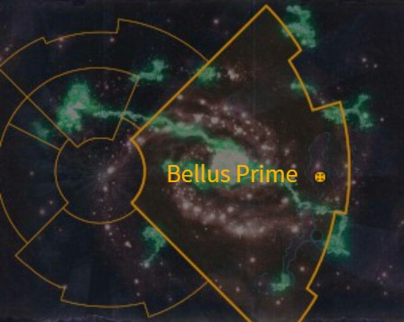

# 1030 贝勒斯主星 Bellus Prime

精校状态：中文行文已逐段精校，部分术语仍为暂定

分类：地理 / 小行星 / 极限星域 Ultima Segmentum

原文来源：https://www.bilibili.com/opus/1171363471469576210

原作者：帝国神选罐头

原文时间：2026年02月20日 14:08

[返回分类目录](目录.md) · [全书目录](../../目录.md)

原篇名：贝鲁斯一号 Bellus Prime

<!-- A1030-B0001 图片 -->

<!-- A1030-B0002 -->

原译文

Map 地图

**校订译文**

Map 地图

<!-- /A1030-B0002 -->

<!-- A1030-B0003 -->
### Basic Data 基本资料

原题：Basic Data 基础数据

<!-- /A1030-B0003 -->

<!-- A1030-B0004 -->
**英文原文**

Name:Bellus Prime

<!-- /A1030-B0004 -->

<!-- A1030-B0005 -->

原译文

名称：贝鲁斯一号

**校订译文**

名称：贝勒斯主星

<!-- /A1030-B0005 -->

<!-- A1030-B0006 -->
**英文原文**

Segmentum:Ultima Segmentum

<!-- /A1030-B0006 -->

<!-- A1030-B0007 -->

原译文

星域：极限星域

**校订译文**

星域：极限星域

<!-- /A1030-B0007 -->

<!-- A1030-B0008 -->
**英文原文**

Class:War World, Quarry World

<!-- /A1030-B0008 -->

<!-- A1030-B0009 -->

原译文

类别：战争世界，矿场世界

**校订译文**

类别：战争世界、采石世界

<!-- /A1030-B0009 -->

<!-- A1030-B0010 -->
**英文原文**

Bellus Prime is a Quarry World that is currently being invaded by the Necrons of the Sautekh Dynasty.

<!-- /A1030-B0010 -->

<!-- A1030-B0011 -->

原译文

贝鲁斯一号是一个矿场世界，目前正被索泰克王朝的死灵入侵。

**校订译文**

贝勒斯主星是一颗采石世界；按底稿所述时点，索泰克王朝的太空死灵正在入侵。

**校注：** Bellus Prime沿18贝勒斯主星；Quarry World为采石世界，区别泛称采矿／矿业世界。

<!-- /A1030-B0011 -->

本篇核心术语与暂定项

以下列出本篇出现的英文原形及核心术语表用词。同形词可能指不同对象，具体词义以本篇正文和校注为准；单复数、别名和仅见于图注的名称可能尚未列入。完整候选见[术语表](../../术语表/双语术语候选.csv)。

| 英文 | 采用中文 | 状态 |
| --- | --- | --- |
| Necrons | 太空死灵 | 官方已核对 |
| Sautekh Dynasty | 索泰克王朝 | 暂定·官方待核 |
| Ultima Segmentum | 极限星域 | 暂定·官方待核 |
| Segmentum | 星域 | 暂定·官方待核 |
| Bellus Prime | 贝勒斯主星 | 暂定·官方待核 |
| War World | 战争世界 | 暂定·官方待核 |
| Quarry World | 采石世界 | 暂定·官方待核 |

