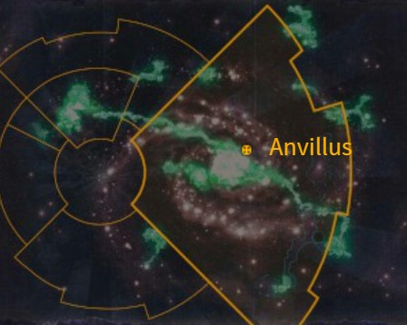

# 1031 安维鲁斯 Anvillus

精校状态：中文行文已逐段精校，部分术语仍为暂定

分类：地理 / 小行星 / 极限星域 Ultima Segmentum

原文来源：https://www.bilibili.com/opus/1203930563453386753

原作者：帝国神选罐头

原文时间：2026年05月19日 08:25

[返回分类目录](目录.md) · [全书目录](../../目录.md)

<!-- A1031-B0001 -->
### Basic Data 基本资料

原题：Basic Data 基础数据

<!-- /A1031-B0001 -->

<!-- A1031-B0002 图片 -->

<!-- A1031-B0003 -->

原译文

Map 地图

**校订译文**

Map 地图

<!-- /A1031-B0003 -->

<!-- A1031-B0004 -->
**英文原文**

Name:Anvillus

<!-- /A1031-B0004 -->

<!-- A1031-B0005 -->

原译文

名称：安维鲁斯

**校订译文**

名称：安维鲁斯

<!-- /A1031-B0005 -->

<!-- A1031-B0006 -->
**英文原文**

Segmentum:Ultima Segmentum

<!-- /A1031-B0006 -->

<!-- A1031-B0007 -->

原译文

星域：极限星域

**校订译文**

星域：极限星域

<!-- /A1031-B0007 -->

<!-- A1031-B0008 -->
**英文原文**

Affiliation:Imperium

<!-- /A1031-B0008 -->

<!-- A1031-B0009 -->

原译文

隶属：帝国

**校订译文**

隶属：帝国

<!-- /A1031-B0009 -->

<!-- A1031-B0010 -->
**英文原文**

Class:Forge World

<!-- /A1031-B0010 -->

<!-- A1031-B0011 -->

原译文

类别：铸造世界

**校订译文**

类别：铸造世界

<!-- /A1031-B0011 -->

<!-- A1031-B0012 -->
**英文原文**

Tithe Grade:Aptus Non

<!-- /A1031-B0012 -->

<!-- A1031-B0013 -->

原译文

什一税等级：特级免税

**校订译文**

什一税等级：特级免税

<!-- /A1031-B0013 -->

<!-- A1031-B0014 -->
**英文原文**

Anvillus is a Forge World of the Imperium. Dating back to the time of the Great Crusade, it was known to be one of the few Forge Worlds that could rival Mars in manufacturing capacity.

<!-- /A1031-B0014 -->

<!-- A1031-B0015 -->

原译文

安维鲁斯是一个帝国的铸造世界。早在大远征时期，它就被认为是少数几个在制造能力上可以与火星相媲美的铸造世界之一。

**校订译文**

安维鲁斯是帝国铸造世界。早在大远征时期，它就以制造能力足以媲美火星而闻名，是少数拥有这种实力的铸造世界之一。

<!-- /A1031-B0015 -->

<!-- A1031-B0016 -->
## Overview 概述

<!-- /A1031-B0016 -->

<!-- A1031-B0017 -->
**英文原文**

During the Great Crusade, the Blood Angels established a long tradition of acting as the honour guard of Anvillus. By the outbreak of the Horus Heresy, a demi-company was stationed on the Forge World as it tore itself apart in civil war between the loyalist and traitor Mechanicum. Though order was eventually restored to Anvillus, none spoke of the fate that befell the Blood Angels there. However, each year on the exact anniversary of the Anvillus war, a warp-barge from Anvillus arrives at Baal bearing tribute in the form of exactly one half a company's worth of arms and armour.

<!-- /A1031-B0017 -->

<!-- A1031-B0018 -->

原译文

在大远征期间，圣血天使建立了充当安维鲁斯荣誉卫队的悠久传统。到荷鲁斯叛乱爆发时，一个半连队驻扎在铸造世界，因为它在忠诚派和叛徒机械教之间的内战中四分五裂。尽管安维鲁斯最终恢复了秩序，但没有人提及那里圣血天使的命运。然而，在每年的安维鲁斯战争的周年纪念日，一艘来自安维鲁斯的亚空间驳船都会抵达巴尔，以相当于半个连队的武器和盔甲的形式向巴尔致敬。

**校订译文**

大远征期间，圣血天使形成了担任安维鲁斯荣誉卫队的长期传统。荷鲁斯之乱爆发时，约半个连的战士驻守此地，忠诚派与叛变机械教之间的内战却使这颗世界陷入分裂。秩序最终恢复，但再没有人谈及这些圣血天使的下落。此后，每逢安维鲁斯战争的周年纪念日，一艘当地亚空间驳船都会抵达巴尔，送上恰好足以装备半个连的武器与护甲，作为贡礼。

**校注：** demi-company为半个连，不是一个半连；年贡数量也明确是半连装备。

<!-- /A1031-B0018 -->

<!-- A1031-B0019 -->
**英文原文**

Anvillus is known for the construction of Warlord Battle Titans of the Mars-Alpha Pattern.

<!-- /A1031-B0019 -->

<!-- A1031-B0020 -->

原译文

安维鲁斯以建造火星-阿尔法型的军阀战斗泰坦而闻名。

**校订译文**

安维鲁斯以建造火星-阿尔法型战将级战斗泰坦而闻名。

**校注：** Warlord Battle Titan沿已核Warlord Titan的战将级词根；保留Mars-Alpha具体型号，不据此认证全型号官译。

<!-- /A1031-B0020 -->

本篇核心术语与暂定项

以下列出本篇出现的英文原形及核心术语表用词。同形词可能指不同对象，具体词义以本篇正文和校注为准；单复数、别名和仅见于图注的名称可能尚未列入。完整候选见[术语表](../../术语表/双语术语候选.csv)。

| 英文 | 采用中文 | 状态 |
| --- | --- | --- |
| Blood Angels | 圣血天使 | 官方已核对 |
| Horus Heresy | 荷鲁斯之乱 | 官方已核对 |
| Warp | 亚空间 | 官方已核对 |
| Imperium | 帝国 | 暂定·简称 |
| Mechanicum | 机械教 | 暂定·历史称谓 |
| Forge World | 铸造世界 | 暂定·官方待核 |
| Great Crusade | 大远征 | 暂定·官方待核 |
| Horus | 荷鲁斯 | 暂定·官方待核 |
| Ultima Segmentum | 极限星域 | 暂定·官方待核 |
| Segmentum | 星域 | 暂定·官方待核 |
| Mars | 火星 | 暂定·官方待核 |
| Baal | 巴尔 | 暂定·官方待核 |
| Aptus Non | 特级免税 | 暂定·官方待核 |
| Honour Guard | 荣誉卫队 | 暂定·官方待核 |
| Anvillus | 安维鲁斯 | 暂定·官方待核 |
| The Blood | 鲜血 | 暂定·官方待核 |

