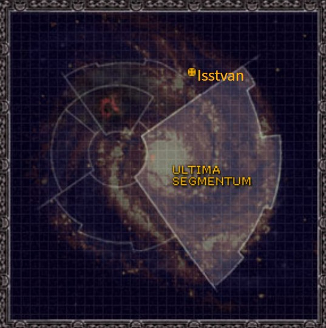

# 1032 伊斯塔万五号 Isstvan V

精校状态：中文行文已逐段精校，部分术语仍为暂定

分类：地理 / 小行星 / 极限星域 Ultima Segmentum

原文来源：https://www.bilibili.com/opus/1060007656772599808

原作者：帝国神选罐头

原文时间：2025年04月26日 12:11

[返回分类目录](目录.md) · [全书目录](../../目录.md)

<!-- A1032-B0001 图片 -->

<!-- A1032-B0002 -->

原译文

Map 地图

**校订译文**

Map 地图

<!-- /A1032-B0002 -->

<!-- A1032-B0003 -->
### Basic Data 基本资料

原题：Basic Data 基础信息

<!-- /A1032-B0003 -->

<!-- A1032-B0004 -->
**英文原文**

Name:Isstvan V

<!-- /A1032-B0004 -->

<!-- A1032-B0005 -->

原译文

名称：伊斯塔万五号

**校订译文**

名称：伊斯塔万五号

<!-- /A1032-B0005 -->

<!-- A1032-B0006 -->
**英文原文**

Segmentum:Ultima Segmentum

<!-- /A1032-B0006 -->

<!-- A1032-B0007 -->

原译文

星域：极限星域

**校订译文**

星域：极限星域

<!-- /A1032-B0007 -->

<!-- A1032-B0008 -->
**英文原文**

Sector:Unknown

<!-- /A1032-B0008 -->

<!-- A1032-B0009 -->

原译文

星区：未知

**校订译文**

星区：未知

<!-- /A1032-B0009 -->

<!-- A1032-B0010 -->
**英文原文**

System:Isstvan system

<!-- /A1032-B0010 -->

<!-- A1032-B0011 -->

原译文

星系：伊斯塔万星系

**校订译文**

星系：伊斯塔万星系

<!-- /A1032-B0011 -->

<!-- A1032-B0012 -->
**英文原文**

Population:Unknown

<!-- /A1032-B0012 -->

<!-- A1032-B0013 -->

原译文

人口：未知

**校订译文**

人口：未知

<!-- /A1032-B0013 -->

<!-- A1032-B0014 -->
**英文原文**

Affiliation:Unknown

<!-- /A1032-B0014 -->

<!-- A1032-B0015 -->

原译文

隶属：未知

**校订译文**

隶属：未知

<!-- /A1032-B0015 -->

<!-- A1032-B0016 -->
**英文原文**

Class:Unknown

<!-- /A1032-B0016 -->

<!-- A1032-B0017 -->

原译文

级别：未知

**校订译文**

类别：未知

<!-- /A1032-B0017 -->

<!-- A1032-B0018 -->
**英文原文**

Tithe Grade:Unknown

<!-- /A1032-B0018 -->

<!-- A1032-B0019 -->

原译文

什一税等级：未知

**校订译文**

什一税等级：未知

<!-- /A1032-B0019 -->

<!-- A1032-B0020 -->
**英文原文**

The planet of Isstvan V is widely known for the infamous Drop Site Massacre.

<!-- /A1032-B0020 -->

<!-- A1032-B0021 -->

原译文

伊斯塔万五号星球因臭名昭著的登陆点大屠杀而广为人知。

**校订译文**

伊斯塔万五号星球因臭名昭著的登陆点大屠杀而广为人知。

<!-- /A1032-B0021 -->

<!-- A1032-B0022 -->
## History 历史

<!-- /A1032-B0022 -->

<!-- A1032-B0023 -->
**英文原文**

Isstvan V was the site of the near demise of the Iron Hands, Salamanders and Raven Guard loyalist Space Marine Legions following a trap set by Horus. The plan essentially consisted of opposing the loyalist marines with the openly traitorous legions the Sons of Horus, World Eaters, Death Guard and Emperor's Children; followed by having the Night Lords, Iron Warriors, Word Bearers and Alpha Legion, who were believed to be loyal but were actually pledged to Horus, stab the loyalists in the back. It resulted in the almost complete annihilation of the three loyalist legions, with only a few battle brothers escaping alive, and left the Imperium severely weakened in the face of Horus' onslaught.

<!-- /A1032-B0023 -->

<!-- A1032-B0024 -->

原译文

伊斯塔万五号是钢铁之手、火蜥蜴和暗鸦守卫忠诚派星际战士在荷鲁斯设下陷阱后险些灭亡的地方。该计划主要包括用公开叛变的军团——荷鲁斯之子、吞世者、死亡守卫和帝皇之子—来对抗忠诚派战士；随后，午夜领主、钢铁勇士、怀言者和阿尔法军团，他们被认为是忠诚派，但实际上承诺了荷鲁斯，在背后捅了忠诚派一刀。这导致了三个忠诚派军团几乎完全被消灭，只有少数战斗兄弟幸存下来，并使帝国在荷鲁斯的猛攻下严重削弱。

**校订译文**

伊斯塔万五号是荷鲁斯布下陷阱、使钢铁之手、火蜥蜴和暗鸦守卫三个忠诚军团几乎覆灭的地方。他先让公开叛变的荷鲁斯之子、吞世者、死亡守卫和帝皇之子迎击忠诚派，再让仍被视作忠诚者、实际早已效忠荷鲁斯的午夜领主、钢铁勇士、怀言者和阿尔法军团，从背后突袭同袍。三个忠诚军团几乎全军覆没，仅少数战斗兄弟生还，帝国抵御荷鲁斯攻势的力量因此大为削弱。

<!-- /A1032-B0024 -->

<!-- A1032-B0025 -->
**英文原文**

At the start of the Horus Heresy, Warmaster Horus apparently only had three other Primarchs and their respective Legions at his side. Under his command were his own Sons of Horus, joined by Angron and his World Eaters, Fulgrim with his Emperor's Children, and Mortarion and the Death Guard. After ridding himself of all suspected Loyalist members inside the three Legions at Isstvan III, he choose Isstvan V as his command post and prepared a deadly trap for his former brothers and their Legions. The Emperor ordered the deployment of seven full Space Marine Legions against him, agonizing over the betrayal of his most beloved son. Unknown to the Emperor of Mankind, four of the deployed Primarchs and their Legions had already turned against him, forming a "fifth column" which would strike against the Loyalists at the most decisive moment.

<!-- /A1032-B0025 -->

<!-- A1032-B0026 -->

原译文

在荷鲁斯叛乱开始时，战帅荷鲁斯显然只有另外三位原体和他们各自的军团在他身边。在他的指挥下，有他自己的荷鲁斯之子，还有安格隆和他的吞世者，福格瑞姆和他的帝皇之子，以及莫塔里安和死亡守卫。在清除了伊斯塔万三号三个军团中所有疑似忠诚派成员后，他选择伊斯塔万五号作为他的指挥部，并为他的前兄弟和他们的军团准备了一个致命的陷阱。帝皇下令部署七支完整的星际战士军团来对付他，对他最心爱的儿子的背叛感到痛苦。人类帝皇不知道的是，部署的四名原体及其军团已经转而反对他，组成了一支“第五纵队”，将在最关键的时刻打击忠诚派。

**校订译文**

荷鲁斯之乱初起时，战帅身边公开支持他的似乎只有另外三位原体及其军团：安格隆与吞世者、福格瑞姆与帝皇之子，以及莫塔里安与死亡守卫，加上他自己的荷鲁斯之子。清除伊斯塔万三号上各军团内部疑似忠诚者后，他选择伊斯塔万五号作为指挥基地，为昔日兄弟与他们的军团设下致命圈套。帝皇痛心于爱子的背叛，下令七个完整星际战士军团出征，却不知道其中四位原体及其军团早已倒戈，将作为“第五纵队”在关键时刻打击忠诚派。

**校注：** 英文列荷鲁斯本部加三支盟军，却接着写清洗“three Legions”；本段为避免掩饰矛盾，正文称各军团，具体三／四军团计数差异保留此注，参见1033四军团名单。

<!-- /A1032-B0026 -->

<!-- A1032-B0027 -->
**英文原文**

Prior to the landing of the planet, Fulgrim and the Emperor's Children built fortifications and trenches, able to protect the traitor legions from orbital bombardment. The initial naval operations seemed to go well for the Loyalist side. The Imperial Navy managed to gain orbit over Isstvan V and the Legions proceeded with their planetary deployment. Thousands of Drop Pods and Stormbirds were deployed for the drop. The first wave was under the overall command of Ferrus Manus and besides his own Legion, the Iron Hands, the Loyalist forces included the Salamanders led by Vulkan, and the Raven Guard under Corax. Vulkan's Legion hit the left side of the traitors, Ferrus Manus, Gabriel Santar, and 10 full companies of Morlock Terminators went straight to the middle, and Corax's Legion hit the right side of the enemy position. They landed right into a bloodbath. The odds were considered equal: 30,000 traitors against 40,000 loyalists. Horus was aware of the chosen drop site and his troops fell upon the surprised Legions. Ferrus Manus engaged Fulgrim in a ferocious duel, but ultimately failed and was defeated. The Loyalists retreated towards the apparent safety of their brothers of the second wave.

<!-- /A1032-B0027 -->

<!-- A1032-B0028 -->

原译文

在行球登陆之前，福格瑞姆和帝皇之子建造了防御工事和战壕，能够保护叛徒军团免受轨道轰炸。最初的海军行动似乎对忠诚派来说进展顺利。帝国海军设法在伊斯塔万五号上空进入轨道，军团继续进行行星部署。数千个空投舱和风暴鸟被部署用于空投。第一波由费鲁斯·马努斯全面指挥，除了他自己的军团钢铁之手外，忠诚派部队还包括沃坎领导的火蜥蜴和科拉克斯领导的暗鸦守卫。沃坎的军团击中了叛徒的左侧，费鲁斯·马努斯、加百列·桑塔尔，10个完整的莫洛克终结者连队直接进入了中间，而科拉克斯的军团则击中了敌人阵地的右侧。他们直接陷入了血战。可能性被认为是相等的：30000名叛徒对40000名忠诚者。荷鲁斯知道选定的空投地点，他的部队向惊讶的军团扑去。费鲁斯·马努斯与福格瑞姆进行了一场激烈的决斗，但最终失败并被击败。忠诚派撤退到第二波兄弟的明显安全地带。

**校订译文**

登陆前，福格瑞姆与帝皇之子修筑了抵御轨道轰炸的工事和壕沟。忠诚派最初的太空行动进展顺利，帝国海军取得伊斯塔万五号上空轨道位置，军团随即以数千艘空降舱与风暴鸟展开登陆。第一波由费鲁斯·马努斯总指挥，参战者除钢铁之手外，还有沃坎的火蜥蜴与科拉克斯的暗鸦守卫。沃坎进攻叛军左翼；费鲁斯、加百列·桑塔尔及十个满编莫洛克终结者连直扑中央；科拉克斯攻击右翼。三万叛军对阵四万忠诚者，双方原被认为势均力敌，登陆者却直接踏入血海。荷鲁斯早已知悉登陆地点，部队骤然袭向猝不及防的忠诚军团。费鲁斯与福格瑞姆激烈决斗，最终败北。忠诚派于是撤向第二波援军所在处，以为那里安全。

**校注：** odds equal指战局被认为势均力敌，并非兵力数相等；30,000/40,000及十个满编终结者连均照原文。后文明确第一波遭背叛，apparent safety应为看似安全。

<!-- /A1032-B0028 -->

<!-- A1032-B0029 -->
**英文原文**

The Legions of the second wave were no longer loyal to the Emperor. The Night Lords of Konrad Curze, the Iron Warriors of Perturabo, the Word Bearers of Lorgar, and the Alpha Legion of Alpharius fell upon their unsuspecting brothers and the ensuing slaughter is widely known as the Drop Site Massacre. A phrase from the Warmaster himself can easily summarise the whole battle: "When the traitor's hand strikes, it strikes with the strength of a Legion."

<!-- /A1032-B0029 -->

<!-- A1032-B0030 -->

原译文

第二波军团不再忠于帝皇。康拉德·科兹的午夜领主、佩图拉博的钢铁勇士、珞珈的怀言者和阿尔法瑞斯的阿尔法军团袭击了他们毫无戒心的兄弟，随后的屠杀被广泛称为登陆点大屠杀。战帅本人的一句话可以很容易地概括整个战斗：“当叛徒之手发动攻击时，它会以一整个军团的力量发动攻击。”

**校订译文**

第二波军团却早已不再忠于帝皇。康拉德·科兹的午夜领主、佩图拉博的钢铁勇士、珞珈的怀言者和阿尔法瑞斯的阿尔法军团，向毫无戒心的兄弟发起攻击。随后的屠杀便是广为人知的登陆点大屠杀。战帅的一句话足以概括这一战：“叛徒之手一旦挥出，就带着整支军团的力量。”

<!-- /A1032-B0030 -->

<!-- A1032-B0031 -->
**英文原文**

After the battle, the head of Ferrus Manus was delivered by Fulgrim to Horus as a trophy. Only a few Loyalist Space Marines, bearing the gene-seed of their fallen brothers and carrying the critically wounded Corax, managed to escape. A loyal Primarch had fallen in battle, another was severely wounded, and a third was missing in action. Vulkan was missing, and how he ultimately managed to survive and to escape is quite unclear. It was disastrous news for the Emperor and the Imperium.

<!-- /A1032-B0031 -->

<!-- A1032-B0032 -->

原译文

战斗结束后，费鲁斯·马努斯的首级被福格瑞姆作为战利品交给荷鲁斯。只有少数忠诚的星际战士携带着他们死去兄弟的基因种子，并携带着重伤的科拉克斯，设法逃脱了。一位忠诚的原体在战斗中倒下，另一位受重伤，第三位在战斗中失踪。沃坎失踪了，他最终是如何幸存下来并逃脱的尚不清楚。这对帝皇和帝国来说是个灾难性的消息。

**校订译文**

战后，福格瑞姆将费鲁斯·马努斯的首级作为战利品献给荷鲁斯。仅有少数忠诚星际战士成功逃脱，带走阵亡同袍的基因种子与重伤的科拉克斯。一位忠诚原体阵亡，一位重伤，另一位则失踪：沃坎不知所终，而按这段记载，他如何幸存并逃脱仍不清楚。这对帝皇和帝国都是灾难性的消息。

**校注：** 原文保留较早版本对沃坎逃脱经过的未知状态，与其他人物篇的详细叙述不一致；不凭后篇补写本段未给出的情节。

<!-- /A1032-B0032 -->

<!-- A1032-B0033 -->
**英文原文**

Due to the developments at Prospero the rebellion would be further strengthened by Magnus the Red and his Legion, the Thousand Sons, servants of Tzeentch. Horus had nine Space Marine Legions and had all but destroyed three loyal ones. The way to Terra was wide open, and the Battle of Terra would follow.

<!-- /A1032-B0033 -->

<!-- A1032-B0034 -->

原译文

由于普罗斯佩罗的事态发展，赤红之马格努斯和他的军团、千子军团、奸奇的仆人将进一步加强叛乱。荷鲁斯有九个星际战士军团，几乎摧毁了三个忠诚的军团。通往泰拉的道路是敞开的，泰拉之战也将随之而来。

**校订译文**

普罗斯佩罗的变故随后又将赤红马格努斯与其千子军团——奸奇的仆从——推入叛军阵营。荷鲁斯掌握九个星际战士军团，又几乎摧毁了三个忠诚军团，通往泰拉的大道已敞开，泰拉之战随之逼近。

<!-- /A1032-B0034 -->

<!-- A1032-B0035 -->
**英文原文**

During a later date the Second Pacification of Isstvan V happened, in which the Desert Lions Chapter, accompanied by an attached cohort of Legio Cybernetica robots, attacked on the planet's defence forts. The chapter was preceded by the cohort, which had been programmed to advance on the defences in an apparently mindless fashion. Easily destroyed by the defenders, they succeeded in mapping out the defenders' fire-plans and blind spots. When the Desert Lions launched their attack only seven Marines were lost. All surviving robots of the cohort were inducted into the chapter as honourary members as a mark of respect.

<!-- /A1032-B0035 -->

<!-- A1032-B0036 -->

原译文

在后来的日子里，第二次伊斯塔万五号平定发生了，沙漠狮战团在一组附属的智控军团机兵的陪同下，袭击了行星的防御堡垒。该战团前方的大队被编程为以一种明显无意识的方式推进防御。他们很容易被守军摧毁，成功地绘制出了守军的火力计划和盲点。当沙漠狮发动进攻时，只有七名战士阵亡。作为尊重的标志，该大队中所有幸存的机兵都作为荣誉成员被纳入战团。

**校订译文**

后来，伊斯塔万五号又爆发第二次平定战役。沙漠雄狮战团在一支配属智控军团机兵大队支援下，进攻当地防御堡垒。机兵被编程为看似毫无思考地向防线推进，走在战团前方。守军虽然轻易摧毁了许多机兵，却因此暴露火力部署与射击死角。沙漠雄狮随后发动进攻，仅损失七名星际战士。为表彰其贡献，所有幸存机兵都获接纳为战团荣誉成员。

**校注：** 机兵先行是用于探明防御火力与盲点的战术，不是推进防御；Desert Lions沿既定沙漠雄狮。

<!-- /A1032-B0036 -->

<!-- A1032-B0037 -->
## Trivia 琐事

<!-- /A1032-B0037 -->

<!-- A1032-B0038 -->
### Conflicting sources 来源冲突

<!-- /A1032-B0038 -->

<!-- A1032-B0039 -->
**英文原文**

The system/planet's name is alternatively spelled Istvaan.

<!-- /A1032-B0039 -->

<!-- A1032-B0040 -->

原译文

该星系/行星的名称也拼写为伊斯塔万。

**校订译文**

该星系与行星名称除 Isstvan 外，也拼作 Istvaan。

**校注：** 直接保留Isstvan／Istvaan两个拼写，原译两者均写伊斯塔万，读者看不出异文。

<!-- /A1032-B0040 -->

<!-- A1032-B0041 -->
**英文原文**

An older version of this battle reports that initially the Emperor was quite reluctant to crush the revolt, as the reasons of the Warmaster were unknown. Fulgrim initially tried to reason and negotiate with the Warmaster only to be seduced by the powers of Slaanesh.

<!-- /A1032-B0041 -->

<!-- A1032-B0042 -->

原译文

这场战斗的旧版本报道称，最初帝皇非常不愿意镇压反叛，因为战帅的原因尚不清楚。福格瑞姆最初试图与战帅进行辩论和谈判，结果却被色孽的力量所诱惑。

**校订译文**

较早版本的叙述称，帝皇起初并不愿直接镇压，因为战帅反叛的动机尚不清楚。福格瑞姆最初也曾试图与荷鲁斯说理谈判，结果反被色孽的力量诱惑。

**校注：** 此段明标较早版本，福格瑞姆最初未叛变的叙述不据新版本删改。

<!-- /A1032-B0042 -->

<!-- A1032-B0043 -->
**英文原文**

One map shows Isstvan closer to Segmentum Obscurus.

<!-- /A1032-B0043 -->

<!-- A1032-B0044 -->

原译文

一张地图显示伊斯塔万更靠近朦胧星域。

**校订译文**

有一幅地图将伊斯塔万标在更靠近朦胧星域的位置。

<!-- /A1032-B0044 -->

本篇核心术语与暂定项

以下列出本篇出现的英文原形及核心术语表用词。同形词可能指不同对象，具体词义以本篇正文和校注为准；单复数、别名和仅见于图注的名称可能尚未列入。完整候选见[术语表](../../术语表/双语术语候选.csv)。

| 英文 | 采用中文 | 状态 |
| --- | --- | --- |
| Space Marines | 星际战士 | 官方已核对 |
| Death Guard | 死亡守卫 | 官方已核对 |
| Thousand Sons | 千子 | 官方已核对 |
| World Eaters | 吞世者 | 官方已核对 |
| Horus Heresy | 荷鲁斯之乱 | 官方已核对 |
| Imperium | 帝国 | 暂定·简称 |
| Imperial Navy | 帝国海军 | 暂定 |
| Legio Cybernetica | 智控军团 | 暂定 |
| Tzeentch | 奸奇 | 官方已核对 |
| Emperor of Mankind | 人类帝皇 | 暂定 |
| Emperor | 帝皇 | 官方已核对 |
| Primarch | 原体 | 官方已核对 |
| Word Bearers | 怀言者 | 暂定·官方待核 |
| Emperor's Children | 帝皇之子 | 官方已核对 |
| Slaanesh | 色孽 | 官方已核对 |
| Iron Warriors | 钢铁勇士 | 暂定·官方待核 |
| Night Lords | 午夜领主 | 暂定·官方待核 |
| Mortarion | 莫塔里安 | 官方已核对 |
| Ferrus Manus | 费鲁斯·马努斯 | 暂定·官方待核 |
| Terra | 泰拉 | 暂定·官方待核 |
| Horus | 荷鲁斯 | 暂定·官方待核 |
| Sons of Horus | 荷鲁斯之子 | 暂定·官方待核 |
| Isstvan III | 伊斯塔万三号 | 暂定·官方待核 |
| Iron Hands | 钢铁之手 | 暂定·官方待核 |
| Fulgrim | 福格瑞姆 | 官方已核对 |
| Magnus the Red | 红魔马格努斯 | 官方已核对 |
| Segmentum Obscurus | 朦胧星域 | 暂定·官方待核 |
| Ultima Segmentum | 极限星域 | 暂定·官方待核 |
| Segmentum | 星域 | 暂定·官方待核 |
| Sector | 星区 | 暂定·官方待核 |
| Vulkan | 沃坎 | 暂定·官方待核 |
| Salamanders | 火蜥蜴 | 暂定·官方待核 |
| Konrad Curze | 康拉德·科兹 | 暂定·官方待核 |
| Obscurus | 朦胧星 | 暂定·官方待核 |
| Alpha Legion | 阿尔法军团 | 暂定·官方待核 |
| Raven Guard | 暗鸦守卫 | 官方已核 |
| Isstvan | 伊斯塔万 | 暂定·官方待核 |
| Gabriel Santar | 加百列·桑塔尔 | 暂定·官方待核 |
| Space Marine | 星际战士 | 暂定·官方待核 |
| Chapter | 战团 | 暂定·官方待核 |
| Terminators | 终结者 | 暂定·官方待核 |
| Desert Lions | 沙漠雄狮 | 暂定·官方待核 |
| Gene-seed | 基因种子 | 暂定·官方待核 |
| Cohort | 大队 | 暂定·官方待核 |
| Lorgar | 珞珈 | 暂定·官方待核 |
| Powers | 能天使 | 暂定·官方待核 |
| Alpharius | 阿尔法瑞斯 | 暂定·官方待核 |
| Angron | 安格隆 | 官方已核对 |
| Morlock | 莫洛克 | 暂定·官方待核 |
| System | 星系（恒星系统） | 暂定·官方待核 |

