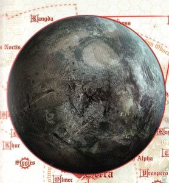

# 1033 伊斯塔万三号 Isstvan III

精校状态：中文行文已逐段精校，部分术语仍为暂定

分类：地理 / 小行星 / 极限星域 Ultima Segmentum

原文来源：https://www.bilibili.com/opus/1186130054332022791

原作者：帝国神选罐头

原文时间：2026年04月01日 09:10

[返回分类目录](目录.md) · [全书目录](../../目录.md)

<!-- A1033-B0001 -->
### Basic Data 基本资料

原题：Basic Data 基础数据

<!-- /A1033-B0001 -->

<!-- A1033-B0002 -->
**英文原文**

Name:Isstvan III

<!-- /A1033-B0002 -->

<!-- A1033-B0003 -->

原译文

名称：伊斯塔万三号

**校订译文**

名称：伊斯塔万三号

<!-- /A1033-B0003 -->

<!-- A1033-B0004 -->
**英文原文**

Segmentum:Ultima Segmentum

<!-- /A1033-B0004 -->

<!-- A1033-B0005 -->

原译文

星域：极限星域

**校订译文**

星域：极限星域

<!-- /A1033-B0005 -->

<!-- A1033-B0006 -->
**英文原文**

System:Isstvan system

<!-- /A1033-B0006 -->

<!-- A1033-B0007 -->

原译文

星系：伊斯塔万星系

**校订译文**

星系：伊斯塔万星系

<!-- /A1033-B0007 -->

<!-- A1033-B0008 -->
**英文原文**

Population:None, was 12 billion pre-Heresy

<!-- /A1033-B0008 -->

<!-- A1033-B0009 -->

原译文

人口：无，叛乱前为120亿

**校订译文**

人口：无；荷鲁斯之乱前为120亿。

<!-- /A1033-B0009 -->

<!-- A1033-B0010 -->
**英文原文**

Affiliation:Imperium

<!-- /A1033-B0010 -->

<!-- A1033-B0011 -->

原译文

隶属：帝国

**校订译文**

隶属：帝国

<!-- /A1033-B0011 -->

<!-- A1033-B0012 -->
**英文原文**

Class:Dead World

<!-- /A1033-B0012 -->

<!-- A1033-B0013 -->

原译文

类别：死亡世界

**校订译文**

类别：死寂世界

<!-- /A1033-B0013 -->

<!-- A1033-B0014 -->
**英文原文**

Tithe Grade:Aptus non

<!-- /A1033-B0014 -->

<!-- A1033-B0015 -->

原译文

什一税世界：特级免税

**校订译文**

什一税等级：特级免税

<!-- /A1033-B0015 -->

<!-- A1033-B0016 图片 -->

<!-- A1033-B0017 -->

原译文

Planetary Image 行星图像

**校订译文**

Planetary Image 行星图像

<!-- /A1033-B0017 -->

<!-- A1033-B0018 -->
**英文原文**

Isstvan III was a Hive World in the Isstvan system. Its destruction and the surrounding circumstances were the first overt signs of Warmaster Horus's turn to the forces of Chaos and the first battle of the Horus Heresy.

<!-- /A1033-B0018 -->

<!-- A1033-B0019 -->

原译文

伊斯塔万三号是伊斯塔万星系中的巢都世界。它的毁灭和周围的境遇是战帅荷鲁斯转向混沌势力和荷鲁斯叛乱的第一场战斗的第一个明显迹象。

**校订译文**

伊斯塔万三号曾是伊斯塔万星系中的一个巢都世界。它的毁灭及其前后发生的事件，首次公开暴露了战帅荷鲁斯已经投向混沌；这里也成为荷鲁斯之乱第一场战役的战场。

<!-- /A1033-B0019 -->

<!-- A1033-B0020 -->
## History 历史

<!-- /A1033-B0020 -->

<!-- A1033-B0021 -->
**英文原文**

Having been founded sometime during the Dark Age of Technology and spared many of the horrors of the Age of Strife, Isstvan III was originally assimilated into the Imperium by the Raven Guard during the Great Crusade. The Raven Guard swiftly conquered the planet, attacking from orbit at night and destroying most of its limited military capabilities in one swoop. By the time dawn rose on the Hive of Khry Vanak, Isstvan III's capital, the planetary leadership and military capability had been bombed into ruin. Aftewards, the administration of the Imperium moved in the wake of the Astartes and rebuilt the planet along the lines of the Imperial Truth.

<!-- /A1033-B0021 -->

<!-- A1033-B0022 -->

原译文

伊斯塔万三号建立于黑暗技术时代的某个时候，并避免了纷争时代的许多恐怖，最初在大远征期间被暗鸦守卫同化入帝国。暗鸦守卫迅速征服了行星，在夜间从轨道上发动攻击，一举摧毁了其大部分有限军事能力。当伊斯塔万三号的首都赫里·瓦纳克巢都的黎明升起时，行星的领导层和军事能力已经被炸成废墟。此后，帝国政府在阿斯塔特之后采取了行动，按照帝国真理的路线重建了这个行星。

**校订译文**

伊斯塔万三号的殖民地建立于科技黑暗时代，躲过了纷争时代的许多灾难。大远征期间，暗鸦守卫将其征服并纳入帝国。军团趁夜从轨道发动攻击，一举摧毁了当地本就有限的大部分军事力量。到首都赫里·瓦纳克巢都迎来黎明时，行星领导层与军事设施已在轰炸中覆灭。此后，帝国行政机构紧随阿斯塔特的脚步进驻，按照帝国真理重建这个世界。

<!-- /A1033-B0022 -->

<!-- A1033-B0023 -->
## Rebellion and Heresy 叛乱与荷鲁斯之乱

原题：Rebellion and Heresy 叛乱和异端

**校注：** 此处 Heresy 指荷鲁斯之乱，与前述总督叛乱相衔接，原译泛作“异端”未表达历史事件。

<!-- /A1033-B0023 -->

<!-- A1033-B0024 -->
**英文原文**

Baron Vardus Praal, Imperial governor of the Isstvan system, eventually rose in revolt against the Imperium, purging Imperial elements for as long as six years before word of the rebellion reached the Council of Terra. The Emperor of Mankind and the Council, ignorant of the change in Horus, charged the Warmaster with crushing this rebellion. Under his command were four Space Marine Legions; his own Sons of Horus, the Emperor's Children of Fulgrim, Mortarion and his Death Guard, and the World Eaters led by Angron. Horus and these Primarchs had fallen to Chaos and took this opportunity to purge all suspected loyalists from their Legions.

<!-- /A1033-B0024 -->

<!-- A1033-B0025 -->

原译文

伊斯塔万星系的帝国总督瓦杜斯·普拉尔男爵最终叛乱对抗帝国，在叛乱的消息传到泰拉议会之前，他清除了帝国成员长达六年之久。人类帝皇和议会，不知道荷鲁斯的变化，要求战帅粉碎这场叛乱。在他的指挥下，有四个星际战士军团；他自己的荷鲁斯之子、福格瑞姆的帝皇之子、莫塔里安和他的死亡守卫，以及由安格隆领导的吞世者。荷鲁斯和这些原体已经堕入混沌，并借此机会将所有疑似的忠诚派从军团中清除。

**校订译文**

伊斯塔万星系的帝国总督瓦杜斯·普拉尔男爵最终起兵反叛帝国。他对效忠帝国者的清洗持续了足足六年，叛乱的消息才传到泰拉议会。人类帝皇与议会尚不知荷鲁斯已变节，命令战帅镇压叛乱。荷鲁斯麾下集结了四支星际战士军团：他自己的荷鲁斯之子、福格瑞姆的帝皇之子、莫塔里安的死亡守卫，以及安格隆率领的吞世者。荷鲁斯及这些原体已经投向混沌，正好借此机会清除各自军团中所有疑似仍忠于帝皇的成员。

<!-- /A1033-B0025 -->

<!-- A1033-B0026 -->
**英文原文**

The planned first wave, all suspected loyalists, deployed by Drop pods upon the Choral City, the capital of the planet. Not using the traditional Stormbirds and cutting their communication lines to the fleet, Horus tried to ensure that none of them would survive the massive virus bombardment. Captain Saul Tarvitz of the Emperor's Children, working on a hunch, had managed to remain in the fleet, where he discovered the planned bombardment and commandeered a Thunderhawk to save his betrayed brethren. Thanks to Tarvitz's warning, a few hundred loyal Space Marines managed to survive inside airtight bunkers and bomb shelters. As the putrid gases resulting from the rapidly decaying organic matter filled the atmosphere, Horus ignited a firestorm on the planet which melted the hives and razed the cities across the world. The psychic death scream of the twelve billion is said to have been louder than the Astronomican.

<!-- /A1033-B0026 -->

<!-- A1033-B0027 -->

原译文

计划中的第一波，都是疑似的忠诚派，由空投舱部署在行星首都圣歌城。荷鲁斯没有使用传统的风暴鸟，并切断他们与舰队的通信线路，他试图确保他们都无法在大规模的病毒轰炸中幸存下来。帝皇之子的索尔·塔维茨连长凭直觉设法留在舰队，在那里他发现了计划中的轰炸，并征用了一架雷鹰来拯救他被背叛的兄弟。多亏了塔维茨的警告，几百名忠诚派星际战士设法在密闭的掩体和防空洞中幸存下来。随着快速腐烂的有机物产生的腐烂气体充满大气层，荷鲁斯在行星上引发了一场大火，烧毁了巢都，夷平了世界各地的城市。据说120亿人的灵能死亡尖啸比星炬还要大声。

**校订译文**

计划中的第一波部队全部由疑似忠诚派组成，乘空降舱降落在行星首都圣歌城。荷鲁斯没有动用通常使用的风暴鸟运输机，还切断了地面部队与舰队的通信，试图确保他们无人能从即将开始的大规模病毒轰炸中逃生。帝皇之子连长索尔·塔维茨凭着直觉设法留在舰队，发现了轰炸计划，随即征用一架雷鹰，前去拯救遭到背叛的兄弟。多亏他的警告，数百名忠诚派星际战士及时躲入密闭掩体和防空洞，幸存下来。迅速腐烂的有机物产生的腐败气体弥漫大气后，荷鲁斯将其点燃，在整个星球引发火焰风暴，熔毁巢都，将各地城市夷为平地。据说，120亿人临死时发出的灵能尖啸甚至压过了星炬的信号。

<!-- /A1033-B0027 -->

<!-- A1033-B0028 -->
**英文原文**

Despite this, many loyalists of the four Legions managed to survive, and an enraged Angron, acting against Horus's orders, led his Legion to the surface to slaughter the survivors. Horus, trying to salvage the situation, sent detachments of all his Legions to slay the Loyalists. The Loyalists, fighting tenaciously, turned the planned slaughter into a full-scale battle. Under the command of Captains Garviel Loken and Tarik Torgaddon of the Sons of Horus (redubbed the Luna Wolves), Saul Tarvitz of the Emperor's Children, and Ehrlen of the World Eaters, the loyalists were able to mount a surprising defence in the ruins of the capital city. Ultimately, the Loyalists were crushed, in part to Lucius's betrayal and the orbital bombardment of the Choral City, but made Horus pay dearly. The battle lasted for three months and inflicted huge losses upon the traitors. It was a Pyrrhic victory at best. While the battle raged upon the planet, a handful of loyalists led by Captain Nathaniel Garro of the Death Guard managed to commandeer the frigate Eisenstein and fled to warn the Emperor of Horus's betrayal.

<!-- /A1033-B0028 -->

<!-- A1033-B0029 -->

原译文

尽管如此，四个军团的许多忠诚者还是设法幸存下来，愤怒的安格隆违背荷鲁斯的命令，带领他的军团前往地表屠杀幸存者。荷鲁斯试图挽救局面，派遣了他所有军团的分遣队去杀死忠诚者。忠诚者顽强地战斗，将计划中的屠杀变成了一场全面的战斗。在荷鲁斯之子的加维尔·洛肯和塔里克·托加顿连长（改编为影月苍狼）、帝皇之子的索尔·塔维茨和吞世者的埃尔伦的指挥下，忠诚者能够在首都的废墟中进行令人惊讶的防御。最终，忠诚者被击溃，部分原因是卢修斯的背叛和对圣歌城的轨道轰炸，但这让荷鲁斯付出了沉重的代价。这场战斗持续了三个月，给叛徒造成了巨大损失。这充其量是一场得不偿失的胜利。当这场战斗在行星上肆虐时，由死亡守卫连长纳撒尼尔·伽罗领导的少数忠诚者设法夺取了护卫舰爱森斯坦号，并逃离去警告帝皇关于荷鲁斯的背叛。

**校订译文**

即便如此，四支军团中仍有许多忠诚派幸存。盛怒之下，安格隆违抗荷鲁斯的命令，亲率军团登陆地表，屠杀幸存者。荷鲁斯为挽回局面，也从麾下各军团抽调分遣队，命其消灭忠诚派。然而，忠诚派顽强抵抗，将一场预定的屠杀拖成了全面会战。在荷鲁斯之子连长加维尔·洛肯和塔里克·托加顿、帝皇之子连长索尔·塔维茨，以及吞世者连长埃尔伦的指挥下，他们依托首都废墟组织起出人意料的坚固防线；其中，忠诚的荷鲁斯之子重新使用了“影月苍狼”的旧名。最终，卢修斯的背叛与对圣歌城的轨道轰炸等因素导致忠诚派覆灭，但荷鲁斯也付出了惨重代价。战斗持续了三个月，叛徒伤亡巨大，至多只能算一场得不偿失的惨胜。在地面激战之际，死亡守卫连长纳撒尼尔·伽罗率领少数忠诚派夺取护卫舰爱森斯坦号，逃离星系，前去向帝皇揭露荷鲁斯的背叛。

**校注：** redubbed the Luna Wolves 指忠诚的荷鲁斯之子重新使用军团旧名，不是两名连长“改编”为影月苍狼。

<!-- /A1033-B0029 -->

<!-- A1033-B0030 -->
## Post-Heresy 荷鲁斯之乱后

原题：Post-Heresy 叛乱后

<!-- /A1033-B0030 -->

<!-- A1033-B0031 -->
**英文原文**

Isstvan III would remain a barren, quarantined world. However, millenia after the sole survivor of the original atrocity, the Dreadnought Rylanor, enacted his revenge. Using a sonic beacon to draw Fulgrim to the world, Rylanor detonated an unexploded Virus Bomb. Once again Isstvan III was scoured of whatever life had redeveloped over the millennia, but Fulgrim managed to survive.

<!-- /A1033-B0031 -->

<!-- A1033-B0032 -->

原译文

伊斯塔万三号仍然是一个贫瘠、被隔离的世界。然而，在最初暴行的唯一幸存者的数千年后，无畏瑞兰诺，实施了他的复仇。瑞兰诺使用声波信标将福格瑞姆吸引到世界，引爆了一枚未爆炸的病毒炸弹。伊斯塔万三号再次被清除了数千年来重新发展的任何生命，但Fulgrim设法幸存下来。

**校订译文**

此后，伊斯塔万三号一直是个荒芜且遭到封锁的世界。数千年后，无畏机甲瑞拉诺——按本段的说法，他是最初那场惨案唯一的幸存者——实施了自己的复仇。他利用声波信标将福格瑞姆引来，随后引爆一枚尚未爆炸的病毒炸弹。数千年间重新在伊斯塔万三号上繁衍的生命再一次被清除，但福格瑞姆活了下来。

**校注：** 英文称瑞拉诺为最初惨案“唯一幸存者”，与本书关于洛肯等人的幸存记述存在口径冲突；保留本段归属明确的说法，不据其他条目擅自改写源文。

<!-- /A1033-B0032 -->

<!-- A1033-B0033 -->
## Planetary Data 行星数据

<!-- /A1033-B0033 -->

<!-- A1033-B0034 -->
**英文原文**

System Data: Zd/8876//k/Æ

<!-- /A1033-B0034 -->

<!-- A1033-B0035 -->

原译文

星系数据：Zd/8876//k/Æ

**校订译文**

星系数据：Zd/8876//k/Æ

<!-- /A1033-B0035 -->

<!-- A1033-B0036 -->
**英文原文**

Stellar Grid: I7-Cic/LC-26

<!-- /A1033-B0036 -->

<!-- A1033-B0037 -->

原译文

星际网格：I7-Cic/LC-26

**校订译文**

星际网格：I7-Cic/LC-26

<!-- /A1033-B0037 -->

<!-- A1033-B0038 -->
**英文原文**

Notation: Temperate/Industrialised, Geo-Terran Analogue within 98%

<!-- /A1033-B0038 -->

<!-- A1033-B0039 -->

原译文

记号：温带/工业化，地理-泰拉相似度98%以内

**校订译文**

备注：温带／工业化；地理条件与泰拉的近似度：98%以内。

**校注：** 英文为 within 98%，表达本身不够明确；按字面保留“98%以内”，不能自行改成“至少98%”或“相差2%”。

<!-- /A1033-B0039 -->

<!-- A1033-B0040 -->
## Notes 注释

<!-- /A1033-B0040 -->

<!-- A1033-B0041 -->
**英文原文**

The system and planet's name is alternatively spelled Istvaan.

<!-- /A1033-B0041 -->

<!-- A1033-B0042 -->

原译文

该星系和行星的名字替换拼写为伊斯特万。

**校订译文**

该星系及行星名称的英文另有 Istvaan 这一拼写。

**校注：** 此处讨论英文拼写 Isstvan / Istvaan 的差异，不能仅列另一个汉语音译。

<!-- /A1033-B0042 -->

本篇核心术语与暂定项

以下列出本篇出现的英文原形及核心术语表用词。同形词可能指不同对象，具体词义以本篇正文和校注为准；单复数、别名和仅见于图注的名称可能尚未列入。完整候选见[术语表](../../术语表/双语术语候选.csv)。

| 英文 | 采用中文 | 状态 |
| --- | --- | --- |
| Space Marines | 星际战士 | 官方已核对 |
| Death Guard | 死亡守卫 | 官方已核对 |
| World Eaters | 吞世者 | 官方已核对 |
| Horus Heresy | 荷鲁斯之乱 | 官方已核对 |
| Astronomican | 星炬 | 暂定 |
| Imperium | 帝国 | 暂定·简称 |
| Dark Age of Technology | 黑暗科技时代 | 暂定 |
| Emperor of Mankind | 人类帝皇 | 暂定 |
| Emperor | 帝皇 | 官方已核对 |
| Hive World | 巢都世界 | 暂定·官方待核 |
| Emperor's Children | 帝皇之子 | 官方已核对 |
| Great Crusade | 大远征 | 暂定·官方待核 |
| Mortarion | 莫塔里安 | 官方已核对 |
| Age of Strife | 纷争时代 | 暂定·官方待核 |
| Terra | 泰拉 | 暂定·官方待核 |
| Luna Wolves | 影月苍狼 | 暂定·官方待核 |
| Horus | 荷鲁斯 | 暂定·官方待核 |
| Garviel Loken | 加维尔·洛肯 | 暂定·官方待核 |
| Sons of Horus | 荷鲁斯之子 | 暂定·官方待核 |
| Isstvan III | 伊斯塔万三号 | 暂定·官方待核 |
| Fulgrim | 福格瑞姆 | 官方已核对 |
| Ultima Segmentum | 极限星域 | 暂定·官方待核 |
| Segmentum | 星域 | 暂定·官方待核 |
| Lucius | 卢修斯 | 暂定·官方待核 |
| Luna | 月球 | 暂定·官方待核 |
| Imperial Truth | 帝国真理 | 暂定·官方待核 |
| Aptus Non | 特级免税 | 暂定·官方待核 |
| Tarik Torgaddon | 塔里克·托加顿 | 暂定·官方待核 |
| Raven Guard | 暗鸦守卫 | 官方已核 |
| Isstvan | 伊斯塔万 | 暂定·官方待核 |
| Nathaniel Garro | 纳撒尼尔·伽罗 | 暂定·官方待核 |
| Space Marine | 星际战士 | 暂定·官方待核 |
| Captain | 连长 | 暂定·官方待核 |
| Virus Bomb | 病毒炸弹 | 暂定·官方待核 |
| Saul Tarvitz | 索尔·塔维兹 | 暂定·官方待核 |
| Rylanor | 瑞拉诺 | 暂定·官方待核 |
| Angron | 安格隆 | 官方已核对 |
| Dreadnought | 无畏机甲 | 暂定·官方待核 |
| The Dark | 《黑暗》 | 暂定·官方待核 |
| System | 星系（恒星系统） | 暂定·官方待核 |
| Dead World | 死寂世界 | 暂定·官方待核 |
| Vardus | 瓦杜斯 | 暂定·官方待核 |
| Ehrlen | 埃尔伦 | 暂定·官方待核 |
| Vardus Praal | 瓦杜斯·普拉尔 | 暂定·官方待核 |
| Choral City | 圣歌城 | 暂定·官方待核 |
| Khry Vanak | 赫里·瓦纳克 | 暂定·官方待核 |
| Eisenstein | 艾森斯坦号 | 暂定·官方待核 |

