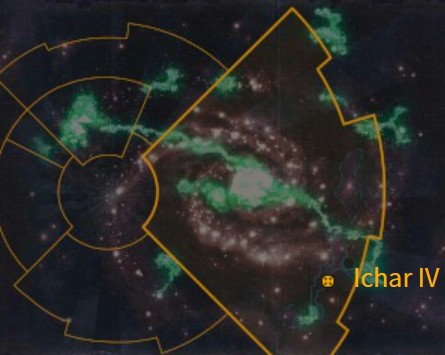

# 1034 伊卡尔四号 Ichar IV

精校状态：中文行文已逐段精校，部分术语仍为暂定

分类：地理 / 小行星 / 极限星域 Ultima Segmentum

原文来源：https://www.bilibili.com/opus/1154290718737432578

原作者：帝国神选罐头

原文时间：2026年01月05日 13:57

[返回分类目录](目录.md) · [全书目录](../../目录.md)

<!-- A1034-B0001 图片 -->

<!-- A1034-B0002 -->

原译文

Map 地图

**校订译文**

Map 地图

<!-- /A1034-B0002 -->

<!-- A1034-B0003 -->
### Basic Data 基本资料

原题：Basic Data 基础信息

<!-- /A1034-B0003 -->

<!-- A1034-B0004 -->
**英文原文**

Name:Ichar IV

<!-- /A1034-B0004 -->

<!-- A1034-B0005 -->

原译文

名称：伊卡尔四号

**校订译文**

名称：伊卡尔四号

<!-- /A1034-B0005 -->

<!-- A1034-B0006 -->
**英文原文**

Segmentum:Ultima Segmentum

<!-- /A1034-B0006 -->

<!-- A1034-B0007 -->

原译文

星域：极限星域

**校订译文**

星域：极限星域

<!-- /A1034-B0007 -->

<!-- A1034-B0008 -->
**英文原文**

System:Ichar System

<!-- /A1034-B0008 -->

<!-- A1034-B0009 -->

原译文

星系：伊卡尔星系

**校订译文**

星系：伊卡尔星系

<!-- /A1034-B0009 -->

<!-- A1034-B0010 -->
**英文原文**

Population:500,000,000,000

<!-- /A1034-B0010 -->

<!-- A1034-B0011 -->

原译文

人口：5000,0000,0000

**校订译文**

人口：5000亿

<!-- /A1034-B0011 -->

<!-- A1034-B0012 -->
**英文原文**

Affiliation:Imperium

<!-- /A1034-B0012 -->

<!-- A1034-B0013 -->

原译文

隶属：帝国

**校订译文**

隶属：帝国

<!-- /A1034-B0013 -->

<!-- A1034-B0014 -->
**英文原文**

Class:Hive World

<!-- /A1034-B0014 -->

<!-- A1034-B0015 -->

原译文

类别：巢都世界

**校订译文**

类别：巢都世界

<!-- /A1034-B0015 -->

<!-- A1034-B0016 -->
**英文原文**

Tithe Grade:Exactis Extremis

<!-- /A1034-B0016 -->

<!-- A1034-B0017 -->

原译文

什一税等级：第一级高等

**校订译文**

什一税等级：第一级高等

<!-- /A1034-B0017 -->

<!-- A1034-B0018 -->
**英文原文**

Ichar IV is a Hive World located in the Ultima Segmentum, to the galactic north of Ultramar. It is a vital industrial centre for the region, producing supplies for many armies. Two of the planet's major exports are ore and myco-proteins.

<!-- /A1034-B0018 -->

<!-- A1034-B0019 -->

原译文

伊卡尔四号是一个巢都世界，位于奥特拉玛的银河系以北的极限星域。它是该地区重要的工业中心，为许多军队生产物资。行星的两个主要出口产品是矿石和真菌蛋白。

**校订译文**

伊卡尔四号是极限星域的一个巢都世界，位于奥特拉玛的银河北侧。它是当地重要的工业中心，为许多军队生产补给，主要出口产品包括矿石和真菌蛋白。

<!-- /A1034-B0019 -->

<!-- A1034-B0020 -->
## The Second Tyrannic War 第二次泰伦战争

<!-- /A1034-B0020 -->

<!-- A1034-B0021 -->
**英文原文**

At the beginning of the Second Tyrannic War, it was infested with Genestealers. A genestealer cult, operating under the name, "the Brotherhood," instigated a rebellion on the planet that caught the attention of Inquisitor Agmar. The Brotherhood had control of the planet by the time Agmar arrived in the system. The inquisitor petitioned the Ultramarines to help put down the rebellion. Marneus Calgar, Chapter Master of the Ultramarines, arrived 39 days later aboard the Battle Barge, Octavius. Eventually, with the combined support of the Ultramarines, PDF forces and the Imperial Guard, the inquisition successfully destroyed the invasion and cleansed the planet of all Genestealers. One of the Imperial Guard units involved was the 13th Penal Legion, a.k.a. "The Last Chancers."

<!-- /A1034-B0021 -->

<!-- A1034-B0022 -->

原译文

在第二次泰伦战争开始时，它被基因窃取者侵扰。一个名为“兄弟会”的基因窃取者教派在行星上煽动了一场叛乱，引起了审判官阿格玛的注意。当阿格玛进入这个星系时，兄弟会已经控制了这个行星。审判官请求极限战士帮助平息叛乱。39天后，极限战士的战团长马涅乌斯·卡尔加乘坐战斗驳船屋大维号抵达。最终，在极限战士、行星防御部队和帝国卫队的共同支援下，审判庭成功地摧毁了入侵，并清除了行星上所有的基因窃取者。参与其中的帝国卫队部队之一是第13刑罚军团，又名“最后投机者”

**校订译文**

第二次泰伦战争开始时，伊卡尔四号已受到基因窃取者的渗透。一个以“兄弟会”为名活动的基因窃取者教派煽动了行星叛乱，引起审判官阿格玛的注意。等阿格玛抵达星系时，兄弟会已经控制了整个行星。审判官于是请求极限战士协助平叛。39天后，战团长马涅乌斯·卡尔加乘战斗驳船屋大维号抵达。在极限战士、行星防御部队和帝国卫队的共同支援下，审判庭最终击败了入侵者，清除了行星上所有的基因窃取者。参战的帝国卫队部队包括第13惩戒军团，又称“最后机会”。

<!-- /A1034-B0022 -->

<!-- A1034-B0023 -->
**英文原文**

After some time massive amounts of Tyranids landed on the Ichar IV including not only mundane Gaunts, Warriors, and Carnifex's but also larger creatures like the Tyrannofex and Hierophant Bio-Titans. The Imperial defenses were reinforced again by Marneus Calgar, who using tactics he had developed in the First Tyrannic War, rallied the defenders of planet and after a ferocious struggle the Tyranids were cast from the world.

<!-- /A1034-B0023 -->

<!-- A1034-B0024 -->

原译文

一段时间后，大量的泰伦登上了伊卡尔四号，不仅包括普通的兵虫、战士虫和刽子手，还包括更大的生物，如暴虐兽和教皇生物泰坦。马涅乌斯·卡尔加再次加强了帝国的防御，他使用了他在第一次泰伦战争中开发的战术，召集了行星的守军，经过激烈的战斗，泰伦被赶出了世界。

**校订译文**

一段时间后，大批泰伦生物登陆伊卡尔四号，其中既有常见的兵虫、泰伦武士和刽子手，也有暴虐兽、圣师兽生物泰坦等更庞大的生物。马涅乌斯·卡尔加再度率军增援，运用自己在第一次泰伦战争中形成的战术，集结并鼓舞行星守军。经过惨烈战斗，守军终于将泰伦赶出了这个世界。

<!-- /A1034-B0024 -->

<!-- A1034-B0025 -->
## Known Locations 著名地点

<!-- /A1034-B0025 -->

<!-- A1034-B0026 -->
**英文原文**

Lomas - the capital

<!-- /A1034-B0026 -->

<!-- A1034-B0027 -->

原译文

罗马斯 - 首都

**校订译文**

罗马斯 - 首都

<!-- /A1034-B0027 -->

本篇核心术语与暂定项

以下列出本篇出现的英文原形及核心术语表用词。同形词可能指不同对象，具体词义以本篇正文和校注为准；单复数、别名和仅见于图注的名称可能尚未列入。完整候选见[术语表](../../术语表/双语术语候选.csv)。

| 英文 | 采用中文 | 状态 |
| --- | --- | --- |
| Imperial Guard | 帝国卫队 | 暂定·语境区分 |
| Tyranids | 泰伦虫族 | 官方已核对 |
| Ultramar | 奥特拉玛 | 官方已核对 |
| Ultramarines | 极限战士 | 官方已核对 |
| Inquisition | 审判庭 | 暂定 |
| Inquisitor | 审判官 | 官方已核对 |
| Imperium | 帝国 | 暂定·简称 |
| Battle Barge | 战斗驳船 | 暂定·官方待核 |
| Hive World | 巢都世界 | 暂定·官方待核 |
| The Brotherhood | 兄弟会 | 暂定·官方待核 |
| Ultima Segmentum | 极限星域 | 暂定·官方待核 |
| Segmentum | 星域 | 暂定·官方待核 |
| Brotherhood | 兄弟会 | 暂定·官方待核 |
| Ichar IV | 伊卡尔四号 | 暂定·官方待核 |
| Master | 导师（审判庭职衔）／舰务官（舰员职务） | 语境定译·官方待核 |
| Carnifex | 刽子手 | 暂定·官方待核 |
| Chapter | 战团 | 暂定·官方待核 |
| Chapter Master | 战团长 | 暂定·官方待核 |
| Marneus Calgar | 马涅乌斯·卡尔加 | 暂定·官方待核 |
| Last Chancers | 最后机会 | 暂定·官方待核 |
| Tyrannofex | 暴虐兽 | 官方已核对 |
| Hierophant | 圣师兽（泰伦单位）／圣职者（职衔） | 语境定译·泰伦单位官译已核 |
| System | 星系（恒星系统） | 暂定·官方待核 |
| Inquisitor Agmar | 审判官阿格玛 | 暂定·官方待核 |
| Lomas | 罗马斯 | 暂定·官方待核 |
| Exactis Extremis | 第一级极等 | 暂定·官方待核 |

