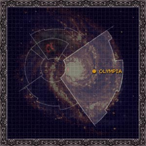
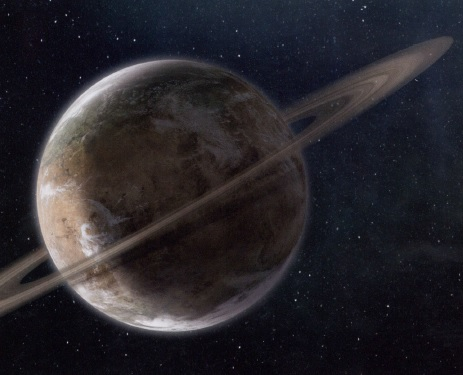

# 1035 奥林匹亚 Olympia

精校状态：中文行文已逐段精校，部分术语仍为暂定

分类：地理 / 小行星 / 极限星域 Ultima Segmentum

原文来源：https://www.bilibili.com/opus/1094116989945774104

原作者：帝国神选罐头

原文时间：2025年07月27日 10:12

[返回分类目录](目录.md) · [全书目录](../../目录.md)

<!-- A1035-B0001 图片 -->

<!-- A1035-B0002 -->

原译文

Map 地图

**校订译文**

Map 地图

<!-- /A1035-B0002 -->

<!-- A1035-B0003 -->
### Basic Data 基本资料

原题：Basic Data 基础信息

<!-- /A1035-B0003 -->

<!-- A1035-B0004 -->
**英文原文**

Name:Olympia

<!-- /A1035-B0004 -->

<!-- A1035-B0005 -->

原译文

名称：奥林匹亚

**校订译文**

名称：奥林匹亚

<!-- /A1035-B0005 -->

<!-- A1035-B0006 -->
**英文原文**

Segmentum:Ultima Segmentum

<!-- /A1035-B0006 -->

<!-- A1035-B0007 -->

原译文

星域：极限星域

**校订译文**

星域：极限星域

<!-- /A1035-B0007 -->

<!-- A1035-B0008 -->
**英文原文**

System:Olympia Majoris System

<!-- /A1035-B0008 -->

<!-- A1035-B0009 -->

原译文

星系：奥利匹亚主星系

**校订译文**

星系：奥林匹亚主星系

<!-- /A1035-B0009 -->

<!-- A1035-B0010 -->
**英文原文**

Affiliation:Iron Warriors

<!-- /A1035-B0010 -->

<!-- A1035-B0011 -->

原译文

隶属：钢铁勇士

**校订译文**

隶属：钢铁勇士

<!-- /A1035-B0011 -->

<!-- A1035-B0012 -->
**英文原文**

Class:Dead World, former Adeptus Astartes Homeworld

<!-- /A1035-B0012 -->

<!-- A1035-B0013 -->

原译文

级别：死亡世界，前阿斯塔特修会家园世界

**校订译文**

类别：死寂世界；原为阿斯塔特修会家园世界。

<!-- /A1035-B0013 -->

<!-- A1035-B0014 图片 -->

<!-- A1035-B0015 -->

原译文

Planetary Image 行星图片

**校订译文**

Planetary Image 行星图片

<!-- /A1035-B0015 -->

<!-- A1035-B0016 -->
**英文原文**

Olympia was the Homeworld to the Iron Warriors Space Marine Legion.

<!-- /A1035-B0016 -->

<!-- A1035-B0017 -->

原译文

奥林匹亚是钢铁勇士星际战士军团的家园世界。

**校订译文**

奥林匹亚是钢铁勇士星际战士军团的家园世界。

<!-- /A1035-B0017 -->

<!-- A1035-B0018 -->
## History 历史

<!-- /A1035-B0018 -->

<!-- A1035-B0019 -->
**英文原文**

Olympia was originally a rugged, mountainous world whose population was concentrated within many city states, spread across the planet's surface. The planet had vast amount of stone available and as such large fortresses were built, and controlling the paths through the mountains and the high ground was very important to military security. One of the city states, the home to the Primarch Perturabo, was named Lochos. The leader of Lochos, known as the Tyrant of Lochos, dominated the region. When The Emperor arrived, he granted Perturabo a Space Marine Legion. He used this new force to depose the Tyrant of Lochos and take control of the planet. He recruited from the population of Olympia and joined The Emperor on his Great Crusade.

<!-- /A1035-B0019 -->

<!-- A1035-B0020 -->

原译文

奥林匹亚最初是一个崎岖多山的世界，人口集中在许多城邦，遍布行星表面。行星上有大量的石头可供使用，因此建造了大型堡垒，控制穿过山脉和高地的道路对军事安全非常重要。其中一个城市，即原体佩图拉博的所在地，被命名为洛科斯。被称为洛科斯暴君的洛科斯领导人统治着该地区。当帝皇到达时，他授予佩图拉博星际战士军团。他利用这股新力量推翻了洛科斯暴君，并控制了行星。他从奥林匹亚的人口中募兵，并加入了帝皇的大远征。

**校订译文**

奥林匹亚原是一个崎岖多山的世界，居民集中生活在遍布地表的众多城邦中。当地石材充足，人们修建起庞大的堡垒；掌控山间通道和制高点，对军事安全至关重要。原体佩图拉博长大的城邦名叫洛科斯，其统治者被称为“洛科斯暴君”，主宰着周边地区。帝皇抵达后，将一支星际战士军团交给佩图拉博。他利用这股新力量推翻洛科斯暴君，控制了整个行星，随后从当地居民中征募兵员，追随帝皇踏上大远征。

**校注：** 英文明确写佩图拉博借军团力量推翻洛科斯暴君；与第642篇关于达美克斯后续统治的记述有版本差异，本段按源文保留。

<!-- /A1035-B0020 -->

<!-- A1035-B0021 -->
**英文原文**

Much later, just prior to the Heresy, Perturabo, already shaken by the Sak'trada Deeps Campaign, learned that Olympia was in rebellion against him. Governor Dammekos had passed away, and in the power vacuum left after his death the Olympian lords had resumed their politicking and bickering. In truth however, the rebellion was covertly engineered by the Word Bearers.

<!-- /A1035-B0021 -->

<!-- A1035-B0022 -->

原译文

很久以后，就在叛乱之前，已经被萨克’特拉达深渊战役动摇的佩图拉博得知奥林匹亚正在反抗他。统治者达美克斯已经去世，在他去世后留下的权力真空中，奥林匹亚领主们重新开始了他们的政治活动和争吵。然而，事实上，这场叛乱是由怀言者秘密策划的。

**校订译文**

许多年后，就在荷鲁斯之乱爆发前夕，已经因萨克’特拉达深渊战役而备受打击的佩图拉博得知，奥林匹亚起兵反叛了他。总督达美克斯去世后留下权力真空，奥林匹亚诸领主又开始争权夺利、相互倾轧。不过，这场叛乱实际上是怀言者在暗中策划的。

<!-- /A1035-B0022 -->

<!-- A1035-B0023 -->
**英文原文**

Perturabo was devastated, and returned to cleanse his world with a terrible rage. He gave the planet's occupants the choice to enact decimation, selecting 1 in every 10 of their own to die, or face extermination and enslavement if they refused. Each city was cleansed street by street, leaving few alive. By the end, Olympia was in slavery and over five million were dead. Some Iron Warriors refused to take part in the carnage, and they too were struck down by their brothers. Great pyres burnt in the skies of Olympia that day. The Iron Warriors became aghast at the genocide they had unleashed, and Perturabo knew his father would never forgive him. Horus on the other hand was more than willing to forgive the Lord of Iron, and even praised him for his decisive action. This helped turn the Iron Warriors to betray the Emperor.\[3\] A few of the Iron Warriors who refused to take part in the decimation, managed to survive their Primarch's wrath and escaped from Olympia. A small number would then band together as Loyalists to the Imperium and began waging a vengeful war against Perturabo and their Legion. However with their numbers so few, the group needed the help of allies in order to continue seeking their revenge against their Primarch, during the Horus Heresy.

<!-- /A1035-B0023 -->

<!-- A1035-B0024 -->

原译文

佩图拉博悲痛欲绝，带着可怕的愤怒回来净化他的世界。他让行星上的居民可以选择实施大屠杀，每10个人中就有1个人死亡，否则如果他们拒绝，将面临灭绝和奴役。每个城市都被一条街一条街地清理干净，几乎没有人活着。到最后，奥林匹亚沦为奴隶，超过500万人死亡。一些钢铁勇士拒绝参与这场大屠杀，他们也被兄弟们击倒了。 那天，奥林匹亚的天空中燃烧着巨大的火堆。钢铁勇士对他们发动的种族灭绝感到震惊，佩图拉博知道他的父亲永远不会原谅他。另一方面，荷鲁斯非常愿意原谅钢铁之主，甚至称赞他果断的行动。这有助于钢铁勇士背叛帝皇。 一些钢铁勇士拒绝参加大屠杀，设法在原体的愤怒中幸存下来，逃离了奥林匹亚。然后，一小部分人联合起来，成为帝国的忠诚者，开始对佩图拉博和他们的军团发动复仇战争。然而，由于他们的人数很少，该组织需要盟友的帮助，以便在荷鲁斯叛乱期间继续寻求对他们的原体的报复。

**校订译文**

佩图拉博深受打击，怀着可怕的怒火返回母星，展开清洗。他命令居民从自己人中每十人选出一人处死，执行十一抽杀；拒绝者则将遭到灭绝或奴役。军队逐城逐街地清洗，留下的幸存者寥寥无几。到一切结束时，奥林匹亚已沦为奴役之地，死亡人数超过500万。一些钢铁勇士拒绝参与屠杀，也被自己的兄弟杀死。那一天，巨大的焚尸火堆映红了奥林匹亚的天空。钢铁勇士对自己造成的种族灭绝惨剧感到恐惧，佩图拉博也知道，父亲永远不会原谅他。荷鲁斯却十分愿意宽恕这位钢铁之主，甚至赞扬他行事果断，这也推动钢铁勇士走向背叛帝皇的道路。少数拒绝参加十一抽杀的钢铁勇士躲过了原体的怒火，逃离奥林匹亚。其中一小部分人结成忠于帝国的队伍，向佩图拉博和自己的军团发动复仇战争。不过，他们人数太少，必须寻求盟友相助，才能在荷鲁斯之乱期间继续向原体复仇。

**校注：** decimation 具体为每十人选出一人处死，原译泛作“大屠杀”遗漏惩罚方式；原文写随后城市清洗、部分军团成员拒绝参与，分别保留。

<!-- /A1035-B0024 -->

<!-- A1035-B0025 -->
**英文原文**

After the failure of the Horus heresy and Horus's death, the Iron Warriors retreated back to their strongholds. Olympia held out against a combined Ultramarines and Imperial Fists attack for two years, but ultimately when it was determined the Loyalists would defeat them, the Iron Warriors triggered their own missile stockpiles. The resulting explosions turned Olympia into a vast barren wasteland and from that day on, the world was declared perdita by the Imperium.

<!-- /A1035-B0025 -->

<!-- A1035-B0026 -->

原译文

在荷鲁斯叛乱失败和荷鲁斯死亡后，钢铁勇士撤退到他们的据点。奥林匹亚抵抗了两年的极限战士和帝国之拳的联合攻击，但最终当确定忠诚派将击败他们时，钢铁勇士触发了自己的导弹库存。由此产生的爆炸使奥林匹亚变成了一片广阔的荒地，从那天起，帝国宣布世界为已失落。

**校订译文**

荷鲁斯之乱失败、荷鲁斯死去后，钢铁勇士退回各自据点。奥林匹亚在极限战士与帝国之拳的联合进攻下坚守了两年。最终，确认忠诚派即将取胜的钢铁勇士引爆了自己的导弹储备，将行星炸成一片广阔的荒芜废土。从此，帝国将这个世界列为 perdita，即“已失落”。

**校注：** perdita 是源文保留的世界状态标签，此处译“已失落”，不等同于另行下达灭绝令。

<!-- /A1035-B0026 -->

本篇核心术语与暂定项

以下列出本篇出现的英文原形及核心术语表用词。同形词可能指不同对象，具体词义以本篇正文和校注为准；单复数、别名和仅见于图注的名称可能尚未列入。完整候选见[术语表](../../术语表/双语术语候选.csv)。

| 英文 | 采用中文 | 状态 |
| --- | --- | --- |
| Adeptus Astartes | 阿斯塔特修会 | 官方已核对 |
| Ultramarines | 极限战士 | 官方已核对 |
| Horus Heresy | 荷鲁斯之乱 | 官方已核对 |
| Imperium | 帝国 | 暂定·简称 |
| Imperial Fists | 帝国之拳 | 暂定 |
| Emperor | 帝皇 | 官方已核对 |
| Primarch | 原体 | 官方已核对 |
| Slavery | 奴隶制 | 编辑用语已统一 |
| Word Bearers | 怀言者 | 暂定·官方待核 |
| Iron Warriors | 钢铁勇士 | 暂定·官方待核 |
| Great Crusade | 大远征 | 暂定·官方待核 |
| Horus | 荷鲁斯 | 暂定·官方待核 |
| Ultima Segmentum | 极限星域 | 暂定·官方待核 |
| Segmentum | 星域 | 暂定·官方待核 |
| Olympia | 奥林匹亚 | 暂定·官方待核 |
| Space Marine Legion | 星际战士军团 | 暂定·官方待核 |
| Space Marine | 星际战士 | 暂定·官方待核 |
| Dammekos | 达美克斯 | 暂定·官方待核 |
| Lochos | 洛科斯 | 暂定·官方待核 |
| System | 星系（恒星系统） | 暂定·官方待核 |
| Dead World | 死寂世界 | 暂定·官方待核 |
| Primarch's Wrath | 原体之怒 | 暂定·官方待核 |

