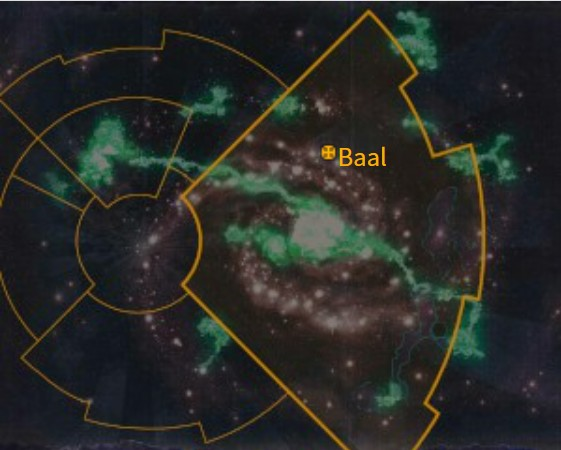
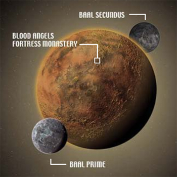

# 1036 巴尔 Baal

精校状态：中文行文已逐段精校，部分术语仍为暂定

分类：地理 / 小行星 / 极限星域 Ultima Segmentum

原文来源：https://www.bilibili.com/opus/1097777912730353670

原作者：帝国神选罐头

原文时间：2025年08月06日 06:58

[返回分类目录](目录.md) · [全书目录](../../目录.md)

<!-- A1036-B0001 图片 -->

<!-- A1036-B0002 -->

原译文

Map 地图

**校订译文**

Map 地图

<!-- /A1036-B0002 -->

<!-- A1036-B0003 -->
### Basic Data 基本资料

原题：Basic Data 基础信息

<!-- /A1036-B0003 -->

<!-- A1036-B0004 -->
**英文原文**

Name:Baal

<!-- /A1036-B0004 -->

<!-- A1036-B0005 -->

原译文

名称：巴尔

**校订译文**

名称：巴尔

<!-- /A1036-B0005 -->

<!-- A1036-B0006 -->
**英文原文**

Segmentum:Ultima Segmentum

<!-- /A1036-B0006 -->

<!-- A1036-B0007 -->

原译文

星域：极限星域

**校订译文**

星域：极限星域

<!-- /A1036-B0007 -->

<!-- A1036-B0008 -->
**英文原文**

System:Baal System

<!-- /A1036-B0008 -->

<!-- A1036-B0009 -->

原译文

星系：巴尔星系

**校订译文**

星系：巴尔星系

<!-- /A1036-B0009 -->

<!-- A1036-B0010 -->
**英文原文**

Population:122,000 (pre-Devastation)

<!-- /A1036-B0010 -->

<!-- A1036-B0011 -->

原译文

人口：12,2000（毁灭前）

**校订译文**

人口：122,000（巴尔毁灭之战前）

<!-- /A1036-B0011 -->

<!-- A1036-B0012 -->
**英文原文**

Affiliation:Imperium (Blood Angels)

<!-- /A1036-B0012 -->

<!-- A1036-B0013 -->

原译文

隶属：帝国（圣血天使）

**校订译文**

隶属：帝国（圣血天使）

<!-- /A1036-B0013 -->

<!-- A1036-B0014 -->
**英文原文**

Class:Adeptus Astartes Homeworld, Death World

<!-- /A1036-B0014 -->

<!-- A1036-B0015 -->

原译文

级别：阿斯塔特修会家园世界，死亡世界

**校订译文**

级别：阿斯塔特修会家园世界，死亡世界

<!-- /A1036-B0015 -->

<!-- A1036-B0016 -->
**英文原文**

Tithe Grade:Adeptus Non

<!-- /A1036-B0016 -->

<!-- A1036-B0017 -->

原译文

什一税等级：特级免税

**校订译文**

什一税等级：特级免税

<!-- /A1036-B0017 -->

<!-- A1036-B0018 图片 -->

<!-- A1036-B0019 -->

原译文

Planetary Image 行星图片

**校订译文**

Planetary Image 行星图片

<!-- /A1036-B0019 -->

<!-- A1036-B0020 -->
**英文原文**

Baal is the homeworld of the Blood Angels and the base of the Chapter's fortress-monastery, Arx Angelicum.

<!-- /A1036-B0020 -->

<!-- A1036-B0021 -->

原译文

巴尔是圣血天使的家园世界，也是战团的堡垒修道院天使堡的所在地。

**校订译文**

巴尔是圣血天使的家园世界，也是战团的要塞修道院天使堡的所在地。

<!-- /A1036-B0021 -->

<!-- A1036-B0022 -->
## History 历史

<!-- /A1036-B0022 -->

<!-- A1036-B0023 -->
**英文原文**

Before the coming of Humanity Baal was inhabited by an unknown Xenos race. Like the future Blood Angels, they were influenced by the powers of the Warp and worshiped a golden angel and an angel of darkness which engaged in an eternal struggle within the Immaterium. The Humans of Baal would come to replace this race and become influenced by these two gods. Every time a son of Baal protects the innocent the Golden Angel grows stronger, while every time one succumbs to the Black Rage the Angel of Darkness grows stronger. When Mankind vanishes from the Galaxy, another race will take their place for these Warp entities.

<!-- /A1036-B0023 -->

<!-- A1036-B0024 -->

原译文

在人类出现之前，巴尔居住着一个未知的异型种族。就像未来的圣血天使一样，他们受到亚空间力量的影响，崇拜一位黄金天使和一位黑暗天使，他们在非物质界中进行了永恒的战斗。巴尔的人类将取代这个种族，并受到这两位神祇的影响。每当巴尔之子保护无辜者时，黄金天使就会变得更加强大，而每当一个人屈服于黑怒时，黑暗天使就会变得更强大。当人类从银河系消失时，另一个种族将取代这些亚空间实体。

**校订译文**

在人类到来之前，巴尔曾由一个身份不明的异形种族居住。如同后来的圣血天使一样，他们也受亚空间力量影响，崇拜一位黄金天使和一位黑暗天使；这两位存在在非物质界中永恒争斗。后来，巴尔的人类取代了这个种族，也受到这两位神祇的影响。每当一位巴尔之子保护无辜者，黄金天使就会壮大；每当有人屈服于黑怒，黑暗天使就会壮大。当人类从银河中消失，还会有另一个种族取代人类，继续与这两位亚空间实体发生联系。

**校注：** 末句指另一个种族将取代人类，继续成为两位亚空间实体的对应者；不是取代或消灭实体本身。黄金天使、黑暗天使为此段实体称谓，与同名战团不可混同。

<!-- /A1036-B0024 -->

<!-- A1036-B0025 -->
**英文原文**

Millennia before the founding of the Imperium, Baal and its two moons were all but destroyed in a terrible war. Ancient viral and nuclear weapons had turned the once idyllic worlds into toxic wastelands. The survivors became scavengers, constantly moving from place to place, and warring to preserve the spoils they gathered. By the time of the coming of Sanguinius, Baal and its moons were a wasteland dominated by a tribe known as The Blood and foul Mutant hordes. Thanks to the effort of Sanguinius, the mutants were defeated and the people of The Blood came to ascendancy. Later during the Horus Heresy, Baal became a central loyalist hub under the control of Warden Arkhad. Many members of the Shattered Legions took refuge on Baal, which suffered an extended Siege by traitor forces during the war.

<!-- /A1036-B0025 -->

<!-- A1036-B0026 -->

原译文

在帝国建立之前的数千年里，巴尔及其两个卫星在一场可怕的战争中几乎被摧毁。古老的病毒和核武器将曾经田园诗般的世界变成了有毒的荒地。幸存者变成了拾荒者，不断地从一个地方搬到另一个地方，为了保护他们收集的战利品而交战。到圣吉列斯到来时，巴尔及其卫星已经变成了一片荒地，被一个名为鲜血的邪恶变种人部落所统治。由于圣吉列斯的努力，变种人被击败，鲜血的人开始占据上风。后来在荷鲁斯叛乱期间，巴尔成为了看守者阿卡达控制下的中央忠诚派中心。许多破碎军团的成员在巴尔避难，巴尔在战争期间遭受了叛徒势力的长期围困。

**校订译文**

帝国建立数千年前，一场可怕的战争几乎摧毁巴尔及其两颗卫星。古老的病毒武器和核武器将昔日田园般的世界化为有毒废土。幸存者成为拾荒者，四处迁徙，为保住收集到的物资而彼此交战。圣吉列斯到来时，巴尔及其卫星已是一片废土，名为“鲜血”的部落和可憎的变种人群体在这里争雄。在圣吉列斯的带领下，变种人被击败，鲜血部落取得优势。此后，在荷鲁斯之乱期间，巴尔在守卫长阿尔哈德的管理下成为忠诚派的重要枢纽。许多破碎军团成员在此避难，而叛军也在战争期间对巴尔展开了长期围攻。

**校注：** The Blood 与 foul Mutant hordes 是并列的不同群体。原译把鲜血部落误并入“邪恶变种人部落”，与圣吉列斯所保护的人类身份矛盾。

<!-- /A1036-B0026 -->

<!-- A1036-B0027 -->
**英文原文**

Baal would come under threat from the Ork Warlord Big Skorcha in 798.M41, though the Blood Angels defeated the attempted invasion.

<!-- /A1036-B0027 -->

<!-- A1036-B0028 -->

原译文

798.M41，巴尔受到欧克军阀大燃烧炮的威胁，尽管圣血天使击败了入侵企图。

**校订译文**

798.M41，欧克军阀大燃烧炮威胁巴尔，但圣血天使挫败了他的入侵。

<!-- /A1036-B0028 -->

<!-- A1036-B0029 -->
**英文原文**

In 999.M41, Baal was once again threatened, this time by the tyranids of Hive Fleet Leviathan. Following the Thirteenth Black Crusade and the formation of the Great Rift, Baal became stranded from the greater Imperium and was known as one of the key worlds of the newly dubbed Imperium Nihilus. Worse still for the Blood Angels, the Tyranids continued their advance towards the world.

<!-- /A1036-B0029 -->

<!-- A1036-B0030 -->

原译文

999.M41，巴尔再次受到威胁，这次是虫巢舰队利维坦的泰伦。在第十三次黑色远征和大裂隙形成之后，巴尔被困在更大的帝国中，被称为新命名的帝国暗面的关键世界之一。对圣血天使来说更糟糕的是，泰伦继续向世界前进。

**校订译文**

999.M41，巴尔再次面临威胁，这一次来袭的是利维坦虫巢舰队的泰伦。在第十三次黑色远征与大裂隙形成之后，巴尔同帝国其余大部分地区隔绝，成为新划定的帝国暗面的关键世界之一。对圣血天使而言，更糟的是泰伦仍在不断逼近。

<!-- /A1036-B0030 -->

<!-- A1036-B0031 -->
**英文原文**

The Tyranid assault on Baal culminated in a great battle that nearly saw the planet and its two moons consumed by the xenos. However the Blood Angels were saved thanks to the newly arrived Indomitus Crusade. Roboute Guilliman immediately set to work on rebuilding Baal and the Blood Angels.

<!-- /A1036-B0031 -->

<!-- A1036-B0032 -->

原译文

泰伦对巴尔的进攻以一场伟大的战斗告终，这场战斗几乎让这颗行星及其两颗卫星被异型吞噬。然而，由于新到来的不屈远征，圣血天使得救了。罗伯特·基里曼立即着手重建巴尔和圣血天使。

**校订译文**

泰伦对巴尔的攻势最终演变为一场大战，行星及其两颗卫星几乎被异形吞噬。所幸不屈远征及时抵达，挽救了圣血天使。罗保特·基里曼随即着手重建巴尔，并重整圣血天使。

<!-- /A1036-B0032 -->

<!-- A1036-B0033 -->
### Moons 卫星

<!-- /A1036-B0033 -->

<!-- A1036-B0034 -->
**英文原文**

Baal's two moons are called Baal Primus and Baal Secundus, from which the Blood Angels take their new recruits from all three worlds. The Blood Angels Primarch, Sanguinius, fell upon Baal Secundus after he and his brother Primarchs were scattered across the galaxy by the machinations of the Gods of Chaos.

<!-- /A1036-B0034 -->

<!-- A1036-B0035 -->

原译文

巴尔的两个卫星被称为巴尔一号和巴尔二号，圣血天使从这三个世界招募新兵。圣血天使原体圣吉列斯在他和他的兄弟原体被混沌诸神的阴谋分散到银河系后，降落在了巴尔二号。

**校订译文**

巴尔的两个卫星被称为巴尔一号和巴尔二号，圣血天使从这三个世界招募新兵。圣血天使原体圣吉列斯在他和他的兄弟原体被混沌诸神的阴谋分散到银河系后，降落在了巴尔二号。

<!-- /A1036-B0035 -->

<!-- A1036-B0036 -->
**英文原文**

In ancient days Baal and its moons had earth-like atmospheres. Baal itself was always a world of red rust deserts, but its moons were close to paradises. As the Dark Age of Technology ended in the Age of Strife, civil war erupted between the world and its colonised moons, leading to the nuclear devastation of the planets.

<!-- /A1036-B0036 -->

<!-- A1036-B0037 -->

原译文

在古代，巴尔及其卫星有类似地球的大气层。巴尔本身一直是一个红锈沙漠的世界，但它的卫星离天堂很近。随着黑暗技术时代在纷争时代结束，世界与其殖民卫星之间爆发了内战，导致了行星的核毁灭。

**校订译文**

古时，巴尔及其两颗卫星都有类似泰拉的大气。巴尔本身始终遍布铁锈红色的沙漠，两颗卫星却近乎天堂。当科技黑暗时代结束、纷争时代到来时，巴尔与其殖民卫星之间爆发内战，最终导致这些世界遭到核武器毁灭。

<!-- /A1036-B0037 -->

<!-- A1036-B0038 -->
**英文原文**

Baal Secundus has since been a nuclear-blasted desert world with deadly levels of radiation. This forced the world's human tribes to build cumbersome radiation suits in order to survive. Mutants were once rife upon the world, frequently at war with the remaining pure humans for dominance of the planet.

<!-- /A1036-B0038 -->

<!-- A1036-B0039 -->

原译文

自那以后，巴尔二号一直是一个核爆炸的沙漠世界，辐射水平致命。这迫使世界上的人类部落为了生存而建造笨重的辐射服。变种人曾经在世界上横行，经常与剩下的纯人类争夺行星的统治权。

**校订译文**

此后，巴尔二号成为遭核武器轰击的沙漠世界，辐射达到致命水平。当地人类部落必须制作笨重的防辐射服才能生存。变种人一度遍布这个世界，经常与幸存的纯血人类交战，争夺卫星的统治权。

<!-- /A1036-B0039 -->

<!-- A1036-B0040 -->
**英文原文**

Following the Devastation of Baal in the Third Tyrannic War, Baal Secundus was badly damaged while Baal Prime has been rendered completely barren. After the battle the skulls of the dead Tyranids were found on Baal Prime arranged into the symbol of Ka'Bandha. After arriving of the Indomitus Crusade and restoration of the Blood Angels with a numbers of new Primaris Space Marines, ships of the Blood Angels bombarded the Baal Primus with macrocannons, lances and torpedoes, erasing the blasphemous daemon's name from its surface.

<!-- /A1036-B0040 -->

<!-- A1036-B0041 -->

原译文

在第三次泰伦战争中，巴尔被摧毁后，巴尔二号受到严重破坏，而巴尔一号则完全荒芜。战斗结束后，在巴尔一号上发现了死去的泰伦的头骨，这些头骨被排列成卡’班哈的象征。在不屈远征和圣血天使与许多新的原铸星际战士一起恢复后，圣血天使的战舰用宏炮、光矛和鱼雷轰炸了巴尔一号，将渎神的恶魔之名从其表面抹去。

**校订译文**

第三次泰伦战争中的巴尔毁灭之战过后，巴尔二号遭到重创，巴尔一号则彻底荒芜。人们在巴尔一号发现大量泰伦尸骸的头骨，被排列成卡’班哈的标记。不屈远征抵达后，大批原铸星际战士补充进圣血天使，使战团得以重整。随后，圣血天使战舰用宏炮、光矛和鱼雷轰击巴尔一号，将这亵渎的恶魔之名从地表抹去。

**校注：** Baal Prime / Baal Primus 在本段同指卫星巴尔一号，不译主星；第二颗卫星为巴尔二号。Devastation of Baal 为战役名。

<!-- /A1036-B0041 -->

<!-- A1036-B0042 -->
## Known locations of Baal 巴尔的著名地点

<!-- /A1036-B0042 -->

<!-- A1036-B0043 -->
**英文原文**

Arx Angelicum — Fortress-Monastery of the Blood Angels. The only settlement on the world presently.

<!-- /A1036-B0043 -->

<!-- A1036-B0044 -->

原译文

天使堡 — 圣血天使要塞修道院。目前世界上唯一的定居点。

**校订译文**

天使堡 — 圣血天使要塞修道院。目前世界上唯一的定居点。

<!-- /A1036-B0044 -->

<!-- A1036-B0045 -->
**英文原文**

Carceri Arcanum — Underground system of tunnels serving as headquarters for the Chapter's Librarius.

<!-- /A1036-B0045 -->

<!-- A1036-B0046 -->

原译文

奥秘监牢 — 地下隧道系统，作为战团智库的总部。

**校订译文**

奥秘监牢 — 地下隧道系统，作为战团智库的总部。

<!-- /A1036-B0046 -->

<!-- A1036-B0047 -->
**英文原文**

Sepulchre of Heroes — Memorial that runs the length of the Arx Angelicum.

<!-- /A1036-B0047 -->

<!-- A1036-B0048 -->

原译文

英雄之墓 — 一座横跨天使堡的纪念碑。

**校订译文**

英雄之墓 — 一座横跨天使堡的纪念碑。

<!-- /A1036-B0048 -->

<!-- A1036-B0049 -->

原译文

Bloodwise Mounts 血腥山

**校订译文**

Bloodwise Mounts 血腥山

<!-- /A1036-B0049 -->

<!-- A1036-B0050 -->
**英文原文**

Chalice Mountains — Vast stretch of calderas

<!-- /A1036-B0050 -->

<!-- A1036-B0051 -->

原译文

圣杯山脉 — 广阔的火山口

**校订译文**

圣杯山脉 — 广阔的火山口

<!-- /A1036-B0051 -->

<!-- A1036-B0052 -->

原译文

Demitian Badlands 德米提安荒地

**校订译文**

Demitian Badlands 德米提安荒地

<!-- /A1036-B0052 -->

<!-- A1036-B0053 -->
**英文原文**

Golden Sarcophagus — Tomb of Sanguinius

<!-- /A1036-B0053 -->

<!-- A1036-B0054 -->

原译文

黄金石棺 — 圣吉列斯之墓

**校订译文**

黄金石棺 — 圣吉列斯之墓

<!-- /A1036-B0054 -->

<!-- A1036-B0055 -->
**英文原文**

Ruberica — Known as the Heart of Baal, this deep underground cavern is a sacred place to the people of the planet. The cavern is lined with tall hexagonal pillars of pure Bloodstone and it is a place of great psychic resonance. The cavern seems to have a mind of its own, and is known to repair itself when damaged.

<!-- /A1036-B0055 -->

<!-- A1036-B0056 -->

原译文

鲁布里卡 — 被称为巴尔之心，这个深处地下洞穴对行星上的人们来说是一个神圣的地方。洞穴里排列着高高的纯血石六角柱，这是一个具有巨大灵能共鸣的地方。这个洞穴似乎有自己的想法，众所周知，当被损坏时，它会自我修复。

**校订译文**

鲁布里卡——又称“巴尔之心”，是一座位于地下深处的洞窟，被当地人视为圣地。洞中排列着由纯血石构成的高大六棱柱，产生强烈的灵能共鸣。洞窟似乎有自己的意志，受损后能够自行修复。

<!-- /A1036-B0056 -->

<!-- A1036-B0057 -->

原译文

Verdis Elysia 碧绿乐土

**校订译文**

Verdis Elysia 碧绿乐土

<!-- /A1036-B0057 -->

<!-- A1036-B0058 -->

原译文

Waste of Enod 埃诺德荒原

**校订译文**

Waste of Enod 埃诺德荒原

<!-- /A1036-B0058 -->

<!-- A1036-B0059 -->
## Planetary information 行星信息

<!-- /A1036-B0059 -->

<!-- A1036-B0060 -->
**英文原文**

Orbital Distance: 3.4 AU

<!-- /A1036-B0060 -->

<!-- A1036-B0061 -->

原译文

轨道距离：3.4天文单位

**校订译文**

轨道距离：3.4天文单位

<!-- /A1036-B0061 -->

<!-- A1036-B0062 -->
**英文原文**

Gravitation: 1.27G

<!-- /A1036-B0062 -->

<!-- A1036-B0063 -->

原译文

重力：1.27G

**校订译文**

重力：1.27G

<!-- /A1036-B0063 -->

<!-- A1036-B0064 -->
**英文原文**

Temperature: 12°C

<!-- /A1036-B0064 -->

<!-- A1036-B0065 -->

原译文

温度：12°C

**校订译文**

温度：12°C

<!-- /A1036-B0065 -->

<!-- A1036-B0066 -->
**英文原文**

Aestimare: D0

<!-- /A1036-B0066 -->

<!-- A1036-B0067 -->

原译文

评估：D0

**校订译文**

评估：D0

<!-- /A1036-B0067 -->

本篇核心术语与暂定项

以下列出本篇出现的英文原形及核心术语表用词。同形词可能指不同对象，具体词义以本篇正文和校注为准；单复数、别名和仅见于图注的名称可能尚未列入。完整候选见[术语表](../../术语表/双语术语候选.csv)。

| 英文 | 采用中文 | 状态 |
| --- | --- | --- |
| Space Marines | 星际战士 | 官方已核对 |
| Adeptus Astartes | 阿斯塔特修会 | 官方已核对 |
| Blood Angels | 圣血天使 | 官方已核对 |
| Tyranids | 泰伦虫族 | 官方已核对 |
| Roboute Guilliman | 罗保特·基里曼 | 官方已核对 |
| Horus Heresy | 荷鲁斯之乱 | 官方已核对 |
| Warp | 亚空间 | 官方已核对 |
| Great Rift | 大裂隙 | 官方已核对 |
| Imperium | 帝国 | 暂定·简称 |
| Dark Age of Technology | 黑暗科技时代 | 暂定 |
| Librarius | 智库（机构）／智库学派（灵能学派） | 语境定译·官方待核 |
| Indomitus | 不屈学派 | 暂定·学派语境 |
| Primarch | 原体 | 官方已核对 |
| Mutant | 变种人 | 暂定·官方待核 |
| Age of Strife | 纷争时代 | 暂定·官方待核 |
| Horus | 荷鲁斯 | 暂定·官方待核 |
| Imperium Nihilus | 帝国暗面 | 暂定·官方待核 |
| Indomitus Crusade | 不屈远征 | 暂定·官方待核 |
| Devastation of Baal | 巴尔之毁 | 暂定·官方待核 |
| Hive Fleet Leviathan | 利维坦虫巢舰队 | 暂定·官方待核 |
| Ultima Segmentum | 极限星域 | 暂定·官方待核 |
| Segmentum | 星域 | 暂定·官方待核 |
| Baal | 巴尔 | 暂定·官方待核 |
| Aestimare | 战略价值评级 | 暂定·官方待核 |
| Ancient | 旗手 | 官方已核对 |
| Shattered Legions | 破碎军团 | 暂定·官方待核 |
| Founding | 建军 | 暂定·官方待核 |
| Chapter | 战团 | 暂定·官方待核 |
| Fortress-monastery | 要塞修道院 | 暂定·官方待核 |
| Brother | 修士 | 暂定·官方待核 |
| The Angel | 天使 | 暂定·官方待核 |
| Powers | 能天使 | 暂定·官方待核 |
| Xenos | 异形 | 暂定·官方待核 |
| Tribe | 部落（欧克组织） | 暂定·官方待核 |
| Primus | 领军 | 官方已核对 |
| The Key | 钥匙 | 暂定·官方待核 |
| Arkhad | 阿尔哈德 | 暂定·官方待核 |
| The Dark | 《黑暗》 | 暂定·官方待核 |
| The Blood | 鲜血 | 暂定·官方待核 |
| Golden Sarcophagus | 金棺 | 暂定·官方待核 |
| System | 星系（恒星系统） | 暂定·官方待核 |
| Death World | 死亡世界 | 暂定·官方待核 |
| Baal Secundus | 巴尔二号 | 暂定·官方待核 |
| Arx Angelicum | 天使堡 | 暂定·官方待核 |
| Baal Primus | 巴尔一号 | 暂定·官方待核 |
| Carceri Arcanum | 奥秘监牢 | 暂定·官方待核 |
| Sepulchre of Heroes | 英雄之墓 | 暂定·官方待核 |
| Chalice Mountains | 圣杯山脉 | 暂定·官方待核 |
| Ruberica | 鲁布里卡 | 暂定·官方待核 |

