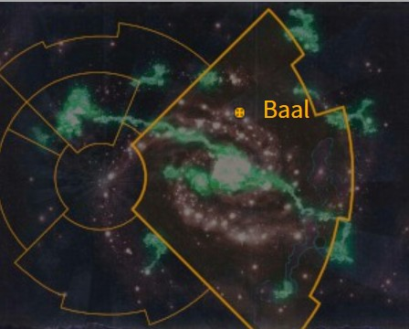
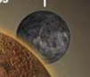

# 1037 巴尔二号 Baal Secundus

精校状态：中文行文已逐段精校，部分术语仍为暂定

分类：地理 / 小行星 / 极限星域 Ultima Segmentum

原文来源：https://www.bilibili.com/opus/1219718313495494708

原作者：帝国神选罐头

原文时间：2026年06月30日 21:30

[返回分类目录](目录.md) · [全书目录](../../目录.md)

<!-- A1037-B0001 图片 -->

<!-- A1037-B0002 -->

原译文

Map 地图

**校订译文**

Map 地图

<!-- /A1037-B0002 -->

<!-- A1037-B0003 -->
### Basic Data 基本资料

原题：Basic Data 基础数据

<!-- /A1037-B0003 -->

<!-- A1037-B0004 -->
**英文原文**

Name:Baal Secundus

<!-- /A1037-B0004 -->

<!-- A1037-B0005 -->

原译文

名称：巴尔二号

**校订译文**

名称：巴尔二号

<!-- /A1037-B0005 -->

<!-- A1037-B0006 -->
**英文原文**

Segmentum:Ultima Segmentum

<!-- /A1037-B0006 -->

<!-- A1037-B0007 -->

原译文

星域：极限星域

**校订译文**

星域：极限星域

<!-- /A1037-B0007 -->

<!-- A1037-B0008 -->
**英文原文**

System:Baal System

<!-- /A1037-B0008 -->

<!-- A1037-B0009 -->

原译文

星系：巴尔星系

**校订译文**

星系：巴尔星系

<!-- /A1037-B0009 -->

<!-- A1037-B0010 -->
**英文原文**

Primary:Baal

<!-- /A1037-B0010 -->

<!-- A1037-B0011 -->

原译文

主星：巴尔

**校订译文**

主星：巴尔

<!-- /A1037-B0011 -->

<!-- A1037-B0012 -->
**英文原文**

Affiliation:Imperium

<!-- /A1037-B0012 -->

<!-- A1037-B0013 -->

原译文

隶属：帝国

**校订译文**

隶属：帝国

<!-- /A1037-B0013 -->

<!-- A1037-B0014 -->
**英文原文**

Class:Death World

<!-- /A1037-B0014 -->

<!-- A1037-B0015 -->

原译文

类别：死亡世界

**校订译文**

类别：死亡世界

<!-- /A1037-B0015 -->

<!-- A1037-B0016 -->
**英文原文**

Tithe Grade:Aptus Non

<!-- /A1037-B0016 -->

<!-- A1037-B0017 -->

原译文

什一税级别：特级免税

**校订译文**

什一税级别：特级免税

<!-- /A1037-B0017 -->

<!-- A1037-B0018 图片 -->

<!-- A1037-B0019 -->

原译文

Lunar Image 卫星图像

**校订译文**

Lunar Image 卫星图像

<!-- /A1037-B0019 -->

<!-- A1037-B0020 -->
**英文原文**

Baal Secundus is one of the twin moons which orbit Baal. Approximately 1/3rd the size of Terra, the moon is highly irradiated due to tremendous weaponry being used during the Dark Age of Technology, including viral and nuclear devices. The majority of the Baal System's population dwells on Baal Secundus, in spite of dangers like the Red Mist.

<!-- /A1037-B0020 -->

<!-- A1037-B0021 -->

原译文

巴尔二号是围绕巴尔运行的两颗卫星之一。卫星的大小约为泰拉的三分之一，由于在黑暗技术时代使用了可怕的武器，包括病毒和核装置，卫星受到了高度的辐射。尽管有红雾这样的危险，但巴尔星系的大多数人口都居住在巴尔二号。

**校订译文**

巴尔二号是环绕巴尔的两颗卫星之一，大小约为泰拉的三分之一。科技黑暗时代使用的强大武器——包括病毒装置与核装置——使其深受污染，辐射极强。尽管面临红雾等危险，巴尔星系的大多数人口仍生活在巴尔二号。

<!-- /A1037-B0021 -->

<!-- A1037-B0022 -->
**英文原文**

The local name for Baal Secundus, at least around the settlement of Angel's Fall, is Baalfora.

<!-- /A1037-B0022 -->

<!-- A1037-B0023 -->

原译文

巴尔二号的当地名字是巴尔弗拉，至少在天使之落定居点附近是这样。

**校订译文**

巴尔二号的当地名字是巴尔弗拉，至少在天使之落定居点附近是这样。

<!-- /A1037-B0023 -->

<!-- A1037-B0024 -->
## History 历史

<!-- /A1037-B0024 -->

<!-- A1037-B0025 -->
**英文原文**

Existing alongside Baal Primus, during the Dark Age of Technology Baal along with its two moons were isolated by Warp Storms. During this period Baalite civilization survived, and when the storms lifted a golden age began that saw the worlds flourish. However at the onset of the Age of Strife Baal and its moons were isolated once more, and famine ensued. Baal Secundus demanded that they, the more populous world, be granted the protection of the orbital facilities of Baal Primus and that the moon be evacuated. Baal Primus refused, and in the ensuing war the orbital somehow crashed into its surface, devastating it. At the same time, Baal Secundus was ravaged by Nuclear and biological weapons. The apocalypse saw the population degenerate into sickly nomads until the arrival of Sanguinius millennia later.

<!-- /A1037-B0025 -->

<!-- A1037-B0026 -->

原译文

在黑暗技术时代，巴尔及其两颗卫星被亚空间风暴隔离。在此期间，巴尔的文明幸存下来，当风暴袭来时，一个黄金时代开始了，世界繁荣起来。然而，在纷争时代开始时，巴尔及其卫星再次被孤立，饥荒随之而来。巴尔二号被要求他们，人口更多的世界，被授予巴尔一号轨道设施的保护权，并且该卫星将被疏散。巴尔一号拒绝了，在随后的战争中，轨道不知怎么撞上了它的表面，毁灭了它。与此同时，巴尔二号遭到了核武器和生物武器的蹂躏。世界毁灭见证了人口退化为体弱多病的游牧民族，直到数千年后圣吉列斯的到来。

**校订译文**

科技黑暗时代，巴尔及其两颗卫星巴尔一号、巴尔二号曾被亚空间风暴隔绝。当地文明在此期间延续下来；风暴消退后，三个世界迎来了繁荣的黄金时代。然而，纷争时代伊始，巴尔及其卫星再次遭到隔绝，饥荒随之而来。人口更多的巴尔二号要求疏散巴尔一号，让自己获得后者轨道设施的保护。巴尔一号拒绝了这一要求。在随后的战争中，轨道设施不知为何坠落到巴尔一号表面，造成毁灭性破坏。与此同时，巴尔二号也遭到核武器与生物武器的蹂躏。末日灾难使居民沦为体弱多病的游牧民，直到数千年后圣吉列斯到来。

**校注：** storms lifted 为风暴消退；要求由巴尔二号提出，原译倒置施受关系。the orbital 指轨道设施，不能译作“轨道撞上地面”。设施如何提供保护及疏散的具体安排，原文未进一步说明。

<!-- /A1037-B0026 -->

<!-- A1037-B0027 -->
**英文原文**

Baal Secundus was the world on which Sanguinius fell and is badly irradiated, killing anyone unprotected in seconds. The Blood, who found Sanguinius, took him in because he was so perfectly formed, even when subjected to the immense radiation of the world's deserts. Sanguinius would successfully lead the pure tribesmen of Baal Secundus (dubbed "The Blood") against the Mutant hordes of the moon. The moon later became part of the Blood Angels Legion homeworld alongside Baal and Baal Primus.

<!-- /A1037-B0027 -->

<!-- A1037-B0028 -->

原译文

巴尔二号是圣吉列斯降落的世界，受到严重辐射，可以在几秒钟内杀死任何未受保护的人。鲜血发现圣吉列斯并接纳了他，因为他是如此完美，即使在世界的沙漠的巨大辐射下也是如此。圣吉列斯将成功地领导巴尔二号（被称为“鲜血”）的纯洁部落对抗卫星的变种部落。卫星后来与巴尔和巴尔一号一起成为了圣血天使军团家园世界的一部分。

**校订译文**

圣吉列斯降落在巴尔二号。这里的辐射极其强烈，能在数秒内杀死毫无防护的人。鲜血部落发现了圣吉列斯；即使暴露在沙漠的强烈辐射下，他的身体依然完美无缺，因此部落接纳了他。后来，圣吉列斯成功率领巴尔二号的纯血人类部落——即“鲜血”——击败卫星上的变种人群体。此后，巴尔二号与巴尔、巴尔一号共同构成圣血天使军团的家园。

<!-- /A1037-B0028 -->

<!-- A1037-B0029 -->
**英文原文**

During the Devastation of Baal, Baal Secundus was heavily infested by Tyranids and largely drained of whatever life it had. Roboute Guilliman diverted significant resources for the reconstruction of Baal and its moons.

<!-- /A1037-B0029 -->

<!-- A1037-B0030 -->

原译文

在巴尔的毁灭期间，巴尔二号受到泰伦的严重侵扰，几乎耗尽了所有的生命。罗伯特·基里曼将大量资源用于重建巴尔及其卫星。

**校订译文**

巴尔毁灭之战期间，大量泰伦侵入巴尔二号，几乎吞噬了其全部生命。罗保特·基里曼随后调拨大量资源，重建巴尔及其两颗卫星。

<!-- /A1037-B0030 -->

<!-- A1037-B0031 -->
## Flora and Fauna 动植物

<!-- /A1037-B0031 -->

<!-- A1037-B0032 -->
**英文原文**

The world has Baalite Fire Scorpions, huge creatures twice the height of a man, which carry virulent poisons which can burn through flesh in a second. It also was home to a huge population of mutants, which were all killed by Sanguinius and a host of non-mutated men.

<!-- /A1037-B0032 -->

<!-- A1037-B0033 -->

原译文

世界上有巴尔火蝎，这是一种高度是人类两倍的巨大生物，携带剧毒，可以在一秒钟内烧穿血肉。它也是大量变种人的家园，这些变种人都被圣吉列斯和许多非变种人杀死。

**校订译文**

世界上有巴尔火蝎，这是一种高度是人类两倍的巨大生物，携带剧毒，可以在一秒钟内烧穿血肉。它也是大量变种人的家园，这些变种人都被圣吉列斯和许多非变种人杀死。

<!-- /A1037-B0033 -->

<!-- A1037-B0034 -->

原译文

Blood Eagles 血鹰

**校订译文**

Blood Eagles 血鹰

<!-- /A1037-B0034 -->

<!-- A1037-B0035 -->

原译文

Trap-Clam 陷阱蚌

**校订译文**

Trap-Clam 陷阱蚌

<!-- /A1037-B0035 -->

<!-- A1037-B0036 -->

原译文

Catch Spider 捕捉蜘蛛

**校订译文**

Catch Spider 捕捉蜘蛛

<!-- /A1037-B0036 -->

<!-- A1037-B0037 -->

原译文

Thirstwater 渴水

**校订译文**

Thirstwater 渴水

<!-- /A1037-B0037 -->

<!-- A1037-B0038 -->
## Geography 地理

<!-- /A1037-B0038 -->

<!-- A1037-B0039 -->
**英文原文**

Angel's Fall — the cliff at which Sanguinius was found and subsequent trials are performed for joining the Blood Angels. Today it is the site of Baal Secundus' largest settlement. Few outsiders are allowed to this site, and it is a pilgrimage location for many Baalites. The city is home to a massive cathedral and statue to Sanguinius.

<!-- /A1037-B0039 -->

<!-- A1037-B0040 -->

原译文

天使之落 — 圣吉列斯被发现的悬崖，随后作为执行加入圣血天使的试炼。今天，这里是巴尔二号最大的定居点。很少有外人被允许进入这个地方，它是许多巴尔人的朝圣之地。这座城市拥有一座巨大的大教堂和圣吉列斯雕像。

**校订译文**

天使之落——人们发现圣吉列斯的悬崖所在；后来，加入圣血天使的试炼也在这里举行。如今，这里已成为巴尔二号最大的聚居点，也是许多巴尔人的朝圣之地，很少允许外人进入。城中建有巨大的圣吉列斯大教堂与雕像。

<!-- /A1037-B0040 -->

<!-- A1037-B0041 -->

原译文

Angel's Leap 天使之跃

**校订译文**

Angel's Leap 天使之跃

<!-- /A1037-B0041 -->

<!-- A1037-B0042 -->

原译文

Kemrender 肯伦德

**校订译文**

Kemrender 肯伦德

<!-- /A1037-B0042 -->

<!-- A1037-B0043 -->
**英文原文**

Mount Seraph — mountain on which The Emperor first met Sanguinius.

<!-- /A1037-B0043 -->

<!-- A1037-B0044 -->

原译文

炽天使山 — 帝皇第一次见到圣吉列斯的山。

**校订译文**

炽天使山 — 帝皇第一次见到圣吉列斯的山。

<!-- /A1037-B0044 -->

<!-- A1037-B0045 -->

原译文

Sell Town 失望镇

**校订译文**

Sell Town 塞尔镇

**校注：** Sell Town 是地名；原稿“失望镇”无英文依据，暂按专名音译塞尔镇。

<!-- /A1037-B0045 -->

<!-- A1037-B0046 -->

原译文

The Great Salt Waste 大盐荒地

**校订译文**

The Great Salt Waste 大盐荒地

<!-- /A1037-B0046 -->

<!-- A1037-B0047 -->

原译文

Flat Desert 平坦沙漠

**校订译文**

Flat Desert 平坦沙漠

<!-- /A1037-B0047 -->

<!-- A1037-B0048 -->

原译文

The Canyon Lands 峡谷之地

**校订译文**

The Canyon Lands 峡谷之地

<!-- /A1037-B0048 -->

<!-- A1037-B0049 -->

原译文

Wind River Canyon 风河峡谷

**校订译文**

Wind River Canyon 风河峡谷

<!-- /A1037-B0049 -->

<!-- A1037-B0050 -->

原译文

The Ghost Lands 幽灵之地

**校订译文**

The Ghost Lands 幽灵之地

<!-- /A1037-B0050 -->

<!-- A1037-B0051 -->

原译文

Heavenwall Mountains 天堂之墙山脉

**校订译文**

Heavenwall Mountains 天堂之墙山脉

<!-- /A1037-B0051 -->

<!-- A1037-B0052 -->

原译文

Cracked Lands 破裂之地

**校订译文**

Cracked Lands 破裂之地

<!-- /A1037-B0052 -->

<!-- A1037-B0053 -->

原译文

Mortis Radzone 死亡辐射区

**校订译文**

Mortis Radzone 死亡辐射区

<!-- /A1037-B0053 -->

<!-- A1037-B0054 -->
**英文原文**

The Place of Challenge — Proving ground for Blood Angels Aspirants

<!-- /A1037-B0054 -->

<!-- A1037-B0055 -->

原译文

挑战之地 — 圣血天使有志者的试验场

**校订译文**

挑战之地——圣血天使候选者接受考验的场所。

<!-- /A1037-B0055 -->

本篇核心术语与暂定项

以下列出本篇出现的英文原形及核心术语表用词。同形词可能指不同对象，具体词义以本篇正文和校注为准；单复数、别名和仅见于图注的名称可能尚未列入。完整候选见[术语表](../../术语表/双语术语候选.csv)。

| 英文 | 采用中文 | 状态 |
| --- | --- | --- |
| Blood Angels | 圣血天使 | 官方已核对 |
| Tyranids | 泰伦虫族 | 官方已核对 |
| Roboute Guilliman | 罗保特·基里曼 | 官方已核对 |
| Warp | 亚空间 | 官方已核对 |
| Imperium | 帝国 | 暂定·简称 |
| Dark Age of Technology | 黑暗科技时代 | 暂定 |
| Emperor | 帝皇 | 官方已核对 |
| Mutant | 变种人 | 暂定·官方待核 |
| Age of Strife | 纷争时代 | 暂定·官方待核 |
| Terra | 泰拉 | 暂定·官方待核 |
| Devastation of Baal | 巴尔之毁 | 暂定·官方待核 |
| Ultima Segmentum | 极限星域 | 暂定·官方待核 |
| Segmentum | 星域 | 暂定·官方待核 |
| Baal | 巴尔 | 暂定·官方待核 |
| Aptus Non | 特级免税 | 暂定·官方待核 |
| Host | 天军 | 暂定·官方待核 |
| Primus | 领军 | 官方已核对 |
| The Dark | 《黑暗》 | 暂定·官方待核 |
| The Blood | 鲜血 | 暂定·官方待核 |
| System | 星系（恒星系统） | 暂定·官方待核 |
| Death World | 死亡世界 | 暂定·官方待核 |
| Baal Secundus | 巴尔二号 | 暂定·官方待核 |
| Baal Primus | 巴尔一号 | 暂定·官方待核 |
| Baalfora | 巴尔弗拉 | 暂定·官方待核 |
| Angel's Fall | 天使之落 | 暂定·官方待核 |
| Mount Seraph | 炽天使山 | 暂定·官方待核 |
| The Place of Challenge | 挑战之地 | 暂定·官方待核 |

