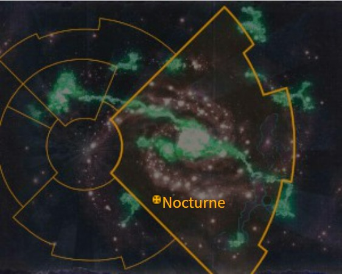
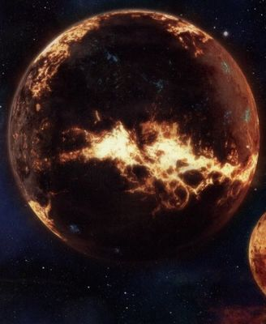
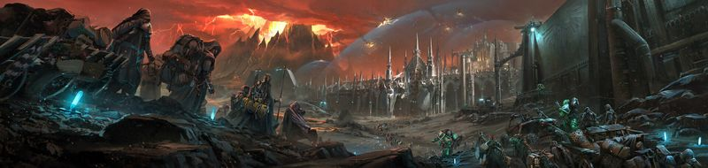

# 1039 夜曲星 Nocturne

精校状态：中文行文已逐段精校，部分术语仍为暂定

分类：地理 / 小行星 / 极限星域 Ultima Segmentum

原文来源：https://www.bilibili.com/opus/1103763598199488515

原作者：帝国神选罐头

原文时间：2025年08月22日 10:06

[返回分类目录](目录.md) · [全书目录](../../目录.md)

<!-- A1039-B0001 图片 -->

<!-- A1039-B0002 -->

原译文

Map 地图

**校订译文**

Map 地图

<!-- /A1039-B0002 -->

<!-- A1039-B0003 -->
### Basic Data 基本资料

原题：Basic Data 基础信息

<!-- /A1039-B0003 -->

<!-- A1039-B0004 -->
**英文原文**

Name:Nocturne

<!-- /A1039-B0004 -->

<!-- A1039-B0005 -->

原译文

名称：夜曲星

**校订译文**

名称：夜曲星

<!-- /A1039-B0005 -->

<!-- A1039-B0006 -->
**英文原文**

Segmentum:Ultima Segmentum

<!-- /A1039-B0006 -->

<!-- A1039-B0007 -->

原译文

星域：极限星域

**校订译文**

星域：极限星域

<!-- /A1039-B0007 -->

<!-- A1039-B0008 -->
**英文原文**

System:Nocturne System

<!-- /A1039-B0008 -->

<!-- A1039-B0009 -->

原译文

星系：夜曲星系

**校订译文**

星系：夜曲星系

<!-- /A1039-B0009 -->

<!-- A1039-B0010 -->
**英文原文**

Affiliation:Imperium

<!-- /A1039-B0010 -->

<!-- A1039-B0011 -->

原译文

隶属：帝国

**校订译文**

隶属：帝国

<!-- /A1039-B0011 -->

<!-- A1039-B0012 -->
**英文原文**

Class:Adeptus Astartes Homeworld / Death World

<!-- /A1039-B0012 -->

<!-- A1039-B0013 -->

原译文

级别：阿斯塔特修会家园世界/死亡世界

**校订译文**

级别：阿斯塔特修会家园世界/死亡世界

<!-- /A1039-B0013 -->

<!-- A1039-B0014 -->
**英文原文**

Tithe Grade:Aptus Non

<!-- /A1039-B0014 -->

<!-- A1039-B0015 -->

原译文

什一税等级：特级免税

**校订译文**

什一税等级：特级免税

<!-- /A1039-B0015 -->

<!-- A1039-B0016 图片 -->

<!-- A1039-B0017 -->

原译文

Planetary Image 行星图片

**校订译文**

Planetary Image 行星图片

<!-- /A1039-B0017 -->

<!-- A1039-B0018 -->
**英文原文**

Nocturne is the homeworld of the Salamanders Space Marine Chapter.

<!-- /A1039-B0018 -->

<!-- A1039-B0019 -->

原译文

夜曲星是火蜥蜴星际战士战团的家园世界。

**校订译文**

夜曲星是火蜥蜴星际战士战团的家园世界。

<!-- /A1039-B0019 -->

<!-- A1039-B0020 -->
**英文原文**

It is a binary planetary system, with its over-sized moon Prometheus circling Nocturne erratically causing massive tectonic stress. There are vast chains of volcanoes and frequent earthquakes, destroying what little the people built. The enormous levels of stellar radiation present on the world has given most of its life a dark obsidian-like appearance, including its people.

<!-- /A1039-B0020 -->

<!-- A1039-B0021 -->

原译文

它是一个双星系统，其超大卫星普罗米修斯不规则地绕夜曲星运行，造成巨大的构造应力。这里有巨大的火山链和频繁的地震，摧毁了人们建造的一点点东西。世界上存在的巨大恒星辐射水平使其大部分生命都呈现出黑曜石般的黑暗外观，包括其人民。

**校订译文**

夜曲星与体积异常庞大的卫星普罗米修斯构成一个双行星系统。普罗米修斯沿不规则轨道运行，给夜曲星带来巨大的地壳构造应力。连绵的火山与频繁地震不断摧毁居民艰难建起的设施。强烈的恒星辐射使这里的大多数生命——包括人类——呈现出黑曜石般的深黑色外观。

**校注：** binary planetary system 指两颗行星级天体构成的系统，不是两颗恒星的“双星系统”。后文仍沿原文将普罗米修斯称卫星。

<!-- /A1039-B0021 -->

<!-- A1039-B0022 -->
## History 历史

<!-- /A1039-B0022 -->

<!-- A1039-B0023 -->
**英文原文**

Settled by Humanity during the Dark Age of Technology, Nocturne's bleak and unforgiving nature bred a hardy and stoic people. During the time of the Great Crusade the Primarch Vulkan was deposited onto the world and upon growing to adulthood drove back the Dark Eldar raiders which had tormented the planet for centuries. When the Emperor arrived at Nocturne he found Vulkan as its king and protector. Thereafter Nocturne has served as the Homeworlds of the Salamanders.

<!-- /A1039-B0023 -->

<!-- A1039-B0024 -->

原译文

夜曲星在黑暗技术时代由人类定居，其荒凉和无情的天性培养了一个坚强和坚忍的民族。在大远征期间，原体沃坎降落在世界，长大成人后击退了折磨行星几个世纪的黑暗灵族袭击者。当帝皇到达夜曲星时，他发现沃坎是它的国王和保护者。此后，夜曲星成为了火蜥蜴的家园世界。

**校订译文**

人类在科技黑暗时代定居夜曲星，荒凉严酷的环境造就了坚韧而沉着的居民。大远征时期，原体沃坎降落在这里，成年后击退了困扰行星数百年的黑暗灵族掠夺者。帝皇抵达时，沃坎已是当地的国王与守护者。此后，夜曲星便成为火蜥蜴的家园世界。

<!-- /A1039-B0024 -->

<!-- A1039-B0025 -->
### Attacks 攻击

<!-- /A1039-B0025 -->

<!-- A1039-B0026 -->
**英文原文**

???.M31 — The Battle of Nocturne during the Horus Heresy as the Death Guard invades.

<!-- /A1039-B0026 -->

<!-- A1039-B0027 -->

原译文

荷鲁斯叛乱期间死亡守卫入侵的夜曲星之战。

**校订译文**

???.M31——荷鲁斯之乱期间，死亡守卫入侵，引发夜曲星之战。

<!-- /A1039-B0027 -->

<!-- A1039-B0028 -->
**英文原文**

In 761.M41, the Daemon Engines of the Soulsmelter assaulted Nocturne and it's Great Crucible. As a result, the Chapter Master of the Salamanders sanctions the opening of his master reliquaries.

<!-- /A1039-B0028 -->

<!-- A1039-B0029 -->

原译文

灵魂熔炉的恶魔引擎袭击了夜曲星和它的大熔炉。因此，火蜥蜴战团长批准了他的主人的圣物箱的开放。

**校订译文**

761.M41，熔魂者麾下的恶魔引擎进攻夜曲星及其大熔炉。火蜥蜴战团长为此批准开启最高等级的圣物库。

**校注：** 补回原译遗漏的761.M41。his master reliquaries 指战团长掌管的重要圣物库，并不是“他的主人的圣物箱”；确切制度职称待核。

<!-- /A1039-B0029 -->

<!-- A1039-B0030 -->
**英文原文**

In 975.M41 Nocturne and its moon Prometheus again came under attack by the Dragon Warriors.

<!-- /A1039-B0030 -->

<!-- A1039-B0031 -->

原译文

夜曲星及其卫星普罗米修斯再次遭到火龙勇士的攻击。

**校订译文**

975.M41，夜曲星及其卫星普罗米修斯再次遭到火龙勇士进攻。

<!-- /A1039-B0031 -->

<!-- A1039-B0032 -->
## Planetary Overview 行星概述

<!-- /A1039-B0032 -->

<!-- A1039-B0033 -->
### The Time of Trial 审判之时

<!-- /A1039-B0033 -->

<!-- A1039-B0034 -->
**英文原文**

Once every fifteen Terran years (One Nocturne year), the two worlds approach so closely that Nocturne is almost torn to pieces. This is the Time of Trial. Vast waves crash across the seas, thousands of volcanoes explode, further blotting out the weak haze from the sun of Nocturne and earthquakes constantly ravage the land. All life is sent reeling, towns collapse and lots of people die. Then, a terrible winter sets in for the next quarter of a year. The young freeze and most, if not all, of the livestock die, unable to withstand the cold like they had the heat. During this Time of Trial, the Sanctuary Cities throw open their gates and give refuge to the vast pilgrimages of the tribes who flee to the cities in hope of protection from the harsh elements.

<!-- /A1039-B0034 -->

<!-- A1039-B0035 -->

原译文

每十五个泰拉年（一个夜曲星年），两个世界就会如此接近，以至于夜曲星几乎被撕成碎片。这是审判之时。巨浪席卷大海，数千座火山爆发，进一步掩盖了夜曲星太阳的微弱阴霾，地震不断蹂躏着这片土地。所有的生命都摇摇欲坠，城镇崩溃，许多人死亡。然后，一年中的下一个季度将迎来一个可怕的冬天。年幼的牲畜冻死，大多数（如果不是全部的话）牲畜都死亡，因为它们无法像抵御高温一样抵御寒冷。在这段审判之时，庇护城市敞开大门，为部落的大规模朝圣提供庇护，这些部落逃往城市，希望得到保护，免受恶劣天气的侵袭。

**校订译文**

每隔十五个泰拉年，即一个夜曲星年，两颗星体便会彼此靠近，近到几乎将夜曲星撕裂。这便是“审判之时”。巨浪席卷海洋，成千上万座火山爆发，喷出的烟尘进一步遮蔽本就微弱的日光；地震不断蹂躏大地。万物遭殃，城镇倒塌，大量居民死亡。随后，严冬笼罩接下来四分之一个年周期。幼者冻死，牲畜也大多乃至全部死去——它们能熬过酷热，却无法承受严寒。审判之时，庇护城市会敞开城门，接纳成群迁来的部落朝圣者，为他们抵御恶劣环境。

**校注：** 保留quarter of a year的周期表述，原文此处没有明确重申泰拉年还是夜曲星年。the young 也未限定为幼畜，不擅自缩窄。

<!-- /A1039-B0035 -->

<!-- A1039-B0036 -->
### The Sanctuary Cities 庇护城市

<!-- /A1039-B0036 -->

<!-- A1039-B0037 -->
**英文原文**

Although the majority of Nocturne's populace are tribal in nature, especially in the Ignea region, there are 7 major population centres that exist on the surface of Nocturne. These are called the 'Sanctuary Cities'. Each of the cities contains a Chapter Bastion of the Salamanders and are dedicated to one of the Salamanders companies. The location of these Sanctuary Cities are situated upon the most seismically stable areas of Nocturne, their positions first divined by tribal shamans and latent psykers through commune with the earth. Later, geological surveyors improved the accuracy of these divinations. Finally, upon the arrival of the Outlander to Nocturne, great void shields and vast walls of adamantium and ceramite were erected to protect the cities from the ravages of the Time of Trial.

<!-- /A1039-B0037 -->

<!-- A1039-B0038 -->

原译文

虽然夜曲星的大多数人口都是部落性质的，特别是在火焰地区，但夜曲星表面存在7个主要的人口中心。这些城市被称为“庇护城市”。每个城市都有一个火蜥蜴堡垒，专门为火蜥蜴连队服务。这些庇护城市的位置位于夜曲星地震最稳定的地区，它们的位置首先由部落萨满和潜在的灵能者通过与行星的交流来推测。后来，地质测量员提高了这些占卜的准确性。最后，当外乡人到达夜曲星时，巨大的虚空盾和巨大的精金和陶钢被竖立起来，以保护城市免受审判之时的破坏。

**校订译文**

夜曲星居民大多以部落形式生活，伊格尼亚地区尤其如此；不过，地表仍有七个主要人口中心，被称为“庇护城市”。每座城市都有一座火蜥蜴战团堡垒，分别归属一个连队。城市建在夜曲星地震活动最稳定的区域。最初，部落萨满与潜在灵能者通过和大地沟通，确定了这些地点；后来的地质勘测进一步校准了选址。外乡人抵达夜曲星后，巨大的虚空盾以及精金、陶钢城墙相继建成，保护城市免遭审判之时的摧残。

**校注：** Ignea 是地下地区专名，按后文居民Igneans伊格尼亚人统一音译；原稿“火焰地区／火”混用。

<!-- /A1039-B0038 -->

<!-- A1039-B0039 -->
**英文原文**

Due to the Salamanders ethos of the protection of humanity, the Salamanders practice an almost unique custom - that of living amongst the people of Nocturne. With the exception of the Neophytes and the 1st Company Firedrakes, most seasoned Salamanders maintain private domiciles throughout Nocturne and the Sanctuary Cities. In times of war and muster, the gathering of the companies is facilitated by a host of sacred teleportation translation points across Nocturne.

<!-- /A1039-B0039 -->

<!-- A1039-B0040 -->

原译文

由于火蜥蜴保护人类的精神，火蜥蜴实行了一种几乎独特的习俗 — 与夜曲星人生活在一起。除了新进者和第一连队火龙，大多数经验丰富的火蜥蜴在夜曲星和庇护城市都有个人住所。在战争和集结时期，夜曲星上的许多神圣的传送转移点为连队的聚会提供了便利。

**校订译文**

秉持守护人类的信念，火蜥蜴保留着一种近乎独一无二的习俗：与夜曲星居民共同生活。除新兵及第一连的火龙成员外，多数老练的火蜥蜴战士在夜曲星各地和庇护城市中拥有自己的住所。战时需要集结时，他们可借助遍布行星的神圣传送节点，迅速归建各连。

<!-- /A1039-B0040 -->

<!-- A1039-B0041 图片 -->

<!-- A1039-B0042 -->

原译文

The surface of Nocturne 夜曲星表面

**校订译文**

The surface of Nocturne 夜曲星表面

<!-- /A1039-B0042 -->

<!-- A1039-B0043 -->
**英文原文**

The Seven great Sanctuary Cities are thus:

<!-- /A1039-B0043 -->

<!-- A1039-B0044 -->

原译文

七大庇护城市如下：

**校订译文**

七大庇护城市如下：

<!-- /A1039-B0044 -->

<!-- A1039-B0045 -->
**英文原文**

Themis - The City of Warrior Kings

<!-- /A1039-B0045 -->

<!-- A1039-B0046 -->

原译文

忒弥斯 - 战士之王城市

**校订译文**

忒弥斯——战士诸王之城

<!-- /A1039-B0046 -->

<!-- A1039-B0047 -->
**英文原文**

Situated far out on the Arridian Plains, Themis has long been renowned for it's warriors, producing men of exceptional size and fighting prowess, qualities which are augmented by the process of becoming an Astartes. East of Hesiod, and on the Arridian Plain, Themis breeds warriors and hunters; men and women who are usually of larger and hardier stock than their fellow Nocturneans. Themian culture, although adherent to the Promthean Creed, is harsh and many rites of passage are based on surviving against and hunting the many predators of the Arridian Plain that surrounds it.

<!-- /A1039-B0047 -->

<!-- A1039-B0048 -->

原译文

忒弥斯位于阿里迪亚平原的偏远地区，长期以来一直以战士而闻名，培养出身材高大、战斗力强的人，这些品质在成为阿斯塔特的过程中得到了增强。在赫西奥德以东，在阿里迪亚平原上，忒弥斯孕育了战士和猎人；通常比夜曲星人体型更大、更强壮的男人和女人。忒弥斯文化虽然坚持普罗米修斯信条，但很严厉，许多成年仪式都是基于在周围的阿里迪亚平原上生存和狩猎许多掠食者。

**校订译文**

忒弥斯位于赫西奥德以东、阿里迪亚平原深处，素以战士闻名。当地男女通常比其他夜曲星人更为高大强健，擅长战斗与狩猎；获选成为阿斯塔特的人，这些素质还会在改造中进一步增强。忒弥斯文化遵奉普罗米修斯信条，同时也十分严酷。许多成年仪式要求年轻人在城外的阿里迪亚平原上生存，与当地众多捕食者搏斗并将其猎杀。

<!-- /A1039-B0048 -->

<!-- A1039-B0049 -->
**英文原文**

Epimethus - The Jewel City

<!-- /A1039-B0049 -->

<!-- A1039-B0050 -->

原译文

厄庇墨透斯 - 珠宝之城

**校订译文**

厄庇墨透斯 - 珠宝之城

<!-- /A1039-B0050 -->

<!-- A1039-B0051 -->
**英文原文**

The Jewel City, north of Hesiod, and Nocturne's only ocean-bound settlement, Epimethus is situated in the Acerbian Sea. It has a tall spire which it's lords and chieftans inhabit that can be seen from even the most distant desert regions. As an ocean bound Sanctuary City, Epithemus is noted for the quality of fishermen it produces. These spear-fishermen, and any Astartes who are drawn from their ranks, are noted for their exceptionally strong and accurate weapons throwing, a skill perfected via the necessity of hunting the volcanic rock skinned gnorl-whales in the Acerbian Sea.

<!-- /A1039-B0051 -->

<!-- A1039-B0052 -->

原译文

厄庇墨透斯是赫西奥德以北的珠宝之城，也是夜曲星唯一的远洋定居点，位于阿塞尔比亚海。它有一个高高的尖塔，它的领主和酋长居住在那里，即使在最遥远的沙漠地区也能看到。作为一个面向海洋的庇护城市，厄庇墨透斯以其生产的渔民的质量而闻名。这些鱼叉渔民，以及从他们队伍中挑选出来的任何阿斯塔特，以其异常强壮和精确的武器投掷而闻名，这项技能是通过在阿塞尔比亚海狩猎火山岩皮肤的格诺尔鲸而完善的。

**校订译文**

位于赫西奥德以北的厄庇墨透斯，又称“珠宝之城”，坐落在阿塞尔比亚海中，是夜曲星唯一的海上聚居点。领主与酋长居住的高塔巍然耸立，即使从最遥远的沙漠也能望见。作为海上的庇护城市，厄庇墨透斯以技艺精湛的渔民著称。当地鱼叉猎手，以及从他们之中招募的阿斯塔特，都擅长强劲而精准地投掷武器；这项本领来自长期猎杀阿塞尔比亚海中披覆火山岩外皮的格诺尔鲸。

<!-- /A1039-B0052 -->

<!-- A1039-B0053 -->
**英文原文**

Heliosa - The Beacon City

<!-- /A1039-B0053 -->

<!-- A1039-B0054 -->

原译文

赫利奥萨 - 灯塔城市

**校订译文**

赫利奥萨 - 灯塔城市

<!-- /A1039-B0054 -->

<!-- A1039-B0055 -->
**英文原文**

Ringed by stout walls of gleaming white stone, Heliosa gains it's name from the reflected sun off their flanks. With the great Gey'sarr Ocean on one of it's borders, Heliosa is known for it's unique unarmed combat techniques, as taught by it's tirbal leaders, including the legendary Master Prebian.

<!-- /A1039-B0055 -->

<!-- A1039-B0056 -->

原译文

赫利奥萨被闪闪发光的白色石头筑成的坚固墙壁环绕，它的名字来源于侧翼反射的阳光。赫利奥萨以其独特的非武装战斗技术而闻名，包括传奇的普雷比安大师在内的部落领导人都传授了这种技术。

**校订译文**

赫利奥萨被光洁白石砌成的坚固城墙环绕，“灯塔城市”之名就来自城墙反射的阳光。城市一侧濒临广阔的吉’萨洋。当地以独特的徒手格斗技艺闻名，由部落领袖传授，传奇人物普雷比安大师便是其中之一。

<!-- /A1039-B0056 -->

<!-- A1039-B0057 -->
**英文原文**

Aethonian - The Fire Spike

<!-- /A1039-B0057 -->

<!-- A1039-B0058 -->

原译文

埃托尼安 - 火焰尖刺

**校订译文**

埃托尼安 - 火焰尖刺

<!-- /A1039-B0058 -->

<!-- A1039-B0059 -->
**英文原文**

A jutting spike of a city, Aethonian is situated in the east on the borders of the Gey'sarr Ocean and is named after the monolithic spike of igneous rock that spears through the centre of the sanctuary city.

<!-- /A1039-B0059 -->

<!-- A1039-B0060 -->

原译文

埃托尼安是一座突出尖刺的城市，位于吉’萨洋的东部边界，以贯穿庇护城市中心的火成岩整体尖刺命名。

**校订译文**

埃托尼安位于东方的吉’萨洋沿岸，整座城如尖刺般耸立。它的名字源于穿出城市中央的一整块巨型火成岩尖柱。

<!-- /A1039-B0060 -->

<!-- A1039-B0061 -->
**英文原文**

Clymene - The Merchant Sprawl

<!-- /A1039-B0061 -->

<!-- A1039-B0062 -->

原译文

克吕墨涅 - 商人扩展

**校订译文**

克吕墨涅——商贸都会

<!-- /A1039-B0062 -->

<!-- A1039-B0063 -->
**英文原文**

A distant city, Clymene is situated out in the east of Nocturne, bordered by the T'harken Delta and the Gey'sarr Ocean. Isolated out in inhospitable desert, Clymene is deemed to be difficult to assail by any enemy.

<!-- /A1039-B0063 -->

<!-- A1039-B0064 -->

原译文

克吕墨涅是一个遥远的城市，位于夜曲星的东部，与提’哈肯三角洲和吉’萨洋接壤。克吕墨涅被隔离在荒凉的沙漠中，被认为很难被任何敌人攻击。

**校订译文**

克吕墨涅地处夜曲星偏远的东方，毗邻提’哈肯三角洲与吉’萨洋。由于孤立于环境险恶的沙漠之中，人们认为任何敌人都难以攻打这里。

<!-- /A1039-B0064 -->

<!-- A1039-B0065 -->
**英文原文**

Hesiod - Seat of the Tribal Kings

<!-- /A1039-B0065 -->

<!-- A1039-B0066 -->

原译文

赫西奥德 - 部落之王的所在地

**校订译文**

赫西奥德 - 部落之王的所在地

<!-- /A1039-B0066 -->

<!-- A1039-B0067 -->
**英文原文**

Hesiod is a royal city, and most of its citizens have titles of some description or other. It is also the largest and most important of the Sanctuaries. The Vault of Remembrance is based here.

<!-- /A1039-B0067 -->

<!-- A1039-B0068 -->

原译文

赫西奥德是一座皇家城市，其大多数公民都有某种头衔。它也是最大和最重要的避难所。纪念穹顶就设在这里。

**校订译文**

赫西奥德是一座王城，多数市民都拥有某种头衔。它也是规模最大、地位最重要的庇护城市，纪念穹顶就位于此处。

<!-- /A1039-B0068 -->

<!-- A1039-B0069 -->
**英文原文**

Located out on the Pyre Desert, Hesiod is built into the south-to-east curvature of a vast shoulder of basaltic rock, giving it a strong defensive position overlooking the Pyre Desert. Hesiod comes as close to having as much wealth and affluence as a Death World can possess and as such, Hesiod is the residence of the kings and leaders of the various tribes of Nocturne. Its people are mighty and noble, giving Nocturne what could be considered a form of aristocracy on the Death World.

<!-- /A1039-B0069 -->

<!-- A1039-B0070 -->

原译文

赫西奥德位于柴堆沙漠，建在一个巨大的玄武岩山肩的东南弯曲处，使其成为俯瞰柴堆沙漠的强大防御阵地。赫西奥德几乎拥有死亡世界所能拥有的财富和富裕，因此，赫西奥德是夜曲星各部落国王和领导人的住所。它的人民强大而高贵，赋予了夜曲星在死亡世界上可以被视为一种贵族的形式。

**校订译文**

赫西奥德位于葬火沙漠，依托一片巨大玄武岩山肩从南向东弯曲的地形而建，俯瞰整片沙漠，易守难攻。以死亡世界的标准而言，这座城已接近富庶的极致，因此夜曲星各部落的国王和首领都居住于此。当地居民有权有势、地位尊贵，构成了这个死亡世界某种意义上的贵族阶层。

<!-- /A1039-B0070 -->

<!-- A1039-B0071 -->
**英文原文**

Skarokk - The Dragonspine

<!-- /A1039-B0071 -->

<!-- A1039-B0072 -->

原译文

斯卡洛克 - 龙脊

**校订译文**

斯卡洛克 - 龙脊

<!-- /A1039-B0072 -->

<!-- A1039-B0073 -->
**英文原文**

Skarokk is located in close proximity to Clymene, out in the east bordered by the T'harken Delta and the Gey'sarr Ocean. It too is deemed unassailable due to the hazardous environments surrounding it.

<!-- /A1039-B0073 -->

<!-- A1039-B0074 -->

原译文

斯卡洛克位于克吕墨涅附近，东部与提’哈肯三角洲和吉’萨洋接壤。由于周围的危险环境，它也被认为是无懈可击的。

**校订译文**

斯卡洛克位于克吕墨涅附近，也在东方毗邻提’哈肯三角洲和吉’萨洋。周边险恶的环境同样使它被视为难以攻克的城市。

<!-- /A1039-B0074 -->

<!-- A1039-B0075 -->
### Geography 地理

<!-- /A1039-B0075 -->

<!-- A1039-B0076 -->
**英文原文**

Nocturne has a number of key geographical features that present the population with many hazards, but also the opportunity of wealth and defence against attack. Namely, the main features of Nocturne are:

<!-- /A1039-B0076 -->

<!-- A1039-B0077 -->

原译文

夜曲星有许多关键的地理特征，给人们带来了许多危险，但也带来了财富和防御攻击的机会。也就是说，夜曲星的主要特征有：

**校订译文**

夜曲星的主要地貌既给居民带来诸多危险，也提供了财富来源和抵御进攻的天然屏障，具体如下。

<!-- /A1039-B0077 -->

<!-- A1039-B0078 -->
### Mount Deathfire 死火山

原题：Mount Deathfire 死火之山

<!-- /A1039-B0078 -->

<!-- A1039-B0079 -->
**英文原文**

An immense mountain chain of Nocturne, the heart of the world and it's lifeblood. As the largest and deadliest volcano, the mountain has a profound sacred significance for both the natives and the Salamander chapter. It's caldera and numerous lava pits and chambers are used in rituals of ascension and passing, as well as being the single biggest threat to the continuation of life on Nocturne. Librarians undergoing the first stage of their training, the 'Totem Path', do so under Mount Deathfire. Beneath it's craggy peaks, a vast undercroft of caverns, tunnels and caves exist that date back to before the time of Vulkan. No explorer or scholar of the current era has been able to map the entirety of this subterranean, labayrinthine realm (Though it is rumoured Vulkan may have) and many amongst the Salamanders believe it harbours secrets, including the location of the missing artefacts of the Nine.

<!-- /A1039-B0079 -->

<!-- A1039-B0080 -->

原译文

一条巨大的夜曲星山脉，世界的心脏，它的命脉。作为最大和最致命的火山，这座山对当地人和火蜥蜴战团都有着深刻的神圣意义。它的火山口和许多熔岩坑和洞穴被用于升格和通过的仪式，也是夜曲星上生命延续的最大威胁。正在接受第一阶段训练的智库，即“图腾之路”，是在死火之山下进行的。在崎岖的山峰之下，存在着一片巨大的山洞、隧道和洞穴，其历史可以追溯到沃坎时代之前。当代没有探险家或学者能够绘制出这个地下迷宫领域的全貌（尽管有传言称沃坎可能已经绘制出），许多火蜥蜴认为它藏有秘密，包括九个失踪遗物的位置。

**校订译文**

死火山是一座庞大的山体，是夜曲星的心脏与命脉。作为当地最大、最致命的火山，它对居民和火蜥蜴战团都具有深刻的宗教意义。其火山口、众多熔岩池和洞室用于举行升格及送别亡者的仪式，但这座火山本身也是夜曲星生命延续的最大威胁。智库员训练的第一阶段称为“图腾之路”，就在死火山下进行。崎岖山峰之下，洞窟与隧道构成广阔的地下空间，早在沃坎到来之前便已存在。当代探险者与学者无人能绘出这座地下迷宫的全貌，尽管传说沃坎或许曾经做到。许多火蜥蜴相信，其中藏着秘密，包括九件圣物中那些尚未寻回者的下落。

**校注：** the missing artefacts of the Nine 指九件圣物中失落的那些，并非九件全部失落；passing 在此为与死者有关的仪式。

<!-- /A1039-B0080 -->

<!-- A1039-B0081 -->
**英文原文**

As the largest of Nocturne's mountains, Mount Deathfire is in many ways the spiritual hub of the Salamanders. Deep within it's base the Pyreum, a vast cavern, created by the first Master of the Forge, T'kell, and girded in ceramite, plays host to the solemn funerary duty of returning the Chapter's dead to the mountain to be consumed by the lava within. This ceremony of 'Interment and Ascension' involves chaining the fallen to a vast, ceramite coated pyre slab, and then lowering the fallen into the lava flow. The slab is lowered by means of two chosen Astartes robed in the traditional garb of metalworkers, who pass chains etched with symbols of the forge - the flame, the anvil and the hammer - through their hands. As the chains are red-hot, the symbols are branded into the palms of the incumbents. The Astartes must grip the chains precisely, for any deviation will result in an irregular brand - a mark of great shame that will be scoured away in disgrace.

<!-- /A1039-B0081 -->

<!-- A1039-B0082 -->

原译文

作为夜曲星山脉中最大的山脉，死火之山在许多方面都是火蜥蜴的精神中心。在它的基底深处，派瑞姆是一个巨大的洞穴，由第一位铸造大师特’凯尔创造，用陶钢环绕，承担着将战团的死者送回山上被熔岩吞噬的庄严葬礼职责。这个“埋葬和升天”的仪式包括将牺牲者拴在一个巨大的、涂有陶钢的柴堆板上，然后将牺牲者放入熔岩流中。两名穿着金属工人传统服装的阿斯塔特将板放下，他们用手传递刻有锻造符号的链条 — 火焰、铁砧和铁锤。由于链条是炽热的，这些符号被刻在现任者的手掌上。阿斯塔特必须精确地抓住链条，因为任何偏差都会导致不规则的印记 — 这是一种巨大的耻辱，将在耻辱中被抹去。

**校订译文**

死火山是夜曲星最大的山岳，也是火蜥蜴的精神中心。其山腹深处有一座名叫派瑞姆的巨大洞窟，由首任铸造大师特凯尔开凿，并以陶钢加固。这里承担着庄严的葬仪：将战团死者送归山中，由熔岩吞没。在“安葬与升华”仪式上，阵亡者被锁在一块覆有陶钢的巨大葬板上，再缓缓降入熔岩流。两名获选的阿斯塔特身穿金属工匠的传统服饰，以双手放送锁链，控制葬板下降。链条上刻着火焰、铁砧与铁锤等锻造符号；烧得通红的链条会把这些符号烙进他们的掌心。两人必须精确握住链条，稍有偏差便会留下不规则烙印。那是莫大的耻辱，必须在羞辱中将其磨除。

<!-- /A1039-B0082 -->

<!-- A1039-B0083 -->
**英文原文**

As a sheer monolith of rock, Mount Deathfire serves as the focal point on the surface of Nocturne not just for the Salamanders, but also the people of Nocturne. Riddled with vents and magma chambers, it is said that only Vulkan had ever navigated the full extent of it, leaving mysterious chambers locked in it's depths. It is here that the biggest and most fierce of the eponymous Salamander lizards live, the Firedrakes. Giving rise to childhood stories such as that of the giant denizen Khessarghoth, they are huge, fire-breathing beasts, and often it is only those of the elite Salamanders 1st Company, named Firedrakes themselves in honour of the creatures, that are capable of killing one. Upon his arrival to Nocturne, it is said that one each was killed by the Outlander and Vulkan. Veins of Phonolite, and acoustically resonant rock, perforate Deathfire allowing creatures of the deep to be heard, wailing in the depths.

<!-- /A1039-B0083 -->

<!-- A1039-B0084 -->

原译文

作为一块巨石，夜曲星表面的死火之山不仅是火蜥蜴的焦点，也是夜曲星人民的焦点。布满了喷口和岩浆腔，据说只有沃坎曾经旅行过它的全部范围，留下了被锁在深处的神秘房间。这里生活着最大、最凶猛的同名火蜥蜴 — 火龙。它们是巨大的喷火野兽，通常只有精英火蜥蜴第一连队的那些人才能杀死一只火龙，他们自己也被命名为火蜥蜴，以纪念这些生物。当外乡人抵达夜曲星时，据说他和沃坎各杀死了一个。响岩的纹理和声学共振的岩石穿透了死火，在深处呼啸。

**校订译文**

死火山如一座陡峭的巨岩，不仅是火蜥蜴关注的中心，也是夜曲星居民的精神地标。山体布满喷口和岩浆室，据说唯有沃坎曾遍历其中，在深处留下了紧锁的神秘石室。体型最大、性情最凶猛的火蜥蜴——火龙——就生活在这里。它们是庞大的喷火巨兽，催生了巨兽凯萨戈斯等童年传说。通常只有战团第一连的精锐才有能力杀死一头；第一连也以“火龙”为名，向这些生物致敬。传说外乡人抵达夜曲星时，曾与沃坎各杀死一头火龙。具有声学共振特性的响岩矿脉贯穿死火山，使人能够听见地下生物从深处传来的哀号。

**校注：** 原译遗漏Khessarghoth巨兽传说，又误将第一连别名Firedrakes译为火蜥蜴；已补回并统一火龙。末句是响岩传导地下生物的声音，不是岩石自身呼啸。

<!-- /A1039-B0084 -->

<!-- A1039-B0085 -->
**英文原文**

At the feet of Mt. Deathfire is a basalt monolith that can even withstand the Time of Trials. This is a memorial to Vulkan's adoptive father N'bel which the Primarch built himself.

<!-- /A1039-B0085 -->

<!-- A1039-B0086 -->

原译文

在死火之山脚下，有一块玄武岩巨石，甚至可以承受审判之时。这是一个纪念沃坎的养父恩’贝尔的纪念碑，由原体亲自建造。

**校订译文**

死火山脚下耸立着一座玄武岩石碑，连审判之时也无法将其摧毁。这是沃坎亲自为养父恩’贝尔建立的纪念碑。

<!-- /A1039-B0086 -->

<!-- A1039-B0087 -->
### Scorian Plane 灼热平原

原题：Scorian Plane 灼热平面

**校注：** 此处原英文标题写Plane，后文生物段写Plain；实际语境均指平原。中文统一，英文拼写原样保留。

<!-- /A1039-B0087 -->

<!-- A1039-B0088 -->
**英文原文**

One of Nocturne's many deserts, the Scorian Plane is frequented to gather Sauroch, a saurian bull-like creature that is often herded and consumed on Nocturne. It is an expansive ash desert, a breeding ground for the native sauroch and a hunting ground for the more predatory Sa'hrk.

<!-- /A1039-B0088 -->

<!-- A1039-B0089 -->

原译文

作为夜曲星的众多沙漠之一，灼热平面经常聚集绍罗克，这是一种类似蜥蜴的公牛生物，经常在夜曲星上被放牧和食用。这是一片广阔的火山灰沙漠，是当地绍罗克的繁殖地，也是更具掠食性的萨’赫克的狩猎场。

**校订译文**

灼热平原是夜曲星众多沙漠之一，人们常来此捕集绍罗克——一种兼具蜥蜴与公牛特征的生物，当地人会将其放牧并用作食物。这片广阔的火山灰沙漠既是绍罗克的繁殖地，也是凶猛捕食者萨’赫克的猎场。

<!-- /A1039-B0089 -->

<!-- A1039-B0090 -->
### Cindara Plateau 辛达拉高原

<!-- /A1039-B0090 -->

<!-- A1039-B0091 -->
**英文原文**

A spike shaped rock, with an immense flat top, the Cindara Plateau stands tall above the ash of the Pyre Desert, providing observers with an unparalleled view of the surrounding area. Aspirants must climb this volcanic spear of rock in order to earn a place in the Salamander's ranks. Those who do not die in the attempt from the plateau's numerous hazards will be met at it's flat summit by an induction party of Salamanders.

<!-- /A1039-B0091 -->

<!-- A1039-B0092 -->

原译文

辛达拉高原是一块尖刺状的岩石，顶部巨大平坦，高高地矗立在柴堆沙漠的灰烬之上，为观察者提供了无与伦比的周边地区景色。有志者必须攀登这座火山岩矛，才能在火蜥蜴的队伍中占有一席之地。那些没有在高原众多危险中丧生的人将在高原平坦的山顶上受到火蜥蜴的欢迎。

**校订译文**

辛达拉高原是一座顶面宽阔平坦的尖柱状岩体，矗立在葬火沙漠的灰烬之上，从这里可以一览周边全景。候选者必须攀上这根火山岩巨矛，才有资格加入火蜥蜴。躲过沿途重重危险、成功抵达平顶的人，将由火蜥蜴的接引队伍迎接。

<!-- /A1039-B0092 -->

<!-- A1039-B0093 -->
### Pyre Desert 葬火沙漠

原题：Pyre Desert 柴堆沙漠

**校注：** Pyre 指焚尸柴堆、葬火，原稿“柴堆沙漠”过于机械；暂译葬火沙漠，与普通火焰地貌不混用。

<!-- /A1039-B0093 -->

<!-- A1039-B0094 -->
**英文原文**

One of the larger ash deserts, the Pyre Desert is the location of the vast Cindara Plateau and, due to its hostile conditions, is also the site of the "Burning Walk," a self-imposed exile undertaken by members of the Chapter who have been incapacitated or find their faith tested. A vast desert region, the Pyre desert is plagued by sand storms, where the sun never truly sets.

<!-- /A1039-B0094 -->

<!-- A1039-B0095 -->

原译文

柴堆沙漠是较大的火山灰沙漠之一，是广阔的辛达拉高原的所在地，由于其恶劣的条件，也是“燃烧之路”的所在地。柴堆沙漠是一个广阔的沙漠地区，饱受沙尘暴的困扰，太阳永远不会真正落下。

**校订译文**

葬火沙漠是当地较大的火山灰沙漠之一，广阔的辛达拉高原便坐落其中。其环境恶劣，因此也成为“燃烧之路”的进行之地：失去作战能力，或信仰遭受考验的战团成员，会自愿来到这里流放自己。这片浩瀚沙漠饱受沙尘暴侵袭，太阳从未真正落下。

**校注：** 补回原译整句遗漏：燃烧之路是失能或信仰受考验的战团成员自愿进行的流放。

<!-- /A1039-B0095 -->

<!-- A1039-B0096 -->
### Acerbian Sea 阿塞尔比亚海

<!-- /A1039-B0096 -->

<!-- A1039-B0097 -->
**英文原文**

A sulphurous oceanic body, to the north of the Pyre Desert, the Acerbian Sea is frequented by dredgers and hunters of the native gnorl-whale. So immense is this sea that it ranges from highly acidic to almost frozen in the extreme north. Rumours persist that the ocean depths harbour the legendary 'Leviathans', a species of water-borne deep drakes of Nocturnean myth. The location of the Jewel City, Epimethus, the Acerbian Sea is noted for the range of life found in it's depths, particularly the immense, volcanic rock-skinned gnorl-whales.

<!-- /A1039-B0097 -->

<!-- A1039-B0098 -->

原译文

阿塞尔比亚海是一个含硫的海洋，位于柴堆沙漠以北，是挖泥船和当地格诺尔鲸猎手经常光顾的地方。这片大海如此巨大，以至于在最北端，它的酸性从高到几乎结冰。有传言称，海洋深处有传说中的“利维坦”，这是夜曲星神话中的一种水栖深水龙。珠宝之城、厄庇墨透斯和阿塞尔比亚海的位置以其深处发现的各种生命而闻名，尤其是巨大的火山岩皮肤的格诺尔鲸。

**校订译文**

阿塞尔比亚海位于葬火沙漠以北，是一片富含硫的海域，疏浚船和格诺尔鲸猎手经常在此活动。海域极为辽阔，各处环境迥异，有的水域酸性极强，最北端却几近封冻。传言海底栖息着“利维坦”——夜曲星神话中的一种深水巨龙。珠宝之城厄庇墨透斯就坐落在这片海上。阿塞尔比亚海以深处丰富多样的生命著称，尤其是披覆火山岩外皮的巨型格诺尔鲸。

**校注：** 英文并列描述海域内从强酸水域到极北冰冻水域的环境差异，不是“酸性从高变为结冰”。

<!-- /A1039-B0098 -->

<!-- A1039-B0099 -->
### Ignea 伊格尼亚

原题：Ignea 火

<!-- /A1039-B0099 -->

<!-- A1039-B0100 -->
**英文原文**

A region of subterranean caves, Ignea is home to many of Nocturne's tribal inhabitants. This large region of subterranean caves gave rise to an underclass of Nocturneans called 'Igneans', a derogatory term used by some inhabitants of the more esteemed Sanctuary Cities.

<!-- /A1039-B0100 -->

<!-- A1039-B0101 -->

原译文

火是一个地下洞穴地区，是许多夜曲星部落居民的家园。这片广阔的地下洞穴区域催生了一个名为“伊格尼亚人”的下层夜曲星人，这是一个贬义词，被更受尊敬的庇护城市的一些居民使用。

**校订译文**

伊格尼亚是一片广阔的地下洞穴区，许多夜曲星部落居民生活在这里。当地居民逐渐成为被称为“伊格尼亚人”的社会底层群体；这一名称被部分地位更高的庇护城市居民当作贬称使用。

<!-- /A1039-B0101 -->

<!-- A1039-B0102 -->
### Arridian Plain 阿里迪亚平原

<!-- /A1039-B0102 -->

<!-- A1039-B0103 -->
**英文原文**

The Arridian Plain is a vast hunting ground, prowled by men and beast alike. It is home to Themis, the City of Warrior Kings, where the surrounding land breeds hard men. As an arid, desert region of Themis, the Arridian Plain is a particularly unforgiving landscape preyed upon by some of the deadliest creatures native to Nocturne, including the Leo'nid and the monstrous Scorpiad.

<!-- /A1039-B0103 -->

<!-- A1039-B0104 -->

原译文

阿里迪亚平原是一个巨大的狩猎场，有人也有野兽。它是战士之王城市忒弥斯的所在地，周围的土地孕育着硬汉。作为忒弥斯的干旱沙漠地区，阿里迪亚平原是一个特别无情的地形，被夜曲星中一些最致命的本土生物掠食者，包括狮兽和可怕的蝎兽。

**校订译文**

阿里迪亚平原是人类与野兽共同出没的广阔猎场，战士诸王之城忒弥斯便位于此处。周边严酷的土地孕育了坚韧的居民。作为忒弥斯所在的干旱沙漠地区，这片平原极难生存，狮兽、巨型蝎兽等夜曲星最致命的捕食者游荡其中。

<!-- /A1039-B0104 -->

<!-- A1039-B0105 -->
### T’harken Delta 提’哈肯三角洲

<!-- /A1039-B0105 -->

<!-- A1039-B0106 -->
**英文原文**

As befits it's name, the T'harken Delta is an area of land bordering alongside the eastern Gey'sarr Ocean. It is a region of the Arridian Plain and hunting ground of the Leo'nid. Bordering the Sanctuary Cities Clymene and Skarokk, it is also the confluence of several acid veins and sulphur rivers.

<!-- /A1039-B0106 -->

<!-- A1039-B0107 -->

原译文

正如它的名字所说，提’哈肯三角洲是一片与东部吉’萨洋接壤的土地。它是阿里迪亚平原的一个地区，也是狮兽的狩猎场。它与庇护城市克吕墨涅和斯卡洛克接壤，也是几条酸性矿脉和硫磺河的交汇处。

**校订译文**

提’哈肯三角洲名副其实，位于东方吉’萨洋沿岸，是阿里迪亚平原的一部分，也是狮兽的猎场。这里毗邻克吕墨涅和斯卡洛克两座庇护城市，多条酸液水道与硫磺河在此汇流。

<!-- /A1039-B0107 -->

<!-- A1039-B0108 -->
### Themian Ash Ridges 忒弥斯火山灰脊

<!-- /A1039-B0108 -->

<!-- A1039-B0109 -->
**英文原文**

A series of ridges out on the Arridian Plain. A vast plateau of ash and rock formed over one edge of the Arridian Plain, the Themian Ash Ridges overlook Themis. They are also known for the highly poisonous ash-adder that riddles it's many crags and blind sinkholes.

<!-- /A1039-B0109 -->

<!-- A1039-B0110 -->

原译文

阿里迪亚平原上的一系列山脊。忒弥斯火山灰脊是阿里迪亚平原一侧形成的一个巨大的火山灰和岩石高原，俯瞰着忒弥斯。它们也以剧毒的火山灰蝰蛇而闻名，布满了许多峭壁和盲灰岩坑。

**校订译文**

忒弥斯火山灰脊是阿里迪亚平原上的一系列山脊。火山灰与岩石在平原一侧堆积成广阔高地，俯瞰忒弥斯。这里也以剧毒的火山灰蝰蛇闻名，它们遍布峭壁与隐蔽的塌陷坑。

<!-- /A1039-B0110 -->

<!-- A1039-B0111 -->
### Dragonspire Ridge 龙尖岭

<!-- /A1039-B0111 -->

<!-- A1039-B0112 -->
**英文原文**

One of Nocturne's many craggy ridges and sub-mountain ranges that web surface of Nocturne, the Dragonspire Ridge is connected to the Serpent's Fang.

<!-- /A1039-B0112 -->

<!-- A1039-B0113 -->

原译文

作为夜曲星表面的众多崎岖山脊和亚山脉之一，龙尖岭与蛇牙相连。

**校订译文**

夜曲星地表遍布崎岖的山岭和支脉，龙尖岭便是其中之一，与蛇牙山脉相连。

<!-- /A1039-B0113 -->

<!-- A1039-B0114 -->
### Serpent’s Fang 蛇牙

<!-- /A1039-B0114 -->

<!-- A1039-B0115 -->
**英文原文**

The Serpent's Fang is huge chain of predominantly granite mountain peaks that dominate the surrounding deserts. One of the lesser mountain chains, it is famed for the granite forests that dwell in it's shadow.

<!-- /A1039-B0115 -->

<!-- A1039-B0116 -->

原译文

蛇牙是一条巨大的以花岗岩为主的峰链，主宰着周围的沙漠。它是较小的山脉之一，以栖息在其阴影下的花岗岩森林而闻名。

**校订译文**

蛇牙由一连串主要为花岗岩的山峰组成，巍然耸立于周围沙漠之上。相较当地主要山脉，它规模较小，以山影下的花岗岩森林著称。

<!-- /A1039-B0116 -->

<!-- A1039-B0117 -->
### Gey’sarr Ocean 吉’萨洋

<!-- /A1039-B0117 -->

<!-- A1039-B0118 -->
**英文原文**

The vast eastern ocean of Nocturne. Highly volatile, it harbours many black smokers and underground faults that erupt sporadically in spumes of super-heated water and steam from the ocean bed.

<!-- /A1039-B0118 -->

<!-- A1039-B0119 -->

原译文

夜曲星浩瀚的东方海洋。它的挥发性很高，有许多黑烟囱和地下断层，偶尔会从海底喷出超热水流和蒸汽。

**校订译文**

吉’萨洋是夜曲星东方的辽阔海洋，地质活动极不稳定。海底分布着许多黑烟囱热液喷口与断层，不时喷出过热海水和蒸汽。

<!-- /A1039-B0119 -->

<!-- A1039-B0120 -->
**英文原文**

This may seem a strange place to live, but the people have been moulded into stronger and more resilient forms. The Time of Trial also brings great rewards. Rich veins of gems and metals are revealed, enough to be mined by the people to pay for livestock and food on the interplanetary market. Tradition is revered strongly of Nocturne, especially the tradition of smithing, as is evident by the presence of numerous 'Great Forges', all across Nocturne.

<!-- /A1039-B0120 -->

<!-- A1039-B0121 -->

原译文

这似乎是一个奇怪的居住地，但人们已经被塑造成更强壮、更有适应力的形态。审判之时也带来了巨大的回报。丰富的宝石和金属矿脉被发现，足以被人们开采，以支付星际市场上的牲畜和食物。夜曲星的传统备受推崇，尤其是铁匠的传统，这一点从夜曲星中遍布的众多“大型铸造厂”中可见一斑。

**校订译文**

这样的环境似乎难以居住，却将当地人锻炼得更强健、更能承受苦难。审判之时也会带来丰厚回报：灾变暴露出丰富的宝石与金属矿脉，居民开采后即可在星际市场换购牲畜和粮食。夜曲星十分尊重传统，尤其重视锻造技艺，遍布行星的众多“大锻炉”便是明证。

<!-- /A1039-B0121 -->

<!-- A1039-B0122 -->
**英文原文**

Whilst the majority of the Salamanders live on the surface of Nocturne, the Salamanders Chapter's fortress monastery is based on the moon Prometheus. It is here that the chapters Firedrakes reside, and it also plays host to two of Vulkan's relics - the Chalice of Fire, a vast forgeship that produces the bulk of the Salamanders wargear, and the Eye of Vulkan, a huge series of orbiting defence lasers that protect Prometheus from attack. In essence, Prometheus is a vast spaceport from which the Chapter's ships may dock and refuel.

<!-- /A1039-B0122 -->

<!-- A1039-B0123 -->

原译文

虽然大多数火蜥蜴生活在夜曲星的表面，但火蜥蜴战团的堡垒修道院是以普罗米修斯为基地的。战团火龙就在这里，它还承载着沃坎的两件遗物 — 火焰圣杯和沃坎之眼，火焰圣杯是一艘巨大的铸造船，生产了大部分的火蜥蜴武器，沃坎之眼是一系列巨大的轨道防御激光，保护普罗米修斯免受攻击。本质上，普罗米修斯是一个巨大的太空港，战团的舰船可以从这里停靠和加油。

**校订译文**

多数火蜥蜴战士生活在夜曲星地表，但战团的要塞修道院建在卫星普罗米修斯上。第一连火龙驻扎于此，沃坎的两件圣物也保存在这里：火焰圣杯号是一艘巨大的铸造船，生产战团大部分作战装备；沃坎之眼则是一整套庞大的轨道防御激光阵列，保护普罗米修斯免受进攻。普罗米修斯实际上也是一座巨型太空港，供战团舰船停泊、补充燃料。

**校注：** Chalice of Fire 此处明确为舰船，写火焰圣杯号；Eye of Vulkan 为轨道防御阵列。不能将两者都写成手持圣物。

<!-- /A1039-B0123 -->

<!-- A1039-B0124 -->
**英文原文**

Recruitment starts early on Nocturne, age six or seven Terran years. They are taught the ways of the forge and then have to perform the same trials as Vulkan did. Then the survivors are taken for bio-enhancement.

<!-- /A1039-B0124 -->

<!-- A1039-B0125 -->

原译文

招募很早就在夜曲星开始，在六、七泰拉年年龄。他们被教导锻造的方法，然后必须进行与沃坎相同的试炼。然后，幸存者被带去进行生物强化。

**校订译文**

夜曲星的招募从六七个泰拉岁的孩童便开始。他们先学习锻造，再接受与沃坎当年相同的试炼，幸存者随后接受生物强化。

<!-- /A1039-B0125 -->

<!-- A1039-B0126 -->
### Fauna 动物群

<!-- /A1039-B0126 -->

<!-- A1039-B0127 -->
**英文原文**

Dactylid - A winged, saurian creature. Also known as the 'dactyl', it has a larger more monstrous genus called the dactylon.

<!-- /A1039-B0127 -->

<!-- A1039-B0128 -->

原译文

达克提利德 - 一种有翅膀的蜥蜴类生物。它也被称为“达克提”，有一个更大更可怕的属，叫做达克提伦

**校订译文**

达克提利德——一种长有翅膀的蜥蜴类生物，也称“达克提”；其中还有体型更大、更骇人的达克提伦属。

<!-- /A1039-B0128 -->

<!-- A1039-B0129 -->
**英文原文**

Drygnirr - A diminutive fire-lizard. A totemic creature, it is often associated with visions and prophecy.

<!-- /A1039-B0129 -->

<!-- A1039-B0130 -->

原译文

德莱格尼尔 - 一种矮小的火蜥蜴。作为一种图腾生物，它通常与幻像和预言有关。

**校订译文**

德莱格尼尔 - 一种矮小的火蜥蜴。作为一种图腾生物，它通常与幻像和预言有关。

<!-- /A1039-B0130 -->

<!-- A1039-B0131 -->
**英文原文**

Golem - Animated statues of onyx carved psychically by the members of the Librarius.

<!-- /A1039-B0131 -->

<!-- A1039-B0132 -->

原译文

魔像 - 智库成员用灵能雕刻的缟玛瑙活雕像。

**校订译文**

魔像 - 智库成员用灵能雕刻的缟玛瑙活雕像。

<!-- /A1039-B0132 -->

<!-- A1039-B0133 -->
**英文原文**

Gorladon - Monstous draconian creature with a tri-horned, bone-plated skull.

<!-- /A1039-B0133 -->

<!-- A1039-B0134 -->

原译文

戈拉顿 - 一种长着三角、骨板头骨的巨龙生物。

**校订译文**

戈拉顿——一种巨大的龙形生物，头上有三根角，颅骨覆有骨板。

<!-- /A1039-B0134 -->

<!-- A1039-B0135 -->
**英文原文**

Gnorl-whales - Large aggressive ocean mammal with a gnarled forehead and covered in a layer of volcanic rock. They are commonly hunted by Epimethian spear-fishermen for their meat and hide.

<!-- /A1039-B0135 -->

<!-- A1039-B0136 -->

原译文

格诺尔鲸 — 一种大型的攻击性海洋哺乳动物，额头粗糙，覆盖着一层火山岩。它们通常被厄庇墨透斯的长矛渔民猎杀，以获取肉和皮。

**校订译文**

格诺尔鲸——庞大而凶猛的海洋哺乳动物，前额凹凸粗糙，身体覆盖一层火山岩。厄庇墨透斯的鱼叉猎手常猎杀它们，获取肉与皮。

<!-- /A1039-B0136 -->

<!-- A1039-B0137 -->
**英文原文**

Lacertid - Barbed and blade-shelled creature native to the Scorian Plain.

<!-- /A1039-B0137 -->

<!-- A1039-B0138 -->

原译文

蜥兽 - 有刺、有刀壳的生物，原产于灼热平原。

**校订译文**

蜥兽——灼热平原的本土生物，身体生有倒刺，外壳如刀刃般锋利。

<!-- /A1039-B0138 -->

<!-- A1039-B0139 -->
**英文原文**

Leo'nid - Solitary apex-predator of the Arridian Plain. Often hunted by Themians for their scaled hide and mane.

<!-- /A1039-B0139 -->

<!-- A1039-B0140 -->

原译文

狮兽 — 阿里迪亚平原的独居顶级捕食者。忒弥斯人经常因其鳞片般的皮毛和鬃毛而狩猎。

**校订译文**

狮兽——阿里迪亚平原独居的顶级捕食者。忒弥斯人常猎杀它们，获取覆鳞的皮和鬃毛。

<!-- /A1039-B0140 -->

<!-- A1039-B0141 -->
**英文原文**

Pyre-Worm - Carrion creature with an armoured, spined body. Eaters of the dead.

<!-- /A1039-B0141 -->

<!-- A1039-B0142 -->

原译文

柴堆蠕虫 - 一种有着装甲、刺状身体的食腐生物。吃死人。

**校订译文**

葬火蠕虫——一种吞食尸体的食腐生物，身体披甲，遍布棘刺。

<!-- /A1039-B0142 -->

<!-- A1039-B0143 -->
**英文原文**

Sa'hrk - Deadly saurian desert pack-predator.

<!-- /A1039-B0143 -->

<!-- A1039-B0144 -->

原译文

萨’赫克 — 致命的蜥蜴类沙漠掠食者。

**校订译文**

萨’赫克——一种致命的蜥蜴类沙漠捕食者，成群狩猎。

<!-- /A1039-B0144 -->

<!-- A1039-B0145 -->
**英文原文**

Salamander - Large lizards which live in volcanic environment. Central to the culture of the Salamanders Chapter.

<!-- /A1039-B0145 -->

<!-- A1039-B0146 -->

原译文

火蜥蜴 - 生活在火山环境中的大型蜥蜴。火蜥蜴战团文化的核心。

**校订译文**

火蜥蜴 - 生活在火山环境中的大型蜥蜴。火蜥蜴战团文化的核心。

<!-- /A1039-B0146 -->

<!-- A1039-B0147 -->
**英文原文**

Sauroch - Nocturnean cattle-creature. Bovine nad saurian in aspect, Sauroch are commonly found ranging the deserts in slow, lumbering herds. The lesser breeds are fairly placid, but the larger Saurochs are much more aggresive and deadly.

<!-- /A1039-B0147 -->

<!-- A1039-B0148 -->

原译文

绍罗克 - 夜曲星牛类动物。从牛和蜥蜴的角度来看，绍罗克通常以缓慢、笨拙的牧群在沙漠中活动。较小的品种相当平静，但较大的绍罗克更具攻击性和致命性。

**校订译文**

绍罗克——夜曲星的一种牲畜，外形兼有牛和蜥蜴的特征。它们通常成群缓慢、笨重地游荡于沙漠。较小的品种颇为温顺，体型更大的绍罗克则凶猛得多，也更加危险。

<!-- /A1039-B0148 -->

<!-- A1039-B0149 -->
**英文原文**

Scorpiad - Massive, insect-like monster. Caught by Ignean trappers out on the Arridian Plain and then purchased by the Themian Gladiatorial Guilds for use in the hell-pits.

<!-- /A1039-B0149 -->

<!-- A1039-B0150 -->

原译文

蝎兽 — 巨大的、昆虫般的怪物。在阿里迪亚平原被伊格尼亚猎手捕获，然后被忒弥斯角斗士公会购买用于地狱深坑。

**校订译文**

蝎兽——一种酷似昆虫的巨型怪物。伊格尼亚猎手在阿里迪亚平原设陷捕获它们，再卖给忒弥斯的角斗公会，投入地狱斗坑。

<!-- /A1039-B0150 -->

<!-- A1039-B0151 -->
**英文原文**

Serrwyrm - A long, chitinous creature with six reverse-jointed legs ending in claws designed for burrowing. With a tough chitin shell and hunting in packs, the serrwyrm is a lethal opponent.

<!-- /A1039-B0151 -->

<!-- A1039-B0152 -->

原译文

锯龙 - 一种长而甲壳质的生物，有六条反向连接的腿，末端是专为挖洞而设计的爪子。凭借坚硬的甲壳质外壳和成群结队的狩猎，锯龙是一个致命的对手。

**校订译文**

锯龙——一种身形修长、披覆几丁质外壳的生物，有六条反关节腿，末端长着适于掘地的利爪。它们外壳坚硬，成群狩猎，是致命的对手。

<!-- /A1039-B0152 -->

<!-- A1039-B0153 -->
**英文原文**

Ur-Drakes - World serpents, the eldest of all the ur-drakes of Nocturne. Thought to be just part of the mythologies of the planet, the gigantic drakes have been asleep for thousands of years inside the depth of the planet entwined with the heart of it like rocks. Their breath is the movement of the earth itself. According to Vulkan these creatures are virtually behind the comprehension of the human mind even for gene-crafted soldiers like the space marines, witnessing them is an experience that is beyond normal. The god-beasts are in slumber and dreaming of fire.

<!-- /A1039-B0153 -->

<!-- A1039-B0154 -->

原译文

乌尔龙 - 世界蛇，夜曲星中最古老的乌尔龙。这些巨型龙被认为只是行星神话的一部分，它们已经在行星深处沉睡了数千年，就像岩石一样与行星的中心交织在一起。他们的呼吸是行星本身的运动。根据沃坎的说法，即使对于像星际战士这样的基因制造的士兵来说，这些生物也实际上是在理解人类思维的之后，目睹它们是一种超出正常范围的体验。神兽正在沉睡，梦见了火。

**校订译文**

乌尔龙——又称世界之蛇，是夜曲星乌尔龙中最古老的存在。人们原以为这些巨龙只存在于神话中，实际上，它们已在行星深处沉睡数千年，如岩石般盘绕着星球的核心；它们的呼吸就是大地本身的运动。沃坎说，即便对星际战士这样的基因改造战士而言，这些生物也几乎超出了人类心智的理解范围，亲眼见到它们是一种超乎常理的体验。这些神兽仍在沉睡，梦见烈火。

**校注：** 原文behind the comprehension语法疑似误写beyond，结合下一分句beyond normal可确定为超出理解范围；原译“在理解人类思维的之后”不通。

<!-- /A1039-B0154 -->

本篇核心术语与暂定项

以下列出本篇出现的英文原形及核心术语表用词。同形词可能指不同对象，具体词义以本篇正文和校注为准；单复数、别名和仅见于图注的名称可能尚未列入。完整候选见[术语表](../../术语表/双语术语候选.csv)。

| 英文 | 采用中文 | 状态 |
| --- | --- | --- |
| Space Marines | 星际战士 | 官方已核对 |
| Adeptus Astartes | 阿斯塔特修会 | 官方已核对 |
| Death Guard | 死亡守卫 | 官方已核对 |
| Eldar | 灵族 | 暂定·语境区分 |
| Dark Eldar | 黑暗灵族 | 暂定·旧称对应 |
| Horus Heresy | 荷鲁斯之乱 | 官方已核对 |
| Imperium | 帝国 | 暂定·简称 |
| Dark Age of Technology | 黑暗科技时代 | 暂定 |
| Teleportation | 传送 | 暂定 |
| Librarius | 智库（机构）／智库学派（灵能学派） | 语境定译·官方待核 |
| Description | 描述 | 编辑用语已统一 |
| Emperor | 帝皇 | 官方已核对 |
| Primarch | 原体 | 官方已核对 |
| Great Crusade | 大远征 | 暂定·官方待核 |
| Horus | 荷鲁斯 | 暂定·官方待核 |
| Ultima Segmentum | 极限星域 | 暂定·官方待核 |
| Segmentum | 星域 | 暂定·官方待核 |
| Vulkan | 沃坎 | 暂定·官方待核 |
| Protector | 守护者 | 暂定·官方待核 |
| Salamanders | 火蜥蜴 | 暂定·官方待核 |
| Caldera | 卡尔德拉 | 暂定·官方待核 |
| Nocturne | 夜曲星 | 暂定·官方待核 |
| Aptus Non | 特级免税 | 暂定·官方待核 |
| Slab | 肉砖 | 暂定·官方待核 |
| Crash | 崩溃 | 暂定·官方待核 |
| Master | 导师（审判庭职衔）／舰务官（舰员职务） | 语境定译·官方待核 |
| Master of the Forge | 铸造大师 | 暂定·官方待核 |
| First Master | 首席舰务官（舰员职务）／第一大师（极限战士职衔） | 语境定译·官方待核 |
| The Battle of Nocturne | 夜曲星之战 | 暂定·官方待核 |
| Space Marine | 星际战士 | 暂定·官方待核 |
| Chapter | 战团 | 暂定·官方待核 |
| Chapter Master | 战团长 | 暂定·官方待核 |
| Predators | 掠食者 | 暂定·官方待核 |
| Tormented | 煎熬 | 暂定·官方待核 |
| Host | 天军 | 暂定·官方待核 |
| Time of Trial | 审判之时 | 暂定·官方待核 |
| Soulsmelter | 熔魂者 | 暂定·官方待核 |
| T'kell | 特凯尔 | 暂定·官方待核 |
| Brand | 布兰德 | 暂定·官方待核 |
| Firedrakes | 火龙 | 暂定·官方待核 |
| Branded | 烙印者 | 暂定·官方待核 |
| Nocturnean | 夜曲星号 | 暂定·官方待核 |
| The Anvil | 铁砧星堡 | 暂定·官方待核 |
| Crucible | 熔炉星 | 暂定·官方待核 |
| Heliosa | 赫利俄萨 | 暂定·官方待核 |
| Hesiod | 赫西奥德 | 暂定·官方待核 |
| Mount Deathfire | 死火山 | 暂定·官方待核 |
| Dwell | 德威尔 | 暂定·官方待核 |
| The Dark | 《黑暗》 | 暂定·官方待核 |
| System | 星系（恒星系统） | 暂定·官方待核 |
| Death World | 死亡世界 | 暂定·官方待核 |
| Monolith | 巨石堡垒 | 官方已核 |
| Ignea | 伊格尼亚 | 暂定·官方待核 |
| Igneans | 伊格尼亚人 | 暂定·官方待核 |
| Pyre Desert | 葬火沙漠 | 暂定·官方待核 |
| Pyre-Worm | 葬火蠕虫 | 暂定·官方待核 |
| The Merchant Sprawl | 商贸都会 | 暂定·官方待核 |
| Scorian Plain | 灼热平原 | 暂定·官方待核 |
| Chalice of Fire | 火焰圣杯号 | 暂定·官方待核 |
| Eye of Vulkan | 沃坎之眼 | 暂定·官方待核 |
| Khessarghoth | 凯萨戈斯 | 暂定·官方待核 |
| Pyreum | 派瑞姆 | 暂定·官方待核 |
| The Sanctuary Cities | 庇护城市 | 暂定·官方待核 |
| Themis | 忒弥斯 | 暂定·官方待核 |
| Epimethus | 厄庇墨透斯 | 暂定·官方待核 |
| Aethonian | 埃托尼安 | 暂定·官方待核 |
| Clymene | 克吕墨涅 | 暂定·官方待核 |
| Skarokk | 斯卡洛克 | 暂定·官方待核 |
| Scorian Plane | 灼热平原 | 暂定·官方待核 |
| Cindara Plateau | 辛达拉高原 | 暂定·官方待核 |
| Acerbian Sea | 阿塞尔比亚海 | 暂定·官方待核 |
| Arridian Plain | 阿里迪亚平原 | 暂定·官方待核 |
| Themian Ash Ridges | 忒弥斯火山灰脊 | 暂定·官方待核 |
| Dragonspire Ridge | 龙尖岭 | 暂定·官方待核 |
| Dactylid | 达克提利德 | 暂定·官方待核 |
| Drygnirr | 德莱格尼尔 | 暂定·官方待核 |
| Gorladon | 戈拉顿 | 暂定·官方待核 |
| Gnorl-whales | 格诺尔鲸 | 暂定·官方待核 |
| Lacertid | 蜥兽 | 暂定·官方待核 |
| Leo'nid | 狮兽 | 暂定·官方待核 |
| Sa'hrk | 萨’赫克 | 暂定·官方待核 |
| Sauroch | 绍罗克 | 暂定·官方待核 |
| Scorpiad | 蝎兽 | 暂定·官方待核 |
| Serrwyrm | 锯龙 | 暂定·官方待核 |
| Ur-Drakes | 乌尔龙 | 暂定·官方待核 |
| Forgeship | 铸造舰 | 暂定·官方待核 |
| Resilient | 坚韧号 | 暂定·官方待核 |

