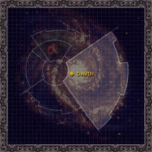

# 1040 戴文 Davin

精校状态：中文行文已逐段精校，部分术语仍为暂定

分类：地理 / 小行星 / 极限星域 Ultima Segmentum

原文来源：https://www.bilibili.com/opus/1159847839502696482

原作者：帝国神选罐头

原文时间：2026年01月20日 13:21

[返回分类目录](目录.md) · [全书目录](../../目录.md)

<!-- A1040-B0001 图片 -->

<!-- A1040-B0002 -->

原译文

Map 地图

**校订译文**

Map 地图

<!-- /A1040-B0002 -->

<!-- A1040-B0003 -->
### Basic Data 基本资料

原题：Basic Data 基础数据

<!-- /A1040-B0003 -->

<!-- A1040-B0004 -->
**英文原文**

Name:Davin

<!-- /A1040-B0004 -->

<!-- A1040-B0005 -->

原译文

名称：戴文

**校订译文**

名称：戴文

<!-- /A1040-B0005 -->

<!-- A1040-B0006 -->
**英文原文**

Segmentum:Ultima Segmentum

<!-- /A1040-B0006 -->

<!-- A1040-B0007 -->

原译文

星域：极限星域

**校订译文**

星域：极限星域

<!-- /A1040-B0007 -->

<!-- A1040-B0008 -->
**英文原文**

System:Davin System

<!-- /A1040-B0008 -->

<!-- A1040-B0009 -->

原译文

星系：戴文星系

**校订译文**

星系：戴文星系

<!-- /A1040-B0009 -->

<!-- A1040-B0010 -->
**英文原文**

Affiliation:Unknown, formerly Imperium

<!-- /A1040-B0010 -->

<!-- A1040-B0011 -->

原译文

隶属：未知，前帝国

**校订译文**

隶属：未知，前帝国

<!-- /A1040-B0011 -->

<!-- A1040-B0012 -->
**英文原文**

Class:Dead World, former Feral World

<!-- /A1040-B0012 -->

<!-- A1040-B0013 -->

原译文

类别：死亡世界，前蛮荒世界

**校订译文**

类别：死寂世界；原为蛮荒世界。

<!-- /A1040-B0013 -->

<!-- A1040-B0014 -->
**英文原文**

Davin was the prime world of the solar system of the same name, conquered during the Great Crusade by Warmaster Horus and the 63rd Expeditionary Fleet. It was the eighth world conquered by the fleet, and so for a time had the designation Sixty-Three Eight.

<!-- /A1040-B0014 -->

<!-- A1040-B0015 -->

原译文

戴文是同名太阳系的主星世界，在大远征期间被战帅荷鲁斯和第63远征舰队征服。这是舰队征服的第八个世界，因此有一段时间被称为63-8。

**校订译文**

戴文是同名恒星系的主要世界，大远征期间由战帅荷鲁斯率第63远征舰队征服。它是这支舰队征服的第八个世界，因此一度被编号为“63-8”。

<!-- /A1040-B0015 -->

<!-- A1040-B0016 -->
**英文原文**

It is principally known for being the world on which Horus made his pact with the Chaos powers. This event took place in the Temple of the Serpent Lodge, where he was treated for injuries incurred while quashing a rebellious force on Davin's moon.

<!-- /A1040-B0016 -->

<!-- A1040-B0017 -->

原译文

它主要以荷鲁斯与混沌力量签订契约的世界而闻名。这一事件发生在蛇屋神庙，在那里，他因在镇压戴文卫星上的叛乱部队时受伤而接受治疗。

**校订译文**

戴文最为人知的事迹，是荷鲁斯在此与混沌诸神订立契约。他在镇压戴文卫星上的叛军时受伤，随后被送到戴文本星的蛇之结社神庙接受治疗，堕落便发生于此。

<!-- /A1040-B0017 -->

<!-- A1040-B0018 -->
## History 历史

<!-- /A1040-B0018 -->

<!-- A1040-B0019 -->
**英文原文**

Davin's known history only covers the brief time of (supposed) planetary compliance to Imperial rule. The indigenous warriors briefly attempted to resist Imperial takeover, but quickly surrendered, completely outclassed in military terms. The warrior tribespeople were allowed to remain mostly intact after they surrendered to the Imperial forces, as they had impressed Horus with their battlefield courage and their willingness to learn and adapt to a new way of life. The actual military campaign on Davin was short, and the Luna Wolves left soon after the surrender of the Davinite warriors, taking with them their concept of the warrior-lodge. The re-education and shepherding of the people into the light of the Imperial Truth was left to a detachment of the Word Bearers Legion led by Kor Phaeron, while governorship of the planet itself was given to Commander Eugen Temba.

<!-- /A1040-B0019 -->

<!-- A1040-B0020 -->

原译文

戴文的已知历史只涵盖了（假设）行星服从帝国统治的短暂时间。土著战士曾短暂试图抵抗帝国的接管，但很快就投降了，在军事上完全被击败。战士部落成员在向帝国部队投降后被允许基本保持完整，因为他们的战场勇气以及学习和适应新生活方式的意愿给荷鲁斯留下了深刻的印象。对戴文的实际军事行动很短，在戴文的战士投降后不久，影月苍狼就离开了，带走了他们对战士结社的概念。将人民重新教育和引导到帝国真理之光之下的工作留给了科尔·法伦领导的怀言者军团的一个分遣队，而行星本身的总督职位则交给了指挥官尤金·坦巴。

**校订译文**

戴文的已知历史，主要集中在其名义上归顺帝国的短暂时期。当地战士曾试图抵抗帝国接管，但军事实力差距悬殊，很快便投降了。他们在战场上的勇气，以及学习、适应新生活的意愿，令荷鲁斯印象深刻，因此投降后各战士部落基本得以保留。征服戴文的战争十分短暂，当地战士投降后不久，影月苍狼便离开了，同时带走了当地“战士结社”的观念。重新教化居民、引导他们接受帝国真理的工作，交给了科尔·法伦率领的怀言者分遣队；指挥官欧根·坦巴则获任行星总督。

<!-- /A1040-B0020 -->

<!-- A1040-B0021 -->
**英文原文**

Sixty years later, Horus and the 63rd Expedition returned to Davin, at the behest of Chaplain Erebus of the Word Bearers, who reported that Commander Temba and his forces had gone renegade and had holed up on Davin's Moon. Horus led an assault force to the moon personally, where his forces were confronted by the reanimated remains of Temba's garrison. Horus slew the grossly altered Temba himself, but was gravely wounded doing so. He was eventually 'healed' in the Temple of the Serpent Lodge on Davin proper. This act, overseen by Erebus, corrupted Horus and set the stage for the Horus Heresy.

<!-- /A1040-B0021 -->

<!-- A1040-B0022 -->

原译文

60年后，荷鲁斯和第63远征队应怀言者牧师艾瑞巴斯的要求回到了戴文，艾瑞巴斯牧师报告说，坦巴指挥官和他的部队已经叛变，躲在了戴文的月亮上。荷鲁斯亲自率领一支突击队登上月亮，在那里他的部队遇到了坦巴驻军的复活遗骸。荷鲁斯亲自杀死了被严重改造的坦巴，但受了重伤。他最终在戴文的蛇屋神庙被“治愈”。在艾瑞巴斯的监督下，这一行为腐化了荷鲁斯，并为荷鲁斯叛乱奠定了基础。

**校订译文**

60年后，荷鲁斯与第63远征舰队在怀言者教士艾瑞巴斯的请求下返回戴文。艾瑞巴斯报告说，坦巴指挥官及其部队已经叛变，盘踞在戴文之月。荷鲁斯亲率突击部队登陆卫星，却遭遇了坦巴驻军复活的尸骸。他亲手杀死了已经严重变异的坦巴，自己也身负重伤。最终，他在戴文本星的蛇之结社神庙中得到“治愈”。艾瑞巴斯主持的这场治疗腐化了荷鲁斯，为荷鲁斯之乱铺平道路。

<!-- /A1040-B0022 -->

<!-- A1040-B0023 -->
**英文原文**

Following the corruption of Horus, the corrupted populace of Davin spread throughout the Imperium to spread the influence of Chaos. During the formation of the Ruinstorm, the world became the nexus of the Warp Storm and was enclosed by a massive sphere made of the bones of trillions of organisms. Now a world of madness, Davin was visited several years later by the combined fleets of Sanguinius, Roboute Guilliman, and Lion El'Jonson as they attempted to breach the Ruinstorm and reach Terra. All three Primarchs, as well as the captive Konrad Curze, visited the world and stood at the same temple where Horus had been corrupted. However, Davin was revealed to be the realm of the Daemon Madail, and a massive battle between the forces of Chaos and Imperium broke out both above and on the world. During the battle, the Primarchs were able to evacuate and destroyed Davin with Cyclonic Torpedoes.

<!-- /A1040-B0023 -->

<!-- A1040-B0024 -->

原译文

随着荷鲁斯的腐化，戴文的腐化平民蔓延到整个帝国，以传播混沌的影响。在毁灭风暴形成期间，世界成为亚空间风暴的纽带，被一个由数万亿生物骨骼组成的巨大球体包围。现在是一个疯狂的世界，几年后，圣吉列斯、罗伯特·基里曼和莱昂·艾尔庄森的联合舰队访问了戴文，试图突破毁灭风暴并到达泰拉。这三位原体，以及被俘的康拉德·科兹，都访问了这个世界，并站在荷鲁斯被腐化的同一座寺庙里。然而，戴文被揭露为恶魔马达伊的领域，混沌和帝国的部队在世界各地爆发了一场大规模的战斗。在战斗中，原体们得以撤离，并用旋风鱼雷摧毁了戴文。

**校订译文**

荷鲁斯堕落后，遭腐化的戴文居民散往帝国各地，传播混沌影响。毁灭风暴形成时，戴文成为这场亚空间风暴的中心，被一个由数万亿生物的骸骨构成的巨大球壳包围。数年后，圣吉列斯、罗保特·基里曼与莱昂·艾尔’庄森率联合舰队来到这个疯狂世界，试图突破毁灭风暴，前往泰拉。三位原体带着被俘的康拉德·科兹踏上地表，来到当年荷鲁斯遭腐化的那座神庙。然而，戴文实际上已成为恶魔马代尔的领域。混沌与帝国军队在地表和行星上空爆发大战。战斗中，原体们成功撤离，随后用旋风鱼雷摧毁戴文。

<!-- /A1040-B0024 -->

<!-- A1040-B0025 -->
## Geography and Planetary Conditions 地理和行星状态

<!-- /A1040-B0025 -->

<!-- A1040-B0026 -->
**英文原文**

Classed as a Feral World, Davin's deserts contain many ruins that indicate that it could once have supported a more advanced culture. Davin also possesses notably high mountain ranges, riven with tomb-filled, deep valleys, that descend into wide savannahs and grasslands that in turn run into the deserts. Great numbers of horned beasts migrate across the plains, hunted by razor-fanged predators, while serpents are common in the deserts. The uplands have earth of a hard clay that supports scrub vegetation and tall trees, while the river valleys are more fertile and contain the townships that hold most of the primitive human inhabitants of the world. Those that do not live in the townships are likely members of one of the various nomadic tribes. The indigenous inhabitants include a fierce warrior caste that regularly warred with one another before the arrival of the Imperium. This warrior caste were organised into different warrior-lodges that each venerated a particular form of local predator species.

<!-- /A1040-B0026 -->

<!-- A1040-B0027 -->

原译文

戴文被归类为蛮荒世界，其沙漠中有许多废墟，表明它曾经可以支持更先进的文明。戴文还拥有著名的高山山脉，布满了坟墓，深谷，延伸到广阔的稀树草原和草原，进而延伸到沙漠。大量有角的野兽在平原上迁徙，被剃刀般锋利的捕食者猎杀，而蛇在沙漠中很常见。高地有坚硬的粘土，支撑着灌木植被和高大的树木，而河谷则更肥沃，包含着世界上大多数原始人类居民的城镇。那些不住在城镇的人可能是各种游牧部落之一的成员。土著居民包括一个凶猛的战士氏族，在帝国到来之前，他们经常相互交战。这个战士氏族被组织成不同的战士结社，每个结社都供奉着一种特定形态的当地捕食者。

**校订译文**

戴文原被列为蛮荒世界，但沙漠中散布着许多遗迹，表明这里可能曾存在更先进的文明。行星上有巍峨山脉，其间被布满墓葬的深谷切割。地势逐渐下降，过渡为广阔的稀树草原和草地，再延伸到沙漠。大群有角野兽迁徙于平原，遭到长有利刃般尖牙的捕食者猎杀；沙漠中则常见蛇类。高地的土壤是坚硬黏土，生长着灌木与高大树木；河谷更为肥沃，多数仍处于原始社会阶段的人类居民生活在谷中的城镇。城镇以外的居民多属于各个游牧部落。当地有一个凶悍的战士阶层，在帝国到来前经常相互交战。他们组成不同的战士结社，各自崇拜某一种当地捕食动物。

**校注：** warrior caste 为战士阶层，不是一个单独氏族；每个战士结社崇拜的是某种捕食动物。

<!-- /A1040-B0027 -->

<!-- A1040-B0028 -->
### Davin's Moon 戴文之月

<!-- /A1040-B0028 -->

<!-- A1040-B0029 -->
**英文原文**

Appearing to be dirty yellow/brown coloured from orbit, Davin's Moon was originally charted as being similar to Davin in atmosphere and climate. Some time after the Imperial pacification of Davin the warping effects of the Chaos powers, particularly that of Nurg-leth (Nurgle), grossly altered the ecosystem. Most of the forestation vanished, and much of the moorland turned into particularly noxious and fog-bound swamp which eventually would conceal the mass-graves of the Imperial garrison. A significant landmark was created by the wreck of the large Imperial spaceship, the Glory of Terra. After the destruction of Eugen Temba, Nurgle's power seemed to be withdrawn from the world, making it somewhat less foul in general as well as clearing most of the murk and fog from the atmosphere.

<!-- /A1040-B0029 -->

<!-- A1040-B0030 -->

原译文

戴文之月在轨道上看起来是肮脏的黄色/棕色，最初被记录为在大气和气候上与戴文相似。在帝国平定戴文一段时间后，混沌力量的亚空间影响，特别是努尔格-莱斯（纳垢）的亚空间影响严重改变了生态系统。大部分的植林消失了，大部分高沼地变成了特别有害和雾气弥漫的沼泽，最终将掩盖帝国驻军的大坟墓。一个重要的地标是由帝国大型宇宙飞船泰拉之耀号的残骸创造的。在尤金·坦巴被毁灭后，纳垢的力量似乎从世界上撤出，使其总体上不那么肮脏，并清除了大气中的大部分阴霾和雾气。

**校订译文**

从轨道上看，戴文之月呈污浊的黄褐色。最初的测绘记录称，其大气与气候都类似戴文。帝国平定戴文一段时间后，混沌诸神的扭曲力量，尤其是努尔格-莱斯（纳垢）的影响，剧烈改变了卫星的生态。大部分森林消失，大片荒原化为毒气与浓雾笼罩的沼泽，最终掩盖了帝国驻军的万人坑。帝国大型太空舰船泰拉之誉号的残骸成为显眼的地标。欧根·坦巴被杀后，纳垢的力量似乎撤离了这个世界，环境总体有所改善，大气中的大部分阴霾和浓雾也散去了。

<!-- /A1040-B0030 -->

本篇核心术语与暂定项

以下列出本篇出现的英文原形及核心术语表用词。同形词可能指不同对象，具体词义以本篇正文和校注为准；单复数、别名和仅见于图注的名称可能尚未列入。完整候选见[术语表](../../术语表/双语术语候选.csv)。

| 英文 | 采用中文 | 状态 |
| --- | --- | --- |
| Roboute Guilliman | 罗保特·基里曼 | 官方已核对 |
| Horus Heresy | 荷鲁斯之乱 | 官方已核对 |
| Warp | 亚空间 | 官方已核对 |
| Imperium | 帝国 | 暂定·简称 |
| Nurgle | 纳垢 | 官方已核对 |
| History | 历史 | 编辑用语已统一 |
| Word Bearers | 怀言者 | 暂定·官方待核 |
| Great Crusade | 大远征 | 暂定·官方待核 |
| Compliance | 归顺；纳入帝国统治 | 暂定·官方待核 |
| Terra | 泰拉 | 暂定·官方待核 |
| Luna Wolves | 影月苍狼 | 暂定·官方待核 |
| Horus | 荷鲁斯 | 暂定·官方待核 |
| Erebus | 艾瑞巴斯 | 暂定·官方待核 |
| Lion El'Jonson | 莱昂·艾尔’庄森 | 官方已核对 |
| Ultima Segmentum | 极限星域 | 暂定·官方待核 |
| Segmentum | 星域 | 暂定·官方待核 |
| Konrad Curze | 康拉德·科兹 | 暂定·官方待核 |
| Davin | 戴文 | 暂定·官方待核 |
| Luna | 月球 | 暂定·官方待核 |
| Imperial Truth | 帝国真理 | 暂定·官方待核 |
| Chaplain | 教士 | 官方已核对 |
| Serpent Lodge | 蛇之结社 | 暂定·官方待核 |
| Eugen Temba | 欧根·坦巴 | 暂定·官方待核 |
| The Primarchs | 原体 | 暂定·官方待核 |
| Kor Phaeron | 科尔·法伦 | 暂定·官方待核 |
| Predators | 掠食者 | 暂定·官方待核 |
| Powers | 能天使 | 暂定·官方待核 |
| Phaeron | 法皇 | 暂定·官方待核 |
| Glory of Terra | 泰拉之誉号 | 暂定·官方待核 |
| Nurg-Leth | 努尔格-莱斯 | 暂定·官方待核 |
| Sphere | 防御圈 | 暂定·官方待核 |
| Madail | 马代尔 | 暂定·官方待核 |
| Warp Storm | 亚空间风暴 | 暂定·官方待核 |
| Ruinstorm | 毁灭风暴 | 暂定·官方待核 |
| System | 星系（恒星系统） | 暂定·官方待核 |
| Dead World | 死寂世界 | 暂定·官方待核 |
| Feral World | 蛮荒世界 | 暂定·官方待核 |
| Corruption | 腐败 | 暂定·官方待核 |
| Temple of the Serpent Lodge | 蛇之结社神庙 | 暂定·官方待核 |
| Davin's Moon | 戴文之月 | 暂定·官方待核 |

