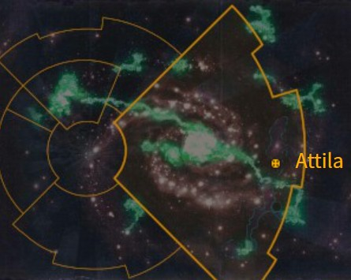

# 1041 阿提拉 Attila

精校状态：中文行文已逐段精校，部分术语仍为暂定

分类：地理 / 小行星 / 极限星域 Ultima Segmentum

原文来源：https://www.bilibili.com/opus/1165362070684696600

原作者：帝国神选罐头

原文时间：2026年02月04日 10:00

[返回分类目录](目录.md) · [全书目录](../../目录.md)

<!-- A1041-B0001 图片 -->

<!-- A1041-B0002 -->

原译文

Map 地图

**校订译文**

Map 地图

<!-- /A1041-B0002 -->

<!-- A1041-B0003 -->
**英文原文**

Attila is an Imperial world, famous for its Imperial Guard Attilan Rough Riders.

<!-- /A1041-B0003 -->

<!-- A1041-B0004 -->

原译文

阿提拉是一个帝国世界，以其帝国卫队阿提拉蛮骑兵而闻名。

**校订译文**

阿提拉是一个帝国世界，以其帝国卫队阿提拉蛮骑兵而闻名。

<!-- /A1041-B0004 -->

<!-- A1041-B0005 -->
### Basic Data 基本资料

原题：Basic Data 基础数据

<!-- /A1041-B0005 -->

<!-- A1041-B0006 -->
**英文原文**

Name:Attila

<!-- /A1041-B0006 -->

<!-- A1041-B0007 -->

原译文

名称：阿提拉

**校订译文**

名称：阿提拉

<!-- /A1041-B0007 -->

<!-- A1041-B0008 -->
**英文原文**

Segmentum:Ultima Segmentum

<!-- /A1041-B0008 -->

<!-- A1041-B0009 -->

原译文

星域：极限星域

**校订译文**

星域：极限星域

<!-- /A1041-B0009 -->

<!-- A1041-B0010 -->
**英文原文**

System:Attila System

<!-- /A1041-B0010 -->

<!-- A1041-B0011 -->

原译文

星系：阿提拉星系

**校订译文**

星系：阿提拉星系

<!-- /A1041-B0011 -->

<!-- A1041-B0012 -->
**英文原文**

Affiliation:Imperium

<!-- /A1041-B0012 -->

<!-- A1041-B0013 -->

原译文

隶属：帝国

**校订译文**

隶属：帝国

<!-- /A1041-B0013 -->

<!-- A1041-B0014 -->
**英文原文**

Class:Feudal World

<!-- /A1041-B0014 -->

<!-- A1041-B0015 -->

原译文

类别：封建世界Geography 地理Attila is a world consisting entirely of wide, arid plains. The world is somewhat smaller than Terra and has a single continent, covering nearly half of the planet's surface.阿提拉是一个完全由广阔干旱平原组成的世界。世界比泰拉小一些，只有一个大陆，覆盖了行星表面的近一半。The centre of this massive land mass is subject to such extremes of temperature that it remains uninhabited. It is a baking desert in the summer and a sub-zero expanse of sand and snow during winter. Beyond the continent's centre is rich savannah, punctuated with mountain chains, mighty inland lakes, and vast rivers. The continent is encircled near its coasts by verdant forests.这片广袤土地的中心受到极端温度的影响，至今无人居住。夏季，这里是一片灼热的沙漠，冬季则是一片零度以下的冰雪。大陆中心之外是丰富的稀树草原，点缀着山脉、巨大的内陆湖泊和大量的河流。这片大陆的海岸附近被青翠的森林环绕着。Population 人口Humans colonised Attila many thousands of years ago and probably adopted the nomadic life almost immediately. Khanasan is the only city on the entire planet, and is a bustling metropolis, a gathering place for the tribes, and the centre of Attila's government.人类在数千年前殖民了阿提拉，并可能几乎立即采取了游牧生活。卡纳桑是整个行星上唯一的城市，是一个繁华的大都市，是部落的聚集地，也是阿提拉政府的中心。The bulk of the population are tribal nomads who subsist from herds of Ovigors. These are gigantic, shaggy, and savage animals native to Attila. Their rich flesh and dark blood form the basic subsistence diet of the tribes. When summer comes, the Attilans drive their herds towards the heart of the continent, following the spring thaw and newly grown pasture. In winter, they retreat towards the outer grasslands abutting the coasts, and here their animals find enough grazing to keep them alive until the year's turn.大部分人口是部落游牧民，他们靠奥维戈尔牧群为生。这些是阿提拉特有的巨大、毛茸茸、野蛮的动物。他们充足的血肉构成了部落的基本生存饮食。夏天来临时，随着春天的解冻和新长出的牧草地，阿提拉人将他们的牧群赶到大陆的中心。冬天，他们会撤退到靠近海岸的外围草原，在这里，他们的动物会找到足够的牧草地，让它们活到年末。Culture 文化The Attilans are recruited extensively into the Imperial Guard, where their expertise as horsemen is much sought after for scouting duties.阿提拉人被广泛招募到帝国卫队，他们作为骑兵的专业知识在侦察任务中备受追捧。These riders war with one another for power. When a tribal lord defeats an enemy he cuts off the beaten man's head and his artificers turn the skull into a drinking cup as a permanent symbol of his victory. The King of Khanasan and Lord of Attila is acknowledged as "the King of a Thousand Skulls".这些骑手为了权力而互相争斗。当部落首领击败敌人时，他会砍掉被打败的人的头，他的工匠会把头骨变成一个酒杯，作为他胜利的永久象征。卡纳桑之王和阿提拉领主被公认为“千颅之王”。Attilan culture is feudal, at best; any settled civilization that happens to spring up upon the world is soon crushed by hordes of horse-riding barbarians.阿提拉文化充其量是封建的；任何碰巧出现在世界上的定居文明很快就会被成群结队的骑马野蛮人摧毁。The most important component of Attilan culture is the horse. The horses of Attila are hardy, compact and vicious animals, from which their riders may in adversity draw off small quantities of blood to enable their riders to operate behind hostile lines for long periods. Each warrior proudly carries long scars on his cheeks, which he gets from his coming of age ritual. Ash is often rubbed into these scars, in order to make them more severe and thus impressive. Attilans tend to wear their hair in long, unkempt braids, or long and matted.阿提兰文化最重要的组成部分是马。阿提拉的马是强壮、紧密和凶猛的动物，骑手在逆境中可能会从这些马身上抽取少量血液，使骑手能够在敌后长时间行动。每个战士都自豪地在脸颊上留下长长的疤痕，这是他成年仪式留下的。灰烬经常被擦到这些疤痕上，以使它们更加严重，从而给人留下深刻印象。阿提拉人倾向于把头发扎成又长又乱的辫子，或者又长又缠。Attilans are regarded as being as rank and unsanitary as Ogryns, as they do not bathe or clean their clothing. They believe that it is an insult to the spirits of water. This tradition has proven hard to break, despite considerable effort on the part of the Adeptus Ministorum preachers in the barely tolerated mission in Khanasan.阿提拉人被认为和欧格林人一样恶臭和不卫生，因为他们不洗澡也不洗衣服。他们认为这是对水之灵的侮辱。事实证明，这一传统很难打破，尽管国教教会的传教士在卡纳桑几乎无法容忍的传教活动中付出了相当大的努力。Status 状态Following the resurrection of Roboute Guilliman and the formation of the Great Rift, Attila was one of the worlds which became stranded in the Dark Imperium. It was nearly attacked by the Blood Crusade of Khorne, while the Necrons of the Sautekh Dynasty launched a sudden offensive on the world.随着罗伯特·基里曼的复活和大裂隙的形成，阿提拉是被困在黑暗帝国中的世界之一。它几乎被恐虐的鲜血远征袭击，而索特克王朝的死灵突然向世界发动了进攻。Sometime into the Indomitus Crusade, it was discovered by the Rogue Trader Katla Helvintr that there was a stable Warp route through the Great Rift near Attila. Dubbing it the Attilan Gate, it is the second known such route through the Rift after the Nachmund Gauntlet.在不屈远征的某个时候，行商狼人卡特拉·赫尔文特发现，阿提拉附近有一条稳定的亚空间航线穿过大裂隙。它被称为阿提拉门，是继纳克蒙德走廊之后第二条已知的穿越裂隙的路线。

**校订译文**

类别：封建世界

Geography 地理

Attila is a world consisting entirely of wide, arid plains. The world is somewhat smaller than Terra and has a single continent, covering nearly half of the planet's surface.阿提拉遍布广阔、干旱的平原。它比泰拉略小，只有一块大陆，覆盖近一半的行星表面。

The centre of this massive land mass is subject to such extremes of temperature that it remains uninhabited. It is a baking desert in the summer and a sub-zero expanse of sand and snow during winter. Beyond the continent's centre is rich savannah, punctuated with mountain chains, mighty inland lakes, and vast rivers. The continent is encircled near its coasts by verdant forests.这块大陆中央温差极端，始终无人居住：夏天是灼热沙漠，冬天则化为冰点以下、沙雪交杂的旷野。内陆以外分布着丰饶的稀树草原，其间点缀山脉、巨大内陆湖和壮阔河流；沿海地带则被青翠森林环绕。

Population 人口

Humans colonised Attila many thousands of years ago and probably adopted the nomadic life almost immediately. Khanasan is the only city on the entire planet, and is a bustling metropolis, a gathering place for the tribes, and the centre of Attila's government.人类在数千年前定居阿提拉，可能很快就转而过上游牧生活。卡纳桑是整颗行星唯一的城市，也是一座繁华都会，各部落在此聚集，阿提拉的政权中枢也设于此。

The bulk of the population are tribal nomads who subsist from herds of Ovigors. These are gigantic, shaggy, and savage animals native to Attila. Their rich flesh and dark blood form the basic subsistence diet of the tribes. When summer comes, the Attilans drive their herds towards the heart of the continent, following the spring thaw and newly grown pasture. In winter, they retreat towards the outer grasslands abutting the coasts, and here their animals find enough grazing to keep them alive until the year's turn.多数居民是逐畜群而居的部落游牧民，靠饲养奥维戈尔维生。这种本土动物体型巨大、长毛披身、性情凶猛，肥美的肉和深色血液构成部落的基本食物。夏季来临时，阿提拉人追随春融和新生牧草，将畜群赶向大陆腹地；冬季再迁往沿海外围草原，那里有足够的牧草，让牲畜熬到新的一年。

Culture 文化

The Attilans are recruited extensively into the Imperial Guard, where their expertise as horsemen is much sought after for scouting duties.帝国卫队大量征募阿提拉人，他们精湛的骑术尤其适合侦察任务。

These riders war with one another for power. When a tribal lord defeats an enemy he cuts off the beaten man's head and his artificers turn the skull into a drinking cup as a permanent symbol of his victory. The King of Khanasan and Lord of Attila is acknowledged as "the King of a Thousand Skulls".这些骑手为了权力而互相争斗。当部落首领击败敌人时，他会砍掉被打败的人的头，他的工匠会把头骨变成一个酒杯，作为他胜利的永久象征。卡纳桑之王和阿提拉领主被公认为“千颅之王”。Attilan culture is feudal, at best; any settled civilization that happens to spring up upon the world is soon crushed by hordes of horse-riding barbarians.阿提拉文化充其量是封建的；任何碰巧出现在世界上的定居文明很快就会被成群结队的骑马野蛮人摧毁。The most important component of Attilan culture is the horse. The horses of Attila are hardy, compact and vicious animals, from which their riders may in adversity draw off small quantities of blood to enable their riders to operate behind hostile lines for long periods. Each warrior proudly carries long scars on his cheeks, which he gets from his coming of age ritual. Ash is often rubbed into these scars, in order to make them more severe and thus impressive. Attilans tend to wear their hair in long, unkempt braids, or long and matted.马是阿提拉文化的核心。当地马匹结实紧凑、耐力出众而性情凶悍。身陷困境时，骑手可以抽取少量马血充饥，以便在敌后长期行动。每位战士都以成年仪式留下的面颊长疤为荣，还常将灰烬揉入伤口，让疤痕更加明显，显得威武。阿提拉人通常留着蓬乱的长辫，或任长发纠结成绺。

Attilans are regarded as being as rank and unsanitary as Ogryns, as they do not bathe or clean their clothing. They believe that it is an insult to the spirits of water. This tradition has proven hard to break, despite considerable effort on the part of the Adeptus Ministorum preachers in the barely tolerated mission in Khanasan.阿提拉人不洗澡，也不洗衣服，认为这样做会冒犯水之灵，因此被认为像欧格林一样恶臭、不讲卫生。卡纳桑的国教会传教站仅仅得到当地勉强容忍；尽管传教士费尽心力，也始终难以改变这一传统。

Status 状态

Following the resurrection of Roboute Guilliman and the formation of the Great Rift, Attila was one of the worlds which became stranded in the Dark Imperium. It was nearly attacked by the Blood Crusade of Khorne, while the Necrons of the Sautekh Dynasty launched a sudden offensive on the world.罗保特·基里曼复生、大裂隙形成后，阿提拉成为陷于帝国暗面的世界之一。恐虐的鲜血远征险些袭击这里，而索特克王朝的太空死灵则突然向行星发起进攻。

Sometime into the Indomitus Crusade, it was discovered by the Rogue Trader Katla Helvintr that there was a stable Warp route through the Great Rift near Attila. Dubbing it the Attilan Gate, it is the second known such route through the Rift after the Nachmund Gauntlet.不屈远征期间，行商浪人卡特拉·赫尔文特发现，阿提拉附近存在一条稳定穿过大裂隙的亚空间航道，并将其命名为“阿提兰之门”。这是继纳克蒙德走廊之后，第二条已知的穿越大裂隙的航路。

**校注：** 原段混合整篇中英文，已保留英文逐字内容并分段。compact 指马匹体格紧凑；barely tolerated 修饰传教站被当地勉强容忍；Rogue Trader为行商浪人。Attilan Gate沿此前既定阿提兰之门。

<!-- /A1041-B0015 -->

本篇核心术语与暂定项

以下列出本篇出现的英文原形及核心术语表用词。同形词可能指不同对象，具体词义以本篇正文和校注为准；单复数、别名和仅见于图注的名称可能尚未列入。完整候选见[术语表](../../术语表/双语术语候选.csv)。

| 英文 | 采用中文 | 状态 |
| --- | --- | --- |
| Imperial Guard | 帝国卫队 | 暂定·语境区分 |
| Imperium | 帝国 | 暂定·简称 |
| Ultima Segmentum | 极限星域 | 暂定·官方待核 |
| Segmentum | 星域 | 暂定·官方待核 |
| Attila | 阿提拉 | 暂定·官方待核 |
| Attilan Rough Riders | 阿提拉蛮骑兵 | 官方已核对 |
| System | 星系（恒星系统） | 暂定·官方待核 |
| Feudal World | 封建世界 | 暂定·官方待核 |

