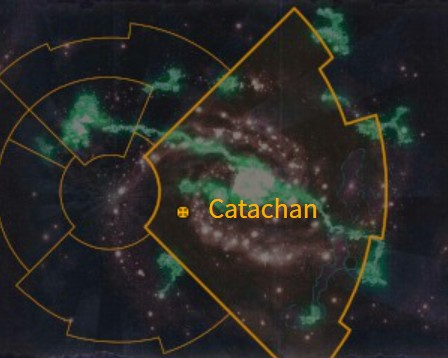
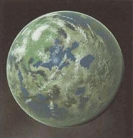
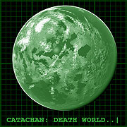
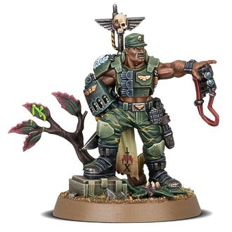

# 1042 卡塔昌 Catachan

精校状态：中文行文已逐段精校，部分术语仍为暂定

分类：地理 / 小行星 / 极限星域 Ultima Segmentum

原文来源：https://www.bilibili.com/opus/1165699152591454216

原作者：帝国神选罐头

原文时间：2026年02月05日 07:48

[返回分类目录](目录.md) · [全书目录](../../目录.md)

<!-- A1042-B0001 图片 -->

<!-- A1042-B0002 -->

原译文

Map 地图

**校订译文**

Map 地图

<!-- /A1042-B0002 -->

<!-- A1042-B0003 -->
### Basic Data 基本资料

原题：Basic Data 基础数据

<!-- /A1042-B0003 -->

<!-- A1042-B0004 -->
**英文原文**

Name:Catachan

<!-- /A1042-B0004 -->

<!-- A1042-B0005 -->

原译文

名称：卡塔昌

**校订译文**

名称：卡塔昌

<!-- /A1042-B0005 -->

<!-- A1042-B0006 -->
**英文原文**

Segmentum:Ultima Segmentum

<!-- /A1042-B0006 -->

<!-- A1042-B0007 -->

原译文

星域：极限星域

**校订译文**

星域：极限星域

<!-- /A1042-B0007 -->

<!-- A1042-B0008 -->
**英文原文**

System:Catachan

<!-- /A1042-B0008 -->

<!-- A1042-B0009 -->

原译文

星系：卡塔昌星系

**校订译文**

星系：卡塔昌星系

<!-- /A1042-B0009 -->

<!-- A1042-B0010 -->
**英文原文**

Population:12,000,000

<!-- /A1042-B0010 -->

<!-- A1042-B0011 -->

原译文

人口：1200,0000

**校订译文**

人口：1200万

<!-- /A1042-B0011 -->

<!-- A1042-B0012 -->
**英文原文**

Affiliation:Imperium

<!-- /A1042-B0012 -->

<!-- A1042-B0013 -->

原译文

隶属：帝国

**校订译文**

隶属：帝国

<!-- /A1042-B0013 -->

<!-- A1042-B0014 -->
**英文原文**

Class:Death World, Jungle World

<!-- /A1042-B0014 -->

<!-- A1042-B0015 -->

原译文

类别：死亡世界，丛林世界

**校订译文**

类别：死亡世界，丛林世界

<!-- /A1042-B0015 -->

<!-- A1042-B0016 -->
**英文原文**

Tithe Grade:Solutio Primus

<!-- /A1042-B0016 -->

<!-- A1042-B0017 -->

原译文

什一税等级：第三级上等

**校订译文**

什一税等级：第三级上等

<!-- /A1042-B0017 -->

<!-- A1042-B0018 图片 -->

<!-- A1042-B0019 -->

原译文

Planetary Image 行星图像

**校订译文**

Planetary Image 行星图像

<!-- /A1042-B0019 -->

<!-- A1042-B0020 -->
**英文原文**

Catachan is the most infamous and lethal Death World in the entire galaxy.

<!-- /A1042-B0020 -->

<!-- A1042-B0021 -->

原译文

卡塔昌是整个银河系中最臭名昭著、最致命的死亡世界。

**校订译文**

卡塔昌是整个银河系中最臭名昭著、最致命的死亡世界。

<!-- /A1042-B0021 -->

<!-- A1042-B0022 -->
## Overview 概述

<!-- /A1042-B0022 -->

<!-- A1042-B0023 -->
**英文原文**

It is located in the Ultima Segmentum and is covered in dense jungle. The planet's entire ecosystem seems consciously hostile to all foreign life. Each and every element of the native flora and fauna of the planet represents a real danger to any human, even Space Marines are said to avoid this hellish place. Catachan has no need for the Planetary Defense Forces utilized by other worlds, its flora and fauna being sufficiently deadly to thwart attackers without the need for human intervention. The planet is known to house the single deadliest creature in the galaxy, with some of its native wildlife even being released on other worlds to dissuade invasion. Catachan's only valuable resource is its people, who by virtue of being born on the harshest world in the Imperium, are invariably tough and cunning. It is the homeworld of the hulking and fearsome Catachan Jungle Fighters of the Imperial Guard. For the death world’s finest, Humanity’s wars present no greater hardship than they face daily, so they proudly answer the Emperor's call to arms.

<!-- /A1042-B0023 -->

<!-- A1042-B0024 -->

原译文

它位于极限星域，被茂密的丛林所覆盖。行星的整个生态系统似乎有意地敌视所有外来生命。行星上本土动植物的每一个成员都对任何人类构成真正的危险，甚至星际战士据说也会避开这个地狱般的地方。卡塔昌不需要其他世界使用的行星防御部队，其动植物足以在不需要人为干预的情况下挫败攻击者。众所周知，这个行星上有银河系中最致命的生物，它的一些本土野生动物甚至被释放到其他行星上以阻止入侵。卡塔昌唯一宝贵的资源是它的人民，由于出生在帝国最严酷的世界，他们总是坚强狡猾。这是帝国卫队庞大而可怕的卡塔昌丛林战士的家园世界。对于死亡世界最优秀的人来说，人类的战争并没有比他们每天面临的困难更大，所以他们自豪地响应了帝皇的号召。

**校订译文**

卡塔昌位于极限星域，地表覆盖着茂密丛林。整个生态系统似乎有意识地敌视一切外来生命，每一种本土动植物都能威胁人类，据说连星际战士也会避开这片地狱。这里不需要其他世界常备的行星防御部队：当地动植物已足以在无人干预的情况下挫败入侵者。银河系中最致命的生物就栖息于此；有些本土野生动物甚至被放养到其他世界，用于阻止入侵。卡塔昌唯一宝贵的资源是居民本身。出生于帝国最严酷的世界，使他们个个坚韧而机敏。帝国卫队中魁梧骇人的卡塔昌丛林斗士便来自这里。对这些死亡世界的精英而言，战争的艰险不比日常生活更甚，因此他们自豪地响应帝皇的征召。

<!-- /A1042-B0024 -->

<!-- A1042-B0025 -->
## History 历史

<!-- /A1042-B0025 -->

<!-- A1042-B0026 -->
**英文原文**

Catachan has been colonized by humans for longer than Imperial records can remember. When the first probes arrived, the planet was a deceptive, calm green orb from orbit but when the colony ships crash-landed and the colonists had no way to escape, they awoke to find themselves on one of the harshest planets in the galaxy. The colonists only barely survived, holed up in their spacecraft against a living, besieging jungle, a battle for survival in which many undoubtedly died.

<!-- /A1042-B0026 -->

<!-- A1042-B0027 -->

原译文

卡塔昌被人类殖民的时间比帝国记录所能记住的还要长。当第一个探测器到达时，这颗行星是一个来自轨道的欺骗性、平静的绿色球体，但当殖民飞船坠毁，殖民者无法逃脱时，他们醒来发现自己身处银河系中最恶劣的行星之一。殖民者勉强幸存下来，躲在他们的宇宙飞船里，面对一个活生生的、围困的丛林，这场生存之战无疑导致许多人死亡。

**校订译文**

人类定居卡塔昌的历史久远到连帝国档案也无法追溯。最初的探测器抵达时，从轨道看去，这是一颗宁静的绿色星球，表象极具欺骗性。直到殖民船迫降、殖民者无路可逃，他们才发现自己身处银河最严酷的世界之一。他们蜷缩在飞船中，抵挡仿佛活物般围攻而来的丛林，勉强延续生命。这场求生之战无疑夺走了许多人的性命。

<!-- /A1042-B0027 -->

<!-- A1042-B0028 -->
**英文原文**

Currently, the few settlements which can hold back the jungle forces are giant fortresses surrounded by vast plains which have been cleared to give improved lines-of-fire. Building on Catachan is difficult as vines and lichen take hold anywhere and poisons melt the mortar and vines can crush bunkers and tanks. Buildings must constantly be rebuilt; it seems that wherever they build, the jungle redoubles its efforts to destroy them. As well as the jungle, the native wildlife gather to repel the human invaders and eventually the numbers grow enough to push the humans out of their settlement so they must resettle elsewhere.

<!-- /A1042-B0028 -->

<!-- A1042-B0029 -->

原译文

目前，能够阻挡丛林部队的少数定居点是被广阔平原包围的巨大堡垒，这些平原已被清理以改善火力线。在卡塔昌上建造是困难的，因为藤蔓和地衣会在任何地方扎根，毒素会融化灰浆，藤蔓会压碎掩体和坦克。建筑物必须不断重建；似乎无论他们在哪里建造，丛林都会加倍努力摧毁他们。除了丛林，当地野生动物也聚集在一起击退人类入侵者，最终数量增长到足以将人类赶出定居点，因此他们必须在其他地方重新定居。

**校订译文**

如今，少数能够抵御丛林侵袭的聚居点都是巨大堡垒，周围清理出广阔空地，以获得良好的射界。在卡塔昌建造建筑极其困难：藤蔓与地衣无处不生，毒液会腐蚀砂浆，藤蔓甚至能绞碎掩体和坦克。建筑必须不断重建，仿佛人类在哪里落脚，丛林就会加倍反扑。当地野生动物也会聚集起来驱逐人类；数量积累到一定程度后，居民便守不住据点，只能迁往别处重新定居。

<!-- /A1042-B0029 -->

<!-- A1042-B0030 -->
**英文原文**

In such dangerous surroundings, children are quick to learn survival tactics and only those who are fast and have a good natural aim survive to adulthood. Children often learn to shoot before they walk, and must be deadly fighters in their own right by the time most normal humans learn to spell.

<!-- /A1042-B0030 -->

<!-- A1042-B0031 -->

原译文

在这种危险的环境中，孩子们很快就能学会生存策略，只有那些速度快、有良好自然目标的人才能活到成年。孩子们经常在走路前学会射击，当大多数正常人学会拼写时，他们必须凭借自己的力量成为致命的战士。

**校订译文**

在这种险境中，孩子必须迅速学会求生。只有反应敏捷、天生瞄得准的人，才能活到成年。他们往往还没学会走路就先学会射击；到了普通人刚开始识字的年纪，他们就必须成为能够独立杀敌的战士。

<!-- /A1042-B0031 -->

<!-- A1042-B0032 -->
### Recent History 近期历史

<!-- /A1042-B0032 -->

<!-- A1042-B0033 -->
**英文原文**

During the Thirteenth Black Crusade the Death World found itself in the path of both a wounded Void Whale and a Waaagh! led by the Freebooter Kaptain Badrukk. However, due to interference caused by the Warp Storm Bas Infernia, the Imperium was unable to warn the Catachans of the threats heading towards them.

<!-- /A1042-B0033 -->

<!-- A1042-B0034 -->

原译文

在第十三次黑色远征期间，死亡世界发现自己处于一只受伤的虚空鲸和一个由流寇坏酒鬼船长领导的Waaagh!的路径上。然而，由于亚空间风暴，地狱深处的干扰，帝国无法向卡塔昌人发出威胁的警告。

**校订译文**

第十三次黑色远征期间，一头受伤的虚空鲸与自由掠夺者烂赌鬼船长率领的Waaagh!都朝卡塔昌而来。然而，名为“地狱深处”的亚空间风暴造成干扰，帝国无法向卡塔昌居民发出预警。

<!-- /A1042-B0034 -->

<!-- A1042-B0035 -->
**英文原文**

During the formation of the Great Rift, Catachan was caught within the malignant rift and exposed to Daemonic Invasion. However when Guilliman's Indomitus Crusade arrived, they found that the local Catachan regiments had already dealt with the threat.

<!-- /A1042-B0035 -->

<!-- A1042-B0036 -->

原译文

在大裂隙形成期间，卡塔昌被困在恶意裂隙中，并受到恶魔的入侵。然而，当基里曼的不屈远征到达时，他们发现当地的卡塔昌兵团已经应对了这一威胁。

**校订译文**

大裂隙形成时，卡塔昌被卷入这道恶毒裂隙，遭到恶魔入侵。然而，基里曼的不屈远征抵达时，发现当地卡塔昌各团早已消灭了这股威胁。

<!-- /A1042-B0036 -->

<!-- A1042-B0037 -->
## Geography 地理

<!-- /A1042-B0037 -->

<!-- A1042-B0038 -->
### Flora and Fauna 动植物

<!-- /A1042-B0038 -->

<!-- A1042-B0039 -->
**英文原文**

All of the animals and plants on Catachan are geared in some way to destroy humans and any other invaders. Every plant is poisonous, making foraging impossible. Some plants secrete pollen into the air which is poisonous and destroys air-filters. Others secrete sticky liquid to capture passing animals and slowly dissolve them. Other plants poison the ground and turn the immediate area around them into boggy wasteland to trap invaders. In the jungle, even the slightest scratch can prove fatal as necrotic bacteria swarm in to putrefy it. The native animals are as deadly to humanity as the plant life, the Catachan Devil with jaws as big as a tank is a major threat to human living centres. The giant Shambling Mamorphs of the volcanic regions are also considered to be a major threat.

<!-- /A1042-B0039 -->

<!-- A1042-B0040 -->

原译文

卡塔昌上的所有动植物都以某种方式准备摧毁人类和任何其他入侵者。每种植物都有毒，无法食用。一些植物将花粉分泌到空气中，这是有毒的，会破坏空气过滤器。其他的则分泌粘稠的液体来捕捉路过的动物，并慢慢溶解它们。其他植物会毒害地面，将周围地区变成沼泽荒地，以诱捕入侵者。在丛林中，即使是最轻微的划痕也可能是致命的，因为坏死细菌会蜂拥而至，使其腐烂。本土动物对人类和植物一样致命，下巴像坦克一样大的卡塔昌恶魔对人类生存中心构成了重大威胁。火山地区的巨型蹒跚变形者也被认为是一个主要威胁。

**校订译文**

卡塔昌的每一种动植物，都以某种方式具备杀死人类及其他入侵者的能力。所有植物都有毒，根本无法野外采食。有些向空气释放有毒花粉，还会破坏空气过滤器；有些分泌黏液，捕获经过的动物并缓慢溶解它们；另一些则毒化土壤，将周围变成泥泞废地，诱捕入侵者。在丛林里，即使最轻微的擦伤也可能致命，致坏死细菌会迅速侵入，使伤口腐烂。本土动物和植物一样危险：卡塔昌恶魔的巨颚堪比坦克，是人类聚居点的重大威胁；火山地区的巨型蹒跚马莫夫兽同样十分可怕。

**校注：** Shambling Mamorphs 原“蹒跚变形者”容易无据暗示变形能力；暂作蹒跚马莫夫兽，保留英文物种名词根。

<!-- /A1042-B0040 -->

<!-- A1042-B0041 图片 -->

<!-- A1042-B0042 -->

原译文

Catachan 卡塔昌

**校订译文**

Catachan 卡塔昌

<!-- /A1042-B0042 -->

<!-- A1042-B0043 -->
### Flora 植物

<!-- /A1042-B0043 -->

<!-- A1042-B0044 -->
**英文原文**

Barbed Vemongorse — Possessed of a primal, cunning sapience, this carnivorous plant is highly adaptable, which snakes toward anything that lives, able to generate new weapon-growths and toxins throughout its life cycle while injecting debilitating neurotoxin with invariably fatal results. Commonly found with a collection of dead animal bones, xenos skeletons, and the odd unfortunate desiccated guardsman entangled in its sapient roots and boughs. The venom from a single one of these xeno-weeds is enough to kill most of a hive city. Mesh-like leaves, buds, and barbed flowers, a thick tangle of thorned creeper vines. Produces deadly subforms like the Grappleweed.

<!-- /A1042-B0044 -->

<!-- A1042-B0045 -->

原译文

带刺毒荆豆 — 这种食肉植物具有原始而狡猾的智慧，适应性很强，会向任何有生命的东西蔓延，能够在整个生命周期内产生新的武器生长和毒素，同时注射令人衰弱的神经毒素，结果总是致命的。通常发现有一堆死去的动物骨头、异型骨骼和奇怪的不幸的脱水卫兵，他们被其聪明的根和树枝缠住了。一株这种异型野草的毒液足以杀死一个巢都城市的大部分。网状的叶子、花蕾和带刺的花朵，一团厚厚的刺藤。产生像缠藤这样的致命子形态。

**校订译文**

带刺毒荆豆——一种拥有原始而狡黠智慧的食肉植物，适应力极强，会蜿蜒伸向一切活物。它在整个生命周期中都能长出新的攻击结构、产生新毒素，注入猎物体内的神经毒素会使其衰弱，且无一例外地致死。其有知觉的根与枝条上，常缠着动物和异形的骸骨，偶尔还有不幸卫兵的干尸。一株这种异星杂草的毒液，就足以杀死一座巢都的大部分居民。它拥有网状叶片、花蕾和带刺花朵，藤蔓密布棘刺，还会衍生出缠藤等致命亚型。

<!-- /A1042-B0045 -->

<!-- A1042-B0046 -->
**英文原文**

Grappleweed — The most common and deadly subform of the Barbed Vemongorse. The Grappleweed is a hideous alien plant, with stumpy bushes with trumpet like flowers, able to shuffle across the landscapes of the galaxy in search of fresh morsels of prey. The writhing barbed tentacles are a deadly menace which will drag any prey with its grapple-barbed tongue into the fleshy trumpet for eventual digestion. It is a ravenous carnivorous plant that tumbles towards its prey with astonishing swiftness before dousing it in highly corrosive chemicals and consuming the slurried remains.

<!-- /A1042-B0046 -->

<!-- A1042-B0047 -->

原译文

缠藤 — 带刺毒荆豆最常见、最致命的亚型。缠藤是一种可怕的异型植物，有着喇叭状花朵的矮树丛， 能够在银河系的各个星系间穿梭，寻找新鲜的猎物。扭动的带刺触手是一种致命的威胁，它会用其带刺舌头将任何猎物拖入肉质的喇叭口中，以便最终消化。它是一种贪婪的食肉植物，以惊人的速度扑向猎物，然后将其浸泡在高腐蚀性化学物质中并吃掉浆状残留物。

**校订译文**

缠藤——带刺毒荆豆最常见、也最致命的亚型。这种骇人的异星植物如同长着喇叭形花朵的矮灌木，能够在地面缓慢移动，寻找新鲜猎物。它蠕动的带刺触手极其危险，带钩刺的舌头能将猎物拖进肉质喇叭口中消化。这种贪食植物发动袭击时速度惊人，会迅速滚向猎物，浇上强腐蚀性化学液体，再吞食化成浆液的残骸。

**校注：** across the landscapes of the galaxy 指这种植物能在银河各地的地面上移动，不是植物能自行穿梭星系。

<!-- /A1042-B0047 -->

<!-- A1042-B0048 -->
**英文原文**

Brainleaf — A vegetative carnivore: a small tree, not particularly conspicuous on Catachan, but is able to attach its tendrils to the spine and brain of a person, taking control over their body. This creature may be an offshoot of the Tyranid Cortex Leech, a creature with similar abilities.

<!-- /A1042-B0048 -->

<!-- A1042-B0049 -->

原译文

脑叶 — 一种植物性食肉动物：一种小树，在卡塔昌上并不特别显眼，但能够将卷须附着在人的脊柱和大脑上，控制他们的身体。这种生物可能是具有类似能力的泰伦皮层水蛭的分支。

**校订译文**

脑叶 — 一种植物性食肉动物：一种小树，在卡塔昌上并不特别显眼，但能够将卷须附着在人的脊柱和大脑上，控制他们的身体。这种生物可能是具有类似能力的泰伦皮层水蛭的分支。

<!-- /A1042-B0049 -->

<!-- A1042-B0050 -->
**英文原文**

Breathweed — Infects a host's tongue and eventually replaces it.

<!-- /A1042-B0050 -->

<!-- A1042-B0051 -->

原译文

呼吸草 — 感染宿主的舌头并最终取代它。

**校订译文**

呼吸草 — 感染宿主的舌头并最终取代它。

<!-- /A1042-B0051 -->

<!-- A1042-B0052 -->
**英文原文**

Canak Floater — These bizarre and deadly plants are filled with lighter-than-air gases, and drift across the planet with the vagaries of the wind. They have sensitive feeler tentacles, which detect warmth and moisture above the normal local levels. This is usually to detect streams, hot springs and other sources of water, but unfortunately is also sensitive enough to detect the temperature of and moisture changes caused by humans. When it finds such a place, the floater explodes, scattering its seed pods over a wide area. These seed pods have a diamond-hard outer casing with razor sharp edges, and will scythe through anything within range.

<!-- /A1042-B0052 -->

<!-- A1042-B0053 -->

原译文

卡纳克漂浮者 — 这些奇异而致命的植物充满了比空气轻的气体，随着变幻莫测的风在行星上漂流。它们有敏感的触须，可以探测到高于正常局部水平的温暖和水分。这通常是为了检测溪流、温泉和其他水源，但不幸的是，它也足够敏感，可以检测人类引起的温度和湿度变化。当它找到这样一个地方时，漂浮物会爆炸，将其种子荚散布在广阔的区域。这些种子荚有一个钻石般坚硬的外壳，有锋利的边缘，可以如镰刀般割穿范围内的任何东西。

**校订译文**

卡纳克漂浮者 — 这些奇异而致命的植物充满了比空气轻的气体，随着变幻莫测的风在行星上漂流。它们有敏感的触须，可以探测到高于正常局部水平的温暖和水分。这通常是为了检测溪流、温泉和其他水源，但不幸的是，它也足够敏感，可以检测人类引起的温度和湿度变化。当它找到这样一个地方时，漂浮物会爆炸，将其种子荚散布在广阔的区域。这些种子荚有一个钻石般坚硬的外壳，有锋利的边缘，可以如镰刀般割穿范围内的任何东西。

<!-- /A1042-B0053 -->

<!-- A1042-B0054 -->
**英文原文**

Miral Catcher — Ground-hugging vegetation which has roots that are extremely sensitive to vibrations in the ground, such as might be caused by an animal wandering past. It looks innocuous enough when dormant, but when it attacks, huge tentacles whip from its many frilled maws and lash out. They carry a paralysing toxin, which acts almost instantaneously.

<!-- /A1042-B0054 -->

<!-- A1042-B0055 -->

原译文

米拉尔捕捉者 — 一种紧贴地面的植被，其根系对地面的振动极为敏感，例如可能由动物游荡引起的振动。它在休眠时看起来无害，但当它发起攻击时，其有众多褶边的口中会伸出巨大的触手鞭，猛烈地抽打出去。它们携带一种几乎瞬间起作用的麻痹毒素。

**校订译文**

米拉尔捕捉者 — 一种紧贴地面的植被，其根系对地面的振动极为敏感，例如可能由动物游荡引起的振动。它在休眠时看起来无害，但当它发起攻击时，其有众多褶边的口中会伸出巨大的触手鞭，猛烈地抽打出去。它们携带一种几乎瞬间起作用的麻痹毒素。

<!-- /A1042-B0055 -->

<!-- A1042-B0056 -->
**英文原文**

Shardwrack Spines — Also known as "devil's-teeth", an evasive species of jagged formations of fossilized organic matter that have hardened over thousands of year forming razor sharp walls of crystalline growth bursting from the ground. A usual sight on any deathworld – menacing, bizarre battle zones that only the strongest or the most foolhardy would dare fight on. They form impenetrable barriers that hamper movement, able to mortally wound anything that might come near – their strange shapes and sharp spines can pierce armour as if it wasn’t there.

<!-- /A1042-B0056 -->

<!-- A1042-B0057 -->

原译文

碎裂脊 — 也被称为“魔鬼之牙”，一种难以捉摸的锯齿状有机物化石，经过数千年的硬化，形成了锋利的晶体生长壁，从地面上爆发出来。在任何死亡世界中都是常见的景象 — 只有最强壮或最鲁莽的人才敢在危险、奇怪的战区作战。它们形成了无法逾越的障碍，阻碍了行动，能够致命地伤害任何可能靠近的东西 — 它们奇怪的形状和锋利的刺可以刺穿盔甲，就像盔甲不在那里一样。

**校订译文**

碎裂脊——又称“魔鬼之牙”，是一种形态怪异、难以捉摸的锯齿状有机化石结构。历经数千年硬化后，它们从地面长出，形成刀锋般锐利的晶体壁垒。这些结构在死亡世界中十分常见，构成怪诞而危险的战场，只有最强悍或最鲁莽的人才敢在其中作战。它们形成难以穿越的障碍，任何靠近者都可能受到致命伤；奇异的形状与锋利尖刺足以轻易刺穿盔甲。

**校注：** 英文evasive species与其后化石结构描述衔接不明；按字面谨慎保留“难以捉摸”，不另造生物机制。

<!-- /A1042-B0057 -->

<!-- A1042-B0058 -->
**英文原文**

Spiker — Another deadly plant. Known to fire its spikes into its victims' bodies, which then releases a mutative chemical which literally turns the person into another spiker.

<!-- /A1042-B0058 -->

<!-- A1042-B0059 -->

原译文

尖刺者 — 另一种致命的植物。众所周知，它会向受害者体内发射尖刺，随后释放出一种变异化学物质，将人彻底变成另一种尖刺怪。

**校订译文**

尖刺者——又一种致命植物。它向受害者体内射入尖刺，随后释放致变异化学物质，将对方直接转变成另一株尖刺者。

<!-- /A1042-B0059 -->

<!-- A1042-B0060 -->
**英文原文**

Spitting Cactus — A deadly form of jungle cacti, able to fire toxin-coated spines directly at nearby prey.

<!-- /A1042-B0060 -->

<!-- A1042-B0061 -->

原译文

喷吐仙人掌 — 一种致命的丛林仙人掌，能够直接向附近的猎物发射覆盖毒素的刺。

**校订译文**

喷吐仙人掌 — 一种致命的丛林仙人掌，能够直接向附近的猎物发射覆盖毒素的刺。

<!-- /A1042-B0061 -->

<!-- A1042-B0062 -->
**英文原文**

Spore Tree — The branches of this plant hold dangling flowers which launch a cloud of spores when they detect something moving close by, to carry their seeds to other fertile areas. The spore cloud is so dense, the creature which disturbed the tree often chokes and dies. This is also useful for the spore tree as its victim's decaying body will enrich the ground around its roots.

<!-- /A1042-B0062 -->

<!-- A1042-B0063 -->

原译文

孢子树 — 这种植物的树枝上悬挂着花朵，当它们发现附近有什么东西移动时，会发射出一团孢子，将种子带到其他肥沃的地区。孢子云如此密集，妨碍树木的生物经常窒息而死。这对孢子树也很有用，因为受害者的腐烂尸体会丰富其根部周围的土壤。

**校订译文**

孢子树——枝条上垂挂着花朵，一旦察觉附近有物体移动，就会喷出孢子云，将种子传播到其他肥沃地点。孢子云极其浓密，惊动树木的生物常会窒息死亡；尸体腐烂后又能肥沃树根周围的土壤，对孢子树同样有利。

<!-- /A1042-B0063 -->

<!-- A1042-B0064 -->
**英文原文**

Strangleplant — These plants prefer shady spots to grow in, where their distinctive tube-like trunks are hidden from view. When they detect the disturbance caused by a passing animal, their long, highly adhesive stamen uncoil, wrapping themselves around their prey and dragging them back to die of dehydration.

<!-- /A1042-B0064 -->

<!-- A1042-B0065 -->

原译文

绞杀藤 — 这些植物更喜欢在阴凉的地方生长，因为它们独特的管状主干隐藏在视线之外。当它们检测到路过的动物造成的干扰时，它们长而高粘性的雄蕊会展开，将自己包裹在猎物周围，并将其拖回脱水而死。

**校订译文**

绞杀藤——偏爱阴暗处的植物，能在那里隐藏独特的管状主干。察觉经过的动物造成的扰动后，它会展开又长又黏的雄蕊，缠住猎物并拖回，使其脱水而死。

<!-- /A1042-B0065 -->

<!-- A1042-B0066 -->
**英文原文**

Sucker Tree — A plant that is fairly innocuous looking to the untrained eye; it is simply a fungal-like growth on top of a seemingly normal trunk. However, the trunk can twist and turn when it detects prey, bending over to drop its suckers on top of the heads of its victims. It quickly drains them of their life fluids and then flings the corpse away, to ensure that future victims are not made suspicious by a pile of bodies.

<!-- /A1042-B0066 -->

<!-- A1042-B0067 -->

原译文

吸盘树 — 一种在未经训练的眼睛看来相当无害的植物；它只是一种类真菌生长在看似正常的树干上。然而，当它发现猎物时，躯干会扭曲和转动，弯下腰把吸盘放在受害者的头顶上。它会迅速排出他们的体液，然后把尸体扔掉，以确保未来的受害者不会被一堆尸体所怀疑。

**校订译文**

吸盘树——乍看之下，只是普通树干顶端长着一团类似真菌的组织，没有经验的人很难察觉危险。发现猎物后，树干却能扭动、弯曲，将吸盘扣到受害者头顶，迅速吸干其体液，再把尸体甩开，避免成堆尸骸引起后续猎物警觉。

<!-- /A1042-B0067 -->

<!-- A1042-B0068 -->
**英文原文**

Venus Mantrap — A giant carnivorous plant common to jungle Deathworlds. It resembles the Terran Venus Flytrap for which it is named, but is far larger, and unlike the flytrap, it is able to move its leaves to attack and consume its prey. The Mantrap consists of a number of mobile leaves attached to a single immobile stem.

<!-- /A1042-B0068 -->

<!-- A1042-B0069 -->

原译文

维纳斯捕人者 — 一种常见于丛林死亡世界的巨型食肉植物。它类似于它被命名的泰拉维纳斯捕蝇草，但要大得多，与捕蝇草不同，它能够移动叶子攻击和吃掉猎物。捕人者由附着在单个不动茎上的许多活动叶子组成。

**校订译文**

维纳斯捕人者 — 一种常见于丛林死亡世界的巨型食肉植物。它类似于它被命名的泰拉维纳斯捕蝇草，但要大得多，与捕蝇草不同，它能够移动叶子攻击和吃掉猎物。捕人者由附着在单个不动茎上的许多活动叶子组成。

<!-- /A1042-B0069 -->

<!-- A1042-B0070 -->
**英文原文**

Catachan Mantrap — A plant which, while having a similar name to the Venus Mantrap, uses a much more aggressive hunting technique. It can move its leaves around, actively searching out prey and clamping its jaw-like leaves around its victims.

<!-- /A1042-B0070 -->

<!-- A1042-B0071 -->

原译文

卡塔昌捕人者 — 一种植物，虽然名字与维纳斯捕人者相似，但使用了一种更具侵略性的狩猎技术。它可以四处移动叶子，主动寻找猎物，并将下巴般的叶子紧紧地夹在受害者周围。 Fauna 动物

**校订译文**

卡塔昌捕人者 — 一种植物，虽然名字与维纳斯捕人者相似，但使用了一种更具侵略性的狩猎技术。它可以四处移动叶子，主动寻找猎物，并将下巴般的叶子紧紧地夹在受害者周围。 Fauna 动物

<!-- /A1042-B0071 -->

<!-- A1042-B0072 -->
**英文原文**

Blood Wasps — Swarms of small, deadly insects that are known to eat their prey alive, stripping them to the bone in under an hour.

<!-- /A1042-B0072 -->

<!-- A1042-B0073 -->

原译文

血蜂 — 成群的小型致命昆虫，已知它们会活活吃掉猎物，在不到一个小时的时间里把猎物剥到只剩骨头。

**校订译文**

血蜂 — 成群的小型致命昆虫，已知它们会活活吃掉猎物，在不到一个小时的时间里把猎物剥到只剩骨头。

<!-- /A1042-B0073 -->

<!-- A1042-B0074 -->
**英文原文**

Catachan Barking Toads — Although appearing benign and harmless, the Great Barking Toads are arguably Catachan's deadliest animals: the creatures are easily startled and, whenever they feel threatened, explode in a cloud of toxins which kills and liquefies anything within a one kilometre radius, including the Barking Toad itself. The toxin is virulent enough that even respirators and sealed suits such as power armour offer no protection. They are known as the most toxic creatures in the galaxy. There are two type of Barking Toads:

<!-- /A1042-B0074 -->

<!-- A1042-B0075 -->

原译文

卡塔昌吠蟾 — 虽然看起来无害，但大吠蟾可以说是卡塔昌最致命的动物：这些生物很容易受到惊吓，每当它们感到受到威胁时，就会爆炸成一团毒素，杀死并液化半径一公里范围内的任何东西，包括吠蟾本身。这种毒素毒性很强，即使是防毒面具和动力盔甲等密封服也无法提供保护。它们被称为银河系中毒性最强的生物。有两种类型的吠蟾蜍：

**校订译文**

卡塔昌吠蟾 — 虽然看起来无害，但大吠蟾可以说是卡塔昌最致命的动物：这些生物很容易受到惊吓，每当它们感到受到威胁时，就会爆炸成一团毒素，杀死并液化半径一公里范围内的任何东西，包括吠蟾本身。这种毒素毒性很强，即使是防毒面具和动力盔甲等密封服也无法提供保护。它们被称为银河系中毒性最强的生物。有两种类型的吠蟾蜍：

<!-- /A1042-B0075 -->

<!-- A1042-B0076 -->

原译文

Great Barking Toad 大吠蟾

**校订译文**

Great Barking Toad 大吠蟾

<!-- /A1042-B0076 -->

<!-- A1042-B0077 -->

原译文

Lesser Barking Toad 小吠蟾

**校订译文**

Lesser Barking Toad 小吠蟾

<!-- /A1042-B0077 -->

<!-- A1042-B0078 -->

原译文

Catachan Bloodflies 卡塔昌血蝇

**校订译文**

Catachan Bloodflies 卡塔昌血蝇

<!-- /A1042-B0078 -->

<!-- A1042-B0079 -->
**英文原文**

Catachan Devil — Voracious predators, looking somewhat like many-limbed scorpions. They can be as long as a land train but are very bulky and slow moving, meaning that escape is possible.

<!-- /A1042-B0079 -->

<!-- A1042-B0080 -->

原译文

卡塔昌恶魔 — 贪婪的捕食者，看起来有点像许多有肢体的蝎子。它们可能和陆地火车一样长，但体积庞大，移动缓慢，这意味着逃跑是可能的。

**校订译文**

卡塔昌恶魔——贪食的捕食者，外形近似长有许多肢足的蝎子，身长可与陆地列车相比。不过，它们体型笨重、移动缓慢，受袭者仍有机会逃脱。

<!-- /A1042-B0080 -->

<!-- A1042-B0081 -->

原译文

Catachan Face-Eater 卡塔昌食脸者

**校订译文**

Catachan Face-Eater 卡塔昌食脸者

<!-- /A1042-B0081 -->

<!-- A1042-B0082 -->

原译文

Catachan Pusworms 卡塔昌脓液蠕虫

**校订译文**

Catachan Pusworms 卡塔昌脓液蠕虫

<!-- /A1042-B0082 -->

<!-- A1042-B0083 -->

原译文

Catachan Water-drakes 卡塔昌水龙

**校订译文**

Catachan Water-drakes 卡塔昌水龙

<!-- /A1042-B0083 -->

<!-- A1042-B0084 -->

原译文

Death Cobra 死亡眼镜蛇

**校订译文**

Death Cobra 死亡眼镜蛇

<!-- /A1042-B0084 -->

<!-- A1042-B0085 -->

原译文

Death Flies 死蝇

**校订译文**

Death Flies 死蝇

<!-- /A1042-B0085 -->

<!-- A1042-B0086 -->
**英文原文**

Drakebats — Ogryn-sized, winged, pseudo-reptiles that lurk amongst the upper canopy of the equatorial jungles of Catachan, descending from the treetops to ambush and devour unsuspecting prey.

<!-- /A1042-B0086 -->

<!-- A1042-B0087 -->

原译文

龙蝠 — 一种大小如鹰的、有翅膀的伪爬行动物，潜伏在卡塔昌赤道丛林的上层树冠中，从树梢上下来伏击和吞噬毫无戒心的猎物。

**校订译文**

龙蝠——体型堪比欧格林的有翼类爬行动物，潜伏在卡塔昌赤道丛林的上层树冠，从树梢俯冲下来，伏击并吞食毫无戒心的猎物。

**校注：** Ogryn-sized 指与欧格林体型相当，原译“如鹰”明显缩小了生物体型。

<!-- /A1042-B0087 -->

<!-- A1042-B0088 -->
**英文原文**

Wild Grox — Although originally native to the Solomon system, the animals are prized for their highly nutritious and tasty meat, and have been introduced to many worlds throughout the galaxy, so that the Grox is now the most ubiquitous livestock animal in the Imperium. Grox, however, are extremely ornery and virtually impossible to keep under control without some form of brain-implants or lobotomy. On Catachan they have become wild, and are deadly predators.

<!-- /A1042-B0088 -->

<!-- A1042-B0089 -->

原译文

野生格洛克斯 — 尽管最初原产于所罗门星系，但这些动物因其高营养和美味的肉类而备受珍视，并已被引入银河系的许多世界，因此格洛克斯现在是帝国中最普遍的牲畜。然而，格洛克斯非常暴躁，如果不进行某种形式的脑植入或脑叶切除术，几乎不可能控制住它。在卡塔昌，它们已经变得狂暴，是致命的捕食者。

**校订译文**

野生格洛克斯——原产于所罗门星系，因肉质美味、营养丰富而被引入银河各地，如今已是帝国最普遍的牲畜。然而，格洛克斯性情极其暴躁，不借助脑部植入体或脑叶切除术，几乎无法控制。在卡塔昌，它们已经野化，成为致命捕食者。

<!-- /A1042-B0089 -->

<!-- A1042-B0090 -->
**英文原文**

Heretic-Ants — Named on the account that they always attack their prey's feet (or "Soles") first. One bite from these insects will put a fully grown man in the infirmary for a month, two bites will give them around a day to find treatment before dying, and three will simply kill them outright.

<!-- /A1042-B0090 -->

<!-- A1042-B0091 -->

原译文

异蚁 — 得名于它们总是首先攻击猎物的脚（或“脚掌”）。这些昆虫的一次叮咬会让一个完全成年的人在医务室呆一个月，两次叮咬会给他们一天左右的时间在死亡前找到治疗方法，三次叮咬会直接杀死他们。

**校订译文**

异端蚁——因总先攻击猎物的脚底而得名。被这种昆虫咬一口，便足以让成年男子在医务室躺上一个月；被咬两口，伤者必须在约一天内找到治疗方法，否则就会死亡；三口则会直接致死。

**校注：** Heretic-Ants 的笑话依赖 soles（脚底）与 souls（灵魂）同音；原文据此将先攻击脚底称为“异端”。中文补明名称并在此保留双关解释。

<!-- /A1042-B0091 -->

<!-- A1042-B0092 -->
**英文原文**

Shambling Mamorphs of the volcano lands are tough fighters and put up a good fight even against the Catachan Devil.

<!-- /A1042-B0092 -->

<!-- A1042-B0093 -->

原译文

火山地上那些蹒跚变形者是坚韧的战士，甚至能与卡塔昌恶魔进行一场精彩的战斗。

**校订译文**

火山地区的蹒跚马莫夫兽极其强悍，即使面对卡塔昌恶魔，也能奋力抗衡。

<!-- /A1042-B0093 -->

<!-- A1042-B0094 -->

原译文

Spinebore Leeches 钻脊水蛭

**校订译文**

Spinebore Leeches 钻脊水蛭

<!-- /A1042-B0094 -->

<!-- A1042-B0095 -->
**英文原文**

Vein Worms — Secrete an ooze that numbs their prey when they bite, so that they cannot feel a thing. The Worms then dig their way under their prey's skin and into the bloodstream to lay their eggs. The eggs will spread all around the host's body, and when the larvae hatch they will eat their way through the host's brain, heart and bones. There is no known cure for Vein Worms once they have entered the bloodstream.

<!-- /A1042-B0095 -->

<!-- A1042-B0096 -->

原译文

静脉蠕虫 — 分泌一种浓液，当它们咬人时，会使猎物麻木，所以它们什么也感觉不到。然后，蠕虫会在猎物的皮肤下挖掘，进入血液中产卵。卵会遍布宿主的全身，当幼虫孵化时，它们会吃掉宿主的大脑、心脏和骨骼。静脉蠕虫一旦进入血液，就没有已知的治疗方法。

**校订译文**

静脉蠕虫 — 分泌一种浓液，当它们咬人时，会使猎物麻木，所以它们什么也感觉不到。然后，蠕虫会在猎物的皮肤下挖掘，进入血液中产卵。卵会遍布宿主的全身，当幼虫孵化时，它们会吃掉宿主的大脑、心脏和骨骼。静脉蠕虫一旦进入血液，就没有已知的治疗方法。

<!-- /A1042-B0096 -->

<!-- A1042-B0097 -->
**英文原文**

There are also many types of venomous serpents on Catachan, including the Flying Swamp Mamba, the Coiling Death Cobra the Catachan Black Viper and the giant Blackback Viper, all are deadly to most living beings. Some can kill in under 30 heartbeats.

<!-- /A1042-B0097 -->

<!-- A1042-B0098 -->

原译文

卡塔昌上还有许多类型的毒蛇，包括飞行沼泽树眼镜蛇、缠绕死亡眼镜蛇、卡塔昌黑蝰蛇和巨型黑背蝰蛇，它们对大多数生物都是致命的。有些可以在30次心跳以下致死。Climate 气候On Catachan even the climate itself is considered deadly towards all human life.在卡塔昌，甚至气候本身也被认为对所有人类生命都是致命的。Disease 疾病The threat of disease is also a constant hazard on Catachan, as there are many kinds of poxes and fevers that can kill a man within a few hours. Many of the planet's native insects also carry virulent diseases on top of being venomous, meaning that a single bite can be lethal in more ways than one. The world does not just breed diseases in its fauna. Most of the more dangerous microbes cannot be seen at all, floating through the air until they find a host and enter their bloodstream. There are swamps where a single breath of the fog will burn a person's lungs out, causing a long and agonising death. Even the water itself on Catachan can prove fatal to drink as diseases and poisons flow through it. Foot Rot can occur after a few weeks within the jungle, where the rotten feet will detach from the legs, producing a vomit-inducing stench. Many Catachans consider disease to be a greater enemy than any beast or monster.疾病的威胁对卡塔昌人来说也是一个持续的危险，因为有很多种痘疹和发热可以在几个小时内杀死一个人。行星上的许多本土昆虫除了有毒外，还携带致命疾病，这意味着一次叮咬可能会以多种方式致命。世界不仅仅在动物中培育疾病。大多数更危险的微生物根本看不见，它们漂浮在空气中，直到找到宿主并进入血液。在沼泽地，一口雾就会烧坏一个人的肺部，导致漫长而痛苦的死亡。就连卡塔昌的水本身也可能被证明是致命的，因为疾病和毒素会流过它。在丛林中几周后，脚的腐烂可能会发生，腐烂的脚会从腿上脱落，产生令人呕吐的恶臭。许多卡塔昌人认为疾病是比任何野兽或怪物更大的敌人。The people of Catachan are not only hardy, but pragmatic, with an easy grasp of realities and an uncomplicated attitude towards danger. They are also somewhat disdainful towards people from other worlds, believing - with good reason - that few others in the galaxy have had an upbringing as dangerous as their own.卡塔昌人民不仅坚韧不拔，而且务实，对现实有清晰的认识，对危险的态度也不复杂。他们也对来自其他世界的人有些蔑视，有充分的理由相信，银河系中很少有其他人的成长经历像他们自己的一样危险。

**校订译文**

卡塔昌上还有许多类型的毒蛇，包括飞沼曼巴蛇、缠绕死亡眼镜蛇、卡塔昌黑蝰蛇和巨型黑背蝰蛇，它们对大多数生物都是致命的。有些能在不足30次心跳的时间内致死。

Climate 气候

On Catachan even the climate itself is considered deadly towards all human life.在卡塔昌，就连气候本身也足以威胁任何人的生命。

Disease 疾病

The threat of disease is also a constant hazard on Catachan, as there are many kinds of poxes and fevers that can kill a man within a few hours. Many of the planet's native insects also carry virulent diseases on top of being venomous, meaning that a single bite can be lethal in more ways than one. The world does not just breed diseases in its fauna. Most of the more dangerous microbes cannot be seen at all, floating through the air until they find a host and enter their bloodstream. There are swamps where a single breath of the fog will burn a person's lungs out, causing a long and agonising death. Even the water itself on Catachan can prove fatal to drink as diseases and poisons flow through it. Foot Rot can occur after a few weeks within the jungle, where the rotten feet will detach from the legs, producing a vomit-inducing stench. Many Catachans consider disease to be a greater enemy than any beast or monster.疾病同样是卡塔昌挥之不去的威胁，各种痘症和热病能在数小时内致人死命。许多本土昆虫不仅有毒，还携带烈性病原，因此一口叮咬就可能以不止一种方式杀人。病害也不限于动物传播：许多更危险的微生物肉眼不可见，悬浮于空气中，寻找宿主并侵入血液。有些沼泽的雾气只需吸入一口，就能灼毁肺部，使人经历漫长而痛苦的死亡。当地水源也含有病原与毒素，饮用即可致命。在丛林待上几周，还可能患上烂足病，腐烂的双脚会从腿上脱落，散发令人作呕的恶臭。因此，许多卡塔昌人认为疾病比任何野兽或怪物都更可怕。

The people of Catachan are not only hardy, but pragmatic, with an easy grasp of realities and an uncomplicated attitude towards danger. They are also somewhat disdainful towards people from other worlds, believing - with good reason - that few others in the galaxy have had an upbringing as dangerous as their own.卡塔昌人民不仅坚韧不拔，而且务实，对现实有清晰的认识，对危险的态度也不复杂。他们也对来自其他世界的人有些蔑视，有充分的理由相信，银河系中很少有其他人的成长经历像他们自己的一样危险。

**校注：** 混合段落中的英文保持不变；补分气候、疾病标题，Mamba按蛇类名称译曼巴，原“树眼镜蛇”不准确。

<!-- /A1042-B0098 -->

<!-- A1042-B0099 图片 -->

<!-- A1042-B0100 -->

原译文

Catachan Colonel 卡塔昌上校

**校订译文**

Catachan Colonel 卡塔昌上校

<!-- /A1042-B0100 -->

<!-- A1042-B0101 -->
**英文原文**

Catachans are known for being both physically and mentally resilient on a level that normal humans simply cannot match. Due to their heavily muscled physiques, they are often nicknamed "Baby Ogryns" by other Guardsmen, although never to their faces, as it often results in serious injury.

<!-- /A1042-B0101 -->

<!-- A1042-B0102 -->

原译文

众所周知，卡塔昌人在身体和精神上都具有正常人无法比拟的适应力。由于他们肌肉发达，他们经常被其他卫兵昵称为“小欧格林”，尽管从未当着他们的面，因为这经常导致严重的伤害。

**校订译文**

卡塔昌人的身体与意志都坚韧得令普通人难以企及。由于他们肌肉异常发达，其他卫兵常暗称他们为“小欧格林”，但绝不会当面这么叫，否则往往会被打成重伤。

<!-- /A1042-B0102 -->

本篇核心术语与暂定项

以下列出本篇出现的英文原形及核心术语表用词。同形词可能指不同对象，具体词义以本篇正文和校注为准；单复数、别名和仅见于图注的名称可能尚未列入。完整候选见[术语表](../../术语表/双语术语候选.csv)。

| 英文 | 采用中文 | 状态 |
| --- | --- | --- |
| Space Marines | 星际战士 | 官方已核对 |
| Imperial Guard | 帝国卫队 | 暂定·语境区分 |
| Ogryn | 欧格林 | 官方已核对 |
| Warp | 亚空间 | 官方已核对 |
| Great Rift | 大裂隙 | 官方已核对 |
| Imperium | 帝国 | 暂定·简称 |
| Waaagh! | Waaagh! | 暂定·保留原文 |
| Indomitus | 不屈学派 | 暂定·学派语境 |
| Emperor | 帝皇 | 官方已核对 |
| Freebooter | 流寇 | 暂定·官方待核 |
| Planetary Defense Forces | 行星防卫军 | 暂定·官方待核 |
| Indomitus Crusade | 不屈远征 | 暂定·官方待核 |
| Ultima Segmentum | 极限星域 | 暂定·官方待核 |
| Segmentum | 星域 | 暂定·官方待核 |
| Catachan | 卡塔昌 | 暂定·官方待核 |
| Venus | 金星 | 暂定·官方待核 |
| Twist | 扭子 | 暂定·官方待核 |
| Crash | 崩溃 | 暂定·官方待核 |
| Lash | 鞭笞号 | 暂定·官方待核 |
| Power Armour | 动力盔甲 | 暂定·官方待核 |
| Predators | 掠食者 | 暂定·官方待核 |
| Invaders | 侵略者 | 暂定·官方待核 |
| Host | 天军 | 暂定·官方待核 |
| Catachan Jungle Fighters | 卡塔昌丛林斗士 | 官方已核对 |
| Xenos | 异形 | 暂定·官方待核 |
| Venom | 毒液飞艇 | 官方已核对 |
| Primus | 领军 | 官方已核对 |
| Warp Storm | 亚空间风暴 | 暂定·官方待核 |
| System | 星系（恒星系统） | 暂定·官方待核 |
| Death World | 死亡世界 | 暂定·官方待核 |
| Hive City | 巢都城市 | 暂定·官方待核 |
| Solomon | 所罗门 | 暂定·官方待核 |
| Grox | 格洛克斯 | 暂定·官方待核 |
| Deathworld | 死亡世界 | 暂定·官方待核 |
| Shambling Mamorphs | 蹒跚马莫夫兽 | 暂定·官方待核 |
| Heretic-Ants | 异端蚁 | 暂定·官方待核 |
| Flying Swamp Mamba | 飞沼曼巴蛇 | 暂定·官方待核 |
| Bas Infernia | 地狱深处 | 暂定·官方待核 |
| Barbed Vemongorse | 带刺毒荆豆 | 暂定·官方待核 |
| Grappleweed | 缠藤 | 暂定·官方待核 |
| Brainleaf | 脑叶 | 暂定·官方待核 |
| Breathweed | 呼吸草 | 暂定·官方待核 |
| Canak Floater | 卡纳克漂浮者 | 暂定·官方待核 |
| Miral Catcher | 米拉尔捕捉者 | 暂定·官方待核 |
| Shardwrack Spines | 碎裂脊 | 暂定·官方待核 |
| Spiker | 尖刺者 | 暂定·官方待核 |
| Spitting Cactus | 喷吐仙人掌 | 暂定·官方待核 |
| Spore Tree | 孢子树 | 暂定·官方待核 |
| Strangleplant | 绞杀藤 | 暂定·官方待核 |
| Sucker Tree | 吸盘树 | 暂定·官方待核 |
| Venus Mantrap | 维纳斯捕人者 | 暂定·官方待核 |
| Catachan Mantrap | 卡塔昌捕人者 | 暂定·官方待核 |
| Blood Wasps | 血蜂 | 暂定·官方待核 |
| Catachan Barking Toads | 卡塔昌吠蟾 | 暂定·官方待核 |
| Catachan Devil | 卡塔昌恶魔 | 暂定·官方待核 |
| Death Cobra | 死亡眼镜蛇 | 暂定·官方待核 |
| Drakebats | 龙蝠 | 暂定·官方待核 |
| Wild Grox | 野生格洛克斯 | 暂定·官方待核 |
| Vein Worms | 静脉蠕虫 | 暂定·官方待核 |
| Resilient | 坚韧号 | 暂定·官方待核 |

