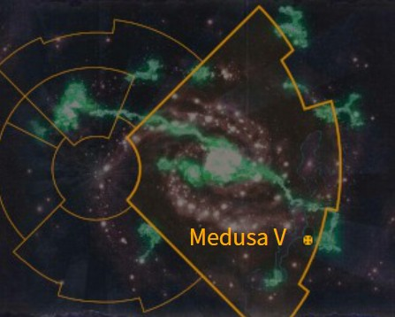
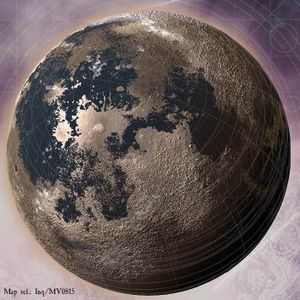

# 1043 美杜莎五号 Medusa V

精校状态：中文行文已逐段精校，部分术语仍为暂定

分类：地理 / 小行星 / 极限星域 Ultima Segmentum

原文来源：https://www.bilibili.com/opus/1171363346901893120

原作者：帝国神选罐头

原文时间：2026年02月20日 14:08

[返回分类目录](目录.md) · [全书目录](../../目录.md)

<!-- A1043-B0001 图片 -->

<!-- A1043-B0002 -->

原译文

Map 地图

**校订译文**

Map 地图

<!-- /A1043-B0002 -->

<!-- A1043-B0003 -->
### Basic Data 基本资料

原题：Basic Data 基础数据

<!-- /A1043-B0003 -->

<!-- A1043-B0004 -->
**英文原文**

Name:Medusa V

<!-- /A1043-B0004 -->

<!-- A1043-B0005 -->

原译文

名称：美杜莎五号

**校订译文**

名称：美杜莎五号

<!-- /A1043-B0005 -->

<!-- A1043-B0006 -->
**英文原文**

Segmentum:Ultima Segmentum

<!-- /A1043-B0006 -->

<!-- A1043-B0007 -->

原译文

星域：极限星域

**校订译文**

星域：极限星域

<!-- /A1043-B0007 -->

<!-- A1043-B0008 -->
**英文原文**

System:Medusa system

<!-- /A1043-B0008 -->

<!-- A1043-B0009 -->

原译文

星系：美杜莎星系

**校订译文**

星系：美杜莎星系

<!-- /A1043-B0009 -->

<!-- A1043-B0010 -->
**英文原文**

Population:Unknown, formerly 4,500,000,000

<!-- /A1043-B0010 -->

<!-- A1043-B0011 -->

原译文

人口：未知，前45,0000,0000

**校订译文**

人口：未知；原为45亿。

<!-- /A1043-B0011 -->

<!-- A1043-B0012 -->
**英文原文**

Class:destroyed, formerly Mining World/Industrial World and Hive World

<!-- /A1043-B0012 -->

<!-- A1043-B0013 -->

原译文

类别：被摧毁，前为矿业世界/工业世界和巢都世界

**校订译文**

类别：被摧毁，前为矿业世界/工业世界和巢都世界

**校注：** 数据栏原文直接写destroyed，而本文注释1却说没有明确证据确定结局；两处源文冲突，分别保留，不自行断定最终命运。

<!-- /A1043-B0013 -->

<!-- A1043-B0014 -->
**英文原文**

Tithe Grade:Aptus Non, formerly Exactis Tertius

<!-- /A1043-B0014 -->

<!-- A1043-B0015 -->

原译文

什一税等级：特级免税，前第一级初等

**校订译文**

什一税等级：特级免税，前第一级初等

<!-- /A1043-B0015 -->

<!-- A1043-B0016 图片 -->

<!-- A1043-B0017 -->

原译文

Planetary Image 行星图像

**校订译文**

Planetary Image 行星图像

<!-- /A1043-B0017 -->

<!-- A1043-B0018 -->
**英文原文**

Medusa V was an Imperial Mining World and Industrial World. It had orbital distance of 1.41AU, gravity of 1.12G and an average temperature of 9 degrees Celsius.

<!-- /A1043-B0018 -->

<!-- A1043-B0019 -->

原译文

美杜莎五号是帝国矿业世界和工业世界。它的轨道距离为1.41AU，重力为1.12G，平均温度为9摄氏度。

**校订译文**

美杜莎五号是帝国矿业世界和工业世界。它的轨道距离为1.41AU，重力为1.12G，平均温度为9摄氏度。

<!-- /A1043-B0019 -->

<!-- A1043-B0020 -->
## History 历史

<!-- /A1043-B0020 -->

<!-- A1043-B0021 -->
**英文原文**

The history of Medusa V is tightly linked with that of its sister planet, Medusa IV. The Medusa System may have gone unnoticed had it not been for the huge Warp Storm named "Van Grothe's Rapidity" located very close to the Medusa System. Medusa IV and V were colonised to provide both resources and a staging post for ships attempting to sling through the relatively stable warp storm, giving them vast improvement in travel times, although at a much higher risk of destruction. When the Explorator fleet arrived, a Clan Company of the Iron Hands came with them to provide tactical assistance in case they encountered any native indigenous life forms. The Medusa System was named in honour of the Iron Hands, a tribute to their own homeworld.

<!-- /A1043-B0021 -->

<!-- A1043-B0022 -->

原译文

美杜莎五号的历史与其姊妹行星美杜莎四号的历史紧密相连。如果不是因为距离美杜莎星系非常近的名为“范·格罗特之迅捷”的巨大亚空间风暴，美杜莎星系可能会被忽视。美杜莎四号和五号被殖民，为试图穿越相对稳定的亚空间风暴的舰船提供资源和中转站，大大缩短了航行时间，尽管毁灭的风险要高得多。当探索者舰队到达时，钢铁之手氏族连队与他们一起提供战术援助，以防他们遇到任何土著生命形式。美杜莎星系是为了向钢铁之手致敬而命名的，以此向他们的家园世界致敬

**校订译文**

美杜莎五号的历史与其姊妹行星美杜莎四号紧密相连。若非附近那场名为“范·格罗特之迅捷”的巨大亚空间风暴，这个星系也许根本不会引起注意。殖民者开发美杜莎四号和五号，是为了给尝试穿越这场相对稳定风暴的舰船提供资源和中转基地。借助这条捷径，航程可以大幅缩短，但毁灭的风险也高得多。探索舰队抵达时，一支钢铁之手氏族连随行，以便遭遇本土生命时提供战术支援。星系因此以钢铁之手的母星美杜莎命名，向战团致敬。

<!-- /A1043-B0022 -->

<!-- A1043-B0023 -->
**英文原文**

Medusa V was only settled in part, as the Iron Hands were called away before the planet could be totally investigated and the Explorator fleet deemed it not necessary to further investigate and colonise the planet. Even though the site had been specially chosen, the system was prone to serious warp storms from the "Rapidity," threatening to envelop the system and cut it off from the Imperium, sometimes for months or even decades. Every time the storms ended, however, and astropathic communication was re-established, the first signal to be received from them was that everything was fine on the worlds.

<!-- /A1043-B0023 -->

<!-- A1043-B0024 -->

原译文

美杜莎五号只是部分定居，因为钢铁之手在行星被完全调查之前就被召唤了，探索者舰队认为没有必要进一步调查和殖民这个行星。尽管该地点是专门选择的，但该星系很容易受到“迅捷”的严重亚空间风暴的影响，有可能包围该星系并将其与帝国隔绝，有时会持续数月甚至数十年。然而，每当风暴结束，星语通信重新建立时，从他们那里收到的第一个信号就是世界上一切都很好。

**校订译文**

美杜莎五号只得到部分开发：全面勘察完成前，钢铁之手就奉命离去，探索舰队也认为没有必要继续调查和殖民。尽管选址经过专门考虑，星系仍常受“迅捷”引发的剧烈亚空间风暴影响，有时被风暴包围，与帝国隔绝数月乃至数十年。不过，每当风暴平息、星语通信恢复，来自当地的第一条消息总是各世界一切安好。

<!-- /A1043-B0024 -->

<!-- A1043-B0025 -->
**英文原文**

Medusa V's wealth lay in the mining of iridium ore and drilling for promethium, supplying fleet ships in orbit for their long journeys throughout the Imperium. At this time of relative prosperity, there were only a few large cities on Medusa V, the center of production being on Medusa IV.

<!-- /A1043-B0025 -->

<!-- A1043-B0026 -->

原译文

美杜莎五号的财富在于开采铱矿和钻探钷，为舰队在整个帝国的长途旅行提供轨道上的补给。在这个相对繁荣的时期，美杜莎五号上只有少数几个大城市，生产中心在美杜莎四号。

**校订译文**

美杜莎五号依靠开采铱矿和钻取钷获得财富，为停泊轨道的舰船提供补给，支撑其穿行帝国的漫长旅程。在这段相对繁荣的时期，美杜莎五号仅有几座大城市，主要生产中心仍位于美杜莎四号。

<!-- /A1043-B0026 -->

<!-- A1043-B0027 -->
**英文原文**

Then came the Medusa Schism. The outcome of the schism was that Medusa IV was abandoned and destroyed by Exterminatus with one salvo of atmospheric incinerator torpedoes (under the watch of Inquisitor Baptiste), which made the oxygen in the atmosphere ignite and destroyed all life on the planet. It is said that the planet glowed for a whole month. Those citizens saved from Medusa IV were transported to Medusa V and screened for heretics by the Inquisition, and thousands were put to death, but that was nothing compared to the vast explosion in the population of Medusa V that the arrival created. Vast structures were erected by the Adeptus Mechanicus to hold millions of workers, kept separate to avoid the spread of any taint the Inquisition might have missed. These cities became known as "refugee cities" and they gradually found their place in society, providing innumerable labour to work the ore extraction mines. A few years later, the planet entered into a production golden age, producing more materials than was thought possible for the planet. It was at this time that it earned its high Aestimare value of A912.

<!-- /A1043-B0027 -->

<!-- A1043-B0028 -->

原译文

然后是美杜莎分裂。分裂的结果是，美杜莎四号被灭绝令遗弃，并在审判官巴蒂斯特的监视下，用一发大气焚烧鱼雷摧毁，这使大气中的氧气点燃并摧毁了行星上的所有生命。据说这颗行星发光整整一个月。那些从美杜莎四号中获救的公民被运送到美杜莎五号，并被审判庭筛查为异端，数千人被处死，但与美杜莎五号的到来造成的人口大爆炸相比，这算不了什么。机械神教建造了巨大的建筑来容纳数百万工人，保持分散，以避免审判庭可能错过的任何污点的传播。这些城市被称为“难民城市”，它们逐渐在社会中找到了自己的位置，为采矿业提供了无数劳动力。几年后，行星进入了一个生产的黄金时代，生产的材料比人们想象的要多。正是在这个时候，它获得了A912的高评估价值。

**校订译文**

此后爆发了美杜莎分裂事件。美杜莎四号遭到放弃，并在审判官巴蒂斯特监督下执行灭绝令：一轮大气焚烧鱼雷齐射点燃大气中的氧气，毁灭行星上的一切生命。据说，星球持续发光了整整一个月。撤出的居民被送往美杜莎五号，接受审判庭的异端筛查，数千人因此被处死；但与移民带来的庞大人口增长相比，这仍只是很小一部分。机械修会建造了巨大设施来容纳数百万工人，并将各处隔离，防止审查遗漏的污染传播。这些地方后来被称为“难民城市”，逐渐融入当地社会，为矿场提供无数劳动力。几年后，行星迎来生产黄金期，产出远超此前估计的潜力，也因此获得了A912的高评估等级。

**校注：** one salvo是一轮齐射，不是一发鱼雷；审查旨在寻找异端，并非所有移民均被“筛查为异端”。

<!-- /A1043-B0028 -->

<!-- A1043-B0029 -->
**英文原文**

Events, however, have a tendency to go badly when things go well for a period. 200 years after the Medusa Schism, the Rapidity began to "boil over" and is growing at an alarming rate. Some believe it to be growing because it is attempting to become a second Eye of Terror. The Ordo Malleus postulate some form of Chaos Sorcerer has worked his magic upon it, but in the end, they are all irrelevant. As it expands, it consumes every waystation and outpost it touches and it is believed that within either months or weeks, it will reach the Medusa System.

<!-- /A1043-B0029 -->

<!-- A1043-B0030 -->

原译文

然而，当事情在一段时间内进展顺利时，事件往往会变得很糟糕。美杜莎分裂200年后，迅捷开始“沸腾”，并以惊人的速度增长。一些人认为它正在增长，因为它正试图成为第二个恐惧之眼。圣锤修会假设某种形式的混沌巫师已经对其施展了魔法，但最终，它们都无关紧要。随着它的扩张，它会消耗它接触到的每一个中转站和前哨站，据信在几个月或几周内，它将到达美杜莎星系。

**校订译文**

好景不长。美杜莎分裂事件200年后，“迅捷”开始如沸水般翻涌，以惊人速度扩张。有人认为它正试图成为第二个恐惧之眼，恶魔审判庭则推测有混沌巫师对它施法。不过，原因已经不再重要：风暴不断吞噬沿途的中转站与前哨，预计只需数月、甚至数周便会抵达美杜莎星系。

<!-- /A1043-B0030 -->

<!-- A1043-B0031 -->
**英文原文**

Even while the authorities attempt to organise an escape and evacuation plan there is turmoil on the surface, mirroring that of the warp storm. Several of the "refugee cities" have openly revolted against the Imperium and the Planetary Governor Soloman hopes that it is simply a reaction to the dire threat they face, although news comes every day of the ever-increasing numbers of revolting areas. The Techpriests who operate the vast orbiting auspex arrays have detected three astronomical energy spikes, the first on Medusa VII and the second and third on Medusa V itself, one far to the south of the planet and the other near Macavius Hive, the second largest Hive on the planet. Rumour has it that the city is under siege from these aliens, although verification has thus far failed to reveal an answer.

<!-- /A1043-B0031 -->

<!-- A1043-B0032 -->

原译文

尽管当局试图组织逃生和疏散计划，但地表上仍有动荡，反映了亚空间风暴的情况。几个“难民城市”已经公开反抗帝国，行星总督索洛曼希望这只是对他们面临的可怕威胁的反应，尽管每天都有越来越多的叛乱地区的消息传来。操作巨大的轨道鸟卜仪阵列的技术神甫们探测到了三个天文能量尖峰，第一个在美杜莎七号上，第二个和第三个在美杜莎五号本身，一个在行星以南很远的地方，另一个在马卡维乌斯巢都附近，这是行星上第二大巢都。有传言称，这座城市正被这些异型围困，尽管到目前为止，核查尚未得出答案。

**校订译文**

当局着手安排逃生与撤离时，地表也像亚空间风暴一样陷入动乱。若干“难民城市”公开反叛帝国。行星总督索洛曼希望这只是居民面对大难时的过激反应，但每天都有更多地区起义的消息传来。负责大型轨道鸟卜仪阵列的技术祭司侦测到三次强度惊人的能量峰值：一次位于美杜莎七号，另两次在美杜莎五号，一处位于行星极南方，另一处靠近第二大巢都马卡维乌斯。传言该巢都正遭异形围攻，但尚未得到证实。

**校注：** astronomical在能量强度语境为极其巨大，不是另一个“天文能量”类别。其后these aliens所指在原文中缺少明确先行对象，译文保留“异形”而不擅自指定种族。

<!-- /A1043-B0032 -->

<!-- A1043-B0033 -->
**英文原文**

Three Imperial vessels, part of an Explorator fleet heading galactic eastwards, have been attacked within Medusa V's surveyor range, although when a number of frigates were dispatched to aid them, the ships were found empty of all life, all crew and passengers gone without trace. On the northern edge of the Medusa V continent, over a hundred farms have been destroyed in a spate of barbaric attacks. All the machinery has been looted, including the giant reaping machines. Every day more and more agricultural workers flee to the Hives and the threat of starvation is growing ever stronger. Deathwatch Space Marines have warned that a sizable chunk of the Hive Fleet Kraken has broken its course and has moved to intercept the Medusa system after a titanic engagement with an Imperial Navy space fleet at Lycanis. A Deathwatch Librarian, named Andreas, has postulated that the Rapidity may be acting as a beacon to the Hive Fleet, drawing it to the system. A full-scale invasion will soon begin, adding to the bedlam already reigning on Medusa V.

<!-- /A1043-B0033 -->

<!-- A1043-B0034 -->

原译文

三艘帝国战舰，作为向银河系东部前进的探索者舰队的一部分，在美杜莎五号的勘测范围内遭到袭击，尽管当一些护卫舰被派去援助他们时，这些舰船被发现没有任何生命，所有船员和乘客都消失得无影无踪。在美杜莎五号大陆的北部边缘，一百多个农场在一系列野蛮的袭击中被摧毁。所有的机器都被洗劫一空，包括巨大的收割机。每天都有越来越多的农业工人逃往巢都，饥饿的威胁越来越大。死亡守望星际战士警告称，在与帝国海军在莱卡尼斯的一支太空舰队进行了大规模交战后，虫巢舰队克拉肯的相当一部分已经偏离了航线，并开始截住美杜莎星系。一位名叫安德烈亚斯的死亡守望智库推测，迅捷可能是虫巢舰队的灯塔，将其吸引到星系中。一场全面的入侵即将开始，加剧了美杜莎五号已经陷入的混乱。

**校订译文**

三艘向银河东部航行的探索舰队船只，在美杜莎五号的探测范围内遇袭。几艘护卫舰赶去援救时，发现船内已没有任何生命，船员与乘客全部不知所踪。美杜莎五号大陆北缘又有一百多个农场接连遭到野蛮袭击，所有机械，包括巨型收割机，都被劫走。每天都有更多农业工人逃入巢都，饥荒威胁日益加剧。死亡守望警告说，克拉肯虫巢舰队在莱卡尼斯与帝国海军展开大战后，有相当一部分脱离原航线，转向美杜莎星系。死亡守望智库员安德烈亚斯推测，“迅捷”可能正在充当信标，将虫巢舰队吸引过来。全面入侵即将开始，令本已混乱的美杜莎五号雪上加霜。

<!-- /A1043-B0034 -->

<!-- A1043-B0035 -->
**英文原文**

Governor Soloman has turned to the Sector Command, who brought matters to the attention of the Inquisition. A cell of Inquisitors was immediately dispatched to Medusa V and they arrived some weeks later to find the main Hive city of the planet, Hive Euyrales, having already plunged into revolt and the Governor's own personal guard and the Adeptus Arbites fighting a desperate defence against the traitors. The Hive had openly pledged its allegiance to the Chaos Gods and rumours are abound that the Traitor Marines themselves have come to Medusa. The Inquisition made a wider call for assistance, managing to contact Ultramarines Captain Sicarius of the Second Company. Dozens of Space Marine chapters race to the system, having pledged their support, as well as an Imperial Guard crusade lead by Lord Marshal Graf Harazahn of the Vostroyan Firstborn. Every day the xenos grow bolder and push the defenders further back. The Imperium simply refuses to let the world fall to the hands of their enemies for even a single day's production is more than worth the sacrifice in manpower. Whatever happens, the Warp storm will destroy the planet.

<!-- /A1043-B0035 -->

<!-- A1043-B0036 -->

原译文

索洛曼总督已向星区指挥部求助，后者提请审判庭注意此事。一个审判官小组立即被派往美杜莎五号，几周后他们抵达，发现行星上主要的巢都城市，欧律阿勒斯巢都，已经陷入叛乱，总督自己的个人卫队和法务部正在拼命防御叛徒。巢都公开宣誓效忠混沌诸神，谣言四起，叛徒星际战士也来到了美杜莎。审判庭发出了更广泛的援助呼吁，设法联系了极限战士第二连队的西卡留斯连长。数十个星际战士战团承诺支援该星系，以及由沃斯托尼亚长子团领主元帅格拉夫·哈拉赞领导的帝国卫队远征军。每一天，异型都变得更加大胆，把守军推得更远。帝国只是拒绝让世界落入敌人之手，因为哪怕是一天的生产也值得牺牲人力。无论发生什么，亚空间风暴都会摧毁行星。

**校订译文**

索洛曼总督向星区指挥部求助，后者将事态上报审判庭。一组审判官立即出发，几周后抵达美杜莎五号，发现行星主要城市欧律阿勒斯巢都已经叛乱，总督亲卫与法务部正在拼死抵抗。巢都公开宣誓效忠混沌诸神，还有传闻称叛徒星际战士也已来到美杜莎。审判庭向更广泛的地区求援，并联系上极限战士第二连连长西卡留斯。数十个星际战士战团承诺支援，正赶往星系；沃斯特洛亚长子团的领主元帅格拉夫·哈拉赞也率领帝国卫队远征军前来。异形一天比一天猖獗，守军不断后退。帝国却决不肯让这个世界落入敌手，因为哪怕多维持一天的生产，也被认为值得付出兵员牺牲。然而，无论战局如何，亚空间风暴终将摧毁行星。

<!-- /A1043-B0036 -->

<!-- A1043-B0037 -->
## Notes 注释

<!-- /A1043-B0037 -->

<!-- A1043-B0038 -->
**英文原文**

Note 1. In The Fall of Medusa V (booklet) stated that 'The Warp storm will destroy the world, if the Emperor’s many enemies do not.' However, there is no clear evidence as to whether this world was destroyed or some other fate awaited it.

<!-- /A1043-B0038 -->

<!-- A1043-B0039 -->

原译文

注释1.在《美杜莎五号之陨》（册）中，他说：“即使帝皇的许多敌人不这样做，亚空间风暴也将摧毁世界。“然而，没有明确的证据表明这个世界是被毁灭了，还是有其他的命运在等待着它。

**校订译文**

注释1：《美杜莎五号陷落》小册子写道，即使帝皇的众多敌人不摧毁这个世界，亚空间风暴也会将其毁灭。不过，尚无明确证据说明该世界究竟已被摧毁，还是遭遇了其他命运。

**校注：** 这是所给底稿自带的来源辨析，不代表本次已核读该小册子。英文原有结局不确定性保留。

<!-- /A1043-B0039 -->

<!-- A1043-B0040 -->
**英文原文**

Note 2. Though nowhere directly stated about location of the system, in the Codex: Chaos Daemons (8th Edition) the Warp Storm Van Grothe's Rapidity is located in the Ultima Segmentum, so it may be extrapolated that Medusa V and Medusa system are also located in this segmentum.

<!-- /A1043-B0040 -->

<!-- A1043-B0041 -->

原译文

注释2.虽然没有直接说明该星系的位置，但在《圣典:混沌恶魔》（第8版）中，亚空间风暴范·格罗特之迅捷位于极限星域，因此可以推断美杜莎五号和美杜莎星系也位于这个星域。

**校订译文**

注释2：虽然没有资料直接说明美杜莎星系的位置，但《圣典：混沌恶魔》第8版将范·格罗特之迅捷列在极限星域，因此可以推断美杜莎五号及其所在星系也位于这一星域。

<!-- /A1043-B0041 -->

本篇核心术语与暂定项

以下列出本篇出现的英文原形及核心术语表用词。同形词可能指不同对象，具体词义以本篇正文和校注为准；单复数、别名和仅见于图注的名称可能尚未列入。完整候选见[术语表](../../术语表/双语术语候选.csv)。

| 英文 | 采用中文 | 状态 |
| --- | --- | --- |
| Space Marines | 星际战士 | 官方已核对 |
| Deathwatch | 死亡守望 | 官方已核对 |
| Adeptus Mechanicus | 机械修会 | 官方已核对 |
| Imperial Guard | 帝国卫队 | 暂定·语境区分 |
| Chaos Daemons | 混沌恶魔 | 官方已核对 |
| Librarian | 智库员 | 官方已核对 |
| Ultramarines | 极限战士 | 官方已核对 |
| Warp | 亚空间 | 官方已核对 |
| Inquisition | 审判庭 | 暂定 |
| Inquisitor | 审判官 | 官方已核对 |
| Imperium | 帝国 | 暂定·简称 |
| Imperial Navy | 帝国海军 | 暂定 |
| Sorcerer | 巫师 | 官方已核对 |
| History | 历史 | 编辑用语已统一 |
| Eye of Terror | 恐惧之眼 | 官方已核对 |
| Ordo Malleus | 恶魔审判庭 | 用户指定 |
| Emperor | 帝皇 | 官方已核对 |
| Adeptus Arbites | 法务部 | 暂定 |
| Hive World | 巢都世界 | 暂定·官方待核 |
| Iron Hands | 钢铁之手 | 暂定·官方待核 |
| Ultima Segmentum | 极限星域 | 暂定·官方待核 |
| Segmentum | 星域 | 暂定·官方待核 |
| Sector | 星区 | 暂定·官方待核 |
| Medusa V | 美杜莎五号 | 暂定·官方待核 |
| Medusa | 美杜莎 | 暂定·官方待核 |
| Aestimare | 战略价值评级 | 暂定·官方待核 |
| Aptus Non | 特级免税 | 暂定·官方待核 |
| Clear | 清明 | 暂定·官方待核 |
| Lord Marshal | 领主元帅 | 暂定·官方待核 |
| Space Marine | 星际战士 | 暂定·官方待核 |
| Captain | 连长 | 暂定·官方待核 |
| Firstborn | 长子 | 暂定·官方待核 |
| Vostroyan Firstborn | 沃斯特洛亚长子团 | 暂定·官方待核 |
| Xenos | 异形 | 暂定·官方待核 |
| Marshal | 元帅 | 官方已核对 |
| Fall of Medusa V | 美杜莎五号陷落 | 暂定·官方待核 |
| Deathwatch Librarian | 死亡守望智库员 | 暂定·官方待核 |
| Andreas | 安德烈亚斯 | 暂定·官方待核 |
| Incinerator | 焚化枪 | 暂定·官方待核 |
| Warp Storm | 亚空间风暴 | 暂定·官方待核 |
| System | 星系（恒星系统） | 暂定·官方待核 |
| Hive City | 巢都城市 | 暂定·官方待核 |
| Exactis Tertius | 第一级初等 | 暂定·官方待核 |
| Industrial World | 工业世界 | 暂定·官方待核 |
| Mining World | 矿业世界 | 暂定·官方待核 |
| Promethium | 钷素 | 暂定·官方待核 |
| Van Grothe's Rapidity | 范·格罗特之迅捷 | 暂定·官方待核 |
| Graf Harazahn | 格拉夫·哈拉赞 | 暂定·官方待核 |
| Hive Euyrales | 欧律阿勒斯巢都 | 暂定·官方待核 |
| Macavius Hive | 马卡维乌斯巢都 | 暂定·官方待核 |
| Auspex | 鸟卜仪 | 暂定·官方待核 |
| Surveyor | 勘测仪 | 暂定·官方待核 |
| Kraken | 克拉肯 | 暂定·官方待核 |
| Medusa IV | 美杜莎四号 | 暂定·官方待核 |
| Iridium | 铱星 | 暂定·官方待核 |

