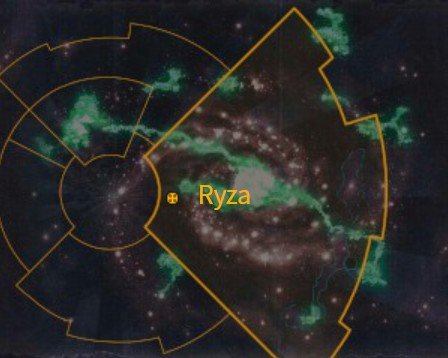
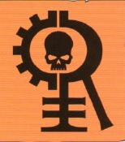
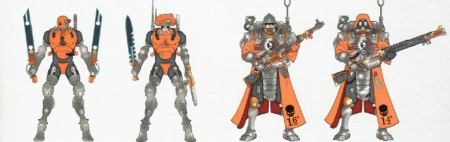
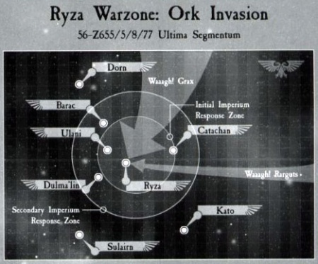
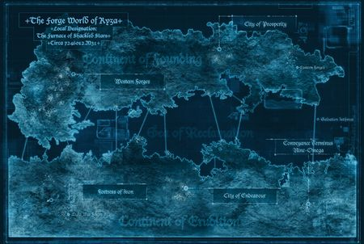
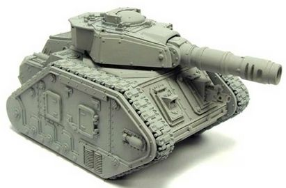
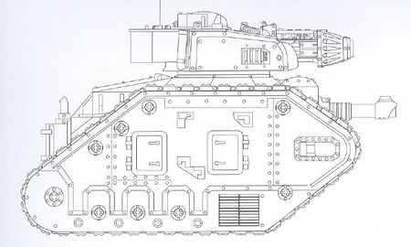
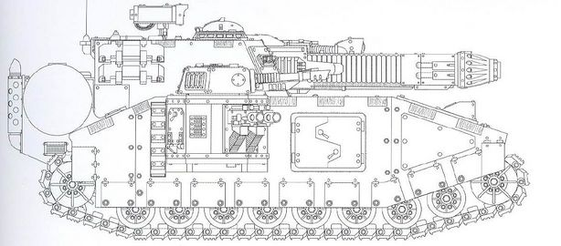
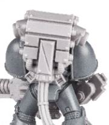

# 1044 瑞扎 Ryza

精校状态：中文行文已逐段精校，部分术语仍为暂定

分类：地理 / 小行星 / 极限星域 Ultima Segmentum

原文来源：https://www.bilibili.com/opus/1158764395339186182

原作者：帝国神选罐头

原文时间：2026年01月17日 15:17

[返回分类目录](目录.md) · [全书目录](../../目录.md)

<!-- A1044-B0001 图片 -->

<!-- A1044-B0002 -->

原译文

Map 地图

**校订译文**

Map 地图

<!-- /A1044-B0002 -->

<!-- A1044-B0003 -->
### Basic Data 基本资料

原题：Basic Data 基础数据

<!-- /A1044-B0003 -->

<!-- A1044-B0004 -->
**英文原文**

Name:Ryza

<!-- /A1044-B0004 -->

<!-- A1044-B0005 -->

原译文

名称：瑞扎

**校订译文**

名称：瑞扎

<!-- /A1044-B0005 -->

<!-- A1044-B0006 -->
**英文原文**

Segmentum:Ultima Segmentum

<!-- /A1044-B0006 -->

<!-- A1044-B0007 -->

原译文

星域：极限星域

**校订译文**

星域：极限星域

<!-- /A1044-B0007 -->

<!-- A1044-B0008 -->
**英文原文**

Subsector:Aurus Subsector

<!-- /A1044-B0008 -->

<!-- A1044-B0009 -->

原译文

分区：奥鲁斯分区

**校订译文**

次星区：奥鲁斯次星区

<!-- /A1044-B0009 -->

<!-- A1044-B0010 -->
**英文原文**

System:Ryza System

<!-- /A1044-B0010 -->

<!-- A1044-B0011 -->

原译文

星系：瑞扎星系

**校订译文**

星系：瑞扎星系

<!-- /A1044-B0011 -->

<!-- A1044-B0012 -->
**英文原文**

Affiliation:Imperium

<!-- /A1044-B0012 -->

<!-- A1044-B0013 -->

原译文

隶属：帝国

**校订译文**

隶属：帝国

<!-- /A1044-B0013 -->

<!-- A1044-B0014 -->
**英文原文**

Class:War World, Forge World

<!-- /A1044-B0014 -->

<!-- A1044-B0015 -->

原译文

类别：战争世界，铸造世界

**校订译文**

类别：战争世界，铸造世界

<!-- /A1044-B0015 -->

<!-- A1044-B0016 -->
**英文原文**

Production Grade:I-Prima

<!-- /A1044-B0016 -->

<!-- A1044-B0017 -->

原译文

生产等级：一级 - 上等

**校订译文**

生产等级：一级 - 上等

<!-- /A1044-B0017 -->

<!-- A1044-B0018 -->
**英文原文**

Tithe Grade:Aptus Non

<!-- /A1044-B0018 -->

<!-- A1044-B0019 -->

原译文

什一税等级：特级免税

**校订译文**

什一税等级：特级免税

<!-- /A1044-B0019 -->

<!-- A1044-B0020 -->
**英文原文**

Ryza is a Forge World of the Imperium.

<!-- /A1044-B0020 -->

<!-- A1044-B0021 -->

原译文

瑞扎是帝国的一个铸造世界。

**校订译文**

瑞扎是帝国的一个铸造世界。

<!-- /A1044-B0021 -->

<!-- A1044-B0022 -->
## Overview 概述

<!-- /A1044-B0022 -->

<!-- A1044-B0023 -->
**英文原文**

Ryza is a dusty planet known for its many dunes, acidic rivers, and low-orbital industrial platforms. Due to past and present invasions, many Ork remnants dwell on Ryza's surface and have established techno-barbarian realms that scavenge for machinery. For all of this Ryza remains unbowed, and their Priesthood is known to take great delight in unleashing ancient arcane machinery upon their foes. They treat each new engagement as an opportunity to test data and weapons. Its many testing grounds for the planets famed arcane weaponry has transformed its surface into a blasted landscape.

<!-- /A1044-B0023 -->

<!-- A1044-B0024 -->

原译文

瑞扎是一颗尘土飞扬的行星，以其众多沙丘、酸性河流和低轨道工业平台而闻名。由于过去和现在的入侵，许多欧克的残余栖身在瑞扎的表面，并建立了机器拾荒的技术野蛮王国。尽管如此，瑞扎仍然不屈不挠，他们的祭司非常喜欢向敌人释放古老的神秘机器。他们将每次新的接触视为测试数据和武器的机会。行星的许多测试著名的神秘武器的试验场已经将其表面变成了一片废墟。

**校订译文**

瑞扎是一颗尘土飞扬的行星，遍布沙丘、酸性河流和低轨道工业平台。历次入侵留下的大量欧克残部仍栖居地表，建立起靠搜掠机械维生的技术蛮族领地。即便如此，瑞扎始终不曾屈服。当地祭司尤其乐于向敌人释放古老而奥秘的机械，将每一次交战都视为检验数据与武器的机会。瑞扎那些闻名遐迩的神秘兵器拥有众多试验场，多年的试射已将地表变成遍布爆炸痕迹的荒原。

<!-- /A1044-B0024 -->

<!-- A1044-B0025 图片 -->

<!-- A1044-B0026 -->

原译文

Ryza's symbol 瑞扎标志

**校订译文**

Ryza's symbol 瑞扎标志

<!-- /A1044-B0026 -->

<!-- A1044-B0027 -->
**英文原文**

Ryza is a formidable world, known for its plasma weapons and laser weapons and vehicles mounted with them, such as the feared Leman Russ Executioner (which is no longer produced by any other Forge World) and the Stormblade Super Heavy Tank (which was first developed on Ryza). The Forge World is home to the Titan Legion known as the Legio Crucius (a.k.a. the Warmongers).

<!-- /A1044-B0027 -->

<!-- A1044-B0028 -->

原译文

瑞扎是一个强大的世界，以其等离子武器和激光武器以及搭载它们的载具而闻名，例如令人恐惧的黎曼鲁斯刽子手（不再由任何其他铸造世界生产）和风暴刃超重型坦克（最初在瑞扎上开发）。铸造世界是泰坦军团的所在地，该军团被称为克鲁修斯军团（又名好战者）。

**校订译文**

瑞扎实力雄厚，以等离子武器、激光武器及搭载这些武器的载具著称。其中包括令人畏惧的黎曼鲁斯处决者——其他铸造世界都已停止生产这一型号——以及最初在瑞扎研制的风暴刃超重型坦克。这里也是十字军团，又称“好战者”的泰坦军团驻地。

**校注：** Leman Russ Executioner按主审已核官译黎曼鲁斯处决者。Legio Crucius为十字军团，Warmongers才是其别称好战者。

<!-- /A1044-B0028 -->

<!-- A1044-B0029 -->
**英文原文**

Ryza's approach is defended by an artificial moon known as Ryza Secundus. It is large enough to hold an entire Expeditionary Fleet of the Great Crusade. Today, the artificial celestial body is inscribed with the names of 12 House Vornherr Knights which fought to the end to defend it during the Defence of Ryza in the Horus Heresy.

<!-- /A1044-B0029 -->

<!-- A1044-B0030 -->

原译文

瑞扎的通路得到了名为瑞扎二号的人造卫星的保护。它足够容纳整个大远征的远征舰队。今天，这个人造天体上刻着12位沃恩赫尔家族骑士的名字，他们在荷鲁斯叛乱的瑞扎保卫战中为防御它而战斗到底。

**校订译文**

瑞扎的接近航道由一颗名为瑞扎二号的人造卫星守卫。它的规模足以容纳大远征时期一整支远征舰队。如今，这个人造天体上刻着十二名沃恩赫尔家族骑士的姓名，纪念他们在荷鲁斯之乱期间的瑞扎保卫战中为守护它战至最后。

<!-- /A1044-B0030 -->

<!-- A1044-B0031 图片 -->

<!-- A1044-B0032 -->

原译文

Ryza Secundus 瑞扎二号

**校订译文**

Ryza Secundus 瑞扎二号

<!-- /A1044-B0032 -->

<!-- A1044-B0033 -->
## History 历史

<!-- /A1044-B0033 -->

<!-- A1044-B0034 -->
### Early History 早期历史

<!-- /A1044-B0034 -->

<!-- A1044-B0035 -->
**英文原文**

Ryza was settled during the Dark Age of Technology and became the center of a great technological empire. During the Age of Strife Ryza was isolated from other Forge Worlds and its colonists survived within the city of Prosperity. During these desperate times the people clung to faith. Thus the Omnissiah Igvita (or "Life Blood of the Omnissiah") was founded on Ryza and dedicated itself to the study of all plasma technology.

<!-- /A1044-B0035 -->

<!-- A1044-B0036 -->

原译文

瑞扎在黑暗技术时代被定居，并成为一个伟大的技术帝国的中心。在纷争时代，瑞扎与其他铸造世界隔绝，其殖民者在繁荣之城幸存下来。在这些绝望的时刻，人们坚持信仰。因此，欧姆尼赛亚活力（或“欧姆尼赛亚的生命之血”）成立于瑞扎，致力于研究所有等离子技术。

**校订译文**

人类在科技黑暗时代定居瑞扎，这里后来成为一个强大技术帝国的中心。纷争时代，瑞扎与其他铸造世界隔绝，殖民者依靠繁荣城生存下来。在绝望岁月中，人们紧守信仰，于是形成了名为“欧姆尼赛亚活力”，又称“欧姆尼赛亚的生命之血”的组织，致力于研究一切等离子技术。

**校注：** Omnissiah Igvita沿原稿欧姆尼赛亚活力并保留英语词条，原文将其描写为成立于瑞扎、专研等离子技术的信仰组织；完整官方中文待核。

<!-- /A1044-B0036 -->

<!-- A1044-B0037 -->
### Contact with the Imperium 与帝国的接触

<!-- /A1044-B0037 -->

<!-- A1044-B0038 -->
**英文原文**

When the Imperium arrived during the Great Crusade, Ryza peacefully assimilated into the domain of the Emperor. By the end of the Great Crusade, Ryza stood second only to Mars in power and prestige among the Martian Mechanicum. Its production capability, specialty in plasma manufacturing, and strategic location allowed it to be one of the central points for the Imperial expansion into the eastern Galaxy. Its power and hoarding of advanced plasma technology created some tensions and suspicious with Mars, leading to the world strengthening its forces in preparation for conflict. This proved to be fortuitous, as during the Horus Heresy Ryza became known as a loyalist bastion in the East, leading to it being assaulted by the Dark Mechanicus. In the battle that followed the loyalists prevailed, though over 4/5ths of the planet's infrastructure was destroyed.

<!-- /A1044-B0038 -->

<!-- A1044-B0039 -->

原译文

当帝国在大远征期间抵达时，瑞扎和平地融入了帝皇的领地。到大远征结束时，瑞扎在火星机械教中的权力和声望仅次于火星。它的生产能力、等离子制造的专业性和战略位置使其成为帝国向银河东部扩张的中心点之一。它的力量和对先进等离子技术的囤积造成了一些紧张局势和对火星的怀疑，导致世界加强了为冲突做准备的部队。这被证明是偶然的，因为在荷鲁斯叛乱时期，瑞扎被称为东方的忠诚堡垒，导致它遭到黑暗机械教的袭击。在随后的战斗中，忠诚派获胜，尽管行星上超过4/5的基础设施被摧毁。

**校订译文**

大远征期间，瑞扎和平加入帝皇的疆域。到大远征末期，它在机械教中的实力与声望已仅次于火星。生产能力、等离子制造专长及战略位置，使它成为帝国向银河东部扩张的重要支点。不过，其强大实力和对先进等离子技术的秘藏，也令它与火星之间产生紧张和猜疑。瑞扎因此扩充军力，准备应对冲突。这些准备后来证明十分幸运：荷鲁斯之乱中，作为东方忠诚派堡垒的瑞扎遭到黑暗机械教攻击。忠诚派最终获胜，但行星超过五分之四的基础设施被毁。

<!-- /A1044-B0039 -->

<!-- A1044-B0040 图片 -->

<!-- A1044-B0041 -->

原译文

Ryza Skitarii 瑞扎护教军

**校订译文**

Ryza Skitarii 瑞扎护教军

<!-- /A1044-B0041 -->

<!-- A1044-B0042 -->
### Recent History 近期历史

<!-- /A1044-B0042 -->

<!-- A1044-B0043 -->
**英文原文**

Ryza has been attacked by not one but two Ork Waaagh!s — Waaagh! Grax and Waaagh! Rarguts. During the 13th Black Crusade though, Waaagh! Grax was finally defeated, but disaster struck the Forge World in the aftermath of the Great Rift's creation and Ryza soon found itself invaded by hordes of Daemons. Now only the presence of the numerous Astra Militarum Regiments (including Catachan Jungle Fighters) that were originally sent to deal with the Ork Waaaghs! have prevented the Forge World from falling to the forces of Chaos.

<!-- /A1044-B0043 -->

<!-- A1044-B0044 -->

原译文

瑞扎遭到了两个而不是一个欧克Waaagh!的攻击格拉克斯的Waaagh!和拉古特的Waaagh!。在第13次黑色远征期间，格拉克斯的Waaagh!最终被击败，但在大裂隙形成后，灾难袭击了铸造世界，瑞扎很快发现自己被成群的恶魔入侵了。现在只有最初被派去对付欧克Waaagh!的众多星界军兵团（包括卡塔昌丛林战士）的存在阻止了铸造世界落入混沌部队之手。

**校订译文**

瑞扎先后遭到两支欧克Waaagh!的进攻：格拉克斯的Waaagh!与拉古特的Waaagh!。第十三次黑色远征期间，格拉克斯的势力终于被击败；然而，大裂隙形成后，这个铸造世界又遭大批恶魔入侵。如今，原本派来迎战欧克的众多星界军兵团，包括卡塔昌丛林斗士，仍在坚守；正是他们的存在，才使瑞扎没有落入混沌之手。

<!-- /A1044-B0044 -->

<!-- A1044-B0045 图片 -->

<!-- A1044-B0046 -->

原译文

Ork invasion of Ryza 瑞扎的欧克入侵

**校订译文**

Ork invasion of Ryza 瑞扎的欧克入侵

<!-- /A1044-B0046 -->

<!-- A1044-B0047 -->
## Geography 地理

<!-- /A1044-B0047 -->

<!-- A1044-B0048 -->
### Notable Locations 著名地点

<!-- /A1044-B0048 -->

<!-- A1044-B0049 图片 -->

<!-- A1044-B0050 -->

原译文

Map of Ryza during the Horus Heresy 荷鲁斯叛乱期间的瑞扎地图

**校订译文**

Map of Ryza during the Horus Heresy 荷鲁斯之乱期间的瑞扎地图

<!-- /A1044-B0050 -->

<!-- A1044-B0051 -->
**英文原文**

Ryza Secundus - Massive artificial station above the planet, more akin to a moon than a space station. Constructed over a number of centuries, it bristles with weaponry and repair stations. It is large enough to house an entire Expeditionary Fleet of the Great Crusade.

<!-- /A1044-B0051 -->

<!-- A1044-B0052 -->

原译文

瑞扎二号 - 位于行星上方的大型人造空间站，更类似于卫星而非空间站。它建造了几个世纪，布满了武器和维修站。它足够容纳大远征的整个远征舰队。

**校订译文**

瑞扎二号——行星上空的巨型人造空间站，规模更接近一颗卫星。它历经数百年建成，遍布武器与维修设施，足以容纳大远征时期一整支远征舰队。

**校注：** an entire Expeditionary Fleet 指一支完整的远征舰队，不是大远征的全部舰隊。

<!-- /A1044-B0052 -->

<!-- A1044-B0053 -->
**英文原文**

Continent of Founding - The first of Ryza's continents settled. By the time of the Imperium it was the less populated of the two for much of its resources had been plundered after colonization.

<!-- /A1044-B0053 -->

<!-- A1044-B0054 -->

原译文

创始大陆 - 瑞扎的第一个大陆定居。到帝国时期，它是两个中人口较少的，因为它的大部分资源在殖民后被掠夺。

**校订译文**

创始大陆——瑞扎最早有人定居的大陆。殖民以来的大量资源开采使其资源消耗严重，到帝国时期，这里成为两块大陆中人口较少的一块。

<!-- /A1044-B0054 -->

<!-- A1044-B0055 -->
**英文原文**

Prosperity - The oldest settlement of Ryza and among the strongest and most important centers. It houses mass processing centers which assess the quality of Ryza's products, discarding all found wanting. Vast mag trains flow from the city and to various manufactorums.

<!-- /A1044-B0055 -->

<!-- A1044-B0056 -->

原译文

繁荣 - 瑞扎最古老的定居点，也是最强大、最重要的中心之一。它设有大规模加工中心，评估瑞扎产品的质量，丢弃所有发现的不足。巨大的火车从城市开往各个制造厂。

**校订译文**

繁荣城——瑞扎最古老的聚居点，也是实力最强、地位最重要的中心之一。这里设有大规模处理中心，检验瑞扎产品的质量，淘汰所有不合格品。庞大的磁力列车从城中驶出，通往各个制造厂。

<!-- /A1044-B0056 -->

<!-- A1044-B0057 -->
**英文原文**

Western Forges - dedicated solely to constructing war machines including the famed Stormblade.

<!-- /A1044-B0057 -->

<!-- A1044-B0058 -->

原译文

西部铸造厂 - 专门用于建造战争机器，包括著名的风暴刃。

**校订译文**

西部铸造厂 - 专门用于建造战争机器，包括著名的风暴刃。

<!-- /A1044-B0058 -->

<!-- A1044-B0059 -->
**英文原文**

Salvation Isthmus - The passageway between Ryza's two continents, dotted with manufactorums and highways from which Reclamation Teams scour Ryza's seabed in search of anything of value.

<!-- /A1044-B0059 -->

<!-- A1044-B0060 -->

原译文

救赎地峡 - 瑞扎两大洲之间的通道，点缀着铸造厂和高速公路，开垦团队从这里搜索瑞扎的海底，寻找任何有价值的东西。

**校订译文**

救赎地峡——连接瑞扎两块大陆的通道，分布着制造厂和公路。回收队伍从这里出发，搜索海床上任何有价值的东西。

<!-- /A1044-B0060 -->

<!-- A1044-B0061 -->
**英文原文**

Conveyance Terminus Nine-Omega - Primary Spaceport.

<!-- /A1044-B0061 -->

<!-- A1044-B0062 -->

原译文

运输终点站九-欧米茄 - 主要太空港。

**校订译文**

运输终点站九-欧米茄 - 主要太空港。

<!-- /A1044-B0062 -->

<!-- A1044-B0063 -->
**英文原文**

Continent of Erudition - The more newly settled continent with less plundered resources. Here the Hierophant Technis of Ryza houses their Forge.

<!-- /A1044-B0063 -->

<!-- A1044-B0064 -->

原译文

博学大陆 - 新定居的大陆，资源掠夺较少。瑞扎的祭司技师在这里建造了他们的铸造厂。

**校订译文**

博学大陆——较晚开发的大陆，资源消耗程度较低。瑞扎的技术圣职者将其铸造设施设在这里。

**校注：** Hierophant Technis 为机械教职衔，暂作技术圣职者；与泰伦生物泰坦Hierophant圣师兽无关。

<!-- /A1044-B0064 -->

<!-- A1044-B0065 -->
**英文原文**

Fortress of Iron - Towering hollow mountain that serves as the bastion of the Legio Crucius.

<!-- /A1044-B0065 -->

<!-- A1044-B0066 -->

原译文

铁堡 - 高耸的空心山，是克鲁修斯军团的堡垒。

**校订译文**

铁堡——一座内部中空的高山，是十字军团的堡垒。

<!-- /A1044-B0066 -->

<!-- A1044-B0067 -->
**英文原文**

Endeavour - Forge-City larger than that of Prosperity. Endeavour serves as a repository of knowledge, for beneath the city lay archival catacombs containing the worlds knowledge. Deeper still are the war vaults of Ryza which are sealed on the order of the Emperor. Known to only a few, it was here that House Sidus makes their home.

<!-- /A1044-B0067 -->

<!-- A1044-B0068 -->

原译文

奋进 - 比繁荣更大的铸造城市。奋进是一个知识仓库，因为在城市的地下埋藏着包含世界知识的档案地窟。更深的是根据帝皇的命令密封的瑞扎战争密库。只有少数人知道，星辰家族就是在这里安家的。

**校订译文**

奋进城——规模超过繁荣城的铸造城市，也是知识宝库。地下档案墓窟中保存着瑞扎的知识，更深处则是奉帝皇之命封闭的战争密库。鲜有人知，星辰家族的驻地也设在这里。

<!-- /A1044-B0068 -->

<!-- A1044-B0069 -->
**英文原文**

Sea of Reclamation'- Ryza's primary ocean. Though once home to sea life it is now mainly sewage and industrial run-off. It serves primarily as a reservoir, heated by vast hydrothermal vents situated on the sea floor. Its pollute oceans are scoured by the Mechanicum who search for anything of value. Some on the planet see the sea as a direct link to the Omnissiah due to its innumerable chemical reactions. Ryza claims that numerous innovations have been made from the findings Tech-Priests have observed in the Sea of Reclamation including the technology to build the Stormblade.

<!-- /A1044-B0069 -->

<!-- A1044-B0070 -->

原译文

“开垦之海” - 瑞扎的主要海洋。虽然曾经是海洋生物的家园，但现在主要是污水和工业径流。它主要是一个水库，由海底巨大的热液喷口加热。它污染的海洋被机械教搜索，他们寻找任何有价值的东西。由于其无数的化学反应，行星上的一些人将海洋视为与欧姆尼赛亚的直接联系。瑞扎声称，技术神甫在开垦之海中观察到的发现已经带来了许多创新，包括制造风暴刃的技术。

**校订译文**

回收之海——瑞扎的主要海洋。这里曾有海洋生命，如今却主要充斥污水与工业排放。它的主要用途是蓄水，海底巨大的热液喷口不断为其加热。机械教人员在污染海域中搜寻一切有价值的东西。由于海中发生着无数化学反应，一些居民将其视为与欧姆尼赛亚直接相连之地。瑞扎声称，技术祭司对回收之海的观察带来了许多创新，制造风暴刃的技术便是其中之一。

**校注：** Reclamation结合打捞海床、回收工业废料语境译回收，不作土地开垦；对应队伍同译回收队。此段英文使用Mechanicum，保留机械教，不强行换成机械修会。

<!-- /A1044-B0070 -->

<!-- A1044-B0071 -->
## Known Patterns 已知型号

<!-- /A1044-B0071 -->

<!-- A1044-B0072 图片 -->

<!-- A1044-B0073 -->

原译文

Ryza Pattern Leman Russ Battle Tank 瑞扎型黎曼鲁斯战斗坦克

**校订译文**

Ryza Pattern Leman Russ Battle Tank 瑞扎型黎曼鲁斯战斗坦克

<!-- /A1044-B0073 -->

<!-- A1044-B0074 图片 -->

<!-- A1044-B0075 -->

原译文

Ryza Pattern Leman Russ Executioner 瑞扎型黎曼鲁斯刽子手

**校订译文**

Ryza Pattern Leman Russ Executioner 瑞扎型黎曼鲁斯处决者

<!-- /A1044-B0075 -->

<!-- A1044-B0076 图片 -->

<!-- A1044-B0077 -->

原译文

Ryza Pattern Stormblade 瑞扎型风暴刃

**校订译文**

Ryza Pattern Stormblade 瑞扎型风暴刃

<!-- /A1044-B0077 -->

<!-- A1044-B0078 图片 -->

<!-- A1044-B0079 -->

原译文

Space Marine with Ryza-pattern Lascannon 星际战士配备瑞扎型激光炮

**校订译文**

Space Marine with Ryza-pattern Lascannon 星际战士配备瑞扎型激光炮

<!-- /A1044-B0079 -->

<!-- A1044-B0080 图片 -->

<!-- A1044-B0081 -->

原译文

Ryza-pattern backpack for space marine with Lascannon 配备激光炮的星际战士的瑞扎型背包

**校订译文**

Ryza-pattern backpack for space marine with Lascannon 配备激光炮的星际战士的瑞扎型背包

<!-- /A1044-B0081 -->

<!-- A1044-B0082 -->
## Conflicting sources 来源冲突

<!-- /A1044-B0082 -->

<!-- A1044-B0083 -->
**英文原文**

Imperial Armour Volume One gives Ryza's galactic position as being in the Segmentum Solar. Other material, however, states that the planet is in the Ultima Segmentum.

<!-- /A1044-B0083 -->

<!-- A1044-B0084 -->

原译文

《帝国装甲第一册》给出了瑞扎在太阳星域中的银河系位置。然而，其他材料表明，这颗行星位于极限星域。

**校订译文**

《帝国装甲第一册》给出了瑞扎在太阳星域中的银河系位置。然而，其他材料表明，这颗行星位于极限星域。

<!-- /A1044-B0084 -->

本篇核心术语与暂定项

以下列出本篇出现的英文原形及核心术语表用词。同形词可能指不同对象，具体词义以本篇正文和校注为准；单复数、别名和仅见于图注的名称可能尚未列入。完整候选见[术语表](../../术语表/双语术语候选.csv)。

| 英文 | 采用中文 | 状态 |
| --- | --- | --- |
| Astra Militarum | 星界军 | 官方已核对 |
| Horus Heresy | 荷鲁斯之乱 | 官方已核对 |
| Great Rift | 大裂隙 | 官方已核对 |
| Imperium | 帝国 | 暂定·简称 |
| Mechanicum | 机械教 | 暂定·历史称谓 |
| Dark Age of Technology | 黑暗科技时代 | 暂定 |
| Waaagh! | Waaagh! | 暂定·保留原文 |
| Emperor | 帝皇 | 官方已核对 |
| Forge World | 铸造世界 | 暂定·官方待核 |
| The Order | 秩序 | 暂定·官方待核 |
| Great Crusade | 大远征 | 暂定·官方待核 |
| Age of Strife | 纷争时代 | 暂定·官方待核 |
| Horus | 荷鲁斯 | 暂定·官方待核 |
| Segmentum Solar | 太阳星域 | 暂定·官方待核 |
| Ultima Segmentum | 极限星域 | 暂定·官方待核 |
| Segmentum | 星域 | 暂定·官方待核 |
| Subsector | 次星区 | 暂定·官方待核 |
| Omnissiah | 欧姆尼赛亚 | 暂定·官方待核 |
| Deeper | 深人 | 暂定·官方待核 |
| Mars | 火星 | 暂定·官方待核 |
| Ryza | 瑞扎 | 暂定·官方待核 |
| Catachan | 卡塔昌 | 暂定·官方待核 |
| Titan | 泰坦 | 暂定·官方待核 |
| Tech | 技术语 | 暂定·官方待核 |
| Aptus Non | 特级免税 | 暂定·官方待核 |
| Ancient | 旗手 | 官方已核对 |
| Founding | 建军 | 暂定·官方待核 |
| Remnants | 残骸 | 暂定·官方待核 |
| Warmongers | 好战者 | 暂定·官方待核 |
| Catachan Jungle Fighters | 卡塔昌丛林斗士 | 官方已核对 |
| Dark Mechanicus | 黑暗机械教 | 暂定·官方待核 |
| Hierophant | 圣师兽（泰伦单位）／圣职者（职衔） | 语境定译·泰伦单位官译已核 |
| Terminus | 终点站 | 暂定·官方待核 |
| Hollow Mountain | 空心山脉 | 暂定·官方待核 |
| Dwell | 德威尔 | 暂定·官方待核 |
| Leman Russ Executioner | 黎曼鲁斯处决者 | 官方已核·中英对照 |
| The Dark | 《黑暗》 | 暂定·官方待核 |
| System | 星系（恒星系统） | 暂定·官方待核 |
| War World | 战争世界 | 暂定·官方待核 |
| Techno-Barbarian | 科技蛮人 | 暂定·官方待核 |
| Legio Crucius | 十字军团 | 暂定·官方待核 |
| Laser Weapons | 激光武器 | 暂定·官方待核 |
| Plasma Weapons | 等离子武器 | 暂定·官方待核 |
| Aurus Subsector | 奥鲁斯次星区 | 暂定·官方待核 |
| Omnissiah Igvita | 欧姆尼赛亚活力 | 暂定·官方待核 |
| Hierophant Technis | 技术圣职者 | 暂定·官方待核 |
| Sea of Reclamation | 回收之海 | 暂定·官方待核 |
| Ryza Secundus | 瑞扎二号 | 暂定·官方待核 |
| Continent of Founding | 创始大陆 | 暂定·官方待核 |
| Western Forges | 西部铸造厂 | 暂定·官方待核 |
| Salvation Isthmus | 救赎地峡 | 暂定·官方待核 |
| Conveyance Terminus Nine-Omega | 运输终点站九-欧米茄 | 暂定·官方待核 |
| Continent of Erudition | 博学大陆 | 暂定·官方待核 |
| Fortress of Iron | 铁堡 | 暂定·官方待核 |
| Imperial Armour | 帝国装甲 | 暂定·官方待核 |
| Stormblade | 风暴刃 | 暂定·官方待核 |

