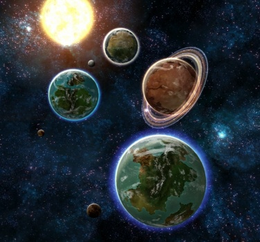

# 1045 考拉瓦星系 Kaurava system

精校状态：中文行文已逐段精校，部分术语仍为暂定

分类：地理 / 小行星 / 极限星域 Ultima Segmentum

原文来源：https://www.bilibili.com/opus/1208902735459516660

原作者：帝国神选罐头

原文时间：2026年06月01日 18:00

[返回分类目录](目录.md) · [全书目录](../../目录.md)

<!-- A1045-B0001 -->
**英文原文**

The Kaurava system is a star system located in the Lithesh Sector of the Ultima Segmentum. It was the battleground of the Kaurava Campaign, a major war involving nearly every major faction and power of the galaxy.

<!-- /A1045-B0001 -->

<!-- A1045-B0002 -->

原译文

考拉瓦星系是一个位于极限星域的利斯星区的恒星系统。这是考拉瓦战役的战场，这是一场涉及银河系几乎所有主要派系和力量的重大战争。

**校订译文**

考拉瓦星系是一个位于极限星域的利斯星区的恒星系统。这是考拉瓦战役的战场，这是一场涉及银河系几乎所有主要派系和力量的重大战争。

<!-- /A1045-B0002 -->

<!-- A1045-B0003 图片 -->

<!-- A1045-B0004 -->

原译文

Map of the Kaurava System 考拉瓦星系的地图

**校订译文**

Map of the Kaurava System 考拉瓦星系的地图

<!-- /A1045-B0004 -->

<!-- A1045-B0005 -->
## History 历史

<!-- /A1045-B0005 -->

<!-- A1045-B0006 -->
## The Kaurava Campaign 考拉瓦战役

<!-- /A1045-B0006 -->

<!-- A1045-B0007 -->
**英文原文**

Much of the background and events leading up to the Kauarava Campaign have been described by Remembrancer Theta-Scion, whose account of the lead up to the war is as follows:

<!-- /A1045-B0007 -->

<!-- A1045-B0008 -->

原译文

记述者西塔·斯西恩描述了导致考拉瓦战役的大部分背景和事件，他对战争起因的描述如下：

**校订译文**

记述者西塔·斯西恩描述了导致考拉瓦战役的大部分背景和事件，他对战争起因的描述如下：

<!-- /A1045-B0008 -->

<!-- A1045-B0009 -->

原译文

"It was the sudden appearance of a warp storm on the outer edge of the Kaurava system that first caught the attention of the Imperium. And not just the Imperium. After hundreds of years under the neglectful watch of the Planetary Defense Force descended from numerous Imperial Guard regiments, nearly every force in the galaxy would descend upon the planets of Kaurava, bent only on domination and victory. Three races had long dwelled in there. The PDF, enforcing the system's supposed rulers, the Ork tribes of Karauva II, whom the Defense Force had never successfully put down, and the Necrons, who had slept undisturbed for untold millenia beneath Karauava III. “考拉瓦星系外缘突然出现一场亚空间风暴，这首先引起了帝国的注意。而不仅仅是帝国。在来自众多帝国卫队兵团的行星防御部队的疏忽监视下，数百年后，银河系中的几乎每一个势力都会降落在考拉瓦的行星上，只专注于统治和胜利。三个种族长期居住在那里。行星防御部队，强行维护这个星系的所谓的统治者，防御部队从未成功击败的考拉瓦二号的欧克部落，以及在考拉瓦三号地下沉睡了无数千年的死灵。 Where the Chaos Marines came from, or how, no one can say. Did the warp storm bring them or did they bring the warp storm? Both appeared suddenly on Karauva IV, and in an eyeblink half the system's Imperial forces were gone, killed or claimed by the madness of Chaos. 混沌星际战士从哪里来，或者怎么来的，没有人能说明。是亚空间风暴带来了他们，还是他们带来了亚空间风暴？两者都突然出现在考拉瓦四号上，眨眼间，该星系一半的帝国部队就消失了，被混沌的疯狂杀死或占据了。 In quick succession, the others flocked to Karauva. The Blood Ravens Chapter of the Space Marines descended on Karauva II, bent on finally cleansing the system, both of the Orks and the Chaos Space Marines, their sworn enemies. The Tau appeared next, not far above, on one of the planet's moons. In the interests of protecting its ordered empire from the effects of human folly, the Tau came seeking to contain the warp storm, and in so doing expand their territory's border by annexing the system. On that moon, they built a mighty fortress, and there forged a space cannon capable of interplanetary devastation. 其他人很快接连涌向考拉瓦。星际战士的血鸦战团突袭了考拉瓦二号，决心最终清理这个星系，包括他们的死敌欧克和混沌星际战士。接下来，钛出现在离行星不远的一颗卫星上。为了保护其有序帝国免受人类愚蠢行为的影响，钛试图控制亚空间风暴，并通过吞并该星系来扩大其领土边界。在卫星上，他们建造了一座强大的堡垒，并在那里铸造了一门能够造成行星间破坏的太空大炮。 Among the wastes of Karauva III, the necrons, perhaps awakened by the disruptive forces of the storm, slowly massed their lethal legions. In quick response, webway gates, long unused, flickered to life and Eldar poured forth, ready to battle their dark death-dealing adversaries. 在考拉瓦三号的废墟中，死灵可能被风暴的破坏力唤醒，慢慢集结了他们的致命军团。在快速响应中，长期未使用的网道之门闪烁着生命，灵族涌出，准备与他们的黑暗致命对手作战。 Meanwhile, in the shadow of an ancient portal gate, the Dark Eldar slipped stealthily out of the murky depths of the webway. They would be like carrion birds, flying above the battlefield, and when all were weary from the fight make the battle into a feasting ground. 与此同时，在一扇古老传送之门的阴影下，黑暗灵族悄悄地溜出了幽暗的网道深处。他们就像食腐鸟，在战场上空飞翔，当所有人都因战斗而疲惫时，把战斗变成一个盛宴之地。 Last to arrive, and perhaps most to be feared, were the Sisters of Battle. Holy maidens and bearers of the God-Emperor's faith, they had come to cleanse the system of corruption and filth. Their faith left them fanatical, unafraid of death and sallied to the cause. Nothing here was clean. All must be purged.” — Remembrancer Theta-Scion of the Inquisition, elucidating on the lead up to the Kaurava Campaign 最后到达的，也许是最令人害怕的，是战斗修女。神圣少女和神皇信仰的承载者，他们来净化腐化和污秽的星系。她们的信仰使他们狂热，不怕死亡，并向目标进发。这里什么都是不洁的。一切都必须被净化。“— 审判庭的记述者西塔·斯西恩，阐明考拉瓦战役的起因

**校订译文**

"It was the sudden appearance of a warp storm on the outer edge of the Kaurava system that first caught the attention of the Imperium. And not just the Imperium. After hundreds of years under the neglectful watch of the Planetary Defense Force descended from numerous Imperial Guard regiments, nearly every force in the galaxy would descend upon the planets of Kaurava, bent only on domination and victory. Three races had long dwelled in there. The PDF, enforcing the system's supposed rulers, the Ork tribes of Karauva II, whom the Defense Force had never successfully put down, and the Necrons, who had slept undisturbed for untold millenia beneath Karauava III. “考拉瓦星系外缘突然出现的亚空间风暴，最先引起了帝国的注意；注意到它的却远不止帝国。由多个帝国卫队兵团后裔组成的行星防御部队，已疏于守备数百年。如今，银河几乎每一方势力都将降临考拉瓦诸星，争夺统治与胜利。这里长期存在三个种族：支持星系名义统治者的人类行星防御部队；防御部队始终未能彻底镇压的考拉瓦二号欧克部落；以及在考拉瓦三号地下安眠无数千年的太空死灵。

 Where the Chaos Marines came from, or how, no one can say. Did the warp storm bring them or did they bring the warp storm? Both appeared suddenly on Karauva IV, and in an eyeblink half the system's Imperial forces were gone, killed or claimed by the madness of Chaos. 没人知道混沌星际战士从何而来，又是如何抵达。是亚空间风暴带来了他们，还是他们招来了风暴？两者同时出现在考拉瓦四号，转眼间，星系半数帝国部队便已覆灭，或遭屠杀，或陷入混沌的疯狂。

 In quick succession, the others flocked to Karauva. The Blood Ravens Chapter of the Space Marines descended on Karauva II, bent on finally cleansing the system, both of the Orks and the Chaos Space Marines, their sworn enemies. The Tau appeared next, not far above, on one of the planet's moons. In the interests of protecting its ordered empire from the effects of human folly, the Tau came seeking to contain the warp storm, and in so doing expand their territory's border by annexing the system. On that moon, they built a mighty fortress, and there forged a space cannon capable of interplanetary devastation. 其他势力接踵而至。星际战士血鸦战团降临考拉瓦二号，决心肃清星系中的欧克，以及自己的死敌混沌星际战士。接着，钛族出现在这颗行星附近的一颗卫星上。为了保护秩序井然的钛帝国免受人类愚行波及，他们意图遏制亚空间风暴，同时吞并星系、扩张疆界。他们在卫星上修筑坚固堡垒，并建造了一门能够跨行星发动毁灭性打击的太空巨炮。

 Among the wastes of Karauva III, the necrons, perhaps awakened by the disruptive forces of the storm, slowly massed their lethal legions. In quick response, webway gates, long unused, flickered to life and Eldar poured forth, ready to battle their dark death-dealing adversaries. 在考拉瓦三号的荒原上，太空死灵或许被风暴的扰动唤醒，开始缓缓集结致命军团。作为回应，长期沉寂的网道之门闪烁着重新启动，灵族蜂拥而出，准备迎战这些带来死亡的黑暗宿敌。

 Meanwhile, in the shadow of an ancient portal gate, the Dark Eldar slipped stealthily out of the murky depths of the webway. They would be like carrion birds, flying above the battlefield, and when all were weary from the fight make the battle into a feasting ground. 与此同时，黑暗灵族在一座古老传送门的阴影中，悄然走出幽暗网道。他们如同盘旋在战场上空的食腐鸟，等各方精疲力竭，就将战场变成自己的盛宴。

 Last to arrive, and perhaps most to be feared, were the Sisters of Battle. Holy maidens and bearers of the God-Emperor's faith, they had come to cleanse the system of corruption and filth. Their faith left them fanatical, unafraid of death and sallied to the cause. Nothing here was clean. All must be purged.” — Remembrancer Theta-Scion of the Inquisition, elucidating on the lead up to the Kaurava Campaign 最后到来，也许最令人畏惧的，是战斗修女。这些神圣女战士承载着对神皇的信仰，誓要清除星系中的腐化与污秽。狂热的信仰使她们无惧死亡，毅然投身使命。在她们眼中，这里没有任何洁净之物，一切都必须净化。”——审判庭记述者西塔·斯西恩，论考拉瓦战役的起因

**校注：** 保留段中全部英文及Kaurava/Karauva/Karauava原有拼写差异，中文统一考拉瓦并分段；wastes是荒原，不必理解为城市废墟。

<!-- /A1045-B0009 -->

<!-- A1045-B0010 -->
**英文原文**

The ultimate victor of this interstellar conflict would be the Orks under Warlord Gorgutz 'Ead 'Unter

<!-- /A1045-B0010 -->

<!-- A1045-B0011 -->

原译文

这场星际冲突的最终胜利者将是军阀猎头者戈古兹领导下的欧克

**校订译文**

这场星际冲突的最终胜利者，是军阀“猎头者”戈古兹率领的欧克。

<!-- /A1045-B0011 -->

<!-- A1045-B0012 -->
## Planets 行星

<!-- /A1045-B0012 -->

<!-- A1045-B0013 -->

原译文

Kaurava I 考拉瓦一号

**校订译文**

Kaurava I 考拉瓦一号

<!-- /A1045-B0013 -->

<!-- A1045-B0014 -->

原译文

Kaurava II 考拉瓦二号

**校订译文**

Kaurava II 考拉瓦二号

<!-- /A1045-B0014 -->

<!-- A1045-B0015 -->

原译文

Kaurava III 考拉瓦三号

**校订译文**

Kaurava III 考拉瓦三号

<!-- /A1045-B0015 -->

<!-- A1045-B0016 -->

原译文

Kaurava IV 考拉瓦四号

**校订译文**

Kaurava IV 考拉瓦四号

<!-- /A1045-B0016 -->

本篇核心术语与暂定项

以下列出本篇出现的英文原形及核心术语表用词。同形词可能指不同对象，具体词义以本篇正文和校注为准；单复数、别名和仅见于图注的名称可能尚未列入。完整候选见[术语表](../../术语表/双语术语候选.csv)。

| 英文 | 采用中文 | 状态 |
| --- | --- | --- |
| Orks | 欧克蛮人 | 官方已核对 |
| Ultima Segmentum | 极限星域 | 暂定·官方待核 |
| Segmentum | 星域 | 暂定·官方待核 |
| Sector | 星区 | 暂定·官方待核 |
| Kaurava Campaign | 考拉瓦战役 | 暂定·官方待核 |
| The Kaurava Campaign | 考拉瓦战役 | 暂定·官方待核 |
| Kaurava | 考拉瓦 | 暂定·官方待核 |
| Gorgutz | 戈古兹 | 暂定·官方待核 |
| System | 星系（恒星系统） | 暂定·官方待核 |
| Kaurava System | 考拉瓦星系 | 暂定·官方待核 |
| Gorgutz 'Ead 'Unter | 猎头者戈古兹 | 暂定·官方待核 |
| Lithesh Sector | 利斯星区 | 暂定·官方待核 |

