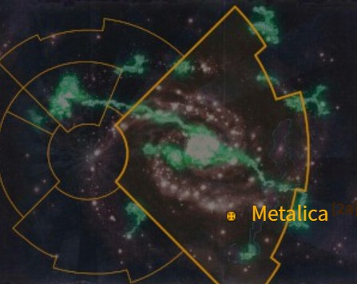
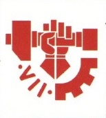
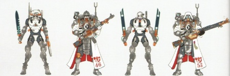
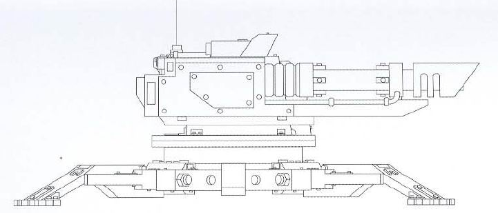

# 1046 梅塔利卡 Metalica

精校状态：中文行文已逐段精校，部分术语仍为暂定

分类：地理 / 小行星 / 极限星域 Ultima Segmentum

原文来源：https://www.bilibili.com/opus/1157186785101479961

原作者：帝国神选罐头

原文时间：2026年01月13日 09:15

[返回分类目录](目录.md) · [全书目录](../../目录.md)

<!-- A1046-B0001 图片 -->

<!-- A1046-B0002 -->

原译文

Map 地图

**校订译文**

Map 地图

<!-- /A1046-B0002 -->

<!-- A1046-B0003 -->
### Basic Data 基本资料

原题：Basic Data 基础数据

<!-- /A1046-B0003 -->

<!-- A1046-B0004 -->
**英文原文**

Name:Metalica

<!-- /A1046-B0004 -->

<!-- A1046-B0005 -->

原译文

名称：梅塔利卡

**校订译文**

名称：梅塔利卡

<!-- /A1046-B0005 -->

<!-- A1046-B0006 -->
**英文原文**

Segmentum:Ultima Segmentum

<!-- /A1046-B0006 -->

<!-- A1046-B0007 -->

原译文

星域：极限星域

**校订译文**

星域：极限星域

<!-- /A1046-B0007 -->

<!-- A1046-B0008 -->
**英文原文**

Sector:Charadon Sector

<!-- /A1046-B0008 -->

<!-- A1046-B0009 -->

原译文

星区：查拉顿星区

**校订译文**

星区：查拉顿星区

<!-- /A1046-B0009 -->

<!-- A1046-B0010 -->
**英文原文**

Subsector:Obolis Sub-Sector

<!-- /A1046-B0010 -->

<!-- A1046-B0011 -->

原译文

分区：奥波利斯分区

**校订译文**

次星区：奥波利斯次星区

<!-- /A1046-B0011 -->

<!-- A1046-B0012 -->
**英文原文**

System:Metalica System

<!-- /A1046-B0012 -->

<!-- A1046-B0013 -->

原译文

星系：梅塔利卡星系

**校订译文**

星系：梅塔利卡星系

<!-- /A1046-B0013 -->

<!-- A1046-B0014 -->
**英文原文**

Population:Many billions

<!-- /A1046-B0014 -->

<!-- A1046-B0015 -->

原译文

人口：数十亿

**校订译文**

人口：数十亿

<!-- /A1046-B0015 -->

<!-- A1046-B0016 -->
**英文原文**

Affiliation:Imperium

<!-- /A1046-B0016 -->

<!-- A1046-B0017 -->

原译文

隶属：帝国

**校订译文**

隶属：帝国

<!-- /A1046-B0017 -->

<!-- A1046-B0018 -->
**英文原文**

Class:Forge World

<!-- /A1046-B0018 -->

<!-- A1046-B0019 -->

原译文

类别：铸造世界

**校订译文**

类别：铸造世界

<!-- /A1046-B0019 -->

<!-- A1046-B0020 -->
**英文原文**

Production Grade:IV-Prima

<!-- /A1046-B0020 -->

<!-- A1046-B0021 -->

原译文

生产等级：四级-上等

**校订译文**

生产等级：四级-上等

<!-- /A1046-B0021 -->

<!-- A1046-B0022 -->
**英文原文**

Tithe Grade:Aptus Non

<!-- /A1046-B0022 -->

<!-- A1046-B0023 -->

原译文

什一税等级：特技免税

**校订译文**

什一税等级：特级免税

<!-- /A1046-B0023 -->

<!-- A1046-B0024 -->
**英文原文**

Metalica is a Forge World situated close to the Ork Empire of Charadon. It is home to the Legio Metalica.

<!-- /A1046-B0024 -->

<!-- A1046-B0025 -->

原译文

梅塔利卡是一个铸造世界，位于查拉顿的欧克帝国附近。它是金属军团的所在地。

**校订译文**

梅塔利卡是一个铸造世界，位于查拉顿的欧克帝国附近。它是金属军团的所在地。

<!-- /A1046-B0025 -->

<!-- A1046-B0026 -->
## Overview 概述

<!-- /A1046-B0026 -->

<!-- A1046-B0027 -->
**英文原文**

The Forge World is close to many threats, such as the Ork Empire of Charadon and the Great Rift. Its endless production quotas see dozens of war fronts kept supplied, while its Skitarii forces are skilled at purging threats throughout the region. Their extreme fervor for mass production has seen the planet scoured of all flora and fauna. Yet every surface of Metalica is covered in industrial production, even its ironclad canyons and subterranean passages. This has led to the claim that the entire planet is made of metal.

<!-- /A1046-B0027 -->

<!-- A1046-B0028 -->

原译文

铸造世界靠近许多威胁，如查拉顿的欧克帝国和大裂隙。其无休止的生产配额使数十条战线保持供应，而其护教军部队擅长清除整个地区的威胁。他们对大规模生产的极端热情已经使行星上的所有动植物都消失了。然而，梅塔利卡的每一个表面都覆盖着工业生产，甚至是它的铁甲峡谷和地下通道。这导致了整个行星都是由金属组成的说法。

**校订译文**

梅塔利卡毗邻查拉顿欧克帝国与大裂隙等诸多威胁。源源不断的生产支撑着数十条战线，护教军则善于清除区域内的敌人。当地对大规模生产的极度狂热，使行星上的动植物被彻底清除。如今，每一寸空间都投入工业用途，连包覆金属的峡谷和地下通道也不例外，因此才有整颗行星都由金属构成的说法。

<!-- /A1046-B0028 -->

<!-- A1046-B0029 图片 -->

<!-- A1046-B0030 -->

原译文

Metalica's symbol 梅塔利卡标志

**校订译文**

Metalica's symbol 梅塔利卡标志

<!-- /A1046-B0030 -->

<!-- A1046-B0031 -->
**英文原文**

Metalica stands apart both physically and doctrinally from Mars. The ruling Metalican Magi have long resisted attempts by the Martian priesthood to impose their rule on them. Their troops display only the barest amount of Martian crimson on their heraldry, drowned out in the pure white of Metalica. This is symbolic of the purity of the machine and the inevitable victory over the weak flesh.

<!-- /A1046-B0031 -->

<!-- A1046-B0032 -->

原译文

梅塔利卡在根本和理论上都与火星不同。执政的梅塔利卡圣贤士长期以来一直抵制火星祭司将他们的统治强加给他们的企图。他们的军队在纹章上只显示出最浅的火星深红，淹没在梅塔利卡的纯白中。这象征着机械的纯洁和超越软弱血肉的不可避免的胜利。

**校订译文**

梅塔利卡在地理位置和教义上都与火星保持距离。统治这里的贤者长期抗拒火星祭司施加统治的企图。当地部队的纹章只保留少量火星深红，几乎全被梅塔利卡的纯白色淹没，象征机械的纯净以及机械必将战胜脆弱血肉。

<!-- /A1046-B0032 -->

<!-- A1046-B0033 -->
## History 历史

<!-- /A1046-B0033 -->

<!-- A1046-B0034 -->
### Early History 早期历史

<!-- /A1046-B0034 -->

<!-- A1046-B0035 -->
**英文原文**

Metalica was able to use its Legio Metalica Titan Legion to defend the world during the Age of Strife, fending off some 32 Xenos invasions. This allowed it to eventually not only survive but flourish, and by the time of the Great Crusade it had formed an empire of some dozen neighboring systems.

<!-- /A1046-B0035 -->

<!-- A1046-B0036 -->

原译文

在纷争时代，梅塔利卡能够使用其金属军团泰坦军团保卫世界，抵御了大约32次异型入侵。这使得它最终不仅得以生存，而且蓬勃发展，到大远征时，它已经形成了一个由十几个邻近星系组成的帝国。

**校订译文**

纷争时代，梅塔利卡依靠金属泰坦军团守卫母星，抵挡了约32次异形入侵。它不仅幸存，还繁荣发展；到大远征时期，已建立起涵盖约十二个邻近星系的帝国。

**校注：** some dozen是约十二个，区别于dozens数十个。原文仍用帝国形容加入人类帝国前的独立势力。

<!-- /A1046-B0036 -->

<!-- A1046-B0037 图片 -->

<!-- A1046-B0038 -->

原译文

Metalica Skitarii 梅塔利卡护教军

**校订译文**

Metalica Skitarii 梅塔利卡护教军

<!-- /A1046-B0038 -->

<!-- A1046-B0039 -->
**英文原文**

First contact with the Imperium was made by the 1159th Expeditionary Fleet, whose ambitious but impetuous commander hastily engaged in hostilities with Metalica's outlying holdings. This saw the Metalican defence fleet lay waste to the Imperials, until Tech-Priests with the Crusade were able to reestablish diplomatic efforts. The Tech-Priests noted the STC-based designs of Metalica and judged them as loyal followers of the Machine God. An agreement was eventually reached and Metalica joined the forces of the Imperium. Its forces gained much fame during the remainder of the Great Crusade.

<!-- /A1046-B0039 -->

<!-- A1046-B0040 -->

原译文

与帝国的第一次接触是由第1159远征舰队进行的，该舰队雄心勃勃但冲动的指挥官匆忙与梅塔利卡的边远地区交战。这使得梅塔利卡防御舰队对帝国造成了破坏，直到远征的技术神甫能够重建外交努力。技术神甫们注意到梅塔利卡基于STC的设计，并认为他们是万机神的忠实追随者。最终达成了一项协议，梅塔利卡加入了帝国的军队。在大远征的剩余时间里，它的部队获得了很大的声誉。

**校订译文**

第1159远征舰队最先与梅塔利卡接触。其指挥官雄心勃勃却行事鲁莽，仓促攻击梅塔利卡的外围领地，结果遭当地防御舰队重创。随军技术祭司随后重新展开外交交涉。他们注意到梅塔利卡采用基于STC的设计，判定当地人是万机神的忠实信徒。双方最终达成协议，梅塔利卡加入帝国，并在大远征余下的岁月中凭借军功赢得盛誉。

<!-- /A1046-B0040 -->

<!-- A1046-B0041 -->
**英文原文**

During the Horus Heresy, Metalica's loyalty would be questioned multiple times. Though the world itself remained loyal, traitor elements are known to have been created and damaged the Forge World's reputation.

<!-- /A1046-B0041 -->

<!-- A1046-B0042 -->

原译文

在荷鲁斯叛乱期间，梅塔利卡的忠诚多次受到质疑。虽然世界本身仍然忠诚，但众所周知，叛徒成员已经被创造出来，并损害了铸造世界的声誉。

**校订译文**

荷鲁斯之乱期间，梅塔利卡的忠诚屡受质疑。尽管铸造世界本身始终效忠帝国，其内部确实出现过叛徒，损害了当地声誉。

<!-- /A1046-B0042 -->

<!-- A1046-B0043 -->
### Post-Heresy 荷鲁斯之乱后

原题：Post-Heresy 叛乱后

<!-- /A1046-B0043 -->

<!-- A1046-B0044 -->
**英文原文**

In 923.M39, the Elucidan Schism devastated the planet and has become a center of Electro-Priests ever since.

<!-- /A1046-B0044 -->

<!-- A1046-B0045 -->

原译文

923.M39，阐释分裂摧毁了行星，从此成为电僧的中心。

**校订译文**

923.M39，埃卢西丹分裂事件重创了梅塔利卡，此后这里成为电僧的重要中心。

**校注：** Elucidan Schism沿较早第124、158篇定译埃卢西丹分裂，原稿阐释分裂。

<!-- /A1046-B0045 -->

<!-- A1046-B0046 -->
**英文原文**

Metalica has provided much support to Armageddon, making up the forefront of the Mechanicus effort in the First, Second and Third wars for the planet.

<!-- /A1046-B0046 -->

<!-- A1046-B0047 -->

原译文

梅塔利卡为阿玛吉多顿提供了大量支援，在第一次、第二次和第三次行星战争中处于机械教努力的最前沿。

**校订译文**

梅塔利卡向阿玛吉多顿提供了大量支援，在当地的第一次、第二次和第三次战争中，都站在机械修会援军的最前线。

<!-- /A1046-B0047 -->

<!-- A1046-B0048 -->
**英文原文**

Later during the Thirteenth Black Crusade, Metalica deployed substantial Skitarii and Legio Metalica Titans in the Diamor Campaign.

<!-- /A1046-B0048 -->

<!-- A1046-B0049 -->

原译文

后来在第十三次黑色远征期间，梅塔利卡在迪亚莫尔战役中部署了大量的护教军和金属军团泰坦。

**校订译文**

后来在第十三次黑色远征期间，梅塔利卡在迪亚莫尔战役中部署了大量的护教军和金属军团泰坦。

<!-- /A1046-B0049 -->

<!-- A1046-B0050 -->
### Age of the Dark Imperium 黑暗帝国时代

<!-- /A1046-B0050 -->

<!-- A1046-B0051 -->
**英文原文**

Shortly after the Plague Wars of M42 Metalica was threatened by Ork invasion. However Ultramarines Chapter Master Marneus Calgar was able to slow the horde through rapid strike tactics. At some point early in the Indomitus Crusade Metalica suffered a surprise attack by Oruskh Dynasty Necrons which suddenly rose beneath it. However the Xenos were sluggish immediately after their awakening, so the Metalican Mechanicum and Knight armies proved able to halt their advance.

<!-- /A1046-B0051 -->

<!-- A1046-B0052 -->

原译文

梅塔利卡在瘟疫战争后不久的M42就受到了欧克入侵的威胁。然而，极限战士战团长马涅乌斯·卡尔加能够通过快速打击战术减缓部落的速度。在不屈远征早期的某个时候，梅塔利卡遭到了突然从其下方升起的奥鲁斯克王朝死灵的突然袭击。然而，异型在苏醒后的时刻行动迟缓，因此梅塔利卡机械教和骑士军队证明能够阻止他们的进步。

**校订译文**

M42瘟疫战争结束后不久，梅塔利卡受到欧克入侵威胁。极限战士战团长马涅乌斯·卡尔加运用快速打击战术，成功迟滞了敌军。不屈远征初期，奥鲁斯赫王朝的太空死灵又突然从地下出现，袭击梅塔利卡。不过，异形刚刚苏醒，行动迟缓，因此当地机械教部队和骑士军团得以阻止其推进。

**校注：**  Oruskh Dynasty沿较早第837篇奥鲁斯赫王朝，区别Oruscar奥鲁斯卡王朝。

<!-- /A1046-B0052 -->

<!-- A1046-B0053 -->
**英文原文**

Sometime after the formation of the Great Rift, Metalica was invaded by the Death Guard in what became known as the War of Slime and Metal. It has since been threatened again by a Death Guard-led force in the Charadon Campaign. besieged by a Warp Rift known as The Sore and invaded by the vast forces of Chaos led by Typhus, at the height of the battle the Death Guard Lord was able to penetrate the inner sanctum of Metalica and deliver a computer phage known as the Nemesis Wurm. The Chaos forces withdrew afterwards, leaving Metalica devastated. However the Forge World remains all but crippled, for while the Mechanicum initially was able to eradicate the mutations and entropy caused by the Wurm it always manifests once more 7 cycles later. This cycle has continued over and over, with the Mechanicum unable to cleanse their world of taint.

<!-- /A1046-B0053 -->

<!-- A1046-B0054 -->

原译文

大裂隙形成后的某个时候，梅塔利卡被死亡守卫入侵，这场战争后来被称为黏液与金属战争。自那以后，它在查拉顿战役中再次受到死亡守卫领导的部队的威胁。被称为巨疮的亚空间裂缝包围，并被泰丰斯领导的庞大混沌部队入侵，在战斗的最高潮，死亡守卫领主能够穿透梅塔利卡的内环圣所，并释放出一种名为复仇女神蠕虫的计算机噬菌体。混沌部队随后撤退，使梅塔利卡满目疮痍。然而，铸造世界仍然几乎瘫痪，因为虽然机械最初能够消除由蠕虫引起的突变和无序，但它总是在7个周期后再次出现。这个循环一次又一次地持续着，机械教无法清除他们世界的污点。

**校订译文**

大裂隙形成后，死亡守卫入侵梅塔利卡，引发了后来被称为“黏液与金属战争”的战事。此后，在查拉顿战役中，死亡守卫率领的联军再次威胁这里。名为“巨疮”的亚空间裂隙将行星围困，泰弗斯率庞大的混沌军队发动入侵。战斗达到高潮时，这位死亡守卫领主闯入梅塔利卡的内圣所，植入名为“复仇女神蠕虫”的计算机噬体。混沌军队随后撤走，留下满目疮痍的行星。这个铸造世界从此几近瘫痪：机械教虽然起初能消除蠕虫造成的变异与熵增，但每过七个周期，灾害就会再次出现。循环周而复始，他们始终无法彻底清除母星的污染。

**校注：** Typhus按官译统一泰弗斯；Nemesis Wurm为计算机侵蚀体名称，沿原稿复仇女神蠕虫，不误标为武器官译。原文只写seven cycles，未说明周期单位，不改成七天。

<!-- /A1046-B0054 -->

<!-- A1046-B0055 -->
## Notable Metalicans 著名梅塔利卡人

<!-- /A1046-B0055 -->

<!-- A1046-B0056 -->
**英文原文**

Heptus Rho-Decima Khleng — Former Fabricator-General.

<!-- /A1046-B0056 -->

<!-- A1046-B0057 -->

原译文

赫普图斯·罗-德西马·克伦 — 前铸造将军

**校订译文**

赫普图斯·罗-德西马·克伦 — 前铸造将军

<!-- /A1046-B0057 -->

<!-- A1046-B0058 -->
**英文原文**

Ozmerhadus Phal — Magos Dominus.

<!-- /A1046-B0058 -->

<!-- A1046-B0059 -->

原译文

奥兹默哈杜斯·法尔 — 统御贤者

**校订译文**

奥兹默哈杜斯·法尔 — 统御贤者

<!-- /A1046-B0059 -->

<!-- A1046-B0060 -->
**英文原文**

Decitor Septrax-Tertian — Skitarii Marshal.

<!-- /A1046-B0060 -->

<!-- A1046-B0061 -->

原译文

德克托·塞普特拉克斯-特提安 — 护教军元帅

**校订译文**

德克托·塞普特拉克斯-特提安 — 护教军元帅

<!-- /A1046-B0061 -->

<!-- A1046-B0062 -->

原译文

Lector-Dogmatis Videx 教条宣讲者维戴克斯

**校订译文**

Lector-Dogmatis Videx 教条宣讲者维戴克斯

<!-- /A1046-B0062 -->

<!-- A1046-B0063 -->
## Known Patterns 已知型号

<!-- /A1046-B0063 -->

<!-- A1046-B0064 图片 -->

<!-- A1046-B0065 -->

原译文

Metalica pattern Tarantula 梅塔利卡型狼蛛

**校订译文**

Metalica pattern Tarantula 梅塔利卡型狼蛛

<!-- /A1046-B0065 -->

本篇核心术语与暂定项

以下列出本篇出现的英文原形及核心术语表用词。同形词可能指不同对象，具体词义以本篇正文和校注为准；单复数、别名和仅见于图注的名称可能尚未列入。完整候选见[术语表](../../术语表/双语术语候选.csv)。

| 英文 | 采用中文 | 状态 |
| --- | --- | --- |
| Death Guard | 死亡守卫 | 官方已核对 |
| Necrons | 太空死灵 | 官方已核对 |
| Ultramarines | 极限战士 | 官方已核对 |
| Horus Heresy | 荷鲁斯之乱 | 官方已核对 |
| Warp | 亚空间 | 官方已核对 |
| Great Rift | 大裂隙 | 官方已核对 |
| Imperium | 帝国 | 暂定·简称 |
| Mechanicum | 机械教 | 暂定·历史称谓 |
| Indomitus | 不屈学派 | 暂定·学派语境 |
| Forge World | 铸造世界 | 暂定·官方待核 |
| Great Crusade | 大远征 | 暂定·官方待核 |
| Age of Strife | 纷争时代 | 暂定·官方待核 |
| Horus | 荷鲁斯 | 暂定·官方待核 |
| STC | 标准建造模板 | 暂定·官方待核 |
| Skitarii | 护教军 | 暂定·官方待核 |
| Indomitus Crusade | 不屈远征 | 暂定·官方待核 |
| Plague Wars | 瘟疫战争 | 暂定·官方待核 |
| Ultima Segmentum | 极限星域 | 暂定·官方待核 |
| Segmentum | 星域 | 暂定·官方待核 |
| Sector | 星区 | 暂定·官方待核 |
| Subsector | 次星区 | 暂定·官方待核 |
| Machine God | 万机神 | 暂定·官方待核 |
| Armageddon | 阿玛吉多顿 | 暂定·官方待核 |
| Mars | 火星 | 暂定·官方待核 |
| Metalica | 梅塔利卡 | 暂定·官方待核 |
| Titan | 泰坦 | 暂定·官方待核 |
| Tech | 技术语 | 暂定·官方待核 |
| Aptus Non | 特级免税 | 暂定·官方待核 |
| Master | 导师（审判庭职衔）／舰务官（舰员职务） | 语境定译·官方待核 |
| Fabricator-General | 铸造将军 | 暂定·官方待核 |
| Skitarii Marshal | 护教军元帅 | 官方已核对 |
| Magos Dominus | 统御贤者 | 暂定·官方待核 |
| Elucidan Schism | 埃卢西丹分裂 | 暂定·官方待核 |
| Chapter | 战团 | 暂定·官方待核 |
| Chapter Master | 战团长 | 暂定·官方待核 |
| Marneus Calgar | 马涅乌斯·卡尔加 | 暂定·官方待核 |
| Nemesis | 复仇女神 | 暂定·官方待核 |
| Diamor | 迪亚莫尔 | 暂定·官方待核 |
| Xenos | 异形 | 暂定·官方待核 |
| Typhus | 泰弗斯 | 官方已核对 |
| Horde | 部落 | 暂定·官方待核 |
| Charadon | 查拉顿 | 暂定·官方待核 |
| Sanctum | 圣所星 | 暂定·官方待核 |
| Marshal | 元帅 | 官方已核对 |
| System | 星系（恒星系统） | 暂定·官方待核 |
| Obolis Sub-Sector | 奥波利斯次星区 | 暂定·官方待核 |
| Nemesis Wurm | 复仇女神蠕虫 | 暂定·官方待核 |
| Fabricator | 铸造师 | 暂定·待核官方 |
| Oruskh Dynasty | 奥鲁斯赫王朝 | 暂定·官方待核 |
| Heptus Rho-Decima Khleng | 赫普图斯·罗-德西马·克伦 | 暂定·官方待核 |
| Ozmerhadus Phal | 奥兹默哈杜斯·法尔 | 暂定·官方待核 |
| Decitor Septrax-Tertian | 德克托·塞普特拉克斯-特提安 | 暂定·官方待核 |
| Skitarii Forces | 护教军部队 | 暂定·官方待核 |

