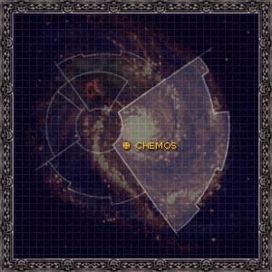
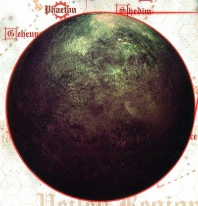

# 1047 彻莫斯 Chemos

精校状态：中文行文已逐段精校，部分术语仍为暂定

分类：地理 / 小行星 / 极限星域 Ultima Segmentum

原文来源：https://www.bilibili.com/opus/1092994229703016449

原作者：帝国神选罐头

原文时间：2025年07月24日 09:35

[返回分类目录](目录.md) · [全书目录](../../目录.md)

<!-- A1047-B0001 图片 -->

<!-- A1047-B0002 -->

原译文

Map 地图

**校订译文**

Map 地图

<!-- /A1047-B0002 -->

<!-- A1047-B0003 -->
### Basic Data 基本资料

原题：Basic Data 基础信息

<!-- /A1047-B0003 -->

<!-- A1047-B0004 -->
**英文原文**

Name:Chemos

<!-- /A1047-B0004 -->

<!-- A1047-B0005 -->

原译文

名称：彻莫斯

**校订译文**

名称：彻莫斯

<!-- /A1047-B0005 -->

<!-- A1047-B0006 -->
**英文原文**

Segmentum:Ultima Segmentum

<!-- /A1047-B0006 -->

<!-- A1047-B0007 -->

原译文

星域：极限星域

**校订译文**

星域：极限星域

<!-- /A1047-B0007 -->

<!-- A1047-B0008 -->
**英文原文**

Sector:Aquitaine Sector

<!-- /A1047-B0008 -->

<!-- A1047-B0009 -->

原译文

星区：阿基坦星区

**校订译文**

星区：阿基坦星区

<!-- /A1047-B0009 -->

<!-- A1047-B0010 -->
**英文原文**

System:Chemos System

<!-- /A1047-B0010 -->

<!-- A1047-B0011 -->

原译文

星系：彻莫斯星系

**校订译文**

星系：彻莫斯星系

<!-- /A1047-B0011 -->

<!-- A1047-B0012 -->
**英文原文**

Class:Destroyed, former Mining World

<!-- /A1047-B0012 -->

<!-- A1047-B0013 -->

原译文

级别：被毁，前矿业世界

**校订译文**

级别：被毁，前矿业世界

<!-- /A1047-B0013 -->

<!-- A1047-B0014 图片 -->

<!-- A1047-B0015 -->

原译文

Planetary Image 行星图像

**校订译文**

Planetary Image 行星图像

<!-- /A1047-B0015 -->

<!-- A1047-B0016 -->
**英文原文**

Chemos was the Homeworld of the Emperor's Children Legion. It is a bleak, unforgiving world, warmed by two small stars and surrounded by a nebula dust cloud. This puts the planet in a perpetual grey twilight.

<!-- /A1047-B0016 -->

<!-- A1047-B0017 -->

原译文

彻莫斯是帝皇之子军团的家园世界。这是一个荒凉、无情的世界，被两颗小型恒星温暖，被星云尘埃云包围。这使行星永远处于灰色的黄昏之中。

**校订译文**

彻莫斯曾是帝皇之子军团的家园世界。它荒凉而严酷，仅由两颗小恒星提供热量，外侧又被星云尘埃包围，因此始终笼罩在灰暗暮色中。

<!-- /A1047-B0017 -->

<!-- A1047-B0018 -->
## History 历史

<!-- /A1047-B0018 -->

<!-- A1047-B0019 -->
**英文原文**

Chemos was settled long ago as a mining world but was isolated from its neighbours by Warp Storms during the Age of Strife. The problem was that the resources of the planet were running out. The planet was not producing enough food even for its own population. Eventually, it fell to a group of fortress factories to produce all the resources. All people had to work every hour of the day, working the vapour mines and synthesisers. Recreation, art and leisure were sacrificed for survival. Because of the nebula clouds surrounding Chemos, it experienced neither day or night but was in a perpetual grey haze.

<!-- /A1047-B0019 -->

<!-- A1047-B0020 -->

原译文

彻莫斯很久以前就作为一个矿业世界确定下来，但在纷争时代被亚空间风暴与邻区隔离开来。问题是行星的资源正在耗尽。行星甚至不能为自己的人口生产足够的食物。最终，它落到了一组堡垒工厂的手中，生产所有的资源。所有人每天都要工作，在蒸汽矿井和合成器上工作。为了生存，娱乐、艺术和休闲被牺牲了。由于彻莫斯周围的星云，它既没有白天也没有黑夜，而是处于永恒的灰色雾霾中。

**校订译文**

彻莫斯很早就作为矿业世界得到开发，但纷争时代的亚空间风暴使它与邻近世界隔绝。当时，行星资源日渐枯竭，连供养自身人口所需的粮食都无法足量生产。最终，全部物资供应都落到一批堡垒工厂肩上。居民不得不终日工作，开采气态矿藏、操作合成设备，为了生存放弃娱乐、艺术和闲暇。环绕行星的星云使这里不见昼夜，只有永恒的灰蒙暮色。

**校注：** it fell to a group...指生产责任最终落在堡垒工厂身上，不是行星落入这些工厂统治。vapour mines暂依字面为气态矿藏，具体工艺待核。

<!-- /A1047-B0020 -->

<!-- A1047-B0021 -->
**英文原文**

When Fulgrim crashed into the planet, he was taken in by one of the planetary police. He grew quickly and within fifty years he was ruler of the planet. Fulgrim managed to get the planet going again, re-opening old mines and farms. Resources started flowing through the planet again. It continued to grow after the Emperor arrived and re-opened trade in the sector. The Fortress Monastery of the Emperor's Children was located at the centre of Callax, one of the major cities on Chemos.

<!-- /A1047-B0021 -->

<!-- A1047-B0022 -->

原译文

当福格瑞姆撞击行星时，他被一名行星警察带走了。他成长迅速，在五十年内成为了这个星球的统治者。福格瑞姆设法让行星重新运转起来，重新开放了旧矿山和农场。资源再次开始在行星上流动。在帝皇到来并重新开放该星区的贸易后，它继续增长。帝皇之子的堡垒修道院位于卡拉克斯的中心，卡拉克斯是彻莫斯的主要城市之一。

**校订译文**

福格瑞姆坠落在彻莫斯后，被一名行星警察收养。他迅速成长，在五十年内便成为当地统治者。他重新启用旧矿井与农场，使行星恢复运转，资源再次流通。帝皇抵达、星区贸易重新开放后，彻莫斯继续发展。帝皇之子的要塞修道院位于当地主要城市之一卡拉克斯的中心。

<!-- /A1047-B0022 -->

<!-- A1047-B0023 -->
**英文原文**

During the final stages of the Horus Heresy, Chemos was left largely undefended by the indifferent Emperor's Children and was destroyed by the Dark Angels. The world has subsequently been quarantined by the Inquisition. The holy scripture the Chemosian Cantos was written during the final hours of the planet, and is still revered by human slaves of the Emperor's Children.

<!-- /A1047-B0023 -->

<!-- A1047-B0024 -->

原译文

在荷鲁斯叛乱的最后阶段，彻莫斯基本上没有受到漠不关心的帝皇之子的保护，并被黑暗天使摧毁。世界随后被审判庭隔离。神圣经文 彻莫斯颂歌 是在行星的最后时刻写成的，至今仍受到帝皇之子的人类奴隶的尊敬。

**校订译文**

荷鲁斯之乱末期，帝皇之子漠视母星安危，彻莫斯几乎毫无防御，最终被黑暗天使摧毁。此后，审判庭将该世界封锁。《彻莫斯颂歌》这部神圣经文写于行星毁灭前的最后时刻，至今仍受到帝皇之子麾下人类奴隶的崇奉。

<!-- /A1047-B0024 -->

<!-- A1047-B0025 -->
## Known Locations 著名地点

<!-- /A1047-B0025 -->

<!-- A1047-B0026 -->
**英文原文**

Callax - Factory-city and Fulgrim's initial domain.

<!-- /A1047-B0026 -->

<!-- A1047-B0027 -->

原译文

卡拉克斯 - 工厂城市和福格瑞姆最初的领地

**校订译文**

卡拉克斯 - 工厂城市和福格瑞姆最初的领地

<!-- /A1047-B0027 -->

<!-- A1047-B0028 -->
**英文原文**

Sulpha - region famed for its sword-dancers.

<!-- /A1047-B0028 -->

<!-- A1047-B0029 -->

原译文

苏尔法 - 以剑舞者闻名的地区。

**校订译文**

苏尔法 - 以剑舞者闻名的地区。

<!-- /A1047-B0029 -->

<!-- A1047-B0030 -->
**英文原文**

Phoenicia - Capital under Fulgrim's reformed society.

<!-- /A1047-B0030 -->

<!-- A1047-B0031 -->

原译文

腓尼基 - 福格瑞姆改革社会下的首都。

**校订译文**

腓尼基——福格瑞姆完成社会改革后建立的首都。

<!-- /A1047-B0031 -->

<!-- A1047-B0032 -->
## Trivia 琐事

<!-- /A1047-B0032 -->

<!-- A1047-B0033 -->
**英文原文**

In John Milton's epic poem Paradise Lost, Chemos is a demon of lust that drives people towards acts of perversion.

<!-- /A1047-B0033 -->

<!-- A1047-B0034 -->

原译文

在约翰·弥尔顿的史诗 失乐园 中，彻莫斯是一个欲望的恶魔，驱使人们做出变态行为。

**校订译文**

在约翰·弥尔顿的史诗《失乐园》中，Chemos是一个代表淫欲的恶魔，驱使人们作出淫邪之举。

**校注：** 此段为原稿文学出处说明，保留原英文Chemos以便核对；并未据此将该文学角色与战锤行星当作同一实体。

<!-- /A1047-B0034 -->

本篇核心术语与暂定项

以下列出本篇出现的英文原形及核心术语表用词。同形词可能指不同对象，具体词义以本篇正文和校注为准；单复数、别名和仅见于图注的名称可能尚未列入。完整候选见[术语表](../../术语表/双语术语候选.csv)。

| 英文 | 采用中文 | 状态 |
| --- | --- | --- |
| Dark Angels | 黑暗天使 | 官方已核对 |
| Horus Heresy | 荷鲁斯之乱 | 官方已核对 |
| Warp | 亚空间 | 官方已核对 |
| Inquisition | 审判庭 | 暂定 |
| Emperor | 帝皇 | 官方已核对 |
| Emperor's Children | 帝皇之子 | 官方已核对 |
| Age of Strife | 纷争时代 | 暂定·官方待核 |
| Horus | 荷鲁斯 | 暂定·官方待核 |
| Fulgrim | 福格瑞姆 | 官方已核对 |
| Ultima Segmentum | 极限星域 | 暂定·官方待核 |
| Segmentum | 星域 | 暂定·官方待核 |
| Sector | 星区 | 暂定·官方待核 |
| Perpetual | 永生者 | 暂定·官方待核 |
| Chemos | 彻莫斯 | 暂定·官方待核 |
| Sulpha | 苏尔法 | 暂定·官方待核 |
| The Dark | 《黑暗》 | 暂定·官方待核 |
| Callax | 卡拉克斯 | 暂定·官方待核 |
| System | 星系（恒星系统） | 暂定·官方待核 |
| Mining World | 矿业世界 | 暂定·官方待核 |
| Phoenicia | 腓尼基 | 暂定·官方待核 |
| Epic | 史诗 | 暂定·官方待核 |

