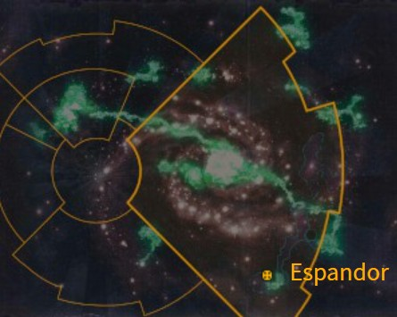
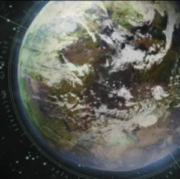

# 1048 埃斯潘多 Espandor

精校状态：中文行文已逐段精校，部分术语仍为暂定

分类：地理 / 小行星 / 极限星域 Ultima Segmentum

原文来源：https://www.bilibili.com/opus/1163123031251353606

原作者：帝国神选罐头

原文时间：2026年01月29日 09:11

[返回分类目录](目录.md) · [全书目录](../../目录.md)

<!-- A1048-B0001 图片 -->

<!-- A1048-B0002 -->

原译文

Map 地图

**校订译文**

Map 地图

<!-- /A1048-B0002 -->

<!-- A1048-B0003 -->
### Basic Data 基本资料

原题：Basic Data 基础数据

<!-- /A1048-B0003 -->

<!-- A1048-B0004 -->
**英文原文**

Name:Espandor

<!-- /A1048-B0004 -->

<!-- A1048-B0005 -->

原译文

名称：埃斯潘多

**校订译文**

名称：埃斯潘多

<!-- /A1048-B0005 -->

<!-- A1048-B0006 -->
**英文原文**

Segmentum:Ultima Segmentum

<!-- /A1048-B0006 -->

<!-- A1048-B0007 -->

原译文

星域：极限星域

**校订译文**

星域：极限星域

<!-- /A1048-B0007 -->

<!-- A1048-B0008 -->
**英文原文**

Sector:Ultima Sector

<!-- /A1048-B0008 -->

<!-- A1048-B0009 -->

原译文

星区：极限星区

**校订译文**

星区：极限星区

<!-- /A1048-B0009 -->

<!-- A1048-B0010 -->
**英文原文**

Subsector:Ultramar

<!-- /A1048-B0010 -->

<!-- A1048-B0011 -->

原译文

分区：奥特拉玛

**校订译文**

次星区：奥特拉玛

<!-- /A1048-B0011 -->

<!-- A1048-B0012 -->
**英文原文**

Affiliation:Imperium

<!-- /A1048-B0012 -->

<!-- A1048-B0013 -->

原译文

隶属：帝国

**校订译文**

隶属：帝国

<!-- /A1048-B0013 -->

<!-- A1048-B0014 -->
**英文原文**

Class:Cardinal World

<!-- /A1048-B0014 -->

<!-- A1048-B0015 -->

原译文

类别：枢机世界

**校订译文**

类别：枢机世界

<!-- /A1048-B0015 -->

<!-- A1048-B0016 图片 -->

<!-- A1048-B0017 -->

原译文

Planetary Image 行星图像

**校订译文**

Planetary Image 行星图像

<!-- /A1048-B0017 -->

<!-- A1048-B0018 -->
**英文原文**

Espandor is a Cardinal World of the Imperium of Man. It is part of the realm of Ultramar and so falls under the control of the Ultramarines.

<!-- /A1048-B0018 -->

<!-- A1048-B0019 -->

原译文

埃斯潘多是人类帝国的枢机世界。它是奥特拉玛王国的一部分，因此受极限战士的控制。

**校订译文**

埃斯潘多是人类帝国的枢机世界。它是奥特拉玛王国的一部分，因此受极限战士的控制。

<!-- /A1048-B0019 -->

<!-- A1048-B0020 -->
**英文原文**

A heavily forested world, its major cities are confined to the westernmost of its two continents, with remote agri-complexes scattered about its surface. It is one of the more distant worlds from Macragge and the least-densely populated.

<!-- /A1048-B0020 -->

<!-- A1048-B0021 -->

原译文

这是一个森林茂密的世界，其主要城市仅限于两大洲的最西端，偏远的农业建筑群散布在其表面。它是距离马库拉格较远的世界之一，也是人口密度最低的世界之一。

**校订译文**

埃斯潘多森林茂密，主要城市集中在两块大陆中偏西的那一块，偏远的农业综合设施则散布各地。它是奥特拉玛境内距离马库拉格较远、人口密度最低的世界之一。

**校注：** westernmost of its two continents 指两块大陆中的西大陆，不是两块大陆各自的最西端。

<!-- /A1048-B0021 -->

<!-- A1048-B0022 -->
## History 历史

<!-- /A1048-B0022 -->

<!-- A1048-B0023 -->
**英文原文**

According to legend, the original settlers of Espandor were the descendants of explorers from Macragge during the Age of Strife, their vessels blown off-course and left stranded on the planet by a Warp Storm. With the organization of Ultramar and the start of the Great Crusade, Espandor would become one of many worlds to supply raw resources and recruits to the creation and upkeep of the Ultramarines Legion.

<!-- /A1048-B0023 -->

<!-- A1048-B0024 -->

原译文

据传说，埃斯潘多的原初定居者是纷争时代马库拉格探索者的后代，他们的战舰被亚空间风暴吹离航线，搁浅在行星上。随着奥特拉玛的组织和大远征的开始，埃斯潘多将成为为创建和维护极限战士军团提供原材料和新兵的众多世界之一。

**校订译文**

传说埃斯潘多最早的定居者，是纷争时代来自马库拉格的探险者后裔。他们的船被亚空间风暴吹离航线，最终困在这里。随着奥特拉玛建立、大远征开始，埃斯潘多与许多世界一道，为极限战士军团的组建和维持提供原料与新兵。

<!-- /A1048-B0024 -->

<!-- A1048-B0025 -->
**英文原文**

Espandor began its life in the Imperium as a lush Agri-World and the breadbasket of Ultramar's Eastern Marches. Its atmosphere was governed by ancient technologies that controlled its weather patterns. The greatest factory-city during this time was the Boreaus Agri-Sprawl.

<!-- /A1048-B0025 -->

<!-- A1048-B0026 -->

原译文

埃斯潘多在帝国开始了它的生活，作为一个郁郁葱葱的农业世界，也是奥特拉马东部边区的粮仓。它的大气层是由控制其天气模式的古代技术所控制的。这一时期最大的工厂城市是博瑞斯农业扩区。

**校订译文**

加入帝国之初，埃斯潘多是一颗植被繁茂的农业世界，也是奥特拉玛东部边区的粮仓。古老技术调节着大气和天气，彼时最大的工厂城市是博瑞斯农业都会。

<!-- /A1048-B0026 -->

<!-- A1048-B0027 -->
**英文原文**

At the outbreak of the Horus Heresy, Espandor was attacked by the World Eaters. It was later the site of a large battle between Titans during the Horus Heresy.

<!-- /A1048-B0027 -->

<!-- A1048-B0028 -->

原译文

荷鲁斯叛乱爆发时，埃斯潘多遭到了吞世者的袭击。后来，在荷鲁斯叛乱时期，泰坦在这里进行了一场大规模的战斗。

**校订译文**

荷鲁斯之乱爆发时，吞世者袭击了埃斯潘多。此后，这里又成为一场大规模泰坦会战的战场。

<!-- /A1048-B0028 -->

<!-- A1048-B0029 -->
### Cleansing of Espandor 清洗埃斯潘多

<!-- /A1048-B0029 -->

<!-- A1048-B0030 -->
**英文原文**

After the First Tyrannic War, local militia discovered a Tyranid nest located deep within the forest. Feeding off of the nearby communities, it was growing stronger every day, and would soon reach a critical mass of population. Hearing this report, Marneus Calgar determined that the cleansing of Espandor would be the first trial of the nascent Tyrannic War Veterans. Their success or failure would determine whether these specialized formations would be recognized as part of the Codex Astartes.

<!-- /A1048-B0030 -->

<!-- A1048-B0031 -->

原译文

第一次泰伦战争后，当地民兵在森林深处发现了一个泰伦巢穴。它以附近的社区为食，每天都在增长，很快就会达到临界人口数量。听到这个报告，马涅乌斯·卡尔加决定清洗埃斯潘多，是对新生的泰伦战争老兵的第一次试炼。它们的成功或失败将决定这些特殊编队是否被视为阿斯塔特圣典的一部分。

**校订译文**

第一次泰伦战争后，当地民兵在森林深处发现了一个泰伦巢穴。它不断吞食附近聚居点，日益壮大，数量即将突破危险的临界规模。得知报告后，马涅乌斯·卡尔加决定将埃斯潘多清剿战作为新组建的泰伦战争老兵部队的首次考验。行动成败，将决定这种专门编制能否获得《阿斯塔特圣典》的认可。

<!-- /A1048-B0031 -->

<!-- A1048-B0032 -->
**英文原文**

Chaplain Ortan Cassius, Captain Severus Agemman and several squads made planetfall near Konor's Reach, one of the largest agri-complexes on the planet serving as a safe haven for the populace. Using auspices specially-modified to track Tyranid pheromone trails, the Ultramarines were able to track the beasts over many miles until they discovered their nest, a giant bio-organic structure serving as the main hive. They were immediately set upon by the vicious creatures, but with disciplined Flamer and Heavy Bolter fire the Ultramarines drove them back into the hive. Within the heart of the hive they discovered a wounded leader-beast, its crippled body having prevented the Tyranids from spreading further across the planet. The Ultramarines fought their way through its fierce bodyguards, and Captain Agemman himself slew the leader-beast, ending its threat to the planet. Not a single warrior had been lost during the operation, thanks to previous experience learned fighting the Tyranids, and the hive and surrounding area would be cleansed of the xenos' taint by sustained orbital bombardment. With the success of their mission, the Tyrannic War Veterans would be formally incorporated into the Codex Astartes.

<!-- /A1048-B0032 -->

<!-- A1048-B0033 -->

原译文

奥坦·卡西乌斯牧师、西弗勒斯·阿格曼连长和几个小队在康诺河段附近进行了行星着陆，这是行星上最大的农业建筑群之一，为民众提供了一个安全的避风港。通过使用经过特殊改装的鸟卜仪来追踪泰伦信息素踪迹，极限战士能够追踪这些野兽数英里，直到他们发现了它们的巢穴，这是一个巨大的生物有机结构，是主虫巢。他们立即被凶猛的生物袭击，但凭借有纪律的火焰枪和重型爆矢枪的火力，极限战士将它们赶回了虫巢。在虫巢的中心，他们发现了一只受伤的野兽领袖，它残废的身体阻止了泰伦在行星上进一步传播。极限战士通过其凶猛的护卫奋力前行，阿格曼连长亲自杀死了这头野兽领袖，结束了它对行星的威胁。由于之前与泰伦作战的经验，行动中没有一名战士丧生，持续的轨道轰炸将清除虫巢和周围地区的异型的污染。随着任务的成功，泰伦战争老兵将被正式纳入阿斯塔特圣典。

**校订译文**

教士奥坦·卡西乌斯、连长西弗勒斯·阿格曼率数支小队，降落在康诺之境附近。这里是行星最大的农业综合设施之一，也是居民避难之所。极限战士使用专为追踪泰伦信息素改装的鸟卜仪，循迹追踪许多英里，最终找到作为主巢的巨大生物建筑。他们立刻遭到凶猛生物攻击，却以纪律严明的火焰喷射器和重型爆矢枪火力，将敌人压回巢中。在巢穴核心，他们发现一只受伤的首领兽；正是其残废的身体限制了泰伦向行星其他地区扩散。战士们杀穿凶悍护卫，阿格曼亲手斩杀首领兽，结束了这股威胁。凭借此前积累的抗击泰伦经验，整场行动无人阵亡。随后，持续的轨道轰炸清除了虫巢及周边地区的异形污染。任务成功后，泰伦战争老兵编制正式纳入《阿斯塔特圣典》。

**校注：** Konor’s Reach在此明确是大型农业综合设施，未提河流；暂译康诺之境，原稿康诺河段保留于对照栏。

<!-- /A1048-B0033 -->

<!-- A1048-B0034 -->
### The Espandor Incursion 埃斯潘多入侵

<!-- /A1048-B0034 -->

<!-- A1048-B0035 -->
**英文原文**

In 999.M41, the Ultramarines 4th Company led by Sergeant Learchus Abantes and Chaplain Judd Clausel took twenty-five newly recruited Battle Brothers on their first engagement; an investigation of the lost patrol ship Guilliman's Honour. What was a routine mission became much more when the 4th Company encountered a huge Ork Waaagh!, equipped with an enormous gargant. Lord Admiral Lazlo Tiberius and the Strike Cruiser Vae Victus made a good account of themselves, however the fighting on the ground was close, bloody and bitter, with Dreadnought Barkus making a heroic sacrifice for the company during the defense of Corinth.

<!-- /A1048-B0035 -->

<!-- A1048-B0036 -->

原译文

999.M41，由军士莱尔库斯·阿班特斯和牧师贾德·克劳塞尔领导的极限战士第四连队在第一次交战中带走了25名新招募的战斗兄弟；对失踪的巡逻舰基里曼之荣誉号的调查。原本是一次例行任务，却变得复杂了许多，当第四连队遇到一个巨大的Ork Waaagh!时，配备了一架巨大的加冈特。领主海军上将拉斯洛·提比略和打击巡洋舰败者之哀号表现得很好，但地面上的战斗非常激烈，血腥而痛苦，无畏巴克斯在保卫科林斯期间为连队做出了英勇的牺牲。

**校订译文**

999.M41，极限战士第四连的军士利尔克斯·阿班忒斯与教士贾德·克劳塞尔，带领25名新加入的战斗兄弟执行首次任务：调查失踪的巡逻舰基里曼之荣誉号。然而，他们遭遇了一支拥有巨型加冈特的庞大欧克Waaagh!，例行任务顿时演变为大战。海军上将拉兹洛·提比略与打击巡洋舰成王败寇号表现出色，地面战斗却异常胶着、血腥而惨烈。无畏机甲巴克斯在科林斯保卫战中为连队英勇牺牲。

<!-- /A1048-B0036 -->

<!-- A1048-B0037 -->
### The Plague Wars 瘟疫战争

<!-- /A1048-B0037 -->

<!-- A1048-B0038 -->
**英文原文**

In 109.M42, Plague Marines and other Chaos creatures attacked Espandor. The Prandium 30th Ultramar Auxilia Regiment was among the defenders. Roboute Guilliman eventually launched his Spear of Espandor counterattack that retook the planet.

<!-- /A1048-B0038 -->

<!-- A1048-B0039 -->

原译文

109.M42，瘟疫战士和其他混沌生物袭击了埃斯潘多。普兰迪姆奥特拉玛辅助军第30兵团是守军之一。罗伯特·基里曼最终发起了他的埃斯潘多之矛反击，夺回了行星。

**校订译文**

109.M42，瘟疫战士及其他混沌生物进攻埃斯潘多，守军中包括普兰蒂姆第30奥特拉玛辅助军团。罗保特·基里曼最终发动“埃斯潘多之矛”反攻，夺回行星。

**校注：** 109.M42为所给英文原文年份，按源文保留，不根据其他版本重排。

<!-- /A1048-B0039 -->

<!-- A1048-B0040 -->
## Locations 地点

<!-- /A1048-B0040 -->

<!-- A1048-B0041 -->
**英文原文**

Espandoria Tertio — city

<!-- /A1048-B0041 -->

<!-- A1048-B0042 -->

原译文

第三埃斯潘多 — 城市

**校订译文**

第三埃斯潘多 — 城市

<!-- /A1048-B0042 -->

<!-- A1048-B0043 -->
**英文原文**

Cathedral Magnifica — main basilica in city

<!-- /A1048-B0043 -->

<!-- A1048-B0044 -->

原译文

宏伟大教堂 — 城市中的主要大教堂

**校订译文**

宏伟大教堂 — 城市中的主要大教堂

<!-- /A1048-B0044 -->

<!-- A1048-B0045 -->

原译文

River Oderia 奥德里亚河

**校订译文**

River Oderia 奥德里亚河

<!-- /A1048-B0045 -->

<!-- A1048-B0046 -->

原译文

#战锤40k##地理##极限星域##极限星区##奥特拉玛##枢机世界##埃斯潘多#

**校订译文**

编目标签：战锤40k、地理、极限星域、极限星区、奥特拉玛、枢机世界、埃斯潘多。

<!-- /A1048-B0046 -->

本篇核心术语与暂定项

以下列出本篇出现的英文原形及核心术语表用词。同形词可能指不同对象，具体词义以本篇正文和校注为准；单复数、别名和仅见于图注的名称可能尚未列入。完整候选见[术语表](../../术语表/双语术语候选.csv)。

| 英文 | 采用中文 | 状态 |
| --- | --- | --- |
| World Eaters | 吞世者 | 官方已核对 |
| Tyranids | 泰伦虫族 | 官方已核对 |
| Roboute Guilliman | 罗保特·基里曼 | 官方已核对 |
| Ultramar | 奥特拉玛 | 官方已核对 |
| Ultramarines | 极限战士 | 官方已核对 |
| Horus Heresy | 荷鲁斯之乱 | 官方已核对 |
| Warp | 亚空间 | 官方已核对 |
| Imperium of Man | 人类帝国 | 官方已核对 |
| Imperium | 帝国 | 暂定·简称 |
| Waaagh! | Waaagh! | 暂定·保留原文 |
| Agri-World | 农业世界 | 暂定·官方待核 |
| Great Crusade | 大远征 | 暂定·官方待核 |
| Age of Strife | 纷争时代 | 暂定·官方待核 |
| Horus | 荷鲁斯 | 暂定·官方待核 |
| Ultima Segmentum | 极限星域 | 暂定·官方待核 |
| Segmentum | 星域 | 暂定·官方待核 |
| Sector | 星区 | 暂定·官方待核 |
| Subsector | 次星区 | 暂定·官方待核 |
| Konor | 康诺 | 暂定·官方待核 |
| Espandor | 埃斯潘多 | 暂定·官方待核 |
| Macragge | 马库拉格 | 暂定·官方待核 |
| Cardinal | 红衣主教 | 暂定 |
| Mission | 教团／传教机构 | 暂定 |
| Chaplain | 教士 | 官方已核对 |
| Ancient | 旗手 | 官方已核对 |
| Captain | 连长 | 暂定·官方待核 |
| Sergeant | 军士 | 暂定·官方待核 |
| Marneus Calgar | 马涅乌斯·卡尔加 | 暂定·官方待核 |
| Ortan Cassius | 奥坦·卡西乌斯 | 暂定·官方待核 |
| Severus Agemman | 西弗勒斯·阿格曼 | 暂定·官方待核 |
| Codex Astartes | 阿斯塔特圣典 | 暂定·官方待核 |
| Strike Cruiser | 打击巡洋舰 | 暂定·官方待核 |
| Xenos | 异形 | 暂定·官方待核 |
| Victus | 征服号 | 暂定·官方待核 |
| Plague Marines | 瘟疫战士 | 官方已核对 |
| Prandium | 普兰蒂姆 | 暂定·官方待核 |
| Gargant | 加冈特 | 暂定·官方待核 |
| Dreadnought | 无畏机甲 | 暂定·官方待核 |
| Lazlo Tiberius | 拉兹洛·提比略 | 暂定·官方待核 |
| Severus | 西弗勒斯 | 暂定·官方待核 |
| Tyrannic War Veterans | 泰伦战争老兵 | 暂定·官方待核 |
| Realm of Ultramar | 奥特拉玛领地 | 暂定·官方待核 |
| Warp Storm | 亚空间风暴 | 暂定·官方待核 |
| Cardinal World | 红衣主教世界 | 暂定·官方待核 |
| Vae Victus | 成王败寇号 | 暂定·官方待核 |
| Learchus Abantes | 利尔克斯·阿班忒斯 | 暂定·官方待核 |
| Bolter | 爆矢枪 | 暂定·官方待核 |
| Heavy bolter | 重型爆矢枪 | 官方已核对 |
| Flamer | 火焰喷射器（武器）／火妖（奸奇单位） | 语境定译·对应官译已核 |
| Spear of Espandor | 埃斯潘多之矛 | 暂定·官方待核 |
| Konor's Reach | 康诺之境 | 暂定·官方待核 |
| Boreaus Agri-Sprawl | 博瑞斯农业都会 | 暂定·官方待核 |
| Judd Clausel | 贾德·克劳塞尔 | 暂定·官方待核 |
| Cleansing of Espandor | 清洗埃斯潘多 | 暂定·官方待核 |
| Espandoria Tertio | 第三埃斯潘多 | 暂定·官方待核 |
| Cathedral Magnifica | 宏伟大教堂 | 暂定·官方待核 |

