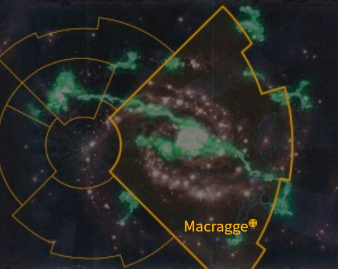
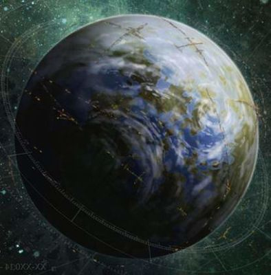

# 1049 马库拉格 Macragge

精校状态：中文行文已逐段精校，部分术语仍为暂定

分类：地理 / 小行星 / 极限星域 Ultima Segmentum

原文来源：https://www.bilibili.com/opus/1099652111865479176

原作者：帝国神选罐头

原文时间：2025年08月11日 08:11

[返回分类目录](目录.md) · [全书目录](../../目录.md)

<!-- A1049-B0001 图片 -->

<!-- A1049-B0002 -->

原译文

Map 地图

**校订译文**

Map 地图

<!-- /A1049-B0002 -->

<!-- A1049-B0003 -->
### Basic Data 基本资料

原题：Basic Data 基础信息

<!-- /A1049-B0003 -->

<!-- A1049-B0004 -->
**英文原文**

Name:Macragge

<!-- /A1049-B0004 -->

<!-- A1049-B0005 -->

原译文

名称：马库拉格

**校订译文**

名称：马库拉格

<!-- /A1049-B0005 -->

<!-- A1049-B0006 -->
**英文原文**

Segmentum:Ultima Segmentum

<!-- /A1049-B0006 -->

<!-- A1049-B0007 -->

原译文

星域：极限星域

**校订译文**

星域：极限星域

<!-- /A1049-B0007 -->

<!-- A1049-B0008 -->
**英文原文**

Sector:Ultima Sector

<!-- /A1049-B0008 -->

<!-- A1049-B0009 -->

原译文

星区：极限星区

**校订译文**

星区：极限星区

<!-- /A1049-B0009 -->

<!-- A1049-B0010 -->
**英文原文**

Subsector:Ultramar

<!-- /A1049-B0010 -->

<!-- A1049-B0011 -->

原译文

分区：奥特拉玛

**校订译文**

次星区：奥特拉玛

<!-- /A1049-B0011 -->

<!-- A1049-B0012 -->
**英文原文**

System:Macragge System

<!-- /A1049-B0012 -->

<!-- A1049-B0013 -->

原译文

星系：马库拉格星系

**校订译文**

星系：马库拉格星系

<!-- /A1049-B0013 -->

<!-- A1049-B0014 -->
**英文原文**

Population:400,000,000

<!-- /A1049-B0014 -->

<!-- A1049-B0015 -->

原译文

人口：4,0000,0000

**校订译文**

人口：4亿

<!-- /A1049-B0015 -->

<!-- A1049-B0016 -->
**英文原文**

Affiliation:Imperium (Ultramarines)

<!-- /A1049-B0016 -->

<!-- A1049-B0017 -->

原译文

隶属：帝国（极限战士）

**校订译文**

隶属：帝国（极限战士）

<!-- /A1049-B0017 -->

<!-- A1049-B0018 -->
**英文原文**

Class:Adeptus Astartes Homeworld

<!-- /A1049-B0018 -->

<!-- A1049-B0019 -->

原译文

级别：阿斯塔特修会家园世界

**校订译文**

级别：阿斯塔特修会家园世界

<!-- /A1049-B0019 -->

<!-- A1049-B0020 -->
**英文原文**

Tithe Grade:Adeptus Non

<!-- /A1049-B0020 -->

<!-- A1049-B0021 -->

原译文

什一税等级：特级免税

**校订译文**

什一税等级：特级免税

<!-- /A1049-B0021 -->

<!-- A1049-B0022 图片 -->

<!-- A1049-B0023 -->

原译文

Planetary Image 行星图像

**校订译文**

Planetary Image 行星图像

<!-- /A1049-B0023 -->

<!-- A1049-B0024 -->
**英文原文**

Macragge is the homeworld of the Ultramarines Chapter of the Space Marines and the capital world of the stellar realm of Ultramar.

<!-- /A1049-B0024 -->

<!-- A1049-B0025 -->

原译文

马库拉格是星际战士极限战士战团的家园，也是奥特拉玛星域的首都。

**校订译文**

马库拉格是星际战士极限战士战团的家园世界，也是奥特拉玛星际领地的首都世界。

<!-- /A1049-B0025 -->

<!-- A1049-B0026 -->
**英文原文**

It is unique among all the worlds of the Imperium in that, apart from Terra and Mars themselves, it is the only planet allowed dominion over other planets — in its case, the other worlds of Ultramar.

<!-- /A1049-B0026 -->

<!-- A1049-B0027 -->

原译文

它在帝国的所有世界中都是独一无二的，因为除了泰拉和火星本身，它是唯一一个被允许统治其他行星的行星 — 就其而言，是奥特拉玛的其他世界。

**校订译文**

它在帝国的所有世界中都是独一无二的，因为除了泰拉和火星本身，它是唯一一个被允许统治其他行星的行星 — 就其而言，是奥特拉玛的其他世界。

**校注：** “除泰拉、火星外唯一获准统治其他行星”的绝对说法来自原文；与本书其他自治星际领地的叙述可能存在口径差异，此处不擅改。

<!-- /A1049-B0027 -->

<!-- A1049-B0028 -->
## History 历史

<!-- /A1049-B0028 -->

<!-- A1049-B0029 -->
### Pre-Imperial History 帝国前历史

<!-- /A1049-B0029 -->

<!-- A1049-B0030 -->
**英文原文**

Before the Great Crusade, Macragge was one of humankind's lost colonies, and the primary form of government was a pair of officials known as Consuls. Macragge was a bleak but not inhospitable world, part of a decayed star empire of ages past that Mankind had inhabited for many centuries since the time of the Dark Age of Technology. Its industries had survived the Age of Strife relatively intact and its people had retained an authoritarian but cohesive society. It had remarkably preserved a number of antiquated short range warp-capable craft which could be utilized for near-stellar transit - conditions permitting - and its people had continued to build sub-light spacecraft even during the time of the most intense warp storms. This had allowed the people of Macragge to maintain contact with several neighbouring human-settled star systems, despite the storms' fury, and so retain a tenuous link to the rest of human space and the knowledge that it was not alone in the darkness.

<!-- /A1049-B0030 -->

<!-- A1049-B0031 -->

原译文

在大远征之前，马库拉格是人类失去的殖民地之一，政府的主要形式是一对被称为领事的官员。马库拉格是一个荒凉但并不荒芜的世界，是人类自黑暗技术时代以来居住了许多世纪的腐朽恒星帝国的一部分。其工业在纷争时代相对完整地幸存下来，其人民保留了一个专制但有凝聚力的社会。它显著地保留了一些过时的短程亚空间飞行器，这些飞行器可以在条件允许的情况下用于近恒星过境，即使在最强烈的亚空间风暴期间，它的人民也继续建造亚光速航天器。这使得马库拉格的人们能够与几个邻近的人类定居的恒星系统保持联系，尽管风暴肆虐，因此与人类空域的其他部分保持着微弱的联系，并知道黑暗中并不孤单。

**校订译文**

大远征之前，马库拉格是人类失落的殖民地之一，由两位称为“执政官”的官员共同统治。这里荒凉却仍适宜居住，曾属于一个古老而衰败的星际帝国，人类自科技黑暗时代以来已在此生活许多世纪。其工业相对完整地度过纷争时代，社会虽实行威权统治，却保持着凝聚力。当地甚至保留了若干古老的短程亚空间飞船，条件允许时可往返邻近恒星系；即便亚空间风暴最猛烈时，居民仍持续建造亚光速飞船。因此，尽管风暴肆虐，马库拉格仍能与数个人类殖民星系保持联系，勉强维系着通往人类其他疆域的纽带，知道自己并非黑暗中的孤岛。

**校注：** Consul此处为马库拉格最高民政职务，采用已定执政官，区别军团时期领事职衔。

<!-- /A1049-B0031 -->

<!-- A1049-B0032 -->
**英文原文**

The infant primarch Roboute Guilliman landed on Macragge after being taken from Terra by the Gods of Chaos. He was found and adopted by one of the Consuls, Konor. A prodigy, Guilliman became a skilled administrator and a military genius.

<!-- /A1049-B0032 -->

<!-- A1049-B0033 -->

原译文

幼年原体罗伯特·基里曼在被混沌诸神从泰拉带走后降落在马库拉格。他被其中一位领事康诺找到并收养。作为一名天才，基里曼成为了一名熟练的行政人员和军事天才。

**校订译文**

幼年原体罗保特·基里曼被混沌诸神从泰拉夺走后，降落在马库拉格，被执政官康诺发现并收养。天资卓绝的基里曼后来成为出色的行政管理者与军事天才。

<!-- /A1049-B0033 -->

<!-- A1049-B0034 -->
**英文原文**

While Guilliman was suppressing a bandit revolt in the mountains, his father was usurped and poisoned by his fellow Consul, Gallan. Although a member of Macragge's nobility, Konor had devoted himself to the "common" people, instituting sweeping reforms that benefitted the masses and undermined the position of the idle rich.

<!-- /A1049-B0034 -->

<!-- A1049-B0035 -->

原译文

当基里曼在山区镇压土匪叛乱时，他的父亲被他的领事同伴加兰篡夺并毒死。尽管身为马库拉格贵族的一员，康诺却致力于“普通”人民，推行了惠及群众、削弱闲散富人地位的全面改革。

**校订译文**

基里曼率军在山区镇压匪乱时，另一位执政官加兰夺权，并毒杀了他的养父。康诺虽出身贵族，却致力于造福平民，推行广泛改革，使大众受益，也削弱了那些无所事事的富人的地位。

<!-- /A1049-B0035 -->

<!-- A1049-B0036 -->
**英文原文**

Guilliman returned to the capital city, defeated Gallan's forces, and was elected to an extraordinary position as sole Consul. Following the example of his father, Guilliman gradually rebuilt Macragge into a meritocracy where everyone worked for the common good.

<!-- /A1049-B0036 -->

<!-- A1049-B0037 -->

原译文

基里曼回到首都，击败了加兰的部队，并被选为唯一的领事。基里曼以父亲为榜样，逐渐将马库拉格重建为一个精英政治，每个人都为共同利益而工作。

**校订译文**

基里曼返回首都，击败加兰的军队，被推举担任破例设立的唯一执政官。他效法养父，逐步将马库拉格改造成以才能选任官员、人人为公共利益效力的社会。

<!-- /A1049-B0037 -->

<!-- A1049-B0038 -->
### The Great Crusade 大远征

<!-- /A1049-B0038 -->

<!-- A1049-B0039 -->
**英文原文**

When the Great Crusade carried the Emperor of Mankind to the planet Espandor in a neighbouring system, the people of Espandor spoke of the astounding son of Consul Konor. The Emperor knew he had found one of his sons and set out immediately. When the Emperor finally reached the Macragge system, he was surprised to find a society that was prosperous, advanced, and well-defended. Recognizing Guilliman as one of his lost "sons," the Emperor reunited Guilliman with his Legion of Space Marines and relocated their base to Macragge.

<!-- /A1049-B0039 -->

<!-- A1049-B0040 -->

原译文

当大远征将人类帝皇带到邻近星系的埃斯潘多行星时，埃斯潘多人民谈到了领事康诺的惊人儿子。帝皇知道他找到了一个儿子，立刻出发了。当帝皇最终到达马库拉格星系时，他惊讶地发现一个繁荣、先进、防御良好的社会。认识到基里曼是他失去的“儿子”之一，帝皇让基里曼与他的星际战士军团重聚，并将他们的基地迁至马库拉格。

**校订译文**

大远征推进到邻近星系的埃斯潘多时，当地居民向帝皇讲述了执政官康诺那位非凡养子的事迹。帝皇明白自己找到了一个失散的儿子，立即启程。抵达马库拉格星系后，他惊讶地发现这里社会繁荣、技术先进、防御严密。确认基里曼的身份后，帝皇让他接掌自己的星际战士军团，并将军团基地迁至马库拉格。

<!-- /A1049-B0040 -->

<!-- A1049-B0041 -->
**英文原文**

During the Great Crusade, Macragge, like the rest of Ultramar's worlds, contributed a steady stream of material and new recruits to the Ultramarines, which allowed them to become the largest of all the Space Marine Legions.

<!-- /A1049-B0041 -->

<!-- A1049-B0042 -->

原译文

在大远征期间，马库拉格和奥特拉玛的其他行星一样，为极限战士提供了源源不断的物资和新兵，使他们成为所有星际战士军团中最大的一支。

**校订译文**

在大远征期间，马库拉格和奥特拉玛的其他行星一样，为极限战士提供了源源不断的物资和新兵，使他们成为所有星际战士军团中最大的一支。

<!-- /A1049-B0042 -->

<!-- A1049-B0043 -->
### The Horus Heresy 荷鲁斯之乱

原题：The Horus Heresy 荷鲁斯叛乱

<!-- /A1049-B0043 -->

<!-- A1049-B0044 -->
**英文原文**

During the Horus Heresy, the Word Bearers Traitor Legion constructed an enormous warship, the Furious Abyss, and set it on a course for Macragge, while another force ambushed the Ultramarines Legion on Calth. Macragge was spared destruction due to the heroic actions of a mixed force of Loyalist Marines, led by Lysimachus Cestus.

<!-- /A1049-B0044 -->

<!-- A1049-B0045 -->

原译文

在荷鲁斯叛乱期间，怀言者叛徒军团建造了一艘巨大的战舰狂怒深渊号，并将其驶向马库拉格，而另一支部队在考斯伏击了极限战士军团。由于里斯马卡斯·赛斯图斯 领导的忠诚派星际战士混合部队的英勇行动，马库拉格幸免于难。

**校订译文**

荷鲁斯之乱期间，怀言者叛徒军团建造巨舰狂怒深渊号，将其派往马库拉格，同时另派部队在考斯伏击极限战士。里斯马卡斯·赛斯图斯率领一支由不同军团忠诚派战士组成的队伍，凭借英勇行动使马库拉格免遭毁灭。

<!-- /A1049-B0045 -->

<!-- A1049-B0046 -->
**英文原文**

Later, Macragge became the capital of Imperium Secundus, Guilliman's auxiliary Imperium. After Konrad Curze escaped onto the planet, a curfew was put into effect. Curze fanned the flames of rebellion on Macragge, and soon even had suicide bombers attacking Imperium Secundus facilities on the planet. Ultimately Lion El'Jonson, Lord Protector of Imperium Secundus, used the Dark Angels to institute Martial Law on Macragge and attacked the Illyrium region to try and root out the rebels.

<!-- /A1049-B0046 -->

<!-- A1049-B0047 -->

原译文

后来，马库拉格成为基里曼的辅助帝国 - 第二帝国的首都。康拉德·科兹逃到行星上后，宵禁生效。科兹煽动了马库拉格的叛乱火焰，很快甚至有自杀式炸弹袭击者袭击了行星上的第二帝国设施。最终，第二帝国的保护者领主莱昂·艾尔庄森利用黑暗天使对马库拉格实施戒严，并袭击了伊利里亚姆地区，试图铲除叛军。

**校订译文**

此后，马库拉格成为基里曼建立的替代帝国——第二帝国——的首都。康拉德·科兹逃到行星上后，当地开始实施宵禁。科兹四处煽动叛乱，甚至促成自杀式炸弹袭击者攻击第二帝国设施。最终，护国领主莱昂·艾尔’庄森动用黑暗天使，在马库拉格实施戒严，并进攻伊利里亚姆地区，试图肃清叛军。

<!-- /A1049-B0047 -->

<!-- A1049-B0048 -->
### Behemoth 贝希摩斯

<!-- /A1049-B0048 -->

<!-- A1049-B0049 -->
**英文原文**

In 745.M41, Ultramar was invaded by the unstoppable juggernaut of Behemoth, the first Tyranid Hive Fleet encountered by the Imperium. During the final battle of the invasion, Marneus Calgar took a daring risk to take the fight to the Hive Ship in space while leaving the Ultramarines First Company to garrison Macragge's polar fortresses. The strategy worked, and Behemoth was repulsed, but at great cost; the Ultramarines suffered horrific casualties, and the First Company was completely wiped out.

<!-- /A1049-B0049 -->

<!-- A1049-B0050 -->

原译文

745.M41，奥特拉玛被帝国遇到的第一支泰伦虫巢舰队贝希摩斯势不可挡的入侵。在入侵的最后一战中，马涅乌斯·卡尔加大胆冒险前往太空中的虫巢舰，同时离开极限战士第一连队驻扎的马库拉格的极地堡垒。这一策略奏效了，贝希摩斯被击退了，但付出了巨大的代价；极限战士遭受了可怕的伤亡，第一连队被彻底摧毁。

**校订译文**

745.M41，帝国首次遭遇的泰伦虫巢舰队贝希摩斯，以势不可挡之势入侵奥特拉玛。在最后的决战中，马涅乌斯·卡尔加大胆决定出击太空中的虫巢舰，同时留下极限战士第一连守卫马库拉格的两极要塞。战略奏效，贝希摩斯被击退，代价却极其惨重：极限战士伤亡巨大，第一连全军覆没。

<!-- /A1049-B0050 -->

<!-- A1049-B0051 -->

原译文

13th Black Crusade 第13次黑色远征

**校订译文**

13th Black Crusade 第13次黑色远征

<!-- /A1049-B0051 -->

<!-- A1049-B0052 -->
**英文原文**

Around the time of the 13th Black Crusade, Macragge was again invaded, this time by the Black Legion and its allies under the direct command of Abaddon the Despoiler. Abaddon hoped to prevent an Imperial-Eldar expedition from resurrecting Roboute Guilliman. As the Fortress of Hera was breached Guilliman was reborn and swiftly led the counterattack that decimated the Chaos invaders.

<!-- /A1049-B0052 -->

<!-- A1049-B0053 -->

原译文

在第13次黑色远征前后，马库拉格再次遭到入侵，这次是由掠夺者阿巴顿直接指挥的黑色军团及其盟友入侵的。阿巴顿希望阻止帝国和灵族远征队复活罗伯特·基里曼。随着赫拉要塞被攻破，基里曼重生并迅速领导了反击，摧毁了混沌入侵者。

**校订译文**

第十三次黑色远征前后，掠夺者阿巴顿直接指挥黑色军团及其盟友，再次入侵马库拉格，企图阻止帝国与灵族组成的远征队复活罗保特·基里曼。赫拉要塞被攻破之际，基里曼终于复生，迅速率军反击，重创混沌入侵者。

<!-- /A1049-B0053 -->

<!-- A1049-B0054 -->
### Plague Wars 瘟疫战争

<!-- /A1049-B0054 -->

<!-- A1049-B0055 -->
**英文原文**

Shortly after the rebirth of Roboute Guilliman, Mortarion himself appeared at the forefront of a massive Nurgle invasion of Ultramar known as the Plague Wars. Though Macragge has not been attacked by a concentrated invasion, it nonetheless has been the site of probing attacks, often by Plague Drones and Cultists. Mutinies by Ultramar Auxilia erupted in the Illyrium region of Macragge. The attacks were unsuccessful, but still drained the resources and morale of Ultramar's defenders. These attacks continued until Guilliman arrived and seized the initiative.

<!-- /A1049-B0055 -->

<!-- A1049-B0056 -->

原译文

在罗伯特·基里曼重生后不久，莫塔里安本人出现在被称为瘟疫战争的大规模纳垢入侵奥特拉玛的前线。尽管马库拉格没有受到集中入侵的袭击，但它仍然是探测袭击的地点，通常是瘟疫无人机和邪教徒的袭击。奥特拉玛辅助军的叛乱在马库拉格的伊利里亚姆地区爆发。这些攻击没有成功，但仍然耗尽了奥特拉玛防御者的资源和士气。这些袭击一直持续到基里曼抵达并夺取主动权。

**校订译文**

罗保特·基里曼复生后不久，莫塔里安亲率大规模纳垢军队入侵奥特拉玛，发动瘟疫战争。马库拉格虽未遭主力集中进攻，却频繁受到瘟疫蜂兵和邪教徒的试探性袭击，伊利里亚姆地区的奥特拉玛辅助军也发生兵变。这些攻势虽然失败，仍不断消耗守军的资源、打击其士气，直到基里曼抵达并夺回主动权。

<!-- /A1049-B0056 -->

<!-- A1049-B0057 -->
## Geography 地理

<!-- /A1049-B0057 -->

<!-- A1049-B0058 -->
**英文原文**

Macragge is a bleak but beautiful planet, dominated by enormous mountain ranges that are uninhabitable for its human population, most of whom live in the lowland regions. Yet despite this geography, it is revered as one of the most magnificent planets in the Imperium.

<!-- /A1049-B0058 -->

<!-- A1049-B0059 -->

原译文

马库拉格是一个荒凉但美丽的星球，由巨大的山脉主导，这些山脉不适合其人口居住，其中大多数人生活在低地地区。然而，尽管有这样的地理位置，它仍被尊为帝国中最壮丽的行星之一。

**校订译文**

马库拉格是一个荒凉但美丽的星球，由巨大的山脉主导，这些山脉不适合其人口居住，其中大多数人生活在低地地区。然而，尽管有这样的地理位置，它仍被尊为帝国中最壮丽的行星之一。

<!-- /A1049-B0059 -->

<!-- A1049-B0060 -->
**英文原文**

The highest mountain range are the Crown Mountains, atop which sits the Fortress of Hera, the Fortress-monastery of the Ultramarines. Within the mighty walls of the fortress lies the Shrine of Guilliman, where the Ultramarines' Primarch Roboute Guilliman sat upon a marble throne, contained within a stasis field before his ressurection in 999.M41. This Shrine is one of the holiest pilgrimage sites in the Imperium.

<!-- /A1049-B0060 -->

<!-- A1049-B0061 -->

原译文

最高的山脉是皇冠山脉，其上坐落着赫拉堡垒，极限战士的堡垒修道院。在堡垒的雄伟城墙内，坐落着基里曼圣地，在那里，极限战士的原体罗伯特·基里曼坐在一个大理石宝座上，在999.M41的复活之前，他被关在一个停滞场里。这个圣地是帝国最神圣的朝圣地之一。

**校订译文**

最高的皇冠山脉上坐落着极限战士的要塞修道院——赫拉要塞。要塞雄伟的城墙内设有基里曼圣地。在999.M41复生之前，极限战士原体罗保特·基里曼端坐在其中的大理石宝座上，由静滞力场保存。这里是帝国最神圣的朝圣地之一。

<!-- /A1049-B0061 -->

<!-- A1049-B0062 -->
**英文原文**

The waters of the Pharamis Ocean wash onto the shores near the Magna Macragge Civitas.

<!-- /A1049-B0062 -->

<!-- A1049-B0063 -->

原译文

法拉米斯洋的海水冲刷到宏伟马库拉格城邦附近的海岸。

**校订译文**

法拉米斯洋的海水冲刷到宏伟马库拉格城邦附近的海岸。

<!-- /A1049-B0063 -->

<!-- A1049-B0064 -->
### Notable Locations 著名地点

<!-- /A1049-B0064 -->

<!-- A1049-B0065 -->
**英文原文**

Magna Macragge Civitas — Also known as Macragge City. Capital city of Macragge and the grandest Imperial city in the eastern Galaxy

<!-- /A1049-B0065 -->

<!-- A1049-B0066 -->

原译文

宏伟马库拉格城邦 — 也被称为马库拉格城。首都马库拉格和银河系东部最宏伟的帝国城市

**校订译文**

宏伟马库拉格城邦——又称马库拉格城，是马库拉格的首都，也是银河东部最宏伟的帝国城市。

<!-- /A1049-B0066 -->

<!-- A1049-B0067 -->
**英文原文**

Hera's Crown Mountains — Lies along the northern edge of Magna Macragge Civitas.

<!-- /A1049-B0067 -->

<!-- A1049-B0068 -->

原译文

赫拉的皇冠山脉 — 位于宏伟马库拉格城邦的北缘。

**校订译文**

赫拉皇冠山脉——位于宏伟马库拉格城邦北缘。

<!-- /A1049-B0068 -->

<!-- A1049-B0069 -->

原译文

Fortress of Hera 赫拉要塞

**校订译文**

Fortress of Hera 赫拉要塞

<!-- /A1049-B0069 -->

<!-- A1049-B0070 -->
**英文原文**

Hall of Maxellus made in the name of Maxellus

<!-- /A1049-B0070 -->

<!-- A1049-B0071 -->

原译文

以马克塞卢斯之名建造的马克塞卢斯大厅

**校订译文**

以马克塞卢斯之名建造的马克塞卢斯大厅

<!-- /A1049-B0071 -->

<!-- A1049-B0072 -->

原译文

Gallan's Rock 加兰之石

**校订译文**

Gallan's Rock 加兰之石

<!-- /A1049-B0072 -->

<!-- A1049-B0073 -->

原译文

Library of Ptolemy 托勒密图书馆

**校订译文**

Library of Ptolemy 托勒密图书馆

<!-- /A1049-B0073 -->

<!-- A1049-B0074 -->

原译文

Plaza of Attendance 出席广场

**校订译文**

Plaza of Attendance 出席广场

<!-- /A1049-B0074 -->

<!-- A1049-B0075 -->

原译文

Shrine of the Primarch 原体圣地

**校订译文**

Shrine of the Primarch 原体圣地

<!-- /A1049-B0075 -->

<!-- A1049-B0076 -->

原译文

Sword Hall 剑刃大厅

**校订译文**

Sword Hall 剑刃大厅

<!-- /A1049-B0076 -->

<!-- A1049-B0077 -->

原译文

Temple of Correction 校正圣殿

**校订译文**

Temple of Correction 校正圣殿

<!-- /A1049-B0077 -->

<!-- A1049-B0078 -->
**英文原文**

Ice Station Hebra — An outpost of the northern polar fortress, Ice Station Hebra guards an entrance to a network of underground tunnels connecting defence laser silos and power generators. Ordinarily it is manned by an isolated garrison of Ultramar defence volunteers.

<!-- /A1049-B0078 -->

<!-- A1049-B0079 -->

原译文

希伯来冰站是北极要塞的前哨，守卫着连接防御激光发射井和发电机的地下隧道网络的入口。通常，它由奥特拉玛防御志愿者组成的孤立驻军负责。

**校订译文**

赫布拉冰站——北极要塞的一处前哨，守卫着一套地下隧道网络的入口。这些隧道连接防御激光发射井与发电机。平时由一支驻地偏远、与外界隔绝的奥特拉玛防御志愿军守卫。

**校注：** Hebra为基地专名，原“希伯来”容易误指语言或族群，暂作赫布拉。

<!-- /A1049-B0079 -->

<!-- A1049-B0080 -->
**英文原文**

Illyrium — Also called "bandit country". It was the last region of Ultramar to be conquered and a hotbed of anti-Konor and later anti-Imperial activity. During the Heresy, Konrad Curze was able to successfully hide in its slums and gain a basis of support, which caused its devastation at the hands of the Dreadwing. Ten thousand years later during the Plague Wars, it again became the site of a mutiny by the Ultramar Auxilia.

<!-- /A1049-B0080 -->

<!-- A1049-B0081 -->

原译文

伊利里亚姆 — 也被称为“土匪之国”。这是奥特拉玛最后一个被征服的地区，也是反康诺和后来反帝国活动的温床。在叛乱时期，康拉德·柯兹成功地躲在这的贫民窟里，并获得了支持，这导致了恐怖分子的破坏。一万年后，在瘟疫战争期间，它再次成为奥特拉玛辅助军叛乱的地点。

**校订译文**

伊利里亚姆——又称“土匪之国”，是奥特拉玛最后被征服的地区，先后成为反对康诺及帝国统治的活动温床。荷鲁斯之乱期间，康拉德·科兹藏身当地贫民窟，建立支持基础，结果使该地区遭到恐翼的毁灭性打击。一万年后的瘟疫战争中，这里又爆发了奥特拉玛辅助军兵变。

**校注：** Dreadwing 是黑暗天使恐翼，原译“恐怖分子”误认组织身份。

<!-- /A1049-B0081 -->

<!-- A1049-B0082 -->

原译文

Valley of Laponis 拉波尼斯山谷

**校订译文**

Valley of Laponis 拉波尼斯山谷

<!-- /A1049-B0082 -->

<!-- A1049-B0083 -->

原译文

Aeneid Sea 埃涅阿斯海

**校订译文**

Aeneid Sea 埃涅阿斯海

<!-- /A1049-B0083 -->

<!-- A1049-B0084 -->
### Other Planetary Information 其他行星信息

<!-- /A1049-B0084 -->

<!-- A1049-B0085 -->
**英文原文**

Orbital Distance: 2.01 AU

<!-- /A1049-B0085 -->

<!-- A1049-B0086 -->

原译文

轨道距离：2.01天文单位

**校订译文**

轨道距离：2.01天文单位

<!-- /A1049-B0086 -->

<!-- A1049-B0087 -->
**英文原文**

Aestimare: D0

<!-- /A1049-B0087 -->

<!-- A1049-B0088 -->

原译文

评估：D0

**校订译文**

评估：D0

<!-- /A1049-B0088 -->

<!-- A1049-B0089 -->
**英文原文**

Moons: Four

<!-- /A1049-B0089 -->

<!-- A1049-B0090 -->

原译文

卫星：四

**校订译文**

卫星：四

<!-- /A1049-B0090 -->

本篇核心术语与暂定项

以下列出本篇出现的英文原形及核心术语表用词。同形词可能指不同对象，具体词义以本篇正文和校注为准；单复数、别名和仅见于图注的名称可能尚未列入。完整候选见[术语表](../../术语表/双语术语候选.csv)。

| 英文 | 采用中文 | 状态 |
| --- | --- | --- |
| Space Marines | 星际战士 | 官方已核对 |
| Adeptus Astartes | 阿斯塔特修会 | 官方已核对 |
| Dark Angels | 黑暗天使 | 官方已核对 |
| Eldar | 灵族 | 暂定·语境区分 |
| Roboute Guilliman | 罗保特·基里曼 | 官方已核对 |
| Ultramar | 奥特拉玛 | 官方已核对 |
| Ultramarines | 极限战士 | 官方已核对 |
| Horus Heresy | 荷鲁斯之乱 | 官方已核对 |
| Warp | 亚空间 | 官方已核对 |
| Imperium | 帝国 | 暂定·简称 |
| Dark Age of Technology | 黑暗科技时代 | 暂定 |
| Nurgle | 纳垢 | 官方已核对 |
| Emperor of Mankind | 人类帝皇 | 暂定 |
| Emperor | 帝皇 | 官方已核对 |
| Primarch | 原体 | 官方已核对 |
| Word Bearers | 怀言者 | 暂定·官方待核 |
| Black Legion | 黑色军团 | 暂定·官方待核 |
| Great Crusade | 大远征 | 暂定·官方待核 |
| Mortarion | 莫塔里安 | 官方已核对 |
| Age of Strife | 纷争时代 | 暂定·官方待核 |
| Terra | 泰拉 | 暂定·官方待核 |
| Horus | 荷鲁斯 | 暂定·官方待核 |
| Lion El'Jonson | 莱昂·艾尔’庄森 | 官方已核对 |
| Plague Wars | 瘟疫战争 | 暂定·官方待核 |
| Ultima Segmentum | 极限星域 | 暂定·官方待核 |
| Segmentum | 星域 | 暂定·官方待核 |
| Sector | 星区 | 暂定·官方待核 |
| Subsector | 次星区 | 暂定·官方待核 |
| Protector | 守护者 | 暂定·官方待核 |
| Konrad Curze | 康拉德·科兹 | 暂定·官方待核 |
| Mars | 火星 | 暂定·官方待核 |
| Konor | 康诺 | 暂定·官方待核 |
| Espandor | 埃斯潘多 | 暂定·官方待核 |
| Calth | 考斯 | 暂定·官方待核 |
| Macragge | 马库拉格 | 暂定·官方待核 |
| Aestimare | 战略价值评级 | 暂定·官方待核 |
| Imperium Secundus | 第二帝国 | 暂定·官方待核 |
| Lord Protector | 护国领主 | 暂定·官方待核 |
| Consul | 领事 | 暂定·官方待核 |
| Despoiler | 劫掠者 | 暂定·官方待核 |
| Dreadwing | 恐翼 | 暂定·官方待核 |
| Space Marine | 星际战士 | 暂定·官方待核 |
| Chapter | 战团 | 暂定·官方待核 |
| Fortress-monastery | 要塞修道院 | 暂定·官方待核 |
| Marneus Calgar | 马涅乌斯·卡尔加 | 暂定·官方待核 |
| Invaders | 侵略者 | 暂定·官方待核 |
| Reborn | 复生者（战团）／重生者（死神军自称） | 语境定译·官方待核 |
| Furious Abyss | 狂怒深渊号 | 暂定·官方待核 |
| Dominion | 主天使 | 暂定·官方待核 |
| Plague Drones | 瘟疫蜂兵 | 官方已核对 |
| Abaddon the Despoiler | 掠夺者阿巴顿 | 官方已核对 |
| Juggernaut | 铁甲兽 | 官方词根参考·整名待核 |
| Cestus | 塞斯图斯号 | 暂定·官方待核 |
| Lysimachus Cestus | 里斯马卡斯·赛斯图斯 | 暂定·官方待核 |
| Realm of Ultramar | 奥特拉玛领地 | 暂定·官方待核 |
| Macragge System | 马库拉格星系 | 暂定·官方待核 |
| The Dark | 《黑暗》 | 暂定·官方待核 |
| Fortress of Hera | 赫拉要塞 | 暂定·官方待核 |
| System | 星系（恒星系统） | 暂定·官方待核 |
| Gallan | 加兰 | 暂定·官方待核 |
| Illyrium | 伊利里亚姆 | 暂定·官方待核 |
| Ice Station Hebra | 赫布拉冰站 | 暂定·官方待核 |
| Magna Macragge Civitas | 宏伟马库拉格城邦 | 暂定·官方待核 |
| Hall of Maxellus | 马克塞卢斯大厅 | 暂定·官方待核 |
| Hera's Crown Mountains | 赫拉皇冠山脉 | 暂定·官方待核 |
| Invasion of Ultramar | 入侵奥特拉玛 | 暂定·官方待核 |
| Hive Ship | 虫巢舰 | 暂定·官方待核 |

