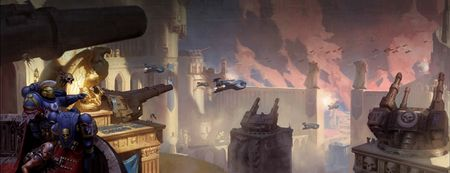

# 1053 赫拉要塞 Fortress of Hera

精校状态：中文行文已逐段精校，部分术语仍为暂定

分类：地理 / 小行星 / 极限星域 Ultima Segmentum

原文来源：https://www.bilibili.com/opus/1194268910001586197

原作者：帝国神选罐头

原文时间：2026年04月23日 07:33

[返回分类目录](目录.md) · [全书目录](../../目录.md)

<!-- A1053-B0001 -->
**英文原文**

The Fortress of Hera is the fortress-monastery of the Ultramarines Chapter on Macragge.

<!-- /A1053-B0001 -->

<!-- A1053-B0002 -->

原译文

赫拉要塞是马库拉格上极限战士战团的堡垒修道院。

**校订译文**

赫拉要塞是马库拉格上极限战士战团的要塞修道院。

<!-- /A1053-B0002 -->

<!-- A1053-B0003 图片 -->

<!-- A1053-B0004 -->

原译文

The Fortress of Hera 赫拉要塞

**校订译文**

The Fortress of Hera 赫拉要塞

<!-- /A1053-B0004 -->

<!-- A1053-B0005 -->
## Overview 概述

原题：Overview 概念

<!-- /A1053-B0005 -->

<!-- A1053-B0006 -->
**英文原文**

The Fortress of Hera sits in the Valley of Laponis alongside the Hera's Fall, overlooking the Macragge's capital of Magna Civitas. The fortress is a wonder of engineering constructed by Chapter's Primarch Roboute Guilliman during the days of the Great Crusade. It's structure contains graceful balconies, golden geodesic domes and slender glass walkways supported by silver-steel buttresses. The domed structures of the fortress are citadels in their own right. Despite its power as a citadel is also a play of learning and culture, with many art halls and academies located within its walls. One of the most infamous troves of knowledge within the Fortress is the Library of Ptolemy on part with Terra's Bibliotekeion Magnifika or Luna's Esoterikon Livris.

<!-- /A1053-B0006 -->

<!-- A1053-B0007 -->

原译文

赫拉要塞坐落在拉波尼斯山谷，与赫拉瀑布并排，俯瞰着马库拉格的首都宏伟城邦。这座堡垒是战团的原体罗伯特·基里曼在大远征期间建造的工程奇迹。它的结构包含优雅的阳台、金色的测地线穹顶和由银钢扶壁支撑的细长玻璃走道。堡垒的穹顶结构本身就是城堡。尽管它是一座城堡，但它也是一个学习和文化的场所，城墙内有许多艺术大厅和学院。堡垒内最著名的知识宝库之一是托勒密图书馆，与泰拉的宏伟图书馆或月球的秘传书库合作。

**校订译文**

赫拉要塞坐落在拉波尼斯山谷，毗邻赫拉瀑布，俯瞰马库拉格首都宏伟城邦。这座要塞是原体罗保特·基里曼在大远征期间建造的工程奇迹，拥有优雅的露台、金色网格穹顶，以及由银钢扶壁支撑的纤细玻璃廊道。每一组穹顶建筑本身就是一座城堡。它既是强大堡垒，也是知识与文化中心，城墙内遍布艺术殿堂和学院。最负盛名的知识宝库之一是托勒密图书馆，足以与泰拉的宏伟图书馆、月球的秘传书库齐名。

**校注：** on part疑似on par误写，意为可相提并论；原译“合作”不合语境。play of learning疑似place，按知识文化场所理解。

<!-- /A1053-B0007 -->

<!-- A1053-B0008 -->
**英文原文**

Within its great halls is the Temple of Correction in which the Shrine of the Primarch preserved the body of Roboute Guilliman in a stasis field until his Resurrection.

<!-- /A1053-B0008 -->

<!-- A1053-B0009 -->

原译文

在它的大厅里是校正圣殿，在那里，原体圣地将罗伯特·基里曼的身体保存在一个静滞力场中，直到他复活。

**校订译文**

要塞的宏伟厅堂中设有校正圣殿，殿内的原体圣地曾以静滞力场保存罗保特·基里曼的身躯，直到他复生。

<!-- /A1053-B0009 -->

<!-- A1053-B0010 -->
## The Siege of Hera 赫拉围城

<!-- /A1053-B0010 -->

<!-- A1053-B0011 -->
**英文原文**

During the Psychic Awakening and after the Fall of Cadia, Macragge was put under siege by a massive Chaos fleet of combined forces from the Black Legion, Iron Warriors, Purge, Night Lords, and many others. Chaos forces breached the fortress and made it to the Shrine of the Primarch, but were stopped by Marneus Calgar and a detachment of 1st company Veterans. Cawl revived Roboute Guilliman in the darkest moment of the siege, who then led a counterattack and a change in overall strategy that relieved the Fortress and drove back the chaos forces.

<!-- /A1053-B0011 -->

<!-- A1053-B0012 -->

原译文

在灵能觉醒期间和卡迪亚陷落后，马库拉格被一支由黑色军团、钢铁勇士、净世疫军、午夜领主和许多其他部队组成的庞大混沌舰队围困。混沌部队突破了要塞，到达了原体圣地，但被马涅乌斯·卡尔加和一支第一连队老兵分遣队阻止。考尔在围城最黑暗的时刻复活了罗伯特·基里曼，然后他领导了反击和整体战略的改变，解除了要塞的压力，击退了混沌部队。

**校订译文**

按本段记述，在灵能觉醒期间、卡迪亚陷落之后，由黑色军团、钢铁勇士、净世疫军、午夜领主及其他势力组成的庞大混沌舰队围攻马库拉格。混沌部队攻入要塞，抵达原体圣地，却被马涅乌斯·卡尔加与第一连老兵分遣队挡住。在围攻最黑暗的时刻，考尔使罗保特·基里曼复生。原体随即率领反击，调整整体战略，解救要塞，击退混沌军队。

**校注：** 英文把基里曼复生事件置于Psychic Awakening期间，与本书其他时间线叙述存在疑点。译文明确归属于本段，不自行更改事件先后。

<!-- /A1053-B0012 -->

<!-- A1053-B0013 -->
**英文原文**

"Like an impresario settling before his instrument, Guilliman spread his hands upon the strategium table and took a deep breath before beginning to command. With his every utterance, the invaders plight became more apparent. The Primarch's strategic acumen, his tactical genius, and miraculous mental acuity were unmatched. The leaders of the Ultramarines looked on in amazement as Guilliman marshaled the defenders like regicide pieces, drinking in reams of strategic data and issuing a steady stream of orders that turned one fight after another in the defenders' favour. Calgar and his lieutenants had executed a super-human campaign of defiance against the invaders, but the Primarch was operating on a different mental plane."

<!-- /A1053-B0013 -->

<!-- A1053-B0014 -->

原译文

“就像一个在乐器前安顿下来的经理，基里曼把手放在战略桌上，深吸一口气，然后开始指挥。随着他的每一句话，入侵者的困境都变得更加明显。原体的战略智慧、战术天才和神奇的精神敏锐度是无与伦比的。当基里曼像弑君棋一样编组防御者，饮下大量的战略数据，发出源源不断的命令，使一场又一场的战斗对防御者有利时，极限战士的领导人惊讶地看着他。卡尔加和他的副官对入侵者进行了超人般的反抗，但原体却在不同的精神层面上行动。”

**校订译文**

“如同演奏家在乐器前坐定，基里曼将双手按在战略桌上，深吸一口气，开始指挥。随着一道道命令下达，入侵者的困境愈发明显。原体的战略眼光、战术天赋与非凡思维速度，无人能及。极限战士的指挥官们惊叹地看着他：他像调动弑君棋子般部署守军，吸收海量战略数据，接连发出命令，使一场又一场战斗转而有利于防御者。卡尔加及其副官此前已以超凡之力抗击入侵，但原体的思维运转于更高的层次。”

**校注：** 英文impresario通常指演出经理，但本处“在乐器前坐定”的比喻显然描写指挥技艺；按上下文译演奏家，并保留英文用词疑点。

<!-- /A1053-B0014 -->

<!-- A1053-B0015 -->
## Notable Locations 著名地点

<!-- /A1053-B0015 -->

<!-- A1053-B0016 -->
**英文原文**

Hall of Maxellus made in the name of Maxellus

<!-- /A1053-B0016 -->

<!-- A1053-B0017 -->

原译文

以马克塞勒斯之名建造的马克塞勒斯大厅

**校订译文**

马克塞卢斯大厅——为纪念马克塞卢斯而建。

<!-- /A1053-B0017 -->

<!-- A1053-B0018 -->

原译文

Gallan's Rock 加兰之石

**校订译文**

Gallan's Rock 加兰之石

<!-- /A1053-B0018 -->

<!-- A1053-B0019 -->

原译文

Library of Ptolemy 托勒密图书馆

**校订译文**

Library of Ptolemy 托勒密图书馆

<!-- /A1053-B0019 -->

<!-- A1053-B0020 -->

原译文

Plaza of Attendance 出席广场

**校订译文**

Plaza of Attendance 出席广场

<!-- /A1053-B0020 -->

<!-- A1053-B0021 -->

原译文

Temple of Correction 校正圣殿

**校订译文**

Temple of Correction 校正圣殿

<!-- /A1053-B0021 -->

<!-- A1053-B0022 -->

原译文

Shrine of the Primarch 原体圣地

**校订译文**

Shrine of the Primarch 原体圣地

<!-- /A1053-B0022 -->

<!-- A1053-B0023 -->

原译文

Sword Hall 剑刃大厅

**校订译文**

Sword Hall 剑刃大厅

<!-- /A1053-B0023 -->

<!-- A1053-B0024 -->
## Notes 注释

<!-- /A1053-B0024 -->

<!-- A1053-B0025 -->
**英文原文**

The Temple of Hera was the original name for the Fortress of Hera.

<!-- /A1053-B0025 -->

<!-- A1053-B0026 -->

原译文

赫拉圣殿是赫拉要塞的原名。

**校订译文**

赫拉圣殿是赫拉要塞的原名。

<!-- /A1053-B0026 -->

本篇核心术语与暂定项

以下列出本篇出现的英文原形及核心术语表用词。同形词可能指不同对象，具体词义以本篇正文和校注为准；单复数、别名和仅见于图注的名称可能尚未列入。完整候选见[术语表](../../术语表/双语术语候选.csv)。

| 英文 | 采用中文 | 状态 |
| --- | --- | --- |
| Roboute Guilliman | 罗保特·基里曼 | 官方已核对 |
| Ultramarines | 极限战士 | 官方已核对 |
| Primarch | 原体 | 官方已核对 |
| Black Legion | 黑色军团 | 暂定·官方待核 |
| Iron Warriors | 钢铁勇士 | 暂定·官方待核 |
| Night Lords | 午夜领主 | 暂定·官方待核 |
| Great Crusade | 大远征 | 暂定·官方待核 |
| Terra | 泰拉 | 暂定·官方待核 |
| Cadia | 卡迪亚 | 暂定·官方待核 |
| Luna | 月球 | 暂定·官方待核 |
| Macragge | 马库拉格 | 暂定·官方待核 |
| Chapter | 战团 | 暂定·官方待核 |
| Fortress-monastery | 要塞修道院 | 暂定·官方待核 |
| Marneus Calgar | 马涅乌斯·卡尔加 | 暂定·官方待核 |
| Invaders | 侵略者 | 暂定·官方待核 |
| The Library of Ptolemy | 托勒密图书馆 | 暂定·官方待核 |
| Acuity | 洞察 | 暂定·官方待核 |
| Ptolemy | 托勒密 | 暂定·官方待核 |
| Regicide | 弑君棋 | 暂定·官方待核 |
| Fortress of Hera | 赫拉要塞 | 暂定·官方待核 |
| Laponis | 拉波尼斯 | 暂定·官方待核 |
| Defiance | 反抗号 | 暂定·官方待核 |
| Hall of Maxellus | 马克塞卢斯大厅 | 暂定·官方待核 |
| Temple of Correction | 校正圣殿 | 暂定·官方待核 |
| Shrine of the Primarch | 原体圣地 | 暂定·官方待核 |
| Valley of Laponis | 拉波尼斯山谷 | 暂定·官方待核 |
| Esoterikon Livris | 秘密档馆 | 暂定·官方待核 |

