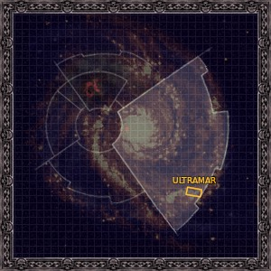

# 1059 艾克斯 Iax

精校状态：中文行文已逐段精校，部分术语仍为暂定

分类：地理 / 小行星 / 极限星域 Ultima Segmentum

原文来源：https://www.bilibili.com/opus/1074827991208427525

原作者：帝国神选罐头

原文时间：2025年06月05日 10:41

[返回分类目录](目录.md) · [全书目录](../../目录.md)

<!-- A1059-B0001 图片 -->

<!-- A1059-B0002 -->

原译文

Map 地图

**校订译文**

Map 地图

<!-- /A1059-B0002 -->

<!-- A1059-B0003 -->
### Basic Data 基本资料

原题：Basic Data 基础信息

<!-- /A1059-B0003 -->

<!-- A1059-B0004 -->
**英文原文**

Name:Iax

<!-- /A1059-B0004 -->

<!-- A1059-B0005 -->

原译文

名称：艾克斯

**校订译文**

名称：艾克斯

<!-- /A1059-B0005 -->

<!-- A1059-B0006 -->
**英文原文**

Segmentum:Ultima Segmentum

<!-- /A1059-B0006 -->

<!-- A1059-B0007 -->

原译文

星域：极限星域

**校订译文**

星域：极限星域

<!-- /A1059-B0007 -->

<!-- A1059-B0008 -->
**英文原文**

Sector:Ultima Sector

<!-- /A1059-B0008 -->

<!-- A1059-B0009 -->

原译文

星区：极限星区

**校订译文**

星区：极限星区

<!-- /A1059-B0009 -->

<!-- A1059-B0010 -->
**英文原文**

Subsector:Ultramar

<!-- /A1059-B0010 -->

<!-- A1059-B0011 -->

原译文

分区：奥特拉玛

**校订译文**

次星区：奥特拉玛

<!-- /A1059-B0011 -->

<!-- A1059-B0012 -->
**英文原文**

System:Iax System

<!-- /A1059-B0012 -->

<!-- A1059-B0013 -->

原译文

星系：艾克斯

**校订译文**

星系：艾克斯星系

<!-- /A1059-B0013 -->

<!-- A1059-B0014 -->
**英文原文**

Affiliation:Imperium

<!-- /A1059-B0014 -->

<!-- A1059-B0015 -->

原译文

隶属关系：帝国

**校订译文**

隶属关系：帝国

<!-- /A1059-B0015 -->

<!-- A1059-B0016 -->
**英文原文**

Class:Death World(former Paradise World/Agri World)

<!-- /A1059-B0016 -->

<!-- A1059-B0017 -->

原译文

类型：死亡世界（前天堂世界/农业世界）

**校订译文**

类型：死亡世界（前天堂世界/农业世界）

<!-- /A1059-B0017 -->

<!-- A1059-B0018 -->
**英文原文**

Iax, also known as the "Garden of Ultramar", is a planet in the stellar realm of Ultramar.

<!-- /A1059-B0018 -->

<!-- A1059-B0019 -->

原译文

艾克斯，也被称为“奥特拉玛的花园”，是奥特拉玛群星领域的一颗行星。

**校订译文**

艾克斯，也被称为“奥特拉玛的花园”，是奥特拉玛群星领域的一颗行星。

<!-- /A1059-B0019 -->

<!-- A1059-B0020 -->
## Overview 概述

<!-- /A1059-B0020 -->

<!-- A1059-B0021 -->
**英文原文**

Iax was an Agri World whose climate and fertility has made it one of the most productive worlds in the Imperium. There were no large cities on Iax, its land given over to producing quality food. The oldest and most urbanised area is the ancient fortress city of First Landing, its tall citadel withstanding the barrages of invaders over the centuries.

<!-- /A1059-B0021 -->

<!-- A1059-B0022 -->

原译文

艾克斯是一个农业世界，其气候和丰产能力使其成为帝国中生产力最高的世界之一。艾克斯上没有大城市，土地被用来生产优质食品。最古老、城市化程度最高的地区是古老的堡垒城市 首次登陆 ，其高大的城堡抵御了几个世纪以来的入侵者。

**校订译文**

艾克斯曾是一个农业世界，适宜的气候与肥沃土地使它跻身帝国最高产的世界之列。这里没有大型城市，土地主要用于生产优质粮食。最古老、开发程度最高的区域是初降城，一座古老的堡垒城市，其高耸堡垒曾抵挡数百年间历次入侵者的炮击。

<!-- /A1059-B0022 -->

<!-- A1059-B0023 -->
## History 历史

<!-- /A1059-B0023 -->

<!-- A1059-B0024 -->
**英文原文**

By the end of the Great Crusade, Iax was regarded as one of the most important worlds of Ultramar, on the same levels as Macragge, Konor, Occluda and Saramanth. Such was its standing that it was the domain of one of the Tetrarchs of Ultramar.

<!-- /A1059-B0024 -->

<!-- A1059-B0025 -->

原译文

到大远征结束时，艾克斯被视为奥特拉玛最重要的世界之一，与马库拉格、康诺、奥克鲁达和萨拉马斯处于同一水平。它的地位如此之高，以至于它是奥特拉玛英杰之一的领地。

**校订译文**

到大远征结束时，艾克斯已被视为奥特拉玛最重要的世界之一，与马库拉格、康诺、奥克鲁达和萨拉玛斯并列。它地位显赫，成为奥特拉玛一位四方领主的辖地。

<!-- /A1059-B0025 -->

<!-- A1059-B0026 -->
**英文原文**

During the Plague Wars, Iax became the site of major fighting. A group of Imperial Guard refugees brought to Iax were revealed to be unwitting Daemonic vessels, transforming them into Plaguebearers who managed to summon a cohort of Great Unclean Ones under Ku'gath. The Daemons summoned vast armies which ravaged the planet. Later, Roboute Guilliman and Mortarion engaged in a fateful duel on the planet as Imperial forces enacted Exterminatus. It is now a Death World which according to Guilliman will take centuries to be freed of corruption, if ever.

<!-- /A1059-B0026 -->

<!-- A1059-B0027 -->

原译文

在瘟疫战争期间，艾克斯成为了主要战斗的地点。一群被带到艾克斯的帝国卫队流亡者被揭露为不知情的恶魔战舰，将他们变成了瘟疫携带者，他们设法召集了一批在库噶斯之下的大不净者。恶魔召集了庞大的军队，摧毁了这个星球。后来，罗伯特·基里曼和莫塔里安在这个星球上进行了一场决定性的决斗，帝国军队发射了灭绝令。现在是一个死亡世界，根据基里曼的说法，如果有的话，需要几个世纪的时间才能摆脱腐化。

**校订译文**

瘟疫战争期间，艾克斯成为激战之地。一批被送往这里的帝国卫队难民，在不知情的情况下充当了恶魔容器，随后化为瘟疫使，并召来库噶斯麾下的一群大不净者。恶魔又召唤庞大军队，蹂躏整个行星。此后，帝国军队执行灭绝令之际，罗保特·基里曼与莫塔里安在这里展开了一场决定命运的决斗。如今，艾克斯已成为死亡世界。基里曼认为，即便还有可能清除污染，也至少需要数百年。

**校注：** Daemonic vessels为承载恶魔的躯壳或容器，原译“恶魔战舰”误认对象；Exterminatus是执行灭绝令，不是把命令当武器“发射”。

<!-- /A1059-B0027 -->

本篇核心术语与暂定项

以下列出本篇出现的英文原形及核心术语表用词。同形词可能指不同对象，具体词义以本篇正文和校注为准；单复数、别名和仅见于图注的名称可能尚未列入。完整候选见[术语表](../../术语表/双语术语候选.csv)。

| 英文 | 采用中文 | 状态 |
| --- | --- | --- |
| Imperial Guard | 帝国卫队 | 暂定·语境区分 |
| Roboute Guilliman | 罗保特·基里曼 | 官方已核对 |
| Ultramar | 奥特拉玛 | 官方已核对 |
| Imperium | 帝国 | 暂定·简称 |
| Great Crusade | 大远征 | 暂定·官方待核 |
| Mortarion | 莫塔里安 | 官方已核对 |
| Plague Wars | 瘟疫战争 | 暂定·官方待核 |
| Ultima Segmentum | 极限星域 | 暂定·官方待核 |
| Segmentum | 星域 | 暂定·官方待核 |
| Sector | 星区 | 暂定·官方待核 |
| Subsector | 次星区 | 暂定·官方待核 |
| Konor | 康诺 | 暂定·官方待核 |
| Iax | 艾克斯 | 暂定·官方待核 |
| Macragge | 马库拉格 | 暂定·官方待核 |
| Ancient | 旗手 | 官方已核对 |
| Invaders | 侵略者 | 暂定·官方待核 |
| Cohort | 大队 | 暂定·官方待核 |
| Plaguebearers | 瘟疫使 | 官方已核对 |
| Realm of Ultramar | 奥特拉玛领地 | 暂定·官方待核 |
| Iax System | 艾克斯星系 | 暂定·官方待核 |
| Occluda | 奥克鲁达 | 暂定·官方待核 |
| Saramanth | 萨拉玛斯 | 暂定·官方待核 |
| System | 星系（恒星系统） | 暂定·官方待核 |
| Death World | 死亡世界 | 暂定·官方待核 |
| Paradise World | 天堂世界 | 暂定·官方待核 |
| Corruption | 腐败 | 暂定·官方待核 |

