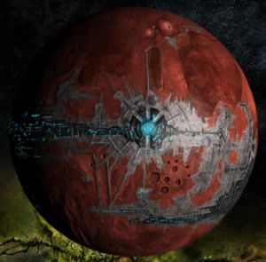

# 1063 康诺 Konor

精校状态：中文行文已逐段精校，部分术语仍为暂定

分类：地理 / 小行星 / 极限星域 Ultima Segmentum

原文来源：https://www.bilibili.com/opus/1159779244544360449

原作者：帝国神选罐头

原文时间：2026年01月20日 08:55

[返回分类目录](目录.md) · [全书目录](../../目录.md)

<!-- A1063-B0001 -->
### Basic Data 基本资料

原题：Basic Data 基础数据

<!-- /A1063-B0001 -->

<!-- A1063-B0002 -->
**英文原文**

Name:Konor

<!-- /A1063-B0002 -->

<!-- A1063-B0003 -->

原译文

名称“康诺”

**校订译文**

名称：康诺

<!-- /A1063-B0003 -->

<!-- A1063-B0004 -->
**英文原文**

Segmentum:Ultima Segmentum

<!-- /A1063-B0004 -->

<!-- A1063-B0005 -->

原译文

星域：极限星域

**校订译文**

星域：极限星域

<!-- /A1063-B0005 -->

<!-- A1063-B0006 -->
**英文原文**

Sector:Ultima Sector

<!-- /A1063-B0006 -->

<!-- A1063-B0007 -->

原译文

星区：极限星区

**校订译文**

星区：极限星区

<!-- /A1063-B0007 -->

<!-- A1063-B0008 -->
**英文原文**

Subsector:Ultramar

<!-- /A1063-B0008 -->

<!-- A1063-B0009 -->

原译文

分区：奥特拉玛

**校订译文**

次星区：奥特拉玛

<!-- /A1063-B0009 -->

<!-- A1063-B0010 -->
**英文原文**

System:Konor System

<!-- /A1063-B0010 -->

<!-- A1063-B0011 -->

原译文

星系：康诺星系

**校订译文**

星系：康诺星系

<!-- /A1063-B0011 -->

<!-- A1063-B0012 -->
**英文原文**

Population:4.89 billion

<!-- /A1063-B0012 -->

<!-- A1063-B0013 -->

原译文

人口：48亿9000万

**校订译文**

人口：48亿9000万

<!-- /A1063-B0013 -->

<!-- A1063-B0014 -->
**英文原文**

Affiliation:Imperium

<!-- /A1063-B0014 -->

<!-- A1063-B0015 -->

原译文

隶属：帝国

**校订译文**

隶属：帝国

<!-- /A1063-B0015 -->

<!-- A1063-B0016 -->
**英文原文**

Class:Forge World

<!-- /A1063-B0016 -->

<!-- A1063-B0017 -->

原译文

类别：铸造世界

**校订译文**

类别：铸造世界

<!-- /A1063-B0017 -->

<!-- A1063-B0018 -->
**英文原文**

Tithe Grade:CLASSIFIED

<!-- /A1063-B0018 -->

<!-- A1063-B0019 -->

原译文

什一税等级：机密

**校订译文**

什一税等级：机密

<!-- /A1063-B0019 -->

<!-- A1063-B0020 图片 -->

<!-- A1063-B0021 -->

原译文

Planetary Image 行星图像

**校订译文**

Planetary Image 行星图像

<!-- /A1063-B0021 -->

<!-- A1063-B0022 -->
**英文原文**

Konor is an Adeptus Mechanicus Forge World in the Realm of Ultramar. It is currently one of four "ruling" planets overseeing a sector of the realm, and administered by a Tetrarch of Ultramar.

<!-- /A1063-B0022 -->

<!-- A1063-B0023 -->

原译文

康诺是奥特拉玛王国的一个机械神教铸造世界。它目前是监督该领域一个星区的四个“统治”行星之一，由奥特拉马英杰管理。

**校订译文**

康诺是奥特拉玛境内的机械修会铸造世界。如今，它是四个负责统辖辖区的中枢世界之一，由一位奥特拉玛四方领主管理。

**校注：** 此处sector按辖区理解；正文未列具体星区名，不与上方极限星区层级强行等同。Tetrarch统一四方领主。

<!-- /A1063-B0023 -->

<!-- A1063-B0024 -->

原译文

History 历史

**校订译文**

History 历史

<!-- /A1063-B0024 -->

<!-- A1063-B0025 -->
### Early History 早期历史

<!-- /A1063-B0025 -->

<!-- A1063-B0026 -->
**英文原文**

The planet was presumably named after Konor Guilliman, the adoptive father of the primarch Roboute Guilliman. Originally a quasi-Forge World, at the time of the Great Crusade Konor was one of the key worlds of Ultramar alongside places like Macragge, Armatura, Iax, and Calth. Alongside Calth, Konor was the primary shipbuilder of Ultramar, and such was its importance that one of the four Tetrarchs of Ultramar was from the planet.

<!-- /A1063-B0026 -->

<!-- A1063-B0027 -->

原译文

这颗行星很可能是以原体罗伯特·基里曼的养父康诺·基里曼命名的。康诺最初是一个准铸造世界，在大远征时期，它是奥特拉玛的关键世界之一，与马库拉格、阿玛图拉、艾克斯和考斯等地并列。与考斯一起，康诺是奥特拉玛的主要造船厂，其重要性在于极限战士的四位英杰之一来自行星。

**校订译文**

这颗行星很可能以罗保特·基里曼的养父康诺·基里曼命名。它最初是准铸造世界，大远征时期与马库拉格、阿玛图拉、艾克斯、考斯等地同为奥特拉玛的重要世界。康诺与考斯共同承担着奥特拉玛主要造舰任务，地位举足轻重，四位四方领主之一便出身于此。

<!-- /A1063-B0027 -->

<!-- A1063-B0028 -->
**英文原文**

However, while its moon of Gantz was a fully-fledged Forge World, Konor itself was not granted such honour; this distinction was mainly due to politics, as Mars saw the planet as subservient to Ultramar and not the Mechanicum. As a result of this, tensions arose between the Tech-Priest factions of Konor and, during the Battle of Calth, some questioned if they should side with Warmaster Horus. This led to a long delay in reinforcements from Konor to aid the Ultramarines battling the Word Bearers. However, in the end, Konor remained true to Guilliman and sent reinforcements.

<!-- /A1063-B0028 -->

<!-- A1063-B0029 -->

原译文

然而，虽然它的卫星甘茨是一个成熟的铸造世界，但康诺本身并没有获得这样的荣誉；这种区别主要是由于政治，因为火星认为这颗行星服从于奥特拉玛，而不是机械教。因此，康诺的技术神甫派系之间出现了紧张局势，在考斯之战中，一些人质疑他们是否应该站在战帅荷鲁斯一边。这导致来自康诺的增援部队长期拖延，以协助极限战士与怀言者作战。然而，最终，康诺仍然忠于基里曼，并派遣了增援部队。

**校订译文**

尽管卫星甘茨早已获得正式铸造世界地位，康诺本身却未获同等承认，原因主要在于政治：火星认为康诺臣服于奥特拉玛，而非机械教。这导致当地技术祭司各派关系紧张。考斯之战期间，有人甚至考虑投向战帅荷鲁斯，使支援极限战士抗击怀言者的援军迟迟无法出发。最终，康诺仍忠于基里曼，派出了增援。

<!-- /A1063-B0029 -->

<!-- A1063-B0030 -->
### Post-Heresy 荷鲁斯之乱后

原题：Post-Heresy 叛乱后

<!-- /A1063-B0030 -->

<!-- A1063-B0031 -->
**英文原文**

Konor was reclassified as a full Forge World after the Heresy, but at some point was degraded to a mere Research Station. As of 992.M41, Konor provided 53.94% of the promethium fuel for the Konor System.

<!-- /A1063-B0031 -->

<!-- A1063-B0032 -->

原译文

叛乱之后，康诺被重新归类为一个完整的铸造世界，但在某个时候，它被降级为一个纯粹的研究站。截至992.M41，康诺为康诺星系提供了53.94%的钷燃料。

**校订译文**

荷鲁斯之乱后，康诺被重新认定为正式铸造世界，但后来一度被降为研究站。截至992.M41，它为整个康诺星系供应53.94%的钷燃料。

<!-- /A1063-B0032 -->

<!-- A1063-B0033 -->
**英文原文**

Following the rebirth of Roboute Guilliman and the reorganization of the Realm of Ultramar in early M42, Konor was made the headquarters of the northern reaches. It is overseen by Tetrarch Severus Agemman.

<!-- /A1063-B0033 -->

<!-- A1063-B0034 -->

原译文

随着罗伯特·基里曼的重生和M42早期奥特拉玛王国的重组，康诺成为北部地区的总部。它由英杰西弗勒斯·阿格曼监督。

**校订译文**

M42初期，罗保特·基里曼复生并重组奥特拉玛后，康诺成为北部辖区的中枢，由四方领主西弗勒斯·阿格曼统辖。

<!-- /A1063-B0034 -->

<!-- A1063-B0035 -->
**英文原文**

By the time of the Plague Wars, Konor seemed to have formally regained its classification as a Forge World. In the course of this conflict, the Konor System was invaded by the Death Guard during the Invasion of Konor, as Mortarion intended to use the system as a staging ground in an effort to break through to the Capital of Ultramar. Konor held, however, and the invaders were repulsed due to determined resistance by its inhabitants as well as reinforcements brought by Guilliman himself.

<!-- /A1063-B0035 -->

<!-- A1063-B0036 -->

原译文

到瘟疫战争时，康诺似乎已经正式恢复了铸造世界的分类。在这场冲突中，死亡守卫在康诺入侵期间入侵了康诺星系，因为莫塔里安打算将该星系用作中转站，以突破奥特拉马的首都。然而，康诺坚持了下来，由于其居民的坚决抵抗以及基里曼本人带来的增援，入侵者被击退。

**校订译文**

瘟疫战争时期，康诺似乎已正式恢复铸造世界地位。莫塔里安企图以这里为前进基地，进逼奥特拉玛首都，于是派死亡守卫入侵康诺星系。然而，当地居民顽强抵抗，基里曼又亲率援军赶到，康诺最终守住，入侵者被击退。

<!-- /A1063-B0036 -->

<!-- A1063-B0037 -->
## Planetary Data 行星数据

<!-- /A1063-B0037 -->

<!-- A1063-B0038 -->
**英文原文**

Orbital Distance: 1.09 AU

<!-- /A1063-B0038 -->

<!-- A1063-B0039 -->

原译文

轨道距离：1.09天文单位

**校订译文**

轨道距离：1.09天文单位

<!-- /A1063-B0039 -->

<!-- A1063-B0040 -->
**英文原文**

Gravitation: 1.198G

<!-- /A1063-B0040 -->

<!-- A1063-B0041 -->

原译文

重力：1.198G

**校订译文**

重力：1.198G

<!-- /A1063-B0041 -->

<!-- A1063-B0042 -->
**英文原文**

Temperature: 29.6°С

<!-- /A1063-B0042 -->

<!-- A1063-B0043 -->

原译文

温度：29.6°С

**校订译文**

温度：29.6°С

<!-- /A1063-B0043 -->

<!-- A1063-B0044 -->
**英文原文**

Aestimare: AAA/3

<!-- /A1063-B0044 -->

<!-- A1063-B0045 -->

原译文

评估：AAA/3

**校订译文**

评估：AAA/3

<!-- /A1063-B0045 -->

本篇核心术语与暂定项

以下列出本篇出现的英文原形及核心术语表用词。同形词可能指不同对象，具体词义以本篇正文和校注为准；单复数、别名和仅见于图注的名称可能尚未列入。完整候选见[术语表](../../术语表/双语术语候选.csv)。

| 英文 | 采用中文 | 状态 |
| --- | --- | --- |
| Adeptus Mechanicus | 机械修会 | 官方已核对 |
| Death Guard | 死亡守卫 | 官方已核对 |
| Roboute Guilliman | 罗保特·基里曼 | 官方已核对 |
| Ultramar | 奥特拉玛 | 官方已核对 |
| Ultramarines | 极限战士 | 官方已核对 |
| Imperium | 帝国 | 暂定·简称 |
| Mechanicum | 机械教 | 暂定·历史称谓 |
| Tech-Priest | 技术祭司 | 官方已核对 |
| Primarch | 原体 | 官方已核对 |
| Forge World | 铸造世界 | 暂定·官方待核 |
| Word Bearers | 怀言者 | 暂定·官方待核 |
| Great Crusade | 大远征 | 暂定·官方待核 |
| Mortarion | 莫塔里安 | 官方已核对 |
| Horus | 荷鲁斯 | 暂定·官方待核 |
| Plague Wars | 瘟疫战争 | 暂定·官方待核 |
| Ultima Segmentum | 极限星域 | 暂定·官方待核 |
| Segmentum | 星域 | 暂定·官方待核 |
| Sector | 星区 | 暂定·官方待核 |
| Subsector | 次星区 | 暂定·官方待核 |
| Mars | 火星 | 暂定·官方待核 |
| Konor | 康诺 | 暂定·官方待核 |
| Iax | 艾克斯 | 暂定·官方待核 |
| Calth | 考斯 | 暂定·官方待核 |
| Macragge | 马库拉格 | 暂定·官方待核 |
| Aestimare | 战略价值评级 | 暂定·官方待核 |
| Tech | 技术语 | 暂定·官方待核 |
| Severus Agemman | 西弗勒斯·阿格曼 | 暂定·官方待核 |
| Invaders | 侵略者 | 暂定·官方待核 |
| Tetrarch | 四方领主 | 暂定·官方待核 |
| Battle of Calth | 考斯之战 | 暂定·官方待核 |
| Severus | 西弗勒斯 | 暂定·官方待核 |
| Realm of Ultramar | 奥特拉玛领地 | 暂定·官方待核 |
| Konor System | 康诺星系 | 暂定·官方待核 |
| Armatura | 阿玛图拉 | 暂定·官方待核 |
| The Key | 钥匙 | 暂定·官方待核 |
| System | 星系（恒星系统） | 暂定·官方待核 |
| Gantz | 甘茨 | 暂定·官方待核 |
| Promethium | 钷素 | 暂定·官方待核 |

