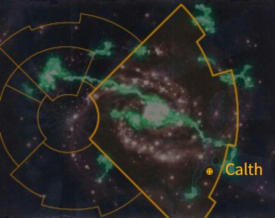
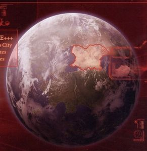
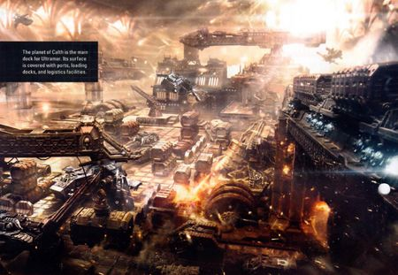

# 1064 考斯 Calth

精校状态：中文行文已逐段精校，部分术语仍为暂定

分类：地理 / 小行星 / 极限星域 Ultima Segmentum

原文来源：https://www.bilibili.com/opus/1164954031623241737

原作者：帝国神选罐头

原文时间：2026年02月03日 07:36

[返回分类目录](目录.md) · [全书目录](../../目录.md)

<!-- A1064-B0001 图片 -->

<!-- A1064-B0002 -->

原译文

Map 地图

**校订译文**

Map 地图

<!-- /A1064-B0002 -->

<!-- A1064-B0003 -->
### Basic Data 基本资料

原题：Basic Data 基础数据

<!-- /A1064-B0003 -->

<!-- A1064-B0004 -->
**英文原文**

Name:Calth

<!-- /A1064-B0004 -->

<!-- A1064-B0005 -->

原译文

名称：考斯

**校订译文**

名称：考斯

<!-- /A1064-B0005 -->

<!-- A1064-B0006 -->
**英文原文**

Segmentum:Ultima Segmentum

<!-- /A1064-B0006 -->

<!-- A1064-B0007 -->

原译文

星域：极限星域

**校订译文**

星域：极限星域

<!-- /A1064-B0007 -->

<!-- A1064-B0008 -->
**英文原文**

Sector:Ultima Sector

<!-- /A1064-B0008 -->

<!-- A1064-B0009 -->

原译文

星区：极限星区

**校订译文**

星区：极限星区

<!-- /A1064-B0009 -->

<!-- A1064-B0010 -->
**英文原文**

Subsector:Ultramar

<!-- /A1064-B0010 -->

<!-- A1064-B0011 -->

原译文

分区：奥特拉玛

**校订译文**

次星区：奥特拉玛

<!-- /A1064-B0011 -->

<!-- A1064-B0012 -->
**英文原文**

System:Veridia System

<!-- /A1064-B0012 -->

<!-- A1064-B0013 -->

原译文

星系：维瑞迪亚星系

**校订译文**

星系：维里迪亚星系

**校注：** Veridia / Veridian按核心定译统一维里迪亚星系；英文形式原样保留，勿与人物Veridia Force混同。

<!-- /A1064-B0013 -->

<!-- A1064-B0014 -->
**英文原文**

Affiliation:Imperium

<!-- /A1064-B0014 -->

<!-- A1064-B0015 -->

原译文

隶属：帝国

**校订译文**

隶属：帝国

<!-- /A1064-B0015 -->

<!-- A1064-B0016 -->
**英文原文**

Class:Civilised World, Death World

<!-- /A1064-B0016 -->

<!-- A1064-B0017 -->

原译文

类别：文明世界，死亡世界

**校订译文**

类别：文明世界，死亡世界

<!-- /A1064-B0017 -->

<!-- A1064-B0018 图片 -->

<!-- A1064-B0019 -->

原译文

Planetary Image 行星图像

**校订译文**

Planetary Image 行星图像

<!-- /A1064-B0019 -->

<!-- A1064-B0020 -->
**英文原文**

Calth is part of Ultramar, the Realm of the Ultramarines. It is an airless world, and its surface is uninhabitable due to the deadly light of its blue sun. Despite this barren appearance, it is one of the most productive worlds in Ultramar; its population inhabits massive underground cavern-cities, and its orbital shipyards are renowned throughout the Imperium.

<!-- /A1064-B0020 -->

<!-- A1064-B0021 -->

原译文

考斯是奥特拉玛 - 极限战士的王国 - 的一部分。这是一个没有空气的世界，由于其蓝色太阳的致命光芒，其表面无法居住。尽管外观贫瘠，但它是奥特拉玛中生产力最高的世界之一；它的人口居住在巨大的地下洞穴城市，它的轨道造船厂在整个帝国都很有名。

**校订译文**

考斯是极限战士领地奥特拉玛的一部分。这里没有大气，蓝色恒星释放的致命光芒使地表无法居住。尽管外观荒芜，它仍是奥特拉玛最高产的世界之一：居民生活在庞大的地下洞穴城市中，轨道造船厂则闻名整个帝国。

<!-- /A1064-B0021 -->

<!-- A1064-B0022 图片 -->

<!-- A1064-B0023 -->

原译文

Docking and orbital shipyards of Calth 考斯船坞和轨道船厂

**校订译文**

Docking and orbital shipyards of Calth 考斯船坞和轨道船厂

<!-- /A1064-B0023 -->

<!-- A1064-B0024 -->
## History 历史

<!-- /A1064-B0024 -->

<!-- A1064-B0025 -->
### Pre-Heresy 荷鲁斯之乱前

原题：Pre-Heresy 叛乱前

<!-- /A1064-B0025 -->

<!-- A1064-B0026 -->
**英文原文**

The world of Calth had maintained contact with its neighbouring systems, including Macragge, allowing it to survive the chaos of the Age of Strife largely intact.

<!-- /A1064-B0026 -->

<!-- A1064-B0027 -->

原译文

考斯世界与包括马库拉格在内的邻近星系保持联系，使其能够在纷争时代的混乱中基本完好无损地生存下来。

**校订译文**

考斯世界与包括马库拉格在内的邻近星系保持联系，使其能够在纷争时代的混乱中基本完好无损地生存下来。

<!-- /A1064-B0027 -->

<!-- A1064-B0028 -->
**英文原文**

Early in the rise of Roboute Guilliman, Calth became part of the new Ultramar empire. When Guilliman met the Emperor of Mankind, Calth became part of the greater Imperium.

<!-- /A1064-B0028 -->

<!-- A1064-B0029 -->

原译文

在罗伯特·基里曼崛起的早期，考斯成为了新的奥特拉玛帝国的一部分。当基里曼遇到人类帝皇时，考斯成为了更大帝国的一部分。

**校订译文**

罗保特·基里曼崛起之初，考斯便加入了新兴的奥特拉玛帝国。基里曼与人类帝皇相认后，考斯也随之纳入更广大的人类帝国。

<!-- /A1064-B0029 -->

<!-- A1064-B0030 -->
**英文原文**

By the end of the Great Crusade, Calth had become one of the most important worlds of Ultramar alongside Macragge, Saramanth, Konor, Occluda, Iax and Armatura. It was believed that Calth would soon control its own fiefdom of Ultramar, with its own Tetrarch ruling the planet. There were even plans to install a superorbital plate above the planet.

<!-- /A1064-B0030 -->

<!-- A1064-B0031 -->

原译文

到大远征结束时，考斯已经成为奥特拉玛最重要的行星之一，与马库拉格、萨拉曼斯、康诺、奥克卢达、艾克斯和阿马图拉并列。人们相信，考斯很快就会控制自己的奥特拉玛封地，由自己的英杰统治这个行星。甚至有计划在行星上方安装一个超轨道平台。

**校订译文**

到大远征结束时，考斯已与马库拉格、萨拉玛斯、康诺、奥克鲁达、艾克斯和阿玛图拉并列，成为奥特拉玛最重要的世界之一。人们预计，考斯很快便会获得自己的奥特拉玛辖地，由驻于此地的四方领主统治，甚至已计划在行星上空架设超轨道平台。

<!-- /A1064-B0031 -->

<!-- A1064-B0032 -->
### The Horus Heresy 荷鲁斯之乱

原题：The Horus Heresy 荷鲁斯叛乱

<!-- /A1064-B0032 -->

<!-- A1064-B0033 -->
**英文原文**

Some time after the primarch Horus was named Warmaster of the Great Crusade by the Emperor of Mankind, he ordered Roboute Guilliman and Lorgar Aurelian to prepare their Legions (the Ultramarines and Word Bearers, respectively) for a planned campaign against the orks of the Ghaslakh xenohold. Calth was chosen as the mustering world for the crusade, due to its extensive orbital docking network.

<!-- /A1064-B0033 -->

<!-- A1064-B0034 -->

原译文

在人类帝皇任命荷鲁斯为大远征的战帅一段时间后，他命令罗伯特·基里曼和珞珈·奥瑞利安准备他们的军团（分别是极限战士和怀言者），为有计划的对抗加斯拉克异型种族的战役做准备。由于其广泛的轨道停靠网络，考斯被选为远征的集结地。

**校订译文**

帝皇任命荷鲁斯为大远征战帅后不久，荷鲁斯命罗保特·基里曼与珞珈·奥瑞利安备战，准备分别率极限战士和怀言者进攻加斯拉克异形据点的欧克。考斯拥有庞大的轨道停泊网络，因此被选为远征集结地。

<!-- /A1064-B0034 -->

<!-- A1064-B0035 -->
**英文原文**

However, this was a ruse on Horus' part, done in preparation for his great rebellion against the Imperium. In one of the first actions of the Horus Heresy, the Word Bearers (who, having fallen to Chaos, had joined Horus' Traitor Legions), launched an ambush against the Loyalist Imperial forces on Calth, hoping to cripple the Ultramarines so they would not be able to stop Horus. Eventually the Ultramarines and other Loyalist forces emerged victorious, but millions of civilians died in the Word Bearers' cataclysmic attack, which permanently stripped away Calth's atmosphere and poisoned the Veridian sun's radiation, making it impossible for any life to survive above ground without shelter. Thereafter, Calth's entire population occupied the vast cavern cities, with the exception of a few heavily shielded starports and surface cities.

<!-- /A1064-B0035 -->

<!-- A1064-B0036 -->

原译文

然而，这是荷鲁斯的一个诡计，为他反抗帝国的大叛乱做准备。在荷鲁斯叛乱的首批行动之一中，怀言者（他们已经堕入混沌，加入了荷鲁斯的叛徒军团）在考斯对忠诚的帝国军队发动了伏击，希望削弱极限战士，这样他们就无法阻止荷鲁斯。最终，极限战士和其他忠诚派部队取得了胜利，但数百万平民在怀言者的灾难性袭击中丧生，这场袭击永久性地剥夺了考斯的大气层，毒害了维瑞迪亚的太阳辐射，使任何生命都不可能在没有避难所的情况下在地面上生存。此后，考斯的全部人口占领了广阔的洞穴城市，除了一些屏蔽严密的星际港口和地表城市。

**校订译文**

然而，这只是荷鲁斯为叛乱预设的圈套。在荷鲁斯之乱最初的一系列行动中，已经投向混沌并加入叛军的怀言者，伏击了考斯上的帝国忠诚派军队，企图重创极限战士，使其无力阻止荷鲁斯。极限战士及其他忠诚派最终取胜，但数百万平民死于怀言者的灾难性攻击。考斯的大气被永久剥离，维里迪亚恒星的辐射也被毒化，使任何生命都无法在缺乏遮蔽的地表存活。此后，除少数拥有强大屏障的星港和地表城市外，居民全部迁入庞大的洞穴城市。

<!-- /A1064-B0036 -->

<!-- A1064-B0037 -->
### War of the Beast 野兽战争

<!-- /A1064-B0037 -->

<!-- A1064-B0038 -->
**英文原文**

1,500 years later during the War of the Beast, Calth was attacked by an Ork Attack Moon, which was ultimately destroyed by the Ultramarines.

<!-- /A1064-B0038 -->

<!-- A1064-B0039 -->

原译文

1500年后，在野兽战争期间，考斯遭到了欧克攻击月亮的袭击，最终被极限战士摧毁。

**校订译文**

1500年后的野兽战争期间，一颗欧克攻击月亮进攻考斯，最终被极限战士摧毁。

<!-- /A1064-B0039 -->

<!-- A1064-B0040 -->
### Hive Fleet Behemoth 虫巢舰队贝希摩斯

<!-- /A1064-B0040 -->

<!-- A1064-B0041 -->
**英文原文**

Hive Fleet Behemoth's invasion of Calth was spearheaded by Old One Eye, a unique Carnifex with the ability to heal from mortal wounds. Its rampage was finally stopped when a forgotten hero of the Imperium fired a Plasma Pistol through its eye and into its brain. Decades after Behemoth had been driven from Calth, a band of smugglers stumbled across Old One Eye's body frozen intact in the ice-packs of Calth. They thawed it out hoping to get a bounty for the corpse, but Old One Eye's grievous wounds instantly began to heal. It soon awoke and slaughtered the smugglers. A series of Tyranid raids followed. Land conveys were destroyed, hab-domes smashed and entire populations massacred. Lesser Tyranid creatures such as Termagants and Genestealers, also left behind from Behemoth's invasion, were drawn to Old One Eye's presence as a dominant leader. The people of Calth cried out for aid, and they were answered by Scout Sergeant Telion of the Ultramarines. Telion tracked down Old One Eye, but found it difficult to pierce its armoured flanks. As Telion's warriors were cut to pieces by the beast, Telion made a one-in-a-million shot that hit its ruined eye-socket. Old One Eye was overcome with pain and stumbled into a cavernous ravine. Telion led a search for the body, but Old One Eye was never found. There have since been several reports of Carnifexes matching its description causing havoc across Ultramar and beyond.

<!-- /A1064-B0041 -->

<!-- A1064-B0042 -->

原译文

虫巢舰队贝希摩斯对考斯的入侵是由老独眼率先发起的，这是一个独特的刽子手，能够治愈致命的伤口。当一位被遗忘的帝国英雄用等离子手枪穿过它的眼睛并射入它的大脑时，它的暴行终于停止了。在贝希摩斯被赶出考斯几十年后，一群走私者偶然发现了老独眼的尸体被完整地冷冻在考斯的冰层中。他们解冻了它，希望能得到尸体的赏金，但老独眼的重伤立刻开始愈合。它很快醒来，屠杀了走私者。随后，泰伦发动了一系列突袭。陆路运输被摧毁，港口穹顶被砸碎，全体民众被屠杀。小型泰伦生物，如枪虫和基因窃取者，也被贝希摩斯的入侵所留下，被老独眼作为主导领袖的存在所吸引。考斯的人们大声呼救，他们得到了极限战士的侦察兵军士泰利昂的回应。泰利昂找到了老独眼，但发现很难刺穿它的装甲侧翼。当泰利昂的战士被野兽切成碎片时，泰利昂开了一枪，射中了它被毁的眼眶。老独眼痛苦万分，跌跌撞撞地掉进了一个洞穴般的峡谷。泰利昂带领搜寻尸体，但老独眼始终没有找到。此后，有几份报告称，与其描述相符的刽子手，在奥特拉玛及其他地区造成了严重破坏。

**校订译文**

贝希摩斯虫巢舰队入侵考斯时，由一只能够从致命伤中自愈的特殊刽子手——老独眼——充当前锋。一位姓名已被遗忘的帝国英雄，用等离子手枪从眼部射入它的大脑，才终于阻止了这头怪兽。贝希摩斯被逐出考斯数十年后，一伙走私者偶然发现它的尸体完好地冻在冰层里。他们希望凭尸体领取赏金，于是将其解冻，老独眼的重伤却立即开始愈合。它很快苏醒，屠杀走私者，引发此后的一系列泰伦袭击：陆路车队遭毁，居住穹顶被砸烂，整片聚居区的居民被杀光。贝希摩斯入侵后遗留的枪虫、基因窃取者等较低阶生物，也被这头强大的首领吸引过来。考斯居民呼救，极限战士侦察军士泰利昂应召而至。他追踪到老独眼，却难以击穿它的侧面甲壳。怪兽将他的战士撕成碎片之际，泰利昂打出几乎不可能命中的一枪，击中它破损的眼窝。老独眼痛苦失控，踉跄跌入深邃峡谷。泰利昂率队搜寻，却始终未能找到尸体。此后，奥特拉玛乃至更远的地方屡有报告，称外形符合老独眼特征的刽子手正在肆虐。

**校注：** hab-domes为居住穹顶，原港口穹顶误译；one-in-a-million shot的极低命中概率已补回。尸体未找到的限定保留。

<!-- /A1064-B0042 -->

<!-- A1064-B0043 -->
### Invasion of Ultramar 入侵奥特拉玛

<!-- /A1064-B0043 -->

<!-- A1064-B0044 -->
**英文原文**

Calth was the location of some of the fiercest fighting of the Invasion of Ultramar by the Chaos warband known as the Bloodborn. The planet was attacked by a Grand Company of the Iron Warriors and a host of other mercenaries, led in person by Warsmith Honsou. Honsou had been "ordered" by the Daemon Prince M'kar to find and destroy the tomb of Remus Ventanus, who had led the defense of Calth during the Heresy. Entombed with Ventanus was the Shard of Erebus, a strange ancient weapon that had the power to destroy M'kar. Honsou's attack failed, but Captain Ventris retrieved the weapon and took it to Talassar, where M'kar was destroyed permanently.

<!-- /A1064-B0044 -->

<!-- A1064-B0045 -->

原译文

卡尔特是被称为血裔的混沌战帮入侵奥特拉玛的一些最激烈战斗的地点。这颗行星遭到了钢铁勇士大连和其他许多雇佣兵的袭击，这些雇佣兵由战争铁匠洪索亲自率领。洪索被恶魔王子姆'卡“命令”找到并摧毁雷穆斯·文塔努斯的坟墓，他在叛乱期间领导了考斯的防御。与文塔努斯一起埋葬的是艾瑞巴斯的碎片，这是一种奇怪的古代武器，有能力摧毁姆'卡。洪索的攻击失败了，但文崔斯连长取回了武器并将其带到了塔拉萨，在那里姆'卡被永久摧毁。

**校订译文**

血裔混沌战帮入侵奥特拉玛时，考斯是战况最惨烈的地点之一。战争铁匠洪索亲率钢铁勇士一个大连及大量其他雇佣部队进攻这里。恶魔王子姆’卡尔“命令”他找到并摧毁雷穆斯·文坦努斯的陵墓；文坦努斯曾在荷鲁斯之乱期间指挥考斯防御。与他一同下葬的艾瑞巴斯碎片，是一件能彻底毁灭姆’卡尔的奇异古老武器。洪索的攻势失败，但文崔斯连长取出了这件武器，将其带往塔拉萨，并在那里彻底消灭姆’卡尔。

<!-- /A1064-B0045 -->

<!-- A1064-B0046 -->
## Geography 地理

<!-- /A1064-B0046 -->

<!-- A1064-B0047 -->
### Notable Locations 著名地点

<!-- /A1064-B0047 -->

<!-- A1064-B0048 -->

原译文

Barrtor 巴托尔

**校订译文**

Barrtor 巴托尔

<!-- /A1064-B0048 -->

<!-- A1064-B0049 -->

原译文

Boros River 博洛斯河

**校订译文**

Boros River 博洛斯河

<!-- /A1064-B0049 -->

<!-- A1064-B0050 -->

原译文

Caren Province 卡伦行省

**校订译文**

Caren Province 卡伦行省

<!-- /A1064-B0050 -->

<!-- A1064-B0051 -->
**英文原文**

Dera Caren Lowlands — Devastated during the Battle of Calth.

<!-- /A1064-B0051 -->

<!-- A1064-B0052 -->

原译文

德拉卡伦低地 — 在考斯之战中被摧毁。

**校订译文**

德拉卡伦低地 — 在考斯之战中被摧毁。

<!-- /A1064-B0052 -->

<!-- A1064-B0053 -->

原译文

Erud Province 博学行省

**校订译文**

Erud Province 博学行省

<!-- /A1064-B0053 -->

<!-- A1064-B0054 -->

原译文

Guilliman's Gate 基里曼之门

**校订译文**

Guilliman's Gate 基里曼之门

<!-- /A1064-B0054 -->

<!-- A1064-B0055 -->

原译文

Ithraca 伊萨卡

**校订译文**

Ithraca 伊萨卡

<!-- /A1064-B0055 -->

<!-- A1064-B0056 -->
**英文原文**

Lanshear — City-sized starport. Devastated during the Battle of Calth.

<!-- /A1064-B0056 -->

<!-- A1064-B0057 -->

原译文

兰希尔 — 城市大小的星港。在考斯之战中被摧毁。

**校订译文**

兰希尔 — 城市大小的星港。在考斯之战中被摧毁。

<!-- /A1064-B0057 -->

<!-- A1064-B0058 -->

原译文

Leptius Numinus 莱普提乌斯·努米努斯

**校订译文**

Leptius Numinus 莱普提乌斯·努米努斯

<!-- /A1064-B0058 -->

<!-- A1064-B0059 -->
**英文原文**

Mercius — Devastated during the Battle of Calth.

<!-- /A1064-B0059 -->

<!-- A1064-B0060 -->

原译文

墨丘斯 — 在考斯之战中被摧毁。

**校订译文**

墨丘斯 — 在考斯之战中被摧毁。

<!-- /A1064-B0060 -->

<!-- A1064-B0061 -->

原译文

Neride 涅瑞德

**校订译文**

Neride 涅瑞德

<!-- /A1064-B0061 -->

<!-- A1064-B0062 -->
**英文原文**

Numinus City — Devastated during the Battle of Calth.

<!-- /A1064-B0062 -->

<!-- A1064-B0063 -->

原译文

纽米纳斯城 — 在考斯之战中被摧毁。

**校订译文**

纽米纳斯城 — 在考斯之战中被摧毁。

<!-- /A1064-B0063 -->

<!-- A1064-B0064 -->

原译文

Ourosene Hills 乌罗森山丘

**校订译文**

Ourosene Hills 乌罗森山丘

<!-- /A1064-B0064 -->

<!-- A1064-B0065 -->

原译文

Persephone Gate 珀耳塞福涅之门

**校订译文**

Persephone Gate 珀耳塞福涅之门

<!-- /A1064-B0065 -->

<!-- A1064-B0066 -->
**英文原文**

Ultimus Prime — Also known as Highside City.

<!-- /A1064-B0066 -->

<!-- A1064-B0067 -->

原译文

终极至尊 — 也被称为高侧城。

**校订译文**

乌尔提穆斯主城——又称高侧城。

**校注：** Ultimus Prime此处为城市名，不是“终极至尊”的人物尊号，暂音译并加主城消歧；别名Highside City沿高侧城。

<!-- /A1064-B0067 -->

<!-- A1064-B0068 -->
**英文原文**

Vollard Meadows — Agri-region.

<!-- /A1064-B0068 -->

<!-- A1064-B0069 -->

原译文

沃拉尔德草地 — 农业地区Native Wildlife 本土野生动物

**校订译文**

沃拉尔德草地——农业地区。

Native Wildlife 本土野生动物

<!-- /A1064-B0069 -->

<!-- A1064-B0070 -->

原译文

Swartgrass 黑草

**校订译文**

Swartgrass 黑草

<!-- /A1064-B0070 -->

<!-- A1064-B0071 -->
### Notable Scions of Calth 著名考斯裔

<!-- /A1064-B0071 -->

<!-- A1064-B0072 -->
**英文原文**

Uriel Ventris, Space Marine Captain of the Ultramarines 4th Company.

<!-- /A1064-B0072 -->

<!-- A1064-B0073 -->

原译文

乌瑞尔·文崔斯，极限战士第四连队的星际战士连长。

**校订译文**

乌瑞尔·文崔斯，极限战士第四连队的星际战士连长。

<!-- /A1064-B0073 -->

<!-- A1064-B0074 -->
**英文原文**

Pasanius Lysane, Space Marine Sergeant of the Ultramarines 4th Company.

<!-- /A1064-B0074 -->

<!-- A1064-B0075 -->

原译文

帕撒尼乌斯·莱萨尼，极限战士第四连队的星际战士军士。

**校订译文**

帕撒尼乌斯·莱萨尼，极限战士第四连队的星际战士军士。

<!-- /A1064-B0075 -->

<!-- A1064-B0076 -->
**英文原文**

Arbute, seneschal.

<!-- /A1064-B0076 -->

<!-- A1064-B0077 -->

原译文

阿尔布特，总管。

**校订译文**

阿尔布特，总管。

<!-- /A1064-B0077 -->

<!-- A1064-B0078 -->
**英文原文**

Darial, seneschal.

<!-- /A1064-B0078 -->

<!-- A1064-B0079 -->

原译文

达里尔，总管。

**校订译文**

达里尔，总管。

<!-- /A1064-B0079 -->

<!-- A1064-B0080 -->
**英文原文**

Eterwin, seneschal.

<!-- /A1064-B0080 -->

<!-- A1064-B0081 -->

原译文

埃特温，总管。

**校订译文**

埃特温，总管。

<!-- /A1064-B0081 -->

<!-- A1064-B0082 -->

原译文

#战锤40k##地理##极限星域##极限星区##奥特拉玛##维瑞迪亚星系##文明世界##死亡世界##考斯#

**校订译文**

编目标签：战锤40k、地理、极限星域、极限星区、奥特拉玛、维里迪亚星系、文明世界、死亡世界、考斯。

<!-- /A1064-B0082 -->

本篇核心术语与暂定项

以下列出本篇出现的英文原形及核心术语表用词。同形词可能指不同对象，具体词义以本篇正文和校注为准；单复数、别名和仅见于图注的名称可能尚未列入。完整候选见[术语表](../../术语表/双语术语候选.csv)。

| 英文 | 采用中文 | 状态 |
| --- | --- | --- |
| Orks | 欧克蛮人 | 官方已核对 |
| Roboute Guilliman | 罗保特·基里曼 | 官方已核对 |
| Ultramar | 奥特拉玛 | 官方已核对 |
| Ultramarines | 极限战士 | 官方已核对 |
| Horus Heresy | 荷鲁斯之乱 | 官方已核对 |
| Imperium | 帝国 | 暂定·简称 |
| Description | 描述 | 编辑用语已统一 |
| Emperor of Mankind | 人类帝皇 | 暂定 |
| Emperor | 帝皇 | 官方已核对 |
| Primarch | 原体 | 官方已核对 |
| Word Bearers | 怀言者 | 暂定·官方待核 |
| Daemon Prince | 恶魔亲王 | 官方已核对 |
| Iron Warriors | 钢铁勇士 | 暂定·官方待核 |
| Great Crusade | 大远征 | 暂定·官方待核 |
| Age of Strife | 纷争时代 | 暂定·官方待核 |
| Horus | 荷鲁斯 | 暂定·官方待核 |
| Erebus | 艾瑞巴斯 | 暂定·官方待核 |
| Ultima Segmentum | 极限星域 | 暂定·官方待核 |
| Segmentum | 星域 | 暂定·官方待核 |
| Sector | 星区 | 暂定·官方待核 |
| Subsector | 次星区 | 暂定·官方待核 |
| Konor | 康诺 | 暂定·官方待核 |
| Iax | 艾克斯 | 暂定·官方待核 |
| Calth | 考斯 | 暂定·官方待核 |
| Macragge | 马库拉格 | 暂定·官方待核 |
| Warsmith | 战争铁匠 | 暂定·官方待核 |
| Carnifex | 刽子手 | 暂定·官方待核 |
| Ancient | 旗手 | 官方已核对 |
| Scout Sergeant | 侦察兵军士 | 暂定·官方待核 |
| Space Marine | 星际战士 | 暂定·官方待核 |
| Captain | 连长 | 暂定·官方待核 |
| Sergeant | 军士 | 暂定·官方待核 |
| Scout | 侦察兵 | 暂定·官方待核 |
| Uriel Ventris | 乌瑞尔·文崔斯 | 官方已核 |
| Mortal | 凡人 | 暂定·官方待核 |
| Lorgar | 珞珈 | 暂定·官方待核 |
| Lorgar Aurelian | 珞珈·奥瑞利安 | 暂定·官方待核 |
| Host | 天军 | 暂定·官方待核 |
| Remus Ventanus | 雷穆斯·文坦努斯 | 暂定·官方待核 |
| Shard of Erebus | 艾瑞巴斯碎片 | 暂定·官方待核 |
| Tetrarch | 四方领主 | 暂定·官方待核 |
| The Beast | 野兽 | 暂定·官方待核 |
| Carnifexes | 刽子手 | 官方已核对 |
| Old One Eye | 老独眼 | 官方已核对 |
| Termagants | 枪虫 | 官方已核对 |
| Battle of Calth | 考斯之战 | 暂定·官方待核 |
| Pasanius Lysane | 帕撒尼乌斯·莱萨尼 | 暂定·官方待核 |
| Occluda | 奥克鲁达 | 暂定·官方待核 |
| Talassar | 塔拉萨 | 暂定·官方待核 |
| Armatura | 阿玛图拉 | 暂定·官方待核 |
| Saramanth | 萨拉玛斯 | 暂定·官方待核 |
| Pasanius | 帕撒尼乌斯 | 暂定·官方待核 |
| The Weapon | 武器 | 暂定·官方待核 |
| Attack Moon | 战斗月亮 | 暂定·官方待核 |
| Bloodborn | 血裔 | 暂定·官方待核 |
| System | 星系（恒星系统） | 暂定·官方待核 |
| Death World | 死亡世界 | 暂定·官方待核 |
| Civilised World | 文明世界 | 暂定·官方待核 |
| Honsou | 洪索 | 暂定·官方待核 |
| Plasma pistol | 等离子手枪 | 官方已核对 |
| Invasion of Ultramar | 入侵奥特拉玛 | 暂定·官方待核 |
| Dera Caren Lowlands | 德拉卡伦低地 | 暂定·官方待核 |
| Lanshear | 兰希尔 | 暂定·官方待核 |
| Mercius | 墨丘斯 | 暂定·官方待核 |
| Numinus City | 纽米纳斯城 | 暂定·官方待核 |
| Vollard Meadows | 沃拉尔德草地 | 暂定·官方待核 |

