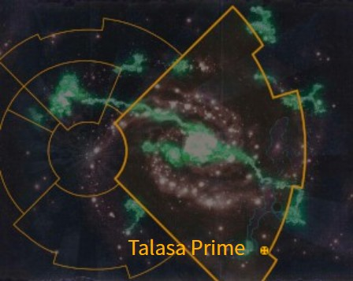
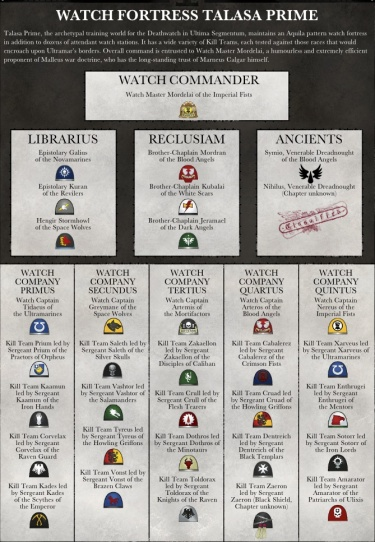

# 1065 塔拉萨主星 Talasa Prime

精校状态：中文行文已逐段精校，部分术语仍为暂定

分类：地理 / 小行星 / 极限星域 Ultima Segmentum

原文来源：https://www.bilibili.com/opus/1167689083941552183

原作者：帝国神选罐头

原文时间：2026年02月10日 16:30

[返回分类目录](目录.md) · [全书目录](../../目录.md)

原篇名：塔拉萨一号 Talasa Prime

<!-- A1065-B0001 图片 -->

<!-- A1065-B0002 -->

原译文

Map 地图

**校订译文**

Map 地图

<!-- /A1065-B0002 -->

<!-- A1065-B0003 -->
### Basic Data 基本资料

原题：Basic Data 基础数据

<!-- /A1065-B0003 -->

<!-- A1065-B0004 -->
**英文原文**

Name:Talasa Prime

<!-- /A1065-B0004 -->

<!-- A1065-B0005 -->

原译文

名称：塔拉萨主星

**校订译文**

名称：塔拉萨主星

<!-- /A1065-B0005 -->

<!-- A1065-B0006 -->
**英文原文**

Segmentum:Ultima Segmentum

<!-- /A1065-B0006 -->

<!-- A1065-B0007 -->

原译文

星域：极限星域

**校订译文**

星域：极限星域

<!-- /A1065-B0007 -->

<!-- A1065-B0008 -->
**英文原文**

Sector:Ultima Sector

<!-- /A1065-B0008 -->

<!-- A1065-B0009 -->

原译文

星区：极限星区

**校订译文**

星区：极限星区

<!-- /A1065-B0009 -->

<!-- A1065-B0010 -->
**英文原文**

Subsector:Ultramar

<!-- /A1065-B0010 -->

<!-- A1065-B0011 -->

原译文

分区：奥特拉玛

**校订译文**

次星区：奥特拉玛

<!-- /A1065-B0011 -->

<!-- A1065-B0012 -->
**英文原文**

System:Talasa System

<!-- /A1065-B0012 -->

<!-- A1065-B0013 -->

原译文

星系：塔拉萨星系

**校订译文**

星系：塔拉萨星系

<!-- /A1065-B0013 -->

<!-- A1065-B0014 -->
**英文原文**

Affiliation:Imperium (Deathwatch) (Ordo Xenos)

<!-- /A1065-B0014 -->

<!-- A1065-B0015 -->

原译文

隶属：帝国(死亡守望)(攘外修会)

**校订译文**

隶属：帝国（死亡守望、异形审判庭）

<!-- /A1065-B0015 -->

<!-- A1065-B0016 -->
**英文原文**

Class:Fortress World

<!-- /A1065-B0016 -->

<!-- A1065-B0017 -->

原译文

类别：要塞世界

**校订译文**

类别：要塞世界

<!-- /A1065-B0017 -->

<!-- A1065-B0018 -->
**英文原文**

Talasa Prime is an Imperial Fortress World, that has been gifted in perpetuity to the Deathwatch by the Ultramarines Chapter.

<!-- /A1065-B0018 -->

<!-- A1065-B0019 -->

原译文

塔拉萨主星是一个帝国要塞世界，由极限战士战团永久赠送给死亡守望。

**校订译文**

塔拉萨主星是一个帝国要塞世界，由极限战士战团永久赠送给死亡守望。

<!-- /A1065-B0019 -->

<!-- A1065-B0020 -->
### Overview 概述

<!-- /A1065-B0020 -->

<!-- A1065-B0021 -->
**英文原文**

It is home to a large Inquisitorial Fortress of the Ordo Xenos, and is most notable for housing the headquarters of the Deathwatch Chapter of the Space Marines, known as the alien hunters. Talasa Prime now serves as its main training site, where the Deathwatch recruits, equips, and trains Space Marines in the art of hunting Xenos. The Fortress also recruits, trains and equips Kill-Teams composed from the Ultramarines, Scythes of the Emperor and Lamenters Chapters for service against the Tyranids.

<!-- /A1065-B0021 -->

<!-- A1065-B0022 -->

原译文

它是攘外修会的一个大型审判庭堡垒的所在地，最著名的是容纳了星际战士死亡守望战团的总部，该战团被称为异型猎手。塔拉萨一号现在是其主要训练基地，死亡守望在这里招募、装备和训练星际战士狩猎异型的艺术。堡垒还招募、训练和装备由极限战士、帝皇之镰和恸哭者组成的杀戮小队，以对抗泰伦。

**校订译文**

塔拉萨主星设有异形审判庭的一座大型堡垒，最著名的设施则是死亡守望总部。这些星际战士以猎杀异形闻名，如今仍将这里作为主要训练基地，招募、装备并训练战士掌握狩猎异形的技艺。堡垒也从极限战士、帝皇之镰和恸哭者战团选拔成员，组成、训练并装备专门抗击泰伦的杀戮小队。

<!-- /A1065-B0022 -->

<!-- A1065-B0023 -->
**英文原文**

Since the creation of the Great Rift, however, the influx of Space Marines from the Imperium Nihilus has all but stopped. Rumors suggest the Watch Fortresses of Praefex Venatoris and Fort Excalibris now share the responsibility for training those Deathwatch members that are active in that blighted realm.

<!-- /A1065-B0023 -->

<!-- A1065-B0024 -->

原译文

然而，自大裂隙形成以来，来自帝国暗面的星际战士的涌入几乎停止了。有传言称，狩猎统领和断钢堡的守望堡垒现在共同负责训练那些活跃在那个枯萎领域的死亡守望成员。

**校订译文**

大裂隙形成后，来自帝国暗面的星际战士几乎不再抵达。传言狩猎统领堡与断钢堡两座守望要塞，如今分担了训练帝国暗面死亡守望成员的职责。

<!-- /A1065-B0024 -->

<!-- A1065-B0025 -->
## Organization 组织

<!-- /A1065-B0025 -->

<!-- A1065-B0026 -->
**英文原文**

Talasa Prime hosts five Watch Companies worth of Kill-Teams, in addition to its headquarters staff.

<!-- /A1065-B0026 -->

<!-- A1065-B0027 -->

原译文

塔拉萨一号除了总部员工外，还拥有五个相当于杀戮小队的守望连队。

**校订译文**

除总部人员外，塔拉萨主星还驻有足够编成五个守望连的杀戮小队。

**校注：** five Watch Companies worth of Kill-Teams表示杀戮小队总规模相当于五个守望连，原译倒置了编制关系。

<!-- /A1065-B0027 -->

<!-- A1065-B0028 图片 -->

<!-- A1065-B0029 -->

原译文

Organization of Deathwatch Forces at Talasa Prime 塔拉萨一号的死亡守望部队组织

**校订译文**

Organization of Deathwatch Forces at Talasa Prime 塔拉萨主星的死亡守望部队编制

<!-- /A1065-B0029 -->

本篇核心术语与暂定项

以下列出本篇出现的英文原形及核心术语表用词。同形词可能指不同对象，具体词义以本篇正文和校注为准；单复数、别名和仅见于图注的名称可能尚未列入。完整候选见[术语表](../../术语表/双语术语候选.csv)。

| 英文 | 采用中文 | 状态 |
| --- | --- | --- |
| Space Marines | 星际战士 | 官方已核对 |
| Deathwatch | 死亡守望 | 官方已核对 |
| Tyranids | 泰伦虫族 | 官方已核对 |
| Ultramar | 奥特拉玛 | 官方已核对 |
| Ultramarines | 极限战士 | 官方已核对 |
| Great Rift | 大裂隙 | 官方已核对 |
| Imperium | 帝国 | 暂定·简称 |
| Emperor | 帝皇 | 官方已核对 |
| Imperium Nihilus | 帝国暗面 | 暂定·官方待核 |
| Ordo Xenos | 异形审判庭 | 用户指定 |
| Ultima Segmentum | 极限星域 | 暂定·官方待核 |
| Segmentum | 星域 | 暂定·官方待核 |
| Sector | 星区 | 暂定·官方待核 |
| Subsector | 次星区 | 暂定·官方待核 |
| Talasa Prime | 塔拉萨主星 | 暂定·官方待核 |
| Chapter | 战团 | 暂定·官方待核 |
| Scythes of the Emperor | 帝皇之镰 | 暂定·官方待核 |
| Lamenters | 恸哭者 | 暂定·官方待核 |
| Xenos | 异形 | 暂定·官方待核 |
| Praefex Venatoris | 狩猎统领堡 | 暂定·官方待核 |
| Talasa System | 塔拉萨星系 | 暂定·官方待核 |
| System | 星系（恒星系统） | 暂定·官方待核 |
| Fortress World | 堡垒世界 | 暂定·官方待核 |
| Fort Excalibris | 断钢堡 | 暂定·官方待核 |

