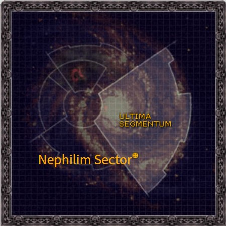

# 1066 拿非利星区 Nephilim Sector

精校状态：中文行文已逐段精校，部分术语仍为暂定

分类：地理 / 小行星 / 极限星域 Ultima Segmentum

原文来源：https://www.bilibili.com/opus/1135299533010370566

原作者：帝国神选罐头

原文时间：2025年11月15日 09:42

[返回分类目录](目录.md) · [全书目录](../../目录.md)

<!-- A1066-B0001 -->
**英文原文**

The Nephilim Sector is a Sector of the Imperium.

<!-- /A1066-B0001 -->

<!-- A1066-B0002 -->

原译文

拿非利星区是帝国的一个星区。

**校订译文**

拿非利星区是帝国的一个星区。

<!-- /A1066-B0002 -->

<!-- A1066-B0003 图片 -->

<!-- A1066-B0004 -->

原译文

Galactic location of the Nephilim Sector 拿非利星区的银河位置

**校订译文**

Galactic location of the Nephilim Sector 拿非利星区的银河位置

<!-- /A1066-B0004 -->

<!-- A1066-B0005 -->
## Overview 概述

<!-- /A1066-B0005 -->

<!-- A1066-B0006 -->
**英文原文**

It is most notable for being the site of the discovery of the STC to the Nephilim Jetfighter, which was named after the Sector itself.

<!-- /A1066-B0006 -->

<!-- A1066-B0007 -->

原译文

最值得注意的是，它是发现拿非利喷气式战斗机STC的地点，该战斗机以该星区本身命名。

**校订译文**

这里最著名的发现，是涅菲里姆战机的STC。该战机正是以发现地点所在的星区命名。

**校注：** 本稿已定星区拿非利、战机官译涅菲里姆战机。英文明确说明名称源自星区；保留词根中文异形，不把全单位官译自动扩展为星区官译。

<!-- /A1066-B0007 -->

<!-- A1066-B0008 -->
## History 历史

<!-- /A1066-B0008 -->

<!-- A1066-B0009 -->
**英文原文**

In the wake of the Great Rift's creation, the Imperium noted that it did not recive any distress calls from its worlds in the Sector. Suspicious of what this could mean, Lord Commander Guilliman dispatched the Indomitus Crusade's Battle Group Kallides to investigate. What they found changed the galaxy forever, as they discovered that the Warp had been stilled within a region of the Nephilim Sector. Though they learned that both the engine's of the Battlegroup's warships and its Psykers struggled to operate as a result, the collapse of their Gellar Fields did not cause Daemons to materialize either. A grave draw back, however, was that all the Humans of the Battlegroup - save for its Adepta Sororitas - fell victim to a deep lethargy. Worse still, the Imperial worlds they visited stood empty, devoid of any of its citizens. As a result, that region of the Sector became known to the Crusade fleet as the Pariah Nexus.

<!-- /A1066-B0009 -->

<!-- A1066-B0010 -->

原译文

在大裂隙形成后，帝国注意到它没有收到来自该星区世界的任何求救信号。由于怀疑这可能意味着什么，领主指挥官基里曼派遣不屈远征卡利德斯战斗群进行调查。他们的发现永远地改变了银河系，因为他们发现亚空间在拿非利星区的一个区域内已经静止。尽管他们了解到，战斗群的战舰的引擎和灵能者都因此难以运行，但他们的盖勒力场的崩溃也没有导致恶魔的出现。然而，一个严重的倒退是，战斗群中的所有人类 — 除了修女会 — 都陷入了深度冷漠。更糟糕的是，他们访问的帝国世界空无一人，没有任何公民。因此，远征舰队将该地区称为驱灵死域。

**校订译文**

大裂隙形成后，帝国注意到拿非利星区各世界竟未发出任何求救信号。基里曼领主指挥官对此起疑，派不屈远征的卡利德斯战斗群前往调查。他们发现，星区内一片区域的亚空间活动已被压制至寂静。这一现象令舰船引擎与灵能者都难以发挥作用，但即便盖勒力场崩溃，也没有恶魔现身。更严重的影响是，除修女会成员外，战斗群中的所有人类都陷入深沉的倦怠。更加可怕的是，他们造访的帝国世界空无一人，居民全部消失。因此，远征舰队将这片区域称为“驱灵死域”。

**校注：** drawback为负面影响，不是倒退；lethargy为深度倦怠/迟钝，未据此认定全部昏迷。

<!-- /A1066-B0010 -->

<!-- A1066-B0011 -->
**英文原文**

The mystery was finally solved on Mesmoch, when a group of Battle Group Kallides' Ultramarines discovered a Necron pylon created from Blackstone. The region was subsequently invaded by the Imperium in the War in the Pariah Nexus.

<!-- /A1066-B0011 -->

<!-- A1066-B0012 -->

原译文

梅斯莫赫上的谜团终于解开了，当时卡利德斯战斗群的一队极限战士发现了一个由黑石创建的死灵方尖碑。该地区随后在驱灵死域战争中被帝国入侵。

**校订译文**

卡利德斯战斗群的一队极限战士在梅斯莫赫发现了一座黑石制成的太空死灵方尖碑，谜团才终于解开。此后，帝国发起驱灵死域战争，进攻这片区域。

<!-- /A1066-B0012 -->

<!-- A1066-B0013 -->
## Known Systems 著名星系

<!-- /A1066-B0013 -->

<!-- A1066-B0014 -->

原译文

Argovon System 阿尔戈冯星系

**校订译文**

Argovon System 阿尔戈冯星系

<!-- /A1066-B0014 -->

<!-- A1066-B0015 -->

原译文

Lomorr System 洛莫尔星系

**校订译文**

Lomorr System 洛莫尔星系

<!-- /A1066-B0015 -->

<!-- A1066-B0016 -->

原译文

Myrtika System 迈尔提卡星系

**校订译文**

Myrtika System 迈尔提卡星系

<!-- /A1066-B0016 -->

<!-- A1066-B0017 -->

原译文

Paradyce System 帕拉迪斯星系

**校订译文**

Paradyce System 帕拉迪斯星系

<!-- /A1066-B0017 -->

<!-- A1066-B0018 -->

原译文

Ramasus System 拉马苏斯星系

**校订译文**

Ramasus System 拉马苏斯星系

<!-- /A1066-B0018 -->

<!-- A1066-B0019 -->

原译文

Skahren System 斯卡伦星系

**校订译文**

Skahren System 斯卡伦星系

<!-- /A1066-B0019 -->

<!-- A1066-B0020 -->

原译文

Tredica System 特雷迪卡星系

**校订译文**

Tredica System 特雷迪卡星系

<!-- /A1066-B0020 -->

<!-- A1066-B0021 -->

原译文

Zeidos System 泽多斯星系

**校订译文**

Zeidos System 泽多斯星系

<!-- /A1066-B0021 -->

<!-- A1066-B0022 -->
## Notable Planets 著名行星

<!-- /A1066-B0022 -->

<!-- A1066-B0023 -->

原译文

Mesmoch 梅斯莫赫

**校订译文**

Mesmoch 梅斯莫赫

<!-- /A1066-B0023 -->

<!-- A1066-B0024 -->

原译文

Vertigus II 维提戈斯二号

**校订译文**

Vertigus II 维提戈斯二号

<!-- /A1066-B0024 -->

<!-- A1066-B0025 -->

原译文

Terrinor 特林诺尔

**校订译文**

Terrinor 特林诺尔

<!-- /A1066-B0025 -->

本篇核心术语与暂定项

以下列出本篇出现的英文原形及核心术语表用词。同形词可能指不同对象，具体词义以本篇正文和校注为准；单复数、别名和仅见于图注的名称可能尚未列入。完整候选见[术语表](../../术语表/双语术语候选.csv)。

| 英文 | 采用中文 | 状态 |
| --- | --- | --- |
| Adepta Sororitas | 修女会 | 官方已核对 |
| Ultramarines | 极限战士 | 官方已核对 |
| Warp | 亚空间 | 官方已核对 |
| Great Rift | 大裂隙 | 官方已核对 |
| Imperium | 帝国 | 暂定·简称 |
| Indomitus | 不屈学派 | 暂定·学派语境 |
| STC | 标准建造模板 | 暂定·官方待核 |
| Indomitus Crusade | 不屈远征 | 暂定·官方待核 |
| Nephilim Sector | 拿非利星区 | 暂定·官方待核 |
| Pariah Nexus | 驱灵死域 | 暂定·官方待核 |
| Sector | 星区 | 暂定·官方待核 |
| Pariah | 贱民 | 暂定·官方待核 |
| Nephilim Jetfighter | 涅菲里姆战机 | 官方已核 |
| Lord Commander | 领主指挥官 | 暂定·官方待核 |
| Mesmoch | 梅斯莫克 | 暂定·官方待核 |

