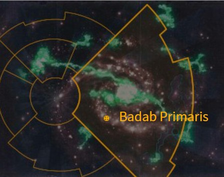
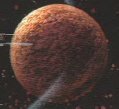

# 1067 巴达布主星 Badab Primaris

精校状态：中文行文已逐段精校，部分术语仍为暂定

分类：地理 / 小行星 / 极限星域 Ultima Segmentum

原文来源：https://www.bilibili.com/opus/1155815930354204677

原作者：帝国神选罐头

原文时间：2026年01月09日 16:36

[返回分类目录](目录.md) · [全书目录](../../目录.md)

<!-- A1067-B0001 图片 -->

<!-- A1067-B0002 -->

原译文

Map 地图

**校订译文**

Map 地图

<!-- /A1067-B0002 -->

<!-- A1067-B0003 -->
### Basic Data 基本资料

原题：Basic Data 基础信息

<!-- /A1067-B0003 -->

<!-- A1067-B0004 -->
**英文原文**

Name:Badab Primaris

<!-- /A1067-B0004 -->

<!-- A1067-B0005 -->

原译文

名称：巴达布主星

**校订译文**

名称：巴达布主星

<!-- /A1067-B0005 -->

<!-- A1067-B0006 -->
**英文原文**

Segmentum:Ultima Segmentum

<!-- /A1067-B0006 -->

<!-- A1067-B0007 -->

原译文

星域：极限星域

**校订译文**

星域：极限星域

<!-- /A1067-B0007 -->

<!-- A1067-B0008 -->
**英文原文**

Sector:Badab

<!-- /A1067-B0008 -->

<!-- A1067-B0009 -->

原译文

星区：巴达布

**校订译文**

星区：巴达布

<!-- /A1067-B0009 -->

<!-- A1067-B0010 -->
**英文原文**

System:Badab System

<!-- /A1067-B0010 -->

<!-- A1067-B0011 -->

原译文

星系：巴达布星系

**校订译文**

星系：巴达布星系

<!-- /A1067-B0011 -->

<!-- A1067-B0012 -->
**英文原文**

Population:5,170,000,000

<!-- /A1067-B0012 -->

<!-- A1067-B0013 -->

原译文

人口：51,7000,0000

**校订译文**

人口：51亿7000万

<!-- /A1067-B0013 -->

<!-- A1067-B0014 -->
**英文原文**

Affiliation:Imperium

<!-- /A1067-B0014 -->

<!-- A1067-B0015 -->

原译文

隶属：帝国

**校订译文**

隶属：帝国

<!-- /A1067-B0015 -->

<!-- A1067-B0016 -->
**英文原文**

Class:Adeptus Astartes Homeworld (formerly), Hive World

<!-- /A1067-B0016 -->

<!-- A1067-B0017 -->

原译文

类别：阿斯塔特家园世界（前），巢都世界

**校订译文**

类别：巢都世界；原为阿斯塔特修会家园世界。

<!-- /A1067-B0017 -->

<!-- A1067-B0018 图片 -->

<!-- A1067-B0019 -->

原译文

Planetary Image 行星图像

**校订译文**

Planetary Image 行星图像

<!-- /A1067-B0019 -->

<!-- A1067-B0020 -->
**英文原文**

Badab Primaris (or Badab II) is the second planet in the Badab system, located in the Ultima Segmentum, close to the Maelstrom warp rift.

<!-- /A1067-B0020 -->

<!-- A1067-B0021 -->

原译文

巴达布主星（或巴达布二号）是巴达布星系中的第二颗行星，位于极限星域，靠近大漩涡亚空间裂隙。

**校订译文**

巴达布主星（或巴达布二号）是巴达布星系中的第二颗行星，位于极限星域，靠近大漩涡亚空间裂隙。

<!-- /A1067-B0021 -->

<!-- A1067-B0022 -->
## Overview 概述

<!-- /A1067-B0022 -->

<!-- A1067-B0023 -->
**英文原文**

Badab Primaris is the capital of the Badab Sector. Once a homeworld of the Astral Claws Space Marine Chapter, it played a major role in the Badab War, which ended with the siege of Badab Primaris itself.

<!-- /A1067-B0023 -->

<!-- A1067-B0024 -->

原译文

巴达布主星是巴达布星区的首都。它曾经是星辰之爪星际战士战团的家园世界，在巴达布战争中发挥了重要作用，这场战争以对巴达布主星本身的围攻而告终。

**校订译文**

巴达布主星是巴达布星区的首都。它曾经是星辰之爪星际战士战团的家园世界，在巴达布战争中发挥了重要作用，这场战争以对巴达布主星本身的围攻而告终。

<!-- /A1067-B0024 -->

<!-- A1067-B0025 -->
**英文原文**

The Imperial Mission took over the running of Badab after the war. It is now under the dominion of the Star Phantoms, along with the other worlds of the Badab Sector.

<!-- /A1067-B0025 -->

<!-- A1067-B0026 -->

原译文

战后，帝国使团接管了巴达布的管理。现在，它与巴达布星区的其他世界一起，处于星辰幻影的统治之下。

**校订译文**

战后，帝国使团接管了巴达布的管理。现在，它与巴达布星区的其他世界一起，处于星辰幻影的统治之下。

<!-- /A1067-B0026 -->

<!-- A1067-B0027 -->
## Major Locations 主要地点

<!-- /A1067-B0027 -->

<!-- A1067-B0028 -->

原译文

Palace Of Thorns 荆棘宫殿

**校订译文**

Palace Of Thorns 荆棘宫殿

<!-- /A1067-B0028 -->

<!-- A1067-B0029 -->

原译文

Hive Dominar 统御巢都

**校订译文**

Hive Dominar 统御巢都

<!-- /A1067-B0029 -->

本篇核心术语与暂定项

以下列出本篇出现的英文原形及核心术语表用词。同形词可能指不同对象，具体词义以本篇正文和校注为准；单复数、别名和仅见于图注的名称可能尚未列入。完整候选见[术语表](../../术语表/双语术语候选.csv)。

| 英文 | 采用中文 | 状态 |
| --- | --- | --- |
| Adeptus Astartes | 阿斯塔特修会 | 官方已核对 |
| Warp | 亚空间 | 官方已核对 |
| Imperium | 帝国 | 暂定·简称 |
| Maelstrom | 大漩涡 | 官方已核对 |
| Hive World | 巢都世界 | 暂定·官方待核 |
| Ultima Segmentum | 极限星域 | 暂定·官方待核 |
| Segmentum | 星域 | 暂定·官方待核 |
| Sector | 星区 | 暂定·官方待核 |
| Badab | 巴达布 | 暂定·官方待核 |
| Mission | 教团／传教机构 | 暂定 |
| Space Marine | 星际战士 | 暂定·官方待核 |
| Chapter | 战团 | 暂定·官方待核 |
| Star Phantoms | 星辰幻影 | 暂定·官方待核 |
| Dominion | 主天使 | 暂定·官方待核 |
| System | 星系（恒星系统） | 暂定·官方待核 |
| Badab Primaris | 巴达布主星 | 暂定·官方待核 |
| Astral Claws | 星辰之爪 | 暂定·官方待核 |

