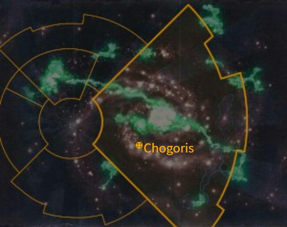
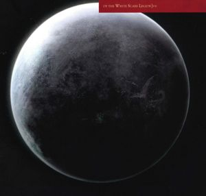

# 1068 乔高里斯 Chogoris

精校状态：中文行文已逐段精校，部分术语仍为暂定

分类：地理 / 小行星 / 极限星域 Ultima Segmentum

原文来源：https://www.bilibili.com/opus/1094834786398109703

原作者：帝国神选罐头

原文时间：2025年07月29日 08:38

[返回分类目录](目录.md) · [全书目录](../../目录.md)

原篇名：巧高里斯 Chogoris

<!-- A1068-B0001 图片 -->

<!-- A1068-B0002 -->
## Map 地图

<!-- /A1068-B0002 -->

<!-- A1068-B0003 -->
### Basic Data 基本资料

原题：Basic Data 基础信息

<!-- /A1068-B0003 -->

<!-- A1068-B0004 -->
**英文原文**

Name:Chogoris (Mundus Planus)

<!-- /A1068-B0004 -->

<!-- A1068-B0005 -->

原译文

名称：巧高里斯（蒙杜斯·普兰努斯）

**校订译文**

名称：乔高里斯（蒙达斯·普莱纳斯）

<!-- /A1068-B0005 -->

<!-- A1068-B0006 -->
**英文原文**

Segmentum:Ultima Segmentum

<!-- /A1068-B0006 -->

<!-- A1068-B0007 -->

原译文

星域：极限星域

**校订译文**

星域：极限星域

<!-- /A1068-B0007 -->

<!-- A1068-B0008 -->
**英文原文**

Sector:Yasan Sector

<!-- /A1068-B0008 -->

<!-- A1068-B0009 -->

原译文

星区：崖山星区

**校订译文**

星区：崖山星区

<!-- /A1068-B0009 -->

<!-- A1068-B0010 -->
**英文原文**

System:Chogoris System

<!-- /A1068-B0010 -->

<!-- A1068-B0011 -->

原译文

星系：巧高里斯星系

**校订译文**

星系：乔高里斯星系

<!-- /A1068-B0011 -->

<!-- A1068-B0012 -->
**英文原文**

Population:10,000,000

<!-- /A1068-B0012 -->

<!-- A1068-B0013 -->

原译文

人口：1000,0000

**校订译文**

人口：1000万

<!-- /A1068-B0013 -->

<!-- A1068-B0014 -->
**英文原文**

Affiliation:Imperium

<!-- /A1068-B0014 -->

<!-- A1068-B0015 -->

原译文

隶属：帝国

**校订译文**

隶属：帝国

<!-- /A1068-B0015 -->

<!-- A1068-B0016 -->
**英文原文**

Class:Adeptus Astartes Homeworld, Feral World

<!-- /A1068-B0016 -->

<!-- A1068-B0017 -->

原译文

级别：阿斯塔特修会家园世界，蛮荒世界

**校订译文**

级别：阿斯塔特修会家园世界，蛮荒世界

<!-- /A1068-B0017 -->

<!-- A1068-B0018 -->
**英文原文**

Tithe Grade:Solutio Prima

<!-- /A1068-B0018 -->

<!-- A1068-B0019 -->

原译文

什一税等级：第三级一等

**校订译文**

什一税等级：第三级一等

<!-- /A1068-B0019 -->

<!-- A1068-B0020 图片 -->

<!-- A1068-B0021 -->
## Planetary Image 行星图像

<!-- /A1068-B0021 -->

<!-- A1068-B0022 -->
**英文原文**

Chogoris, known in Imperial records as Mundus Planus, is the birthworld of the Primarch Jaghatai Khan and homeworld of the White Scars Space Marine Chapter.

<!-- /A1068-B0022 -->

<!-- A1068-B0023 -->

原译文

巧高里斯，在帝国记录中被称为蒙杜斯·普兰努斯，是察合台可汗的出生地，也是白色疤痕星际战士的家园世界。

**校订译文**

乔高里斯在帝国档案中称为蒙达斯·普莱纳斯，是原体察合台可汗成长的故乡，也是白疤星际战士战团的家园世界。

**校注：** birthworld在本条上下文指原体失散后降落、成长的故乡；不是否定其在泰拉诞生。Chogoris沿核心乔高里斯，原巧高里斯/乔戈里斯留对照。

<!-- /A1068-B0023 -->

<!-- A1068-B0024 -->
## History 历史

<!-- /A1068-B0024 -->

<!-- A1068-B0025 -->
### Pre-Imperial 帝国前

<!-- /A1068-B0025 -->

<!-- A1068-B0026 -->
**英文原文**

By the end of the Age of Strife Chogoris' Human population had regressed to a level of blackpowder-level of technology. During this time, it was ruled by a powerful empire under the Palatine who ruled from Quan Zhou.

<!-- /A1068-B0026 -->

<!-- A1068-B0027 -->

原译文

到纷争时代结束时，巧高里斯的人口已经退化到的黑火药的技术水平。在此期间，它被一个由帕拉廷从泉州统治的强大的帝国控制。

**校订译文**

纷争时代结束时，乔高里斯的人类文明已退化到使用黑火药的技术阶段。当时，一个强大帝国统治着这里，其统治者帕拉廷以泉州为首都。

**校注：** the Palatine在本篇是乔高里斯旧帝国统治者的称谓，暂沿原稿帕拉廷；不能径套修女会职衔宫廷官。

<!-- /A1068-B0027 -->

<!-- A1068-B0028 -->
**英文原文**

After his arrival, Jaghatai Khan united the tribes of the planet's western desert into a single horde and overthrew the Palatine. When the Khan left with the Emperor, he put Ogedei in control of the world, but Ogedei was not strong enough to hold the tribes together. The tribes fragmented and returned to their old ways of constant inter-tribal warfare. This may have been the Khan's purpose, because it allowed the Chapter's potential recruits to maintain their warrior culture. There would be many attempts to unite the tribes of the deserts but none would be as successful as the Khan's.

<!-- /A1068-B0028 -->

<!-- A1068-B0029 -->

原译文

抵达后，察合台可汗将行星西部沙漠的部落统一为一个部落，推翻了帕拉廷。当可汗随帝皇离开时，他让窝阔台控制了世界，但窝阔台不够强大，无法将部落团结在一起。部落分裂了，又回到了部落间不断战争的旧景。这可能是可汗的目的，因为它允许战团的潜在新兵保持他们的战士文化。有许多尝试将沙漠部落团结起来，但没有一次能像可汗那样成功。

**校订译文**

察合台可汗到来后，将行星西部沙漠的众多部落团结成统一大军，推翻了帕拉廷。随帝皇离去时，他将乔高里斯交给窝阔台管理，但后者无力维持部落团结。各部再度分裂，恢复往日彼此征战的生活。这或许正合可汗心意，因为持续的战争能让战团未来的新兵保有尚武传统。此后，许多人试图再次统一沙漠部落，却无人取得可汗那样的成就。

<!-- /A1068-B0029 -->

<!-- A1068-B0030 -->
### Recent History 近期历史

<!-- /A1068-B0030 -->

<!-- A1068-B0031 -->
**英文原文**

In 890.M41, a Necron Tombship entered orbit over Chogoris and began a focused bombardment of an unpopulated area on the planet's surface for an unknown reason. The White Scars Battle Barge Jaghatai's Pride pierces the ships shields as the Defence Laser of Quan Zhou destroyed the ship in a single blast.

<!-- /A1068-B0031 -->

<!-- A1068-B0032 -->

原译文

890.M41，一艘死灵墓穴舰进入巧高里斯上空的轨道，并开始对行星表面一个无人居住的区域进行集中轰炸，原因不明。当泉州的防御激光在一次爆炸中摧毁了这艘舰船时，白色疤痕战斗驳船察合台之傲号刺穿了舰船的护盾。

**校订译文**

890.M41，一艘太空死灵墓穴舰进入乔高里斯轨道，不明原因地集中轰炸一片无人区。白疤战斗驳船察合台之傲号击穿其护盾，泉州的防御激光随即一击将其摧毁。

<!-- /A1068-B0032 -->

<!-- A1068-B0033 -->
**英文原文**

A transmission dated 0435991.M41 lists Chogoris as under full-scale infestation by a subterranean alien species, the Drugh.

<!-- /A1068-B0033 -->

<!-- A1068-B0034 -->

原译文

一份日期为043599.M41的传播报告巧高里斯受到地下外来物种德鲁格的全面侵扰。

**校订译文**

一份标注日期为0435991.M41的通信报告称，乔高里斯正遭地下异形物种德鲁格全面侵扰。

**校注：** 原译漏去日期中的一位数字，恢复完整0435991.M41；此格式本身异常，未自行重排为标准日期。

<!-- /A1068-B0034 -->

<!-- A1068-B0035 -->
**英文原文**

In 990999.M41, Chogoris was among the systems besieged by a Red Corsair fleet under Huron Blackheart. The White Scars were forced to withdraw from the Third War for Armageddon and Second Agrellan Campaign to deal with the threat.

<!-- /A1068-B0035 -->

<!-- A1068-B0036 -->

原译文

在990999.M41，巧高里斯是被休伦·黑心的红海盗舰队围困的星系之一。白色伤疤被迫退出第三次阿玛吉多顿战争和第二次阿格雷兰战役，以应对威胁。

**校订译文**

990999.M41，休伦·黑心率红海盗舰队围困包括乔高里斯在内的多个星系。白疤被迫撤离第三次阿玛吉多顿战争及第二次阿格雷兰战役的战场，返回应对威胁。

<!-- /A1068-B0036 -->

<!-- A1068-B0037 -->
**英文原文**

???.M42. The War for Chogoris. In the aftermath of Cadia's destruction, the nearby Maelstrom has grown in size and power and has begun affecting Chogoris itself. Now the world's grasslands burn from the Warp's power and its beasts run wild, or turn to monstrous, deformed things. Worse still, the White Scars have not been able to protect the world's population from the predations of the Red Corsairs, who have begun building ziggurats from bodies of Chogoris' dead. The Chapter does not know why the Red Corsairs are building these mountains of dead flesh, but are sure the ziggurats are part of some ritual dedicated to the Chaos Gods, that is close to completion. Thankfully for the White Scars, Roboute Guilliman's Indomitus Crusade managed to relieve the world and deliver new reinforcements of Primaris Space Marines.

<!-- /A1068-B0037 -->

<!-- A1068-B0038 -->

原译文

???.M42.巧高里斯之战。卡迪亚被摧毁后，附近的大漩涡规模和力量都在增长，并开始影响巧高里斯本身。现在，世界上的草原被亚空间的力量烧毁，它的野兽狂野地奔跑，或者变成可怕的、畸形的东西。更糟糕的是，白色疤痕未能保护世界人口免受红海盗的掠夺，红海盗已经开始用巧高里斯人的尸体建造金字型神塔。战团不知道红海盗为什么要建造这些死肉之山，但可以肯定的是，金字型神塔是献给混沌诸神的某种仪式的一部分，即将完成。值得庆幸的是，由于白色疤痕，罗伯特·基里曼的不屈远征成功地拯救了世界，并提供了新的原铸星际战士的增援。

**校订译文**

???.M42——乔高里斯之战。卡迪亚毁灭后，附近大漩涡的规模和力量不断扩张，开始影响乔高里斯。草原被亚空间力量点燃，野兽变得狂暴，甚至化为畸形怪物。更糟的是，白疤无力保护居民免遭红海盗掠夺，敌人开始用乔高里斯死者的尸体堆砌阶梯神塔。战团不清楚这些尸山的具体用途，却确信它们属于某种献给混沌诸神、且即将完成的仪式。所幸罗保特·基里曼的不屈远征及时解救母星，并带来原铸星际战士增援。

**校注：** Thankfully for the White Scars意为白疤幸运地得到援救，原译“由于白色疤痕”倒置因果。

<!-- /A1068-B0038 -->

<!-- A1068-B0039 -->
## Geography 地理

<!-- /A1068-B0039 -->

<!-- A1068-B0040 -->
**英文原文**

Chogoris is a fertile world with lush greenery, soaring mountains and azure seas, which, at the time of the Great Crusade, had achieved a black powder level of technology. The dominant Chogorian empire at the time of the Great Crusade was an organized aristocracy which had conquered most of the planet with well-equipped and highly disciplined armies. Armoured horsemen and densely packed blocks of infantry had won every campaign their ruler, the Palatine, had fought.

<!-- /A1068-B0040 -->

<!-- A1068-B0041 -->

原译文

巧高里斯是一个富饶的世界，有郁郁葱葱的植被、高耸的山脉和湛蓝的大海，在大远征时期，这里已经达到了黑火药的技术水平。大远征时占主导地位的巧高里斯帝国是一个有组织的贵族国家，他们凭借装备精良、纪律严明的军队征服了行星的大部分地区。装甲骑兵和密集的步兵部队使他们的统治者帕拉廷赢得了每一场战役。

**校订译文**

乔高里斯土地丰饶，绿意盎然，高山耸立，海水湛蓝。大远征时，当地技术处于黑火药阶段。彼时占主导地位的乔高里斯帝国是组织严密的贵族政权，依靠装备精良、纪律严明的军队征服了大部分行星。重甲骑兵与密集步兵方阵，为统治者帕拉廷赢得了一场又一场战役。

<!-- /A1068-B0041 -->

<!-- A1068-B0042 -->
**英文原文**

To the west of the Palatine's empire was a vast, wind-blown steppe, known as the Empty Quarter, home to nomadic tribes of savage horsemen who for centuries had roamed the vast grasslands. The tribes of the steppes lived in tents and followed a cycle of seasonal migration from summer pastures to protected winter valleys in the Khum Karta mountains. Consummate horsemen and archers, these disparate tribes frequently fought one another for control of ancestral pastureland. Chogorian armies had never invaded the Empty Quarter as the dry and desolate lands were of no value to the Palatine. However, Chogorian nobles would often lead hunting bands into the steppes and take whole tribes east as slaves or capture a lone tribesmen to hunt through the mountains for sport.

<!-- /A1068-B0042 -->

<!-- A1068-B0043 -->

原译文

在帕拉廷帝国的西部，有一片广阔的、风吹的草原，被称为空区，几个世纪以来，游牧部落的野蛮骑兵一直在广阔的草原上游荡。草原上的部落住在帐篷里，遵循着从夏季牧场到库姆·卡尔塔山脉受保护的冬季山谷的季节性迁徙周期。作为完美的骑兵和弓箭手，这些不同的部落经常为了控制先祖的牧场而相互争斗。巧高里斯军队从未入侵过空区，因为干燥荒凉的土地对帕拉廷来说毫无价值。然而，巧高里斯贵族经常带领狩猎队进入大草原，将整个部落带到东部作为奴隶，或者俘虏一个孤独的部落成员在山上狩猎。

**校订译文**

帕拉廷帝国以西，是一片风吹不息的辽阔草原，称作“空区”。数百年来，彪悍的游牧骑民在此逐草而居。他们住在帐篷中，随季节从夏季牧场迁往库姆·卡尔塔山脉中可避风的冬季山谷。这些部落骑射精湛，经常为祖传牧地相互争战。帕拉廷认为干燥荒凉的空区毫无价值，因此帝国军队从未全面入侵。然而，贵族们常带狩猎队进入草原，将整个部落掳往东方为奴，或抓住落单者，在山间把他们当作猎物追逐取乐。

**校注：** 原文贵族将被俘部落成员当作猎物追猎，原译“俘虏…在山上狩猎”未说明被猎杀的是俘虏。

<!-- /A1068-B0043 -->

<!-- A1068-B0044 -->
**英文原文**

The Stormseers of the White Scars choose the potential recruits for the Chapter from among the warring tribes, identifying the bravest and most promising young warriors while Fallen White Scars are brought back to their homeworld, to the pyre tombs on Khum Karta.

<!-- /A1068-B0044 -->

<!-- A1068-B0045 -->

原译文

白色伤疤的风暴先知从交战部落中为战团选择潜在的新兵，确定最勇敢、最有前途的年轻战士，而牺牲的白色伤疤则被带回他们的家园，在库姆·卡尔塔的火葬墓。

**校订译文**

白疤的风暴先知从交战部落中选拔最勇敢、最有潜力的年轻战士，作为战团候选新兵。阵亡的白疤则被送回母星，安葬于库姆·卡尔塔的火葬墓地。

<!-- /A1068-B0045 -->

<!-- A1068-B0046 -->
**英文原文**

Chogoris does have some small cities and spaceports, but the majority of the world is unspoiled lush green grasslands. The White Scars are very careful to maintain Chogoris' natural state and forbid any widespread industry or urbanization. As beautiful as the world is, it is equally cruel and known for its harsh winters and baking hot summers. The population lives in constant peril of not only its fierce storms but also flying beasts and flash flooding from its rivers.

<!-- /A1068-B0046 -->

<!-- A1068-B0047 -->

原译文

巧高里斯确实有一些小城市和太空港，但世界上大部分地区都是未受破坏的郁郁葱葱的草原。白色疤痕非常小心地维持巧高里斯的自然状态，并禁止任何大规模的工业或城市化。世界虽然美丽，但同样残酷，以严冬和炎热的夏天而闻名。人们生活在持续的危险中，不仅有猛烈的风暴，还有飞禽走兽和河流的洪水。

**校订译文**

乔高里斯虽有一些小城市和太空港，大部分地区仍是未经破坏的葱郁草原。白疤悉心维护母星自然环境，禁止大规模工业开发与城市化。然而，这里既美丽又残酷，冬季严寒、夏日酷热；居民时刻面对猛烈风暴、飞行猛兽和河流骤发洪水的威胁。

<!-- /A1068-B0047 -->

<!-- A1068-B0048 -->
### Notable Locations 著名地点

<!-- /A1068-B0048 -->

<!-- A1068-B0049 -->
**英文原文**

Quan Zhou - Once the capital of the Palatine. Today it is the White Scars Fortress-Monastery and sits at the peak of the Khum Karta Mountains, the most inaccessible mountain range on Chogoris.

<!-- /A1068-B0049 -->

<!-- A1068-B0050 -->

原译文

泉州 - 曾经是帕拉廷的首都。今天，它是白色疤痕要塞修道院，坐落在巧高里斯最难到达的山脉库姆·卡尔塔山脉的顶峰。

**校订译文**

泉州——帕拉廷昔日的首都，如今是白疤的要塞修道院，坐落在乔高里斯最险峻难至的库姆·卡尔塔山脉峰顶。

<!-- /A1068-B0050 -->

<!-- A1068-B0051 -->
**英文原文**

Khum Karta Mountains - Enormous mountain range.

<!-- /A1068-B0051 -->

<!-- A1068-B0052 -->

原译文

库姆·卡尔塔山脉 - 巨大的山脉。

**校订译文**

库姆·卡尔塔山脉 - 巨大的山脉。

<!-- /A1068-B0052 -->

<!-- A1068-B0053 -->

原译文

Mount Kardunn 喀耳顿山

**校订译文**

Mount Kardunn 喀耳顿山

<!-- /A1068-B0053 -->

<!-- A1068-B0054 -->
**英文原文**

Altak - Also known as the Plains of Zhou. A massive blue-green grassland that covers half the planet and is home to the majority of the population. Over these race the four dragon winds: Kur of the west, Huanglak of the north, Erlig-kul of the east, and Tienak. of the south.

<!-- /A1068-B0054 -->

<!-- A1068-B0055 -->

原译文

阿尔塔克 - 也被称为州平原。一片巨大的蓝绿色草原，覆盖了行星的一半，是大多数人口的家园。在这些历程中，有四股龙风：西之库尔、北之黄拉克、东之埃尔利格·库尔和南之天纳克。

**校订译文**

阿尔塔克——又称州平原。辽阔的蓝绿色草原覆盖半个行星，大部分居民生活于此。四股龙风奔驰其上：西来的库尔、北来的黄拉克、东来的埃尔利格·库尔，以及南来的天纳克。

<!-- /A1068-B0055 -->

<!-- A1068-B0056 -->
**英文原文**

Ulaav Mountains - Small mountain rnage that has local spiritual significance. Some Storm Seers journey there on spiritual journeys in a test against the powers of Chaos dubbed the Test of Heaven.

<!-- /A1068-B0056 -->

<!-- A1068-B0057 -->

原译文

乌拉夫山脉 - 具有当地精神意义的小山脉。一些风暴先知在那里进行精神之旅，以对抗被称为天堂试炼的混沌力量。

**校订译文**

乌拉夫山脉——一条具有宗教意义的小山脉。部分风暴先知会来此进行精神修行，通过称为“天堂试炼”的考验，对抗混沌力量。

**校注：** Test of Heaven是考验名称，不是混沌力量的名称。

<!-- /A1068-B0057 -->

<!-- A1068-B0058 -->
**英文原文**

Empty Quarter - enormous steppe wilderness inhabited by horse-nomads. Most of Chogoris' inhabitants dwells here but it maintains a low population density.

<!-- /A1068-B0058 -->

<!-- A1068-B0059 -->

原译文

空旷之地 — 骑马游牧民族居住的巨大草原荒野。巧高里斯的大部分居民都住在这里，但人口密度很低。

**校订译文**

空区——骑马游牧民生活的辽阔草原荒野。乔高里斯大多数居民生活在这里，但人口密度仍很低。

<!-- /A1068-B0059 -->

<!-- A1068-B0060 -->

原译文

Kherbal Flats 赫尔巴尔平地

**校订译文**

Kherbal Flats 赫尔巴尔平地

<!-- /A1068-B0060 -->

<!-- A1068-B0061 -->
**英文原文**

Tovg Ocean - Home to the mighty horned Oryavar whales.

<!-- /A1068-B0061 -->

<!-- A1068-B0062 -->

原译文

托夫格 - 强大的长角奥里亚瓦尔鲸的家园。

**校订译文**

托夫格洋——巨大的长角奥里亚瓦尔鲸栖息于此。

<!-- /A1068-B0062 -->

<!-- A1068-B0063 -->
**英文原文**

Lon-Suen Plain - Contains a region known as the Valley of the Khans.

<!-- /A1068-B0063 -->

<!-- A1068-B0064 -->

原译文

龙孙平原 - 包含一个被称为可汗谷的地区。

**校订译文**

龙孙平原 - 包含一个被称为可汗谷的地区。

<!-- /A1068-B0064 -->

<!-- A1068-B0065 -->
**英文原文**

Cophasta - Magnificently rich fortress-city on the world's eastern coast.

<!-- /A1068-B0065 -->

<!-- A1068-B0066 -->

原译文

克法斯塔 - 世界东部海岸一座极其富裕的堡垒城市。

**校订译文**

克法斯塔 - 世界东部海岸一座极其富裕的堡垒城市。

<!-- /A1068-B0066 -->

<!-- A1068-B0067 -->
**英文原文**

Kuzil Quan Desert - Considered to be impassable by the native Chogorians.

<!-- /A1068-B0067 -->

<!-- A1068-B0068 -->

原译文

库兹·泉沙漠 - 被认为是当地巧高里斯人无法通行的。

**校订译文**

库兹·泉沙漠——乔高里斯居民认为无法穿越的沙漠。

<!-- /A1068-B0068 -->

<!-- A1068-B0069 -->
## Culture 文化

<!-- /A1068-B0069 -->

<!-- A1068-B0070 -->
**英文原文**

Chogoris is still semi-feudal as of the 41st Millennium. While there are cities and spaceport's scattered across the planet, most of the population lives in the wilderness of the Empty Quarter. The semi-nomadic tribes of the empty quarter have little contact with the wider Imperium and still utilize bows, swords, and great hawks dubbed Berkuts. The tribes war against one another and subsist on hardy aduu and yat beasts. Despite their simple lifestyle, they are still capable of creating beautiful weapons and artifacts and are masters of calligraphy and poetry. Some of these tribes are large and bear dynastic names going back centuries while others are more recently offshoots. The tribes were briefly united by Jaghatai Khan but since his disappearance war has returned to the world.

<!-- /A1068-B0070 -->

<!-- A1068-B0071 -->

原译文

截至第41个千年，巧高里斯仍然是半封建的。虽然行星上分散着城市和太空港，但大多数人口生活在空旷之地的荒野中。这个空旷之地的半游牧部落与更广泛的帝国几乎没有接触，仍然使用弓、剑和被称为金雕的巨鹰。部落之间相互争斗，靠适应力强的阿杜和亚特野兽为生。尽管他们的生活方式很简单，但他们仍然能够创造出美丽的武器和造物，是书法和诗歌的大师。其中一些部落规模庞大，其王朝名称可以追溯到几个世纪前，而另一些则是最近的分支。察合台可汗短暂地统一了部落，但自从他失踪后，战争又回到了世界。

**校订译文**

到第41千年，乔高里斯仍处于半封建状态。城市和太空港虽散布各处，多数居民仍生活在空区荒野。当地半游牧部落与帝国其余疆域接触甚少，仍使用弓箭、刀剑，以及称作金雕的巨鹰。各部相互征战，依靠耐寒耐旱的阿杜和亚特兽维生。生活虽简朴，他们却能制作精美武器与工艺品，精通书法和诗歌。有些大部落沿用数百年的古老族名，有些则是新近分出的支系。察合台可汗曾短暂统一诸部，但他失踪后，战火再次席卷母星。

**校注：** 本段称可汗失踪后复起战乱，前段则称随帝皇离去、交权窝阔台后即分裂；两个时间说法按源文分别保留。

<!-- /A1068-B0071 -->

<!-- A1068-B0072 -->
### Known Tribes 著名部落

<!-- /A1068-B0072 -->

<!-- A1068-B0073 -->

原译文

Huanjan 胡安詹

**校订译文**

Huanjan 胡安詹

<!-- /A1068-B0073 -->

<!-- A1068-B0074 -->

原译文

Haelun 哈伦

**校订译文**

Haelun 哈伦

<!-- /A1068-B0074 -->

<!-- A1068-B0075 -->

原译文

Khin-zan 钦赞

**校订译文**

Khin-zan 钦赞

<!-- /A1068-B0075 -->

<!-- A1068-B0076 -->

原译文

Khitan 契丹

**校订译文**

Khitan 契丹

<!-- /A1068-B0076 -->

<!-- A1068-B0077 -->

原译文

Khwarezmians 花剌子模

**校订译文**

Khwarezmians 花剌子模

<!-- /A1068-B0077 -->

<!-- A1068-B0078 -->

原译文

Kurayed 呼喇耶

**校订译文**

Kurayed 呼喇耶

<!-- /A1068-B0078 -->

<!-- A1068-B0079 -->

原译文

Nyomen 尼奥门

**校订译文**

Nyomen 尼奥门

<!-- /A1068-B0079 -->

<!-- A1068-B0080 -->

原译文

Qo 科

**校订译文**

Qo 科

<!-- /A1068-B0080 -->

<!-- A1068-B0081 -->

原译文

Szechijak 塞奇亚克

**校订译文**

Szechijak 塞奇亚克

<!-- /A1068-B0081 -->

<!-- A1068-B0082 -->
**英文原文**

Talskars - The adoptive tribe of Jaghatai Khan

<!-- /A1068-B0082 -->

<!-- A1068-B0083 -->

原译文

塔斯卡尔 - 收养察合台可汗的部落

**校订译文**

塔斯卡尔 - 收养察合台可汗的部落

<!-- /A1068-B0083 -->

<!-- A1068-B0084 -->

原译文

Ulg-Zar 乌尔格 - 扎尔

**校订译文**

Ulg-Zar 乌尔格—扎尔

<!-- /A1068-B0084 -->

<!-- A1068-B0085 -->
## Other Planetary Information 其他行星信息

<!-- /A1068-B0085 -->

<!-- A1068-B0086 -->
**英文原文**

Chogoris has two moons known as Tsengei ("Blue Hawk") and Omaserq ("Silver Eagle"). The Administratum dubs these as Orbis Cobalor and Orbis Argens respectively.

<!-- /A1068-B0086 -->

<!-- A1068-B0087 -->

原译文

乔戈里斯有两颗卫星，分别被称为曾盖伊（“蓝鹰”）和奥玛瑟克（“银鹰”）。内务部分别称它们为奥比斯·科巴洛尔和奥比斯·阿金斯。

**校订译文**

乔高里斯有两颗卫星：曾盖伊，意为“蓝鹰”；奥玛瑟克，意为“银鹰”。内政部分别将它们记作奥比斯·科巴洛尔和奥比斯·阿金斯。

<!-- /A1068-B0087 -->

<!-- A1068-B0088 -->
**英文原文**

A year on Chogoris is approximately 2/3rds of a Terran year.

<!-- /A1068-B0088 -->

<!-- A1068-B0089 -->

原译文

巧高里斯的一年大约是一泰拉年的2/3。

**校订译文**

乔高里斯的一年约等于一个泰拉年的三分之二。

<!-- /A1068-B0089 -->

<!-- A1068-B0090 -->
## Notes 注释

<!-- /A1068-B0090 -->

<!-- A1068-B0091 -->
**英文原文**

In the novel Scars, the Chogorian Tamu says that he is twelve years old, with the White Scar assessing him noting that this was eight in Terran.

<!-- /A1068-B0091 -->

<!-- A1068-B0092 -->

原译文

在小说 伤痕 中，巧高里斯人塔姆说他十二岁，白色伤疤评定他，指出在泰拉人中这是八岁。

**校订译文**

在小说《伤痕》中，乔高里斯少年塔姆自称十二岁；负责考察他的白疤战士指出，这相当于八个泰拉岁。

<!-- /A1068-B0092 -->

本篇核心术语与暂定项

以下列出本篇出现的英文原形及核心术语表用词。同形词可能指不同对象，具体词义以本篇正文和校注为准；单复数、别名和仅见于图注的名称可能尚未列入。完整候选见[术语表](../../术语表/双语术语候选.csv)。

| 英文 | 采用中文 | 状态 |
| --- | --- | --- |
| Space Marines | 星际战士 | 官方已核对 |
| Adeptus Astartes | 阿斯塔特修会 | 官方已核对 |
| Roboute Guilliman | 罗保特·基里曼 | 官方已核对 |
| Warp | 亚空间 | 官方已核对 |
| Imperium | 帝国 | 暂定·简称 |
| Indomitus | 不屈学派 | 暂定·学派语境 |
| Administratum | 内政部 | 暂定 |
| Maelstrom | 大漩涡 | 官方已核对 |
| Emperor | 帝皇 | 官方已核对 |
| Primarch | 原体 | 官方已核对 |
| Battle Barge | 战斗驳船 | 暂定·官方待核 |
| Corsair | 海盗 | 暂定·官方待核 |
| Great Crusade | 大远征 | 暂定·官方待核 |
| Age of Strife | 纷争时代 | 暂定·官方待核 |
| Indomitus Crusade | 不屈远征 | 暂定·官方待核 |
| Ultima Segmentum | 极限星域 | 暂定·官方待核 |
| Segmentum | 星域 | 暂定·官方待核 |
| Sector | 星区 | 暂定·官方待核 |
| Armageddon | 阿玛吉多顿 | 暂定·官方待核 |
| Chogoris | 乔高里斯 | 暂定·官方待核 |
| Cadia | 卡迪亚 | 暂定·官方待核 |
| Palatine | 宫廷官 | 官方已核对 |
| White Scars | 白疤 | 官方已核 |
| Scars | 伤疤 | 暂定·官方待核 |
| Space Marine | 星际战士 | 暂定·官方待核 |
| Chapter | 战团 | 暂定·官方待核 |
| Fortress-monastery | 要塞修道院 | 暂定·官方待核 |
| Powers | 能天使 | 暂定·官方待核 |
| Jaghatai Khan | 察合台可汗 | 暂定·官方待核 |
| Horde | 部落 | 暂定·官方待核 |
| Tribe | 部落（欧克组织） | 暂定·官方待核 |
| Mundus Planus | 蒙达斯·普莱纳斯 | 暂定·官方待核 |
| Empty Quarter | 空区 | 暂定·官方待核 |
| Kuzil Quan | 库兹·泉 | 暂定·官方待核 |
| Yasan Sector | 崖山星区 | 暂定·官方待核 |
| Bear | 熊 | 暂定·官方待核 |
| System | 星系（恒星系统） | 暂定·官方待核 |
| Agrellan | 阿格瑞兰 | 暂定·官方待核 |
| Feral World | 蛮荒世界 | 暂定·官方待核 |
| Solutio Prima | 第三级上等 | 暂定·官方待核 |
| Huron Blackheart | 休伦·黑心 | 官方已核对 |
| Khum Karta Mountains | 库姆·卡尔塔山脉 | 暂定·官方待核 |
| Tovg Ocean | 托夫格洋 | 暂定·官方待核 |
| Drugh | 德鲁格 | 暂定·官方待核 |
| Quan Zhou | 泉州 | 暂定·官方待核 |
| Altak | 阿尔塔克 | 暂定·官方待核 |
| Ulaav Mountains | 乌拉夫山脉 | 暂定·官方待核 |
| Lon-Suen Plain | 龙孙平原 | 暂定·官方待核 |
| Cophasta | 克法斯塔 | 暂定·官方待核 |
| Kuzil Quan Desert | 库兹·泉沙漠 | 暂定·官方待核 |
| Talskars | 塔斯卡尔 | 暂定·官方待核 |

