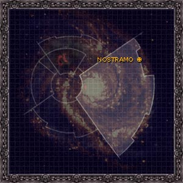
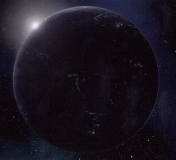

# 1069 诺斯特拉莫 Nostramo

精校状态：中文行文已逐段精校，部分术语仍为暂定

分类：地理 / 小行星 / 极限星域 Ultima Segmentum

原文来源：https://www.bilibili.com/opus/1097064080584212502

原作者：帝国神选罐头

原文时间：2025年08月04日 08:48

[返回分类目录](目录.md) · [全书目录](../../目录.md)

<!-- A1069-B0001 图片 -->

<!-- A1069-B0002 -->

原译文

Map 地图

**校订译文**

Map 地图

<!-- /A1069-B0002 -->

<!-- A1069-B0003 -->
### Basic Data 基本资料

原题：Basic Data 基础信息

<!-- /A1069-B0003 -->

<!-- A1069-B0004 -->
**英文原文**

Name:Nostramo

<!-- /A1069-B0004 -->

<!-- A1069-B0005 -->

原译文

名称：诺斯特拉莫

**校订译文**

名称：诺斯特拉莫

<!-- /A1069-B0005 -->

<!-- A1069-B0006 -->
**英文原文**

Segmentum:Ultima Segmentum

<!-- /A1069-B0006 -->

<!-- A1069-B0007 -->

原译文

星域：极限星域

**校订译文**

星域：极限星域

<!-- /A1069-B0007 -->

<!-- A1069-B0008 -->
**英文原文**

Sector:Nostramo Sector

<!-- /A1069-B0008 -->

<!-- A1069-B0009 -->

原译文

星区：诺斯特拉莫星区

**校订译文**

星区：诺斯特拉莫星区

<!-- /A1069-B0009 -->

<!-- A1069-B0010 -->
**英文原文**

Affiliation:Imperium

<!-- /A1069-B0010 -->

<!-- A1069-B0011 -->

原译文

隶属：帝国

**校订译文**

隶属：帝国

<!-- /A1069-B0011 -->

<!-- A1069-B0012 -->
**英文原文**

Class:Destroyed, former Hive World and Adeptus Astartes Homeworlds

<!-- /A1069-B0012 -->

<!-- A1069-B0013 -->

原译文

级别：毁灭，前巢都世界和阿斯塔特修会家园世界

**校订译文**

级别：毁灭，前巢都世界和阿斯塔特修会家园世界

<!-- /A1069-B0013 -->

<!-- A1069-B0014 -->
**英文原文**

Tithe Grade:Aptus non

<!-- /A1069-B0014 -->

<!-- A1069-B0015 -->

原译文

什一税等级：特级免税

**校订译文**

什一税等级：特级免税

<!-- /A1069-B0015 -->

<!-- A1069-B0016 图片 -->

<!-- A1069-B0017 -->

原译文

Planetary Image 行星图片

**校订译文**

Planetary Image 行星图片

<!-- /A1069-B0017 -->

<!-- A1069-B0018 -->
**英文原文**

Nostramo was the homeworld of the Night Lords Space Marine Legion until Night Haunter destroyed it.

<!-- /A1069-B0018 -->

<!-- A1069-B0019 -->

原译文

诺斯特拉莫是午夜领主星际战士军团的家园世界，直到午夜幽魂摧毁了它。

**校订译文**

诺斯特拉莫是午夜领主星际战士军团的家园世界，直到午夜幽魂摧毁了它。

<!-- /A1069-B0019 -->

<!-- A1069-B0020 -->
## Overview 概述

<!-- /A1069-B0020 -->

<!-- A1069-B0021 -->
**英文原文**

Nostramo, on the inside edge of the Ghoul Stars, was a planet of perpetual darkness, covered in clouds of pollution and a perpetual solar eclipse. Only the planetary elite could afford artificial illumination. Murder, extortion, and theft were rampant, while the elite oppressed the vast underclass of foundry workers with hired thugs, the closest approximation the planet had to law enforcement. Violence, both interpersonal and suicide, kept the population in check.

<!-- /A1069-B0021 -->

<!-- A1069-B0022 -->

原译文

诺斯特拉莫位于食尸鬼群星的内侧边缘，是一颗永远黑暗的星球，被污染的云层和永恒的日食所覆盖。只有行星精英才能负担得起人工照明。谋杀、勒索和盗窃猖獗，而精英阶层则用雇佣的暴徒压迫广大的铸造工人下层阶级，这是行星上最接近法律的地方。暴力，包括人际暴力和自杀，控制了人口。

**校订译文**

诺斯特拉莫位于食尸鬼群星内缘，是一个永夜世界，污染云层与持续的日食使它终年黑暗。只有上层权贵负担得起人工照明。谋杀、勒索和盗窃横行，权贵雇佣暴徒压迫数量庞大的底层铸造工人；这些暴徒已是当地最接近执法机构的存在。人与人之间的暴力及自杀不断夺去生命，使人口规模受到限制。

<!-- /A1069-B0022 -->

<!-- A1069-B0023 -->
**英文原文**

Nostramo's geology contained priceless wealth, particularly huge quantities of naturally occurring adamantium. The mineral trade made Nostramo great amounts of wealth, but at the cost of vast chemical and metalworking facilities scarring the landscape, throwing up the toxic clouds that perpetually darkened the skies.

<!-- /A1069-B0023 -->

<!-- A1069-B0024 -->

原译文

诺斯特拉莫的地质蕴藏着无价的财富，尤其是大量的天然精金。矿产贸易为诺斯特拉莫带来了巨大的财富，但代价是巨大的化学和金属加工设施在景观上留下了疤痕，扬起了永远笼罩天空的有毒云层。

**校订译文**

诺斯特拉莫的地质蕴藏着无价的财富，尤其是大量的天然精金。矿产贸易为诺斯特拉莫带来了巨大的财富，但代价是巨大的化学和金属加工设施在景观上留下了疤痕，扬起了永远笼罩天空的有毒云层。

<!-- /A1069-B0024 -->

<!-- A1069-B0025 -->
**英文原文**

The planet's synchronicity with its moon, Tenebor, kept the planet under the darkness of a solar eclipse even in the height of summer. As a result, the human population of Nostramo had pale albino skin and black eyes adapted to live in an environment of near-total darkness.

<!-- /A1069-B0025 -->

<!-- A1069-B0026 -->

原译文

这颗行星与其卫星特内波的同步性使这颗行星即使在盛夏也处于日食的黑暗中。因此，诺斯特拉莫的人口有着苍白的白化皮肤和黑色的眼睛，适应了几乎完全黑暗的环境。

**校订译文**

这颗行星与其卫星特内波的同步性使这颗行星即使在盛夏也处于日食的黑暗中。因此，诺斯特拉莫的人口有着苍白的白化皮肤和黑色的眼睛，适应了几乎完全黑暗的环境。

<!-- /A1069-B0026 -->

<!-- A1069-B0027 -->
**英文原文**

The Nostraman Damnatii Solar Auxilia Regiments were originally mustered from Nostramo, before the planets destruction at the hands of the Night Haunter, after the destruction the Damnatii mustered from across the Nostramo Sector and beyond.

<!-- /A1069-B0027 -->

<!-- A1069-B0028 -->

原译文

诺斯特拉莫定罪者太阳辅助军最初是从诺斯特拉莫召集而来的，在行星被午夜幽魂摧毁之前，定罪者从诺斯特拉莫星区内外召集而来。

**校订译文**

诺斯特拉莫定罪者太阳辅助军最初在诺斯特拉莫征募。母星被午夜幽魂毁灭后，这些部队改从诺斯特拉莫星区乃至更远地区招兵。

**校注：** 原译将“星球毁灭后改从星区招募”误接到毁灭前；按after the destruction恢复时间关系。

<!-- /A1069-B0028 -->

<!-- A1069-B0029 -->
### The Purging of Nostramo Quintus 诺斯特拉莫昆图斯净化

<!-- /A1069-B0029 -->

<!-- A1069-B0030 -->
**英文原文**

One year, the petty criminals of Nostramo Quintus started turning up gruesomely dismembered. This pattern soon stretched to corrupt bureaucrats and protestors as the long, hot summer stretched on. Quintus quickly developed a self-imposed curfew: the city's streets, once buzzing with activity, went silent at dusk. By the end of the year, crime had fallen to near-zero as the people lived in fear of the "Night Haunter".

<!-- /A1069-B0030 -->

<!-- A1069-B0031 -->

原译文

有一年，诺斯特拉莫昆图斯的小罪犯开始被残忍地肢解。随着漫长炎热的夏天的持续，这种模式很快蔓延到腐败的官僚和抗议者。昆图斯很快制定了一项自我实施的宵禁：这座城市的街道曾经热闹非凡，但在黄昏时分却变得寂静无声。到年底，由于人们生活在对“午夜幽魂”的恐惧中，犯罪率已降至接近零。

**校订译文**

某年，诺斯特拉莫昆图斯城接连出现被残忍肢解的小罪犯尸体。漫长炎热的夏季持续着，受害者很快扩大到腐败官僚与抗议者。城里人自发实行宵禁，往日喧闹的街道一到傍晚便寂静无人。到年底，居民对“午夜幽魂”的恐惧已使犯罪率降至几乎为零。

**校注：** 原文有永恒日食却又用dusk、summer等时间称谓，照实保留其叙事，不擅自建立天文解释。

<!-- /A1069-B0031 -->

<!-- A1069-B0032 -->
**英文原文**

The Night Haunter became the city's first monarch. The few nobles who survived by swearing loyalty to him became his mouthpieces. He would rule with a fair and even hand, but any who transgressed would suffer, not at the hand of an appointed enforcer, but by that of the Night Haunter himself. The Night Haunter eventually claimed the other four cities of Nostramo, bringing increased productivity and fearful peace to the world.

<!-- /A1069-B0032 -->

<!-- A1069-B0033 -->

原译文

午夜幽魂成为这座城市的第一位君主。少数靠宣誓效忠他而幸存下来的贵族成了他的喉舌。他以公正和公平的方式统治，任何违法者都会受到惩罚，不是被指定的执法者所惩罚，而是被午夜幽魂自己所惩罚。午夜幽魂最终占领了诺斯特拉莫的其他四个城市，为世界带来了更高的生产力和可怕的和平。

**校订译文**

午夜幽魂成为城市的第一位君主。少数宣誓效忠而得以活命的贵族，成为他的传声筒。他秉公统治，一视同仁，但任何违法者都会受罚，而且由他亲自动手，而非交给指定的执法者。最终，他将诺斯特拉莫其余四城也纳入统治，使生产增长，并带来靠恐惧维系的和平。

<!-- /A1069-B0033 -->

<!-- A1069-B0034 -->
### The Fall of Nostramo 诺斯特拉莫之陨

<!-- /A1069-B0034 -->

<!-- A1069-B0035 -->
**英文原文**

The Night Haunter warned his governors that his father's space fleet was coming for him. When the Delegation of Light arrived, the rain stopped as if in acknowledgement of its presence and the citizens wept at the sight of the Astartes: the primarchs Rogal Dorn, Lorgar, Ferrus Manus, and Fulgrim, representatives of their legions, and a group of Ultramarines. The Emperor of Mankind led the procession, the sight of him striking blind all who looked upon him.

<!-- /A1069-B0035 -->

<!-- A1069-B0036 -->

原译文

午夜幽魂警告他的总督们，他父亲的太空舰队要来找他了。当光明的代表团到达时，雨停了下来，仿佛在承认它的存在，市民们一看到阿斯塔特就流泪了：原体罗格·多恩、珞珈、费鲁斯·马努斯和福格瑞姆，他们军团的代表，以及一群极限战士。人类帝皇率领队伍，他一眼就让所有看着他的人都失明了。

**校订译文**

午夜幽魂预先告知总督们，父亲的太空舰队即将前来找他。光明使团抵达时，雨仿佛也为其停歇。居民望见来访者便流下眼泪：罗格·多恩、珞珈、费鲁斯·马努斯、福格瑞姆四位原体，各自军团的代表，以及一队极限战士。帝皇走在队伍最前方，凡直视其光辉者，皆双目失明。

**校注：** 原文是观看帝皇者被其光辉致盲，不是帝皇“看了一眼”便主动攻击旁人。

<!-- /A1069-B0036 -->

<!-- A1069-B0037 -->
**英文原文**

The Night Haunter collapsed in agony at the Emperor's first breath to him. When he recovered, the Night Haunter listened to the Emperor speak.

<!-- /A1069-B0037 -->

<!-- A1069-B0038 -->

原译文

午夜幽魂在帝皇第一次呼吸时痛苦地倒下了。当他恢复时，午夜幽魂听到了帝皇的讲话。

**校订译文**

帝皇刚开口对他说话，午夜幽魂就因剧痛倒下。恢复过来后，他听见帝皇说道：

**校注：** first breath to him在对话语境指刚开口说话，原译帝皇第一次呼吸不合语境。

<!-- /A1069-B0038 -->

<!-- A1069-B0039 -->
**英文原文**

"Be at peace, Konrad Curze. I have arrived and I intend to take you home."

<!-- /A1069-B0039 -->

<!-- A1069-B0040 -->

原译文

“安心吧，康拉德·科兹。我已经到了，我打算带你回家。”

**校订译文**

“安心吧，康拉德·科兹。我已经到了，我打算带你回家。”

<!-- /A1069-B0040 -->

<!-- A1069-B0041 -->
**英文原文**

"That is not my name, father. My people gave me a name and I will bear it until my dying day. And I know full well what you intend for me."

<!-- /A1069-B0041 -->

<!-- A1069-B0042 -->

原译文

“这不是我的名字，父亲。我的人民给了我一个名字，我会一直沿用到我死去的那一天。我完全知道你对我的意图。”

**校订译文**

“这不是我的名字，父亲。我的人民给了我一个名字，我会一直沿用到我死去的那一天。我完全知道你对我的意图。”

<!-- /A1069-B0042 -->

<!-- A1069-B0043 -->
**英文原文**

At first, the people felt they were free to speak their minds again, no longer subject to the gruesome punishments of the Night Haunter, but replacing his autocracy with the Administratum soon became a return to the old ways. Eventually Ashkar Skraivok, a relative of the Night Lords Captain Gendor Skraivok, launched a coup that massacred the Imperial Governor and his cabinet. Ashkar did not secede from the Imperium, but declared the old ways of Nostramo were to be restored. The bureaucratic corruption of the Administratum was bad enough, but the Emperor's arrival robbed the Nostramans of their ignorance. They now knew that there were better places in the galaxy than this one and they would never be able to see them. The only class of people who would ever get off-world were the new breed of violent criminals who were selected to fill the ranks of the Night Lords Space Marine Legion. The criminals were dispatched to the Legion as the old nobility of Nostramo, now gaining strength in Curze's absence, intended to keep the best fighters for their own interests.

<!-- /A1069-B0043 -->

<!-- A1069-B0044 -->

原译文

起初，人们觉得他们可以再次自由地表达自己的想法，不再受到午夜幽魂的可怕惩罚，但用内务部取代他的独裁统治很快就变成了对旧路的回归。最终，午夜领主詹多·斯卡莱沃克连长的亲属阿什卡尔·斯卡莱沃克发动政变，屠杀了帝国总督及其内阁。阿什卡尔没有脱离帝国，但宣布恢复诺斯特拉莫的旧路。政府的官僚腐败已经够糟糕的了，但帝皇的到来剥夺了诺斯特拉莫的无知。他们现在知道银河系中有比这更好的地方，他们永远无法看到它们。唯一能离开这个世界的人是新一代的暴力罪犯，他们被选为午夜领主星际战士军团的成员。罪犯们作为诺斯特拉莫的旧贵族被派往军团，在科兹缺席的情况下，他们的力量正在增强，目的是为了自己的利益留住最好的战士。

**校订译文**

起初，人们觉得自己终于可以自由说话，不再惧怕午夜幽魂可怖的惩罚。然而，内政部接替其独裁统治后，社会很快重归旧路。午夜领主连长詹多·斯卡莱沃克的亲属阿什卡尔·斯卡莱沃克发动政变，杀死帝国总督及内阁。他并未宣布脱离帝国，而是要恢复诺斯特拉莫旧制。内政部的官僚腐败已经够糟，帝皇的到来还使当地人失去了对外界的无知：他们知道银河里存在更好的地方，也知道自己永远无缘得见。唯一能够离开母星的，是获选补入午夜领主军团的新一代凶暴罪犯。科兹离去后，旧贵族重新坐大，为了自身利益留住最好的战士，却把罪犯送进军团。

**校注：** 送往军团的罪犯不是旧贵族本人；旧贵族保留优秀战士自用，把罪犯作为新兵输送给军团。

<!-- /A1069-B0044 -->

<!-- A1069-B0045 -->
**英文原文**

The next time the Night Haunter returned to Nostramo would be the last. Word had reached the legion that Imperial governor Basileus's regime allowed crime to run rampant once again. The Night Haunter's entire fleet arrived in orbit and aimed their weapons at their home world. Countless lance barrages and orbital torpedoes pummeled the surface. The bombardment reached the planet's core, possibly through a weakness left in the crust by Curze's landing or the extensive adamantium mining, and the planet burst apart. There were widespread mutinties among the Nostraman-born Human crew of the Night Lords fleet during the bombardment, which were brutally put down by Sevatar and his Atramentar. Even a few Night Lords themselves rebelled, but were purged with all the rest.

<!-- /A1069-B0045 -->

<!-- A1069-B0046 -->

原译文

午夜幽魂下次回到诺斯特拉莫将是最后一次。有消息传来，帝国总督巴赛勒斯的政权允许犯罪再次猖獗。午夜幽魂的整个舰队都进入了轨道，并将武器对准了他们的家园。无数的炮火和轨道鱼雷袭击了行星表面。轰击到达了行星的核心，可能是通过科兹着陆或大规模开采精金留下的地壳弱点，行星破碎了。轰炸期间，午夜领主舰队中的诺斯特拉莫裔人类船员中发生了广泛的哗变，这些哗变被赛维塔和他的黑甲卫残酷地镇压了下来。即使是少数午夜领主也反抗了，但与其他人一起被清除了。

**校订译文**

午夜幽魂下一次返回诺斯特拉莫，也将是最后一次。军团获悉，帝国总督巴西琉斯的政权纵容犯罪再度泛滥。午夜幽魂率整支舰队进入轨道，将武器对准母星。无数光矛齐射与轨道鱼雷轰击地表，火力深入星核；突破口或许是科兹当年坠落留下的地壳弱点，也可能源于过度开采精金。行星终于迸裂。轰炸期间，舰队中诺斯特拉莫出身的人类船员爆发大规模哗变，被赛维塔及其黑甲卫残酷镇压。甚至有少数午夜领主也起兵反抗，最终与其他叛乱者一道遭到清洗。

<!-- /A1069-B0046 -->

<!-- A1069-B0047 -->
## Trivia 琐事

<!-- /A1069-B0047 -->

<!-- A1069-B0048 -->
**英文原文**

As many names in the background of the Night Lords links to the writer Joseph Conrad, Nostramo is probably a reference to Nostromo, a supposedly incorruptible anti-hero who is killed when he succumbs to his thirst for power.

<!-- /A1069-B0048 -->

<!-- A1069-B0049 -->

原译文

正如午夜领主背景中的许多名字都与作家约瑟夫·康拉德有关一样，诺斯特拉莫可能是指诺斯特罗莫，一个被认为是廉洁的反英雄，当他屈服于对权力的渴望时被杀。

**校订译文**

午夜领主背景中的许多名字都与作家约瑟夫·康拉德有关。Nostramo可能借用了《诺斯特罗莫》中同名人物Nostromo的名字；原文将其描述为一个看似不可收买、最终因屈从权力欲望而丧命的反英雄。

<!-- /A1069-B0049 -->

<!-- A1069-B0050 -->
**英文原文**

The name is also used as the name for the ship in the science-fiction horror film Alien, slightly based upon another of Conrad's novels.

<!-- /A1069-B0050 -->

<!-- A1069-B0051 -->

原译文

这个名字也被用作科幻恐怖电影 异形 中舰船的名字，这部电影稍微基于康拉德的另一部小说。

**校订译文**

科幻恐怖电影《异形》也将Nostromo用作舰名。原文称，这与康拉德的另一部小说亦有些许联系。

**校注：** 此为原稿的文学、电影命名联想，具体作品关系没有给出依据。译文保留来源归属，不将其升级为本次查证结论。

<!-- /A1069-B0051 -->

本篇核心术语与暂定项

以下列出本篇出现的英文原形及核心术语表用词。同形词可能指不同对象，具体词义以本篇正文和校注为准；单复数、别名和仅见于图注的名称可能尚未列入。完整候选见[术语表](../../术语表/双语术语候选.csv)。

| 英文 | 采用中文 | 状态 |
| --- | --- | --- |
| Adeptus Astartes | 阿斯塔特修会 | 官方已核对 |
| Ultramarines | 极限战士 | 官方已核对 |
| Imperium | 帝国 | 暂定·简称 |
| Administratum | 内政部 | 暂定 |
| Emperor of Mankind | 人类帝皇 | 暂定 |
| Emperor | 帝皇 | 官方已核对 |
| Hive World | 巢都世界 | 暂定·官方待核 |
| Night Lords | 午夜领主 | 暂定·官方待核 |
| Ferrus Manus | 费鲁斯·马努斯 | 暂定·官方待核 |
| Murder | 谋杀 | 暂定·官方待核 |
| Fulgrim | 福格瑞姆 | 官方已核对 |
| Solar Auxilia | 太阳辅助军 | 暂定·官方待核 |
| Ultima Segmentum | 极限星域 | 暂定·官方待核 |
| Segmentum | 星域 | 暂定·官方待核 |
| Sector | 星区 | 暂定·官方待核 |
| Ghoul Stars | 食尸鬼群星 | 暂定·官方待核 |
| Perpetual | 永生者 | 暂定·官方待核 |
| Konrad Curze | 康拉德·科兹 | 暂定·官方待核 |
| Nostramo | 诺斯特拉莫 | 暂定·官方待核 |
| Adeptus Astartes Homeworlds | 阿斯塔特修会母星 | 暂定·官方待核 |
| Aptus Non | 特级免税 | 暂定·官方待核 |
| Lance | 骑士矛阵 | 暂定·官方待核 |
| Space Marine Legion | 星际战士军团 | 暂定·官方待核 |
| The Primarchs | 原体 | 暂定·官方待核 |
| Space Marine | 星际战士 | 暂定·官方待核 |
| Captain | 连长 | 暂定·官方待核 |
| Lorgar | 珞珈 | 暂定·官方待核 |
| Gendor Skraivok | 詹多·斯卡莱沃克 | 暂定·官方待核 |
| Basileus | 巴西琉斯 | 暂定·官方待核 |
| Rampant | 猖獗号 | 暂定·官方待核 |
| Sevatar | 赛维塔 | 暂定·官方待核 |
| Bear | 熊 | 暂定·官方待核 |
| Nostramo Quintus | 诺斯特拉莫昆图斯 | 暂定·官方待核 |
| Zero | 零世界 | 暂定·官方待核 |
| Quintus | 昆图斯 | 暂定·官方待核 |
| Corruption | 腐败 | 暂定·官方待核 |
| Nostraman Damnatii | 诺斯特拉莫定罪者 | 暂定·官方待核 |
| Ashkar Skraivok | 阿什卡尔·斯卡莱沃克 | 暂定·官方待核 |

