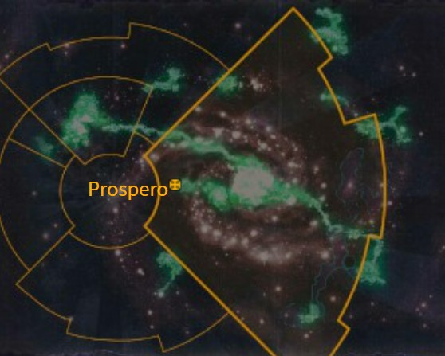
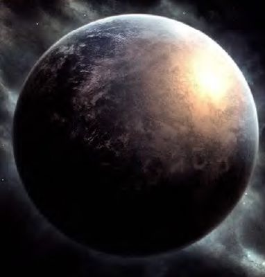

# 1070 普罗斯佩罗 Prospero

精校状态：中文行文已逐段精校，部分术语仍为暂定

分类：地理 / 小行星 / 极限星域 Ultima Segmentum

原文来源：https://www.bilibili.com/opus/1101136852056801289

原作者：帝国神选罐头

原文时间：2025年08月15日 08:13

[返回分类目录](目录.md) · [全书目录](../../目录.md)

<!-- A1070-B0001 图片 -->

<!-- A1070-B0002 -->

原译文

Map 地图

**校订译文**

Map 地图

<!-- /A1070-B0002 -->

<!-- A1070-B0003 -->
### Basic Data 基本资料

原题：Basic Data 基础信息

<!-- /A1070-B0003 -->

<!-- A1070-B0004 -->
**英文原文**

Name:Prospero

<!-- /A1070-B0004 -->

<!-- A1070-B0005 -->

原译文

名称：普罗斯佩罗

**校订译文**

名称：普罗斯佩罗

<!-- /A1070-B0005 -->

<!-- A1070-B0006 -->
**英文原文**

Segmentum:Ultima Segmentum

<!-- /A1070-B0006 -->

<!-- A1070-B0007 -->

原译文

星域：极限星域

**校订译文**

星域：极限星域

<!-- /A1070-B0007 -->

<!-- A1070-B0008 -->
**英文原文**

Sector:Prospero Sector

<!-- /A1070-B0008 -->

<!-- A1070-B0009 -->

原译文

星区：普罗斯佩罗星区

**校订译文**

星区：普罗斯佩罗星区

<!-- /A1070-B0009 -->

<!-- A1070-B0010 -->
**英文原文**

Subsector:Prospero Subsector

<!-- /A1070-B0010 -->

<!-- A1070-B0011 -->

原译文

分区：普罗斯佩罗分区

**校订译文**

次星区：普罗斯佩罗次星区

<!-- /A1070-B0011 -->

<!-- A1070-B0012 -->
**英文原文**

System:Forzare System

<!-- /A1070-B0012 -->

<!-- A1070-B0013 -->

原译文

星系：福扎雷星系

**校订译文**

星系：福扎雷星系

<!-- /A1070-B0013 -->

<!-- A1070-B0014 -->
**英文原文**

Population:Unclear, currently being repopulated

<!-- /A1070-B0014 -->

<!-- A1070-B0015 -->

原译文

人口：不清楚，目前正在重构

**校订译文**

人口：不明；正在重新迁入居民。

<!-- /A1070-B0015 -->

<!-- A1070-B0016 -->
**英文原文**

Affiliation:Thousand Sons (Chaos)

<!-- /A1070-B0016 -->

<!-- A1070-B0017 -->

原译文

隶属：千子（混沌）

**校订译文**

隶属：千子（混沌）

<!-- /A1070-B0017 -->

<!-- A1070-B0018 -->
**英文原文**

Class:Former Dead World and Adeptus Astartes Homeworld

<!-- /A1070-B0018 -->

<!-- A1070-B0019 -->

原译文

级别：前死亡世界和阿斯塔特修会家园世界

**校订译文**

类别：曾为死寂世界及阿斯塔特修会家园世界。

<!-- /A1070-B0019 -->

<!-- A1070-B0020 图片 -->

<!-- A1070-B0021 -->

原译文

Planetary Image 行星图像

**校订译文**

Planetary Image 行星图像

<!-- /A1070-B0021 -->

<!-- A1070-B0022 -->
**英文原文**

Prospero was the Homeworld of Magnus the Red and his Space Marine Legion, the Thousand Sons. Devastated and depopulated during the Horus Heresy in M31, Prospero remained a Dead World until M42, when the Thousand Sons returned to rebuilt it.

<!-- /A1070-B0022 -->

<!-- A1070-B0023 -->

原译文

普罗斯佩罗是赤红之马格努斯和他的千子星际战士军团的家园世界。在M31的荷鲁斯叛乱期间，普罗斯佩罗被摧毁，人口减少，直到M42，千子回来重建它，普罗斯佩罗一直是一个死亡世界。

**校订译文**

普罗斯佩罗曾是红魔马格努斯及其千子星际战士军团的家园世界。M31荷鲁斯之乱期间，它遭到毁灭性打击，居民尽失，此后长期成为死寂世界。直到M42，千子才返回重建。

<!-- /A1070-B0023 -->

<!-- A1070-B0024 -->
## History 历史

<!-- /A1070-B0024 -->

<!-- A1070-B0025 -->
**英文原文**

Prospero was a desolate, dark planet and was chosen by its inhabitants because of its distance from Terra. Mutants and Psykers lived in reclusion and study, and Magnus fit in well with this group due to his incredible psychic potential.

<!-- /A1070-B0025 -->

<!-- A1070-B0026 -->

原译文

普罗斯佩罗是一个荒凉、黑暗的行星，因其与泰拉的距离而被其居民选中。变种人和灵能者过着隐居和学习的生活，马格努斯因其令人难以置信的灵能潜力而与这一群体相处得很好。

**校订译文**

普罗斯佩罗荒凉而幽暗，居民正因它远离泰拉，才选择在此定居。变种人与灵能者隐居研学，拥有惊人灵能潜力的马格努斯也很好地融入了这个群体。

<!-- /A1070-B0026 -->

<!-- A1070-B0027 -->
**英文原文**

In the end, the only good thing about Prospero was its remoteness, which made it easy to hide on. It had one major city, Tizca, a gleaming city of white marble, with spires reaching into the sky. It was situated on the most central of the many mountains of the planet, nourished by underground hydroponics and techno-psychic collectible arrays providing sustainable energy. All the towers were gleaming and there were soaring obelisks and towering pyramids.

<!-- /A1070-B0027 -->

<!-- A1070-B0028 -->

原译文

最后，普罗斯佩罗唯一的好处是它地处偏远，很容易藏身。它有一个主要城市，提兹卡，一个闪闪发光的白色大理石城市，尖顶直插云霄。它位于行星上许多山脉的最中心，由地下水培和提供可持续能源的灵能技术收集阵列滋养。所有的塔楼都闪闪发光，有高耸的方尖碑和高耸的金字塔。

**校订译文**

说到底，普罗斯佩罗的最大好处就是偏远，适合藏身。当地主要城市提兹卡以洁白大理石建成，熠熠生辉，尖塔直插云霄。它坐落在众山中央的山峰上，依靠地下水培农业供粮、技术与灵能结合的采集阵列供能。城中高塔闪耀，方尖碑和金字塔巍然耸立。

<!-- /A1070-B0028 -->

<!-- A1070-B0029 -->
**英文原文**

When Magnus arrived, he crashed into the central plaza of the city. The city was very vulnerable from attack from above, but no one seemed to notice this until Leman Russ came and bombarded the planet. He attacked the planet with extreme viciousness and devastating results, slaughtering all he could find. In the end, after a grueling duel between the two primarchs, Magnus cast spells that took all of the great city, his marines, and his precious libraries to a new Homeworld, the Planet of Sorcerers.

<!-- /A1070-B0029 -->

<!-- A1070-B0030 -->

原译文

当马格努斯到达时，他撞上了城市的中心广场。这座城市非常容易受到来自上方的攻击，但直到黎曼·鲁斯来轰炸行星，似乎没有人注意到这一点。他以极端的恶毒和毁灭性的结果袭击了这个行星，屠杀了他能找到的一切。最后，在两位原体之间进行了一场艰苦的决斗后，马格努斯施展了咒语，将这座伟大的城市、他的战士和他珍贵的图书馆带到了一个新的家园世界 — 巫师星。

**校订译文**

马格努斯初到此地时，坠落在城市中央广场。提兹卡极易遭到空中攻击，直到黎曼·鲁斯前来轰炸，似乎都无人注意这一弱点。鲁斯以极端残酷的方式发动进攻，造成毁灭性后果，屠杀所能找到的一切生命。最终，两位原体经历艰苦决斗后，马格努斯施展法术，将整座大城、麾下战士及珍贵藏书一起转移到新的家园——巫师星。

**校注：** 源文明确声称“整座大城”被转移，但下一段仍描写提兹卡废墟；保留两段原述，不擅定转移范围。

<!-- /A1070-B0030 -->

<!-- A1070-B0031 -->
**英文原文**

Later in the Heresy, the White Scars under Jaghatai Khan arrived to investigate what had transpired. They found no survivors from either side and the vengeful ghosts of slain Thousand Sons wandering the ruins of Tizca. The Khan was confronted by a shade of Magnus, who discussed both of their successes and failures and may have been tempting his brother to join the forces of Chaos. After refusing Magnus, Jaghatai then refused the newly arrived Mortarion and the two Primarch's battled as their fleets clashed in space. After a brief but intense battle between Astartes warships, the Death Guard disengaged.

<!-- /A1070-B0031 -->

<!-- A1070-B0032 -->

原译文

后来，在叛乱时期，察合台可汗领导下的白色伤疤前来调查所发生的事情。他们没有发现任何一方的幸存者，被杀的千子的复仇之魂在提兹卡的废墟上游荡。可汗遇到了马格努斯的幻影，马格努斯讨论了他们的成功和失败，并可能一直在引诱他的兄弟加入混沌势力。在拒绝了马格努斯之后，察合台拒绝了新抵达的莫塔里安，两位原体的舰队在太空中发生冲突。在阿斯塔特战舰之间进行了短暂但激烈的战斗后，死亡守卫脱离了战斗。

**校订译文**

荷鲁斯之乱后续阶段，察合台可汗率白疤前来调查。废墟中看不到双方幸存者，只有被杀千子的复仇亡魂在提兹卡游荡。可汗见到马格努斯的幻影，两人谈起各自的成败；幻影或许正试图诱使兄弟加入混沌。察合台拒绝马格努斯后，又拒绝了随后抵达的莫塔里安。两位原体展开决斗，双方舰队也在太空交战。一场短促而激烈的阿斯塔特舰队战过后，死亡守卫撤离。

**校注：** 原译遗漏“两位原体亲自交战”，仅保留舰队战；此处补回。

<!-- /A1070-B0032 -->

<!-- A1070-B0033 -->
**英文原文**

10,000 years later, Prospero had become a hotbed of Warp activity ever since the Planet of the Sorcerers had emerged close to it following the Siege of the Fenris System. Upon the soil of Prospero the Space Wolves and Thousand Sons again came to blows as Njal Stormcaller attempted to rescue a force of Space Wolves 13th Great Company from Magnus the Red. Soritarius was again assaulted shortly after, this time by the Dark Angels and Grey Knights who sought to foil a ritual of the Thousand Sons.

<!-- /A1070-B0033 -->

<!-- A1070-B0034 -->

原译文

一万年后，自从芬里斯星系围攻后，巫师星出现在普罗斯佩罗附近以来，普罗斯佩罗就成为了亚空间活动的温床。在普罗斯佩罗的土地上，尼加尔·唤风者试图从赤红之马格努斯手中营救太空野狼第十三大连的一支部队，太空野狼和千子再次爆发冲突。不久之后，索提尔瑞斯再次遭到袭击，这次是被试图挫败千子仪式的黑暗天使和灰骑士袭击的。

**校订译文**

一万年后，芬里斯星系围攻战结束，巫师星出现在普罗斯佩罗附近，使这里成为亚空间活动的温床。风暴召唤者纳吉奥试图从红魔马格努斯手中救出太空野狼第十三大连的一支部队，双方因此再次在普罗斯佩罗地表交战。不久后，索提尔瑞斯又遭黑暗天使与灰骑士进攻，对方意图破坏千子的一场仪式。

<!-- /A1070-B0034 -->

<!-- A1070-B0035 -->
**英文原文**

Currently the world is part of Magnus' New Kingdom and the Daemon Primarch has ordered the rebuilding of his devastated home. However he does not want Prospero rebuilt to its former glory, lost in the Horus Heresy, but instead as an anvil, designed to hammer out the tools of war.

<!-- /A1070-B0035 -->

<!-- A1070-B0036 -->

原译文

目前，世界是马格努斯的新王国的一部分，恶魔原体已下令重建他被摧毁的家园。然而，他不想让普罗斯佩罗重建到在荷鲁斯叛乱中失去的昔日辉煌，而是把它当作铁砧，用来锤打战争工具。

**校订译文**

如今，普罗斯佩罗属于马格努斯的新王国。恶魔原体已下令重建毁坏的母星，不过，他并不打算恢复荷鲁斯之乱前的辉煌，而是要将它打造成一座锻造战争利器的铁砧。

<!-- /A1070-B0036 -->

<!-- A1070-B0037 -->
## Ecology 生态

<!-- /A1070-B0037 -->

<!-- A1070-B0038 -->
**英文原文**

At least one indigenous species on Prospero was known to have been hostile and extremely dangerous to human life. The psychneuein, a species commonly found on Prospero, was a major threat to the early settlers of Prospero and continued to present a problem to the inhabitants of the world all the way up to the end, when the planet's entire ecosystem was destroyed by planetary bombardment.

<!-- /A1070-B0038 -->

<!-- A1070-B0039 -->

原译文

普罗斯佩罗上至少有一种土著物种对人类生命充满敌意和极度危险。噬灵蜂是普罗斯佩罗上常见的一种物种，对普罗斯佩罗的早期定居者构成了重大威胁，并一直给世界居民带来问题，直到行星的整个生态系统被行星轰炸摧毁。

**校订译文**

普罗斯佩罗上至少有一种土著物种对人类生命充满敌意和极度危险。噬灵蜂是普罗斯佩罗上常见的一种物种，对普罗斯佩罗的早期定居者构成了重大威胁，并一直给世界居民带来问题，直到行星的整个生态系统被行星轰炸摧毁。

<!-- /A1070-B0039 -->

<!-- A1070-B0040 -->
**英文原文**

The psychneuein reproduced by implanting eggs into a host's brain psychically. An infected host would have no idea they'd been implanted until the eggs began to grow, causing severe pain and ultimately, death as the eggs hatched. On only one known occasion has a victim been successfully cured of the implanted psychic eggs. An archaeologist, living in Tizca, had been implanted while outside the city on a day trip. She later collapsed and was taken to a hospital where a team of highly skilled Thousand Sons Astartes were able to use their powers to remove the eggs from her brain in a form of psychic surgery.

<!-- /A1070-B0040 -->

<!-- A1070-B0041 -->

原译文

通过将卵植入宿主大脑进行灵能繁殖。在卵开始生长之前，受感染的宿主不会知道它们被植入体内，这会引起剧烈的疼痛，最终在卵孵化时死亡。只有一次已知的情况下，受害者成功治愈了植入的灵能卵。一位居住在提兹卡的考古学家在城外进行一日游时被植入体内。后来，她昏倒了，被送往医院，在那里，一个由技艺高超的千子阿斯塔特组成的团队能够利用他们的力量，以灵能手术的形式从她的大脑中取出卵。

**校订译文**

噬灵蜂通过灵能将卵植入宿主脑中繁殖。受害者起初毫不知情，直到虫卵生长才开始承受剧痛，最终在孵化时死亡。已知只有一例成功清除虫卵、救活宿主的记录：一名住在提兹卡的女考古学家外出一日游时遭到寄生，后来昏倒，被送入医院。一组技艺高超的千子阿斯塔特以灵能手术从她脑中取出了虫卵。

**校注：** psychically修饰植入虫卵的方式，不是泛称灵能繁殖；原译首句缺主语，已补噬灵蜂。

<!-- /A1070-B0041 -->

<!-- A1070-B0042 -->
**英文原文**

Prosperine Lynxes, another native species of fauna, were driven extinct by the Burning of Prospero. More akin to a saber-toothed cat than a Terran lynx in appearance, these large felines were speckle-striped, hugely muscular, and stood chest-high to an Astartes.

<!-- /A1070-B0042 -->

<!-- A1070-B0043 -->

原译文

另一种本土动物物种普罗斯佩罗猞猁因普罗斯佩罗之焚而灭绝。这些大型猫科动物在外观上更像剑齿猫，而不是泰拉猞猁，它们身上有斑点条纹，肌肉发达，齐胸高，像阿斯塔特一样。

**校订译文**

另一种本土动物普罗斯佩罗猞猁，在普罗斯佩罗之焚中灭绝。这种大型猫科动物长有斑点与条纹，肌肉极其发达，站立高度可及阿斯塔特胸口，外形更像剑齿猫，而非泰拉猞猁。

**校注：** chest-high to an Astartes指高度达到阿斯塔特胸部，不是与阿斯塔特等高。

<!-- /A1070-B0043 -->

<!-- A1070-B0044 -->
## Notable Locations 著名地点

<!-- /A1070-B0044 -->

<!-- A1070-B0045 -->

原译文

Tizca 提兹卡

**校订译文**

Tizca 提兹卡

<!-- /A1070-B0045 -->

<!-- A1070-B0046 -->

原译文

Great Library of Tizca 提兹卡大图书馆

**校订译文**

Great Library of Tizca 提兹卡大图书馆

<!-- /A1070-B0046 -->

<!-- A1070-B0047 -->

原译文

Pyramid of Photep 光芒金字塔

**校订译文**

Pyramid of Photep 光芒金字塔

<!-- /A1070-B0047 -->

<!-- A1070-B0048 -->
**英文原文**

Silver Spires - a cluster of great pyramids

<!-- /A1070-B0048 -->

<!-- A1070-B0049 -->

原译文

银塔 - 一组巨大的金字塔

**校订译文**

银塔 - 一组巨大的金字塔

<!-- /A1070-B0049 -->

<!-- A1070-B0050 -->
**英文原文**

The Desolation of Prospero - The expanse of the planet outside Tizca. Though barren, it was considered beautiful.

<!-- /A1070-B0050 -->

<!-- A1070-B0051 -->

原译文

普洛斯彼罗荒原 — 提兹卡城外广阔的行星。虽然贫瘠，但它被认为是美丽的。

**校订译文**

普罗斯佩罗荒原——提兹卡城外的广阔地区，虽荒芜，却被认为景色优美。

<!-- /A1070-B0051 -->

<!-- A1070-B0052 -->
## Known military forces 已知军事力量

<!-- /A1070-B0052 -->

<!-- A1070-B0053 -->
**英文原文**

Beside the Thousand Sons Legion was Prospero the homeworld for the Prospero Spireguard Solar Auxilia Regiments.

<!-- /A1070-B0053 -->

<!-- A1070-B0054 -->

原译文

千子军团旁边是普罗斯佩罗，普罗斯佩罗尖塔守卫太阳辅助军的家园世界。

**校订译文**

除千子军团外，普罗斯佩罗也是普罗斯佩罗尖塔守卫太阳辅助军各团的家园世界。

<!-- /A1070-B0054 -->

<!-- A1070-B0055 -->
## Trivia 琐事

<!-- /A1070-B0055 -->

<!-- A1070-B0056 -->
**英文原文**

Prospero is the name of a sorcerer in Shakespeare's "The Tempest."

<!-- /A1070-B0056 -->

<!-- A1070-B0057 -->

原译文

普罗斯佩罗是莎士比亚 暴风雨 中一位巫师的名字

**校订译文**

普罗斯佩罗也是莎士比亚戏剧《暴风雨》中一位巫师的名字。

<!-- /A1070-B0057 -->

本篇核心术语与暂定项

以下列出本篇出现的英文原形及核心术语表用词。同形词可能指不同对象，具体词义以本篇正文和校注为准；单复数、别名和仅见于图注的名称可能尚未列入。完整候选见[术语表](../../术语表/双语术语候选.csv)。

| 英文 | 采用中文 | 状态 |
| --- | --- | --- |
| Adeptus Astartes | 阿斯塔特修会 | 官方已核对 |
| Dark Angels | 黑暗天使 | 官方已核对 |
| Grey Knights | 灰骑士 | 官方已核对 |
| Space Wolves | 太空野狼 | 官方已核对 |
| Death Guard | 死亡守卫 | 官方已核对 |
| Thousand Sons | 千子 | 官方已核对 |
| Horus Heresy | 荷鲁斯之乱 | 官方已核对 |
| Warp | 亚空间 | 官方已核对 |
| Sorcerer | 巫师 | 官方已核对 |
| Primarch | 原体 | 官方已核对 |
| Planet of Sorcerers | 巫师之星 | 暂定·官方待核 |
| Mortarion | 莫塔里安 | 官方已核对 |
| Terra | 泰拉 | 暂定·官方待核 |
| Horus | 荷鲁斯 | 暂定·官方待核 |
| Magnus the Red | 红魔马格努斯 | 官方已核对 |
| Solar Auxilia | 太阳辅助军 | 暂定·官方待核 |
| Ultima Segmentum | 极限星域 | 暂定·官方待核 |
| Segmentum | 星域 | 暂定·官方待核 |
| Sector | 星区 | 暂定·官方待核 |
| Subsector | 次星区 | 暂定·官方待核 |
| Fenris | 芬里斯 | 暂定·官方待核 |
| Space Marine Legion | 星际战士军团 | 暂定·官方待核 |
| White Scars | 白疤 | 官方已核 |
| Scars | 伤疤 | 暂定·官方待核 |
| Space Marine | 星际战士 | 暂定·官方待核 |
| Brother | 修士 | 暂定·官方待核 |
| Njal Stormcaller | 风暴召唤者纳吉奥 | 官方已核 |
| Powers | 能天使 | 暂定·官方待核 |
| Host | 天军 | 暂定·官方待核 |
| Jaghatai Khan | 察合台可汗 | 暂定·官方待核 |
| Spireguard | 尖塔守卫 | 暂定·官方待核 |
| The Dark | 《黑暗》 | 暂定·官方待核 |
| System | 星系（恒星系统） | 暂定·官方待核 |
| Dead World | 死寂世界 | 暂定·官方待核 |
| Psychneuein | 灵能毒蜂 | 暂定·官方待核 |
| Forzare | 弗扎雷 | 暂定·官方待核 |
| Tizca | 提兹卡 | 暂定·官方待核 |
| Silver Spires | 银塔 | 暂定·官方待核 |
| The Desolation of Prospero | 普罗斯佩罗荒原 | 暂定·官方待核 |

