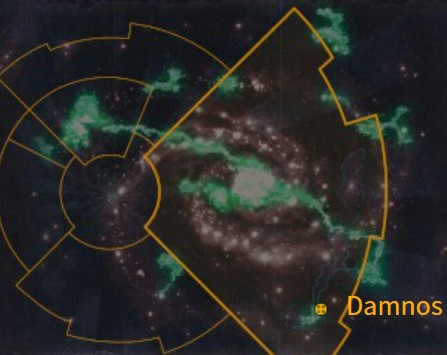

# 1071 达姆诺斯 Damnos

精校状态：中文行文已逐段精校，部分术语仍为暂定

分类：地理 / 小行星 / 极限星域 Ultima Segmentum

原文来源：https://www.bilibili.com/opus/1169614088325562370

原作者：帝国神选罐头

原文时间：2026年02月15日 21:00

[返回分类目录](目录.md) · [全书目录](../../目录.md)

<!-- A1071-B0001 图片 -->

<!-- A1071-B0002 -->

原译文

Map 地图

**校订译文**

Map 地图

<!-- /A1071-B0002 -->

<!-- A1071-B0003 -->
### Basic Data 基本资料

原题：Basic Data 基础数据

<!-- /A1071-B0003 -->

<!-- A1071-B0004 -->
**英文原文**

Name:Damnos

<!-- /A1071-B0004 -->

<!-- A1071-B0005 -->

原译文

名称：达姆诺斯

**校订译文**

名称：达姆诺斯

<!-- /A1071-B0005 -->

<!-- A1071-B0006 -->
**英文原文**

Segmentum:Ultima Segmentum

<!-- /A1071-B0006 -->

<!-- A1071-B0007 -->

原译文

星域：极限星域

**校订译文**

星域：极限星域

<!-- /A1071-B0007 -->

<!-- A1071-B0008 -->
**英文原文**

Sector:Vidar Sector

<!-- /A1071-B0008 -->

<!-- A1071-B0009 -->

原译文

星区：维达尔星区

**校订译文**

星区：维达尔星区

<!-- /A1071-B0009 -->

<!-- A1071-B0010 -->
**英文原文**

Affiliation:Imperium

<!-- /A1071-B0010 -->

<!-- A1071-B0011 -->

原译文

隶属：帝国

**校订译文**

隶属：帝国

<!-- /A1071-B0011 -->

<!-- A1071-B0012 -->
**英文原文**

Class:(Purgatus)/Dead World/Tomb World, former Mining World

<!-- /A1071-B0012 -->

<!-- A1071-B0013 -->

原译文

类别：（被净化）/死亡世界/坟墓世界，前矿业世界

**校订译文**

类别：已净化（Purgatus）／死寂世界／墓穴世界；原为矿业世界。

<!-- /A1071-B0013 -->

<!-- A1071-B0014 -->
**英文原文**

Damnos was an Imperial Mining World, which turned out to be a Necron Tomb World.

<!-- /A1071-B0014 -->

<!-- A1071-B0015 -->

原译文

达姆诺斯是一个帝国矿业世界，后来变成了一个死灵墓穴世界。

**校订译文**

达姆诺斯原是帝国矿业世界，后来人们才发现，它其实是一颗太空死灵墓穴世界。

**校注：** turned out to be指后来发现其真实身份，不是此后才转变为墓穴世界。

<!-- /A1071-B0015 -->

<!-- A1071-B0016 -->
## History 历史

<!-- /A1071-B0016 -->

<!-- A1071-B0017 -->
**英文原文**

Damnos was originally settled in the Great Crusade and, while rich in resources, was given low priority.

<!-- /A1071-B0017 -->

<!-- A1071-B0018 -->

原译文

达姆诺斯最初是在大远征中被定居的，虽然资源丰富，但优先级较低。

**校订译文**

达姆诺斯最初是在大远征中被定居的，虽然资源丰富，但优先级较低。

<!-- /A1071-B0018 -->

<!-- A1071-B0019 -->
**英文原文**

A "modest" military garrison was established along with a colony and fusion generators built.

<!-- /A1071-B0019 -->

<!-- A1071-B0020 -->

原译文

建立了一个“朴素”的军事驻军，并建造了一个殖民地和聚变发电机。

**校订译文**

殖民地建立后，当地部署了一支规模不大的驻军，并建造聚变发电设施。

<!-- /A1071-B0020 -->

<!-- A1071-B0021 -->
**英文原文**

Unknown to the Imperium, Damnos was a Necron Tomb World. Its Necron populace awakened in 973.M41, and had the entire planet conquered by 974.M41. By the time reinforcements arrived in the form of the Ultramarines 2nd Company, all they could do was launch fast raids in attempts to gather what remained of the populace and retreat into deep space. Damnos became a Necron World.

<!-- /A1071-B0021 -->

<!-- A1071-B0022 -->

原译文

帝国不知道的是，达姆诺斯是一个死灵墓穴世界。它的死灵于973.M41苏醒。整个行星在974.M41被征服。当增援部队以极限战士第二连队的形式到达时，他们所能做的就是发动快速袭击，试图聚集剩下的民众并撤退到深空。达姆诺斯变成了一个死灵世界。

**校订译文**

帝国起初并不知道达姆诺斯是太空死灵墓穴世界。973.M41，死灵居民苏醒，到974.M41便征服了整个行星。极限战士第二连增援抵达时，已无力扭转局势，只能发动快速突袭，尽可能聚拢幸存居民并撤向深空。达姆诺斯就此落入太空死灵之手。

<!-- /A1071-B0022 -->

<!-- A1071-B0023 -->
**英文原文**

In 999.M41 Cato Sicarius and the 2nd Company launched a new campaign to capture Damnos. Killing the Necron Lord known as The Undying, Damnos was reclaimed for the Imperium. In early M42 the Necrons, led by the Szarekhan Dynasty, again struck at Damnos and faced a large Space Marine resistance.

<!-- /A1071-B0023 -->

<!-- A1071-B0024 -->

原译文

999.M41，卡托·西卡留斯和第二连队发起了一场新的夺取达姆诺斯的战役。杀死了被称为不死者的死灵领主后，达姆诺斯被帝国夺回。在M42早期，由斯扎拉坎王朝领导的死灵再次袭击了达姆诺斯，并面临着巨大的星际战士抵抗。

**校订译文**

999.M41，卡托·西卡留斯率第二连再次出征达姆诺斯，杀死名为“不死者”的太空死灵领主，为帝国夺回行星。M42初期，斯扎拉坎王朝率领的太空死灵卷土重来，遭到大批星际战士抵抗。

<!-- /A1071-B0024 -->

<!-- A1071-B0025 -->
## Geography 地理

<!-- /A1071-B0025 -->

<!-- A1071-B0026 -->
**英文原文**

Damnos was entirely covered in thick glaciers of ice and snow. Underneath, the planet contained useful minerals. Additionally, it housed a Necron Tomb Complex.

<!-- /A1071-B0026 -->

<!-- A1071-B0027 -->

原译文

达姆诺斯完全被厚厚的冰雪冰川所覆盖。在地下，这颗行星含有有用的矿物。此外，它还容纳了一个死灵墓穴群。

**校订译文**

达姆诺斯完全被厚厚的冰雪冰川所覆盖。在地下，这颗行星含有有用的矿物。此外，它还容纳了一个死灵墓穴群。

<!-- /A1071-B0027 -->

<!-- A1071-B0028 -->
## Notable Locations 著名地点

<!-- /A1071-B0028 -->

<!-- A1071-B0029 -->
**英文原文**

Kellenport - A city that contained a large portion of Damnos's population.

<!-- /A1071-B0029 -->

<!-- A1071-B0030 -->

原译文

凯伦港 - 一个拥有达姆诺斯大部分人口的城市。

**校订译文**

凯伦港——达姆诺斯大量居民生活的城市。

<!-- /A1071-B0030 -->

<!-- A1071-B0031 -->
## Trivia 琐事

<!-- /A1071-B0031 -->

<!-- A1071-B0032 -->
## Conflicting sources 来源冲突

<!-- /A1071-B0032 -->

<!-- A1071-B0033 -->
**英文原文**

Although sources agree that Damnos is the Ultima Segmentum, they give widely different positions:

<!-- /A1071-B0033 -->

<!-- A1071-B0034 -->

原译文

尽管来源同意达姆诺斯是极限星域，但他们给出了截然不同的位置：

**校订译文**

各来源均称达姆诺斯位于极限星域，却给出了差异很大的具体位置：

<!-- /A1071-B0034 -->

<!-- A1071-B0035 -->
**英文原文**

The 6th edition Rulebook places it in the galactic east, on the Eastern Fringe, with the other worlds of the Vidar Sector.

<!-- /A1071-B0035 -->

<!-- A1071-B0036 -->

原译文

第6版规则书将其放置在银河系东部，在东部边缘，与维达尔星区的其他世界在一起。

**校订译文**

第6版规则书将其放置在银河系东部，在东部边缘，与维达尔星区的其他世界在一起。

<!-- /A1071-B0036 -->

<!-- A1071-B0037 -->
**英文原文**

The 8th edition Necron Codex, on the other hand, positions Damnos as much further south, near Macragge.

<!-- /A1071-B0037 -->

<!-- A1071-B0038 -->

原译文

另一方面，第8版死灵圣典将达姆诺斯定位在更南边的马库拉格附近。

**校订译文**

另一方面，第8版死灵圣典将达姆诺斯定位在更南边的马库拉格附近。

<!-- /A1071-B0038 -->

本篇核心术语与暂定项

以下列出本篇出现的英文原形及核心术语表用词。同形词可能指不同对象，具体词义以本篇正文和校注为准；单复数、别名和仅见于图注的名称可能尚未列入。完整候选见[术语表](../../术语表/双语术语候选.csv)。

| 英文 | 采用中文 | 状态 |
| --- | --- | --- |
| Necrons | 太空死灵 | 官方已核对 |
| Ultramarines | 极限战士 | 官方已核对 |
| Imperium | 帝国 | 暂定·简称 |
| Szarekhan Dynasty | 斯扎拉坎王朝 | 暂定·官方待核 |
| Great Crusade | 大远征 | 暂定·官方待核 |
| Ultima Segmentum | 极限星域 | 暂定·官方待核 |
| Segmentum | 星域 | 暂定·官方待核 |
| Sector | 星区 | 暂定·官方待核 |
| Eastern Fringe | 东部边缘 | 暂定·官方待核 |
| Damnos | 达蒙斯 | 暂定·官方待核 |
| Macragge | 马库拉格 | 暂定·官方待核 |
| Space Marine | 星际战士 | 暂定·官方待核 |
| Cato Sicarius | 卡托·西卡留斯 | 暂定·官方待核 |
| Necron Lord | 死灵领主 | 暂定·官方待核 |
| Dead World | 死寂世界 | 暂定·官方待核 |
| Mining World | 矿业世界 | 暂定·官方待核 |
| Purgatus | 净化者 | 暂定·官方待核 |
| Kellenport | 凯伦港 | 暂定·官方待核 |

