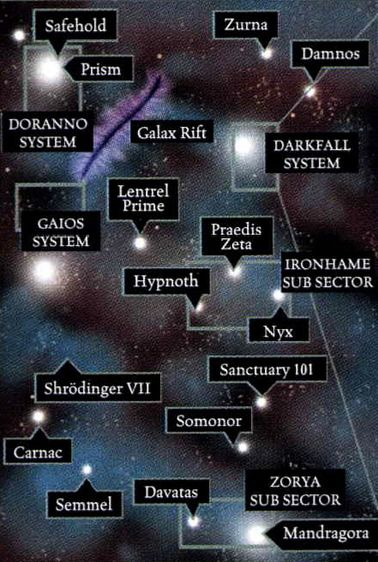

# 1072 安全港 Safehold

精校状态：中文行文已逐段精校，部分术语仍为暂定

分类：地理 / 小行星 / 极限星域 Ultima Segmentum

原文来源：https://www.bilibili.com/opus/1157999362885812242

原作者：帝国神选罐头

原文时间：2026年01月15日 13:48

[返回分类目录](目录.md) · [全书目录](../../目录.md)

<!-- A1072-B0001 -->
### Basic Data 基本资料

原题：Basic Data 基础数据

<!-- /A1072-B0001 -->

<!-- A1072-B0002 -->
**英文原文**

Name:Safehold

<!-- /A1072-B0002 -->

<!-- A1072-B0003 -->

原译文

名称：安全港

**校订译文**

名称：安全港

<!-- /A1072-B0003 -->

<!-- A1072-B0004 -->
**英文原文**

Segmentum:Ultima Segmentum

<!-- /A1072-B0004 -->

<!-- A1072-B0005 -->

原译文

星域：极限星域

**校订译文**

星域：极限星域

<!-- /A1072-B0005 -->

<!-- A1072-B0006 -->
**英文原文**

Sector:Vidar Sector

<!-- /A1072-B0006 -->

<!-- A1072-B0007 -->

原译文

星区：维达尔星区

**校订译文**

星区：维达尔星区

<!-- /A1072-B0007 -->

<!-- A1072-B0008 -->
**英文原文**

System:Doranno System

<!-- /A1072-B0008 -->

<!-- A1072-B0009 -->

原译文

星系：多兰诺星系

**校订译文**

星系：多兰诺星系

<!-- /A1072-B0009 -->

<!-- A1072-B0010 -->
**英文原文**

Class:Dead World

<!-- /A1072-B0010 -->

<!-- A1072-B0011 -->

原译文

类别：死亡世界

**校订译文**

类别：死寂世界

<!-- /A1072-B0011 -->

<!-- A1072-B0012 -->
**英文原文**

Safehold is a Dead World of the Imperium on the outskirts of the Doranno System.

<!-- /A1072-B0012 -->

<!-- A1072-B0013 -->

原译文

安全港是多兰诺星系边缘的帝国死亡世界。

**校订译文**

安全港是帝国的一颗死寂世界，位于多兰诺星系外围。

<!-- /A1072-B0013 -->

<!-- A1072-B0014 图片 -->

<!-- A1072-B0015 -->

原译文

Safehold's position relative to nearby worlds in the Vidar Sector 安全港相对于维达尔星区附近世界的位置

**校订译文**

Safehold's position relative to nearby worlds in the Vidar Sector 安全港相对于维达尔星区附近世界的位置

<!-- /A1072-B0015 -->

<!-- A1072-B0016 -->
## History 历史

<!-- /A1072-B0016 -->

<!-- A1072-B0017 -->
**英文原文**

It was scoured clean of life in 926.M41 by the planetoid-sized Necron warship known as the World Engine, the last such world to be destroyed before an Imperial task-force halted the machine's progress.

<!-- /A1072-B0017 -->

<!-- A1072-B0018 -->

原译文

926.M41，被称为“世界引擎”的小行星大小的死灵战舰彻底摧毁，这是帝国特遣部队阻止机器前进之前最后一个被摧毁的世界。

**校订译文**

926.M41，体型如小行星的太空死灵战舰“世界引擎”将这里的生命全部清除。在帝国特遣舰队终于阻止这座机器之前，安全港是最后一个遭其毁灭的世界。

<!-- /A1072-B0018 -->

<!-- A1072-B0019 -->
**英文原文**

The World Engine was destroyed thanks only to the sacrifice of the Astral Knights chapter of the Adeptus Astartes, who rammed their Battle Barge Tempestus through the World Engine's otherwise impenetrable void shields, and then died to the last man fighting the armies of Necron troops inside, but not before sabotaging the shields and allowing the Imperial Navy to demolish the machine.

<!-- /A1072-B0019 -->

<!-- A1072-B0020 -->

原译文

世界引擎之所以被摧毁，完全要归功于阿斯塔特修会的星界骑士战团的牺牲，他们将他们的战斗驳船暴风号撞穿了世界引擎无法穿透的虚空盾，然后在与里面的死灵大军作战直至最后一个人牺牲，但在此之前，他们破坏了护盾，允许帝国海军拆除了机器。

**校订译文**

世界引擎之所以被摧毁，全赖阿斯塔特修会星界骑士战团的牺牲。他们驾驶战斗驳船暴风号撞穿原本无法突破的虚空盾，登陆内部，与太空死灵大军战至最后一人。在全部阵亡之前，他们成功破坏护盾，使帝国海军得以摧毁世界引擎。

<!-- /A1072-B0020 -->

<!-- A1072-B0021 -->
**英文原文**

At the suggestion of Captain Aphael of the Blood Angels, the Adeptus Mechanicus salvaged the hull of the Tempestus and set it on Safehold as a shrine to the Astral Knights. Inside the shrine are 772 arbalstone statues, each representing one of the lost Knights and their Chapter Master, Artor Amhrad. The planet remains barren and lifeless, except for the shrine and the honour guard of Marines drawn from every other chapter who fought alongside the Astral Knights.

<!-- /A1072-B0021 -->

<!-- A1072-B0022 -->

原译文

在圣血天使连长阿法尔的建议下，机械神教打捞了暴风号的船体，并将其放置在安全港作为星界骑士的圣地。内有772尊阿贝尔石雕像，每尊都代表一位牺牲的骑士和他们的战团长阿尔托·阿姆拉德。除了圣地和与星界骑士并肩作战的来自每个其他战团的荣誉卫队战士，这个行星仍然荒芜且无生命。

**校订译文**

圣血天使连长阿菲尔提议后，机械修会打捞暴风号舰体，将它安置在安全港，作为纪念星界骑士的圣地。殿内立着772尊阿贝尔石雕像，纪念包括战团长阿尔托·阿姆拉德在内的阵亡骑士。行星仍然荒芜死寂，只有这座圣地以及驻守其中的荣誉卫队；卫队成员来自曾与星界骑士并肩作战的其他各个战团。

**校注：** 772尊雕像分别纪念阵亡成员，其中包括战团长；不是每尊像都同时代表骑士和战团长。Aphael沿全名赫鲁姆·阿菲尔词根。

<!-- /A1072-B0022 -->

<!-- A1072-B0023 -->
**英文原文**

Two of the Marines permanently assigned to this honour guard are Blood Angels.

<!-- /A1072-B0023 -->

<!-- A1072-B0024 -->

原译文

永久分配到这个荣誉卫队的两名战士是圣血天使。

**校订译文**

永久分配到这个荣誉卫队的两名战士是圣血天使。

<!-- /A1072-B0024 -->

本篇核心术语与暂定项

以下列出本篇出现的英文原形及核心术语表用词。同形词可能指不同对象，具体词义以本篇正文和校注为准；单复数、别名和仅见于图注的名称可能尚未列入。完整候选见[术语表](../../术语表/双语术语候选.csv)。

| 英文 | 采用中文 | 状态 |
| --- | --- | --- |
| Adeptus Astartes | 阿斯塔特修会 | 官方已核对 |
| Blood Angels | 圣血天使 | 官方已核对 |
| Adeptus Mechanicus | 机械修会 | 官方已核对 |
| Imperium | 帝国 | 暂定·简称 |
| Imperial Navy | 帝国海军 | 暂定 |
| Battle Barge | 战斗驳船 | 暂定·官方待核 |
| Ultima Segmentum | 极限星域 | 暂定·官方待核 |
| Segmentum | 星域 | 暂定·官方待核 |
| Sector | 星区 | 暂定·官方待核 |
| Safehold | 安全之地 | 暂定·官方待核 |
| Master | 导师（审判庭职衔）／舰务官（舰员职务） | 语境定译·官方待核 |
| Honour Guard | 荣誉卫队 | 暂定·官方待核 |
| Chapter | 战团 | 暂定·官方待核 |
| Chapter Master | 战团长 | 暂定·官方待核 |
| Captain | 连长 | 暂定·官方待核 |
| Astral Knights | 星界骑士 | 暂定·官方待核 |
| The Blood | 鲜血 | 暂定·官方待核 |
| System | 星系（恒星系统） | 暂定·官方待核 |
| Dead World | 死寂世界 | 暂定·官方待核 |
| Aphael | 阿菲尔 | 暂定·官方待核 |
| Artor Amhrad | 阿尔托·阿姆拉德 | 暂定·官方待核 |

