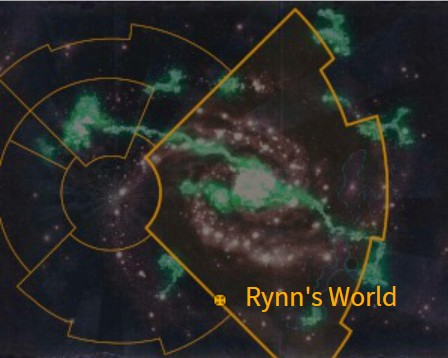
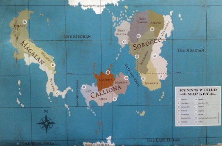
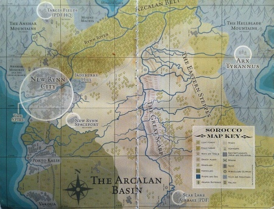

# 1073 瑞恩世界 Rynn's World

精校状态：中文行文已逐段精校，部分术语仍为暂定

分类：地理 / 小行星 / 极限星域 Ultima Segmentum

原文来源：https://www.bilibili.com/opus/1162375483559510017

原作者：帝国神选罐头

原文时间：2026年01月27日 08:50

[返回分类目录](目录.md) · [全书目录](../../目录.md)

<!-- A1073-B0001 图片 -->

<!-- A1073-B0002 -->

原译文

Map 地图

**校订译文**

Map 地图

<!-- /A1073-B0002 -->

<!-- A1073-B0003 -->
### Basic Data 基本资料

原题：Basic Data 基础数据

<!-- /A1073-B0003 -->

<!-- A1073-B0004 -->
**英文原文**

Name:Rynn's World

<!-- /A1073-B0004 -->

<!-- A1073-B0005 -->

原译文

名称：瑞恩世界

**校订译文**

名称：瑞恩世界

<!-- /A1073-B0005 -->

<!-- A1073-B0006 -->
**英文原文**

Segmentum:Ultima Segmentum

<!-- /A1073-B0006 -->

<!-- A1073-B0007 -->

原译文

星域：极限星域

**校订译文**

星域：极限星域

<!-- /A1073-B0007 -->

<!-- A1073-B0008 -->
**英文原文**

Sector:Loki Sector

<!-- /A1073-B0008 -->

<!-- A1073-B0009 -->

原译文

星区：洛基星区

**校订译文**

星区：洛基星区

<!-- /A1073-B0009 -->

<!-- A1073-B0010 -->
**英文原文**

System:Rynnstar System

<!-- /A1073-B0010 -->

<!-- A1073-B0011 -->

原译文

星系：瑞恩星系

**校订译文**

星系：瑞恩星系

<!-- /A1073-B0011 -->

<!-- A1073-B0012 -->
**英文原文**

Population:200 Million (pre-Invasion)

<!-- /A1073-B0012 -->

<!-- A1073-B0013 -->

原译文

人口：2亿（入侵前）

**校订译文**

人口：2亿（入侵前）

<!-- /A1073-B0013 -->

<!-- A1073-B0014 -->
**英文原文**

Affiliation:Imperium

<!-- /A1073-B0014 -->

<!-- A1073-B0015 -->

原译文

隶属：帝国

**校订译文**

隶属：帝国

<!-- /A1073-B0015 -->

<!-- A1073-B0016 -->
**英文原文**

Class:Adeptus Astartes Homeworld, Fortress World, former Agri World

<!-- /A1073-B0016 -->

<!-- A1073-B0017 -->

原译文

类别：阿斯塔特修会家园世界，堡垒世界，前农业世界

**校订译文**

类别：阿斯塔特修会家园世界，堡垒世界，前农业世界

<!-- /A1073-B0017 -->

<!-- A1073-B0018 -->
**英文原文**

Tithe Grade:Adeptus Non

<!-- /A1073-B0018 -->

<!-- A1073-B0019 -->

原译文

什一税等级：特级免税

**校订译文**

什一税等级：特级免税

<!-- /A1073-B0019 -->

<!-- A1073-B0020 图片 -->

<!-- A1073-B0021 -->

原译文

Planetary Image 行星图像

**校订译文**

Planetary Image 行星图像

<!-- /A1073-B0021 -->

<!-- A1073-B0022 -->
**英文原文**

Rynn's World is a world of the Imperium. Most notably it is the base and homeworld to the Crimson Fists Space Marines chapter.

<!-- /A1073-B0022 -->

<!-- A1073-B0023 -->

原译文

瑞恩世界是一个帝国的世界。最值得注意的是，它是绯红之拳星际战士战团的基地和家园世界。

**校订译文**

瑞恩世界是一个帝国的世界。最值得注意的是，它是绯红之拳星际战士战团的基地和家园世界。

<!-- /A1073-B0023 -->

<!-- A1073-B0024 -->
## Overview 概述

<!-- /A1073-B0024 -->

<!-- A1073-B0025 -->
**英文原文**

Rynn's World is located in the Loki Sector of the galaxy, galactically southeast of Terra. Described as a beautiful and peaceful world, the planet is sparsely populated, mountainous, and devoted to intensive agriculture. Due to its distance from other Imperial worlds and its proximity to the Ork Empire of Charadon, it is somewhat isolated from the rest of the Imperium, the closest neighbouring human planet being Badlanding. Though serving as the chapter's base, the world is not owned by the Crimson Fists, and has its own Planetary Governor. Before the devastating Invasion of Rynn's World, the planet was protected by a formidable missile defence system, designed to deter invaders.

<!-- /A1073-B0025 -->

<!-- A1073-B0026 -->

原译文

瑞恩世界位于银河系的洛基星区，在银河系中位于泰拉的东南部。这个行星被描述为一个美丽而和平的世界，人口稀少，多山，致力于密集农业。由于它与其他帝国世界的距离以及与查拉顿的欧克帝国的接近，它与帝国的其他地区有些隔离，最近的邻近人类行星是恶地登陆。虽然作为战团的基地，但世界并不属于绯红之拳，而是有自己的行星总督。在毁灭性的瑞恩世界入侵之前，这个行星受到一个强大的导弹防御系统的保护，旨在威慑入侵者。

**校订译文**

瑞恩世界位于洛基星区，处在泰拉的银河东南方。这里美丽宁静，人口稀疏，山地众多，主要发展集约农业。由于远离其他帝国世界，又靠近查拉顿欧克帝国，它与帝国其余疆域相对隔绝，最近的人类邻星是恶地登陆。瑞恩世界虽是绯红之拳基地，却并非战团私有，仍由自己的行星总督治理。毁灭性的入侵发生前，这里依靠强大导弹防御系统威慑敌人。

<!-- /A1073-B0026 -->

<!-- A1073-B0027 -->
**英文原文**

The serene nature of Rynn's World has made it unsuitable for recruitment or training, with the Crimson Fists preferring instead Blackwater.

<!-- /A1073-B0027 -->

<!-- A1073-B0028 -->

原译文

瑞恩世界的宁静性质使其不适合招募或训练，绯红之拳更喜欢黑水星。

**校订译文**

瑞恩世界的宁静性质使其不适合招募或训练，绯红之拳更喜欢黑水星。

<!-- /A1073-B0028 -->

<!-- A1073-B0029 -->
## Known history 已知历史

<!-- /A1073-B0029 -->

<!-- A1073-B0030 -->

原译文

725.M40: Ork invasion 欧克入侵

**校订译文**

725.M40: Ork invasion 欧克入侵

<!-- /A1073-B0030 -->

<!-- A1073-B0031 -->
**英文原文**

Late M40: The Crimson Fists Chapter are granted fiefdom over Rynn's World for their role in the Voltigern Crusade, where several Ork empires in the Loki sector were attacked and destabilized, later to collapse in civil war. They used their damaged battle barge to create their new Fortress-Monastery, Arx Tyrannus, in the Hellblade Mountains.

<!-- /A1073-B0031 -->

<!-- A1073-B0032 -->

原译文

绯红之拳战团因其在伏提庚远征中的作用而被授予瑞恩世界的封地，在那里，洛基星区的几个欧克帝国遭到袭击和破坏，后来在内战中崩溃。他们使用损坏的战斗驳船在狱刃山脉建造了新的堡垒修道院暴君堡。

**校订译文**

M40晚期——绯红之拳因在伏提庚远征中的战功，获授瑞恩世界作为封地。那次远征打击并动摇了洛基星区多个欧克帝国，它们后来在内战中崩溃。战团利用受损的战斗驳船，在狱刃山脉建起新的要塞修道院暴君堡。

**校注：** 补回原文M40晚期。上文世界不属战团私有与本段获授封地存在治理表述差异，保留原述。

<!-- /A1073-B0032 -->

<!-- A1073-B0033 -->
**英文原文**

989.M41: Invasion of Rynn's World: Snagrod, the Arch-Arsonist of Charadon invaded Rynn's World after the Crimson Fists' failed attempt to slow Waaagh! Snagrod on Badlanding. In a freak accident, the Crimson Fist's fortress-monastery was destroyed in the initial invasion by a rogue missile from the planet's own defence system and the chapter was all but wiped out. Without the protection of the Crimson Fists, the humans were quickly slain, and their settlements, with the exception of New Rynn City, the planet's capital, were completely overrun. The remains of the chapter defended New Rynn City until Imperial reinforcements arrived. With help of the Imperial forces, including the Imperial Fists, White Scars, White Panthers, Storm Lords, Angels Encarmine, Blood Drinkers and Minotaurs Space Marines, Rynn's World was eventually liberated. It is known that alone in the battle for Hellblade Mountains, the 15th Imperial Army led by Commissar-General Mordred Van Horcic lost over a million soldiers, despite the aid of a White Scars battle group. The Brother-Captain Subodai was killed in the action.

<!-- /A1073-B0033 -->

<!-- A1073-B0034 -->

原译文

入侵瑞恩世界：在绯红之拳试图在恶地登陆减缓斯纳格罗德的Waaagh!失败后，查拉顿的头号纵火狂斯纳格罗德入侵了瑞恩世界。在一次奇怪的事故中，绯红之拳的堡垒修道院在最初的入侵中被来自行星自身防御系统的失常导弹摧毁，战团几乎被摧毁。没有绯红之拳的保护，人类很快就被杀死了，他们的定居点，除了行星的首都新瑞恩城，都被完全占领了。在帝国援军到达之前，战团的残余一直保卫着新瑞恩城。在帝国军队的帮助下，包括帝国之拳、白色伤疤、白豹、风暴领主、赤红天使、饮血者和米诺陶星际战士，瑞恩世界最终被解放。众所周知，仅在狱刃山脉战役中，由政委将军莫德雷德·范·霍契奇领导的第15帝国军就损失了100多万士兵，尽管得到了白色疤痕战斗群的援助。兄弟连长苏博代在行动中丧生。

**校订译文**

989.M41——瑞恩世界入侵战。绯红之拳在恶地登陆阻滞斯纳哥罗德Waaagh!的行动失败后，这位查拉顿头号纵火狂进攻瑞恩世界。入侵初期，一场离奇事故使当地防御系统发射的一枚失控导弹摧毁战团要塞修道院，绯红之拳几乎全军覆没。失去保护的居民迅速遭到屠杀，除首都新瑞恩城外，所有聚居点均被攻陷。战团残部一直守住新瑞恩城，直到帝国援军抵达。在帝国之拳、白疤、白豹、风暴领主、赤红天使、饮血者和米诺陶等星际战士战团及其他帝国部队帮助下，瑞恩世界终于获救。仅狱刃山脉一战，政委将军莫德雷德·范·霍契奇指挥的第15帝国军就损失逾百万士兵，尽管有白疤战斗群协助也未能避免。兄弟连长苏博代也在此役阵亡。

**校注：** 补回989.M41。15th Imperial Army在此是第41千年的编号军团/军级军队称谓，按原稿第15帝国军保留，不据此指为大远征组织。Brother-Captain此处为白疤礼称，非灰骑士兄弟会连长。

<!-- /A1073-B0034 -->

<!-- A1073-B0035 -->
**英文原文**

Late M41: Battle For Traitor's Gorge: A half-year after the reclamation of the Rynn's World, forces of the Crimson Fists were fighting remaining Orks in the Jaden Mountains. They were nearly overcome when a mysterious xenos force came to their aid. After that, the Ork threat in the Jaden Mountains was completely eliminated.

<!-- /A1073-B0035 -->

<!-- A1073-B0036 -->

原译文

叛徒峡谷之战：在瑞恩世界改造半年后，绯红之拳的部队正在杰登山脉与剩余的欧克作战。当一支神秘的异型部队来帮助他们时，他们几乎征服了。在那之后，杰登山脉的欧克威胁被完全消除。

**校订译文**

M41晚期——叛徒峡谷之战。瑞恩世界收复半年后，绯红之拳在杰登山脉清剿欧克残部，一度濒临败北。此时，一支神秘异形部队前来援助，此后杰登山脉的欧克威胁被彻底消除。

**校注：** reclamation指收复，不是改造；were nearly overcome指几乎败北，原译“几乎征服”颠倒胜负。

<!-- /A1073-B0036 -->

<!-- A1073-B0037 -->
**英文原文**

???.M42: Rynn's World is engulfed by Daemonic armies spilling from the newly formed Great Rift. The Chaos hordes are led by the Daemon Prince Rhaxor and the Crimson Fists battle for their homeworld once more. The arrival of Guilliman's Indomitus Crusade manages to break the siege.

<!-- /A1073-B0037 -->

<!-- A1073-B0038 -->

原译文

瑞恩世界被从新形成的大裂隙溢出的恶魔军队吞没。混沌部落由恶魔王子拉索尔领导，绯红之拳再次为他们的家园世界而战。基里曼的不屈远征的到来打破了围困。

**校订译文**

???.M42——恶魔军队从新形成的大裂隙涌出，吞没瑞恩世界。恶魔王子拉索尔率领混沌大军，绯红之拳再度为母星而战，直到基里曼的不屈远征抵达，才打破围困。

<!-- /A1073-B0038 -->

<!-- A1073-B0039 -->
## Geography 地理

<!-- /A1073-B0039 -->

<!-- A1073-B0040 -->
**英文原文**

Rynn's World has three continents, each one was divided into provinces with a major city in each one serving as capital:

<!-- /A1073-B0040 -->

<!-- A1073-B0041 -->

原译文

瑞恩世界有三大洲，每一大洲都分为各行省，每个行省都有一个主要城市作为首都：

**校订译文**

瑞恩世界有三大洲，每一大洲都分为各行省，每个行省都有一个主要城市作为首都：

<!-- /A1073-B0041 -->

<!-- A1073-B0042 图片 -->

<!-- A1073-B0043 -->

原译文

Rynn's World Map 瑞恩世界地图

**校订译文**

Rynn's World Map 瑞恩世界地图

<!-- /A1073-B0043 -->

<!-- A1073-B0044 -->
### Magalan continent 马加兰大陆

<!-- /A1073-B0044 -->

<!-- A1073-B0045 -->
**英文原文**

Dorado - Santoris

<!-- /A1073-B0045 -->

<!-- A1073-B0046 -->

原译文

多拉多 - 圣托里斯

**校订译文**

多拉多 - 圣托里斯

<!-- /A1073-B0046 -->

<!-- A1073-B0047 -->
**英文原文**

Macarro - Port Calina

<!-- /A1073-B0047 -->

<!-- A1073-B0048 -->

原译文

马卡罗 - 卡利纳港

**校订译文**

马卡罗 - 卡利纳港

<!-- /A1073-B0048 -->

<!-- A1073-B0049 -->
**英文原文**

Telenna - Ventura City

<!-- /A1073-B0049 -->

<!-- A1073-B0050 -->

原译文

泰伦纳 - 文图拉城

**校订译文**

泰伦纳 - 文图拉城

<!-- /A1073-B0050 -->

<!-- A1073-B0051 -->
### Calliona continent 卡利奥纳大陆

<!-- /A1073-B0051 -->

<!-- A1073-B0052 -->
**英文原文**

Ijua - Redonda

<!-- /A1073-B0052 -->

<!-- A1073-B0053 -->

原译文

伊尤阿 - 雷东达

**校订译文**

伊尤阿 - 雷东达

<!-- /A1073-B0053 -->

<!-- A1073-B0054 -->
**英文原文**

Casserva - Verisseport

<!-- /A1073-B0054 -->

<!-- A1073-B0055 -->

原译文

卡塞瓦 - 威瑞斯港

**校订译文**

卡塞瓦 - 威瑞斯港

<!-- /A1073-B0055 -->

<!-- A1073-B0056 -->
**英文原文**

Minessa - Orostino

<!-- /A1073-B0056 -->

<!-- A1073-B0057 -->

原译文

米内萨 - 奥罗斯蒂诺

**校订译文**

米内萨 - 奥罗斯蒂诺

<!-- /A1073-B0057 -->

<!-- A1073-B0058 -->
**英文原文**

Deoz - Blackreef City

<!-- /A1073-B0058 -->

<!-- A1073-B0059 -->

原译文

德奥斯 - 黑礁城

**校订译文**

德奥斯 - 黑礁城

<!-- /A1073-B0059 -->

<!-- A1073-B0060 -->
### Sorocco continent 索罗科大陆

<!-- /A1073-B0060 -->

<!-- A1073-B0061 图片 -->

<!-- A1073-B0062 -->

原译文

Map of central part of Sorocco continent 索罗科大陆中部地图

**校订译文**

Map of central part of Sorocco continent 索罗科大陆中部地图

<!-- /A1073-B0062 -->

<!-- A1073-B0063 -->
**英文原文**

West Sariba - Davaris

<!-- /A1073-B0063 -->

<!-- A1073-B0064 -->

原译文

西萨里巴 - 达瓦里斯

**校订译文**

西萨里巴 - 达瓦里斯

<!-- /A1073-B0064 -->

<!-- A1073-B0065 -->
**英文原文**

Rynnland - New Rynn City — Planetary Capital and only settlement on the planet not to fall to ork forces during Snagrod's invasion

<!-- /A1073-B0065 -->

<!-- A1073-B0066 -->

原译文

瑞恩之地 - 新瑞恩城 — 行星首都，在斯那格罗德入侵期间，行星上唯一没有落入斯那格罗德之手的定居点

**校订译文**

瑞恩之地——省会新瑞恩城，也是行星首都。在斯纳哥罗德入侵期间，它是唯一未被欧克攻陷的聚居点。

<!-- /A1073-B0066 -->

<!-- A1073-B0067 -->
**英文原文**

East Sariba - Nycario

<!-- /A1073-B0067 -->

<!-- A1073-B0068 -->

原译文

东萨里巴 - 尼卡里奥

**校订译文**

东萨里巴 - 尼卡里奥

<!-- /A1073-B0068 -->

<!-- A1073-B0069 -->
**英文原文**

Inpharis - Sagarro

<!-- /A1073-B0069 -->

<!-- A1073-B0070 -->

原译文

因法里斯 - 萨加罗

**校订译文**

因法里斯 - 萨加罗

<!-- /A1073-B0070 -->

<!-- A1073-B0071 -->
**英文原文**

Orpeo - Mycea

<!-- /A1073-B0071 -->

<!-- A1073-B0072 -->

原译文

奥尔佩奥 - 迈西亚

**校订译文**

奥尔佩奥 - 迈西亚

<!-- /A1073-B0072 -->

<!-- A1073-B0073 -->
**英文原文**

Hellestro - Caltara (Arx Tyrannus, Crimson Fists Fortress-Monastery was also located in this province before its destruction)

<!-- /A1073-B0073 -->

<!-- A1073-B0074 -->

原译文

赫勒斯特罗 - 卡尔塔拉（暴君堡，绯红之拳堡垒修道院在被毁前也位于该行省）

**校订译文**

赫勒斯特罗 - 卡尔塔拉（暴君堡，绯红之拳要塞修道院在被毁前也位于该行省）

<!-- /A1073-B0074 -->

<!-- A1073-B0075 -->

原译文

River Pakamac 帕卡马克河

**校订译文**

River Pakamac 帕卡马克河

<!-- /A1073-B0075 -->

<!-- A1073-B0076 -->

原译文

Jadeberry Hills 杰德伯里山

**校订译文**

Jadeberry Hills 杰德伯里山

<!-- /A1073-B0076 -->

<!-- A1073-B0077 -->
## Other Planetary Data 其他行星数据

<!-- /A1073-B0077 -->

<!-- A1073-B0078 -->
**英文原文**

Gravitation: 1.1G

<!-- /A1073-B0078 -->

<!-- A1073-B0079 -->

原译文

重力：1.1G

**校订译文**

重力：1.1G

<!-- /A1073-B0079 -->

<!-- A1073-B0080 -->
## Trivia 琐事

<!-- /A1073-B0080 -->

<!-- A1073-B0081 -->
**英文原文**

The invasion of Rynn's World by Snagrod served as the setting for the battle scenario in the 1st Edition rulebook. In the story, Commander Pedro Cantor and his Marines are holed up for the night in a razed farm, waiting for a chance to reach New Rynn City when Thrugg Bullneck and his Orks return to the farm, where Thrugg has hidden some precious stones. The Crimson Fists must annihilate the Orks lest they communicate the Marines' location to the larger Ork force.

<!-- /A1073-B0081 -->

<!-- A1073-B0082 -->

原译文

斯纳格罗德入侵瑞恩世界是第一版规则书中战斗场景的背景。在故事中，指挥官佩德罗·坎托和他的战士在一个被夷为平地的农场里过夜，等待到达新瑞恩城的机会，斯拉格·牛颈和他的欧克回到农场，斯拉格在那里藏了一些宝石。绯红之拳必须消灭欧克，以免他们将战士的位置告知更大的欧克部队。

**校订译文**

斯纳哥罗德入侵瑞恩世界，是第1版规则书中一个战斗情景的背景。在故事中，佩德罗·坎托指挥官与部下夜宿一座毁坏的农场，等待前往新瑞恩城的机会。斯拉格·牛颈却带着欧克返回农场，取回此前藏在那里的宝石。绯红之拳必须歼灭这批敌人，以免他们向欧克主力泄露战士们的位置。

**校注：** 原文写Pedro Cantor，与后期Kantor拼写不同；中文按同一人物统一佩德罗·坎托，英文原样保留。

<!-- /A1073-B0082 -->

本篇核心术语与暂定项

以下列出本篇出现的英文原形及核心术语表用词。同形词可能指不同对象，具体词义以本篇正文和校注为准；单复数、别名和仅见于图注的名称可能尚未列入。完整候选见[术语表](../../术语表/双语术语候选.csv)。

| 英文 | 采用中文 | 状态 |
| --- | --- | --- |
| Space Marines | 星际战士 | 官方已核对 |
| Adeptus Astartes | 阿斯塔特修会 | 官方已核对 |
| Imperial Army | 帝国军 | 暂定·官方待核 |
| Orks | 欧克蛮人 | 官方已核对 |
| Commissar | 政委 | 官方已核对 |
| Great Rift | 大裂隙 | 官方已核对 |
| Imperium | 帝国 | 暂定·简称 |
| Waaagh! | Waaagh! | 暂定·保留原文 |
| Indomitus | 不屈学派 | 暂定·学派语境 |
| Imperial Fists | 帝国之拳 | 暂定 |
| Battle Barge | 战斗驳船 | 暂定·官方待核 |
| Daemon Prince | 恶魔亲王 | 官方已核对 |
| Terra | 泰拉 | 暂定·官方待核 |
| Indomitus Crusade | 不屈远征 | 暂定·官方待核 |
| Ultima Segmentum | 极限星域 | 暂定·官方待核 |
| Segmentum | 星域 | 暂定·官方待核 |
| Sector | 星区 | 暂定·官方待核 |
| Rynn's World | 瑞恩世界 | 暂定·官方待核 |
| Blackwater | 黑水星 | 暂定·官方待核 |
| Loki | 洛基 | 暂定·官方待核 |
| Minotaurs | 米诺陶 | 暂定·官方待核 |
| White Scars | 白疤 | 官方已核 |
| The Crimson Fist | 绯红之拳 | 暂定·官方待核 |
| Scars | 伤疤 | 暂定·官方待核 |
| Crimson Fists | 绯红之拳 | 暂定·官方待核 |
| Chapter | 战团 | 暂定·官方待核 |
| Fortress-monastery | 要塞修道院 | 暂定·官方待核 |
| Captain | 连长 | 暂定·官方待核 |
| Brother | 修士 | 暂定·官方待核 |
| Angels Encarmine | 赤红天使 | 暂定·官方待核 |
| Blood Drinkers | 饮血者 | 暂定·官方待核 |
| Storm Lords | 风暴领主 | 暂定·官方待核 |
| Invaders | 侵略者 | 暂定·官方待核 |
| Panthers | 黑豹 | 暂定·官方待核 |
| White Panthers | 白色美洲豹 | 暂定·官方待核 |
| Brother-Captain | 兄弟会连长（灰骑士）／兄弟连长（通称） | 语境定译·灰骑士职衔官译已核 |
| Xenos | 异形 | 暂定·官方待核 |
| Charadon | 查拉顿 | 暂定·官方待核 |
| Arch-Arsonist | 头号纵火狂 | 暂定·官方待核 |
| Snagrod | 斯纳哥罗德 | 暂定·官方待核 |
| Badlanding | 荒落星 | 暂定·官方待核 |
| Arx Tyrannus | 暴君堡 | 暂定·官方待核 |
| Mordred | 莫德雷德 | 暂定·官方待核 |
| System | 星系（恒星系统） | 暂定·官方待核 |
| Fortress World | 堡垒世界 | 暂定·官方待核 |
| Hellblade | 地狱之刃 | 暂定·官方待核 |
| Rhaxor | 拉克瑟尔 | 暂定·官方待核 |
| Rynnstar System | 瑞恩星系 | 暂定·官方待核 |
| Dorado | 多拉多 | 暂定·官方待核 |
| Macarro | 马卡罗 | 暂定·官方待核 |
| Telenna | 泰伦纳 | 暂定·官方待核 |
| Ijua | 伊尤阿 | 暂定·官方待核 |
| Casserva | 卡塞瓦 | 暂定·官方待核 |
| Minessa | 米内萨 | 暂定·官方待核 |
| Deoz | 德奥斯 | 暂定·官方待核 |
| West Sariba | 西萨里巴 | 暂定·官方待核 |
| Rynnland | 瑞恩之地 | 暂定·官方待核 |
| East Sariba | 东萨里巴 | 暂定·官方待核 |
| Inpharis | 因法里斯 | 暂定·官方待核 |
| Orpeo | 奥尔佩奥 | 暂定·官方待核 |
| Hellestro | 赫勒斯特罗 | 暂定·官方待核 |

