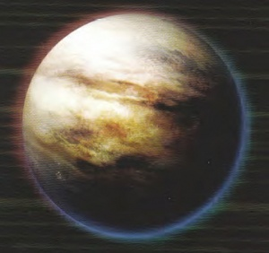

# 1078 恩底弥翁主星 Endymion Prime

精校状态：中文行文已逐段精校，部分术语仍为暂定

分类：地理 / 小行星 / 极限星域 Ultima Segmentum

原文来源：https://www.bilibili.com/opus/1169629545912860673

原作者：帝国神选罐头

原文时间：2026年02月15日 22:00

[返回分类目录](目录.md) · [全书目录](../../目录.md)

原篇名：恩底弥翁一号 Endymion Prime

<!-- A1078-B0001 -->
## Basic Data

**补译**

基础数据

<!-- /A1078-B0001 -->

<!-- A1078-B0002 -->
**英文原文**

Name:Endymion Prime

<!-- /A1078-B0002 -->

<!-- A1078-B0003 -->

原译文

名称：恩底弥翁一号

**校订译文**

名称：恩底弥翁主星

<!-- /A1078-B0003 -->

<!-- A1078-B0004 -->
**英文原文**

Segmentum:Ultima Segmentum

<!-- /A1078-B0004 -->

<!-- A1078-B0005 -->

原译文

星域：极限星域

**校订译文**

星域：极限星域

<!-- /A1078-B0005 -->

<!-- A1078-B0006 -->
**英文原文**

Sector:Endymion Cluster

<!-- /A1078-B0006 -->

<!-- A1078-B0007 -->

原译文

星区：恩底弥翁星群

**校订译文**

星区：恩底弥翁星群

<!-- /A1078-B0007 -->

<!-- A1078-B0008 -->
**英文原文**

System:Endymion System

<!-- /A1078-B0008 -->

<!-- A1078-B0009 -->

原译文

星系：恩底弥翁星系

**校订译文**

星系：恩底弥翁星系

<!-- /A1078-B0009 -->

<!-- A1078-B0010 -->
**英文原文**

Population:1,100,000,000 abhuman

<!-- /A1078-B0010 -->

<!-- A1078-B0011 -->

原译文

人口：11,0000,0000亚人

**校订译文**

人口：十一亿亚人

<!-- /A1078-B0011 -->

<!-- A1078-B0012 -->
**英文原文**

Affiliation:Imperium

<!-- /A1078-B0012 -->

<!-- A1078-B0013 -->

原译文

隶属：帝国

**校订译文**

隶属：帝国

<!-- /A1078-B0013 -->

<!-- A1078-B0014 -->
**英文原文**

Class:Industrial World (formerly sub-Hive World)

<!-- /A1078-B0014 -->

<!-- A1078-B0015 -->

原译文

类别：工业世界（前分巢都世界）

**校订译文**

类别：工业世界（原为次级巢都世界）

**校注：** sub-Hive表示规模未达典型巢都世界的次级形态，暂译次级巢都世界，不是某一巢都的分支。

<!-- /A1078-B0015 -->

<!-- A1078-B0016 -->
**英文原文**

Tithe Grade:Exactas Minoris (Higher previous to economic collapse circa M39)

<!-- /A1078-B0016 -->

<!-- A1078-B0017 -->

原译文

什一税等级：第一级次等（约M39经济崩溃前更高）

**校订译文**

什一税等级：第一级次等（约 M39 经济崩溃之前等级更高）

<!-- /A1078-B0017 -->

<!-- A1078-B0018 图片 -->

<!-- A1078-B0019 -->

原译文

Planetary Image 行星图像

**校订译文**

Planetary Image 行星图像

<!-- /A1078-B0019 -->

<!-- A1078-B0020 -->
**英文原文**

Endymion Prime is a planet in the Maelstrom Zone, that played an important role during the events of the Badab War.

<!-- /A1078-B0020 -->

<!-- A1078-B0021 -->

原译文

恩底弥恩一号是位于大漩涡区的一颗行星，在巴达布战争事件中发挥了重要作用。

**校订译文**

恩底弥翁主星位于大漩涡区域，在巴达布战争中发挥了重要作用。

<!-- /A1078-B0021 -->

<!-- A1078-B0022 -->
**英文原文**

Part of the Endymion Cluster, the planet was an arena of battles at the closing stages of the Badab War, when the Carcharodons fought with the Mantis Warriors. A battle was fought here called the Siege of Endymion Prime.

<!-- /A1078-B0022 -->

<!-- A1078-B0023 -->

原译文

作为恩底弥翁星群的一部分，这颗行星在巴达布战争的最后阶段是一个战场，当时噬人鲨与螳螂勇士作战。这里发生了一场名为恩底弥翁一号围城的战斗。

**校订译文**

它属于恩底弥翁星群。巴达布战争后期，噬人鲨与螳螂勇士曾在这里交战，这场战役被称为恩底弥翁主星围城战。

<!-- /A1078-B0023 -->

<!-- A1078-B0024 -->
**英文原文**

The planet is declining since the economic collapse occuring circa M39.

<!-- /A1078-B0024 -->

<!-- A1078-B0025 -->

原译文

自M39左右发生经济崩溃以来，行星正在衰落。

**校订译文**

自 M39 前后经济崩溃以来，这颗行星一直处于衰退之中。

<!-- /A1078-B0025 -->

<!-- A1078-B0026 -->
## Climate - Geography - Biosphere 气候-地理-生物圈

<!-- /A1078-B0026 -->

<!-- A1078-B0027 -->
**英文原文**

By 907. M41, the climate was typified by sulphurous rain storms, hurricane winds and specifically tornadoes in polar latitudes. Planetary surface designated as "Ash Waste" with majority of population subsisting in dispersed communities throughout post-industrial "spawl areas.

<!-- /A1078-B0027 -->

<!-- A1078-B0028 -->

原译文

到907.M41，气候以含硫暴风雨、飓风，特别是极地纬度的龙卷风为代表。行星表面被指定为“灰烬废地”，大多数人口生活在整个后工业扩区的分散社区。

**校订译文**

至 907.M41，当地气候以含硫暴雨和飓风为主要特征，极地纬度地区尤多龙卷风。行星地表被划为“灰烬荒原”，多数居民散居在工业衰退后遗留的大片城市蔓延区。

<!-- /A1078-B0028 -->

<!-- A1078-B0029 -->
## Government 政府

原题：Government 征服

**校注：** Government意为政府，原译征服错误。

<!-- /A1078-B0029 -->

<!-- A1078-B0030 -->
**英文原文**

Feudal dictatorship with numerous rival houses of nobility, power-base constituted on control of industrial areas and refining contracts.

<!-- /A1078-B0030 -->

<!-- A1078-B0031 -->

原译文

封建独裁统治，拥有众多贵族家族，权力基础建立在对工业区的控制和精炼契约之上。

**校订译文**

当地实行封建独裁统治，众多贵族家族彼此竞争，以控制工业区和精炼业务合同作为权力基础。

<!-- /A1078-B0031 -->

<!-- A1078-B0032 -->
**英文原文**

By 907.M41, the last Governor was the Duke Fultan Vualanti of House Vualanti. He was executed by the Fire Angels.

<!-- /A1078-B0032 -->

<!-- A1078-B0033 -->

原译文

到907.M41，最后一位总督是瓦兰提家族的伏尔坦·瓦兰提公爵。他被火焰天使处决了。

**校订译文**

截至 907.M41，最后一任总督是瓦兰提家族的伏尔坦·瓦兰提公爵。他被火焰天使战团处决。

<!-- /A1078-B0033 -->

<!-- A1078-B0034 -->
## Planetary Forces 行星部队

<!-- /A1078-B0034 -->

<!-- A1078-B0035 -->
**英文原文**

By 907. M41, the Adept representations were purged during the Badab War. Former planetary defence forces were in open revolt against the Imperium.

<!-- /A1078-B0035 -->

<!-- A1078-B0036 -->

原译文

到907.M41，专家代表在巴达布战争期间被清洗。前行星防御部队公开对抗帝国。

**校订译文**

至 907.M41，帝国任职者的驻地代表机构已在巴达布战争中遭到清洗；原行星防御部队则公开叛乱，对抗帝国。

**校注：** Adept为帝国任职者，与第69篇广义身份一致，不译一般专家；representations按机构语境暂解驻地代表机构，英文表达不够明确。

<!-- /A1078-B0036 -->

<!-- A1078-B0037 -->
## Trade - Economy 贸易-经济

<!-- /A1078-B0037 -->

<!-- A1078-B0038 -->
**英文原文**

Human habitation can be traced back at least to the late M34 with reaching apotheosis around M38, although never attaining the scale and population of either Cygnax or Badab Primaris. Around M39 its primary natural ressources were exhausted causing an economic collapse.

<!-- /A1078-B0038 -->

<!-- A1078-B0039 -->

原译文

人类居住至少可以追溯到M34晚期，在M38左右达到顶峰，尽管从未达到赛格纳克斯或巴达布主星的规模和人口。在M39左右，其主要自然资源枯竭，导致经济崩溃。

**校订译文**

人类在此定居的历史至少可以追溯到 M34 晚期，并于 M38 前后达到鼎盛，但其城市规模和人口始终不及西格纳克斯或巴达布主星。约 M39，主要自然资源枯竭，引发经济崩溃。

<!-- /A1078-B0039 -->

<!-- A1078-B0040 -->
## Other Planetary Details 其他行星细节

<!-- /A1078-B0040 -->

<!-- A1078-B0041 -->
**英文原文**

Class: Type Tellurian

<!-- /A1078-B0041 -->

<!-- A1078-B0042 -->

原译文

类别：地球型

**校订译文**

类型：类地行星

<!-- /A1078-B0042 -->

<!-- A1078-B0043 -->
**英文原文**

Mass: 0.85TM

<!-- /A1078-B0043 -->

<!-- A1078-B0044 -->

原译文

质量：0.85TM

**校订译文**

质量：0.85 TM

<!-- /A1078-B0044 -->

<!-- A1078-B0045 -->
**英文原文**

Rotation: 18 standard hours

<!-- /A1078-B0045 -->

<!-- A1078-B0046 -->

原译文

交替：18个标准时

**校订译文**

自转周期：十八个标准小时

<!-- /A1078-B0046 -->

<!-- A1078-B0047 -->
**英文原文**

Gravity: 09G

<!-- /A1078-B0047 -->

<!-- A1078-B0048 -->

原译文

重力：0.9G

**校订译文**

重力：0.9 G

**校注：** 英文09G疑漏小数点；中文沿原稿0.9 G，数值待核，不按字面擅改成9 G。

<!-- /A1078-B0048 -->

本篇核心术语与暂定项

以下列出本篇出现的英文原形及核心术语表用词。同形词可能指不同对象，具体词义以本篇正文和校注为准；单复数、别名和仅见于图注的名称可能尚未列入。完整候选见[术语表](../../术语表/双语术语候选.csv)。

| 英文 | 采用中文 | 状态 |
| --- | --- | --- |
| Imperium | 帝国 | 暂定·简称 |
| Basic Data | 基本资料 | 编辑用语已统一 |
| Maelstrom | 大漩涡 | 官方已核对 |
| Hive World | 巢都世界 | 暂定·官方待核 |
| Abhuman | 亚人 | 暂定·官方待核 |
| Ultima Segmentum | 极限星域 | 暂定·官方待核 |
| Segmentum | 星域 | 暂定·官方待核 |
| Sector | 星区 | 暂定·官方待核 |
| Apotheosis | 神化 | 暂定·官方待核 |
| Badab | 巴达布 | 暂定·官方待核 |
| Endymion Prime | 恩底弥翁主星 | 暂定·官方待核 |
| Adept | 帝国任职者（广义）／文吏（行政语境） | 语境定译·官方待核 |
| Mantis Warriors | 螳螂勇士 | 暂定·官方待核 |
| Fire Angels | 火焰天使 | 暂定·官方待核 |
| Carcharodons | 噬人鲨 | 暂定·官方待核 |
| System | 星系（恒星系统） | 暂定·官方待核 |
| Badab Primaris | 巴达布主星 | 暂定·官方待核 |
| Industrial World | 工业世界 | 暂定·官方待核 |
| Endymion Cluster | 恩底弥翁星群 | 暂定·官方待核 |
| Cygnax | 西格纳克斯 | 暂定·官方待核 |
| Exactas Minoris | 第一级次等 | 暂定·官方待核 |
| Fultan Vualanti | 伏尔坦·瓦兰提 | 暂定·官方待核 |
| House Vualanti | 瓦兰提家族 | 暂定·官方待核 |
| Siege of Endymion Prime | 恩底弥翁主星围城战 | 暂定·官方待核 |

