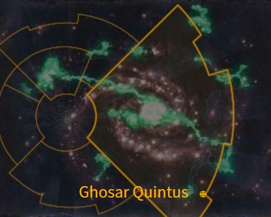
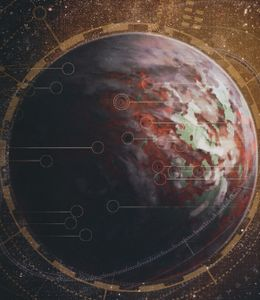

# 1079 戈萨尔五号 Ghosar Quintus

精校状态：中文行文已逐段精校，部分术语仍为暂定

分类：地理 / 小行星 / 极限星域 Ultima Segmentum

原文来源：https://www.bilibili.com/opus/1170169723961212935

原作者：帝国神选罐头

原文时间：2026年02月17日 08:56

[返回分类目录](目录.md) · [全书目录](../../目录.md)

<!-- A1079-B0001 图片 -->

<!-- A1079-B0002 -->

原译文

Map 地图

**校订译文**

Map 地图

<!-- /A1079-B0002 -->

<!-- A1079-B0003 -->
### Basic Data 基本资料

原题：Basic Data 基础数据

<!-- /A1079-B0003 -->

<!-- A1079-B0004 -->
**英文原文**

Name:Ghosar Quintus

<!-- /A1079-B0004 -->

<!-- A1079-B0005 -->

原译文

名称：戈萨尔五号

**校订译文**

名称：戈萨尔五号

<!-- /A1079-B0005 -->

<!-- A1079-B0006 -->
**英文原文**

Segmentum:Ultima Segmentum

<!-- /A1079-B0006 -->

<!-- A1079-B0007 -->

原译文

星域：极限星域

**校订译文**

星域：极限星域

<!-- /A1079-B0007 -->

<!-- A1079-B0008 -->
**英文原文**

Sector:Doctrex Sector

<!-- /A1079-B0008 -->

<!-- A1079-B0009 -->

原译文

星区：多科特雷克斯星区

**校订译文**

星区：多科特雷克斯星区

<!-- /A1079-B0009 -->

<!-- A1079-B0010 -->
**英文原文**

System:Ghosarian System

<!-- /A1079-B0010 -->

<!-- A1079-B0011 -->

原译文

星系：戈萨瑞安星系

**校订译文**

星系：戈萨瑞安星系

<!-- /A1079-B0011 -->

<!-- A1079-B0012 -->
**英文原文**

Population:15,000,000

<!-- /A1079-B0012 -->

<!-- A1079-B0013 -->

原译文

人口：1500,0000

**校订译文**

人口：一千五百万

<!-- /A1079-B0013 -->

<!-- A1079-B0014 -->
**英文原文**

Affiliation:Imperium

<!-- /A1079-B0014 -->

<!-- A1079-B0015 -->

原译文

隶属：帝国

**校订译文**

隶属：帝国

<!-- /A1079-B0015 -->

<!-- A1079-B0016 -->
**英文原文**

Class:Mining World

<!-- /A1079-B0016 -->

<!-- A1079-B0017 -->

原译文

类别：矿业世界

**校订译文**

类别：矿业世界

<!-- /A1079-B0017 -->

<!-- A1079-B0018 -->
**英文原文**

Tithe Grade:Solutio Extremis-Exactis Excelsior

<!-- /A1079-B0018 -->

<!-- A1079-B0019 -->

原译文

什一税等级：第三级高等 - 第一级高等

**校订译文**

什一税等级：第三级高等 - 第一级高等

<!-- /A1079-B0019 -->

<!-- A1079-B0020 图片 -->

<!-- A1079-B0021 -->

原译文

Planetary Image 行星图像

**校订译文**

Planetary Image 行星图像

<!-- /A1079-B0021 -->

<!-- A1079-B0022 -->
**英文原文**

Ghosar Quintus is a world of the Imperium. It was notable for the presence of a Genestealer Cult corrupting the planet's society - the investigation that discovered this Cult and the campaigns to purge it marked the first major Imperial encounter with a Genestealer Cult.

<!-- /A1079-B0022 -->

<!-- A1079-B0023 -->

原译文

戈萨尔五号是一个帝国世界。值得注意的是，存在一个腐化行星社会的基因窃取者教派 - 发现这个教派的调查和清除它的战役标志着帝国与基因窃取者教派的第一次重大接触。

**校订译文**

戈萨尔五号是帝国的一颗行星。一个基因窃取者教派渗透并腐化了当地社会；发现这一教派的调查及随后的清剿战，构成了帝国与基因窃取者教派的首次重大接触。

<!-- /A1079-B0023 -->

<!-- A1079-B0024 -->
## History 历史

<!-- /A1079-B0024 -->

<!-- A1079-B0025 -->
**英文原文**

Ruled by the Trysst Dynasty for several centuries, in 680.M41 a major infestation by the Genestealer Cult of the Four-Armed Emperor was discovered upon the world by Inquisitor Chaegryn. It was discovered that the Trysst Dynasty had come under the control of a Genestealer Patriarch (this Genestealer having got to the planet covered in a piece of a fragment that broke away from the space hulk Curse of Unreason, that fell on the planet at the beginning of M40).

<!-- /A1079-B0025 -->

<!-- A1079-B0026 -->

原译文

由特里斯特王朝统治了几个世纪，680.M41，审判官凯格林在世界上发现了四臂帝皇基因窃取者教派的重大侵扰。人们发现，特里斯特王朝已经落入了基因窃取者族长的控制之下（这位基因窃取者已经到达了这颗行星，上面覆盖着一块碎片，该碎片是从M40开始时落在这颗行星上的太空废船无理诅咒号中脱离出来的）。

**校订译文**

特里斯特王朝统治这里数个世纪后，审判官凯格林于 680.M41 发现，四臂帝皇教派已严重渗透这颗行星，王朝也受一名基因窃取者族长控制。M40 初期，太空废船无理诅咒号脱落的一块残骸坠入行星，这名基因窃取者正是藏身其中抵达的。

**校注：** 坠落的是脱离太空废船的残骸，非整艘废船。

<!-- /A1079-B0026 -->

<!-- A1079-B0027 -->
**英文原文**

Investigating what appeared to be a perversion of the Imperial Creed, Inquisitor Chaegryn led a team of Tempestus Scions to Ghosar Quintus and ventured into the depths of the Great Pit. The deeper Chaegryn ventured, the more evidence of deviance he found. Strangely, his last communique stated that all was well, and that the Trysst Dynasty should be left to its own devices. It was a full year before Chaegryn’s fellows noticed that something was deeply wrong. A five-man Kill-Team of Deathwatch Space Marines (Kill Team Excis) was sent on a follow-up mission of lethal investigation, yet they too were swallowed by the mysteries of the Great Pit and didn't survive the initial ambush.

<!-- /A1079-B0027 -->

<!-- A1079-B0028 -->

原译文

凯格林审判官调查这起看似对帝国信条的歪曲行为，他带领一队暴风忠嗣来到戈萨尔五号，冒险进入了大坑的深处。凯格林越冒险，他发现的偏差证据就越多。奇怪的是，他最后的公报说一切都很好，特里斯特王朝应该自行其是。整整一年后，凯格林的追随者们才注意到有些事情严重不对劲。一支五人死亡守望星际战士（切除杀戮小队）被派往执行致命调查的后续任务，但他们也被大坑的神秘所吞噬，在最初的伏击中没有幸存下来。

**校订译文**

凯格林审判官率一队风暴忠嗣军抵达戈萨尔五号，调查疑似歪曲帝国教义的行径，并深入“大坑”。越向深处走，他发现的异端迹象越多。然而，他最后一份通讯却声称一切正常，应让特里斯特王朝自行其是。整整一年后，他的同僚才意识到事态严重。一支五人的死亡守望杀戮小队——埃克西斯杀戮小队——被派去继续调查并以武力处置威胁，却同样消失在大坑的谜团中：首次伏击便让他们全军覆没。

**校注：** fellows为审判官同僚，非追随者；原文lethal investigation按武装调查与处置意译。 原稿别名“切除杀戮小队”；沿第393篇等既定埃克西斯杀戮小队。

<!-- /A1079-B0028 -->

<!-- A1079-B0029 -->
**英文原文**

Only when Chaplain Cassius mustered his own hand-picked Kill-Team was the vile truth unearthed – Ghosar Quintus was home to a xenos infestation. Kill Team Cassius fought through hundreds of Genestealer Cultists as they plumbed the depths of the Trysst Dynasty’s corrupted world. The family was purged by Cassius's Kill-Team, in the first major Imperial encounter with a Genestealer Cult.

<!-- /A1079-B0029 -->

<!-- A1079-B0030 -->

原译文

只有当牧师卡西乌斯召集了他自己挑选的杀戮小队时，才发现了一个卑鄙的真相 - 戈萨尔五号是一个异型侵扰的家园。卡西乌斯杀戮小队在探索特里斯特王朝腐化世界的深处时，与数百名基因窃取者邪教徒进行了战斗。在帝国与基因窃取者教派的第一次重大交锋中，卡西乌斯的杀戮小队净化了这个家族。

**校订译文**

直到卡西乌斯教士亲自挑选成员，集结杀戮小队，这个可怕的真相才被揭开：戈萨尔五号已遭异形侵染。卡西乌斯杀戮小队深入特里斯特王朝腐化世界的地下，与数百名基因窃取者教徒激战，最终清除了这个家族。这是帝国与基因窃取者教派的首次重大交锋。

<!-- /A1079-B0030 -->

<!-- A1079-B0031 -->
**英文原文**

Though they made it out alive and Cassius himself killed the Genestealer Patriarch, the Space Marines were changed forever by the gruesome ordeal. Most shocking of all was not the Genestealer Patriarch that lurked at the heart of the cult, but the damning evidence in the mining cult’s shipping holographs: under the guise of industry, the xenos-tainted Trysst Dynasty had spread its curse across not only the Ghosar System, but throughout the sector. The implications were staggering.

<!-- /A1079-B0031 -->

<!-- A1079-B0032 -->

原译文

尽管他们活了下来，卡西乌斯亲自杀死了基因窃取者族长，但这场可怕的折磨永远改变了星际战士。最令人震惊的不是潜伏在教派核心的基因窃取者族长，而是矿业教派的航运全息图中的确凿证据：在工业的幌子下，受异型污染的特里斯特王朝不仅在戈萨尔星系，而且在整个星区传播了诅咒。其影响是惊人的。

**校订译文**

小队虽生还，卡西乌斯也亲手杀死了基因窃取者族长，这场惨烈经历却永远改变了他们。最令人震惊的并非潜藏于教派核心的族长，而是矿业教派运输全息记录中的确凿证据：特里斯特王朝以工业活动为掩护，早已将异形污染传播到戈萨尔星系之外，遍及整个星区。其后果令人不寒而栗。

**校注：** Ghosarian System与Ghosar System为资料栏和正文不同写法，暂保留戈萨瑞安／戈萨尔，疑同一星系待核。

<!-- /A1079-B0032 -->

本篇核心术语与暂定项

以下列出本篇出现的英文原形及核心术语表用词。同形词可能指不同对象，具体词义以本篇正文和校注为准；单复数、别名和仅见于图注的名称可能尚未列入。完整候选见[术语表](../../术语表/双语术语候选.csv)。

| 英文 | 采用中文 | 状态 |
| --- | --- | --- |
| Space Marines | 星际战士 | 官方已核对 |
| Deathwatch | 死亡守望 | 官方已核对 |
| Inquisitor | 审判官 | 官方已核对 |
| Imperium | 帝国 | 暂定·简称 |
| Patriarch | 族长 | 官方已核对 |
| Emperor | 帝皇 | 官方已核对 |
| Imperial Creed | 帝国教义 | 暂定·官方待核 |
| Ultima Segmentum | 极限星域 | 暂定·官方待核 |
| Segmentum | 星域 | 暂定·官方待核 |
| Sector | 星区 | 暂定·官方待核 |
| Deeper | 深人 | 暂定·官方待核 |
| Ghosar Quintus | 戈萨尔五号 | 暂定·官方待核 |
| Mission | 教团／传教机构 | 暂定 |
| Chaplain | 教士 | 官方已核对 |
| Tempestus Scions | 风暴忠嗣军 | 官方已核对 |
| Xenos | 异形 | 暂定·官方待核 |
| Excis | 埃克西斯 | 暂定·官方待核 |
| Kill Team Excis | 埃克西斯杀戮小队 | 暂定·官方待核 |
| Cult of the Four-Armed Emperor | 四臂帝皇教派 | 暂定·官方待核 |
| Kill Team Cassius | 卡西乌斯杀戮小队 | 暂定·官方待核 |
| Quintus | 昆图斯 | 暂定·官方待核 |
| System | 星系（恒星系统） | 暂定·官方待核 |
| Solutio Extremis | 第三级高等 | 暂定·官方待核 |
| Mining World | 矿业世界 | 暂定·官方待核 |
| Doctrex Sector | 多科特雷克斯星区 | 暂定·官方待核 |
| Ghosarian System | 戈萨瑞安星系 | 暂定·官方待核 |
| Trysst Dynasty | 特里斯特王朝 | 暂定·官方待核 |
| Chaegryn | 凯格林 | 暂定·官方待核 |
| Curse of Unreason | 无理诅咒号 | 暂定·官方待核 |
| Great Pit | 大坑 | 暂定·官方待核 |
| Exactis Excelsior | 第一级高等 | 暂定·官方待核 |

