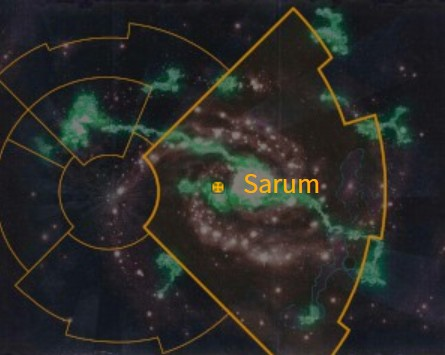

# 1080 萨勒姆 Sarum

精校状态：中文行文已逐段精校，部分术语仍为暂定

分类：地理 / 小行星 / 极限星域 Ultima Segmentum

原文来源：https://www.bilibili.com/opus/1183974620711092233

原作者：帝国神选罐头

原文时间：2026年03月26日 13:46

[返回分类目录](目录.md) · [全书目录](../../目录.md)

<!-- A1080-B0001 图片 -->

<!-- A1080-B0002 -->

原译文

Map 地图

**校订译文**

Map 地图

<!-- /A1080-B0002 -->

<!-- A1080-B0003 -->
### Basic Data 基本资料

原题：Basic Data 基础数据

<!-- /A1080-B0003 -->

<!-- A1080-B0004 -->
**英文原文**

Name:Sarum

<!-- /A1080-B0004 -->

<!-- A1080-B0005 -->

原译文

名称：萨勒姆

**校订译文**

名称：萨勒姆

<!-- /A1080-B0005 -->

<!-- A1080-B0006 -->
**英文原文**

Segmentum:Ultima Segmentum

<!-- /A1080-B0006 -->

<!-- A1080-B0007 -->

原译文

星域：极限星域

**校订译文**

星域：极限星域

<!-- /A1080-B0007 -->

<!-- A1080-B0008 -->
**英文原文**

Sector:Golgothan Sector

<!-- /A1080-B0008 -->

<!-- A1080-B0009 -->

原译文

星区：戈尔戈坦星区

**校订译文**

星区：戈尔戈坦星区

<!-- /A1080-B0009 -->

<!-- A1080-B0010 -->
**英文原文**

Affiliation:Dark Mechanicum

<!-- /A1080-B0010 -->

<!-- A1080-B0011 -->

原译文

隶属：黑暗机械教

**校订译文**

隶属：黑暗机械教

<!-- /A1080-B0011 -->

<!-- A1080-B0012 -->
**英文原文**

Class:Hell Forge

<!-- /A1080-B0012 -->

<!-- A1080-B0013 -->

原译文

类别：地狱熔炉

**校订译文**

类别：地狱熔炉

<!-- /A1080-B0013 -->

<!-- A1080-B0014 -->
**英文原文**

Sarum was a world of the Imperium. Now it belongs to a Dark Mechanicum. Turbulently close to the Maelstrom, the planet itself is a barren landscape which lacks a habitable atmosphere.

<!-- /A1080-B0014 -->

<!-- A1080-B0015 -->

原译文

萨勒姆是一个帝国的世界。现在它属于黑暗机械教。在大漩涡附近，这颗行星本身是一片贫瘠地形，缺乏宜居大气。

**校订译文**

萨勒姆曾是帝国世界，如今已落入黑暗机械教之手。它危险地靠近大漩涡，地表荒芜，也缺乏适宜人类生存的大气。

<!-- /A1080-B0015 -->

<!-- A1080-B0016 -->
## History 历史

<!-- /A1080-B0016 -->

<!-- A1080-B0017 -->
**英文原文**

During the Age of Strife, the world became an Adeptus Mechanicus station but soon was isolated and embattled. On its own against raiders, xenos, and abhumans and without aid from Mars, the priests of Sarum became isolationists under a cult by their ruler, Redjak. Redjak solidified his Crimson Priesthood's power, taking over much of the Golgothan Sector. However, when Sarum faced a massive invasion by the Brotherhood of Ruin and their Ork allies, they pleaded for aid from the Imperium and finally received it in the form of the World Eaters 13th Expeditionary Fleet, led personally by Angron.

<!-- /A1080-B0017 -->

<!-- A1080-B0018 -->

原译文

在纷争时代，世界变成了一个机械神教站，但很快就被孤立和围困。萨勒姆的神甫在没有火星援助的情况下，独自对抗袭击者、异型和亚人，在统治者雷德雅克的教派下成为了孤立主义者。雷德雅克巩固了他的深红祭司的权力，接管了大部分的戈尔戈坦星区。然而，当萨勒姆面临毁灭兄弟会及其欧克盟友的大规模入侵时，他们恳求帝国提供援助，并最终以安格隆亲自领导的第13远征舰队的形式获得了援助。

**校订译文**

纷争时代，这个世界曾成为机械修会的一处据点，却很快陷入孤立和围攻。没有火星援助，萨勒姆的祭司只能独自抵御劫掠者、异形和亚人，逐渐在统治者雷德雅克领导的教派中奉行孤立主义。雷德雅克巩固深红祭司团的权力，控制了戈尔戈坦星区的大部分地区。然而，毁灭兄弟会及其欧克蛮人盟友发动大规模入侵后，萨勒姆不得不向帝国求援，最终等来了安格隆亲自率领的吞世者第十三远征舰队。

**校注：** 英文在纷争时代使用Adeptus Mechanicus；按源文保留机械修会，不自行改成Mechanicum机械教，年代用称疑点留待核。

<!-- /A1080-B0018 -->

<!-- A1080-B0019 -->
**英文原文**

In the ensuing Golgothan Slaughter, the Brotherhood of Ruin was annihilated by the World Eaters. However, Angron next turned his wrath on the Crimson Priests of Sarum, scouring the planet and claiming it as his forward operating base for the next eleven years in a campaign against the Priests remaining empire. Sarum pledged itself to the forces of Horus during the Horus Heresy and became a Forge World for the Dark Mechanicum. During the Heresy, Sarum continued to supply the World Eaters with their armaments. One of their exports was the Sarum-pattern helmet.

<!-- /A1080-B0019 -->

<!-- A1080-B0020 -->

原译文

在随后的戈尔戈坦大屠杀中，毁灭兄弟会被吞世者消灭。然而，安格隆接下来将他的愤怒转向了萨勒姆的深红神甫，在接下来的11年里，他在一场对抗神甫残余帝国的战役中，对这个行星进行了彻底的清洗，并声称它是他的前方作战基地。萨勒姆在荷鲁斯叛乱期间承诺加入荷鲁斯的军队，并成为黑暗机械教的铸造世界。在叛乱期间，萨勒姆继续为吞世者提供武器。他们的出口产品之一是萨勒姆型头盔。

**校订译文**

随后的戈尔戈坦大屠杀中，吞世者歼灭了毁灭兄弟会。但安格隆随即将怒火转向萨勒姆的深红祭司，清洗行星，并将其据为前进基地。在此后的十一年中，他以这里为据点，继续攻打祭司们残存的疆域。荷鲁斯之乱期间，萨勒姆宣布效忠荷鲁斯，成为黑暗机械教的铸造世界，持续向吞世者供应武器装备，其中就包括萨勒姆型头盔。

**校注：** 十一年修饰以萨勒姆为基地的后续战役，非清洗单颗行星用时十一年。

<!-- /A1080-B0020 -->

<!-- A1080-B0021 -->
**英文原文**

Towards the later stages of the Heresy, Perturabo himself arrived at Sarum in search of information of where to find Angron. He found the planet corrupted beyond measure, with a solid crust of debris in orbit acting as a type of outer shell. On Sarum, the Priests had become slaves to Chaos, their heads replaced with the skulls of various creatures. At the center of Sarum was a bound Daemon of Khorne known as Sa'ra'am, which revealed that Angron was on the world of Deluge. Sar'ra'am eventually possessed the Iron Warrior Volk, creating the first Obliterator.

<!-- /A1080-B0021 -->

<!-- A1080-B0022 -->

原译文

在叛乱的后期阶段，佩图拉博亲自抵达萨勒姆，寻找在哪里可以找到安格隆的信息。他发现这颗行星被腐化得无法估量，轨道上有一层坚固的碎片外壳。在萨勒姆，神甫成了混沌的奴隶，他们的头被各种生物的头骨所取代。萨勒姆的中心是一个被称为萨'拉'阿姆的被束缚的恐虐恶魔，这表明安格隆在洪水世界。萨'拉'阿姆最终占据了钢铁勇士沃尔克，创造了第一个泯灭者。

**校订译文**

荷鲁斯之乱后期，佩图拉博亲自来到萨勒姆，打探安格隆的下落。他发现行星已腐化至极，轨道上的残骸凝成坚固外壳；祭司沦为混沌奴隶，头颅被各种生物的颅骨替代。行星中心束缚着一名叫作萨’拉’阿姆的恐虐恶魔，它透露安格隆正在德鲁格。此后，这个恶魔附身于钢铁勇士沃克，造就了第一个泯灭者。

**校注：** Sa’ra’am与Sar’ra’am为同段异拼，暂同译萨’拉’阿姆；德鲁格是Deluge行星专名，不是洪水地貌世界。

<!-- /A1080-B0022 -->

<!-- A1080-B0023 -->
**英文原文**

In M37, Sarum devastated an Imperial offensive against the planet.

<!-- /A1080-B0023 -->

<!-- A1080-B0024 -->

原译文

在M37，萨勒姆摧毁了帝国对行星的进攻。

**校订译文**

M37，帝国曾进攻萨勒姆，却遭到惨败。

<!-- /A1080-B0024 -->

本篇核心术语与暂定项

以下列出本篇出现的英文原形及核心术语表用词。同形词可能指不同对象，具体词义以本篇正文和校注为准；单复数、别名和仅见于图注的名称可能尚未列入。完整候选见[术语表](../../术语表/双语术语候选.csv)。

| 英文 | 采用中文 | 状态 |
| --- | --- | --- |
| Adeptus Mechanicus | 机械修会 | 官方已核对 |
| World Eaters | 吞世者 | 官方已核对 |
| Horus Heresy | 荷鲁斯之乱 | 官方已核对 |
| Imperium | 帝国 | 暂定·简称 |
| Mechanicum | 机械教 | 暂定·历史称谓 |
| Dark Mechanicum | 黑暗机械教 | 暂定·官方待核 |
| Khorne | 恐虐 | 官方已核对 |
| Maelstrom | 大漩涡 | 官方已核对 |
| Obliterator | 泯灭者 | 官方已核对 |
| Forge World | 铸造世界 | 暂定·官方待核 |
| Age of Strife | 纷争时代 | 暂定·官方待核 |
| Horus | 荷鲁斯 | 暂定·官方待核 |
| The Brotherhood | 兄弟会 | 暂定·官方待核 |
| The Brotherhood of Ruin | 毁灭兄弟会 | 暂定·官方待核 |
| Sarum | 萨勒姆 | 暂定·官方待核 |
| Golgothan Slaughter | 戈尔戈坦大屠杀 | 暂定·官方待核 |
| Ultima Segmentum | 极限星域 | 暂定·官方待核 |
| Segmentum | 星域 | 暂定·官方待核 |
| Sector | 星区 | 暂定·官方待核 |
| Brotherhood | 兄弟会 | 暂定·官方待核 |
| Mars | 火星 | 暂定·官方待核 |
| Xenos | 异形 | 暂定·官方待核 |
| Angron | 安格隆 | 官方已核对 |
| The Dark | 《黑暗》 | 暂定·官方待核 |
| Deluge | 德鲁格 | 暂定·官方待核 |
| Volk | 沃克 | 暂定·官方待核 |
| Golgothan Sector | 戈尔戈坦星区 | 暂定·官方待核 |
| Redjak | 雷德雅克 | 暂定·官方待核 |
| Crimson Priesthood | 深红祭司团 | 暂定·官方待核 |
| Crimson Priests | 深红祭司 | 暂定·官方待核 |
| Sarum-pattern helmet | 萨勒姆型头盔 | 暂定·官方待核 |

