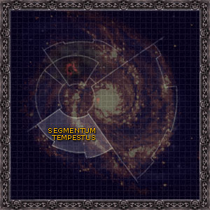

# 1081 暴风星域 Segmentum Tempestus

精校状态：中文行文已逐段精校，部分术语仍为暂定

分类：地理 / 小行星 / 暴风星域 Segmentum Tempestus

原文来源：https://www.bilibili.com/opus/1137552698596392979

原作者：帝国神选罐头

原文时间：2025年11月21日 11:25

[返回分类目录](目录.md) · [全书目录](../../目录.md)

<!-- A1081-B0001 -->
**英文原文**

The Segmentum Tempestus is one of the Segmentums, divisions of the Galaxy, of the Imperium. Its Segmentum Fortress is located at Bakka. The Segmentum is roughly organized into 200 light-year cubes, each of which is designated as a Sector. Free from much of the Chaos-related problems of the Imperium such as invasions from the Eye of Terror or Maelstrom, Segmentum Tempestus instead suffers from Xenos invaders and raiders.

<!-- /A1081-B0001 -->

<!-- A1081-B0002 -->

原译文

暴风星域是帝国的星域之一，银河系的一部分，它的星域堡垒位于巴卡。星域大致分为200个光年立方体，每个立方体都被指定为一个星区。没有帝国的许多与混沌相关的问题，如恐惧之眼或大漩涡的入侵，暴风星域反而遭受了异型入侵者和袭击者的攻击。

**校订译文**

暴风星域是帝国划分银河的几大星域之一，星域堡垒设在巴卡。它大致按边长二百光年的立方空间划分，每一块称为一个星区。相较帝国其他地区，这里较少受到来自恐怖之眼或大漩涡等地的混沌侵扰，却饱受异形入侵和劫掠之苦。

**校注：** 200 light-year cubes指边长约二百光年的立方区域，并非二百个立方体。

<!-- /A1081-B0002 -->

<!-- A1081-B0003 图片 -->

<!-- A1081-B0004 -->

原译文

Galactic map of Segmentum Tempestus 暴风星域的银河系地图

**校订译文**

Galactic map of Segmentum Tempestus 暴风星域的银河系地图

<!-- /A1081-B0004 -->

<!-- A1081-B0005 -->
## Notable Planets 著名行星

<!-- /A1081-B0005 -->

<!-- A1081-B0006 -->

原译文

Amarah Prime 阿马拉一号

**校订译文**

Amarah Prime 阿玛拉主星

<!-- /A1081-B0006 -->

<!-- A1081-B0007 -->

原译文

Antagonis 对抗星

**校订译文**

Antagonis 对抗星

<!-- /A1081-B0007 -->

<!-- A1081-B0008 -->

原译文

Bakka 巴卡

**校订译文**

Bakka 巴卡

<!-- /A1081-B0008 -->

<!-- A1081-B0009 -->

原译文

Barbarus 巴巴鲁斯

**校订译文**

Barbarus 巴巴鲁斯

<!-- /A1081-B0009 -->

<!-- A1081-B0010 -->

原译文

Cretacia 科瑞塔西亚

**校订译文**

Cretacia 科瑞塔西亚

<!-- /A1081-B0010 -->

<!-- A1081-B0011 -->

原译文

Deliverance 拯救星

**校订译文**

Deliverance 拯救星

<!-- /A1081-B0011 -->

<!-- A1081-B0012 -->

原译文

Graia 格拉亚

**校订译文**

Graia 格拉亚

<!-- /A1081-B0012 -->

<!-- A1081-B0013 -->

原译文

Gryphonne IV 格里芬四号

**校订译文**

Gryphonne IV 格里芬四号

<!-- /A1081-B0013 -->

<!-- A1081-B0014 -->

原译文

Hieronymous Theta 希罗尼穆斯·西塔

**校订译文**

Hieronymous Theta 希罗尼穆斯·西塔

<!-- /A1081-B0014 -->

<!-- A1081-B0015 -->

原译文

Inwit 因维特

**校订译文**

Inwit 因维特

<!-- /A1081-B0015 -->

<!-- A1081-B0016 -->

原译文

Krieg 克里格

**校订译文**

Krieg 克里格

<!-- /A1081-B0016 -->

<!-- A1081-B0017 -->

原译文

Morda Prime 莫尔达一号

**校订译文**

Morda Prime 莫尔达一号

<!-- /A1081-B0017 -->

<!-- A1081-B0018 -->

原译文

Ophelia VII 奥菲利亚七号

**校订译文**

Ophelia VII 奥菲利亚七号

<!-- /A1081-B0018 -->

<!-- A1081-B0019 -->

原译文

Posul 波苏尔

**校订译文**

Posul 波苏尔

<!-- /A1081-B0019 -->

<!-- A1081-B0020 -->

原译文

Praetoria 禁卫星

**校订译文**

Praetoria 普雷托利亚

<!-- /A1081-B0020 -->

<!-- A1081-B0021 -->

原译文

Pranagar 帕拉那伽

**校订译文**

Pranagar 帕拉那伽

<!-- /A1081-B0021 -->

<!-- A1081-B0022 -->

原译文

Tallarn 塔兰

**校订译文**

Tallarn 塔兰

<!-- /A1081-B0022 -->

<!-- A1081-B0023 -->

原译文

Zhao-Arkkad 赵-阿卡德

**校订译文**

Zhao-Arkkad 赵—阿卡达

<!-- /A1081-B0023 -->

<!-- A1081-B0024 -->
## Notable Other Celestial Objects 其他著名天体

原题：Notable Other Celestial Objects 著名其他星体

<!-- /A1081-B0024 -->

<!-- A1081-B0025 -->

原译文

Mandragoran Stars 曼德拉戈拉群星

**校订译文**

Mandragoran Stars 曼德拉戈拉群星

<!-- /A1081-B0025 -->

<!-- A1081-B0026 -->

原译文

Craftworld Iyanden 方舟世界伊扬登

**校订译文**

Craftworld Iyanden 方舟世界伊扬登

<!-- /A1081-B0026 -->

<!-- A1081-B0027 -->

原译文

Serpent Spine 蛇脊

**校订译文**

Serpent Spine 蛇脊

<!-- /A1081-B0027 -->

<!-- A1081-B0028 -->
## Known Sectors 已知星区

<!-- /A1081-B0028 -->

<!-- A1081-B0029 -->

原译文

Caligari Sector 卡利加里星区

**校订译文**

Caligari Sector 卡利加利星区

<!-- /A1081-B0029 -->

<!-- A1081-B0030 -->

原译文

Caradryad Sector 卡拉德里亚星区

**校订译文**

Caradryad Sector 卡拉德里亚星区

<!-- /A1081-B0030 -->

<!-- A1081-B0031 -->

原译文

Chiros Sector 奇洛斯星区

**校订译文**

Chiros Sector 彻洛斯星区

<!-- /A1081-B0031 -->

<!-- A1081-B0032 -->

原译文

Corribra Sector 科里布拉星区

**校订译文**

Corribra Sector 科里布拉星区

<!-- /A1081-B0032 -->

<!-- A1081-B0033 -->

原译文

Forsarr Sector 弗萨尔星区

**校订译文**

Forsarr Sector 弗萨尔星区

<!-- /A1081-B0033 -->

<!-- A1081-B0034 -->

原译文

Khaldun Sector 赫勒敦星区

**校订译文**

Khaldun Sector 赫勒敦星区

<!-- /A1081-B0034 -->

<!-- A1081-B0035 -->

原译文

Nemesys Sector 涅墨西斯星区

**校订译文**

Nemesys Sector 涅墨西斯星区

<!-- /A1081-B0035 -->

<!-- A1081-B0036 -->

原译文

Orpheus Sector 俄耳甫斯星区

**校订译文**

Orpheus Sector 俄耳甫斯星区

<!-- /A1081-B0036 -->

<!-- A1081-B0037 -->

原译文

Reductus Sector 雷杜克图斯星区

**校订译文**

Reductus Sector 雷杜克图斯星区

<!-- /A1081-B0037 -->

<!-- A1081-B0038 -->

原译文

Scaephan Sector 斯卡法恩星区

**校订译文**

Scaephan Sector 斯卡法恩星区

<!-- /A1081-B0038 -->

<!-- A1081-B0039 -->

原译文

Uhulis Sector 乌胡利斯星区

**校订译文**

Uhulis Sector 乌胡利斯星区

<!-- /A1081-B0039 -->

<!-- A1081-B0040 -->
## Notable Systems 著名星系

<!-- /A1081-B0040 -->

<!-- A1081-B0041 -->

原译文

Ophelia System 奥菲利亚星系

**校订译文**

Ophelia System 奥菲利亚星系

<!-- /A1081-B0041 -->

<!-- A1081-B0042 -->
## Other Segmentums 其他星域

<!-- /A1081-B0042 -->

<!-- A1081-B0043 -->
**英文原文**

Segmentum Solar — Galactic North

<!-- /A1081-B0043 -->

<!-- A1081-B0044 -->

原译文

太阳星域 — 银河北部

**校订译文**

太阳星域 — 银河北部

**校注：** 太阳星域位于银河北部为底稿原有方向表述，与通常以泰拉为中心的行政叙述不宜直接等同；保持原文供核。

<!-- /A1081-B0044 -->

<!-- A1081-B0045 -->
**英文原文**

Segmentum Pacificus — Galactic North West

<!-- /A1081-B0045 -->

<!-- A1081-B0046 -->

原译文

太平星域 — 银河西北部

**校订译文**

太平星域 — 银河西北部

<!-- /A1081-B0046 -->

<!-- A1081-B0047 -->
**英文原文**

Ultima Segmentum — Galactic East

<!-- /A1081-B0047 -->

<!-- A1081-B0048 -->

原译文

极限星域 — 银河东部

**校订译文**

极限星域 — 银河东部

<!-- /A1081-B0048 -->

<!-- A1081-B0049 -->
**英文原文**

Segmentum Obscurus — Galactic Far North

<!-- /A1081-B0049 -->

<!-- A1081-B0050 -->

原译文

朦胧星域 — 银河远北

**校订译文**

朦胧星域 — 银河远北

<!-- /A1081-B0050 -->

本篇核心术语与暂定项

以下列出本篇出现的英文原形及核心术语表用词。同形词可能指不同对象，具体词义以本篇正文和校注为准；单复数、别名和仅见于图注的名称可能尚未列入。完整候选见[术语表](../../术语表/双语术语候选.csv)。

| 英文 | 采用中文 | 状态 |
| --- | --- | --- |
| Imperium | 帝国 | 暂定·简称 |
| Eye of Terror | 恐惧之眼 | 官方已核对 |
| Maelstrom | 大漩涡 | 官方已核对 |
| Segmentum Solar | 太阳星域 | 暂定·官方待核 |
| Segmentum Pacificus | 太平星域 | 暂定·官方待核 |
| Segmentum Obscurus | 朦胧星域 | 暂定·官方待核 |
| Segmentum Tempestus | 暴风星域 | 暂定·官方待核 |
| Ultima Segmentum | 极限星域 | 暂定·官方待核 |
| Segmentum | 星域 | 暂定·官方待核 |
| Sector | 星区 | 暂定·官方待核 |
| Bakka | 巴卡 | 暂定·官方待核 |
| Obscurus | 朦胧星 | 暂定·官方待核 |
| Invaders | 侵略者 | 暂定·官方待核 |
| Xenos | 异形 | 暂定·官方待核 |
| Segmentum Fortress | 星域堡垒 | 暂定·官方待核 |

