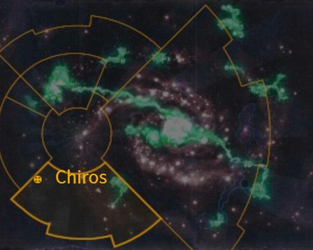

# 1085 彻洛斯 Chiros

精校状态：中文行文已逐段精校，部分术语仍为暂定

分类：地理 / 小行星 / 暴风星域 Segmentum Tempestus

原文来源：https://www.bilibili.com/opus/1156822958436515844

原作者：帝国神选罐头

原文时间：2026年01月12日 09:43

[返回分类目录](目录.md) · [全书目录](../../目录.md)

原篇名：奇洛斯 Chiros

<!-- A1085-B0001 图片 -->

<!-- A1085-B0002 -->

原译文

Map 地图

**校订译文**

Map 地图

<!-- /A1085-B0002 -->

<!-- A1085-B0003 -->
### Basic Data 基本资料

原题：Basic Data 基础数据

<!-- /A1085-B0003 -->

<!-- A1085-B0004 -->
**英文原文**

Name:Chiros

<!-- /A1085-B0004 -->

<!-- A1085-B0005 -->

原译文

名称：奇洛斯

**校订译文**

名称：彻洛斯

<!-- /A1085-B0005 -->

<!-- A1085-B0006 -->
**英文原文**

Segmentum:Segmentum Tempestus

<!-- /A1085-B0006 -->

<!-- A1085-B0007 -->

原译文

星域：暴风星域

**校订译文**

星域：暴风星域

<!-- /A1085-B0007 -->

<!-- A1085-B0008 -->
**英文原文**

Affiliation:Imperium

<!-- /A1085-B0008 -->

<!-- A1085-B0009 -->

原译文

隶属：帝国

**校订译文**

隶属：帝国

<!-- /A1085-B0009 -->

<!-- A1085-B0010 -->
**英文原文**

Class:Agri World

<!-- /A1085-B0010 -->

<!-- A1085-B0011 -->

原译文

类别：农业世界

**校订译文**

类别：农业世界

<!-- /A1085-B0011 -->

<!-- A1085-B0012 -->
**英文原文**

Chiros is an Imperial Agri World. It is wealthy, covered in lush forests and continent-sized lakes. Its beauty is famed across the sector. Its populace numbers only a few million, most of whom are involved in the production of rejuvenating elixirs, fine furs and rare narcotics created from its natural flora and fauna. It is the homeworld of Confessor Dolan Chirosius and Jan van Yastobaal.

<!-- /A1085-B0012 -->

<!-- A1085-B0013 -->

原译文

奇洛斯是一个帝国农业世界。它很富有，覆盖着茂密的森林和大陆大小的湖泊。它的美丽在整个星区都很有名。它的人口只有几百万，其中大多数人都参与了由其自然动植物群生产的回春药剂、优质皮毛和稀有镇静剂的生产。这是告解者多兰·奇罗修斯和简·范·亚斯托巴尔的家园。

**校订译文**

彻洛斯是一个富裕的帝国农业世界，茂密森林和大陆般辽阔的湖泊覆盖地表，其美景闻名整个星区。当地只有数百万人，多数利用本土动植物生产回春药剂、优质皮毛和稀有麻醉药物。这里也是告解者多兰·奇罗修斯与简·范·亚斯托巴尔的母星。

**校注：** narcotics指麻醉性药物，不能限定成镇静剂。

<!-- /A1085-B0013 -->

<!-- A1085-B0014 -->
## Plague of Unbelief 无信瘟疫

<!-- /A1085-B0014 -->

<!-- A1085-B0015 -->
**英文原文**

During the Plague of Unbelief, the apostate Cardinal Bucharis' forces landed on Chiros, and began the conquest of the wealthy planet. They initially encountered little resistance. Soon though, they came up against an obstacle they could not overcome. Bucharis was not being kept filled in on the situation properly and could not understand why his troops failed to conquer the planet. The commander of the assaulting forces had restrained from using orbital bombardment, as he had seen the planet as a Paradise World to which the Cardinal could retire. Bucharis was pleased with his foresight and sent an extra three companies of troops, although this just prolonged the fighting and led to the surrender of Bucharis' forces.

<!-- /A1085-B0015 -->

<!-- A1085-B0016 -->

原译文

在无信瘟疫期间，叛教红衣主教布查里斯的部队登陆了奇洛斯，开始征服这个富裕的行星。他们最初几乎没有遇到阻力。但很快，他们遇到了一个无法克服的障碍。布查里斯没有正确地了解情况，也不明白为什么他的部队未能征服行星。进攻部队的指挥官克制了使用轨道轰炸，因为他把这个行星看作是红衣主教可以修整的天堂世界。布查里斯对他的远见卓识感到满意，并增派了三个连队的部队，尽管这只会延长战斗时间，导致布查里斯的部队投降。

**校订译文**

无信瘟疫期间，叛教红衣主教布查里斯的部队登陆彻洛斯，企图征服这个富裕世界。起初他们几乎未遇抵抗，很快却碰上无法突破的阻力。布查里斯没有得到充分的战况汇报，不明白部队为何迟迟无法取胜。前线指挥官不愿实施轨道轰炸，因为他认为这里是天堂世界，适合红衣主教日后退居享乐。布查里斯赞赏这一打算，增派三个连的部队，却只让战事进一步拖延；他的军队最终仍然投降。

<!-- /A1085-B0016 -->

<!-- A1085-B0017 -->
**英文原文**

Bucharis soon found out that the entire planet had risen up against his forces to defend their world. When a detachment of the troops attempted to seize the wealthy estate of the Yastobaal clan, the young clan head, Jan van Yastobaal and his men resisted, killing the entire detachment. The estate, however, was in ruins and the Yastobaal mansion in flames. Salvaging weapons and supplies from the blazing mansion, Jan led his ragtag force into the forests and mountains. The defiance of Jan van Yastobaal had been taken up by the entire planet's population. The people of Chiros became an invisible army that could not be decisively engaged, constantly harassing Bucharis' troops with hit and run attacks and deadly sniper fire. Bucharis' forces finally surrendered after a suicide bomber charged into their camp and killed their army commanders. Chiros was never taken and marked the beginning of the end for Bucharis' empire.

<!-- /A1085-B0017 -->

<!-- A1085-B0018 -->

原译文

布查里斯很快发现，整个行星都起来反抗他的军队，保卫他们的世界。当一支部队试图夺取亚斯托巴尔氏族的富裕庄园时，年轻的氏族首领简·范·亚斯托巴尔和他的部下进行了抵抗，杀死了整个部队。然而，该庄园已成废墟，亚斯托巴尔宅邸也已起火。从燃烧的宅邸中抢救武器和物资，简带领他的杂乱之众进入森林和山区。简·范·亚斯托巴尔的反抗已经被整个行星的人口所接受。奇洛斯的人民变成了一支无法果断参与的隐形军队，不断用跑打攻击和致命的狙击火力骚扰布查里斯的部队。在一名自杀式炸弹袭击者冲进他们的营地并杀害了他们的军队指挥官后，布查里斯的部队终于投降了。奇洛斯从未被占领，这标志着布查里斯的帝国终结的开始。

**校订译文**

布查里斯很快得知，整颗行星都已起身保卫家园。一支部队试图夺取亚斯托巴尔家族的富庶庄园时，年轻家主简·范·亚斯托巴尔率部抵抗，将敌人全歼，但庄园也化为废墟，宅邸陷入火海。简从燃烧的房屋中抢救武器物资，带领临时拼凑的队伍退入森林和山地。他的反抗激励了全星球居民。彻洛斯人组成一支神出鬼没的军队，不给敌人展开决战的机会，以打了就跑的突袭和致命狙击持续骚扰布查里斯部队。最后，一名自杀爆破手冲入敌营，炸死军队指挥官，迫使入侵者投降。彻洛斯始终没有被征服，这也成为布查里斯帝国覆亡的开端。

<!-- /A1085-B0018 -->

<!-- A1085-B0019 -->
## Trivia 琐事

<!-- /A1085-B0019 -->

<!-- A1085-B0020 -->
### Notes 注释

<!-- /A1085-B0020 -->

<!-- A1085-B0021 -->
**英文原文**

Though it is not stated directly, from its description the planet may be considered as a Paradise World.

<!-- /A1085-B0021 -->

<!-- A1085-B0022 -->

原译文

虽然没有直接说明，但从它的描述来看，这颗行星可能被认为是一个天堂世界。

**校订译文**

虽然资料未直接将它归为天堂世界，但根据上述描述，可以作出这一推测。

<!-- /A1085-B0022 -->

<!-- A1085-B0023 -->
### Conflicting Sources 来源冲突

<!-- /A1085-B0023 -->

<!-- A1085-B0024 -->
**英文原文**

Chiros is shown as being located in Segmentum Pacificus and listed as an Cardinal World on the galactic map of Black Crusade Core Rulebook.

<!-- /A1085-B0024 -->

<!-- A1085-B0025 -->

原译文

奇洛斯位于太平星域，在《黑色远征核心规则书》的银河系地图上被列为枢机世界。

**校订译文**

另据《黑色远征核心规则书》的银河地图，彻洛斯位于太平星域，并被列为红衣主教世界。

**校注：** 保留来源冲突：资料栏为暴风星域／农业世界，这一地图为太平星域／红衣主教世界；不擅选一项覆盖另一项。

<!-- /A1085-B0025 -->

本篇核心术语与暂定项

以下列出本篇出现的英文原形及核心术语表用词。同形词可能指不同对象，具体词义以本篇正文和校注为准；单复数、别名和仅见于图注的名称可能尚未列入。完整候选见[术语表](../../术语表/双语术语候选.csv)。

| 英文 | 采用中文 | 状态 |
| --- | --- | --- |
| Imperium | 帝国 | 暂定·简称 |
| Description | 描述 | 编辑用语已统一 |
| Segmentum Pacificus | 太平星域 | 暂定·官方待核 |
| Segmentum Tempestus | 暴风星域 | 暂定·官方待核 |
| Segmentum | 星域 | 暂定·官方待核 |
| Sector | 星区 | 暂定·官方待核 |
| Chiros | 彻洛斯 | 暂定·官方待核 |
| Cardinal | 红衣主教 | 暂定 |
| Confessor | 告解者 | 暂定 |
| Risen | 赦天使 | 暂定·官方待核 |
| Cardinal World | 红衣主教世界 | 暂定·官方待核 |
| Paradise World | 天堂世界 | 暂定·官方待核 |
| Defiance | 反抗号 | 暂定·官方待核 |
| Plague of Unbelief | 无信瘟疫 | 暂定·官方待核 |
| Dolan Chirosius | 多兰·奇罗修斯 | 暂定·官方待核 |
| Jan van Yastobaal | 简·范·亚斯托巴尔 | 暂定·官方待核 |
| Bucharis | 布查里斯 | 暂定·官方待核 |

