# 1086 格拉亚 Graia

精校状态：中文行文已逐段精校，部分术语仍为暂定

分类：地理 / 小行星 / 暴风星域 Segmentum Tempestus

原文来源：https://www.bilibili.com/opus/1157993740747407382

原作者：帝国神选罐头

原文时间：2026年01月15日 13:27

[返回分类目录](目录.md) · [全书目录](../../目录.md)

<!-- A1086-B0001 图片 -->
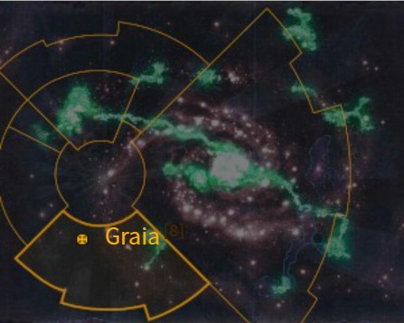

<!-- A1086-B0002 -->

原译文

Map 地图

**校订译文**

Map 地图

<!-- /A1086-B0002 -->

<!-- A1086-B0003 -->
### Basic Data 基本资料

原题：Basic Data 基础数据

<!-- /A1086-B0003 -->

<!-- A1086-B0004 -->
**英文原文**

Name:Graia

<!-- /A1086-B0004 -->

<!-- A1086-B0005 -->

原译文

名称：格拉亚

**校订译文**

名称：格拉亚

<!-- /A1086-B0005 -->

<!-- A1086-B0006 -->
**英文原文**

Segmentum:Segmentum Tempestus

<!-- /A1086-B0006 -->

<!-- A1086-B0007 -->

原译文

星域：暴风星域

**校订译文**

星域：暴风星域

<!-- /A1086-B0007 -->

<!-- A1086-B0008 -->
**英文原文**

Affiliation:Imperium

<!-- /A1086-B0008 -->

<!-- A1086-B0009 -->

原译文

隶属：帝国

**校订译文**

隶属：帝国

<!-- /A1086-B0009 -->

<!-- A1086-B0010 -->
**英文原文**

Class:Forge World

<!-- /A1086-B0010 -->

<!-- A1086-B0011 -->

原译文

类别：铸造世界

**校订译文**

类别：铸造世界

<!-- /A1086-B0011 -->

<!-- A1086-B0012 -->
**英文原文**

Production Grade:I-Secundi

<!-- /A1086-B0012 -->

<!-- A1086-B0013 -->

原译文

生产等级：一级 - 中等

**校订译文**

生产等级：一级 - 中等

<!-- /A1086-B0013 -->

<!-- A1086-B0014 -->
**英文原文**

Tithe Grade:Aptus Non

<!-- /A1086-B0014 -->

<!-- A1086-B0015 -->

原译文

什一税等级：特级免税

**校订译文**

什一税等级：特级免税

<!-- /A1086-B0015 -->

<!-- A1086-B0016 -->
**英文原文**

Graia is an Imperial Forge World and home to the Legio Astraman (the "Morning Stars").

<!-- /A1086-B0016 -->

<!-- A1086-B0017 -->

原译文

格拉亚是一个帝国铸造世界，也是旅星者军团（“晨星”）的家园。

**校订译文**

格拉亚是帝国铸造世界，也是旅星者军团——又称“晨星军团”——的母星。

<!-- /A1086-B0017 -->

<!-- A1086-B0018 图片 -->
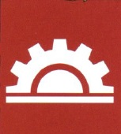

<!-- A1086-B0019 -->

原译文

Graya's symbol 格拉亚标志

**校订译文**

Graya's symbol 格拉亚标志

**校注：** 原图注Graya为英文异拼，按约保留，中文同一格拉亚。

<!-- /A1086-B0019 -->

<!-- A1086-B0020 -->
## Overview 概述

<!-- /A1086-B0020 -->

<!-- A1086-B0021 -->
**英文原文**

Graia, nicknamed the "Crown of Miracles", is the most prosperous Forge World of the Belt of Iron and much of its production is geared towards Titan engines.

<!-- /A1086-B0021 -->

<!-- A1086-B0022 -->

原译文

格拉亚，绰号“奇迹之冠”，是铁带最繁荣的铸造世界，其大部分生产都是趋向泰坦引擎的。

**校订译文**

格拉亚被誉为“奇迹之冠”，是铁带最繁荣的铸造世界，其生产能力主要用于制造泰坦。

<!-- /A1086-B0022 -->

<!-- A1086-B0023 图片 -->
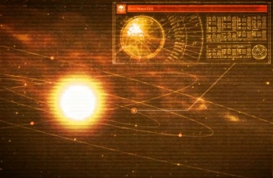

<!-- A1086-B0024 -->

原译文

Graia Star System 格拉亚恒星系

**校订译文**

Graia Star System 格拉亚恒星系

<!-- /A1086-B0024 -->

<!-- A1086-B0025 -->
**英文原文**

Though the Adeptus Mechanicus does not make it widely known, the principal Forge networks of Graia, known as the Graian Crown, is capable of independent flight. Giant fusion engines allow it to escape its host planet's gravity and move to the nearest Mandeville Point, where it can then travel through the Warp. When the Crown leaves, its temples are stocked with munitions and its holding decks provisioned with volunteers. Once a suitable world has been discovered, the Crown's chorazine shunt thrusters lock it into a stationary orbit like a tick. Fleets of industrial harvesters descend, leeching the world of its assets as production continues above.

<!-- /A1086-B0025 -->

<!-- A1086-B0026 -->

原译文

尽管在机械神教并没有广为人知，但格拉亚的主要铸造网络，即格拉亚之冠，能够独立飞行。巨大的聚变引擎使它能够逃脱宿主行星的引力，移动到最近的曼德维尔点，然后在那里它可以穿过亚空间。当王冠离开时，它的圣殿里装满了弹药，它的货舱甲板上配备了志愿者。一旦发现了一个合适的世界，王冠的科拉津分流推进器就会像蜱虫一样将其锁定在一个静止轨道上。随着生产继续进行，成群的工业收割者降落，掠夺世界各地的资产。

**校订译文**

机械修会并未广泛公开一个事实：格拉亚的主要铸造设施网络“格拉亚之冠”能够独立飞行。巨型聚变引擎使它挣脱所在行星的引力，前往最近的曼德维尔点，再驶入亚空间。启程时，内部圣堂装满军需弹药，收容甲板则载上志愿人员。找到合适的世界后，格拉亚之冠便通过科拉津转移推进器进入同步轨道，像蜱虫般牢牢附着于这颗行星。成群工业采收舰降向地表，榨取当地资源，轨道上的生产设施则继续运转。

**校注：** 并非机械修会自身不知道此事，而是没有广泛公开。chorazine shunt thrusters沿音译科拉津转移推进器，具体技术含义待核。

<!-- /A1086-B0026 -->

<!-- A1086-B0027 -->
**英文原文**

The last time Graia attempted to move the Graian Crowns, it was assaulted by an invasion fleet of Necron aircraft that soared up from the Laochan Gate. Though Imperial records currently claim that Graia's priesthood have returned to circumnavigate their original home world, at least one recent Rogue Trader report lists the planet's orbit as strangely empty.

<!-- /A1086-B0027 -->

<!-- A1086-B0028 -->

原译文

上一次格拉亚试图移动格拉亚之冠时，它遭到了从劳禅之门起飞的死灵飞行器入侵舰队的袭击。尽管帝国记录目前声称，格拉亚的祭司已经回到了他们最初的家园世界，但至少有一份最近的行商浪人报告将这颗行星的轨道列为奇怪的空白。

**校订译文**

格拉亚最近一次尝试转移格拉亚之冠时，一支太空死灵飞行器舰队从劳禅之门升起，发动袭击。帝国现有记录称，格拉亚祭司已返回母星轨道运行；然而，至少有一份近期行商浪人报告指出，该行星轨道上竟然空空荡荡。

<!-- /A1086-B0028 -->

<!-- A1086-B0029 -->
**英文原文**

Graia is famous for the stubborn and steadfast nature of its warriors. They generally refuse to retreat from held ground unless ordered to do so by Graian tech-priests, and are hardwired in a way making it extremely difficult for psykers to influence them. Though this makes them excellent defenders, other Imperial forces often regard the Graians' stubbornness as much as a tactical liability as it is an advantage.

<!-- /A1086-B0029 -->

<!-- A1086-B0030 -->

原译文

格拉亚以其战士的固执和坚定而闻名。他们通常拒绝从被占领的土地上撤退，除非格拉亚技术神甫下令这样做，而且他们天生就很难被灵能者影响。尽管这使他们成为优秀的防守者，但其他帝国军队往往将格拉亚人的固执视为一种战术劣势。

**校订译文**

格拉亚战士以顽强执拗闻名。除非接到格拉亚技术祭司的命令，他们通常拒绝放弃阵地；其内置硬件设定也使灵能者极难影响他们。这让他们成为出色的守军，但其他帝国部队常认为，这种固执既是战术优势，也是负担。

**校注：** hardwired指硬件固化设定，不是天生抗灵能；原文明确固执同时有利有弊。

<!-- /A1086-B0030 -->

<!-- A1086-B0031 图片 -->
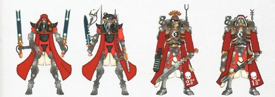

<!-- A1086-B0032 -->

原译文

Graian Skitarii 格拉亚护教军

**校订译文**

Graian Skitarii 格拉亚护教军

<!-- /A1086-B0032 -->

<!-- A1086-B0033 -->
## History 历史

<!-- /A1086-B0033 -->

<!-- A1086-B0034 -->
### Heresy-era 荷鲁斯之乱时期

原题：Heresy-era 叛乱时期

<!-- /A1086-B0034 -->

<!-- A1086-B0035 -->
**英文原文**

Graia weathered the Age of Strife with a substantial capability towards producing Titan engines and as a result sported a powerful Titan Legion at the time of the Great Crusade. When the Imperium arrived they proved unwilling to commit a protracted siege and negotiated a treaty with Graia that granted it control over neighboring systems. The cold, logical Tech-Priests of Graia had their forces join the Crusade thereafter, where they demonstrated tenacity and an ability to achieve tasks deemed impossible. Its power and success garnered resentment from other Forges in the Belt of Iron such as those of Valia-Maximal. Diplomatic attempts by Graia to foster goodwill and those they had conquered were rarely successful, not least because of the Graian cold stubbornness to admit fault Graia also developed an outright rivalry with one Forge World in Segmentum Solar, Voss.

<!-- /A1086-B0035 -->

<!-- A1086-B0036 -->

原译文

格拉亚以生产泰坦引擎的强大能力度过了纷争时代，因此在大远征时拥有强大的泰坦军团。当帝国到达时，他们被证明不愿意进行长期围困，并与格拉亚谈判达成了一项条约，授予其对邻近星系的控制权。格拉亚冷酷、逻辑的技术神甫们在此后加入了远征，在那里他们表现出了坚韧和完成被认为不可能的任务的能力。它的力量和成功引起了其他铁带铸造世界的不满，如最大瓦利亚铸造世界。格拉亚为培养善意和他们征服的人而进行的外交努力很少成功，尤其是因为格拉亚冷酷固执地承认错误。格拉亚还与太阳星域的一个铸造世界沃斯展开了彻底的竞争。

**校订译文**

格拉亚在纷争时代保住了可观的泰坦生产能力，因此到大远征时期，已拥有一支强大的泰坦军团。帝国抵达时不愿陷入长期围攻，于是与格拉亚缔约，承认其对周边星系的控制权。此后，冷静理性的格拉亚技术祭司派军加入远征，以坚韧顽强、能完成看似不可能的任务而著称。然而，他们的实力和成功也招致铁带其他铸造世界的怨恨，例如瓦利亚-马克西马尔。格拉亚试图与被征服者改善关系，却少有成效，尤其因为其冷漠固执，不肯承认错误。他们还与太阳星域的铸造世界沃斯形成公开竞争。

**校注：** 原文stubbornness to admit fault语法残缺，结合前后外交失败理解为固执不肯认错；Valia-Maximal为专名瓦利亚-马克西马尔，不译最大瓦利亚。

<!-- /A1086-B0036 -->

<!-- A1086-B0037 -->
**英文原文**

During the Horus Heresy, debate raged on Graia as to which side it should join, and the data-looms of the planet ran billions of simulations to predict the best course of action. The simulations predicted quick victory for the Emperor, though this would prove to be disastrous and the world fought bitterly in the Cataclysm of Iron, where they endured a vicious Dark Mechanicus siege before ultimately prevailing. Meanwhile, forces loyal to Graia across the Galaxy also aided the Emperor's armies. For instance, Graian contingents led by Archmagos Arkai Nomus supported the Imperial occupation of Cthonia and were consequently drawn into the catastrophic Siege of Cthonia.

<!-- /A1086-B0037 -->

<!-- A1086-B0038 -->

原译文

在荷鲁斯叛乱期间，关于格拉亚应该加入哪一方的争论愈演愈烈，行星的数据织机进行了数十亿次模拟，以预测最佳行动方案。模拟预测了帝皇的快速胜利，尽管这将被证明是灾难性的，世界在铁灾中进行了激烈的战斗，在那里他们经历了一场恶毒的黑暗机械教围攻，最终获胜。与此同时，银河系各地忠于格拉亚的部队也帮助了帝皇的军队。例如，由大贤者阿尔凯·诺穆斯领导的格拉亚特遣队支援了帝国对科索尼亚的占领，因此被卷入了灾难性的科索尼亚围城。

**校订译文**

荷鲁斯之乱期间，格拉亚就是否选边争论不休，行星数据织机进行了数十亿次模拟，寻找最佳行动方案。模拟预测帝皇会迅速获胜，但这一预期带来了灾难性后果：格拉亚在铁灾中浴血奋战，承受黑暗机械教的残酷围攻，最终才获胜。银河各地效忠格拉亚的部队也加入帝皇阵营。例如，大贤者阿尔凯·诺穆斯率格拉亚分遣队支援帝国占领科索尼亚，继而卷入灾难性的科索尼亚围城战。

<!-- /A1086-B0038 -->

<!-- A1086-B0039 -->
### Post-Heresy 荷鲁斯之乱后

原题：Post-Heresy 叛乱后

<!-- /A1086-B0039 -->

<!-- A1086-B0040 -->
**英文原文**

??? — After Tech-Priests breach a strange portal on Mount Laochan, the planet is invaded by Donorian Fiends. Graia's principle network of forges (known as the Graian Crown) are relocated via its Warp engines.

<!-- /A1086-B0040 -->

<!-- A1086-B0041 -->

原译文

在技术神甫突破了劳禅山上的一个奇怪的入口后，这个行星被多诺里安恶魔入侵了。格拉亚的主要铸造网络（称为格拉亚之冠）通过其亚空间引擎重新定位。

**校订译文**

日期不详——技术祭司打开劳禅山上一道奇异门户后，多诺里安恶魔入侵行星。格拉亚的主要铸造设施网络“格拉亚之冠”借助亚空间引擎转移。

<!-- /A1086-B0041 -->

<!-- A1086-B0042 -->
**英文原文**

??? — Necron aircraft invade Graia following the last warp travel of the Graian Crown. The unliving forces emerge from the Laochan Gate and teleport warriors directly onto the surface of the Graian Crown. Only by sending massed Cohorts of Legio Cybernetica on magnetically-controlled space walks did the Graian Tech-Priests hold back the foe long enough to effect warp translation.

<!-- /A1086-B0042 -->

<!-- A1086-B0043 -->

原译文

在格拉亚之冠最后一次亚空间航行后，死灵飞行器入侵格拉亚。没有生命的部队从劳禅之门出现，将战士直接传送到格拉亚之冠的表面。只有通过派遣大批磁控太空行走的智控军团大队，格拉亚技术神甫才能将敌人阻挡足够长的时间，以实现亚空间转移。

**校订译文**

日期不详——格拉亚之冠最后一次亚空间航行之后，太空死灵飞行器入侵格拉亚。这支不死军队从劳禅之门出现，将战士直接传送到格拉亚之冠表面。格拉亚技术祭司派出大批智控军团大队，以磁力控制在太空中机动，才将敌人拖住足够久，得以完成亚空间跃迁。

**校注：** 本篇对太空死灵袭击、离开与返回母星的顺序有多种概述，保留各时间条目，不强行拼为唯一时间线。

<!-- /A1086-B0043 -->

<!-- A1086-B0044 -->
**英文原文**

M41

**补译**

第 41 个千年（M41）

<!-- /A1086-B0044 -->

<!-- A1086-B0045 -->
**英文原文**

392-399.M41 — Graia was among the Forge Worlds which sent armies and supplies to support the Macharian Crusade. At some point after this event, the world's tech-priests attempted to use the planet's secret technology to make a warp jump with the Graian Crown. However, this attempt caused a major Necron attack which almost destroyed Graia.

<!-- /A1086-B0045 -->

<!-- A1086-B0046 -->

原译文

格拉亚是铸造世界之一，他们派遣军队和物资支援马卡里安远征。在这件事发生后的某个时刻，世界各地的技术神甫试图利用行星的秘密技术，用格拉亚之冠进行亚空间跳跃。然而，这一尝试引发了死灵的大规模攻击，几乎摧毁了格拉亚。

**校订译文**

392—399.M41——格拉亚与其他铸造世界一道，派遣军队和物资支援马卡里安远征。此后某时，技术祭司试图用行星的秘密技术，让格拉亚之冠进行亚空间跃迁，却招来太空死灵大举进攻，几乎毁掉格拉亚。

**校注：** 补回原译遗漏的日期；本篇下方其他年表同样补回。

<!-- /A1086-B0046 -->

<!-- A1086-B0047 -->
**英文原文**

Late M41 — A double attack by the Orks and Chaos Space Marines left many of its facilities in ruins. In the aftermath it was quarantined by order of Inquisitor Thrax.

<!-- /A1086-B0047 -->

<!-- A1086-B0048 -->

原译文

欧克和混沌星际战士的双重攻击使其许多设施成为废墟。之后，根据审判官特拉克斯的命令，它被隔离了。

**校订译文**

M41 晚期——欧克蛮人与混沌星际战士接连进攻，使大量设施沦为废墟。事后，审判官特拉克斯下令封锁隔离格拉亚。

<!-- /A1086-B0048 -->

<!-- A1086-B0049 图片 -->
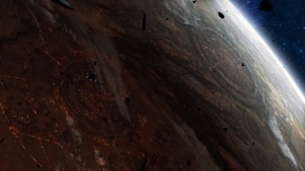

<!-- A1086-B0050 -->

原译文

Graia during the grand invasion by Orks and Chaos forces 在欧克和混沌部队的大规模入侵期间的格拉亚

**校订译文**

Graia during the grand invasion by Orks and Chaos forces 欧克蛮人与混沌大举入侵时的格拉亚

<!-- /A1086-B0050 -->

<!-- A1086-B0051 -->
**英文原文**

circa 993.M41 — Graia was believed to be one of the worlds attacked and consumed by Hive Fleet Kraken. However, as the Forge World continued to operate after this point, these claims appear to have been false.

<!-- /A1086-B0051 -->

<!-- A1086-B0052 -->

原译文

格拉亚被认为是被虫巢舰队克拉肯攻击和吞噬的世界之一。然而，随着铸造世界在此之后继续运作，这些说法似乎是错误的。

**校订译文**

约 993.M41——格拉亚一度被认为已遭克拉肯虫巢舰队进攻并吞噬。但该铸造世界此后仍持续运作，因而这些说法似乎并不属实。

<!-- /A1086-B0052 -->

<!-- A1086-B0053 -->
**英文原文**

Late M41/early M42 — Tumulus Samael's invasion: Chaos Sorcerer Tumulus Samael invaded Graia, almost turning the Graian Crown into a massive Warp weapon. However, the attempted takeover was foiled by Ultramarine Malum Caedo.

<!-- /A1086-B0053 -->

<!-- A1086-B0054 -->

原译文

图穆卢斯·萨马尔的入侵：混沌巫师图穆卢斯·萨马尔入侵格拉亚，几乎将格拉亚之冠变成了一件巨大的亚空间武器。然而，这一接管企图被极限战士马鲁姆·凯多挫败。

**校订译文**

M41 晚期至 M42 初期——图穆卢斯·萨马尔入侵：这名混沌巫师入侵格拉亚，险些将格拉亚之冠变成巨型亚空间武器；极限战士马鲁姆·凯多挫败了他的夺取计划。

<!-- /A1086-B0054 -->

<!-- A1086-B0055 图片 -->
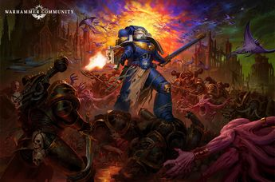

<!-- A1086-B0056 -->

原译文

Malum Caedo in battle with the forces of Chaos on Graia 马鲁姆·凯多在格拉亚与混沌部队作战

**校订译文**

Malum Caedo in battle with the forces of Chaos on Graia 马鲁姆·凯多在格拉亚与混沌部队作战

<!-- /A1086-B0056 -->

<!-- A1086-B0057 -->
### Era Indomitus 不屈时期

<!-- /A1086-B0057 -->

<!-- A1086-B0058 -->
**英文原文**

Early M42 — The Rust Fields War began in the aftermath of the Great Rift's creation, as a coalition of Forge Worlds led by Mars and Graia sent mining fleets to exploit the vast belt of mineral rich asteroids known as the Rust Fields. After operations began however, it was discovered that Ork clans ruled the interior of the Rust Fields and the two sides soon clash. This began a great war, that has now drawn in untold numbers of additional Imperium forces, as the Adeptus Mechanicus fights to retain its foothold in the asteroid field.

<!-- /A1086-B0058 -->

<!-- A1086-B0059 -->

原译文

锈域战争始于大裂隙形成之后，由火星和格拉亚领导的铸造世界联盟派遣采矿舰队开采被称为锈域的富含矿物质的小行星带。然而，在行动开始后，人们发现欧克氏族统治着锈域的内部，双方很快发生了冲突。这开始了一场大战，现在吸引了无数额外的帝国部队，因为机械神教为在小行星域中保持立足点而战斗。

**校订译文**

M42 初期——大裂隙形成后，火星与格拉亚领导的铸造世界联盟派出采矿舰队，开发资源丰富的巨大“锈域”小行星带，由此引发锈域战争。开采开始后，他们才发现欧克蛮人氏族控制着小行星带深处，双方随即交战。机械修会为保住据点不断增兵，这场大战又吸引了数量难以估计的其他帝国部队。

<!-- /A1086-B0059 -->

<!-- A1086-B0060 -->
**英文原文**

Early M42 — Graia sent forces to fight at Aggamedes against Chaos forces in the Arks of Omen Campaign.

<!-- /A1086-B0060 -->

<!-- A1086-B0061 -->

原译文

格拉亚派遣部队在阿加梅德斯与噩兆方舟战役中的混沌部队作战。

**校订译文**

M42 初期——噩兆方舟战役期间，格拉亚派军前往阿加梅德斯，与混沌部队交战。

<!-- /A1086-B0061 -->

<!-- A1086-B0062 -->
## Geography 地理

<!-- /A1086-B0062 -->

<!-- A1086-B0063 -->
### Places of Interest 著名地点

<!-- /A1086-B0063 -->

<!-- A1086-B0064 -->
**英文原文**

Laochan Gate — Possible Webway Portal

<!-- /A1086-B0064 -->

<!-- A1086-B0065 -->

原译文

劳禅之门 — 可能是网道传送门

**校订译文**

劳禅之门 — 可能是网道传送门

<!-- /A1086-B0065 -->

<!-- A1086-B0066 -->

原译文

Manufactorum Narses 纳尔塞斯铸造厂

**校订译文**

Manufactorum Narses 纳尔塞斯铸造厂

<!-- /A1086-B0066 -->

<!-- A1086-B0067 -->
**英文原文**

Manufactorum Ajakis — also known as Titan Manufactorum, it is able to produce Titans, even Warlord class.

<!-- /A1086-B0067 -->

<!-- A1086-B0068 -->

原译文

阿贾基斯铸造厂 — 也称为泰坦铸造厂，它能够生产泰坦，甚至是军阀级。

**校订译文**

阿贾基斯铸造厂——又称泰坦铸造厂，能够制造泰坦，甚至可生产战将级。

<!-- /A1086-B0068 -->

<!-- A1086-B0069 图片 -->
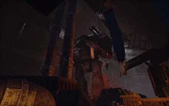

<!-- A1086-B0070 -->

原译文

Titan Bay of Manufactorum Ajakis 阿贾基斯铸造厂的泰坦湾

**校订译文**

Titan Bay of Manufactorum Ajakis 阿贾基斯铸造厂的泰坦机库

**校注：** bay在铸造厂内部指停放或装配空间，译泰坦机库，非海湾。

<!-- /A1086-B0070 -->

<!-- A1086-B0071 -->

原译文

Stratum 79 Station 79层站

**校订译文**

Stratum 79 Station 79层站

<!-- /A1086-B0071 -->

<!-- A1086-B0072 -->

原译文

Ajakis Access Basilica 阿贾基斯通路大教堂

**校订译文**

Ajakis Access Basilica 阿贾基斯通路大教堂

<!-- /A1086-B0072 -->

<!-- A1086-B0073 -->
**英文原文**

Orbital Spire — Destroyed during the Invasion.

<!-- /A1086-B0073 -->

<!-- A1086-B0074 -->

原译文

轨道尖塔 — 在入侵期间被毁。

**校订译文**

轨道尖塔 — 在入侵期间被毁。

<!-- /A1086-B0074 -->

<!-- A1086-B0075 -->
**英文原文**

Defence Battery 'Goliath' — Destroyed during the Invasion

<!-- /A1086-B0075 -->

<!-- A1086-B0076 -->

原译文

防御阵列‘歌利亚’ — 在入侵期间被摧毁

**校订译文**

防御阵列‘歌利亚’ — 在入侵期间被摧毁

<!-- /A1086-B0076 -->

<!-- A1086-B0077 -->
**英文原文**

Kalkys Facility — It was used as a laboratory by Inquisitor Drogan before his death.

<!-- /A1086-B0077 -->

<!-- A1086-B0078 -->

原译文

卡尔基斯设施 — 德洛冈审判官死亡前曾将其用作实验室。

**校订译文**

卡尔基斯设施——审判官德洛冈生前曾将其用作实验室。

<!-- /A1086-B0078 -->

<!-- A1086-B0079 -->

原译文

Andris Habitation Block 安德里斯居住区

**校订译文**

Andris Habitation Block 安德里斯居住区

<!-- /A1086-B0079 -->

<!-- A1086-B0080 -->

原译文

Bastion Primus 第一堡垒

**校订译文**

Bastion Primus 第一堡垒

<!-- /A1086-B0080 -->

<!-- A1086-B0081 -->
**英文原文**

Graian Crown — Battle Fortress complex.

<!-- /A1086-B0081 -->

<!-- A1086-B0082 -->

原译文

格拉亚之冠 — 战斗堡垒建筑群。

**校订译文**

格拉亚之冠 — 战斗堡垒建筑群。

<!-- /A1086-B0082 -->

<!-- A1086-B0083 -->
## Graia patterns 格拉亚型号

<!-- /A1086-B0083 -->

<!-- A1086-B0084 -->
**英文原文**

Graia is known to have its own patterns of Hellhound and Rapier Laser Destroyer. It also produced an experimental version of Space Marine Grenade launcher known as Vengeance launcher and created its own Manticore pattern.

<!-- /A1086-B0084 -->

<!-- A1086-B0085 -->

原译文

众所周知，格拉亚拥有自己的地狱犬和细剑激光毁灭炮型号。它还生产了一种被称为复仇发射器的星际战士榴弹发射器的实验版本，并创建了自己的蝎尾狮型号。

**校订译文**

格拉亚拥有自行设计的地狱犬战车和细剑激光毁灭炮型号。它还研制了名为“复仇发射器”的实验型星际战士榴弹发射器，以及独有的蝎尾狮导弹车型号。

<!-- /A1086-B0085 -->

<!-- A1086-B0086 图片 -->
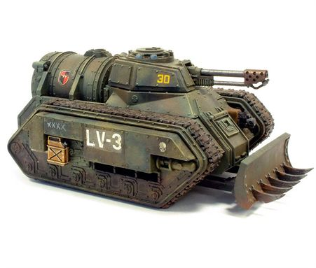

<!-- A1086-B0087 -->

原译文

Graia pattern Hellhound 格拉亚型地狱犬

**校订译文**

Graia pattern Hellhound 格拉亚型地狱犬战车

<!-- /A1086-B0087 -->

<!-- A1086-B0088 图片 -->
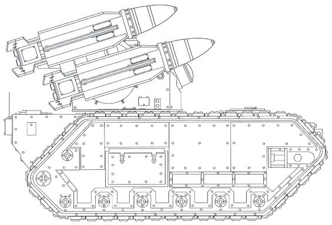

<!-- A1086-B0089 -->

原译文

Graia pattern Manticore 格拉亚型蝎尾狮

**校订译文**

Graia pattern Manticore 格拉亚型蝎尾狮导弹车

<!-- /A1086-B0089 -->

<!-- A1086-B0090 图片 -->
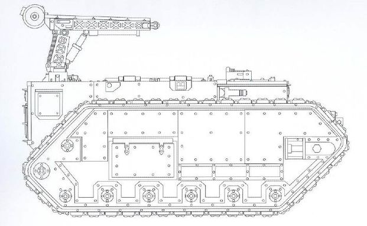

<!-- A1086-B0091 -->

原译文

Graia pattern Trojan 格拉亚型特洛伊

**校订译文**

Graia pattern Trojan 格拉亚型特洛伊

<!-- /A1086-B0091 -->

<!-- A1086-B0092 图片 -->
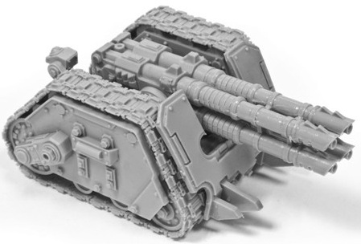

<!-- A1086-B0093 -->

原译文

Graia pattern Rapier Laser Destroyer 格拉亚型细剑激光破坏炮

**校订译文**

Graia pattern Rapier Laser Destroyer 格拉亚型细剑激光毁灭炮

<!-- /A1086-B0093 -->

<!-- A1086-B0094 图片 -->

<!-- A1086-B0095 -->

原译文

Vengeance launcher 复仇发射器

**校订译文**

Vengeance launcher 复仇发射器

<!-- /A1086-B0095 -->

<!-- A1086-B0096 -->
**英文原文**

Note, that while the missiles on Graia pattern Manticore are the most noticeable difference from more common Stygies VIII pattern, these are incendiary missiles and are not related to Graia pattern, which differs from Stygies VIII version by tower details.

<!-- /A1086-B0096 -->

<!-- A1086-B0097 -->

原译文

请注意，虽然格拉亚型蝎尾狮的导弹与更常见的黄泉八号型导弹最明显的区别，这些是燃烧导弹，与格拉亚型无关，其在发射架细节上与黄泉八号版本不同。

**校订译文**

图中格拉亚型蝎尾狮导弹车与较常见的黄泉八号型相比，最显眼的差异是所载导弹，但这些只是另行配备的燃烧导弹，并非格拉亚型号特有。两种型号真正的区别在于发射塔的细节。

**校注：** 导弹型号差异不等于车体型号的定义差异；图示为燃烧导弹，格拉亚型区别在发射塔细节。

<!-- /A1086-B0097 -->

<!-- A1086-B0098 -->
## Conflicting sources 来源冲突

<!-- /A1086-B0098 -->

<!-- A1086-B0099 -->
**英文原文**

The official sources give two possible locations for Graia in the Imperium:

<!-- /A1086-B0099 -->

<!-- A1086-B0100 -->

原译文

官方消息来源给出了帝国中格拉亚的两个可能位置：

**校订译文**

原文列举的官方出版物，对格拉亚在帝国中的位置有两种不同记载：

<!-- /A1086-B0100 -->

<!-- A1086-B0101 -->
**英文原文**

Imperial Armour Volume One and The Horus Heresy Book One - Betrayal place Graia in Segmentum Tempestus.

<!-- /A1086-B0101 -->

<!-- A1086-B0102 -->

原译文

《帝国装甲第一册》和《荷鲁斯叛乱之书第一册 - 背叛》中格拉亚在暴风星域。

**校订译文**

《帝国装甲》第一卷和《荷鲁斯之乱》第一卷《背叛》将格拉亚置于暴风星域。

<!-- /A1086-B0102 -->

<!-- A1086-B0103 -->
**英文原文**

Other sources (such as the 3rd and 4th Edition Tyranid codices, and the video game Warhammer 40,000: Space Marine place Graia in the eastern part of Ultramar, in Ultima Segmentum However, Graia is not the planet itself but the Forge Ring. They can and will move to a new planet, once the minerals are depleted.

<!-- /A1086-B0103 -->

<!-- A1086-B0104 -->

原译文

其他来源（如第3版和第4版的泰伦圣典，以及电子游戏《战锤40000：星际战士》）将格拉亚放置在极限星域的奥特拉玛东部。然而，格拉亚不是行星本身，而是铸造环。一旦矿物耗尽，他们可以而且将会移动到一个新的行星。

**校订译文**

其他资料，如第三版、第四版泰伦虫族圣典和电子游戏《战锤 40000：星际战士》，则将格拉亚置于极限星域奥特拉玛的东部。底稿同时解释，“格拉亚”在此指可移动的铸造环，而非行星本身；当地矿产耗尽后，它便能够转移至另一颗行星。

**校注：** 可移动铸造环解释属于底稿作者对来源差异的说明，本次未另核所列原始出版物，不能作为已经证实的矛盾消解。

<!-- /A1086-B0104 -->

本篇核心术语与暂定项

以下列出本篇出现的英文原形及核心术语表用词。同形词可能指不同对象，具体词义以本篇正文和校注为准；单复数、别名和仅见于图注的名称可能尚未列入。完整候选见[术语表](../../术语表/双语术语候选.csv)。

| 英文 | 采用中文 | 状态 |
| --- | --- | --- |
| Space Marines | 星际战士 | 官方已核对 |
| Adeptus Mechanicus | 机械修会 | 官方已核对 |
| Chaos Space Marines | 混沌星际战士 | 官方已核对 |
| Orks | 欧克蛮人 | 官方已核对 |
| Ultramar | 奥特拉玛 | 官方已核对 |
| Horus Heresy | 荷鲁斯之乱 | 官方已核对 |
| Warp | 亚空间 | 官方已核对 |
| Great Rift | 大裂隙 | 官方已核对 |
| Inquisitor | 审判官 | 官方已核对 |
| Imperium | 帝国 | 暂定·简称 |
| Legio Cybernetica | 智控军团 | 暂定 |
| Warp Jump | 亚空间跳跃 | 暂定 |
| Webway | 网道 | 暂定 |
| Mandeville Point | 曼德维尔点 | 暂定 |
| Sorcerer | 巫师 | 官方已核对 |
| Rogue Trader | 行商浪人 | 暂定 |
| Emperor | 帝皇 | 官方已核对 |
| Forge World | 铸造世界 | 暂定·官方待核 |
| Goliath | 歌利亚 | 暂定·官方待核 |
| Great Crusade | 大远征 | 暂定·官方待核 |
| Age of Strife | 纷争时代 | 暂定·官方待核 |
| Horus | 荷鲁斯 | 暂定·官方待核 |
| Segmentum Solar | 太阳星域 | 暂定·官方待核 |
| Segmentum Tempestus | 暴风星域 | 暂定·官方待核 |
| Ultima Segmentum | 极限星域 | 暂定·官方待核 |
| Segmentum | 星域 | 暂定·官方待核 |
| Mars | 火星 | 暂定·官方待核 |
| Graia | 格莱亚 | 暂定·官方待核 |
| Stygies VIII | 黄泉八号 | 暂定·官方待核 |
| Cthonia | 科索尼亚 | 暂定·官方待核 |
| Titan | 泰坦 | 暂定·官方待核 |
| Tech | 技术语 | 暂定·官方待核 |
| Aptus Non | 特级免税 | 暂定·官方待核 |
| Destroyer | 毁灭者 | 暂定·官方待核 |
| Space Marine | 星际战士 | 暂定·官方待核 |
| Host | 天军 | 暂定·官方待核 |
| Dark Mechanicus | 黑暗机械教 | 暂定·官方待核 |
| Fiends | 欢愉魔 | 官方已核对 |
| Principal | 首席（史洛斯职衔） | 暂定·官方待核 |
| Arkai Nomus | 阿尔凯·诺穆斯 | 暂定·官方待核 |
| Legio Astraman | 旅星者军团 | 暂定·官方待核 |
| Vengeance | 复仇号 | 暂定·官方待核 |
| Thrax | 特拉克斯 | 暂定·官方待核 |
| Voss | 沃斯 | 暂定·官方待核 |
| Belt of Iron | 铁带 | 暂定·官方待核 |
| Cataclysm of Iron | 铁灾 | 暂定·官方待核 |
| Valia-Maximal | 瓦利亚-马克西马尔 | 暂定·官方待核 |
| Macharian Crusade | 马卡里安远征 | 暂定·官方待核 |
| Vengeance Launcher | 复仇发射器 | 暂定·官方待核 |
| Grenade launcher | 榴弹发射器 | 暂定·官方待核 |
| Omen | 预兆号 | 暂定·官方待核 |
| Morning Stars | 晨星军团 | 暂定·官方待核 |
| I-Secundi | 一级—中等 | 暂定·官方待核 |
| Crown of Miracles | 奇迹之冠 | 暂定·官方待核 |
| Graian Crown | 格拉亚之冠 | 暂定·官方待核 |
| Laochan Gate | 劳禅之门 | 暂定·官方待核 |
| Mount Laochan | 劳禅山 | 暂定·官方待核 |
| Donorian Fiends | 多诺里安恶魔 | 暂定·官方待核 |
| Tumulus Samael | 图穆卢斯·萨马尔 | 暂定·官方待核 |
| Malum Caedo | 马鲁姆·凯多 | 暂定·官方待核 |
| Rust Fields | 锈域 | 暂定·官方待核 |
| Rust Fields War | 锈域战争 | 暂定·官方待核 |
| Aggamedes | 阿加梅德斯 | 暂定·官方待核 |
| Manufactorum Ajakis | 阿贾基斯铸造厂 | 暂定·官方待核 |
| Orbital Spire | 轨道尖塔 | 暂定·官方待核 |
| Kalkys Facility | 卡尔基斯设施 | 暂定·官方待核 |
| Drogan | 德洛冈 | 暂定·官方待核 |
| Rapier Laser Destroyer | 细剑激光毁灭炮 | 暂定·官方待核 |
| Hellhound | 地狱犬战车 | 官方已核对 |
| Manticore | 蝎尾狮导弹车 | 官方已核对 |
| Laser Destroyer | 激光毁灭炮 | 暂定·官方待核 |
| Grenade | 手榴弹 | 暂定·官方待核 |
| Kraken | 克拉肯 | 暂定·官方待核 |
| Imperial Armour | 帝国装甲 | 暂定·官方待核 |

