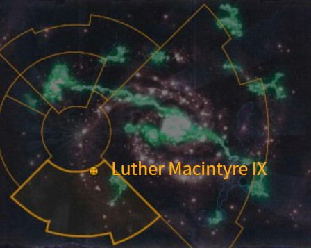

# 1087 卢瑟·麦金泰尔九号 Luther Macintyre IX

精校状态：中文行文已逐段精校，部分术语仍为暂定

分类：地理 / 小行星 / 暴风星域 Segmentum Tempestus

原文来源：https://www.bilibili.com/opus/1159885764049240064

原作者：帝国神选罐头

原文时间：2026年01月20日 15:49

[返回分类目录](目录.md) · [全书目录](../../目录.md)

<!-- A1087-B0001 图片 -->

<!-- A1087-B0002 -->

原译文

Map 地图

**校订译文**

Map 地图

<!-- /A1087-B0002 -->

<!-- A1087-B0003 -->
### Basic Data 基本资料

原题：Basic Data 基础数据

<!-- /A1087-B0003 -->

<!-- A1087-B0004 -->
**英文原文**

Name:Luther Macintyre IX

<!-- /A1087-B0004 -->

<!-- A1087-B0005 -->

原译文

名称：卢瑟·麦金泰尔九号

**校订译文**

名称：卢瑟·麦金泰尔九号

<!-- /A1087-B0005 -->

<!-- A1087-B0006 -->
**英文原文**

Segmentum:Segmentum Tempestus

<!-- /A1087-B0006 -->

<!-- A1087-B0007 -->

原译文

星域：暴风星域

**校订译文**

星域：暴风星域

<!-- /A1087-B0007 -->

<!-- A1087-B0008 -->
**英文原文**

Population:Approximately 16,000

<!-- /A1087-B0008 -->

<!-- A1087-B0009 -->

原译文

人口：约1,6000

**校订译文**

人口：约一万六千

<!-- /A1087-B0009 -->

<!-- A1087-B0010 -->
**英文原文**

Affiliation:Imperium

<!-- /A1087-B0010 -->

<!-- A1087-B0011 -->

原译文

隶属：帝国

**校订译文**

隶属：帝国

<!-- /A1087-B0011 -->

<!-- A1087-B0012 -->
**英文原文**

Class:Death World, possibly Tomb World

<!-- /A1087-B0012 -->

<!-- A1087-B0013 -->

原译文

类别：死亡世界，可能是坟墓世界

**校订译文**

类别：死亡世界，可能是坟墓世界

<!-- /A1087-B0013 -->

<!-- A1087-B0014 -->
**英文原文**

Tithe Grade:Solutio Tetrious

<!-- /A1087-B0014 -->

<!-- A1087-B0015 -->

原译文

什一税等级：第三级初等

**校订译文**

什一税等级：第三级初等

<!-- /A1087-B0015 -->

<!-- A1087-B0016 -->
**英文原文**

Luther Macintyre IX (also known as Luther McIntyre IX) is a desert death world in Segmentum Tempestus, notable for being the homeworld of the burrowing, desert-dwelling Ambull species.

<!-- /A1087-B0016 -->

<!-- A1087-B0017 -->

原译文

卢瑟·麦金泰尔九号（也称为卢瑟·麦金太尔九号）是暴风星域的一个沙漠死亡世界，以是穴居、沙漠栖息的安布尔种族的家园世界而闻名。

**校订译文**

卢瑟·麦金泰尔九号（英文亦作 Luther McIntyre IX）是暴风星域的一颗沙漠死亡世界，以穴居沙漠生物安布尔的原生地闻名。

**校注：** Macintyre与McIntyre为原文拼写变体，中文统一麦金泰尔，不将变体再造一个中文别名。

<!-- /A1087-B0017 -->

<!-- A1087-B0018 -->
## Overview 概述

<!-- /A1087-B0018 -->

<!-- A1087-B0019 -->
**英文原文**

Luther Macintyre IX is an Imperial Death World: the entire planet covered in vast deserts. The sandstorms that plague this world are capable of flaying a man's skin from his bones.

<!-- /A1087-B0019 -->

<!-- A1087-B0020 -->

原译文

卢瑟·麦金泰尔九号是一个帝国死亡世界：整个行星都被广袤的沙漠所覆盖。困扰这个世界的沙尘暴能够把一个人的皮肤从骨头上剥下来。

**校订译文**

这颗帝国死亡世界遍布广袤沙漠，肆虐的沙暴猛烈得足以将人的皮肉从骨头上剥离。

<!-- /A1087-B0020 -->

<!-- A1087-B0021 -->
**英文原文**

Luther Macintyre IX is also thought to be a possible Tomb World, as an Ambull colony was found on the Ice world Simia Orichalcae, having come through a Necron warp portal to that planet when the Necron portal was inadvertently activated by an Ork vessel exiting the warp over it. However, dozens of other planets have Ambull colonies, so it is equally likely that another planet with Ambulls was the origin of the creatures found on Simia Orichalcae.

<!-- /A1087-B0021 -->

<!-- A1087-B0022 -->

原译文

卢瑟·麦金泰尔九号也被认为是一个可能的坟墓世界，因为在冰雪世界西米亚·奥利哈康上发现了一个安布尔殖民地，当死灵传送门被一艘从亚空间离开的欧克飞船无意中激活时，它通过死灵亚空间传送门到达了那个行星。然而，其他几十个行星都有安布尔聚居地，所以同样有可能另一个有安布尔人的行星是西米亚·奥利哈康上发现的生物的起源。

**校订译文**

卢瑟·麦金泰尔九号也可能是一颗太空死灵墓穴世界。冰雪世界西米亚·奥利哈康曾出现一群安布尔：一艘欧克蛮人舰船在其上空脱离亚空间时，无意间激活了太空死灵传送门，安布尔便穿过门户来到该地。然而，另有数十颗行星也生活着安布尔，因此西米亚·奥利哈康上的群体同样可能来自别处。

**校注：** 安布尔为动物群，不应写安布尔人或政治殖民地；墓穴世界判断仅为推测，保留其他来源行星的可能。

<!-- /A1087-B0022 -->

<!-- A1087-B0023 -->
**英文原文**

The world is also known to have contained Mica-dragons, the teeth of which were used to create the mighty chainaxes Gorechild and Gorefather, wielded by the World Eaters' primarch, Angron, and subsequently by his equerry, Kharn the Betrayer.

<!-- /A1087-B0023 -->

<!-- A1087-B0024 -->

原译文

众所周知，世界上也有云母龙，它们的牙齿被用来制造强大的链锯斧血子和血父，由吞世者的原体安格隆和随后的侍从官背叛者卡恩使用。

**校订译文**

这里还曾生活着云母龙。它们的牙齿被用来打造强大的链锯斧“血子”和“血父”，由吞世者原体安格隆使用；原文随后又提及其侍从官背叛者卡恩继承使用这些武器。

**校注：** 原句把血子、血父合并列出后又说卡恩随后使用，未区分卡恩究竟继承哪一把；此为原文范围歧义，勿据此认定他同时使用二者。

<!-- /A1087-B0024 -->

<!-- A1087-B0025 -->
## Flora and Fauna 动植物

<!-- /A1087-B0025 -->

<!-- A1087-B0026 -->

原译文

Ambull 安布尔

**校订译文**

Ambull 安布尔

<!-- /A1087-B0026 -->

<!-- A1087-B0027 -->

原译文

Mica-dragon 云母龙

**校订译文**

Mica-dragon 云母龙

<!-- /A1087-B0027 -->

<!-- A1087-B0028 -->

原译文

Slasher Beast 杀戮兽

**校订译文**

Slasher Beast 杀戮兽

<!-- /A1087-B0028 -->

<!-- A1087-B0029 -->

原译文

Sunworm 太阳蠕虫

**校订译文**

Sunworm 太阳蠕虫

<!-- /A1087-B0029 -->

<!-- A1087-B0030 -->

原译文

Gas Fungus 气真菌

**校订译文**

Gas Fungus 气体真菌

<!-- /A1087-B0030 -->

本篇核心术语与暂定项

以下列出本篇出现的英文原形及核心术语表用词。同形词可能指不同对象，具体词义以本篇正文和校注为准；单复数、别名和仅见于图注的名称可能尚未列入。完整候选见[术语表](../../术语表/双语术语候选.csv)。

| 英文 | 采用中文 | 状态 |
| --- | --- | --- |
| World Eaters | 吞世者 | 官方已核对 |
| Warp | 亚空间 | 官方已核对 |
| Imperium | 帝国 | 暂定·简称 |
| Primarch | 原体 | 官方已核对 |
| Segmentum Tempestus | 暴风星域 | 暂定·官方待核 |
| Segmentum | 星域 | 暂定·官方待核 |
| Luther Macintyre IX | 卢瑟·麦金泰尔九号 | 暂定·官方待核 |
| Equerry | 近侍 | 暂定·官方待核 |
| Angron | 安格隆 | 官方已核对 |
| Death World | 死亡世界 | 暂定·官方待核 |
| Gorechild | 血子 | 暂定·官方待核 |
| Gorefather | 血父 | 暂定·官方待核 |
| Solutio Tetrious | 第三级初等 | 暂定·官方待核 |
| Ambull | 安布尔 | 暂定·官方待核 |
| Simia Orichalcae | 西米亚·奥利哈康 | 暂定·官方待核 |

