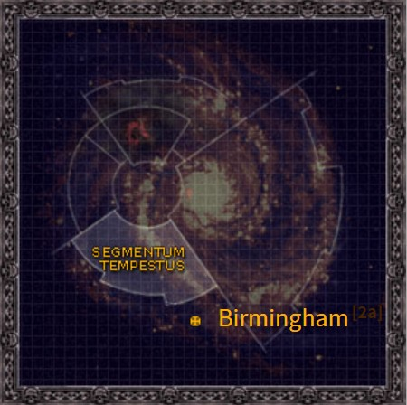

# 1088 伯明翰 Birmingham

精校状态：中文行文已逐段精校，部分术语仍为暂定

分类：地理 / 小行星 / 暴风星域 Segmentum Tempestus

原文来源：https://www.bilibili.com/opus/1160220659851198481

原作者：帝国神选罐头

原文时间：2026年01月21日 13:28

[返回分类目录](目录.md) · [全书目录](../../目录.md)

<!-- A1088-B0001 图片 -->

<!-- A1088-B0002 -->

原译文

Map 地图

**校订译文**

Map 地图

<!-- /A1088-B0002 -->

<!-- A1088-B0003 -->
### Basic Data 基本资料

原题：Basic Data 基础数据

<!-- /A1088-B0003 -->

<!-- A1088-B0004 -->
**英文原文**

Name:Birmingham

<!-- /A1088-B0004 -->

<!-- A1088-B0005 -->

原译文

名称：伯明翰

**校订译文**

名称：伯明翰

<!-- /A1088-B0005 -->

<!-- A1088-B0006 -->
**英文原文**

Segmentum:Segmentum Tempestus

<!-- /A1088-B0006 -->

<!-- A1088-B0007 -->

原译文

星域：暴风星域

**校订译文**

星域：暴风星域

<!-- /A1088-B0007 -->

<!-- A1088-B0008 -->
**英文原文**

Affiliation:Imperium

<!-- /A1088-B0008 -->

<!-- A1088-B0009 -->

原译文

隶属：帝国

**校订译文**

隶属：帝国

<!-- /A1088-B0009 -->

<!-- A1088-B0010 -->
**英文原文**

Class:Feral World, Adeptus Astartes Homeworld

<!-- /A1088-B0010 -->

<!-- A1088-B0011 -->

原译文

类别：蛮荒世界，阿斯塔特修会家园世界

**校订译文**

类别：蛮荒世界、阿斯塔特母星

<!-- /A1088-B0011 -->

<!-- A1088-B0012 -->
**英文原文**

Birmingham is a major regimental tithe world, recruiting between five and ten million Imperial Guardsmen every year.

<!-- /A1088-B0012 -->

<!-- A1088-B0013 -->

原译文

伯明翰是一个主要的兵团什一税世界，每年招募500万到1000万帝国卫兵。

**校订译文**

伯明翰是重要的兵源什一税世界，每年为帝国卫队征募五百万至一千万名士兵。

<!-- /A1088-B0013 -->

<!-- A1088-B0014 -->
**英文原文**

Birmingham is also the homeworld of the Harbingers Space Marine Chapter.

<!-- /A1088-B0014 -->

<!-- A1088-B0015 -->

原译文

伯明翰也是预兆者星际战士战团的家园世界。

**校订译文**

这里也是凶兆星际战士战团的母星。

<!-- /A1088-B0015 -->

<!-- A1088-B0016 -->
## History 历史

<!-- /A1088-B0016 -->

<!-- A1088-B0017 -->
**英文原文**

Birmingham is also known as the Black Planet, as it receives almost no visible light from its system's sun. As a result, the planet receives few visitors, and its inhabitants have become linguistically and culturally isolated. Its technology is primitive compared to the rest of the Imperium, as the musket is still in use among the natives.

<!-- /A1088-B0017 -->

<!-- A1088-B0018 -->

原译文

伯明翰也被称为黑星，因为它几乎不接收来自其星系太阳的可见光。因此，这个行星很少有游客，其居民在语言和文化上也变得孤立。与帝国的其他地区相比，它的技术是原始的，因为当地人仍在使用滑膛枪。

**校订译文**

伯明翰又称“黑星”，因为它几乎接收不到所在星系恒星的可见光。这里鲜有外来者，居民在语言和文化上逐渐与外界隔绝。其技术相较帝国其他地区十分落后，当地人仍使用滑膛火枪。

<!-- /A1088-B0018 -->

<!-- A1088-B0019 -->
**英文原文**

In 849.M41 all Imperial contact with Birmingham was lost. It was discovered that the entire planetary population had been massacred or captured by Dark Eldar raiders.

<!-- /A1088-B0019 -->

<!-- A1088-B0020 -->

原译文

849.M41，帝国与伯明翰失去了所有联系。人们发现，整个行星的人口都被黑暗灵族袭击者屠杀或俘虏了。

**校订译文**

849.M41，帝国与伯明翰的一切联系中断。随后发现，整颗行星的居民都被黑暗灵族劫掠者屠杀或掳走。

<!-- /A1088-B0020 -->

<!-- A1088-B0021 -->
**英文原文**

In 888.M41, the desolate world was again the site of conflict. This time the Daemonic horde of Skulltaker attempted to transform the planet into a Daemon world through dark rituals. Grey Knights managed to land on the planet, and Garran Crowe challenged the mighty daemon to single combat. Crowe managed to weaken the Daemon with a vial of the Emperor's tears, battling the Daemon to a standstill and buying enough time to win the day.

<!-- /A1088-B0021 -->

<!-- A1088-B0022 -->

原译文

888.M41，荒凉世界再次成为冲突的地点。这一次，夺颅者的恶魔部落试图通过黑暗仪式将这个行星变成一个恶魔世界。灰骑士成功登陆行星，加兰·克洛维向强大的恶魔发起了决斗的挑战。克洛维设法用一小瓶帝皇之泪削弱了恶魔，与恶魔战斗到停止，并争取到了足够的时间来赢得胜利。

**校订译文**

888.M41，这个荒凉世界再次爆发战事。夺颅者率恶魔大军，企图以黑暗仪式将它变成恶魔世界。灰骑士成功登陆，加兰·克罗向这名强大恶魔发起单挑。他以一小瓶帝皇之泪削弱对手，与其鏖战不分胜负，争取到足够时间，使己方最终获胜。

<!-- /A1088-B0022 -->

<!-- A1088-B0023 -->
## Trivia 琐事

<!-- /A1088-B0023 -->

<!-- A1088-B0024 -->
**英文原文**

The planet Birmingham is named for Birmingham, a major city in the West Midlands of the UK.

<!-- /A1088-B0024 -->

<!-- A1088-B0025 -->

原译文

伯明翰这个行星是以英国中西部的一个主要城市伯明翰命名的。

**校订译文**

行星伯明翰以英国西米德兰兹地区的主要城市伯明翰命名。

<!-- /A1088-B0025 -->

<!-- A1088-B0026 -->
**英文原文**

The nickname of "the black planet" may refer to the Black Country, an area of the West Midlands near Birmingham, so named for the amount of soot in the region's air as a result of being one of the hearts of the Industrial Revolution in the mid-19th century.

<!-- /A1088-B0026 -->

<!-- A1088-B0027 -->

原译文

“黑星”的绰号可能指的是中西部伯明翰附近的一个地区，该地区是19世纪中叶工业革命的中心之一，因此以该地区空气中的烟尘量命名。

**校订译文**

“黑星”这一别称可能影射伯明翰附近、西米德兰兹的“黑乡”地区。按底稿解释，该地曾是十九世纪中叶工业革命的重要中心，空气中烟尘浓重，因而得名。

**校注：** 黑乡名称起源为底稿提供的现实背景解释，本次未另核历史来源；保留“可能影射”的限定。

<!-- /A1088-B0027 -->

本篇核心术语与暂定项

以下列出本篇出现的英文原形及核心术语表用词。同形词可能指不同对象，具体词义以本篇正文和校注为准；单复数、别名和仅见于图注的名称可能尚未列入。完整候选见[术语表](../../术语表/双语术语候选.csv)。

| 英文 | 采用中文 | 状态 |
| --- | --- | --- |
| Adeptus Astartes | 阿斯塔特修会 | 官方已核对 |
| Grey Knights | 灰骑士 | 官方已核对 |
| Eldar | 灵族 | 暂定·语境区分 |
| Dark Eldar | 黑暗灵族 | 暂定·旧称对应 |
| Imperium | 帝国 | 暂定·简称 |
| Emperor | 帝皇 | 官方已核对 |
| Segmentum Tempestus | 暴风星域 | 暂定·官方待核 |
| Segmentum | 星域 | 暂定·官方待核 |
| Birmingham | 伯明翰 | 暂定·官方待核 |
| Space Marine | 星际战士 | 暂定·官方待核 |
| Chapter | 战团 | 暂定·官方待核 |
| Garran Crowe | 加兰·克罗 | 官方词根参考·全名待核 |
| Harbingers | 凶兆 | 暂定·官方待核 |
| Skulltaker | 夺颅者 | 官方已核对 |
| Horde | 部落 | 暂定·官方待核 |
| System | 星系（恒星系统） | 暂定·官方待核 |
| Feral World | 蛮荒世界 | 暂定·官方待核 |
| Black Planet | 黑星 | 暂定·官方待核 |

