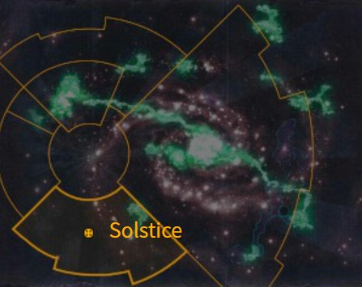

# 1089 至日星 Solstice

精校状态：中文行文已逐段精校，部分术语仍为暂定

分类：地理 / 小行星 / 暴风星域 Segmentum Tempestus

原文来源：https://www.bilibili.com/opus/1165485761423736839

原作者：帝国神选罐头

原文时间：2026年02月04日 18:00

[返回分类目录](目录.md) · [全书目录](../../目录.md)

<!-- A1089-B0001 图片 -->

<!-- A1089-B0002 -->

原译文

Map 地图

**校订译文**

Map 地图

<!-- /A1089-B0002 -->

<!-- A1089-B0003 -->
### Basic Data 基本资料

原题：Basic Data 基础数据

<!-- /A1089-B0003 -->

<!-- A1089-B0004 -->
**英文原文**

Name:Solstice

<!-- /A1089-B0004 -->

<!-- A1089-B0005 -->

原译文

名称：至日星

**校订译文**

名称：至日星

<!-- /A1089-B0005 -->

<!-- A1089-B0006 -->
**英文原文**

Segmentum:Segmentum Tempestus

<!-- /A1089-B0006 -->

<!-- A1089-B0007 -->

原译文

星域：暴风星域

**校订译文**

星域：暴风星域

<!-- /A1089-B0007 -->

<!-- A1089-B0008 -->
**英文原文**

Affiliation:Imperium

<!-- /A1089-B0008 -->

<!-- A1089-B0009 -->

原译文

隶属：帝国

**校订译文**

隶属：帝国

<!-- /A1089-B0009 -->

<!-- A1089-B0010 -->
**英文原文**

Class:Feudal World

<!-- /A1089-B0010 -->

<!-- A1089-B0011 -->

原译文

类别：封建世界

**校订译文**

类别：封建世界

<!-- /A1089-B0011 -->

<!-- A1089-B0012 -->
**英文原文**

Solstice is a primitive and "half-frozen" world reaching a feudal stage. It is religiously significant for being the world in which the missionary Uriah Jacobus uncovered and purged a Genestealer infestation.

<!-- /A1089-B0012 -->

<!-- A1089-B0013 -->

原译文

至日星是一个原始的、“半冻结”的世界，达到了封建阶段。这是一个具有宗教意义的世界，在这个世界里，传教士乌利亚·雅各布斯发现并清除了基因窃取者的侵扰。

**校订译文**

至日星是一个原始、半冻结的世界，社会处于封建阶段。传教士乌利亚·雅各布斯曾在这里发现并清除基因窃取者侵染，使这颗行星获得重要的宗教意义。

<!-- /A1089-B0013 -->

<!-- A1089-B0014 -->
## History 历史

<!-- /A1089-B0014 -->

<!-- A1089-B0015 -->
**英文原文**

The now-famous Jacobus came to the world in order to bring the worship of the Emperor, first spending three years gaining knowledge of the inhabitants of Solstice, before beginning to introduce the precepts of Imperial worship into Solstice's own disorganized religion.

<!-- /A1089-B0015 -->

<!-- A1089-B0016 -->

原译文

现在著名的雅各布斯来到这个世界是为了带来对帝皇的崇拜，他首先花了三年时间了解至日星的居民，然后开始将帝国崇拜的戒律引入至日星自己混乱的宗教。

**校订译文**

后来声名远扬的雅各布斯来到至日星传播帝皇信仰。他先用三年时间了解当地居民，再逐渐将帝皇崇拜的教义融入当地松散杂乱的宗教体系。

<!-- /A1089-B0016 -->

<!-- A1089-B0017 -->
**英文原文**

On meeting with the ruler of one the world's kingdoms, Jacobus spied a horrific four-armed statue of the realm's god of death. Recognizing the four-armed statue as the unmistakable mark of Genestealer infiltration, Jacobus persuaded the more friendly rulers of the planet to align with each other and attack the alien-subverted kingdom. As soon as Jacobus arrived at the head of the loyal army the terrible truth became apparent as his army was attacked by a swarm of Genestealers. Managing to smash through a screen of human Brood Brother, his knights reached the heart of the cult, slaying both the Patriarch and Magus. Thrown into disorientation and confusion at the sudden loss of their leaders, the rest of the cult were massacred in a final charge. The battle made Jacobus a legendary figure.

<!-- /A1089-B0017 -->

<!-- A1089-B0018 -->

原译文

在与世界上一个王国的统治者会面时，雅各布斯发现了一座可怕的四臂死神雕像。雅各布斯认识到这座四臂雕像是基因窃取者渗透的明确标志，他说服了行星上更友好的统治者相互结盟，攻击被异型颠覆的王国。雅各布一到达忠诚军队之首，可怕的事实就变得显而易见，因为他的军队遭到了一群基因窃取者的袭击。他的骑士们设法砸碎了人类兄弟的屏幕，到达了教派的中心，杀死了族长和主教。由于突然失去领袖，其他教派成员陷入迷失方向和混乱，在最后的冲锋中被屠杀。这场战斗使雅各布斯成为传奇人物。

**校订译文**

拜访当地一位国王时，雅各布斯看到一尊可怖的四臂死神像，认出那是基因窃取者渗透的明确标志。他说服其他较为友好的统治者结盟，进攻已被异形颠覆的王国。雅各布斯率忠诚军队抵达后，一大群基因窃取者立即扑来，可怕的真相就此暴露。他麾下的骑士突破人类族裔兄弟组成的掩护防线，杀入教派核心，斩杀族长和占星师。骤失领袖的教徒陷入混乱，在最后一次冲锋中被悉数消灭。这场战斗使雅各布斯成为传奇人物。

**校注：** screen指掩护防线而非屏幕；Brood Brothers依官方词根族裔兄弟，Magus为基因窃取者教派占星师，非教会主教。骑士为本地封建骑兵，不能推定Imperial Knights机甲。

<!-- /A1089-B0018 -->

本篇核心术语与暂定项

以下列出本篇出现的英文原形及核心术语表用词。同形词可能指不同对象，具体词义以本篇正文和校注为准；单复数、别名和仅见于图注的名称可能尚未列入。完整候选见[术语表](../../术语表/双语术语候选.csv)。

| 英文 | 采用中文 | 状态 |
| --- | --- | --- |
| Imperium | 帝国 | 暂定·简称 |
| Patriarch | 族长 | 官方已核对 |
| Emperor | 帝皇 | 官方已核对 |
| Segmentum Tempestus | 暴风星域 | 暂定·官方待核 |
| Segmentum | 星域 | 暂定·官方待核 |
| Solstice | 至日星 | 暂定·官方待核 |
| Missionary | 传教士 | 暂定 |
| Brother | 修士 | 暂定·官方待核 |
| Magus | 占星师 | 官方已核对 |
| Feudal World | 封建世界 | 暂定·官方待核 |
| Missionary Uriah Jacobus | 传教士乌利亚·雅各布斯 | 暂定·官方待核 |
| Uriah Jacobus | 乌利亚·雅各布斯 | 暂定·官方待核 |

