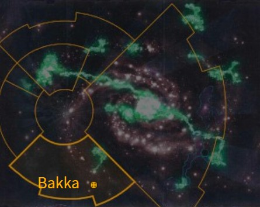

# 1090 巴卡 Bakka

精校状态：中文行文已逐段精校，部分术语仍为暂定

分类：地理 / 小行星 / 暴风星域 Segmentum Tempestus

原文来源：https://www.bilibili.com/opus/1167256146948390945

原作者：帝国神选罐头

原文时间：2026年02月09日 12:30

[返回分类目录](目录.md) · [全书目录](../../目录.md)

<!-- A1090-B0001 图片 -->

<!-- A1090-B0002 -->

原译文

Map 地图

**校订译文**

Map 地图

<!-- /A1090-B0002 -->

<!-- A1090-B0003 -->
### Basic Data 基本资料

原题：Basic Data 基础数据

<!-- /A1090-B0003 -->

<!-- A1090-B0004 -->
**英文原文**

Name:Bakka

<!-- /A1090-B0004 -->

<!-- A1090-B0005 -->

原译文

名称：巴卡

**校订译文**

名称：巴卡

<!-- /A1090-B0005 -->

<!-- A1090-B0006 -->
**英文原文**

Segmentum:Segmentum Tempestus

<!-- /A1090-B0006 -->

<!-- A1090-B0007 -->

原译文

星域：暴风星域

**校订译文**

星域：暴风星域

<!-- /A1090-B0007 -->

<!-- A1090-B0008 -->
**英文原文**

Affiliation:Imperium

<!-- /A1090-B0008 -->

<!-- A1090-B0009 -->

原译文

隶属：帝国

**校订译文**

隶属：帝国

<!-- /A1090-B0009 -->

<!-- A1090-B0010 -->
**英文原文**

Class:Segmentum Fortress

<!-- /A1090-B0010 -->

<!-- A1090-B0011 -->

原译文

类别：星域堡垒

**校订译文**

类别：星域堡垒

<!-- /A1090-B0011 -->

<!-- A1090-B0012 -->
**英文原文**

Bakka is the Naval Base for Segmentum Tempestus. It co-ordinates all naval forces in the region and dispatches ships when needed.

<!-- /A1090-B0012 -->

<!-- A1090-B0013 -->

原译文

巴卡是暴风星域的海军基地。它协调该地区的所有海军部队，并在需要时派遣舰船。

**校订译文**

巴卡是暴风星域的海军基地，负责统筹域内所有海军兵力，并按需要调遣舰船。

<!-- /A1090-B0013 -->

<!-- A1090-B0014 -->
## Overview 概述

<!-- /A1090-B0014 -->

<!-- A1090-B0015 -->
**英文原文**

Bakka is a young world, highly rich in mineral wealth. This led to its colonization by humans sometime during the Dark Age of Technology. The surface of the planet is a sea of lava on the surface of which floats black islands of basalt and granite. Occasionally, turbulent flow or a meteorite strikes cause fresh magma to burst from the ground. Giant machines manned by forced laborers constantly mine the world for its rich resources. The vast installations of the planet are built on the stable black rafts of rock, defended by adamantium walls and Defense Laser and Torpedo installations. Above these installations sit the vast shipyards of the Segmentum Tempestus Naval Base.

<!-- /A1090-B0015 -->

<!-- A1090-B0016 -->

原译文

巴卡是一个年轻的世界，矿产资源非常丰富。这导致了它在黑暗技术时代的某个时候被人类殖民。行星表面是一片熔岩海，其表面漂浮着玄武岩和花岗岩的黑色岛屿。偶尔，湍流或陨石撞击会导致新鲜岩浆从地面喷出。由强迫劳工操控的巨型机器不断开采世界丰富的资源。这个行星上巨大的设施建在稳定的黑色岩石筏上，由精金墙和防御激光和鱼雷设施防御。在这些设施之上，坐落着暴风星域海军基地的大型造船厂。

**校订译文**

巴卡是一颗年轻且矿产极其丰富的行星，人类因此在黑暗科技时代前来殖民。地表是一片熔岩海，黑色玄武岩和花岗岩岛屿漂浮其上；湍流或陨石撞击偶尔会使新岩浆喷涌。苦役劳工操作巨型机器，不断开采矿藏。庞大的设施建在相对稳定、筏子般的黑色岩盘上，由精金围墙、防御激光炮和鱼雷阵地守卫。再往上方，便是暴风星域海军基地的巨型造船厂。

<!-- /A1090-B0016 -->

<!-- A1090-B0017 -->
**英文原文**

Bakka's atmosphere is hot, acidic, and poisonous, consisting of oxides of nitrous, sulphur, and sodium mixed with ammonia. As a result of it's toxic atmosphere, loss rates among the miners are substantial.

<!-- /A1090-B0017 -->

<!-- A1090-B0018 -->

原译文

巴卡的大气是热的、酸性的、有毒的，由氮、硫和钠的氧化物与氨混合而成。由于其有毒的大气，矿工的损失率很高。

**校订译文**

巴卡大气灼热、酸性强且有毒，含氮、硫和钠的氧化物，并混有氨。恶劣空气使矿工伤亡率居高不下。

**校注：** 原文大气成分称oxides of nitrous等，语法与化学描述不严谨，依原稿概括保留，不补写分子式。

<!-- /A1090-B0018 -->

<!-- A1090-B0019 -->
**英文原文**

Bakka fields their own Fleet-Based Regiments called the Bakkan Irregulars that specializes in mass troop movements and operate from Bakka's Naval base.

<!-- /A1090-B0019 -->

<!-- A1090-B0020 -->

原译文

巴卡部署了自己的舰基兵团，称为巴卡非正规军，专门从事大规模部队调动，并在巴卡的海军基地开展行动。

**校订译文**

巴卡还有自己的舰队驻扎团，称为“巴卡非正规军”，以海军基地为出发地，擅长大规模兵力转运。

<!-- /A1090-B0020 -->

<!-- A1090-B0021 -->
## History 历史

<!-- /A1090-B0021 -->

<!-- A1090-B0022 -->
**英文原文**

In 300.M36, the Plague of Unbelief, formed a minor empire that believed the Emperor was no longer able to rule the galaxy, stretching from Bakka in the galactic south to Fenris in the galactic north. The Space Wolves were able to repel the invading fleet after a protracted fight at The Fang.

<!-- /A1090-B0022 -->

<!-- A1090-B0023 -->

原译文

300.M36，无信瘟疫形成了一个小帝国，认为帝皇不再能够统治银河系，从银河系南部的巴卡延伸到银河系北部的芬里斯。太空野狼在长牙堡经过长时间的战斗后击退了入侵的舰队。

**校订译文**

300.M36，无信瘟疫期间兴起一个割据帝国，认为帝皇已无力统治银河，其势力从银河南部的巴卡延伸至北方的芬里斯。太空野狼在长牙堡经历持久战后，成功击退入侵舰队。

<!-- /A1090-B0023 -->

<!-- A1090-B0024 -->
**英文原文**

In 745.M41, during the First Tyrannic War, a battlefleet was dispatched to aid the Ultramarines at the Battle for Macragge. They were ultimately successful, but suffered heavy losses to the xenos.

<!-- /A1090-B0024 -->

<!-- A1090-B0025 -->

原译文

745.M41，在第一次泰伦战争期间，一支战斗舰队被派往支援马库拉格之战中的极限战士。他们最终取得了成功，但遭受了巨大的损失。

**校订译文**

745.M41，第一次泰伦战争期间，巴卡派出战斗舰队，支援马库拉格之战中的极限战士。援军最终取胜，却在与异形的战斗中损失惨重。

<!-- /A1090-B0025 -->

<!-- A1090-B0026 -->
**英文原文**

In 980.M41, Bakka was subjected to a major raid by the Red Corsairs fleet led personally by Huron Blackheart.

<!-- /A1090-B0026 -->

<!-- A1090-B0027 -->

原译文

980.M41，巴卡遭到休伦·黑心亲自率领的红海盗舰队的一次重大突袭。

**校订译文**

980.M41，巴卡遭到休伦·黑心亲自率领的红海盗舰队的一次重大突袭。

<!-- /A1090-B0027 -->

<!-- A1090-B0028 -->
**英文原文**

In 999.M41, Dark Eldar raiders managed to raid the Imperial Navy's moorings orbiting Bakka.

<!-- /A1090-B0028 -->

<!-- A1090-B0029 -->

原译文

999.M41，黑暗灵族袭击者成功袭击了帝国海军在巴卡轨道上的停泊处。

**校订译文**

999.M41，黑暗灵族袭击者成功袭击了帝国海军在巴卡轨道上的停泊处。

<!-- /A1090-B0029 -->

<!-- A1090-B0030 -->
**英文原文**

In M42 during the Noctis Aeterna, Bakka was besieged by an unknown threat but relieved by Indomitus Crusade Fleet Octus.

<!-- /A1090-B0030 -->

<!-- A1090-B0031 -->

原译文

在M42中，在永恒之夜期间，巴卡被一个未知的威胁包围，但被不屈远征第八舰队解救。

**校订译文**

M42，永恒之夜期间，巴卡遭到来历不明的敌人围攻，最终由不屈远征第八舰队解围。

<!-- /A1090-B0031 -->

本篇核心术语与暂定项

以下列出本篇出现的英文原形及核心术语表用词。同形词可能指不同对象，具体词义以本篇正文和校注为准；单复数、别名和仅见于图注的名称可能尚未列入。完整候选见[术语表](../../术语表/双语术语候选.csv)。

| 英文 | 采用中文 | 状态 |
| --- | --- | --- |
| Space Wolves | 太空野狼 | 官方已核对 |
| Eldar | 灵族 | 暂定·语境区分 |
| Dark Eldar | 黑暗灵族 | 暂定·旧称对应 |
| Ultramarines | 极限战士 | 官方已核对 |
| Imperium | 帝国 | 暂定·简称 |
| Imperial Navy | 帝国海军 | 暂定 |
| Dark Age of Technology | 黑暗科技时代 | 暂定 |
| Indomitus | 不屈学派 | 暂定·学派语境 |
| Emperor | 帝皇 | 官方已核对 |
| Indomitus Crusade | 不屈远征 | 暂定·官方待核 |
| Segmentum Tempestus | 暴风星域 | 暂定·官方待核 |
| Segmentum | 星域 | 暂定·官方待核 |
| Fenris | 芬里斯 | 暂定·官方待核 |
| Bakka | 巴卡 | 暂定·官方待核 |
| Macragge | 马库拉格 | 暂定·官方待核 |
| Torpedo | 鱼雷 | 暂定·官方待核 |
| Xenos | 异形 | 暂定·官方待核 |
| Ordinates | 政员 | 暂定·官方待核 |
| The Dark | 《黑暗》 | 暂定·官方待核 |
| Segmentum Fortress | 星域堡垒 | 暂定·官方待核 |
| Noctis Aeterna | 永恒之夜 | 暂定·官方待核 |
| Huron Blackheart | 休伦·黑心 | 官方已核对 |
| Plague of Unbelief | 无信瘟疫 | 暂定·官方待核 |
| Bakkan Irregulars | 巴卡非正规军 | 暂定·官方待核 |

